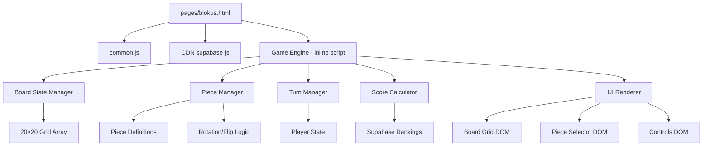
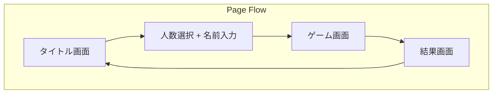

# Design Document: Blokus Game

## Overview

ブロックスは2〜4人がローカルで交代プレイするボードゲーム。20×20グリッドにポリオミノピースを配置し、スコアを競う。既存ゲーム（tetris.html, blast.html）と同じパターンで、単一HTMLファイル `pages/blokus.html` として実装する。

### 設計方針

- 既存パターン準拠: `sbClient = client`、`isNightTime()`、CDN supabase-js + common.js
- DOM描画: 20×20グリッドはCSS Gridで描画（blast.htmlのDOMグリッドパターンを踏襲）
- 単一HTML: ゲームロジックは `<script>` 内に記述（外部JS分離は規模次第で将来検討）
- タッチ優先: スマホ360px以上対応、タップ操作でピース選択→配置

## Architecture



### 画面構成



### 画面レイアウト（ゲーム中）

```
┌─────────────────────────────┐
│ ← ターン: 🟦 たろう  🏠    │ ← ヘッダー
├─────────────────────────────┤
│                             │
│      20×20 ボード           │ ← メインエリア
│      (CSS Grid)             │
│                             │
├─────────────────────────────┤
│ [↻回転] [↔反転] [パス]     │ ← 操作ボタン
├─────────────────────────────┤
│ ピース一覧（横スクロール     │ ← ピースセレクター
│  + 折り返し）               │
└─────────────────────────────┘
```

## Components and Interfaces

### 1. Game State

```javascript
// ゲーム全体の状態
const gameState = {
  phase: 'title' | 'setup' | 'playing' | 'over',
  board: Array(20).fill(null).map(() => Array(20).fill(null)),
  players: [
    { color: 'blue', name: '', pieces: [...], passed: false },
    { color: 'red', name: '', pieces: [...], passed: false },
    { color: 'green', name: '', pieces: [...], passed: false },
    { color: 'yellow', name: '', pieces: [...], passed: false }
  ],
  mode: 2 | 3 | 4,
  currentTurn: 0,        // 0-3 (色のインデックス)
  selectedPieceIdx: -1,
  rotation: 0,           // 0, 1, 2, 3 (90°刻み)
  flipped: false,
  selectedPosition: null // null | {x, y} — ボード上のプレビュー配置位置
};
```

#### 2人モードの名前割り当て

2人モードでは players 配列の4色に対しチーム名を設定する:

- Team A (blue + red): 両方に同じ名前を設定（例: `players[0].name = players[1].name = "たろう"`）
- Team B (green + yellow): 両方に同じ名前を設定（例: `players[2].name = players[3].name = "じろう"`）

SetupScreen では「チームA の名前」「チームB の名前」の2入力欄のみ表示する。

### 2. Piece Definition Interface

```javascript
// ピース定義（Appendix A準拠）
const PIECES = [
  { id: 'I1', cells: [[0,0]] },
  { id: 'I2', cells: [[0,0],[1,0]] },
  // ... 全21種
];

// 色定義
const PLAYER_COLORS = {
  blue: { fill: '#1976d2', light: '#42a5f5', label: '🟦' },
  red: { fill: '#d32f2f', light: '#ef5350', label: '🟥' },
  green: { fill: '#388e3c', light: '#66bb6a', label: '🟩' },
  yellow: { fill: '#f9a825', light: '#ffee58', label: '🟨' }
};
```

### 3. Core Functions Interface

```javascript
// ピース変換
function rotatePiece(cells, times) → cells
function flipPiece(cells) → cells
function transformPiece(cells, rotation, flipped) → cells

// 配置検証
function canPlace(board, cells, x, y, playerColor, isFirstPiece) → boolean
function checkCornerRule(board, cells, x, y, playerColor) → boolean
function checkNoEdgeTouch(board, cells, x, y, playerColor) → boolean
function checkStartingCorner(cells, x, y, playerColor) → boolean

// 合法位置計算（パフォーマンス注記は後述）
function getLegalPositions(board, piece, playerColor, isFirstPiece) → [{x, y}]

// 配置実行
function placePiece(board, cells, x, y, playerColor) → newBoard

// ターン管理
// 重要: advanceTurn()を呼ぶ前に必ずisGameOver()チェックを行うこと。
// 全員passの場合にadvanceTurnが無限ループするのを防止する。
// 呼び出し順序: if (isGameOver(gameState)) { endGame(); } else { advanceTurn(gameState); }
function advanceTurn(gameState) → nextTurnIndex
function isGameOver(gameState) → boolean

// スコア計算
function calculateScore(player) → number
function calculateTeamScore(player1, player2) → number

// 勝者判定
// 戻り値: { isDraw: boolean, winnerIndices: number[] }
// winnerIndices: 勝者の色インデックス配列（2人モードではチームインデックス[0]or[1]）
function determineWinner(gameState) → { isDraw, winnerIndices }
```

### 4. Legal Highlight パフォーマンス戦略

`getLegalPositions()` は全400マス × 回転反転 × Corner判定を計算する重い処理。以下の最適化を行う:

- **再計算タイミング**: ピース選択/回転/反転が変更されたときのみ再計算
- **キャッシュ**: 同一 piece + rotation + flip の組み合わせで結果をキャッシュし再計算を防止
- **UI更新**: `requestAnimationFrame` でハイライトのDOM更新をバッチ化し、フレーム落ちを防ぐ
- **計算スレッド**: メインスレッドで実行（Web Worker不使用、コード複雑度を抑える）
- **ハイライト表現**: セル中央に薄い緑の小さなドット（4px程度）を描画。セル全体を塗ると盤面が見づらくなるため控えめな表現とする

### 5. UI Components

| コンポーネント | 役割 |
|---|---|
| TitleScreen | タイトル（開始/ランキング） |
| SetupScreen | 人数選択 + 名前入力（2人モード: Team A Name, Team B Name の2入力） |
| BoardGrid | 20×20 DOM グリッド |
| PieceSelector | 手持ちピース一覧（5マス→4マス→3マス→2マス→1マスのグループ表示） |
| ControlBar | 回転・反転・パスボタン |
| TurnIndicator | 現在のターン表示 |
| ResultOverlay | ゲーム結果 |
| RankingModal | 勝利数ランキング |

## Data Models

### Board (in-memory)

```javascript
// 20×20配列。null=空、'blue'/'red'/'green'/'yellow'=プレイヤーの色
board[y][x] = null | 'blue' | 'red' | 'green' | 'yellow'
```

### Player State (in-memory)

```javascript
{
  color: string,           // 'blue' | 'red' | 'green' | 'yellow'
  name: string,            // プレイヤー名（2人モードではチーム内の2色が同じ名前）
  pieces: boolean[21],     // 各ピースの使用状態（true=未使用）
  passed: boolean,         // パス済みフラグ
  lastPieceSize: number    // 最後に配置したピースのマス数（ボーナス計算用）
}
```

### Supabase: blokus_rankings テーブル

```sql
CREATE TABLE blokus_rankings (
  id UUID PRIMARY KEY DEFAULT gen_random_uuid(),
  name TEXT UNIQUE NOT NULL,
  wins INT NOT NULL DEFAULT 1,
  created_at TIMESTAMPTZ DEFAULT now()
);
```

INSERT方式（upsert）:

```sql
INSERT INTO blokus_rankings (name, wins)
VALUES ($1, 1)
ON CONFLICT (name) DO UPDATE SET wins = blokus_rankings.wins + 1;
```

### localStorage キー

| キー | 用途 | 形式 |
|---|---|---|
| blokus_player_names | 過去に使用した名前リスト | JSON配列 `["たろう","じろう"]` |


## Correctness Properties

*A property is a characteristic or behavior that should hold true across all valid executions of a system—essentially, a formal statement about what the system should do. Properties serve as the bridge between human-readable specifications and machine-verifiable correctness guarantees.*

### Property 1: Turn progression skips passed and inactive players

*For any* game state with a mix of active and passed/inactive players, calling `advanceTurn` should return the index of the next player who is both active (in the current mode) and not passed, cycling through the fixed order (blue→red→green→yellow).

**Validates: Req 2 AC5, Req 2 AC7, Req 7 AC1, Req 7 AC5**

### Property 2: Team score equals sum of individual scores

*For any* two player states belonging to the same team (in 2-player mode), the team score should equal `calculateScore(player1) + calculateScore(player2)`.

**Validates: Req 2 AC6, Req 8 AC6**

### Property 3: Rotation identity

*For any* piece (set of cells), applying `rotatePiece` four times should produce a set of cells equivalent to the original (after normalization to origin).

**Validates: Req 5 AC3**

### Property 4: Flip involution

*For any* piece (set of cells), applying `flipPiece` twice should produce a set of cells equivalent to the original.

**Validates: Req 5 AC4**

### Property 5: Placement validation correctness

*For any* board state, piece, position (x, y), player color, and first-piece flag, `canPlace` returns true if and only if ALL of:
- No cell extends outside the 20×20 grid
- No cell overlaps an existing piece on the board
- If first piece: at least one cell covers the player's starting corner
- If not first piece: at least one cell is diagonally adjacent to a same-color cell on the board, AND no cell is orthogonally adjacent to a same-color cell on the board

**Validates: Req 6 AC3, Req 6 AC4, Req 6 AC5, Req 6 AC6**

### Property 6: Legal highlight positions match canPlace

*For any* piece (with current rotation/flip), board state, and player, the set of highlighted legal positions should exactly equal the set of positions `(x, y)` for which `canPlace` returns true.

**Validates: Req 6.5 AC1, Req 6.5 AC3**

### Property 7: All-passed implies game over

*For any* game state where all active players (based on mode: 4 in 4-player, 3 in 3-player, 4 colors in 2-player) have `passed === true`, `isGameOver` should return true.

**Validates: Req 7 AC6**

### Property 8: Score formula correctness

*For any* player state with an arbitrary subset of remaining pieces, `calculateScore` should return `0 - (total remaining cells) + bonus`, where bonus is +15 if all 21 pieces were placed, and an additional +5 if the last placed piece was the 1-cell monomino.

**Validates: Req 8 AC2**

### Property 9: Winner determination

*For any* set of player scores (2-4 players), the winner should be the player with the strictly maximum score. If multiple players share the maximum score, the result should be a draw.

**Validates: Req 8 AC3, Req 8 AC4**

### Property 10: First piece validity

*For any* player color, the first valid placement must cover that color's starting corner cell (one of the board's four corners assigned to that color).

**Validates: Req 6 AC6**

### Property 11: Piece conservation

*For any* completed move, the number of occupied cells added to the board must equal the size of the placed piece.

**Validates: Req 6 AC2**

## Error Handling

| シナリオ | 対応 |
|---|---|
| 不正な配置（ルール違反） | プレビューを赤くフラッシュ、配置を拒否、エラーメッセージ不要（ハイライトで合法位置を示す） |
| Supabase接続エラー（ランキング） | ランキング保存失敗をconsole.errorで記録、ユーザーには通知しない（ゲームプレイに影響なし） |
| localStorage書き込み失敗 | try-catchで捕捉、console.warnで記録し処理続行（名前候補程度では容量超過しないため簡素対応） |
| 夜間制限 | ゲーム画面全体を夜間メッセージで覆う（既存パターンと同じ） |
| 全員パス | isGameOver()で検知後ゲーム終了処理を発動（advanceTurnより前に判定） |

## Testing Strategy

### PBT適用性の判断

この機能はゲームロジック（純粋関数）が中心であり、Property-Based Testingに適している。特に配置検証（`canPlace`）、ピース変換（回転・反転）、スコア計算、ターン管理は入力空間が広く、PBTで多くのエッジケースを発見できる。

### テスト構成

**Property-Based Tests (fast-check)**:
- 最低100イテレーション/プロパティ
- 対象: rotatePiece, flipPiece, canPlace, getLegalPositions, advanceTurn, calculateScore, determineWinner, placePiece
- タグ形式: `Feature: blokus-game, Property N: ...`

**Unit Tests (example-based)**:
- ピース定義の正確性（21種、正しいセル数）
- 各モードの初期設定（色割り当て、開始角）
- パス確認ダイアログのフロー
- 夜間制限表示
- 2人モードの名前割り当て（Team A/B）

**Integration Tests**:
- Supabaseランキング保存/取得（upsert動作確認）
- game_publish フラグによる表示制御

### テストライブラリ

- Property-based: [fast-check](https://github.com/dubzzz/fast-check)
- Test runner: Vitest (既存プロジェクトにpackage.jsonがあるため)
- テスト対象のゲームロジックはES Modulesとして抽出可能な純粋関数群

### テストファイル構成

```
tests/
  blokus/
    piece-transform.property.test.js   # Property 3, 4
    placement.property.test.js         # Property 5, 6, 10, 11
    turn-management.property.test.js   # Property 1, 7
    score.property.test.js             # Property 2, 8, 9
    blokus.unit.test.js                # Example-based tests
```
