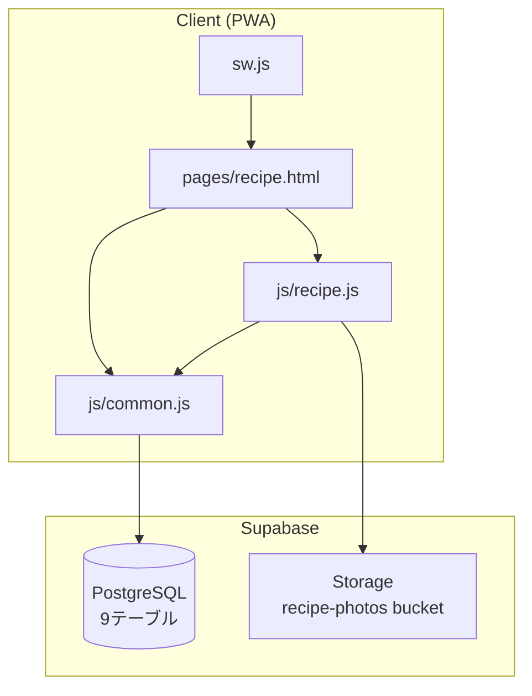
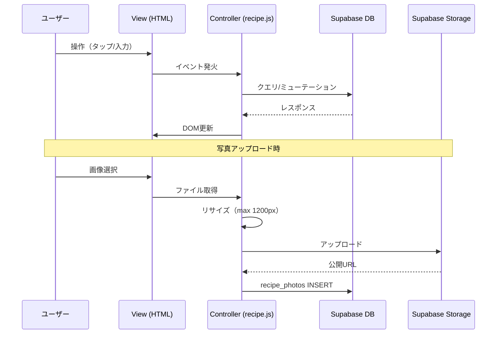
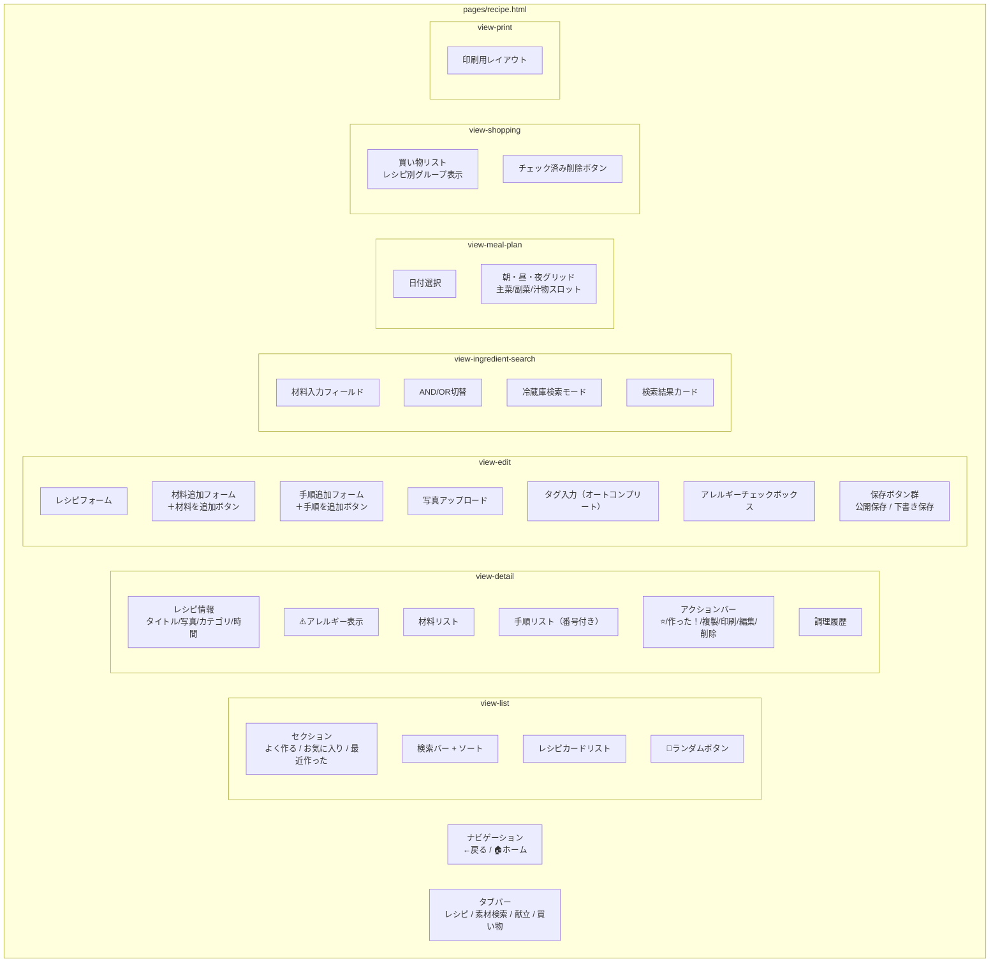

# Design Document: 家族レシピ管理機能 (family-recipe)

## Overview

家族向けお小遣い管理PWAの新機能として、クックパッド風のレシピ管理機能を`pages/recipe.html`に実装する。単一HTMLページ＋ハッシュルーティングで画面切替を行い、`js/recipe.js`にロジックを集約する。データはSupabase（PostgreSQL + Storage）に保存し、家族間で共有する。

### 技術スタック
- フロントエンド: Vanilla JS（既存パターン準拠）
- バックエンド: Supabase (PostgreSQL + Storage)
- ホスティング: GitHub Pages（既存PWA内）
- キャッシュ: Service Worker (sw.js)

### 設計方針
- 既存のcommon.js（Supabaseクライアント初期化、deviceRole管理）を共用
- ハッシュルーティング（`#list`, `#detail/{id}`, `#edit/{id}`, `#print/{id}`）で画面切替
- 子供が使いやすい大きなボタン・シンプルな画面構成
- レスポンシブ対応（モバイルファースト）

## Architecture

### システム構成図



### データフロー



## Components and Interfaces

### ハッシュルーティング設計

| ハッシュ | 画面 | 説明 |
|----------|------|------|
| `#list` (デフォルト) | レシピ一覧 | カード一覧＋検索＋タブ切替 |
| `#detail/{id}` | レシピ詳細 | 全情報表示＋アクションボタン |
| `#edit` | 新規登録 | 空フォーム |
| `#edit/{id}` | 編集 | 既存データ入力済みフォーム |
| `#print/{id}` | 印刷モード | 印刷用レイアウト |

### UIコンポーネント構成



### 主要関数シグネチャ (js/recipe.js)

```javascript
// === ルーティング ===
function initRouter()                    // hashchange リスナー登録
function navigateTo(hash)                // location.hash 変更
function handleRoute()                   // 現在のhashに応じたview表示

// === レシピ一覧 ===
async function loadRecipeList(options)   // options: {sort, filter, search, tab}
function renderRecipeCard(recipe)        // レシピカードHTML生成
async function loadTopSections()         // よく作る/お気に入り/最近作った

// === レシピ詳細 ===
async function loadRecipeDetail(id)      // 詳細データ取得＋表示
function renderIngredients(ingredients)  // 材料リスト描画
function renderSteps(steps)              // 手順リスト描画（sort_order昇順で番号付与）

// === レシピ登録/編集 ===
async function loadEditForm(id)          // 編集フォーム初期化（idなし→新規）
function addIngredientRow(data)          // 材料行追加
function addStepRow(data)                // 手順行追加
function initDragDrop(container)         // ドラッグ&ドロップ初期化
async function saveRecipe(status)        // status: 'published'|'draft'|'private'
function validateRecipeForm(status)      // バリデーション（draftはtitle不要）

// === 検索 ===
async function searchByText(query)       // テキスト検索（title, description, category, author, tags）
async function searchByIngredients(names, mode)  // 材料逆引き（mode: 'and'|'or'）
async function searchFridge(names)       // 冷蔵庫検索（不足2品以内）

// === 写真 ===
async function uploadPhoto(file, recipeId)  // リサイズ＋アップロード＋DB保存
function resizeImage(file, maxWidth)        // Canvas使用でリサイズ → Blob返却
function validateImageFile(file)            // 形式・サイズチェック

// === お気に入り/調理記録 ===
async function toggleFavorite(recipeId)     // お気に入りトグル
async function recordCook(recipeId)         // 調理記録追加
function getCurrentUserName()               // localStorage or prompt で取得

// === タグ ===
function normalizeTag(tag)                  // trim + lowercase
async function loadTagSuggestions(prefix)   // オートコンプリート候補
function isAllergyTag(tag)                  // "allergy:" プレフィックス判定

// === 買い物リスト ===
async function addToShoppingList(recipeId, ingredients)  // 選択材料を追加
async function loadShoppingList()           // 買い物リスト取得＋レシピ別グループ化
function mergeQuantities(items)             // 同名材料の数量合算ロジック
function parseQuantity(str)                 // "300g" → {value:300, unit:"g"}

// === 献立 ===
async function loadMealPlan(date)           // 指定日の献立取得
async function saveMealPlan(date, mealType, slots)  // 献立保存

// === ランダム/複製/印刷 ===
async function getRandomRecipe(category)    // ランダム選択
async function duplicateRecipe(id)          // レシピ複製（写真除く）
function showPrintView(id)                  // 印刷モード表示
```

## Data Models

### データベーススキーマ（9テーブル）

要件ドキュメントで定義済みのスキーマをそのまま採用する。

| テーブル | 概要 | 主要カラム |
|----------|------|-----------|
| `recipes` | レシピ本体 | id, title, description, author, category, cook_time_minutes, servings, status, created_at, updated_at |
| `recipe_ingredients` | 材料 | id, recipe_id, name, quantity, memo, sort_order |
| `recipe_steps` | 手順 | id, recipe_id, description, sort_order |
| `recipe_photos` | 写真 | id, recipe_id, step_id, url, type, sort_order, caption, created_at |
| `recipe_tags` | タグ | id, recipe_id, tag |
| `recipe_favorites` | お気に入り | id, recipe_id, user_name, created_at |
| `recipe_cook_history` | 調理履歴 | id, recipe_id, user_name, created_at |
| `shopping_list` | 買い物リスト | id, recipe_id, ingredient_name, quantity, checked, created_at |
| `meal_plans` | 献立 | id, plan_date, meal_type, main_dish_id, side_dish_id, soup_id, created_at, updated_at |

### Supabase Storage設計

- バケット名: `recipe-photos`
- パス構造: `{recipe_id}/{uuid}.{ext}`
- 公開アクセス: true
- ファイルサイズ上限: 3MB
- 対応形式: image/jpeg, image/png, image/webp
- クライアント側リサイズ: 最大幅1200px（Canvas API使用）

### Supabaseクエリパターン

```javascript
// レシピ一覧（公開のみ、更新日降順）
const { data } = await client
  .from('recipes')
  .select('*, recipe_photos(url, sort_order), recipe_tags(tag), recipe_favorites(user_name)')
  .eq('status', 'published')
  .order('updated_at', { ascending: false });

// 材料逆引き（AND検索）
const { data } = await client
  .from('recipe_ingredients')
  .select('recipe_id, name')
  .or(names.map(n => `name.ilike.%${n}%`).join(','));

// お気に入りトグル（upsert / delete）
await client.from('recipe_favorites')
  .upsert({ recipe_id: id, user_name: userName }, { onConflict: 'recipe_id,user_name' });

// 買い物リスト（レシピ別グループ化はJS側で実施）
const { data } = await client
  .from('shopping_list')
  .select('*, recipes(title)')
  .order('created_at', { ascending: true });
```

### localStorage キー（レシピ機能用）

| キー | 用途 | 永続性 |
|------|------|--------|
| `recipe_user_name` | レシピ操作時のユーザー名 | 永続 |
| `recipe_draft_form` | フォーム一時保存（ブラウザクラッシュ対策） | 保存成功で削除 |


## Correctness Properties

*A property is a characteristic or behavior that should hold true across all valid executions of a system-essentially, a formal statement about what the system should do. Properties serve as the bridge between human-readable specifications and machine-verifiable correctness guarantees.*

### Property 1: レシピフォームバリデーション

*For any* レシピフォームデータにおいて、status='published' で保存する場合、titleが空文字・空白のみの場合、または材料が0件の場合、バリデーションは失敗を返し保存を拒否すること。status='draft' の場合はtitleが空でも保存を許可すること。

**Validates: Requirements 1.5, 12.2**

### Property 2: レシピ可視性ルール

*For any* レシピ集合と任意のユーザーにおいて、一覧表示で返されるレシピは以下を満たすこと：
- 他ユーザーのレシピはstatus='published'のもののみ表示
- 自分のレシピはstatus='published', 'draft', 'private'すべて表示（draft/privateは別セクション）
- 非著者ユーザーがdraft/privateレシピのIDで詳細を取得しようとした場合、表示を拒否すること

**Validates: Requirements 2.1, 12.5, 12.6, 12.8**

### Property 3: レシピカード表示完全性

*For any* レシピデータにおいて、レンダリングされたカードHTMLにはtitle, author, category, cook_time_minutes, servings, お気に入り状態、およびsort_order=0の写真サムネイルが含まれること。

**Validates: Requirements 2.2, 4.13**

### Property 4: テキスト検索部分一致

*For any* 検索クエリ文字列qと任意のレシピにおいて、レシピのtitle, description, category, author, tagsのいずれかにqが部分一致（case-insensitive）で含まれるならば、そのレシピは検索結果に含まれること。

**Validates: Requirements 2.3**

### Property 5: ソート正確性

*For any* レシピリストと任意のソートモードにおいて、出力リストは指定されたキーで正しい順序（新しい順=updated_at DESC、古い順=updated_at ASC、名前順=title ASC、お気に入り順=favorite_count DESC、最近作った順=last_cooked_at DESC）でソートされていること。

**Validates: Requirements 2.6**

### Property 6: 材料検索 AND/OR ロジック

*For any* 材料名リストとレシピ集合において：
- ANDモード: 返されるレシピは指定されたすべての材料名と部分一致するingredientを持つこと
- ORモード: 返されるレシピは指定された材料名のうち少なくとも1つと部分一致するingredientを持つこと

**Validates: Requirements 3.2, 3.4**

### Property 7: OR検索一致数順ソート

*For any* OR検索結果において、結果はマッチした材料数の降順でソートされていること。つまり結果リストの任意の位置iについて、results[i]のマッチ数 >= results[i+1]のマッチ数。

**Validates: Requirements 3.6**

### Property 8: 冷蔵庫検索

*For any* 手持ち材料リストとレシピ集合において、冷蔵庫検索の結果に含まれるレシピは、そのレシピの全材料のうち手持ち材料と一致しないものが2品以内であること。

**Validates: Requirements 3.7**

### Property 9: 画像アップロードバリデーション

*For any* ファイルにおいて、MIME typeがimage/jpeg, image/png, image/webp以外の場合、またはファイルサイズが3MBを超える場合、アップロードは拒否されること。

**Validates: Requirements 4.2, 4.3**

### Property 10: 画像リサイズ制約

*For any* 幅が1200pxを超える画像において、リサイズ後の画像の幅は1200px以下であり、アスペクト比が保持されること。

**Validates: Requirements 4.4**

### Property 11: お気に入りトグル冪等性

*For any* レシピとユーザーにおいて、お気に入りを2回トグルした後の状態は、トグル前の状態と等しいこと（toggle(toggle(state)) == state）。

**Validates: Requirements 5.2**

### Property 12: ユーザー別お気に入り独立性

*For any* 2人のユーザーA, Bと任意のレシピにおいて、ユーザーAがお気に入りをトグルしても、ユーザーBのお気に入り状態は変化しないこと。

**Validates: Requirements 5.3**

### Property 13: 調理回数・最終日時集計

*For any* レシピに対する調理履歴レコード集合において、cook_count はレコード数に等しく、last_cooked_at は全レコードのcreated_atの最大値に等しいこと。

**Validates: Requirements 5.6**

### Property 14: よく作る/最近作ったセクション順序

*For any* レシピ集合と調理履歴において、「よく作る」セクションのレシピはcook_countの降順で並び上位5件のみ表示されること。「最近作った」セクションはlast_cooked_atの降順で上位5件のみ表示されること。

**Validates: Requirements 5.7, 9.5, 9.6**

### Property 15: タグフィルタ正確性

*For any* タグtとレシピ集合において、タグtでフィルタした結果に含まれるすべてのレシピはタグtを持ち、タグtを持つすべてのレシピが結果に含まれること。

**Validates: Requirements 6.3**

### Property 16: タグ正規化

*For any* タグ文字列において、保存時に前後の空白がtrimされ、全体がlowercaseに変換されること。つまり normalize(" Abc ") === "abc"。

**Validates: Requirements 6.6**

### Property 17: 買い物リスト数量合算ルール

*For any* 同じ材料名を持つ2つの買い物リスト項目において：
- 両方の数量が数値として解釈可能かつ単位が一致する場合、合算した数値と同じ単位で1項目にまとめること（例: "300g" + "200g" → "500g"）
- 単位が異なる、または一方が数値として解釈不能な場合、別々の項目として表示すること（例: "300g" + "適量" → 別表示）

**Validates: Requirements 7.6, 7.7**

### Property 18: ランダムレシピのカテゴリフィルタ

*For any* カテゴリフィルタ指定時のランダム選択において、選択されたレシピのcategoryは指定されたカテゴリと一致すること。

**Validates: Requirements 9.3**

### Property 19: レシピ複製データ保持

*For any* レシピにおいて、複製操作で生成された新レシピは、元レシピのtitleに"のコピー"が付加されたtitle、および元レシピと同一のingredients, steps, tags, category, cook_time_minutes, servingsを持つこと。photosは複製されないこと。

**Validates: Requirements 10.2, 10.4**

### Property 20: アレルギータグ分離

*For any* タグ集合において、"allergy:" プレフィックスを持つタグは一般タグ一覧・検索結果に含まれず、アレルギーフィルタUIにのみ表示されること。

**Validates: Requirements 13.4, 13.6**

### Property 21: アレルギー除外フィルタ

*For any* アレルギー除外フィルタ（例: "卵なし"）とレシピ集合において、結果に含まれるレシピはいずれも"allergy:卵"タグを持たないこと。

**Validates: Requirements 13.3**

### Property 22: お気に入りフィルタ正確性

*For any* ユーザーとレシピ集合において、お気に入りフィルタ適用時の結果は、そのユーザーがお気に入り登録したすべてのpublishedレシピと一致すること。

**Validates: Requirements 2.7, 9.7**

## Error Handling

### エラーハンドリング方針

| シナリオ | 対応 |
|----------|------|
| Supabase接続エラー | トースト通知表示、フォームデータ保持、リトライボタン表示 |
| 画像アップロード失敗 | エラーメッセージ＋リトライボタン、他のフォームデータは保持 |
| バリデーションエラー | 該当フィールド赤ハイライト＋エラーメッセージ表示 |
| 画像サイズ超過 | アップロード前にクライアント側で検知、エラー表示 |
| 画像形式エラー | アップロード前にクライアント側で検知、対応形式をメッセージ表示 |
| レシピ削除失敗 | エラートースト表示、状態変更なし |
| ハッシュルート不正 | #listにフォールバック |
| 存在しないレシピID | 「レシピが見つかりません」表示＋一覧へ戻るリンク |

### エラー表示パターン

```javascript
function showToast(message, type = 'error') {
  // type: 'error' | 'success' | 'info'
  // 画面下部に3秒間表示して自動消去
}

function showFieldError(fieldId, message) {
  // フィールドに赤ボーダー＋下にエラーメッセージ表示
}
```

## Testing Strategy

### テスト方針

このプロジェクトはVanilla JSのフロントエンドアプリケーションであり、以下の2層でテストする：

1. **Property-Based Tests（プロパティベーステスト）**: ビジネスロジック関数の正確性を検証
2. **Example-Based Unit Tests**: 特定のシナリオ・エッジケースを検証
3. **手動テスト**: UI操作・Supabase連携の統合確認

### プロパティベーステスト（PBT）

- ライブラリ: [fast-check](https://github.com/dubzzz/fast-check)
- テストランナー: Vitest
- 各プロパティテスト: 最低100イテレーション
- タグ形式: `Feature: family-recipe, Property {number}: {title}`

### テスト対象の純粋関数（recipe.jsからエクスポート）

PBTの対象は以下の副作用のない純粋関数:

| 関数 | 対応Property |
|------|-------------|
| `validateRecipeForm(data, status)` | Property 1 |
| `filterVisibleRecipes(recipes, currentUser)` | Property 2 |
| `renderRecipeCard(recipe)` | Property 3 |
| `matchesTextSearch(recipe, query)` | Property 4 |
| `sortRecipes(recipes, mode)` | Property 5 |
| `searchByIngredientsLogic(recipes, names, mode)` | Property 6, 7 |
| `searchFridgeLogic(recipes, available)` | Property 8 |
| `validateImageFile(file)` | Property 9 |
| `computeCookStats(historyRecords)` | Property 13 |
| `getTopRecipes(recipes, stats, mode, limit)` | Property 14 |
| `filterByTag(recipes, tag)` | Property 15 |
| `normalizeTag(tag)` | Property 16 |
| `mergeQuantities(items)` | Property 17 |
| `parseQuantity(str)` | Property 17 |
| `duplicateRecipeData(recipe)` | Property 19 |
| `filterAllergyTags(tags)` / `filterGeneralTags(tags)` | Property 20 |
| `filterExcludeAllergy(recipes, allergen)` | Property 21 |

### テストファイル構成

```
tests/
├── property-recipe-validation.test.js
├── property-recipe-visibility.test.js
├── property-recipe-search.test.js
├── property-ingredient-search.test.js
├── property-image-validation.test.js
├── property-cook-stats.test.js
├── property-tag-logic.test.js
├── property-shopping-merge.test.js
├── property-recipe-duplicate.test.js
└── property-allergy-filter.test.js
```

### Example-Based Tests（ユニットテスト）

以下はPBTではなくexample-basedで検証する:
- フォームUI要素の存在確認
- ドラッグ&ドロップによるsort_order更新
- 印刷モードでのナビゲーション非表示
- エラートースト表示
- ハッシュルーティングのフォールバック動作
