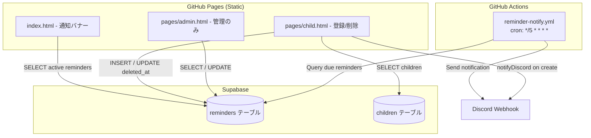

# Design Document: Family Reminder

## Overview

家族向けお小遣い管理PWA「お小遣い手帳」にリマインダー機能を追加する。本機能は以下の3つのコンポーネントで構成される：

1. **フロントエンドUI** — child.html（登録・削除）、index.html（通知バナー表示）、admin.html（管理）
2. **データベース** — Supabase PostgreSQL `reminders` テーブル
3. **Cron通知** — GitHub Actions（5分毎）でDiscord Webhook通知を送信

全体として既存アーキテクチャ（単一HTML + inline JS、Supabase、GitHub Actions）に完全に準拠し、ビルドステップなしで動作する。

**Key Design Decisions:**
- Reminder creation is exclusively through child.html. admin.html provides management-only operations (list, delete, customize schedule, snooze).
- RLS disabled (consistent with existing tables). Access control is handled at the application level via deviceRole.
- child_name is denormalized for notification rendering performance (Cron script) and is not the source of truth. The canonical name is in the children table.
- Duplicate submission prevention is handled via frontend debounce only (no DB constraints or server-side checks).

## Architecture



### 設計方針

- **既存パターン踏襲**: js/common.js の `client` 変数、`notifyDiscord()` 関数、`isAdmin` 変数をそのまま利用
- **アコーディオンUI**: child.html の既存セクション（✅承認、⭐ポイント表、🧹家事選択、💰入出金、📋履歴）と同じ折りたたみパターンで「🔔 リマインダー」セクションを追加
- **admin.html**: 既存の `h2` + `.toggle` + `.section-body` パターンで「🔔 リマインダー管理」セクションを追加（管理操作のみ、登録機能なし）
- **端末識別**: `olimar_device_id` と同じパターンで `reminder_device_id` を localStorage に保存
- **Soft Delete**: `deleted_at IS NULL` フィルタで論理削除を実現。冪等な UPDATE で実装
- **タイムゾーン**: DB は UTC 保存、UI 表示時に JST 変換（`toLocaleString('ja-JP', {timeZone:'Asia/Tokyo'})`)
- **Cron時間判定**: 5分ウィンドウ方式（`scheduled_time <= now < scheduled_time + 5min`）

## Components and Interfaces

### 1. Database: `reminders` テーブル

Supabase に新規テーブルを作成。RLS 無効（既存テーブルと同様。CONTEXT.md: 「Supabaseの全テーブルはRLS無効化済み」）。Access control is handled at the application level via deviceRole.

### 2. child.html — リマインダーセクション（登録 + 削除）

既存のアコーディオンセクションの末尾（📋履歴の後）に追加：
- 登録フォーム: テキスト入力 + 「日付を指定しない」チェックボックス + 日付入力 + 送信ボタン
- 一覧表示: そのchild_idに紐づく全リマインダーを表示
- 自分が作成したリマインダー（creator_user_id 一致）にのみ削除ボタン表示
- Duplicate submission prevention: child.html keeps `lastSubmitAt` in memory and ignores resubmits within 3 seconds.

### 3. index.html — 通知バナー

`#mathReviewNotice` の下に `#reminderBanner` div を追加：
- Memo_Reminder: created_at 降順で全件表示
- Event_Reminder: event_date が今日から7日以内のもの、event_date 昇順で表示
- admin 時: 各リマインダーに ×（削除）ボタンとスヌーズボタン表示

### 4. admin.html — リマインダー管理セクション（管理のみ、登録なし）

既存セクションの末尾に追加：
- 全リマインダー一覧（soft delete 除外）
- 各リマインダーに: 削除ボタン、通知時間カスタマイズUI、スヌーズボタン
- 過去の Event_Reminder には「過去」ラベル表示
- **登録機能は提供しない**（登録は child.html からのみ）

### 5. GitHub Actions — reminder-notify.yml

```yaml
on:
  schedule:
    - cron: '*/5 * * * *'
```

Node.js スクリプト（`scripts/reminder-notify.js`）を実行：
- Supabase REST API で active reminders を取得（child_name を denormalized フィールドから直接使用、JOIN 不要）
- 現在の JST 時刻が通知スケジュールの5分ウィンドウ内か判定
- スヌーズ中のリマインダーをスキップ
- 該当リマインダーを1つのメッセージにまとめて Discord Webhook に送信

### 6. scripts/reminder-notify.js

GitHub Actions から実行される Node.js スクリプト。依存は `node-fetch`（Node 18+ なら不要）のみ。

**インターフェース:**
```javascript
// 環境変数
// SUPABASE_URL, SUPABASE_KEY, DISCORD_WEBHOOK

async function main() {
  const now = getCurrentJST();           // 現在のJST時刻
  const reminders = await fetchActive(); // active reminders取得（JOIN不要、child_name denormalized）
  const due = filterDue(reminders, now); // 通知対象フィルタ（5分ウィンドウ方式）
  if (due.length > 0) {
    await sendDiscord(formatMessage(due)); // 統合メッセージ送信
  }
}
```

**5分ウィンドウ方式の時間判定:**
```javascript
// scheduled_time <= now < scheduled_time + 5min
// 例: 07:50のスケジュール → 07:50:00 <= now < 07:55:00 の間に実行されれば通知する
function isInWindow(scheduledHHMM, nowHHMM) {
  const scheduled = parseMinutes(scheduledHHMM); // "07:50" → 470
  const current = parseMinutes(nowHHMM);
  return current >= scheduled && current < scheduled + 5;
}
```

## Data Models

### reminders テーブル

```sql
CREATE TABLE reminders (
  id UUID PRIMARY KEY DEFAULT gen_random_uuid(),
  type TEXT NOT NULL CHECK (type IN ('memo', 'event')),
  child_id UUID NOT NULL REFERENCES children(id),
  -- child_name is denormalized for notification rendering performance (Cron script).
  -- Not the source of truth. The canonical name is in the children table.
  child_name TEXT NOT NULL,
  message TEXT NOT NULL CHECK (char_length(message) BETWEEN 1 AND 200),
  event_date DATE,  -- JST calendar date, event型のみ
  creator_user_id TEXT NOT NULL,
  creator_role TEXT NOT NULL CHECK (creator_role IN ('admin', 'user')),
  custom_schedule JSONB,  -- array<string>, e.g. ["07:50","17:30"]
  -- notifications suppressed while current_jst_date < snooze_until
  -- i.e. snooze_until is the date notifications RESUME (that day IS notified)
  -- Example: snooze_until = 5/4 → notifications suppressed through 5/3, resume on 5/4
  snooze_until DATE,
  created_at TIMESTAMPTZ NOT NULL DEFAULT now(),
  deleted_at TIMESTAMPTZ
);

-- RLS disabled (consistent with existing tables).
-- Access control is handled at the application level via deviceRole.

-- event型はevent_date必須
ALTER TABLE reminders ADD CONSTRAINT chk_event_date
  CHECK (type = 'memo' OR event_date IS NOT NULL);

-- custom_schedule は NULL または JSON array であること
ALTER TABLE reminders ADD CONSTRAINT chk_custom_schedule
  CHECK (
    custom_schedule IS NULL
    OR jsonb_typeof(custom_schedule) = 'array'
  );

-- インデックス
CREATE INDEX idx_reminders_child_id ON reminders(child_id) WHERE deleted_at IS NULL;
CREATE INDEX idx_reminders_type_event_date ON reminders(type, event_date) WHERE deleted_at IS NULL;
CREATE INDEX idx_reminders_snooze ON reminders(snooze_until) WHERE deleted_at IS NULL;
```

**Soft delete の実行例（冪等）:**
```sql
-- 既に deleted_at が設定されていれば何も更新しない（冪等）
UPDATE reminders SET deleted_at = now() WHERE id = $1 AND deleted_at IS NULL;
```

### localStorage キー

| キー | 用途 | 永続性 |
|------|------|--------|
| reminder_device_id | リマインダー作成者識別子（UUID） | 永続 |

### Discord メッセージフォーマット

```
🔔 リマインダー通知

📝 メモ:
• [子供名] メッセージ内容

📅 行事:
• [子供名] メッセージ内容（あと3日 - 5/25）
```

## Correctness Properties

*A property is a characteristic or behavior that should hold true across all valid executions of a system—essentially, a formal statement about what the system should do. Properties serve as the bridge between human-readable specifications and machine-verifiable correctness guarantees.*

### Property 1: Message length validation

*For any* string input, the validation function SHALL accept it if and only if its trimmed length is between 1 and 200 characters (inclusive). Strings of trimmed length 0 or greater than 200 SHALL be rejected.

**Validates: Requirements 2.5, 12.1**

### Property 2: Event date validation

*For any* date input submitted with the "日付を指定しない" checkbox unchecked, the validation function SHALL reject the submission if and only if the date is in the past (before today in JST). Future dates and today SHALL be accepted.

**Validates: Requirements 2.6**

### Property 3: Reminder save round-trip

*For any* valid reminder input (memo or event type), after saving to the database and retrieving the record, the returned data SHALL contain the same message, child_id, child_name, type, creator_user_id, and creator_role as the input. For event type, event_date SHALL also match.

**Validates: Requirements 3.1, 4.1, 4.4**

### Property 4: Cron notification filter (5-minute window)

*For any* set of reminders and any current JST datetime, the notification filter function SHALL return only reminders that satisfy ALL of the following: (a) deleted_at is NULL, (b) snooze_until is NULL or current_jst_date >= snooze_until (snooze_until is the resume date), (c) for memo type: always in notification window, (d) for event type: current JST date is between (event_date - 7 days) and event_date inclusive, (e) current JST time (HH:MM) falls within the 5-minute window of the reminder's schedule (custom_schedule if set, otherwise default 07:50/17:30), where the window is `scheduled_time <= now < scheduled_time + 5min`.

**Validates: Requirements 3.4, 8.2, 8.3, 8.4, 8.5, 8.7, 8.8, 10.5, 10.6**

### Property 5: TOP page banner filter and sort

*For any* set of reminders and current JST date, the banner filter function SHALL return: (a) all Memo_Reminders where deleted_at is NULL, sorted by created_at descending, followed by (b) all Event_Reminders where deleted_at is NULL and event_date is between today and today+7 days (inclusive, starting at 00:00 JST exactly 7 calendar days before), sorted by event_date ascending. Past Event_Reminders and soft-deleted reminders SHALL be excluded. Snoozed reminders SHALL still be included in the banner display.

**Validates: Requirements 5.1, 5.2, 5.3, 5.6, 5.7, 7.3**

### Property 6: Reminder display contains required fields

*For any* reminder, the rendered display SHALL contain: for Memo_Reminder — child_name, message, and created_at in JST; for Event_Reminder — child_name, message, event_date, and days remaining. For admin page display — additionally type, notification schedule, snooze status, and creator_role.

**Validates: Requirements 5.4, 5.5, 11.3**

### Property 7: Custom schedule validation

*For any* JSONB value intended as custom_schedule, the validation function SHALL accept it if and only if it is an array containing one or more strings each matching the pattern HH:MM where HH is 00-23 and MM is 00-59. NULL (no custom schedule), empty arrays, or arrays with invalid time strings SHALL be rejected. Setting custom_schedule to NULL reverts to default schedule.

**Validates: Requirements 1.5, 9.3, 9.4, 9.5**

### Property 8: Snooze date calculation and boundary

*For any* current JST date and positive integer N (days), the calculated snooze_until date SHALL equal the current JST date plus N calendar days. Notifications are suppressed while current_jst_date < snooze_until. On the snooze_until date itself, notifications resume.

**Validates: Requirements 10.4, 10.5, 10.6**

### Property 9: Duplicate submission debounce (frontend)

*For any* two submission attempts from the same page instance, if the time between them is less than 3 seconds, the second submission SHALL be ignored (no API call made). If the time is 3 seconds or more, both submissions SHALL proceed.

**Validates: Requirements 2.8, 12.3**

### Property 10: Delete button visibility

*For any* reminder displayed on the Child_Page and any current device's reminder_device_id, the delete button SHALL be visible if and only if the reminder's creator_user_id equals the current device's reminder_device_id.

**Validates: Requirements 6.1**

## Error Handling

| シナリオ | 対応 |
|----------|------|
| Supabase接続エラー（登録時） | 「保存に失敗しました。もう一度お試しください」エラー表示、データ消失なし |
| Supabase接続エラー（表示時） | バナー/セクション非表示（空状態）、エラーログのみ |
| Discord Webhook失敗（登録時） | 3秒タイムアウト、失敗してもDB保存は成功扱い（既存パターン準拠） |
| Discord Webhook失敗（Cron） | エラーログ出力、次回実行で再試行（冪等） |
| creator_user_id未設定 | 自動生成して localStorage に保存してから処理続行 |
| 不正なcustom_schedule値 | バリデーションで拒否（CHECK制約 + フロントエンド検証）、保存しない |
| 同時削除（競合） | soft delete は冪等（`UPDATE ... WHERE deleted_at IS NULL` — 既に削除済みなら0行更新） |
| Cron実行時間ずれ（GitHub Actions遅延） | 5分ウィンドウ方式で対応（scheduled_time <= now < scheduled_time + 5min） |

## Testing Strategy

### Unit Tests (Example-based)

- UI要素の存在確認（フォーム、ボタン、チェックボックス）
- チェックボックスON/OFFで日付フィールドの表示切替
- admin/user でのボタン表示差分（削除、スヌーズ、カスタマイズ）
- 登録成功時の確認メッセージ表示
- soft delete 後のレコード状態確認
- creator_user_id 自動生成の動作確認
- スヌーズ中リマインダーがバナーに表示されること（Discord通知のみ停止）
- admin.html に登録フォームが存在しないこと

### Property-Based Tests

ライブラリ: [fast-check](https://github.com/dubzzz/fast-check)（Node.js環境、scripts/のCronスクリプトテスト用）

各プロパティテストは最低100イテレーション実行。タグ形式:

```javascript
// Feature: family-reminder, Property 4: Cron notification filter (5-minute window)
```

テスト対象の純粋関数を `scripts/reminder-notify.js` から export:
- `validateMessage(msg)` → Property 1
- `validateEventDate(date, today)` → Property 2
- `filterDueReminders(reminders, now)` → Property 4, 5
- `formatReminderDisplay(reminder, today)` → Property 6
- `validateCustomSchedule(times)` → Property 7
- `calculateSnoozeUntil(today, days)` → Property 8
- `isInWindow(scheduledHHMM, nowHHMM)` → Property 4 (5分ウィンドウ判定)

フロントエンド側（child.html inline）:
- `isDuplicateSubmission(lastSubmitAt, now)` → Property 9（メモリ内 debounce）

### Integration Tests

- Supabase への INSERT/SELECT/UPDATE（soft delete）の動作確認
- Discord Webhook へのメッセージ送信（モック）
- GitHub Actions ワークフローの手動実行テスト（workflow_dispatch）

### Smoke Tests

- reminders テーブルのカラム型確認（TIMESTAMPTZ, DATE, JSONB）
- CHECK制約の存在確認（chk_event_date, chk_custom_schedule）
- GitHub Actions cron スケジュール設定確認
- Supabase REST API アクセス確認
