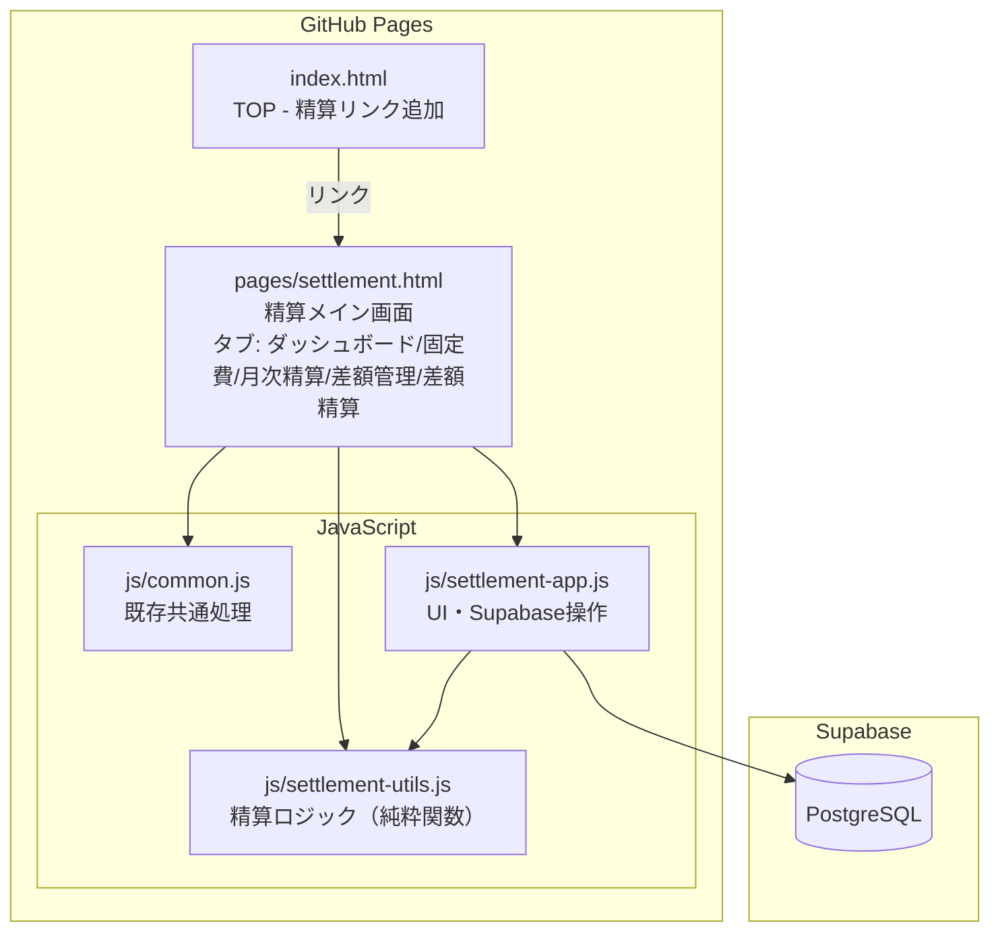
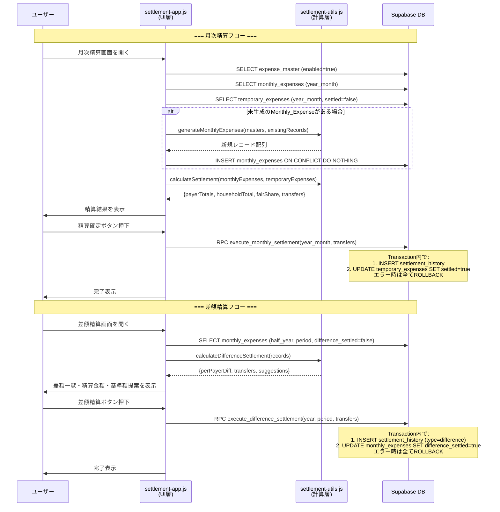
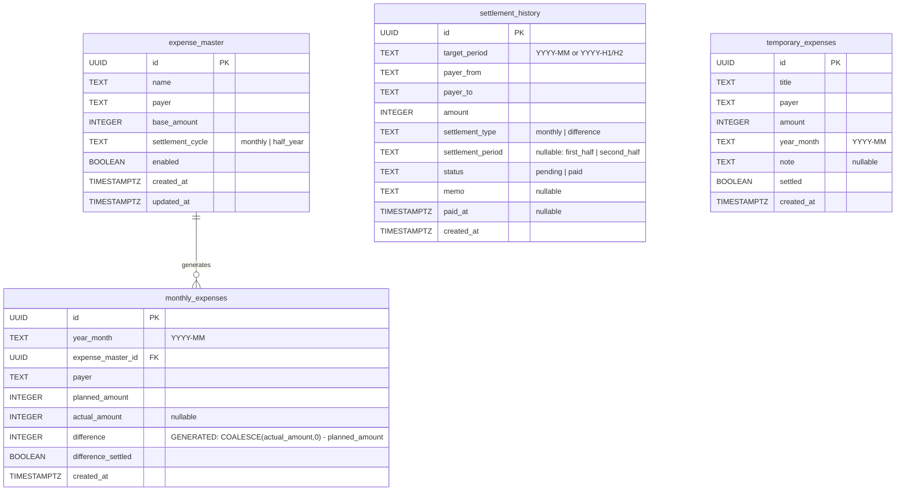
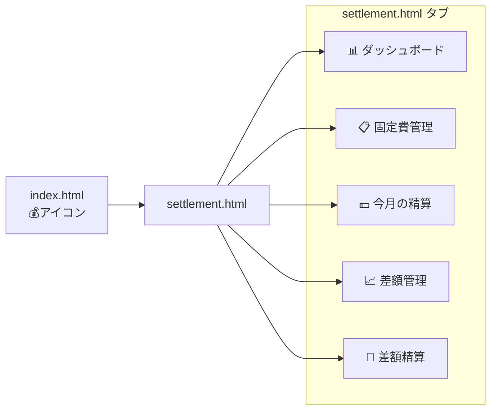

# 設計ドキュメント: 家庭内精算機能 (family-settlement)

## Overview

既存のお小遣い手帳PWA内に、家庭内の固定費・立替金の月次精算と半年ごとの差額精算を行う機能を追加する。既存アプリと同じアーキテクチャパターン（Vanilla JS + Supabase、GitHub Pages静的ホスティング）を踏襲し、単一HTMLページ内のタブナビゲーションで全画面を提供する。

精算ロジック（純粋関数）をUIから分離し、`js/settlement-utils.js` にまとめることでテスタビリティを確保する。

## Design Constraints

- **Payer数**: 本バージョンでは payer 数 = 2 を前提とする。将来的に3人以上対応を拡張可能な設計は維持するが、transfersアルゴリズム等は2人専用で実装する。
- **端数処理**: `floor()` で端数切り捨て。余り（1円以下）は payer_from（支払う側）に有利に切り捨てる（支払い額が少なくなる方向）。
- **差額精算期間**: 固定2期間（1〜6月：上半期、7〜12月：下半期）。
- **differenceカラム**: monthly_expensesテーブルの `difference` は Generated Column として定義する。`actual_amount IS NULL` のときは 0（差額なし）、入力済みのときは `actual_amount - planned_amount` を返す。手動更新不要。
- **Transaction**: 精算確定（月次・差額とも）は複数テーブル更新を伴うため、Supabase RPC（Postgres Function）でトランザクション化する。

## Architecture



### データフロー



## Components and Interfaces

### ファイル構成

```
pages/settlement.html       # メインHTML（タブUI含む）
js/settlement-utils.js      # 純粋関数（計算・バリデーション）
js/settlement-app.js        # アプリケーション層（UI操作・DB通信）
sql/settlement-schema.sql   # テーブル定義
sql/settlement-rpc.sql      # Postgres Functions（Transaction）
```

### Supabase RPC（Postgres Functions）

```sql
-- 月次精算確定（Transaction）
CREATE OR REPLACE FUNCTION execute_monthly_settlement(
  p_year_month TEXT,
  p_payer_from TEXT,
  p_payer_to TEXT,
  p_amount INTEGER,
  p_temporary_expense_ids UUID[]
) RETURNS UUID AS $$
DECLARE
  v_settlement_id UUID;
  v_count INTEGER;
  v_expected INTEGER;
BEGIN
  -- 1. settlement_history を作成
  INSERT INTO settlement_history (year_month, payer_from, payer_to, amount, settlement_type, status)
  VALUES (p_year_month, p_payer_from, p_payer_to, p_amount, 'monthly', 'pending')
  RETURNING id INTO v_settlement_id;
  
  -- 2. 対象の temporary_expenses を精算済みに（件数チェック付き）
  v_expected := array_length(p_temporary_expense_ids, 1);
  IF v_expected IS NOT NULL AND v_expected > 0 THEN
    UPDATE temporary_expenses
    SET settled = true
    WHERE id = ANY(p_temporary_expense_ids) AND settled = false;
    
    GET DIAGNOSTICS v_count = ROW_COUNT;
    IF v_count != v_expected THEN
      RAISE EXCEPTION 'temporary_expenses update mismatch: expected %, got %', v_expected, v_count;
    END IF;
  END IF;
  
  RETURN v_settlement_id;
END;
$$ LANGUAGE plpgsql;

-- 差額精算確定（Transaction）
CREATE OR REPLACE FUNCTION execute_difference_settlement(
  p_year TEXT,
  p_period TEXT,  -- 'first_half' | 'second_half'
  p_payer_from TEXT,
  p_payer_to TEXT,
  p_amount INTEGER,
  p_monthly_expense_ids UUID[]
) RETURNS UUID AS $$
DECLARE
  v_settlement_id UUID;
  v_count INTEGER;
  v_expected INTEGER;
BEGIN
  -- 1. settlement_history を作成
  INSERT INTO settlement_history (target_period, payer_from, payer_to, amount, settlement_type, settlement_period, status)
  VALUES (p_year || '-' || CASE WHEN p_period = 'first_half' THEN 'H1' ELSE 'H2' END,
          p_payer_from, p_payer_to, p_amount, 'difference', p_period, 'pending')
  RETURNING id INTO v_settlement_id;
  
  -- 2. 対象の monthly_expenses を差額精算済みに（件数チェック付き）
  v_expected := array_length(p_monthly_expense_ids, 1);
  IF v_expected IS NOT NULL AND v_expected > 0 THEN
    UPDATE monthly_expenses
    SET difference_settled = true
    WHERE id = ANY(p_monthly_expense_ids) AND difference_settled = false;
    
    GET DIAGNOSTICS v_count = ROW_COUNT;
    IF v_count != v_expected THEN
      RAISE EXCEPTION 'monthly_expenses update mismatch: expected %, got %', v_expected, v_count;
    END IF;
  END IF;
  
  RETURN v_settlement_id;
END;
$$ LANGUAGE plpgsql;
```

### settlement-utils.js（純粋関数モジュール）

```javascript
/**
 * Expense_Masterバリデーション
 * @param {object} data - {name, payer, base_amount, settlement_cycle}
 * @returns {{valid: boolean, errors: string[]}}
 */
function validateExpenseMaster(data)

/**
 * Temporary_Expenseバリデーション
 * @param {object} data - {title, payer, amount, year_month, note?}
 * @returns {{valid: boolean, errors: string[]}}
 */
function validateTemporaryExpense(data)

/**
 * Monthly_Expenseレコードを生成（既存レコードと重複しない分のみ）
 * @param {Array} enabledMasters - 有効なExpense_Master配列
 * @param {Array} existingRecords - 既に存在するMonthly_Expense配列
 * @param {string} yearMonth - "YYYY-MM"
 * @returns {Array} 新規生成すべきMonthly_Expenseレコード配列
 */
function generateMonthlyExpenses(enabledMasters, existingRecords, yearMonth)

/**
 * 月次精算計算
 * @param {Array} monthlyExpenses - 当月のMonthly_Expense配列
 * @param {Array} temporaryExpenses - 当月の未精算Temporary_Expense配列
 * @returns {{
 *   payerTotals: {[payer: string]: number},
 *   payerDiffs: {[payer: string]: number},
 *   householdTotal: number,
 *   fairShare: number,
 *   transfers: Array<{from: string, to: string, amount: number}>
 * }}
 */
function calculateSettlement(monthlyExpenses, temporaryExpenses)

/**
 * 差額計算 (actual - planned)
 * @param {number|null} actualAmount
 * @param {number} plannedAmount
 * @returns {number} difference (actualがnullの場合は0)
 */
function calculateDifference(actualAmount, plannedAmount)

/**
 * 累積差額計算（未精算分の合計）
 * @param {Array} monthlyExpenses - difference_settled=falseのhalf_yearレコード配列
 * @returns {{[payer: string]: number}} payer別の累積差額
 */
function calculateAccumulatedDifference(monthlyExpenses)

/**
 * 差額精算計算
 * @param {Array} monthlyExpenses - 対象期間のhalf_year & difference_settled=falseレコード
 * @returns {{
 *   payerDiffs: {[payer: string]: number},
 *   transfers: Array<{from: string, to: string, amount: number}>,
 *   suggestions: Array<{expense_master_id: string, name: string, currentBase: number, suggestedBase: number, avgActual: number}>
 * }}
 */
function calculateDifferenceSettlement(monthlyExpenses)

/**
 * 基準額調整提案を計算
 * @param {Array} monthlyExpenses - 対象期間のhalf_yearレコード（expense_master_id別にグループ化済み）
 * @returns {Array<{expense_master_id, name, currentBase, suggestedBase, avgActual}>}
 */
function suggestBaseAmountAdjustments(monthlyExpenses)

/**
 * year_monthから差額精算期間を判定
 * @param {string} yearMonth - "YYYY-MM"
 * @returns {"first_half" | "second_half"}
 */
function getDifferenceSettlementPeriod(yearMonth)

/**
 * 差額精算期間のyear_month範囲を返す
 * @param {number} year
 * @param {"first_half" | "second_half"} period
 * @returns {string[]} ["YYYY-01", "YYYY-02", ..., "YYYY-06"] or ["YYYY-07", ..., "YYYY-12"]
 */
function getPeriodMonths(year, period)

/**
 * Settlement_History作成判定（amount=0なら作成しない）
 * @param {number} amount
 * @returns {boolean}
 */
function shouldCreateSettlement(amount)
</javascript>
```

### settlement-app.js（UI・DB操作）

タブ切り替え、Supabaseからのデータ取得・更新、DOM操作を担当する。  
`settlement-utils.js` の純粋関数を呼び出して計算結果を得る。

主要関数:
- `initApp()` - 初期化、タブイベント設定
- `loadDashboard()` - ダッシュボードデータ取得・表示
- `loadExpenseMasters()` - 固定費マスタ一覧取得・表示
- `saveExpenseMaster(data)` - 固定費マスタ保存
- `loadMonthlySettlement(yearMonth)` - 月次精算画面
- `executeMonthlySettlement(yearMonth)` - 月次精算実行
- `loadDifferenceManagement()` - 差額管理画面
- `loadDifferenceSettlement(year, period)` - 差額精算画面
- `executeDifferenceSettlement(year, period)` - 差額精算実行
- `loadTemporaryExpenses(yearMonth)` - 一時立替一覧
- `saveTemporaryExpense(data)` - 一時立替保存

## Data Models

### テーブル定義（requirements.mdのスキーマを踏襲）



### difference カラムの設計

`monthly_expenses.difference` は Generated Column として定義する:

```sql
difference INTEGER GENERATED ALWAYS AS (
  CASE WHEN actual_amount IS NULL THEN 0
       ELSE actual_amount - planned_amount
  END
) STORED
```

これにより:
- `actual_amount` が NULL（未入力）のときは `difference = 0`（差額なし扱い）
- `actual_amount` を入力すれば `difference = actual_amount - planned_amount` が自動計算される
- アプリケーション側で `difference` を明示的に更新する必要がない
- `planned_amount` と `actual_amount` の不整合が発生しない

### 精算計算ロジック（疑似コード）

```
// === 月次精算（2人前提） ===
function calculateSettlement(monthlyExpenses, temporaryExpenses):
    payerTotals = {}
    
    // 固定費の基準額を各payerに加算
    for each exp in monthlyExpenses:
        payerTotals[exp.payer] += exp.planned_amount
    
    // 一時立替金を各payerに加算
    for each temp in temporaryExpenses:
        payerTotals[temp.payer] += temp.amount
    
    // 世帯合計
    householdTotal = sum(payerTotals.values())
    
    // 人数割り（2人固定）
    numPayers = 2
    fairShare = floor(householdTotal / numPayers)
    // 端数（householdTotal % 2 == 1 の場合の1円）は切り捨て
    // → payer_from（支払う側）に有利（支払額が少なくなる）
    
    // 精算額算出
    // 多く払った人 = total > fairShare → 受け取る側 (payer_to)
    // 少なく払った人 = total < fairShare → 支払う側 (payer_from)
    transfers = []
    payers = sorted keys of payerTotals by total ascending
    payer_from = payers[0]  // 少なく払った人
    payer_to = payers[1]    // 多く払った人
    amount = fairShare - payerTotals[payer_from]  // 常に >= 0
    
    if amount > 0:
        transfers.push({from: payer_from, to: payer_to, amount})
    
    return {payerTotals, householdTotal, fairShare, transfers}


// === 差額精算（2人前提） ===
function calculateDifferenceSettlement(monthlyExpenses):
    // half_year項目の累積差額をpayer別に集計
    // difference = COALESCE(actual_amount, 0) - planned_amount (Generated Column)
    payerDiffs = {}
    for each exp in monthlyExpenses where difference_settled == false:
        payerDiffs[exp.payer] += exp.difference
    
    // 差額合計を折半して精算額を算出
    householdDiffTotal = sum(payerDiffs.values())
    fairDiff = floor(householdDiffTotal / 2)
    
    // 差額精算のtransfer計算（月次と同じロジック）
    payers = sorted keys of payerDiffs by diff ascending
    payer_from = payers[0]
    payer_to = payers[1]
    amount = fairDiff - payerDiffs[payer_from]
    
    transfers = []
    if abs(amount) > 0:
        if amount > 0:
            transfers.push({from: payer_from, to: payer_to, amount})
        else:
            transfers.push({from: payer_to, to: payer_from, amount: abs(amount)})
    
    // 基準額調整提案
    suggestions = []
    grouped = group monthlyExpenses by expense_master_id
    for each [masterId, records] in grouped:
        validRecords = records.filter(r => r.actual_amount != null)
        if validRecords.length > 0:
            avgActual = floor(sum(validRecords.actual_amount) / validRecords.length)
            suggestedBase = round_to_nearest_1000(avgActual)
            if suggestedBase != currentBase:
                suggestions.push({masterId, suggestedBase, avgActual, currentBase})
    
    return {payerDiffs, transfers, suggestions}
```

## 画面構成・ナビゲーション



### 画面レイアウト概要

| タブ | 主要要素 |
|------|----------|
| ダッシュボード | 今月精算結果カード、未払い件数バッジ、差額精算待ちサマリー、立替金一覧、年月セレクタ |
| 固定費管理 | マスタ一覧（有効/無効切替スイッチ付き）、追加/編集モーダル |
| 今月の精算 | payer別の項目一覧、一時立替一覧、計算結果サマリー、精算確定ボタン、精算履歴 |
| 差額管理 | half_year項目一覧、実費入力欄（入力時に差額を即時計算・表示）、差額表示（色分け）、累積差額 |
| 差額精算 | 期間セレクタ（上半期/下半期）、累積差額一覧、精算金額、基準額調整提案、精算ボタン |

## Correctness Properties

*プロパティとは、システムの全ての有効な実行において真であるべき特性・振る舞いのことである。プロパティは人間が読める仕様と機械で検証可能な正しさの保証を橋渡しする。*

### Property 1: Expense_Masterバリデーション

*For any* 入力データにおいて、nameが空文字・空白のみ、base_amountが負の整数、settlement_cycleが"monthly"/"half_year"以外の場合、validateExpenseMasterはvalid=falseを返し、それ以外の有効な入力ではvalid=trueを返す。

**Validates: Requirements 1.2, 1.3, 1.4**

### Property 2: Monthly_Expense生成の不変条件

*For any* 有効なExpense_Master集合と年月において、generateMonthlyExpensesが生成する各レコードは、対応するExpense_Masterのbase_amountをplanned_amountに、payerをそのまま、actual_amountをnullに設定する。differenceはGenerated Column（actual_amount IS NULL → 0）により自動算出されるため、アプリケーション側ではセットしない。

**Validates: Requirements 2.1, 2.2, 2.3, 2.4**

### Property 3: Monthly_Expense生成の冪等性

*For any* 年月とExpense_Master集合において、generateMonthlyExpensesを同じ入力で2回呼び出した場合、2回目の呼び出しは空配列を返す（既存レコードと重複する新規レコードを生成しない）。

**Validates: Requirements 2.5**

### Property 4: 月次精算の収支均衡

*For any* Monthly_ExpenseとTemporary_Expenseの集合において、calculateSettlementの結果は以下を満たす: (1) payerTotalsの合計 = householdTotal、(2) fairShare = floor(householdTotal / 2)、(3) transfersにおいて sum(支払額) = sum(受取額)（収支均衡）、(4) transfer amount = fairShare - 支払い不足側のtotal。

**Validates: Requirements 1.7, 3.1, 3.2, 3.3, 3.4, 3.5, 3.6, 3.8**

### Property 5: 精算額0の場合はSettlement_History非生成

*For any* 精算計算の結果、全payerのtransfer amountが0の場合、shouldCreateSettlementはfalseを返す。

**Validates: Requirements 4.8**

### Property 6: 差額計算の正確性

*For any* actual_amountとplanned_amountの組み合わせにおいて、calculateDifferenceは actual_amount - planned_amount を返す（actual_amountがnullの場合は0）。

**Validates: Requirements 5.2**

### Property 7: 累積差額の集計正確性

*For any* 未精算のhalf_year Monthly_Expenseレコード集合において、calculateAccumulatedDifferenceはpayer別にdifference値の合計を返す。

**Validates: Requirements 5.4, 6.3**

### Property 8: 差額精算の公平分担計算

*For any* 累積差額データにおいて、calculateDifferenceSettlementは月次精算と同じ公平分担ロジック（合計を折半、端数切り捨て）で精算額を算出する。

**Validates: Requirements 6.4**

### Property 9: 基準額調整提案

*For any* 半年間のactual_amountが入力されたMonthly_Expenseレコード集合において、suggestBaseAmountAdjustmentsはactual_amountの平均を1000円単位に丸めた値を提案する。

**Validates: Requirements 6.10**

### Property 10: Temporary_Expenseバリデーション

*For any* 入力データにおいて、titleが空文字・空白のみ、またはamountが0以下の場合、validateTemporaryExpenseはvalid=falseを返し、有効な入力ではvalid=trueを返す。

**Validates: Requirements 7.1, 7.2**

### Property 11: 精算済みTemporary_Expenseの不変性

*For any* settled=trueのTemporary_Expenseにおいて、編集・削除操作は拒否される（settled=falseの場合のみ許可）。

**Validates: Requirements 7.8, 7.9**

### Property 12: Transfer総額の収支均衡

*For any* calculateSettlementまたはcalculateDifferenceSettlementの結果において、全transfersのfrom側amount合計 = to側amount合計（ゼロサム）。

**Validates: Requirements 3.4, 6.4**

### Property 13: generateMonthlyExpensesはenabled=falseを生成しない

*For any* Expense_Master集合において、enabled=falseのマスタに対応するMonthly_Expenseレコードは生成されない。

**Validates: Requirements 1.7, 2.1**

### Property 14: calculateSettlementは入力を変更しない（純粋関数保証）

*For any* 入力のmonthlyExpenses配列とtemporaryExpenses配列において、calculateSettlement呼び出し前後で入力配列およびその要素オブジェクトは深い等価性（deep equality）を保つ（副作用なし）。

**Validates: Design Principle（テスタビリティ）**

### Property 15: suggestBaseAmountAdjustmentsはactual_amount=nullを平均計算に含めない

*For any* Monthly_Expenseレコード集合において、actual_amountがnullのレコードは平均計算の分母・分子に含まれない。

**Validates: Requirements 6.10**

### Property 16: calculateDifferenceSettlementは入力を変更しない（純粋関数保証）

*For any* 入力のmonthlyExpenses配列において、calculateDifferenceSettlement呼び出し前後で入力配列およびその要素オブジェクトは深い等価性（deep equality）を保つ（副作用なし）。

**Validates: Design Principle（テスタビリティ）**

## Error Handling

| エラー状況 | 処理 |
|-----------|------|
| Supabase接続エラー | トースト通知「データの取得に失敗しました」、リトライボタン表示 |
| バリデーションエラー | フォームフィールド直下にエラーメッセージ表示（赤文字） |
| 精算確定時のRPCエラー | Transaction全体がROLLBACK、確定ボタンを再度有効化、エラーメッセージ表示 |
| Monthly_Expense重複生成 | INSERT ... ON CONFLICT (year_month, expense_master_id) DO NOTHING でサイレント無視（同時アクセス対策） |
| 精算額0での精算実行試行 | ボタン非活性 + メッセージ「精算額が0円のため精算不要です」 |
| 精算済み後の金額変更試行 | UIで入力欄を非活性化 + メッセージ「精算済みのため変更できません」 |

## Testing Strategy

### テストツール

- **vitest**: テストランナー（既存プロジェクトで使用中）
- **fast-check**: プロパティベーステスト（既存プロジェクトで使用中）
- **環境**: Node.js（`environment: 'node'`、既存設定踏襲）

### プロパティベーステスト

`tests/property-settlement.test.js` に以下のプロパティテストを実装:

- Property 1: Expense_Masterバリデーション（100回以上実行）
- Property 2: Monthly_Expense生成の不変条件（100回以上実行）
- Property 3: Monthly_Expense生成の冪等性（100回以上実行）
- Property 4: 月次精算の収支均衡（100回以上実行）
- Property 5: 精算額0→非生成（100回以上実行）
- Property 6: 差額計算の正確性（100回以上実行）
- Property 7: 累積差額の集計正確性（100回以上実行）
- Property 8: 差額精算の公平分担計算（100回以上実行）
- Property 9: 基準額調整提案（100回以上実行）
- Property 10: Temporary_Expenseバリデーション（100回以上実行）
- Property 11: 精算済みTemporary_Expenseの不変性（100回以上実行）
- Property 12: Transfer総額の収支均衡（100回以上実行）
- Property 13: enabled=falseは生成されない（100回以上実行）
- Property 14: calculateSettlementの純粋関数保証（100回以上実行）
- Property 15: actual_amount=nullは平均に含めない（100回以上実行）
- Property 16: calculateDifferenceSettlementの純粋関数保証（100回以上実行）

各テストには `Feature: family-settlement, Property N: {property_text}` のタグコメントを付与する。

### ユニットテスト（例示ベース）

`tests/settlement-unit.test.js` に以下の例示テストを実装:
- 具体的な精算シナリオ（2人で5項目、うち1つ無効）
- 差額精算の具体例（上半期6ヶ月分の差額集計）
- 期間判定（1月→上半期、7月→下半期）

### Dual Export パターン

`js/settlement-utils.js` は既存の `js/recipe-utils.js` と同じパターンで、ブラウザとNode.js両方で動作するdual exportを使用:

```javascript
if (typeof module !== 'undefined' && module.exports) {
  module.exports = { validateExpenseMaster, calculateSettlement, ... };
}
```
