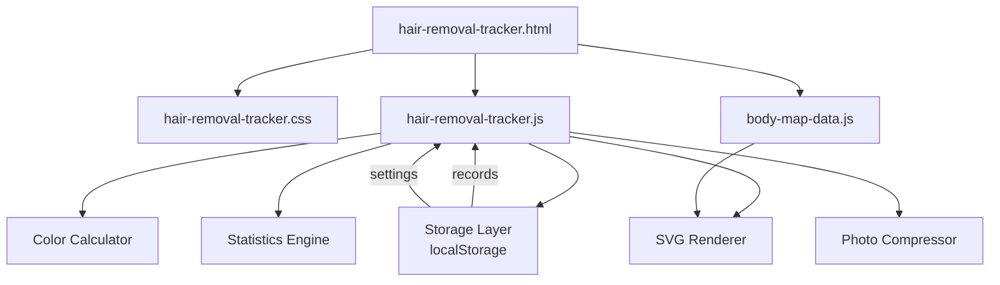

# Design Document: 脱毛周期管理アプリ (Hair Removal Tracker)

## Overview

脱毛周期管理アプリは、人体図（Body Map）を用いて脱毛部位の施術履歴を視覚的に管理するSPA（Single Page Application）である。既存のお小遣い手帳PWA内の1ページとして動作し、バニラHTML/CSS/JavaScriptで構築する。

主要な技術的特徴:
- SVGベースの人体図（前面・背面各90〜110ゾーン）によるインタラクティブなBody Map
- 経過日数に基づくHSLヒートマップカラー計算
- localStorageによるデータ永続化（最大5,000レコード対応）
- モバイルファーストのタブUI（マップ/履歴/統計/設定）
- 写真のBase64圧縮保存（Canvas API利用）

## Architecture

### システム構成



### ファイル構成

| ファイル | 役割 |
|----------|------|
| `pages/hair-removal-tracker.html` | HTMLテンプレート・タブUI構造 |
| `css/hair-removal-tracker.css` | スタイル（レスポンシブ・ダークモード） |
| `js/hair-removal-tracker.js` | アプリケーションロジック全体 |
| `js/body-map-data.js` | Body Zoneの定義データ（SVGパス・グループ情報） |

### アーキテクチャ方針

- **単一HTMLページ + タブ切替**: ハッシュベースのルーティング（`#map`, `#history`, `#stats`, `#settings`）
- **純粋関数の分離**: 色計算・統計計算・フィルタリング・マージなどのロジックをテスト可能な純粋関数として実装
- **DOMとロジックの分離**: UIレンダリングとデータ操作を明確に分ける
- **遅延レンダリング**: タブ切替時に必要なデータのみ計算・描画
- **日付処理**: すべての日付文字列操作は `Date` コンストラクタ + `toISOString()` / `toLocaleDateString()` を使用。`date` フィールドはユーザーローカル日付（YYYY-MM-DD）、`created_at` は `new Date().toISOString()` で生成するUTC。日付差分計算は `(Date.parse(b) - Date.parse(a)) / 86400000` で日数を得る

## Components and Interfaces

### 1. Body Map Renderer

```javascript
// SVG Body Mapの描画・インタラクション管理
const BodyMapRenderer = {
  init(containerId, side = 'front'),  // SVG初期化
  render(zones, colorMap),            // 全ゾーン初回描画（SVGパス生成 + 色適用）
  updateColors(colorMap),             // 色のみ差分更新（fill属性のみ変更、5000件でも高速）
  switchSide(side),                   // 前面/背面切替
  setMultiSelectMode(enabled),        // 複数選択モード切替
  getSelectedZones(),                 // 選択中ゾーン取得
  onZoneTap(callback),               // タップイベント登録
  onZoneLongPress(callback, duration = 500), // 長押しイベント登録（500ms）
  showTooltip(zoneId, position),     // ツールチップ表示
};
```

### 2. Color Calculator（純粋関数）

```javascript
// ヒートマップ色計算 - 純粋関数
function calculateHeatColor(elapsedDays, thresholdDays) → string (HSL)
// 複数ゾーンの色マップ生成
function buildColorMap(zones, records, thresholdDays) → Map<zoneId, hslColor>
// 周期超過判定
function isOverdue(elapsedDays, cyclePeriod) → boolean
```

### 3. Storage Manager

エラーハンドリング方針: 書き込み系メソッドは `{ success: boolean, error?: string }` を返す。読み取り系は例外を投げない（空配列/デフォルト値を返す）。

```javascript
const StorageManager = {
  // Treatment Records
  getRecords() → TreatmentRecord[],
  saveRecord(record) → { success: boolean, error?: string },
  deleteRecord(id) → { success: boolean, error?: string },
  getRecordsByZone(zoneId) → TreatmentRecord[],
  getRecordsByDateRange(start, end) → TreatmentRecord[],
  
  // Settings
  getSettings() → Settings,
  saveSettings(settings) → { success: boolean, error?: string },
  
  // Import/Export
  exportAll() → string,  // JSON string
  importData(json, mode: 'merge'|'replace') → { success: boolean, error?: string, count?: number },
  validateImportData(json) → { valid: boolean, errors: string[] },
  mergeRecords(existing, imported) → TreatmentRecord[],  // Map<id>でO(n)マージ
  
  // Reset
  resetAll() → void,
  
  // Photo storage
  getPhotoStorageUsage() → number (bytes),
};
```

### 4. Statistics Engine（純粋関数）

統計計算はすべて純粋関数。呼び出し元（タブ切替時）で結果をキャッシュし、レコード追加/削除時にキャッシュを破棄する方式で性能を担保する。

```javascript
// 月別集計
function getMonthlyStats(records) → Map<yearMonth, count>
// 頻出ゾーンTop5
function getTopZones(records, limit = 5) → {zoneId, count}[]
// 平均強度
function getAverageIntensity(records) → number
// カバー率
function getCoverageRate(records, totalZoneCount) → number (%)
// 強度分布
function getIntensityDistribution(records) → Map<intensity, count>
// ゾーン別平均間隔（各施術間の日数差の平均を計算）
function getZoneAverageInterval(records) → number (days)
// ゾーン別施術回数
function getZoneTreatmentCount(records) → number
```

### 5. Photo Compressor

```javascript
const PhotoCompressor = {
  // Canvas APIで画像をリサイズ後、toDataURL('image/jpeg', 0.8)で圧縮
  compress(file, maxWidth = 800, maxSizeKB = 500, quality = 0.8) → Promise<string|null>,
  getBase64Size(base64String) → number (bytes),
};
```

### 6. Treatment Modal

```javascript
const TreatmentModal = {
  open(zoneId, zoneName),            // モーダル表示
  openBatch(zoneIds),                // 複数ゾーン用モーダル
  close(),                           // モーダル非表示
  onConfirm(callback),              // 確定時コールバック
};
```

### 7. Filter / Sort（純粋関数）

```javascript
// 履歴ソート
function sortRecordsByDate(records, order = 'desc') → TreatmentRecord[]
// ゾーンフィルタ
function filterByZone(records, zoneId) → TreatmentRecord[]
// 日付範囲フィルタ
function filterByDateRange(records, startDate, endDate) → TreatmentRecord[]
// 要施術リスト生成
function getOverdueZones(zones, records, settings) → {zone, overdueDays}[]
// 次回施術日計算
function getNextTreatmentDate(lastDate, cycleDays) → string (YYYY-MM-DD)
```

## Data Models

### Treatment_Record

```javascript
{
  id: string,             // crypto.randomUUID()
  zone_id: string,        // Body_Zoneのid
  date: string,           // "YYYY-MM-DD" ユーザーローカル日付
  intensity: number,      // 1-5
  memo: string | null,    // 任意メモ
  photo: string | null,   // base64 data URI (max 500KB)
  created_at: string      // ISO8601 UTC "2025-01-15T10:30:00Z"
}
```

### Settings

```javascript
{
  default_cycle_days: number,          // デフォルト: 30
  color_threshold_days: number,        // デフォルト: 30
  zone_cycles: { [zone_id]: number },  // ゾーン別周期
  group_cycles: { [group]: number }    // グループ別周期
}
```

### Body_Zone（body-map-data.js）

```javascript
{
  id: string,           // "front_face_01"
  name: string,         // "額"
  svgPath: string,      // SVG path data
  side: "front" | "back",
  group: string         // "顔"
}
```

### localStorage Keys

| キー | 型 | 説明 |
|------|----|----|
| `hair_removal_records` | `TreatmentRecord[]` | 施術記録配列 |
| `hair_removal_settings` | `Settings` | 設定オブジェクト |

## Correctness Properties

*A property is a characteristic or behavior that should hold true across all valid executions of a system — essentially, a formal statement about what the system should do. Properties serve as the bridge between human-readable specifications and machine-verifiable correctness guarantees.*


### Property 1: ヒートマップ色計算の正確性

*For any* non-negative integer of elapsed days and any positive color threshold, `calculateHeatColor(elapsedDays, thresholdDays)` should return:
- HSL(120, 60%, 50%) (green) when elapsedDays ≤ 0
- HSL interpolated linearly from hue 120→0 when 0 < elapsedDays < thresholdDays
- HSL(0, 60%, 50%) (red) when elapsedDays ≥ thresholdDays
- The hue value should always be in the range [0, 120]

**Validates: Requirements 2.1, 2.2, 2.3, 2.4**

### Property 2: 施術記録の保存・読込ラウンドトリップ

*For any* valid Treatment_Record (valid zone_id, valid date string, intensity 1-5, optional memo, optional photo), saving to localStorage then loading should produce an identical record.

**Validates: Requirements 3.6**

### Property 3: 一括登録のレコード数不変量

*For any* set of N selected Body_Zones (N ≥ 1) with a single date, intensity, and memo, batch saving should create exactly N new Treatment_Records, each with a distinct zone_id matching one of the selected zones, and all sharing the same date, intensity, and memo.

**Validates: Requirements 3.11**

### Property 4: 履歴ソート順の正確性

*For any* list of Treatment_Records, `sortRecordsByDate(records, 'desc')` should return a list where each element's date is greater than or equal to the next element's date.

**Validates: Requirements 4.2**

### Property 5: ゾーンフィルタの正確性

*For any* zone_id and any list of Treatment_Records, `filterByZone(records, zoneId)` should return only records whose zone_id matches the specified zoneId, and should include all such matching records from the input.

**Validates: Requirements 4.4**

### Property 6: 日付範囲フィルタの正確性

*For any* date range [startDate, endDate] and any list of Treatment_Records, `filterByDateRange(records, startDate, endDate)` should return only records whose date falls within the range (inclusive), and should include all such matching records.

**Validates: Requirements 4.5**

### Property 7: ゾーン統計の正確性

*For any* non-empty list of Treatment_Records for a single zone (sorted by date asc), the treatment count should equal the list length, and the average interval should equal the mean of consecutive date differences: sum(date[i+1] - date[i] for i in 0..count-2) / (count - 1) days. When count = 1, average interval is undefined (null).

**Validates: Requirements 4.7**

### Property 8: 要施術リストの正確性

*For any* set of Body_Zones with treatment histories and cycle periods, `getOverdueZones()` should return exactly those zones where elapsed days > cycle period, and the result should be sorted by overdue days (elapsed - cycle) in descending order.

**Validates: Requirements 5.3, 5.4**

### Property 9: 次回施術日計算

*For any* valid date string and any positive cycle period (days), `getNextTreatmentDate(lastDate, cycleDays)` should return a date exactly cycleDays after lastDate.

**Validates: Requirements 5.5**

### Property 10: 月別集計の合計不変量

*For any* list of Treatment_Records, the sum of all monthly counts from `getMonthlyStats(records)` should equal the total number of records, and each record should be counted in exactly the month corresponding to its date.

**Validates: Requirements 6.2, 6.3**

### Property 11: 統計集計の正確性

*For any* non-empty list of Treatment_Records and a total zone count:
- `getTopZones(records, 5)` should return zones with counts ≥ all excluded zones
- `getAverageIntensity(records)` should equal sum(intensities) / count
- `getCoverageRate(records, totalZoneCount)` should equal uniqueZones / totalZoneCount * 100
- `getIntensityDistribution(records)` bin counts should sum to total record count

**Validates: Requirements 6.4, 6.5, 6.6, 6.7**

### Property 12: インポートバリデーション

*For any* JSON string, `validateImportData(json)` should accept it if and only if it conforms to the expected schema (array of objects with required fields: id, zone_id, date, intensity, created_at). Invalid JSON should be rejected and existing data should remain unchanged.

**Validates: Requirements 7.4, 7.5**

### Property 13: マージアルゴリズムの正確性

*For any* two arrays of Treatment_Records (existing and imported), `mergeRecords(existing, imported)` should:
- For records with the same id: keep the one with the later created_at
- For records with unique ids: include all of them
- The result should contain no duplicate ids

**Validates: Requirements 7.7**

### Property 14: 写真圧縮制約

*For any* input image, after `PhotoCompressor.compress(file, 800, 500)`:
- If successful, the resulting base64 string should decode to an image with width ≤ 800px
- If successful, the base64 data size should be ≤ 500KB
- If the image cannot meet size constraints, null should be returned

**Validates: Requirements 8.5, 8.6**

### Property 15: 写真ストレージ使用量計算

*For any* set of Treatment_Records with photo fields, `getPhotoStorageUsage()` should return the sum of all base64 photo string byte lengths.

**Validates: Requirements 8.10**

## Error Handling

### エラーカテゴリと対応

| カテゴリ | エラー条件 | 対応 |
|----------|-----------|------|
| データ保存 | localStorage容量超過 | トースト通知「ストレージ容量が不足しています」、写真削除を促す |
| 写真処理 | 圧縮後500KB超過 | エラーメッセージ表示、保存しない |
| 写真処理 | 総写真ストレージ4MB超過 | 警告表示「写真の保存容量に達しました」、現在使用量を表示 |
| インポート | JSON構造不正 | エラーメッセージ「データ形式が正しくありません」、既存データ変更なし |
| インポート | JSONパース失敗 | エラーメッセージ「ファイルを読み込めませんでした」 |
| レンダリング | SVGパスデータ不正 | 該当ゾーンをスキップ、コンソールwarning |
| 操作 | レコード削除失敗 | トースト通知「削除に失敗しました」 |

### エラー表示方法

- **トースト通知**: 3秒間表示する軽量通知（既存パターンに準拠）
- **モーダル内エラー**: フォームバリデーションエラーはモーダル内に赤文字で表示
- **確認ダイアログ**: データリセット等の破壊的操作前にconfirm表示

### localStorage QuotaExceededError対策

```javascript
function safeSave(key, data) {
  try {
    localStorage.setItem(key, JSON.stringify(data));
    return true;
  } catch (e) {
    if (e.name === 'QuotaExceededError') {
      showToast('ストレージ容量が不足しています。写真を削除してください。');
      return false;
    }
    throw e;
  }
}
```

## Testing Strategy

### テストアプローチ

本アプリケーションはバニラJavaScriptの純粋関数が多数含まれるため、**プロパティベーステスト（PBT）** と **ユニットテスト** の二本柱でテストする。

### Property-Based Testing

**ライブラリ**: [fast-check](https://github.com/dubzzz/fast-check)（JavaScriptの標準的PBTライブラリ）

**設定**:
- 各プロパティテストは最低100イテレーション
- 各テストにプロパティ番号をタグ付け
- タグ形式: `Feature: hair-removal-tracker, Property {number}: {title}`

**対象関数**:
- `calculateHeatColor` (Property 1)
- localStorage round-trip (Property 2)
- batch save (Property 3)
- `sortRecordsByDate` (Property 4)
- `filterByZone` (Property 5)
- `filterByDateRange` (Property 6)
- zone statistics (Property 7)
- `getOverdueZones` (Property 8)
- `getNextTreatmentDate` (Property 9)
- `getMonthlyStats` (Property 10)
- statistics aggregation functions (Property 11)
- `validateImportData` (Property 12)
- `mergeRecords` (Property 13)
- `PhotoCompressor.compress` (Property 14)
- `getPhotoStorageUsage` (Property 15)

### Unit Tests（Example-Based）

**対象**:
- UI操作（モーダル開閉、タブ切替、トグルボタン）
- 初期状態（デフォルト表示が前面であること）
- エッジケース（レコード0件時のグレー表示、空の履歴）
- 複数選択モードのUI状態遷移
- ダークモードCSS切替

### Integration Tests

**対象**:
- ページロード時の全体フロー（データ読込→色計算→SVG描画）
- レコード保存→ヒートマップ更新のE2Eフロー
- エクスポート→インポートのラウンドトリップ

### テスト実行環境

```
テストランナー: Vitest（既存プロジェクトに合わせてNode.js環境で実行）
DOM模擬: jsdom（SVG操作テスト用）
PBTライブラリ: fast-check
```

### テストファイル構成

```
tests/
  hair-removal-tracker/
    color-calculator.test.js      // Property 1
    storage.test.js               // Property 2, 12, 13
    batch-save.test.js            // Property 3
    filters.test.js               // Property 4, 5, 6
    statistics.test.js            // Property 7, 9, 10, 11
    overdue.test.js               // Property 8
    photo.test.js                 // Property 14, 15
```
