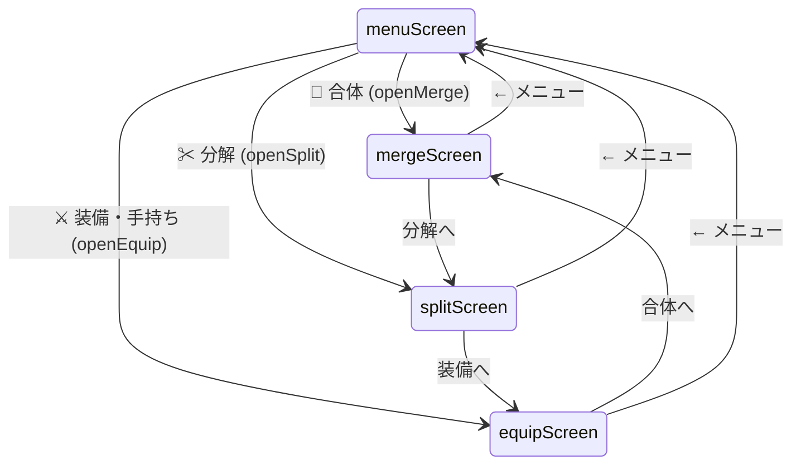
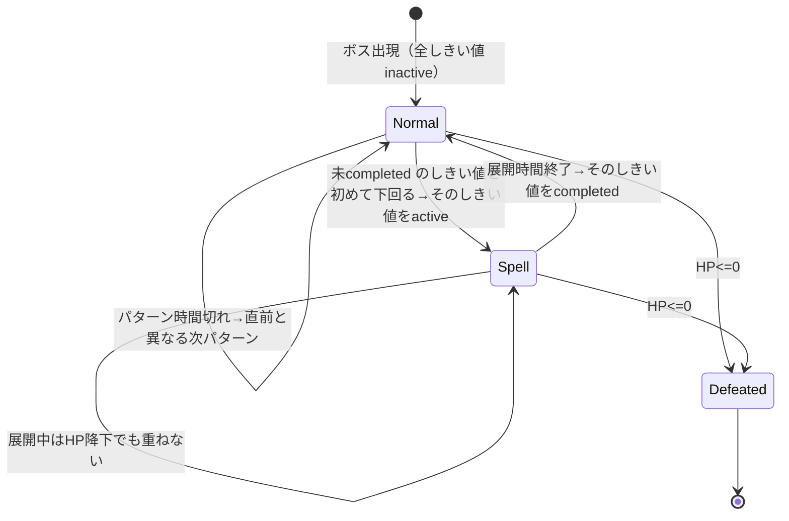

# 設計ドキュメント: 漢字合体 -カンジニオン- 強さ再設計＆弾幕強化（kanji-blast-balance-danmaku）

## 概要

既存ゲーム「漢字合体 -カンジニオン-」（内部ID: kanji-blast）に対する、ゲームバランスと演出の改良です。既存スペック `.kiro/specs/kanji-blast/`（現行挙動を「正」として文書化）に対し、本スペックは **現行挙動を意図的に変更する** 3つの機能追加を扱います。

1. **画面分割の追加**: 現行の「🧩 合体・分解」画面を「合体」専用と「分解」専用の2画面にさらに分割する（装備・手持ちと合わせて計4つの手持ち系画面）。
2. **強さ計算の再設計**: 現行の「画数 × 漢検級係数（最大5倍）」による急激な伸びをやめ、**画数を主軸**とし、漢検級と Plus_Value をそれぞれ **最大1.5倍のブースト** に抑える。
3. **ボス弾幕の強化（東方風）**: 単調な左右往復＋3方向弾をやめ、複数の弾幕パターン（自機狙い/自機外し/固定弾）と複数の弾種（大玉/小玉/遅い弾/細長い弾/予告線レーザー）を導入。ボスは **通常弾幕 → 特殊弾幕（スペルカード的）** を切り替える。

変更対象ファイル: `js/kanji-blast.js`（STG・強さ計算ラッパー）、`js/kanji-blast.pure.js`（強さ計算の純粋コア）、`pages/kanji-blast.html`（画面追加・描画）。既存の純粋関数「唯一の実体」方針（pure.js に実体、テストと本番が同一実体を参照）を踏襲する。

## 前提と非目標

- **前提**: 既存スペックのデータモデル（5テーブル）・読み判定・合体/分解の+値ロジック・レシピ索引は変更しない。本スペックは強さ計算式・STG弾幕・画面構成のみを変更する。
- **非目標**: 難易度の完全な数値チューニング（プレイテストで反復調整する前提）。マルチプレイ・新テーブル追加。既存の「装備・手持ち」画面の機能変更。

---

## 1. 画面分割（合体 / 分解 / 装備・手持ち）

### 現行

- `invScreen`（🧩 合体・分解）: 2〜3個選んで合体、1個選んで分解。
- `equipScreen`（⚔ 装備・手持ち）: 装備・にがす。
- 両画面は `hand` / `selected` を共有し `activeInvGrid()` で描画先を切り替える。

### 変更後

手持ち系を3画面に分割する。

| 画面ID | 役割 | 主な操作 |
|---|---|---|
| `mergeScreen`（🔧 合体） | 合体専用 | 2〜3個選んで合体（`doMerge`） |
| `splitScreen`（✂ 分解） | 分解専用 | 1個選んで分解（`doSplit`） |
| `equipScreen`（⚔ 装備・手持ち） | 装備・手放し（現行のまま） | 装備（`doEquip`）・にがす（`doRelease`） |

- メニューのボタンを「🔧 合体」「✂ 分解」「⚔ 装備・手持ち」「📖 図鑑」に再編する。
- 各画面を開く関数 `openMerge()` / `openSplit()` / `openEquip()` は、いずれも `selected = []` に初期化 → `showScreen(...)` → `renderInventory()` を呼ぶ。
- 3画面は同一の `hand` / `selected` を共有する。相互遷移ボタン（合体↔分解↔装備）と「← メニュー」を各画面に置く。
- `activeInvGrid()` を3画面対応に拡張する: アクティブ画面に応じて `mergeGrid` / `splitGrid` / `equipGrid` を返す。
- `renderInventory()` はアクティブグリッドに手持ちを描画する。合体プレビュー（`updateRecipePreview`）・ボタン活性（`updateInvButtons`）は対象要素が無い画面では何もしない（null 安全を維持）。
- 合体画面は「2〜3個選択」時に合体ボタンを活性化、分解画面は「1個選択かつ分解可能」時に分解ボタンを活性化する。



> 注: 既存スペック側の `invScreen` は廃止し `mergeScreen` / `splitScreen` に置き換える。`invGrid` は `mergeGrid` / `splitGrid` に分割される。

---

## 2. 強さ計算の再設計

### 現行式（変更前）

```
Final_Power = round(
  strokes × Kentei_Factor(最大5.0) × (1 + 読み数×0.1) × (1 + 図鑑種類数×0.02) × (1 + plus×0.05)
)
```

問題: `strokes × Kentei_Factor` が線形に乗算されるため、画数が増えると急激に強くなりすぎる（例: 3画→30画で単純10倍、さらに級で最大5倍）。

### 新式（変更後）

**画数を主軸**とし、漢検級と Plus_Value を **それぞれ最大1.5倍のブースト** に抑える。図鑑・読みボーナスは現行の意図（図鑑を埋める動機づけ）を維持しつつ係数は据え置き。

```
Final_Power = round(
  strokes
  × Kentei_Boost(kentei_level)          // 1.0 〜 1.5
  × Plus_Boost(plus, plus_cap)          // 1.0 〜 1.5
  × (1 + 読み数 × 0.1)                   // 現行維持
  × (1 + 図鑑種類数 × 0.02)              // 現行維持
)
```

#### Kentei_Boost（漢検級ブースト、1.0〜1.5）

現行の `KENTEI_FACTOR`（10級=1.0 … 1級=5.0）を、線形に 1.0〜1.5 の範囲へ正規化して使う。係数表の最小値 `Fmin=1.0`（10級）・最大値 `Fmax=5.0`（1級）を用いて:

```
Kentei_Boost(level) = 1 + 0.5 × (KENTEI_FACTOR(level) - Fmin) / (Fmax - Fmin)
                    = 1 + 0.5 × (KENTEI_FACTOR(level) - 1.0) / 4.0
```

- 10級（1.0）→ 1.00倍、5級（2.0）→ 1.125倍、2級（3.6）→ 1.325倍、1級（5.0）→ 1.50倍。
- 未定義級は `KENTEI_FACTOR` フォールバック 1.0 → ブースト 1.00倍。
- `Fmin`/`Fmax` は係数表の実値から算出する（表を変えても追従）。**Fmax=Fmin（係数が一律）のときは 1.0 を返す**（0除算回避）。

#### Plus_Boost（強化値ブースト、1.0〜1.5）

Plus_Value を、そのプレイヤーの Plus_Cap を基準に 1.0〜1.5 へ線形マップする（cap 到達で最大 1.5倍）。

```
Plus_Boost(plus, plus_cap) = 1 + 0.5 × clamp(plus, 0, plus_cap) / max(plus_cap, 1)
  clamp(x, lo, hi) = max(lo, min(x, hi))
```

- plus=0 → 1.00倍、plus=plus_cap → 1.50倍。
- **負数**は 0 に丸める（clamp の下限）。**plus_cap 超過**は plus_cap に丸める（上限）。これにより任意入力で常に 1.0〜1.5 に収まる。
- plus_cap が未取得/0 のときは分母を `max(plus_cap, 1)=1` にフォールバックして 0除算を防ぐ（plus は clamp で 0 になるため 1.00倍）。
- plus 省略時（図鑑表示など枚を特定しない箇所）は plus=0 として 1.00倍。

#### 比較例（strokes=10, 読み数=0, 図鑑種類=0 のとき）

| ケース | 現行 | 新式 |
|---|---|---|
| 10級・+0 | 10 × 1.0 = 10 | 10 × 1.00 × 1.00 = 10 |
| 1級・+0 | 10 × 5.0 = 50 | 10 × 1.50 × 1.00 = 15 |
| 10級・+3(cap3) | 10 × 1.0 × 1.15 = 12 | 10 × 1.00 × 1.50 = 15 |
| 1級・+3(cap3) | 10 × 5.0 × 1.15 = 58 | 10 × 1.50 × 1.50 = 23 |

→ 画数が支配的になり、級と+はそれぞれ穏やかな補正に収まる。

### 実装（純粋コアの変更）

`js/kanji-blast.pure.js` に以下を追加/変更する（唯一の実体）。

- 追加: `kenteiBoost(level)` … 上式。`KENTEI_FACTOR` の最小/最大から正規化。
- 追加: `plusBoost(plus, plusCap)` … 上式（負数・cap超過を clamp、cap=0/未取得で分母1）。
- 変更: `kanjiPowerPure(master, dex, char, plus, plusCap)` … 新式に差し替え。**引数に `plusCap` を追加**する（Plus_Boost に必要）。
- 本番ラッパー `kanjiPower(char, plus)` は `player.plus_cap`（未取得フォールバック 3）を渡すように変更する。

```
function kanjiPowerPure(master, dex, char, plus, plusCap) {
  const m = master[char];
  if (!m) return 0;
  const base = m.strokes
    * kenteiBoost(m.kentei_level)
    * plusBoost(plus || 0, plusCap)
    * (1 + unlockedReadingCountPure(dex, char) * 0.1)
    * (1 + dexCharCountPure(dex) * 0.02);
  return Math.round(base);
}
```

> `overallBonusPure` は新式でも図鑑種類ボーナスとして流用可能（`1 + dexCharCount×0.02`）。実装では `overallBonusPure(dex)` を再利用してよい。

### STG での威力（据え置き）

- ショット威力 = 装備ありなら `kanjiPower(shotChar, shotPlus)`、未装備は 5。
- 必殺威力 = 装備ありなら `kanjiPower(specialChar, specialPlus) × 6`、未装備は 30。
- 係数（×6 / 未装備値）は据え置き。強さの絶対値が下がるため、必要ならボスHPを後述のとおり調整する。

### ボスHPの再調整（バランス連動）

新式で自機火力の絶対値が下がる（特に高級・高画数漢字の伸びが抑制される）ため、現行のボスHP式 `(60 + stage×40) × (floor?2.2:1)` は相対的に硬くなりうる。プレイテストで、ショット威力の想定レンジに合わせて係数を調整する（本設計では式の形は維持し、係数のみ調整対象とする）。具体値は Requirements のチューニング項目とする。

---

## 3. ボス弾幕の強化（東方風）

### 全体構成

ボスに **攻撃パターン（弾幕）** の概念を導入する。ボスは複数の通常弾幕パターンを持ち、一定間隔で切り替える（直前と同じパターンは連続選択しない）。HPが規定しきい値を下回ると **特殊弾幕（スペルカード）** に移行する。フロアボスは通常ボスより多くのパターン／激しい特殊弾幕を持つ。

#### スペルカードの状態管理（再発動防止）

ボスは Spell_Card しきい値の集合（例: `[0.6, 0.3]`）を持ち、各しきい値に状態 `inactive` / `active` / `completed` を保持する。**毎フレーム HP を条件判定すると再開始してしまう** ため、以下のルールで1回限り発動を保証する。

- しきい値を**初めて下回った**とき（その状態が `inactive`）のみ `active` にして Spell_Card を開始する。
- Spell_Card の展開時間が終了したら、その状態を `completed` にする（以後そのしきい値では再発動しない）。
- Spell_Card が `active` の間にさらに下位しきい値を下回っても、**同時に重ねて発動しない**。現在の Spell_Card 終了後に、未 `completed` の下位しきい値を発動する。



ボスの状態フィールド例:
```
boss.spellThresholds = [0.6, 0.3]      // maxHp 比
boss.spellState = { 0.6: 'inactive', 0.3: 'inactive' }
boss.mode = 'normal' | 'spell'
boss.spellT = 残り展開フレーム（mode='spell' のとき）
```

### 弾のデータモデル（enemyBullets 拡張）

現行の弾は `{x, y, vx, vy}` の円のみ。以下のフィールドを追加して弾種を表現する。

```
{
  x, y,            // 位置
  vx, vy,          // 速度
  type,            // 'small' | 'big' | 'slow' | 'oval' | 'laser'
  r,               // 当たり半径（描画・衝突に使用）
  color,           // 描画色
  // レーザー用
  angle,           // 進行方向（描画の向き / oval の長軸）
  telegraph,       // >0 の間は予告線（無害）、0でレーザー本体に切替
  length,          // レーザー/細長弾の長さ
  life             // 生存フレーム（レーザーの持続など。省略時は画面外で消滅）
}
```

- 既存の等速移動（`x += vx; y += vy`）は維持しつつ、`type` に応じて描画・当たり判定・寿命処理を分岐する。
- **後方互換**: `type` 未指定の弾は従来どおり `type='small'` 相当（半径5の円）として扱う。

#### 弾種一覧

| type | 説明 | 速度感 | 当たり | 描画 |
|---|---|---|---|---|
| `small` | 小玉（標準） | 中 | r≈4 | 小円 |
| `big` | 大玉 | 遅〜中 | r≈10 | 大円（縁取り） |
| `slow` | 遅い弾 | 低速 | r≈6 | 中円（点滅で視認性） |
| `oval` | 細長い弾 | 中〜速 | 長軸方向に細長い楕円判定 | angle 方向に伸びた楕円 |
| `laser` | 予告線→レーザー | telegraph 中は無害、その後高速持続 | 線分と自機の距離判定 | 予告線（細い線）→ 太いレーザー |

### 予告線レーザーの挙動

1. 発生時 `telegraph = T`（例 45フレーム）で、始点からの直線を細い半透明線で描画（**当たらない**）。**telegraph 開始時に発射方向 `angle` を確定し、以後 telegraph 中・本体中とも方向を変えない（自機を追尾しない）**。弾幕として読みやすくするための固定方向仕様。
2. `telegraph` を毎フレーム減算。0 になったらレーザー本体に切替: `life = L`（例 30フレーム）、太い線で描画し、**線分と自機の距離 < 太さ/2 + player.r** で被弾判定。
3. `life` が尽きたら消滅。

### oval（細長い弾）の当たり判定

見た目は進行方向 `angle` に沿った細長い楕円で描画するが、当たり判定は **進行方向を軸とする線分（長さ `length`）＋半径 `r` のカプセル形状** とする（線分と自機中心の距離 < `r + player.r`）。回転楕円の厳密判定より実装が単純で安定する。`segPointDist` を流用する。

### 攻撃パターン（通常弾幕）

各パターンは「発射関数（tick に応じて enemyBullets を生成）」として実装する。ボスは `pattern`（現在パターン）と `patternT`（残り時間）を持ち、時間切れで次パターンを **ランダム選択** する。

| パターン | 概要 | 弾種 |
|---|---|---|
| `aimed`（自機狙い） | 一定間隔で自機方向へ弾を撃つ。数発の狙い撃ち or 自機方向±小角の3-way | small / big |
| `spread`（自機外し） | 自機方向を避けた扇状ばらまき（自機の左右に散らす） | small |
| `fixed`（固定弾） | 画面下向き固定の弾幕（等間隔の雨、往復するカーテン） | slow / small |
| `ring`（全方位） | ボス中心から放射状に n-way（回転オフセットで渦） | small |
| `bigLob`（大玉散布） | 低頻度で大玉をばらまく（避けやすいが被弾で痛い） | big / slow |

- 自機狙いは自機座標 `stg.player` を参照して角度を算出。自機外しは自機角度から一定角度ずらす。固定弾は角度固定。
- パターンは通常ボス2〜3種、フロアボス3〜4種からランダム。

### 特殊弾幕（スペルカード）

HP がしきい値（例: maxHp の 60%、30%）を下回るたびに1回、特殊弾幕へ移行する。特殊弾幕は演出（名前トースト表示・画面フラッシュ等）とともに、通常より密度・複雑さの高い1パターンを一定時間展開する。

| スペル例 | 概要 | 弾種 |
|---|---|---|
| 全方位回転 | 全方位 n-way を回転させながら連続発射（渦） | small |
| レーザー十字/扇 | 予告線 → 複数レーザーを同時発射 | laser |
| 大玉＋小玉複合 | 大玉をばらまき、その隙間に自機狙い小玉 | big + small |

- フロアボスは特殊弾幕をより多く／激しくする（しきい値を増やす、同時弾数を増やす）。
- 特殊弾幕中はボスの移動パターンも変える（中央停止 or 特徴的な軌道）。

### ボスの動き（単調な往復をやめる）

現行は左右等速往復のみ。以下から選ぶ／組み合わせる:

- **サイン揺動**: `x = center + A×sin(tick×ω)`、`y` も小さく上下。
- **8の字/リサージュ**: `x = cx + A×sin(at)`, `y = cy + B×sin(bt)`。
- **瞬間移動＋停止**: 数秒ごとに左右へワープして撃つ（特殊弾幕向き）。
- パターン切替時に動きも切り替える。

### 更新ループの変更点（updateEntities / draw）

- `updateEntities()` のボス節を、パターン駆動（`bo.pattern` / `bo.patternT` / `bo.spellPhase`）に置き換える。発射は各パターン関数へ委譲。
- 敵弾更新に `type` 別処理を追加: レーザーの telegraph/life 管理、oval の向き、big/slow の速度。
- 衝突判定（敵弾 vs 自機）を弾種別に拡張: 円は距離判定、oval は楕円 or 長軸方向補正、laser は線分距離判定。
- `draw()` に弾種別描画を追加（色・形・予告線）。
- 必殺技（`fireSpecial`）の「敵弾全消去」は据え置き（`enemyBullets = []`）。予告線・レーザーも配列クリアで消える。

### 実装配置

- 弾幕パターン関数・弾種定数は `js/kanji-blast.js`（DOM/Canvas 依存の STG エンジン内）に置く。
- 純粋に計算可能な部分（例: n-way の角度配列生成 `ringAngles(n, offset)`、自機狙い角度 `aimAngle(from, to)`、レーザー線分と点の距離 `segPointDist(...)`）は `js/kanji-blast.pure.js` に純粋関数として切り出し、テスト対象にする。

---

## テスト戦略

### 純粋関数（pure.js・vitest + fast-check）

強さ計算:
- `kenteiBoost(level)`: 全級で 1.0〜1.5 の範囲に収まる。10級=1.0倍、1級=1.5倍（境界）。未定義級=1.0倍。
- `plusBoost(plus, plusCap)`: plus=0→1.0、plus=cap→1.5。cap=0/未取得で 0除算しない。plus>cap で 1.5 頭打ち。**負数 plus は 0 扱いで 1.0**（clamp）。
- `kenteiBoost(level)`: Fmax=Fmin のとき 1.0（0除算回避）。
- `kanjiPowerPure(...)`: 新式の境界値。master に char 無し→0。
- **Property（単調性）**: 他項固定で plus 増加により Final_Power は減らない（`plus1 ≤ plus2 → FP(plus1) ≤ FP(plus2)`）。
- **Property（上限）**: Kentei_Boost・Plus_Boost はいずれも **任意入力（負数・巨大値・0/未取得 cap 含む）で** [1.0, 1.5] に収まる。
- **回帰**: 現行式との比較例（上表）を固定テスト化。

弾幕ヘルパー:
- `ringAngles(n, offset)`: 要素数 n、等間隔（2π/n）、offset 反映。
- `aimAngle(from, to)`: 既知座標で期待角度。
- `segPointDist(ax,ay,bx,by,px,py)`: 線分と点の最短距離（端点・内側の代表ケース）。
- **Property**: `segPointDist` は常に非負。線分上の点で 0。

### 手動確認（ブラウザ）

- 合体/分解/装備の3画面遷移と共有選択。
- 強さ表示（図鑑・装備）の新値が妥当（画数主軸・級/＋が穏やか）。
- ボスが複数パターンを切り替える／HPしきい値で特殊弾幕に移行する。
- 各弾種（大玉/小玉/遅い/細長い/予告線→レーザー）が表示・被弾判定される。
- 必殺で敵弾（レーザー含む）が消える。
- コンソールエラーなし、SW 更新。

---

## 設計上の考慮事項 / リスク

- **バランス調整の反復前提**: 係数（Kentei_Boost/Plus_Boost の上限 0.5、ボスHP、弾速、弾数）はプレイテストで調整する。設計は式の形と範囲を定義し、数値はチューニング対象。
- **パフォーマンス**: 弾数が増える（特に特殊弾幕）。1フレーム内の弾ループ・当たり判定が増加する。同時弾数の上限を設定値 `MAX_ACTIVE_BULLETS`（プレイテストで調整）として持ち、**上限到達時は新規発射を抑制することを基本**とし、既存弾（特にレーザー等の演出弾）は強制破棄しない。画面外・寿命切れの弾は破棄する。Canvas 2D の描画コストにも注意（大量の `arc` 呼び出し）。
- **既存スペックとの関係（優先順位）**: 本変更は既存 `kanji-blast` スペックの Requirement 9（強さ計算）・STG（Requirement 3/4）・画面構成（Requirement 5）の挙動を変更する。**記載が矛盾する場合は本スペックを変更後仕様として優先する。** 実装完了後、既存スペックの該当箇所を追従更新し、最終的に両スペック間に矛盾を残さない（Requirements のタスクで扱う）。
- **後方互換**: 既存のセーブデータ（plus/plus_cap/装備）はそのまま利用可能。強さの絶対値が変わるだけで、データ構造の変更はない。
