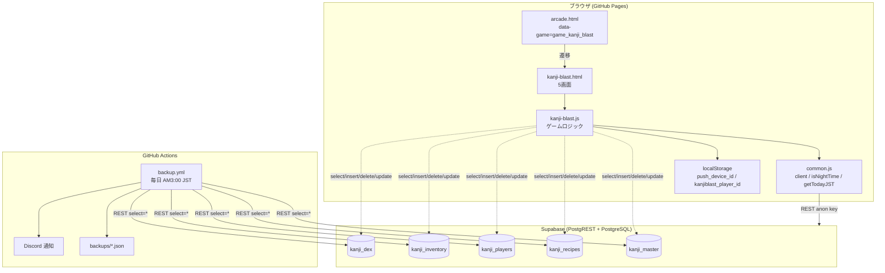
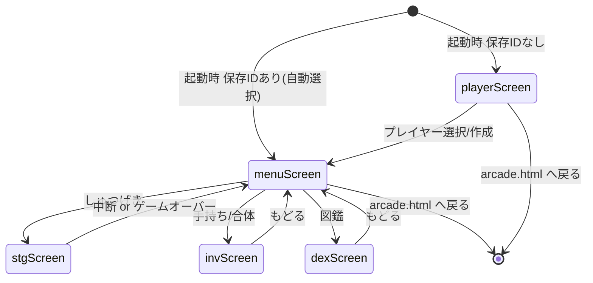
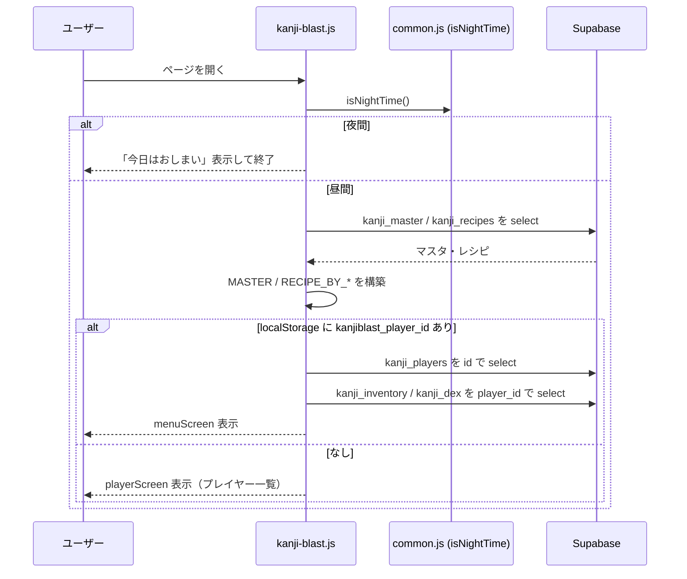
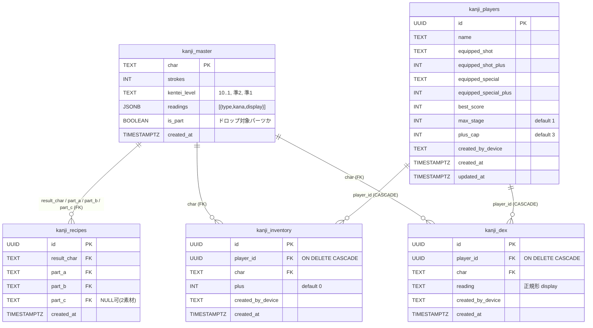
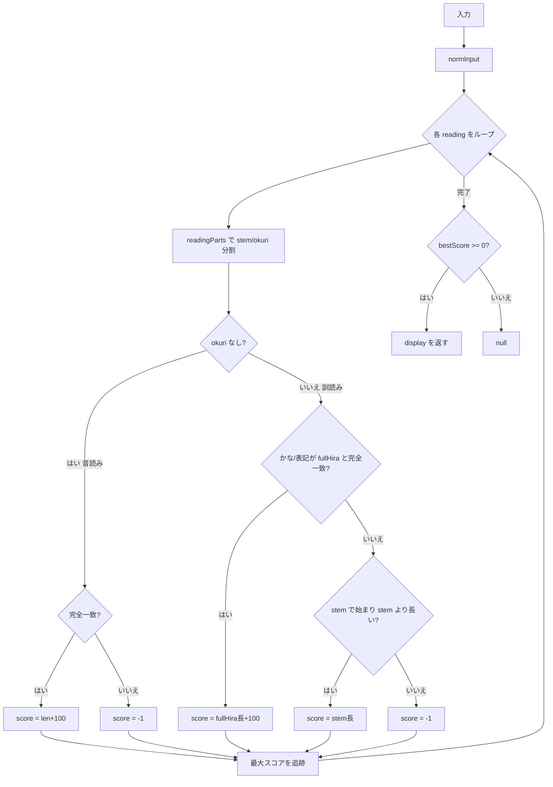
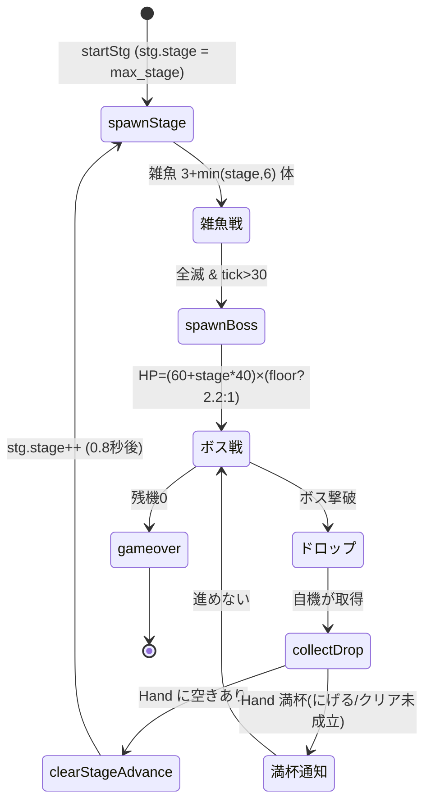
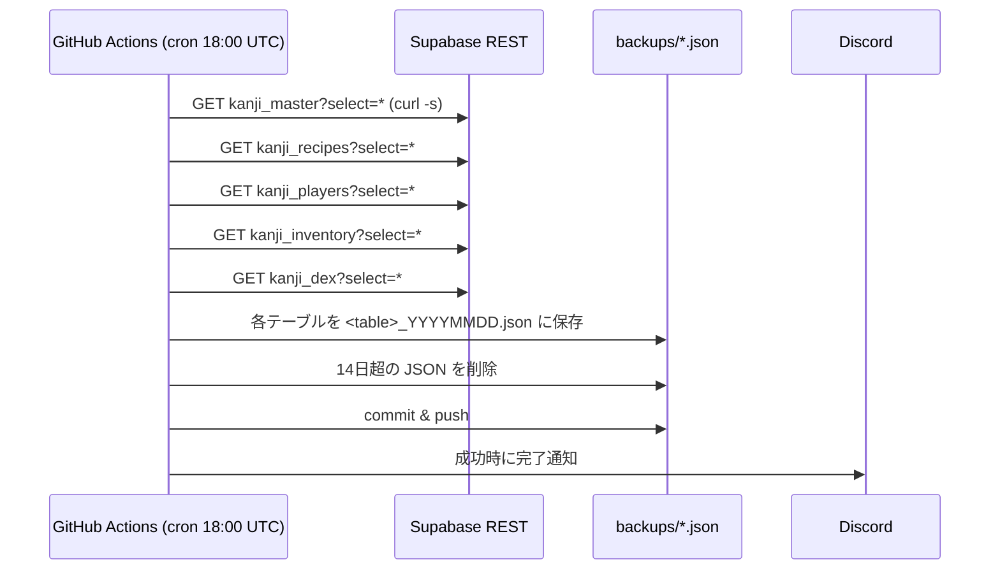

# 設計ドキュメント: 漢字合体 -カンジニオン-（内部ID: kanji-blast）

## 概要

漢字合体 -カンジニオン-（kanji-blast）は、縦スクロールSTGと漢字合体パズルを組み合わせた家庭向けの教育ゲームです。プレイヤーはSTGで敵・ボスを倒して漢字パーツを集め、レシピに沿って合体させて画数の多い強い漢字を作り、読み仮名を図鑑に登録して全体を強化していきます。

本ドキュメントは **既に実装済みの挙動を「正」として文書化した設計** です。理想的なアーキテクチャを新たに提案するものではなく、実ファイル（`js/kanji-blast.js` / `pages/kanji-blast.html` / `pages/arcade.html` / `sql/*.sql` / `.github/workflows/backup.yml`）の実装に厳密に一致させています。既知の非原子性リスクなど、現行実装の限界も「未解決事項」として明示的に記録します（後述「設計上の考慮事項 / 未解決事項」）。

対応する要件は `.kiro/specs/kanji-blast/requirements.md`（Requirement 1〜12）です。

## アーキテクチャ

### 全体構成

- **フロントエンド**: GitHub Pages 上の静的サイト（HTML + Vanilla JS）。ビルド工程なし。`pages/kanji-blast.html` が単一 HTML 内に5つの論理画面（`playerScreen` / `menuScreen` / `stgScreen` / `invScreen` / `dexScreen`）を持ち、`showScreen(id)` で `.screen.active` を切り替える画面切替方式。`js/kanji-blast.js` が全ロジックを担う。
- **バックエンド**: Supabase の REST エンドポイント（PostgREST）。匿名（anon / publishable）キーでアクセス。サーバーサイドコードは持たない。
- **共通クライアント**: `common.js` が提供する `client`（Supabase クライアント）、`isAdmin`、`isNightTime()`、`getTodayJST()` などを共用。
- **端末識別**: `localStorage.push_device_id` を Device_ID として流用（common.js と共用）。無ければ `crypto.randomUUID()`（フォールバックあり）で生成して保存。
- **状態管理**: モジュールスコープのグローバル変数（`MASTER`, `RECIPES`, `RECIPE_BY_RESULT`, `RECIPE_BY_PARTS`, `player`, `hand`, `dex`, `selected`, `stg`）。フレームワーク不使用。
- **公開制御**: `pages/arcade.html` のカードが `data-game="game_kanji_blast"` を持ち、既存の game_publish 機構で公開/非公開を制御。



### 画面遷移

`showScreen(id)` が `.screen.active` を切り替える単一ページ構成。物理的なページ遷移はアーケードへの戻り（`arcade.html`）のみ。



### 起動シーケンス

`init()` IIFE が実行する。Night_Mode 判定 → マスタ読み込み → 保存プレイヤーの自動選択、の順。



## データモデル

Data_Store は Supabase 上の5テーブル。`kanji_master` / `kanji_recipes` は全端末共通のマスタ（読み取り中心）、`kanji_players` / `kanji_inventory` / `kanji_dex` は子供（Player）ごとのプレイデータで `player_id` により分離する。子テーブルは Player 削除時に `ON DELETE CASCADE` で連動削除される。

### ER図



### テーブル定義（実装準拠）

#### kanji_master（共通マスタ）
- `char TEXT PRIMARY KEY` — 漢字1文字
- `strokes INT NOT NULL` — 画数
- `kentei_level TEXT NOT NULL DEFAULT '10'` — 漢検級（"10","9",…,"2","準2","準1","1"）
- `readings JSONB NOT NULL DEFAULT '[]'` — 読み配列（後述の JSONB シェイプ）
- `is_part BOOLEAN NOT NULL DEFAULT false` — 敵ドロップ対象の基本パーツか
- `created_at TIMESTAMPTZ DEFAULT now()`

#### kanji_recipes（共通マスタ）
- `id UUID PRIMARY KEY DEFAULT gen_random_uuid()`
- `result_char TEXT NOT NULL REFERENCES kanji_master(char)`
- `part_a TEXT NOT NULL REFERENCES kanji_master(char)`
- `part_b TEXT NOT NULL REFERENCES kanji_master(char)`
- `part_c TEXT REFERENCES kanji_master(char)` — **NULL 可**。2素材レシピは NULL、3素材レシピは値あり
- `UNIQUE (result_char, part_a, part_b, part_c)` — 同一結果に複数レシピ可（例: 森=木+林 / 森=木+木+木）。`part_c=NULL` 行は NULL の一意比較の性質上 ON CONFLICT で重複検知できないため、seed は冪等性確保のため `DELETE FROM kanji_recipes` 後に再投入する
- `idx_kanji_recipes_result (result_char)`

> 補足: `alter_kanji_recipes_three_parts.sql` が旧 `UNIQUE(result_char)` を撤廃し `part_c` と `UNIQUE(result_char, part_a, part_b, part_c)` を追加する（既存DB向けマイグレーション）。

#### kanji_players（Player ごとのセーブ）
- `id UUID PRIMARY KEY`
- `name TEXT NOT NULL` — 子供の表示名（一意性は要求しない）。個人情報を含む点はバックアップ設計・セキュリティ考慮を参照
- `equipped_shot TEXT` / `equipped_shot_plus INT NOT NULL DEFAULT 0`
- `equipped_special TEXT` / `equipped_special_plus INT NOT NULL DEFAULT 0`
- `best_score INT NOT NULL DEFAULT 0`
- `max_stage INT NOT NULL DEFAULT 1` — **次回開始可能ステージ番号**（`startStg` が `stg.stage` をこの値で初期化する）。あるステージをクリアすると +1 される。名称は「max」だが、意味は「クリア済み最大ステージ + 1 = 次に始めるステージ」であり、その番号自体はまだ未クリアである点に注意
- `plus_cap INT NOT NULL DEFAULT 3` — Plus_Value 上限（Floor_Boss 撃破で +1）
- `created_by_device TEXT` — 作成端末 ID（削除の端末制限に使用）
- `created_at` / `updated_at TIMESTAMPTZ DEFAULT now()`

> `equipped_*_plus` と `plus_cap` は `alter_kanji_plus_enhancement.sql` による追加列。

#### kanji_inventory（Hand・最大10、同一漢字複数可）
- `id UUID PRIMARY KEY`
- `player_id UUID NOT NULL REFERENCES kanji_players(id) ON DELETE CASCADE`
- `char TEXT NOT NULL REFERENCES kanji_master(char)`
- `plus INT NOT NULL DEFAULT 0` — 強化値（+0〜plus_cap）
- `created_by_device TEXT`
- `created_at`、`idx_kanji_inventory_player (player_id)`

> Hand 上限10枠はアプリ層の制約（`MAX_HAND = 10`）。DB は行数を制限しない。`plus`・`equipped_*_plus` にも DB の CHECK 制約はなく、範囲（`0 〜 plus_cap`）や非負はアプリ層でのみ保証される（後述「データ整合性ルール」参照）。

#### kanji_dex（図鑑＝読み解放記録）
- `id UUID PRIMARY KEY`
- `player_id UUID NOT NULL REFERENCES kanji_players(id) ON DELETE CASCADE`
- `char TEXT NOT NULL REFERENCES kanji_master(char)`
- `reading TEXT NOT NULL` — 解放した読みの正規形（display）
- `created_by_device TEXT`
- `created_at`
- `UNIQUE (player_id, char, reading)` — 同一 Player の同一 char の同一読みは1件。違反時（`23505`）はアプリ層で「登録ずみ」として扱う
- `idx_kanji_dex_player (player_id)`

### readings JSONB シェイプ

`kanji_master.readings` は読みオブジェクトの配列。各要素は次の形。

```json
{ "type": "訓", "kana": "う.まれる", "display": "生まれる" }
```

- `type`: "音" / "訓" 等の分類（判定には使わず、表示や区別の目安）
- `kana`: 判定に使うかな表記。`"."` は **送り仮名の境界**（例 `"う.まれる"` → 語幹 "う" / 送り "まれる"）。`"."` が無い読み（音読み等）は送り仮名なし
- `display`: 図鑑に登録・表示する正規形（例 "生まれる" / "いきる" / "セイ"）

読み込み時、`readings` が文字列で来た場合は `JSON.parse` を試み、失敗時や非配列は `[]` にフォールバックする（`loadMaster`）。

## コンポーネントとインターフェース

`js/kanji-blast.js` は単一モジュール。論理的な構成要素は以下。

| 構成要素 | 主な責務 | 主な関数 |
|---|---|---|
| Bootstrap | 起動・Night_Mode・マスタ読込 | `init`, `loadMaster` |
| Player 管理 | 一覧/作成/選択/削除・データ再読込 | `loadPlayers`, `createPlayer`, `selectPlayer`, `deletePlayer`, `reloadPlayerData`, `giveStarterKanji` |
| 強さ計算 | Final_Power と各ボーナス | `kenteiFactor`, `unlockedReadingCount`, `dexCharCount`, `overallBonus`, `kanjiPower` |
| Reading_Resolver | 読み判定・正規化 | `toHira`, `toKata`, `normInput`, `readingParts`, `matchScore`, `resolveReading` |
| Merge_System | 合体/分解・レシピ索引・+値 | `recipeParts`, `partKey`, `partsMaxStroke`, `chooseSplitRecipe`, `mergedPlus`, `splitPlus`, `doMerge`, `doSplit`, `pickMergeResult` |
| 装備/手放し | 装備・にがす | `doEquip`, `doRelease` |
| 図鑑 | 図鑑描画・読み登録 | `renderDex`, `submitReading` |
| STG_Engine | STG本体・ボス・ドロップ・スコア | `startStg`, `stopStg`, `spawnStage`, `spawnBoss`, `loop`, `updateEntities`, `fireSpecial`, `dropFromBoss`, `collectDrop`, `raisePlusCap`, `clearStageAdvance`, `endStg`, `draw` |

### レシピ索引の構造

```
RECIPE_BY_RESULT: result_char -> [ [parts...], ... ]   // 分解候補（複数レシピ）
RECIPE_BY_PARTS:  "a|b|c"(sorted) -> [result_char, ...] // 合体候補（選択式）
```

- `recipeParts(rc)` = `[part_a, part_b, part_c].filter(Boolean)`（part_c が NULL なら2要素）
- `partKey(parts)` = `parts.slice().sort().join('|')`（順不同一致のためソート）

## 強さ計算（Final_Power）

### 計算式

```
Final_Power = round(
  strokes
  × Kentei_Factor(kentei_level)
  × (1 + そのcharの解放読み数 × 0.1)
  × (1 + 図鑑登録char種類数 × 0.02)
  × (1 + plus × 0.05)
)
```

実装対応:
- `unlockedReadingCount(char)` = Dex 内でその char の distinct reading 数
- `dexCharCount()` = Dex に登録された distinct char 種類数
- `overallBonus()` = `1 + dexCharCount() * 0.02`
- `kanjiPower(char, plus)` = `Math.round(base * overallBonus() * (1 + p * 0.05))`、`base = strokes * kenteiFactor(level) * (1 + unlockedReadingCount * 0.1)`
- マスタに char が無い場合は 0。plus 省略時は 0（図鑑表示など枚を特定しない箇所）

### KENTEI_FACTOR 表

| 級 | 係数 | 級 | 係数 |
|---|---|---|---|
| 10 | 1.0 | 4 | 2.4 |
| 9 | 1.2 | 3 | 2.8 |
| 8 | 1.4 | 準2 | 3.2 |
| 7 | 1.6 | 2 | 3.6 |
| 6 | 1.8 | 準1 | 4.2 |
| 5 | 2.0 | 1 | 5.0 |

未定義の級は `1.0`（`kenteiFactor` のフォールバック）。

### STG での威力

`stgConfig()` が装備からショット/必殺の威力を算出する。

- ショット威力 `shotPower` = 装備ありなら `kanjiPower(shotChar, shotPlus)`、**未装備は 5**
- 必殺威力 `specialPower` = 装備ありなら `kanjiPower(specialChar, specialPlus) * 6`、**未装備は 30**

## Plus_Value（エンハンス）ルール

- **合体後の+値** `mergedPlus(items)` = `min( Σ(素材plus) + 1 , plus_cap )`。plus_cap は `player.plus_cap`（未取得フォールバック 3）
- **分解後の各素材の+値** `splitPlus(resultPlus, partCount)` = `max(0, floor((resultPlus - 1) / partCount))`
- **非可逆性**: 分解の整数除算で切り捨てられた端数は復元されない。したがって合体→分解の往復で Plus_Value は減りうる（例: +5 を3素材へ分解 → 各 +1、合計 +3 相当）
- **上限拡張**: Floor_Boss 撃破ごとに `raisePlusCap()` が `plus_cap += 1`（初期3 → 初回撃破で4）
- **装備の保存**: `equipped_shot` / `equipped_special` は char と plus の両方を保存（`equipped_*_plus`）

## Reading_Resolver アルゴリズム

### 正規化

- `toHira(s)`: カタカナ→ひらがな（`\u30a1-\u30f6` を -0x60）
- `toKata(s)`: ひらがな→カタカナ（+0x60）
- `normInput(s)`: 前後空白除去 + 全空白除去 + 区切り点（「・」「･」）除去
- `readingParts(kana)`: `"."` の位置で `{stem, okuri}` に分割。`"."` なしなら `{stem: kana, okuri: ''}`

### matchScore(input, kana, char)

対象漢字 char を渡すのは「生まれる」のような **漢字表記入力** に対応するため。戻り値は一致スコア（大きいほど良い一致、不一致は -1）。

- **送り仮名なし（okuri が空、音読み等）**: 入力ひらがなが kana のひらがな化と完全一致なら `len + 100`、それ以外 -1
- **送り仮名あり（訓読み）**:
  - `fullHira` = `toHira(stem + okuri)`（例 "うまれる"）
  - `inKanaFromWriting` = `toHira(input.replace(char, stem))`（例 "生まれる" → "うまれる"）
  - 完全一致（かな or 表記）なら `fullHira.length + 100`
  - 活用ゆらぎ: 候補（かな / 表記置換）が `stemHira` で始まり、かつ `stemHira` より長ければ `stemHira.length` を返す（続く文字の活用形正しさは検証しない）
  - いずれも該当しなければ -1

### resolveReading(char, input)

正規化した入力を全 readings と `matchScore` で照合し、**最大スコアの読みの display** を返す（該当なしは null）。これにより:
- 完全一致（+100 加点）> 活用ゆらぎ（語幹長のみ）
- 活用ゆらぎ同士では語幹が長い読みを優先

**同点の扱い**: 比較は `if (sc > bestScore)`（厳密大なり）で行うため、スコアが同点の場合は **`readings` 配列で先に出現した読み** が採用される。したがって同点候補が併存する char では JSON 配列の順序が結果に影響する（テスト・シード編集時の注意点）。

**活用ゆらぎの広さ**: 活用ゆらぎ判定は「語幹で始まり語幹より長い」ことのみを見る前方一致であり、続く文字が日本語文法として正しい活用形かは検証しない。想定外の入力（例 語幹「うご」に対する「うごXYZ」）も語幹一致さえすれば正解になりうる、意図的な簡易判定である。

したがって「うむ」は `う.む`（完全一致）に、「うまれる」は `う.まれる`（完全一致）に解決され、両者が区別される。



## 合体 / 分解フロー

### 合体（doMerge）

1. 選択2〜3個の char から `partKey` を作り `RECIPE_BY_PARTS` を参照
2. 結果が複数なら `pickMergeResult`（prompt 番号入力）で選択。範囲外は「番号がちがうよ」で中断
3. `mergedPlus` で新しい+値を算出
4. 素材を `kanji_inventory.delete().in('id', ids)` で削除 → 結果を `insert(...).select().single()` で追加
5. ローカル `hand` を更新し再描画

### 分解（doSplit）

1. 選択1個の char に対し `chooseSplitRecipe`（`partsMaxStroke` 降順で最初＝画数最大パーツを含むレシピを優先）
2. 空き枠チェック: `hand.length - 1 + parts.length > MAX_HAND` なら不足を通知して中断
3. `splitPlus` で各素材の+値を算出
4. 元漢字を `delete().eq('id', id)` → 素材を `insert(rows).select()` で追加
5. ローカル `hand` を更新し再描画

> 合体・分解とも DELETE → INSERT の2操作を別々の REST 呼び出しで行う（非トランザクション）。詳細と限界は「未解決事項」を参照。

## STG ループ

### セッションと永続値

- セッション現在ステージ: `stg.stage`（`startStg` で `player.max_stage || 1` に初期化）
- 永続値: `player.max_stage`（DB）。**次回開始可能ステージ番号**。`clearStageAdvance` で進めた `stg.stage` がこの値を超えたときのみ更新される（後述の fire-and-forget）

### ステージ進行



### ステージクリア成立条件（重要仕様）

**ボス撃破はステージクリアの成立条件ではない。** ボス撃破 → 漢字ドロップ → **自機がドロップを取得** して初めて `clearStageAdvance()` が呼ばれステージが進む。Hand 満杯でドロップを取得できない場合はステージが進まない（クリア未成立）ため、この場合は手持ちを「にがす」等で空けてから再挑戦する必要がある。

### 生成ロジック

- `spawnStage()`: 雑魚 `n = 3 + min(stage, 6)` 体。HP `3 + stage`
- `spawnBoss()`: `floor = (stage % 5 === 0)`。HP `(60 + stage*40) * (floor ? 2.2 : 1)`、Floor_Boss は半径/速度も増、描画は紫「王」（通常は赤「鬼」）
- `loop()`: 背景描画、`tick - lastShot >= 10` で自動連射、`updateEntities()` → `draw()`、必殺クールダウン更新、HUD 更新、`requestAnimationFrame`

### ドロップ選定（dropFromBoss）

- **通常ボス**: `is_part=true`（Basic_Part）から一様ランダム、Plus_Value 0
- **Floor_Boss**: `is_part=false`（Compound_Kanji）が対象
  - `strokeCap = 6 + floor(stage/5)*4` 以下でフィルタ
  - フィルタ結果が空なら Compound_Kanji 全体、それも空なら Basic_Part にフォールバック
  - 画数降順にソートし **上位 `ceil(n/3)` 件**（最低1件）を抽選対象、その中から一様ランダム
- Floor_Boss ドロップは `collectDrop` で `min(1, plus_cap)` の Plus_Value 付き。`plus_cap` は初期3・Floor_Boss 撃破ごとに +1 で 1 未満にならないため、**現行実装では実質常に +1**（式の意図は「必ず +1、ただし plus_cap を超えない」）

### 取得とステージ進行（collectDrop / clearStageAdvance）

- Hand 満杯（`hand.length >= MAX_HAND`）なら「手持ちがいっぱい！ ○ はにげちゃった」を通知し **ステージを進めない**（クリア未成立）
- 空きがあれば inventory へ insert し hand に追加 → `clearStageAdvance()`
- `clearStageAdvance()`: `stg.stage++`。新ステージが `max_stage` を超えるなら `max_stage` を更新して **await しない**（fire-and-forget）DB 更新。0.8秒後に次ステージ生成

### 被弾・必殺・終了

- 残機 `_lives = 3`。被弾で `_invuln = 60` 付与し 1 減。0以下で `endStg(false)`
- `fireSpecial()`: `specialReady` かつ必殺装備時のみ。全敵・ボスに `specialPower`、敵弾消去、クールダウン 300（5秒）
- Floor_Boss 撃破時に `raisePlusCap()`
- `endStg()`: スコアが `best_score` を超えれば更新（こちらは **await する**）→ アラート表示 → メニューへ

> `best_score` を await し `max_stage` を await しないのは実装上意図的である。`best_score` はゲーム終了時に一度だけ確定保存すればよいため完了を待つ。一方 `max_stage` はプレイ中にステージを止めないため fire-and-forget にしている（詳細は「未解決事項 2」）。

## デバイス制限とデータ分離

- **データ分離**: Hand・Dex・セーブは `player_id` で分離（`reloadPlayerData` は `.eq('player_id', player.id)`）
- **端末制限（誤操作防止・二重化）**: 削除は `created_by_device === DEVICE_ID` のときだけ UI に削除ボタンを表示し、さらに `deletePlayer` は DELETE 条件に `.eq('created_by_device', DEVICE_ID)` を付与する。UI を改造しても通常のアプリコード経由では他端末の Player を消しにくい二重の作りになっている（ただし RLS Allow all のためセキュリティ境界ではない）
- **CASCADE**: Player 削除で子テーブル（inventory / dex）は DB 側で連動削除
- **RLS の位置づけ**: 5テーブルとも `ENABLE ROW LEVEL SECURITY` + 全操作許可ポリシー（`USING(true) WITH CHECK(true)`）。これは **公開アプリからの匿名 REST アクセスを成立させるため** に全操作を許可しているのであり、アクセス拒否のためではない。REST を直接呼べば削除は起こりうるため、端末制限は **セキュリティ保証ではなく誤操作防止** に留まる（家庭内/家族向け PWA 前提、匿名アクセス）。ポリシー名が `"Allow all"` である背景を将来の保守者が誤解しないよう、意図をここに明記する

## バックアップ設計

- **トリガ**: `.github/workflows/backup.yml`、cron `0 18 * * *`（AM3:00 JST）+ `workflow_dispatch`（手動）
- **対象**: 全体ジョブの一部として kanji 系5テーブル（`kanji_master` / `kanji_recipes` / `kanji_players` / `kanji_inventory` / `kanji_dex`）を REST `?select=*` で取得
- **保存**: テーブルごとに `backups/<table>_YYYYMMDD.json`（復元可能な生 JSON）。`git add backups/` → 差分あればコミット → push
- **保持（作業ツリーのみ）**: `find backups/ -name "*.json" -mtime +14 -delete` は **作業ツリー上のファイル** を14日超で削除する。これらはコミットされているため、**削除後も Git 履歴には過去のバックアップが残り続ける**。すなわち「14日保持」は作業ツリー上の話であり、実際のデータ（子供の名前など）は Git 履歴に永続的に残る点に注意
- **通知**: 成功時（`if: success()`）に Discord Webhook で完了通知
- **復元**: 本設計の範囲は取得・保存のみ。復元は自動 API を持たず、必要時に JSON を各テーブルへ再投入する **手動作業（スコープ外）**
- **個人情報の露出**: `kanji_players.name`（子供の表示名）や `created_by_device` を含む JSON が `backups/` にコミットされる。リポジトリが公開の場合、これらの JSON は第三者から参照可能であり、Git 履歴からも消えない（下記セキュリティ考慮を参照）



## データ整合性ルール

「何が正しい状態か」を DB 保証・アプリ保証に分けて整理する。DB が保証しない項目はアプリ層の実装にのみ依存する。

**DB が保証する（スキーマ）**
- Player の `id` は UUID PK。削除時に `kanji_inventory` / `kanji_dex` を `ON DELETE CASCADE` で連動削除
- `kanji_inventory.char` / `kanji_dex.char` / レシピ各パーツは `kanji_master(char)` を参照（FK）
- `kanji_dex (player_id, char, reading)` は UNIQUE
- `kanji_recipes (result_char, part_a, part_b, part_c)` は UNIQUE
- 各種 `NOT NULL` / `DEFAULT`

**アプリのみが保証する（DB CHECK なし）**
- Hand は同一 Player で最大10件（`MAX_HAND`）
- `kanji_inventory.plus` は `0 〜 player.plus_cap`（非負・上限クリップは合体/分解時のみ適用）
- `equipped_shot` / `equipped_special` に入る char は「装備した時点で」Hand に存在した漢字（その後の合体・にがす等で在庫が消えても装備列は自動追従しない場合がある。`doRelease` は同一 char+plus の在庫が他に無いときのみ装備解除する）
- 読み（reading）は `kanji_master.readings[].display` のいずれか（`resolveReading` の戻り値のみ登録）

## エラー処理

| シナリオ | 現行の挙動 |
|---|---|
| マスタ取得で例外 | `try/catch` で捕捉し `m=[], r=[]` として継続（`loadMaster`） |
| マスタ0件 | 白画面にせず「データがまだ準備できてないみたい（テーブル未作成）」をトースト。**DB障害・ネットワーク障害・RLSエラー・テーブル未作成・真に0件は、いずれも画面上は同一の案内になる**（区別しない） |
| プレイヤー未存在（自動選択/選択時） | `kanjiblast_player_id` を削除し playerScreen へ |
| 名前空でプレイヤー作成 | 作成せず「なまえを入れてね」 |
| 合体で組み合わせ不一致 | 「このくみあわせは合体できないよ」 |
| 合体の結果選択で範囲外番号 | 「番号がちがうよ」で中断 |
| 分解で空き枠不足 | 分解せず不足数を通知 |
| 読み不一致 | Dex 未登録・「ちがうみたい」 |
| Dex 重複（アプリ判定 or `23505`） | 「登録ずみ」扱い、登録しない |
| Hand 満杯でドロップ取得 | 「手持ちがいっぱい！ ○ はにげちゃった」、ステージ進めず |

## テスト戦略

- **ユニット（純粋関数）**: `toHira` / `normInput` / `readingParts` / `matchScore` / `resolveReading` / `partKey` / `recipeParts` / `partsMaxStroke` / `chooseSplitRecipe` / `mergedPlus` / `splitPlus` / `kenteiFactor` / `kanjiPower`。DB 非依存で検証可能
- **プロパティベース候補**:
  - `splitPlus(mergedPlus(...))` の非可逆性（往復で Plus_Value が増えない）
  - `partKey` の順不同不変性（並べ替えても同一キー）と重複素材の区別（`木+林 = 林+木`、`木+木 ≠ 木+木+木`）
  - `resolveReading` のスコア順序（完全一致 > 活用ゆらぎ）
- **統合（要 Supabase / モック）**: 合体・分解の DELETE→INSERT、ドロップ取得→ステージ進行、Dex UNIQUE 違反時のハンドリング
- **障害系（既知の限界の再現）**: 設計書が挙げる未解決事項を実際に検証する。合体/分解で DELETE 成功→INSERT 失敗（素材消失）、`max_stage` UPDATE 失敗（進行巻き戻り）、`best_score` UPDATE 失敗、ドロップ insert 失敗、Player 削除の途中失敗
- **手動確認**: STG のタッチ操作追従、必殺クールダウン、Night_Mode 表示、アーケード公開制御

## パフォーマンス考慮

- STG は `requestAnimationFrame` で 1 フレーム内に全エンティティ更新・衝突判定・描画。エンティティ数は小規模（雑魚最大9・弾少数）で Canvas 2D に収まる
- マスタ・レシピは起動時に一括取得しメモリ索引化。以降のプレイ操作でマスタ再取得はしない

## セキュリティ考慮

- 匿名（anon / publishable）キー前提のため、認証情報等の機密データは扱わない設計（家庭内向け）。ただし `kanji_players.name` は子供の表示名という **個人情報** であり、バックアップ経由で Git（および公開時は第三者）に露出しうる点は運用上の留意事項
- RLS は Allow all で、アクセス制御・削除制限はアプリ層（Device_ID 照合）。セキュリティ境界としては機能しない旨を明記（「未解決事項」参照）
- バックアップ全体ワークフローでは `app_config` の API キー等の機密値を jq でマスクする。kanji 系5テーブルには **認証情報等の機密情報は含まない** ためマスク対象外だが、`kanji_players.name`（子供の表示名）および `created_by_device`（端末識別に利用可能）という **個人・端末識別に使える情報を含む**。したがってバックアップ JSON を **公開範囲に注意** して扱う必要がある。リポジトリが公開なら第三者が参照可能であり、Git 履歴に永続保存される（前掲バックアップ設計参照）。マスク・別リポジトリ隔離・非公開化などの対処は現状未実装で、運用上の判断事項とする

## 依存関係

- Supabase（PostgREST / PostgreSQL）+ anon key
- `common.js`（`client`, `isNightTime`, `getTodayJST`, `isAdmin` など）
- ブラウザ API: `localStorage`, `crypto.randomUUID`, Canvas 2D, `requestAnimationFrame`, Touch/Mouse イベント
- GitHub Actions（backup.yml）、Discord Webhook

## 設計上の考慮事項 / 未解決事項

以下は要件レビューで明示された **現行実装の既知の限界** であり、本設計では「解決済み」ではなく **現状の制約** として記録する。将来の堅牢化候補も併記するが、いずれも現時点では未実装。

### 0. 子供の個人情報がバックアップ経由で Git に永続保存される

- `kanji_players.name`（子供の表示名）と `created_by_device` が `backups/kanji_players_YYYYMMDD.json` にコミットされ、`git push` される
- 作業ツリーの14日削除では **Git 履歴からは消えない**。リポジトリが公開なら第三者からも参照可能
- 単なるドキュメント上の問題ではなく **実運用・プライバシーに関わる最重要事項**。backup.yml の実装と公開範囲を合わせて確認すべき
- **将来の緩和案（未実装）**: kanji_players のバックアップから name をマスク/除外、バックアップを非公開リポジトリ/別ストレージへ隔離、リポジトリ自体を非公開化

### 1. 合体 / 分解が非トランザクション（素材消失リスク）

- 実装は `kanji_inventory` の **DELETE → INSERT を別々の REST 呼び出し** で行う（`doMerge` / `doSplit`）。トランザクションではない
- DELETE 成功後に INSERT が失敗すると、**素材（または元漢字）だけが失われる不整合** が発生しうる
- 現状ローカル `hand` は INSERT の戻り（`data`）を前提に更新するため、失敗時は DB と画面状態が乖離しうる
- **将来の緩和案（未実装）**: Supabase RPC（PL/pgSQL 関数）で削除と挿入を1トランザクション化する、または失敗時に補償（ロールバック相当の再 INSERT）を行う

### 2. max_stage 永続化が fire-and-forget（セッションとDBの乖離）

- `clearStageAdvance` は `stg.stage` を進めた後、`kanji_players.update({ max_stage })` を **await せず** 発行する
- DB 保存が失敗しても STG のセッションは先へ進むため、セッションのステージと `max_stage` が一時的に不整合になりうる
- 次回起動時は **保存済みの `max_stage` を正** として開始する。したがって保存失敗時は、ユーザーから見ると **進行が巻き戻ったように見える**（例: Stage 5→6 で UPDATE 失敗 → 画面上は6のまま終了 → 再起動すると DB は5のため Stage 5 から開始）。クリア取り消しの補償は未実装
- **将来の緩和案（未実装）**: 保存完了を待ってから進行を確定する、失敗時にリトライ/通知する

### 3. バックアップの curl が失敗を昇格しない

- backup.yml の各取得は `curl -s`（`--fail` 無し）で行うため、**個別リクエストの HTTP エラーがジョブ失敗にならない**
- 取得失敗時でも空/エラー内容のファイルがコミットされ、成功通知が飛ぶ可能性がある
- **将来の緩和案（未実装）**: `curl --fail`（または `-f`）と HTTP ステータス検査、取得結果の JSON 妥当性チェック、失敗時のジョブ失敗化/通知

### 4. 端末制限はセキュリティ保証ではない

- 削除の `created_by_device` 照合はアプリ層の誤操作防止に過ぎず、RLS が Allow all のため REST 直接呼び出しには無力
- Device_ID は `localStorage.push_device_id` に依存し、localStorage 消去・別ブラウザ・シークレットモード・端末初期化で変わりうる（＝別端末扱いになり、当該データを画面から削除できなくなる場合がある）
