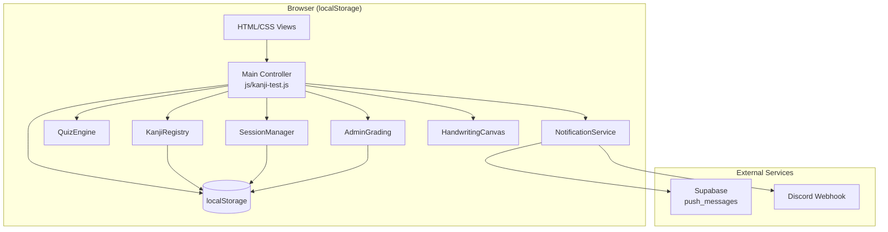
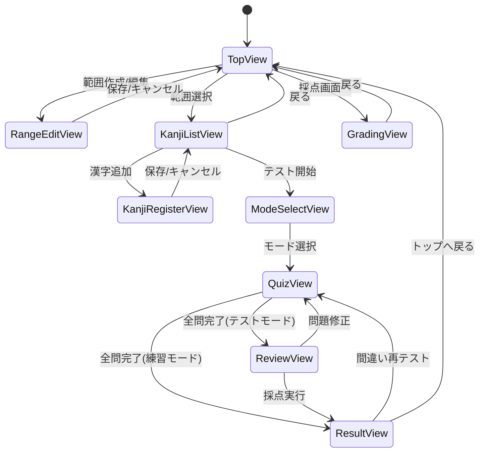

# Design Document: 漢字50問テスト学習アプリ

## Overview

### 目的

学校で実施される漢字テスト（範囲内から50問出題）の練習ツール。漢字の登録、ランダム出題、手書き回答、自動/手動採点を提供し、スマホで繰り返し練習できる環境を実現する。

### 設計方針

1. **データモデル分離**: PendingGradingTest（未採点）と TestResult（採点済み）は別構造体として管理
2. **ストローク保存**: base64 PNGではなくPoint[][]で保存。localStorage保存時は`[x,y]`タプル形式に変換して容量節約
3. **スコア計算**: `score = correctCount / totalCount * 100`（学校式、スキップも0点扱い）
4. **Retry対象**: 不正解 + スキップ両方
5. **localStorage容量超過**: 保存失敗時にエラー表示のみ。未採点データは自動削除しない
6. **通知**: テスト完了時に Supabase `push_messages` INSERT (`target_role='admin'`) + Discord Webhook即時送信
7. **Supabase認証**: anon key + RLS（既存プロジェクトと同一パターン。`js/common.js`に定数定義済み）
8. **採点フロー**: `gradeQuestion()`は`PendingQuestion.result`を`'pending_grading'`から`'correct'`/`'incorrect'`に直接書き換え
9. **通知内容**: scoreではなくpendingTestIdベース（「未採点テストがあります 範囲: {rangeName} 手書き回答: {handwritingCount}件」）
10. **localStorageキー**: `kanji_test_session`（セッション）、`kanji_entries_{rangeId}`（範囲ごと分離）
11. **管理者採点画面フロー**: pendingTestId → StrokesStore取得 → `HandwritingCanvas.renderStrokes()`で再描画 → 採点
12. **インポート上書き時**: 学習データのみ上書き。テスト結果履歴は保持

### 技術スタック

- **フロントエンド**: Vanilla JS（既存プロジェクトと統一）
- **永続化**: localStorage
- **通知**: Supabase REST API + Discord Webhook（`js/common.js`の既存関数再利用）
- **テスト**: vitest + fast-check（既存devDependencies）
- **Canvas**: HTML5 Canvas API

## Architecture

### システム構成図



### 画面遷移図



### ビュー構成（SPA、単一HTML）

| ビューID | 用途 |
|---------|------|
| `top-view` | テスト範囲一覧、未採点バッジ |
| `range-edit-view` | 範囲作成・編集フォーム |
| `kanji-list-view` | 漢字エントリ一覧 |
| `kanji-register-view` | 漢字登録（単体・一括） |
| `mode-select-view` | テストモード/練習モード選択 |
| `quiz-view` | 出題画面（テキスト/Canvas切替） |
| `review-view` | 見直し一覧（テストモード用） |
| `result-view` | 結果表示 |
| `grading-view` | 管理者採点画面 |

### レイヤー構成

```
┌─────────────────────────────────────────────┐
│  UI Layer (HTML/CSS + Main Controller)       │
├─────────────────────────────────────────────┤
│  Logic Layer (DOM非依存・localStorage非依存)   │
│  ┌──────────┐ ┌──────────┐ ┌─────────────┐ │
│  │KanjiReg. │ │QuizEngine│ │SessionMgr   │ │
│  │(+LS)     │ │(純粋関数)│ │(+LS)        │ │
│  └──────────┘ └──────────┘ └─────────────┘ │
│  ┌──────────┐ ┌──────────────────────────┐  │
│  │AdminGrad.│ │NotificationService       │  │
│  │(+LS)     │ │(+外部API)                │  │
│  └──────────┘ └──────────────────────────┘  │
├─────────────────────────────────────────────┤
│  Storage Layer (localStorage)                │
└─────────────────────────────────────────────┘
```

## Components and Interfaces

### 1. KanjiRegistry (`js/kanji-registry.js`)

漢字データのCRUD管理。DOM非依存。

```javascript
// --- TestRange CRUD ---
createRange(name: string): TestRange | null
updateRange(id: string, name: string): boolean
deleteRange(id: string): boolean
getAllRanges(): TestRange[]

// --- KanjiEntry CRUD ---
addEntry(rangeId: string, reading: string, answer: string): KanjiEntry | null
deleteEntry(rangeId: string, entryId: string): boolean
getEntriesByRange(rangeId: string): KanjiEntry[]

// --- 一括・エクスポート/インポート ---
parseBulkInput(text: string): {reading: string, answer: string}[]
exportAllData(): string  // JSON文字列
importData(json: string, conflictStrategy: 'overwrite' | 'rename'): ImportResult
```

### 2. QuizEngine (`js/kanji-quiz-engine.js`)

出題・回答・採点ロジック。DOM非依存・localStorage非依存。全関数が純粋関数。

```javascript
// --- 出題 ---
startQuiz(entries: KanjiEntry[], mode: 'test' | 'practice'): QuizSession

// --- 回答記録 ---
submitAnswer(session: QuizSession, index: number, answer: string): QuizSession
submitHandwritingAnswer(session: QuizSession, index: number): QuizSession
skipQuestion(session: QuizSession, index: number): QuizSession
showAnswer(session: QuizSession, index: number): QuizSession
selfCheck(session: QuizSession, index: number, isCorrect: boolean): QuizSession

// --- Review Phase ---
getReviewList(session: QuizSession): ReviewItem[]
updateAnswer(session: QuizSession, index: number, answer: string): QuizSession
updateHandwritingAnswer(session: QuizSession, index: number): QuizSession
// Review Phaseで手書き回答を書き直す場合に使用
// ストロークデータはUI層が保持し、保存時にStrokesStoreを更新

// --- 採点 ---
gradeTextAnswer(answer: string, correctAnswer: string): boolean

// --- 結果（全て純粋関数。localStorage非依存） ---
calculateResult(session: QuizSession): TestResult
finishTestMode(session: QuizSession): {
  pendingTest: PendingGradingTest | null;   // 手書き回答がある場合のみ
  strokesStore: StrokesStore | null;         // 手書き回答がある場合のみ
  testResult: TestResult | null;             // テキストのみの場合は即TestResult
}
getRetryEntries(result: TestResult): string[]  // entryId[]
```

### 3. HandwritingCanvas (`js/kanji-handwriting-canvas.js`)

Canvas手書き入力。UIコンポーネント。

```javascript
initCanvas(canvasElement: HTMLCanvasElement): void
clearCanvas(): void
getStrokes(): Point[][]
renderStrokes(strokes: Point[][]): void   // 管理者採点画面で直接Canvasに描画して表示
hasContent(): boolean
```

### 4. SessionManager (`js/kanji-session-manager.js`)

テストセッションの永続化。DOM非依存。

```javascript
saveSession(session: QuizSession): boolean
loadSession(): QuizSession | null    // 破損時はnull返却 + 削除
clearSession(): void
```

### 5. AdminGrading (`js/kanji-admin-grading.js`)

管理者採点ロジック。DOM非依存。

```javascript
getPendingTests(): PendingGradingTest[]
gradeQuestion(pendingTestId: string, questionIndex: number, isCorrect: boolean): boolean
isAllGraded(pendingTestId: string): boolean
finishGrading(pendingTestId: string): TestResult
// 前提条件: isAllGraded(pendingTestId) === true
// 未採点問題が残っている場合はエラーをthrowする
getTestResults(): TestResult[]
```

### 6. NotificationService (`js/kanji-notification.js`)

テスト完了通知。外部サービス連携。
呼び出し条件: handwritingCount > 0 の場合のみ通知送信。テキストのみ回答のテストは即座にTestResult化されるため通知不要。

```javascript
// 呼び出し条件: handwritingCount > 0 の場合のみ通知送信
notifyTestCompleted(pendingTestId: string, rangeName: string, handwritingCount: number): Promise<void>
getPendingCount(): number  // 未採点テスト件数（テスト単位）。PendingGradingTest[]の配列長を返す
```

## Data Models

### localStorage キー設計

| キー | 内容 | 形式 |
|------|------|------|
| `kanji_ranges` | 全TestRange配列 | JSON |
| `kanji_entries_{rangeId}` | 範囲ごとのKanjiEntry配列 | JSON |
| `kanji_test_session` | 進行中セッション | JSON |
| `kanji_pending_tests` | 未採点テスト配列 | JSON |
| `kanji_pending_strokes_{pendingTestId}` | 手書きストローク | JSON (Point[][] → `[x,y]`タプル) |
| `kanji_test_results` | 採点済み結果配列 | JSON |
| `kanji_last_mode` | 前回選択モード | `'test'` \| `'practice'` |
| `kanji_input_mode` | 回答入力モード | `'text'` \| `'handwriting'` |

### データ構造

```typescript
interface TestRange {
  id: string;
  name: string;
  createdAt: string;
}

interface KanjiEntry {
  id: string;
  rangeId: string;
  reading: string;     // 読み仮名（出題文）
  answer: string;      // 正解の漢字
}

type Point = { x: number; y: number };

// テスト進行中のセッション
interface QuizSession {
  id: string;
  rangeId: string;
  rangeName: string;
  mode: 'test' | 'practice';
  questions: QuizQuestion[];
  currentIndex: number;
  phase: 'answering' | 'review' | 'finished';
  startedAt: string;
}

interface QuizQuestion {
  entryId: string;
  reading: string;
  correctAnswer: string;
  userAnswer: string | null;
  answerType: 'text' | 'handwriting' | null;
  status: 'unanswered' | 'answered' | 'skipped' | 'shown';
  result: 'correct' | 'incorrect' | 'pending_grading' | null;
}

// 未採点テスト（手書き回答を含むテストモード結果）
interface PendingGradingTest {
  id: string;
  rangeId: string;
  rangeName: string;
  questions: PendingQuestion[];
  totalCount: number;
  textGradedCorrect: number;
  textGradedIncorrect: number;
  skippedCount: number;
  completedAt: string;
}

interface PendingQuestion {
  entryId: string;
  reading: string;
  correctAnswer: string;
  userAnswer: string | null;
  hasHandwritingAnswer: boolean;
  result: 'correct' | 'incorrect' | 'pending_grading' | 'skipped';
}

// 採点完了済みテスト結果（ストロークなし）
interface TestResult {
  id: string;
  rangeId: string;
  rangeName: string;
  mode: 'test' | 'practice';
  questions: QuestionResult[];
  correctCount: number;
  incorrectCount: number;
  skippedCount: number;
  totalCount: number;
  score: number;   // correctCount / totalCount * 100
  completedAt: string;
}

interface QuestionResult {
  entryId: string;
  reading: string;
  correctAnswer: string;
  userAnswer: string | null;
  result: 'correct' | 'incorrect' | 'skipped';
}

// 手書きストロークの保存形式
interface StrokesStore {
  [questionIndex: number]: Point[][];
}

// Review Phase用
interface ReviewItem {
  index: number;
  reading: string;
  userAnswer: string | null;
  hasStrokes: boolean;
  status: 'answered' | 'skipped' | 'shown';
}
```


## Correctness Properties

*A property is a characteristic or behavior that should hold true across all valid executions of a system—essentially, a formal statement about what the system should do. Properties serve as the bridge between human-readable specifications and machine-verifiable correctness guarantees.*

### Property 1: Data persistence round-trip

*For any* valid TestRange and set of KanjiEntry objects, saving them to localStorage and then loading them back SHALL produce equivalent data (same ids, names, readings, and answers).

**Validates: Requirements 1.1, 1.5, 10.1, 10.2**

### Property 2: Entry management invariant

*For any* TestRange with N entries, adding an entry SHALL result in N+1 entries in that range, and deleting an entry SHALL result in N-1 entries, with the deleted entry absent from the list.

**Validates: Requirements 2.2, 2.3, 2.4**

### Property 3: Empty input rejection

*For any* string composed entirely of whitespace characters (including empty string), attempting to create a TestRange name or save a KanjiEntry with that string as reading or answer SHALL be rejected, and the stored data SHALL remain unchanged.

**Validates: Requirements 1.4, 2.5**

### Property 4: Serialization round-trip (bulk parse and export/import)

*For any* list of valid KanjiEntry objects, formatting them as "読み仮名,漢字" lines and parsing back SHALL produce equivalent entries. Additionally, exporting all data as JSON and importing it back SHALL produce an identical data set.

**Validates: Requirements 2.6, 10.3, 10.4**

### Property 5: Quiz selection size and uniqueness

*For any* TestRange with N entries (N >= 1), starting a quiz SHALL select exactly min(N, 50) questions, and all selected question entryIds SHALL be unique (no duplicates).

N > 50 の場合、ランダムにN個をシャッフルした先頭50個を選出する（全問シャッフル→先頭50切り取り方式）。

**Validates: Requirements 4.1, 4.2, 4.3, 7.1, 7.2**

### Property 6: Text grading correctness

*For any* text answer and correct answer pair, the auto-grading function SHALL return 'correct' if and only if the text answer exactly matches the correct answer string, and 'incorrect' otherwise.

**Validates: Requirements 6.1, 7.4**

### Property 7: Answer recording integrity

*For any* question in a test session, submitting a text answer SHALL store that answer and set status to 'answered', skipping SHALL set status to 'skipped' with null answer, and using "答えを見る" SHALL set result to 'incorrect'. Self-check results SHALL record 'correct' or 'incorrect' exactly as selected.

**Validates: Requirements 4.6, 4.7, 7.6, 7.7, 7.8**

### Property 8: Result calculation invariant

*For any* TestResult (admin-graded or auto-graded), the sum of correctCount + incorrectCount + skippedCount SHALL equal totalCount, and score SHALL equal correctCount / totalCount * 100.

※PendingGradingTest段階ではこのPropertyは適用されない（pending_gradingが存在するため）。

**Validates: Requirements 6.3, 6.4, 6.5, 7.10**

### Property 9: Session persistence round-trip

*For any* QuizSession state (including currentIndex, all question answers, mode, and phase), saving to localStorage and loading back SHALL produce an equivalent session state with all answers and progress preserved.

**Validates: Requirements 14.1, 14.3, 14.5, 14.6**

### Property 10: Retry test from wrong and skipped answers

*For any* TestResult containing at least one incorrect or skipped answer, starting a retry test SHALL produce a new session where every question's entryId exists in the set of incorrectly answered OR skipped entryIds from the original result.

**Validates: Requirements 12.1**

### Property 11: Admin grading state transition

*For any* PendingGradingTest containing pending_grading questions, grading all pending questions SHALL create a TestResult whose correctCount, incorrectCount, skippedCount, and score reflect the grading decisions, and the PendingGradingTest SHALL be removed from `kanji_pending_tests`.

**Validates: Requirements 6.6, 13.5**

### Property 12: Graded strokes cleanup

*For any* PendingGradingTest that is fully graded and transitions to a TestResult, the corresponding StrokesStore entry (`kanji_pending_strokes_{pendingTestId}`) SHALL be removed from localStorage, and the PendingGradingTest SHALL be removed from `kanji_pending_tests`, while the resulting TestResult SHALL persist in `kanji_test_results`.

**Validates: Requirements 11.3, 11.4**

### Property 13: Notification failure does not affect local persistence

*For any* completed test, regardless of whether notification sending (Supabase INSERT or Discord Webhook) succeeds or fails, the PendingGradingTest and associated StrokesStore SHALL be correctly persisted to localStorage.

**Validates: Requirements 15.1, 15.2, 15.5**

## Error Handling

| エラー状況 | 対応 |
|-----------|------|
| localStorage容量超過 | 保存失敗時に「保存容量が不足しています」を表示。未採点データ（PendingGradingTest, StrokesStore）は自動削除しない |
| 不正なJSONインポート | パースエラーメッセージを表示し、インポートを中止 |
| 空の範囲名/漢字データ | バリデーションエラーを画面上に表示 |
| Canvas未対応ブラウザ | テキスト入力モードのみに制限（フォールバック） |
| localStorage無効 | アプリ起動時に警告表示 |
| セッション復元失敗 | 破損セッションを削除し、通常起動 |
| 通知送信失敗（ネットワーク不可） | エラーをcatchしスキップ。テスト結果保存は正常完了。コンソールに警告出力 |

## Testing Strategy

### テスト環境

- **テストランナー**: vitest（既存プロジェクトで導入済み）
- **プロパティテストライブラリ**: fast-check（既存プロジェクトで導入済み）
- **localStorageモック**: vitest の環境設定で jsdom を使用

### プロパティテスト

各Correctness Propertyに対してfast-checkを使用したプロパティテストを実装する。

- 最低100イテレーション/プロパティ
- タグ形式: `Feature: kanji-test-app, Property {number}: {title}`
- テストファイル: `tests/kanji-test.property.test.js`

### ユニットテスト（example-based）

以下の項目はexample-basedテストで検証:

- モード選択UI表示（Req 3.1, 3.2, 3.3）
- テスト進行中の問題番号表示（Req 4.4）
- Review_Phaseへの移行（Req 5.1）
- Canvas要素の存在（Req 8.1）
- 同名範囲コンフリクト時の選択肢提示（Req 10.5）
- 全問正解メッセージ表示（Req 12.2）
- 通知送信: Supabase push_messages INSERT（Req 15.1）
- 通知送信: Discord Webhook呼び出し（Req 15.2）
- 管理者TOPバッジ表示（Req 15.3, 15.4）

テストファイル: `tests/kanji-test.unit.test.js`

### テスト対象の分離

ロジック層（KanjiRegistry, QuizEngine, SessionManager, AdminGrading）はDOM非依存で実装し、vitest環境で直接テスト可能にする。NotificationServiceは外部API呼び出しをモックしてテストする。HandwritingCanvasはUIコンポーネントのためexample-basedテストのみ。
