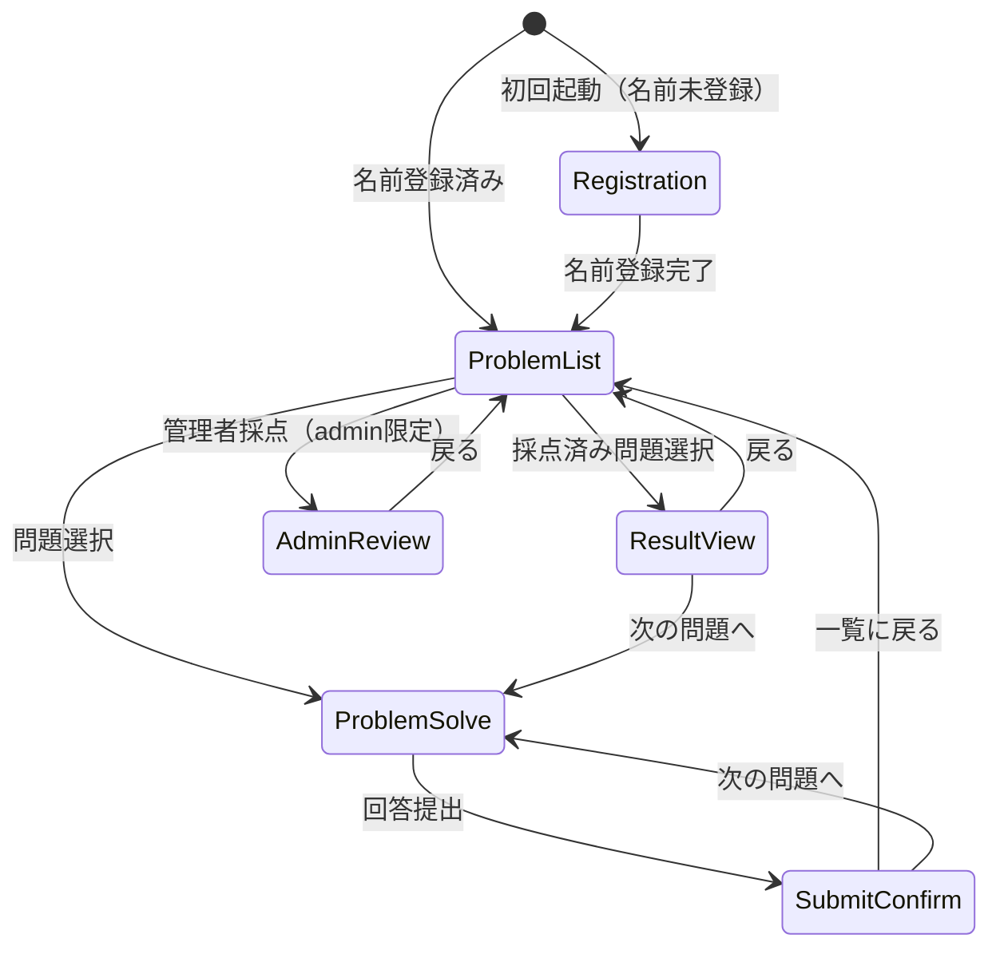

# 設計書: 算数オリンピック

## 概要

算数オリンピックは、既存のお小遣い管理PWAのゲームセンターに追加する思考力育成アプリである。単一HTMLページ（pages/math-olympiad.html）内でビュー切り替えによるSPA風の画面遷移を実現する。問題データは外部JSONファイルから読み込み、回答・採点データはSupabaseで管理する。

### 設計方針

- **単一ページ・複数ビュー構成**: 画面遷移のたびにページリロードが発生しないよう、1つのHTMLファイル内にすべてのビューを配置し、表示/非表示で切り替える
- **既存パターン踏襲**: Supabase CDN + common.js読み込み、インラインCSS/JS、ダークテーマ
- **状態管理**: JavaScriptオブジェクトでアプリ状態を管理し、ビュー描画関数で反映
- **管理者採点**: 同一ページ内の管理者専用ビューとして実装（admin権限で表示）
- **innerHTML使用**: 問題JSONにrubyタグを含むため、問題文の描画にはinnerHTMLを使用する。DOMPurify（CDN）でサニタイズし、許可タグを `ruby`, `rt`, `br` に限定することでXSSリスクを排除する
- **タイマー・ヒント永続化**: sessionStorageを使用し、ページリロード・タブ復帰時にタイマーとヒント状態を復元する
- **オフライン対応**: sw.jsでHTMLと問題JSONをキャッシュし、オフラインでも問題閲覧を可能にする。回答提出時はオンラインチェックを行う
- **user_id（UUID）ベースのDB操作**: DBの主キー的識別子としてuser_id（UUID）を使用し、user_nameは表示用途のみとする。名前変更や名前衝突に強い設計
- **セキュリティ方針（匿名公開アプリ）**:
  - 本アプリは匿名公開アプリのため、DBデータは秘匿されない。機微情報は保存しない
  - 管理者採点はdeviceRole=adminのUI制御のみで保護。バックエンド認可は行わない（既存アプリと同じ方針）
  - 将来的にはSupabase service role経由のCloud Function分離を検討

## アーキテクチャ

### ページ構成

```
pages/math-olympiad.html  （メインページ、全ビュー含む）
data/math-olympiad-problems.json  （問題データ）
```

### sw.js キャッシュ対象追加

sw.jsのASSETS配列に以下を追加する:

```javascript
'./pages/math-olympiad.html',
'./data/math-olympiad-problems.json'
```

これによりオフラインでも問題閲覧が可能になる。回答提出はオンライン時のみ。

> **キャッシュ運用ルール:** 問題JSON差し替え時はsw.jsのCACHE_NAMEバージョンを必ずbumpすること（既存運用ルールと同じ）。

### ビュー構成（単一HTML内）



| ビューID | 名称 | 説明 |
|----------|------|------|
| `view-registration` | ユーザー名登録 | 初回起動時のみ表示 |
| `view-problem-list` | 問題一覧 | トップ画面、フィルター＋問題カード |
| `view-problem-solve` | 回答画面 | 問題表示＋回答入力＋ヒント |
| `view-submit-confirm` | 提出完了 | 提出後メッセージ＋経過時間表示 |
| `view-result` | 採点結果 | 点数・コメント・模範解答・解説 |
| `view-admin-review` | 管理者採点 | レビュー待ち一覧＋採点UI |

### 画面遷移関数

```javascript
function showView(viewId) {
  document.querySelectorAll('.view').forEach(v => v.classList.add('hidden'));
  const el = document.getElementById(viewId);
  if (!el) return;
  el.classList.remove('hidden');
  window.scrollTo(0, 0);
}
```

`window.scrollTo(0, 0)` を使用。`behavior: 'instant'` は標準仕様外でSafari互換性に問題があるため、シンプルな形式を採用する。

## コンポーネントとインターフェース

### 1. アプリ初期化 (AppInit)

```javascript
// 起動時の処理フロー
async function initApp() {
  if (isNightTime()) { showNightMessage(); return; }
  await loadProblems();          // JSONから問題読み込み
  await loadUserAnswers();       // Supabaseからユーザー回答取得
  bindDraftEvents();             // inputイベントバインド（DOM生成後）
  restoreTimerIfNeeded();        // タイマー＋ヒント復元
  const userName = localStorage.getItem('math_olympiad_user');
  if (!userName) {
    showView('view-registration');
  } else {
    showView('view-problem-list');
    renderProblemList();
  }
}
```

### 2. 問題データ読み込み (ProblemLoader)

```javascript
let problems = [];

async function loadProblems() {
  // 相対パス使用: pages/math-olympiad.html から ../data/ を参照
  // GitHub Pages（https://osho0625.github.io/okodukai_history/pages/math-olympiad.html）でも
  // ローカル開発でも正しく動作する。既存プロジェクトの ../js/common.js と同じパターン。
  try {
    const res = await fetch('../data/math-olympiad-problems.json');
    if (!res.ok) throw new Error('HTTP ' + res.status);
    const data = await res.json();
    if (!Array.isArray(data) || data.length === 0) {
      throw new Error('Invalid problem data');
    }
    problems = data;
  } catch (e) {
    showFatalError('問題データを読み込めませんでした');
    throw e;
  }
}
```

### 3. ユーザー回答読み込み (UserAnswersLoader)

```javascript
let userAnswers = [];

async function loadUserAnswers() {
  const userId = localStorage.getItem('math_olympiad_user_id');
  if (!userId) return;
  try {
    const { data, error } = await client
      .from('math_olympiad_answers')
      .select('id,problem_id,status,score,admin_comment,elapsed_seconds,hints_used,answer_text,thinking_note,submitted_at')
      .eq('user_id', userId)
      .order('submitted_at', { ascending: false });
    if (error) throw error;
    userAnswers = data || [];
  } catch (e) {
    showError('list-error', 'サーバーに接続できません');
    userAnswers = [];
  }
}
```

**重要:** DBクエリはすべて`user_id`（UUID）で行う。`user_name`は表示用途のみ。

### 4. 問題ステータス判定 (ProblemStatus)

```javascript
function getProblemStatus(problemId) {
  const a = userAnswers.find(x => x.problem_id === problemId);
  if (!a) return 'new';
  if (a.status === 'pending') return 'pending';
  return 'reviewed';
}
```

### 5. ジャンルラベルマッピング (GenreLabel)

問題JSONではジャンルを英語キーで管理し、表示時に日本語ラベルに変換する:

```javascript
const GENRE_LABEL = {
  number_pattern: '数の規則',
  geometry: '図形',
  logic: '論理',
  combinatorics: '場合の数',
  word_problem: '文章題'
};
```

### 6. ユーザー名登録 (UserRegistration)

```javascript
function registerUser() {
  const name = document.getElementById('reg-name-input').value.trim();
  if (!name) { showError('reg-error', '名前を入力してね'); return; }
  const userId = localStorage.getItem('math_olympiad_user_id') || crypto.randomUUID();
  localStorage.setItem('math_olympiad_user', name);
  localStorage.setItem('math_olympiad_user_id', userId);
  showView('view-problem-list');
  renderProblemList();
}
```

`math_olympiad_user_id`（UUID）をlocalStorageに保存し、DBの主キー的識別子として使用する。初回登録時にcrypto.randomUUID()で生成し、以降は既存値を再利用する。名前変更があってもuser_idは不変のため、回答履歴が失われない。

### 7. 問題一覧 (ProblemList)

```javascript
function renderProblemList() {
  const genre = getSelectedGenre();    // 'all' or specific genre key
  const difficulty = getSelectedDifficulty(); // 0(all) or 1-3
  const filtered = problems.filter(p => {
    if (genre !== 'all' && p.genre !== genre) return false;
    if (difficulty !== 0 && p.difficulty !== difficulty) return false;
    return true;
  });
  // render filtered problems with status badges using getProblemStatus()
  // genre display: GENRE_LABEL[p.genre]
}
```

### 8. 回答画面 (ProblemSolve)

```javascript
let currentProblem = null;
let timerStart = null;
let hintsRevealed = 0;

function startProblem(problemId) {
  clearProblemSession(); // 前問題のドラフト・タイマーをクリア
  currentProblem = problems.find(p => p.id === problemId);
  timerStart = Date.now();
  hintsRevealed = 0;
  sessionStorage.setItem('math_timer_start', timerStart);
  sessionStorage.setItem('math_current_problem', problemId);
  sessionStorage.setItem('math_hints_revealed', '0');
  renderProblemView();
  showView('view-problem-solve');
}
```

#### タイマー・ヒント復元（sessionStorage永続化）

ページリロードやタブ復帰時にタイマーとヒント状態を復元する:

```javascript
// sessionStorageクリア用ヘルパー（提出完了・離脱・復元失敗時に使用）
function clearProblemSession() {
  sessionStorage.removeItem('math_timer_start');
  sessionStorage.removeItem('math_current_problem');
  sessionStorage.removeItem('math_hints_revealed');
  sessionStorage.removeItem('math_answer_draft');
  sessionStorage.removeItem('math_thinking_draft');
}

function restoreTimerIfNeeded() {
  const saved = sessionStorage.getItem('math_timer_start');
  const savedProblem = sessionStorage.getItem('math_current_problem');
  if (saved && savedProblem) {
    timerStart = Number(saved);

    // stale timer対策: TIMER_EXPIRE_MS 以上前のタイマーは破棄
    const TIMER_EXPIRE_MS = 6 * 60 * 60 * 1000; // 6時間
    if (Date.now() - timerStart > TIMER_EXPIRE_MS) {
      clearProblemSession();
      return;
    }

    hintsRevealed = Number(sessionStorage.getItem('math_hints_revealed') || '0');
    currentProblem = problems.find(p => p.id === Number(savedProblem));
    if (currentProblem) {
      renderProblemView();
      renderHints();
      restoreDrafts();
      showView('view-problem-solve');
    } else {
      // 問題が見つからない場合（JSONから削除された等）: セッションをクリアして一覧に戻る
      clearProblemSession();
      showView('view-problem-list');
    }
  }
}
```

**clearProblemSession()の使用箇所:**
- 回答提出成功時（submitAnswer内）
- タイマー復元失敗時（問題が見つからない場合）
- 「問題一覧へ戻る」ボタン押下時（途中離脱）

#### 問題文の描画（innerHTML + ruby対応）

問題JSONにはrubyタグを含むHTMLが格納されているため、問題文の描画にはinnerHTMLを使用する:

```javascript
function renderProblemView() {
  document.getElementById('problem-title').textContent = currentProblem.title;
  document.getElementById('problem-genre').textContent = GENRE_LABEL[currentProblem.genre];
  document.getElementById('problem-difficulty').textContent = 'Lv' + currentProblem.difficulty;
  // DOMPurify でサニタイズ後に innerHTML 描画（rubyタグのみ許可）
  document.getElementById('question-text').innerHTML =
    DOMPurify.sanitize(currentProblem.question, { ALLOWED_TAGS: ['ruby', 'rt', 'br'] });
}
```

### 9. ヒントシステム (HintSystem)

```javascript
function revealHint() {
  if (!currentProblem) return;
  if (hintsRevealed >= currentProblem.hints.length) return;
  hintsRevealed++;
  sessionStorage.setItem('math_hints_revealed', hintsRevealed);
  renderHints();
}

function renderHints() {
  const total = currentProblem.hints.length;
  // ヒント表示: "ヒント K/N" 形式
  // hintsRevealed個のヒントを表示
  // hintsRevealed >= total の場合ボタン非活性
}
```

ヒント状態はsessionStorageに永続化されるため、ページリロード時にも表示済みヒントが復元される。

#### 回答ドラフト保存（sessionStorage）

回答入力中のテキストをsessionStorageに保存し、ページリロード時に復元する:

```javascript
// イベントバインド関数（initApp内でDOM生成後に呼び出す）
function bindDraftEvents() {
  const answerEl = document.getElementById('answer-input');
  const thinkingEl = document.getElementById('thinking-input');
  if (answerEl) {
    answerEl.addEventListener('input', function() {
      sessionStorage.setItem('math_answer_draft', this.value);
    });
  }
  if (thinkingEl) {
    thinkingEl.addEventListener('input', function() {
      sessionStorage.setItem('math_thinking_draft', this.value);
    });
  }
}

// 復元時に入力欄に反映
function restoreDrafts() {
  const answerDraft = sessionStorage.getItem('math_answer_draft');
  const thinkingDraft = sessionStorage.getItem('math_thinking_draft');
  if (answerDraft) document.getElementById('answer-input').value = answerDraft;
  if (thinkingDraft) document.getElementById('thinking-input').value = thinkingDraft;
}
```

**重要:** `bindDraftEvents()` は `initApp()` 内でDOM生成後に呼び出す。DOM生成前に `getElementById` すると null になるため。

`restoreDrafts()`は`restoreTimerIfNeeded()`内でタイマー復元成功時に呼び出す。`clearProblemSession()`でドラフトもクリアされる。

### 10. 回答提出 (AnswerSubmission)

```javascript
async function submitAnswer() {
  // オフラインチェック
  if (!navigator.onLine) {
    showError('answer-error', 'オフラインでは提出できません');
    return;
  }

  const answerText = document.getElementById('answer-input').value.trim();
  if (!answerText) { showError('answer-error', '答えを入力してね'); return; }
  const thinkingNote = document.getElementById('thinking-input').value.trim();
  const elapsedSeconds = Math.floor((Date.now() - timerStart) / 1000);

  const userId = localStorage.getItem('math_olympiad_user_id');

  const payload = {
    user_id: userId,
    user_name: localStorage.getItem('math_olympiad_user'), // 提出時点の名前を保存（表示用）
    problem_id: currentProblem.id,
    answer_text: answerText,
    thinking_note: thinkingNote || '',
    elapsed_seconds: elapsedSeconds,
    hints_used: hintsRevealed,
    status: 'pending',
    submitted_at: new Date().toISOString()
  };

  // 既存レコード確認
  const { data: existing } = await client
    .from('math_olympiad_answers')
    .select('id,status')
    .eq('user_id', userId)
    .eq('problem_id', payload.problem_id)
    .maybeSingle();

  if (existing?.status === 'reviewed') {
    showError('answer-error', 'この問題はもう提出済みです');
    return;
  }

  // insert/update分離（upsertよりRLSとの相性が明確）
  let error;
  if (!existing) {
    // 新規: INSERT
    ({ error } = await client.from('math_olympiad_answers').insert(payload));
    // 23505 = unique_violation（2タブ同時送信で競合した場合）
    if (error?.code === '23505') {
      showError('answer-error', 'すでに提出済みです。ページを更新してください');
      return;
    }
  } else {
    // 既存pending: UPDATE
    ({ error } = await client.from('math_olympiad_answers')
      .update(payload)
      .eq('id', existing.id));
  }

  if (error) {
    showError('answer-error', '保存に失敗しました。もう一度試してね');
    return;
  }

  // セッション情報をクリア
  clearProblemSession();

  showSubmitConfirm(elapsedSeconds);
}
```

**submit後のuserAnswers更新:**
`showSubmitConfirm()`内または直後に`await loadUserAnswers()`を呼び出し、問題一覧に戻った際にステータスバッジが正しく反映されるようにする。

```javascript
async function showSubmitConfirm(elapsedSeconds) {
  // 経過時間表示、メッセージ表示
  // ...
  await loadUserAnswers(); // ステータスバッジ更新のため再取得
  showView('view-submit-confirm');
}
```

**reviewed上書き防止の二重ガード:**
1. **アプリレベル（UX）**: upsert前にstatusを確認し、reviewedならエラーメッセージを表示
2. **DBレベル（RLS）**: UPDATE policyで `status = 'pending'` のレコードのみ更新可能。2タブ同時提出のレースコンディションもDB側で防止

### 11. 次の問題へ遷移 (GoNextProblem)

提出完了画面・採点結果画面から次の未挑戦問題に遷移する。pending（提出済み未採点）は飛ばし、未挑戦（new）のみを対象とする。これは仕様：pending問題の再編集は問題一覧から直接選択して行う。

```javascript
function goNextProblem() {
  const currentIndex = problems.findIndex(p => p.id === currentProblem.id);
  const next = problems
    .slice(currentIndex + 1)
    .find(p => getProblemStatus(p.id) === 'new');
  if (next) {
    startProblem(next.id);
  } else {
    showView('view-problem-list');
    renderProblemList();
  }
}
```

### 12. 管理者採点 (AdminReview)

> **信頼境界:** 管理者認可は `localStorage.deviceRole === 'admin'` のUI制御のみ。DevToolsで改ざん可能であり、悪意ある利用者は管理者操作が可能。家庭内LAN・家族利用を前提とした信頼境界内での運用を想定する。

```javascript
const COMMENT_TEMPLATES = [
  '良い視点です',
  '途中まで良いです',
  '別の方法も考えてみよう',
  '図を書いてみよう',
  '最後までよく考えたね'
];

async function loadPendingReviews() {
  const { data, error } = await client.from('math_olympiad_answers')
    .select('id,user_name,problem_id,answer_text,thinking_note,elapsed_seconds,hints_used,submitted_at')
    .eq('status', 'pending')
    .order('submitted_at', { ascending: true });
  if (error) {
    showError('admin-error', 'レビュー一覧を取得できません');
    return;
  }
  renderReviewList(data);
}

function insertTemplate(index) {
  const textarea = document.getElementById('review-comment');
  textarea.value += (textarea.value ? '\n' : '') + COMMENT_TEMPLATES[index];
}

async function submitReview(answerId, score, comment) {
  const { error } = await client.from('math_olympiad_answers')
    .update({
      score: score,
      admin_comment: comment,
      status: 'reviewed',
      reviewed_at: new Date().toISOString()
    })
    .eq('id', answerId);
  if (error) {
    showError('admin-error', '採点保存に失敗しました');
    return;
  }
}
```

### 13. 採点結果閲覧 (ResultView)

```javascript
function showResult(problemId) {
  const answer = userAnswers.find(a => a.problem_id === problemId && a.status === 'reviewed');
  const problem = problems.find(p => p.id === problemId);
  if (!answer || !problem) {
    showError('result-error', 'データが見つかりません');
    showView('view-problem-list');
    return;
  }
  // 点数、コメント、模範解答、解説、別解を表示
  // 「次の問題へ」ボタン → goNextProblem()
  renderResultView(answer, problem);
  showView('view-result');
}
```

## データモデル

### 問題データ (data/math-olympiad-problems.json)

```json
[
  {
    "id": 1,
    "genre": "number_pattern",
    "difficulty": 1,
    "title": "数列の規則を見つけよう",
    "question": "<ruby>次<rt>つぎ</rt></ruby>の数の<ruby>並<rt>なら</rt></ruby>びの<ruby>規則<rt>きそく</rt></ruby>を<ruby>見<rt>み</rt></ruby>つけて、□に<ruby>入<rt>はい</rt></ruby>る数を<ruby>答<rt>こた</rt></ruby>えなさい。\n\n2, 5, 10, 17, □, ...",
    "answer": "26",
    "explanation": "差が 3, 5, 7, 9, ... と奇数で増えていく規則。17 + 9 = 26",
    "hints": [
      "となりの数の差を調べてみよう",
      "差は 3, 5, 7, ... どんな規則かな？",
      "差が2ずつ増えているよ。次の差は9だね"
    ],
    "alternativeSolutions": []
  }
]
```

**注意:**
- `genre`フィールドは英語キー（`number_pattern`, `geometry`, `logic`, `combinatorics`, `word_problem`）を使用する
- `question`フィールドにはrubyタグを含むHTMLが格納される。描画時はinnerHTMLを使用すること
- 表示用の日本語ラベルは`GENRE_LABEL`定数で変換する

#### 問題JSON Schema

```json
{
  "type": "object",
  "required": ["id", "genre", "difficulty", "title", "question", "answer", "explanation", "hints"],
  "properties": {
    "id": { "type": "integer" },
    "genre": { "type": "string", "enum": ["number_pattern", "geometry", "logic", "combinatorics", "word_problem"] },
    "difficulty": { "type": "integer", "minimum": 1, "maximum": 3 },
    "title": { "type": "string" },
    "question": { "type": "string" },
    "answer": { "type": "string" },
    "explanation": { "type": "string" },
    "hints": { "type": "array", "items": { "type": "string" }, "minItems": 1, "maxItems": 3 },
    "alternativeSolutions": { "type": "array", "items": { "type": "string" } }
  }
}
```

### Supabaseテーブル: math_olympiad_answers

```sql
CREATE TABLE math_olympiad_answers (
  id UUID DEFAULT gen_random_uuid() PRIMARY KEY,
  user_id UUID NOT NULL,
  user_name TEXT NOT NULL,
  problem_id INT NOT NULL,
  answer_text TEXT NOT NULL,
  thinking_note TEXT DEFAULT '',
  elapsed_seconds INT NOT NULL,
  hints_used INT DEFAULT 0,
  status TEXT DEFAULT 'pending' CHECK (status IN ('pending', 'reviewed')),
  score INT,
  admin_comment TEXT,
  submitted_at TIMESTAMPTZ DEFAULT now(),
  reviewed_at TIMESTAMPTZ,
  UNIQUE(user_id, problem_id)
);
```

**設計意図:**
- `user_id`（UUID）: DBの主キー的識別子。localStorageの`math_olympiad_user_id`と対応。名前変更や兄弟間の名前衝突に影響されない
- `user_name`（TEXT）: 管理者採点画面での表示用途のみ。DBクエリの条件には使用しない
- `UNIQUE(user_id, problem_id)`: 1ユーザー1問題につき1レコード。pending中はupdateで上書き可能。reviewed後はアプリ側チェック＋RLS UPDATEポリシーで再提出を阻止
- `user_name`: 提出時点の名前を保存する（名前変更後も過去レコードは当時の名前のまま）

### インデックス

```sql
CREATE INDEX idx_math_answers_user_id ON math_olympiad_answers(user_id);
CREATE INDEX idx_math_answers_status ON math_olympiad_answers(status);
```

**意図:** ユーザー別回答取得（user_id）と管理者pending一覧取得（status）の高速化。

### Row Level Security (RLS)

```sql
ALTER TABLE math_olympiad_answers ENABLE ROW LEVEL SECURITY;

-- 全読み取り許可（認証なしアプリのため）
CREATE POLICY "allow_all_select" ON math_olympiad_answers
  FOR SELECT USING (true);

-- 全挿入許可
CREATE POLICY "allow_all_insert" ON math_olympiad_answers
  FOR INSERT WITH CHECK (true);

-- pendingレコードのみ更新可能、更新後の値もpendingかreviewedのみ許可
CREATE POLICY "update_only_pending" ON math_olympiad_answers
  FOR UPDATE
  USING (status = 'pending')
  WITH CHECK (status = 'reviewed' OR status = 'pending');
```

> **allow_all_selectの注記:** 全回答が取得可能。UI側でuser_idフィルタしているが、API直叩きでは他ユーザーの回答が見える。匿名アプリのため許容。

**RLSポリシー設計の意図:**
- SELECT/INSERT: 認証なし（匿名アクセス）のため全許可。既存プロジェクトのパターン（game_rankings等）に合わせたベースライン
- UPDATE:
  - `USING (status = 'pending')`: 更新対象はpendingレコードのみ（reviewed状態のレコードは更新不可）
  - `WITH CHECK (status = 'reviewed' OR status = 'pending')`: 更新後の値もpendingかreviewedのみ許可（不正な値への変更を防止）
  - これにより2タブ同時提出のレースコンディションもDB側で防止される（select-then-upsertパターンの弱点をカバー）

> **将来の移行計画:** 本番運用が進んだ段階で、Supabase匿名認証（Anonymous Auth）または簡易ログインを導入し、RLSポリシーを `user_id = auth.uid()` ベースに移行する予定。現在は匿名アクセスのため全許可ポリシーを使用しているが、UPDATE policyのみ `status = 'pending'` 制約でDB整合性を保護している。

### localStorage使用

| キー | 用途 | 永続性 |
|------|------|--------|
| `math_olympiad_user` | ユーザー名（表示用） | 永続 |
| `math_olympiad_user_id` | ユーザーUUID（DB識別子） | 永続 |

> **注記:** localStorage削除時は新規ユーザー扱いとなり、過去の回答履歴は復元されない（仕様）。

### sessionStorage使用

| キー | 用途 |
|------|------|
| `math_timer_start` | タイマー開始時刻（Date.now()） |
| `math_current_problem` | 現在取り組み中の問題ID |
| `math_hints_revealed` | 表示済みヒント数（0〜3） |
| `math_answer_draft` | 回答入力中のテキスト |
| `math_thinking_draft` | 考え方メモ入力中のテキスト |

### game_settings.game_publish 追加キー

```json
{ "game_math_olympiad": true }
```


## 正しさの性質 (Correctness Properties)

*性質（プロパティ）とは、システムのすべての有効な実行において真であるべき特性や振る舞いのことである。人間が読める仕様と機械で検証可能な正しさの保証をつなぐ橋渡しとなる。*

### Property 1: フィルター正確性

*任意の*問題配列とフィルター条件（ジャンルまたは難易度）に対して、フィルター結果に含まれるすべての問題は選択されたフィルター条件に一致しなければならない。

**Validates: Requirements 2.2, 2.3**

### Property 2: 問題ステータス表示の正確性

*任意の*問題と回答状態の組み合わせに対して、getProblemStatus()が返すステータスは実際のSupabaseデータの状態（new/pending/reviewed）と一致しなければならない。

**Validates: Requirements 2.4**

### Property 3: 空名前の拒否

*任意の*空白文字のみで構成された文字列に対して、ユーザー名登録は拒否され、localStorageの状態は変更されてはならない。

**Validates: Requirements 4.3**

### Property 4: ユーザー名永続化ラウンドトリップ

*任意の*有効なユーザー名（空白のみでない文字列）に対して、localStorageに保存した後に読み出すと、元の名前と同一の値が返されなければならない。

**Validates: Requirements 4.4**

### Property 5: 回答バリデーション

*任意の*回答テキストと考え方メモの組み合わせに対して、提出が成功するのは回答テキストが空白のみでない場合に限り、考え方メモの内容は提出の成否に影響してはならない。

**Validates: Requirements 5.3, 5.5**

### Property 6: ヒント状態の一貫性

*任意の*問題（ヒント数N、1≤N≤3）に対して、ヒントボタンをK回押した後（0≤K≤N）、表示されるヒント数はKであり、表示テキストは「ヒント K/N」であり、K=Nの場合のみボタンが非活性になる。

**Validates: Requirements 6.2, 6.4, 6.5, 6.6**

### Property 7: ステータスによる再提出制御

*任意の*回答レコードに対して、再提出が許可されるのはステータスが'pending'の場合に限り、'reviewed'の場合は再提出が阻止されなければならない。

**Validates: Requirements 7.5, 7.6**

### Property 8: 採点済み回答の模範解答アクセス

*任意の*採点済み（reviewed）回答に対して、該当問題の模範解答と解説がユーザーに表示可能でなければならない。

**Validates: Requirements 8.9**

### Property 9: ユーザー別データ分離

*任意の*2人の異なるユーザー（異なるuser_id）に対して、一方のuser_idで履歴を取得した結果には、他方のユーザーの回答が含まれてはならない。

**Validates: Requirements 10.3**

### Property 10: タイマー永続化ラウンドトリップ

*任意の*タイマー開始時刻に対して、sessionStorageに保存した後にrestoreTimerIfNeeded()で復元すると、経過時間の計算が正しく継続されなければならない。

**Validates: Requirements 14.1**

### Property 11: user_id永続化ラウンドトリップ

*任意の*有効なuser_id（UUID形式）に対して、localStorageに保存した後に読み出すと、元のUUIDと同一の値が返されなければならない。

**Validates: Requirements 4.4**

## エラーハンドリング

| エラー状況 | 対応 |
|-----------|------|
| JSON読み込み失敗 | エラーメッセージ表示「問題データを読み込めませんでした」、リトライボタン |
| Supabase接続失敗 | エラーメッセージ表示「サーバーに接続できません」、オフライン時は問題閲覧のみ可能 |
| オフラインで提出試行 | エラーメッセージ表示「オフラインでは提出できません」、提出阻止 |
| 空の回答で提出 | インラインエラー「答えを入力してね」、提出阻止 |
| 空の名前で登録 | インラインエラー「名前を入力してね」、登録阻止 |
| 夜間制限 | 全画面メッセージ「今日はおしまい！また明日ね」 |
| reviewed状態で再提出試行 | エラーメッセージ「この問題はもう提出済みです」、提出阻止 |
| RLS UPDATEポリシーによる拒否 | upsert失敗として処理、エラーメッセージ「保存に失敗しました。もう一度試してね」 |
| upsert失敗（その他） | エラーメッセージ「保存に失敗しました。もう一度試してね」 |
| タイマー復元失敗（問題が見つからない） | sessionStorageをクリアし、問題一覧に遷移 |

## テスト戦略

### プロパティベーステスト

ライブラリ: **fast-check** (JavaScript用PBTライブラリ)

各プロパティテストは最低100回のイテレーションで実行する。

テストタグ形式: `Feature: math-olympiad-app, Property {number}: {property_text}`

対象プロパティ:
- Property 1: フィルター関数の正確性（純粋関数テスト）
- Property 2: ステータス判定関数の正確性（getProblemStatus）
- Property 3: 名前バリデーション関数
- Property 4: localStorage保存/読み出しラウンドトリップ
- Property 5: 回答バリデーション関数
- Property 6: ヒント状態管理ロジック
- Property 7: 再提出可否判定（reviewed上書き防止チェック）
- Property 8: 模範解答表示可否判定関数
- Property 9: ユーザー別クエリフィルタリング（user_idベース）
- Property 10: タイマーsessionStorage永続化ラウンドトリップ
- Property 11: user_id（UUID）localStorage永続化ラウンドトリップ

### ユニットテスト（example-based）

- 問題JSONスキーマバリデーション（全問題が必須フィールドを持つ）
- genreフィールドが有効な英語キーであること
- GENRE_LABELマッピングの網羅性
- 初回起動時の名前入力画面表示
- 提出後の経過時間表示
- 管理者テンプレートボタンの動作（COMMENT_TEMPLATES 5種）
- 夜間制限メッセージ表示
- goNextProblem()の次問題選択ロジック
- showView()内のwindow.scrollTo(0, 0)呼び出し
- navigator.onLineチェックによるオフライン提出阻止
- ヒント状態のsessionStorage永続化・復元

### 統合テスト

- Supabaseへの回答保存・取得（user_idベース）
- upsert動作（pending時の上書き、onConflict: 'user_id,problem_id'）
- reviewed状態での再提出阻止（アプリ側チェック＋RLS UPDATEポリシー）
- RLS UPDATEポリシー: reviewed状態のレコードへのUPDATEが拒否されること
- 管理者採点→ステータス更新
- game_publishフラグによる表示制御
- loadUserAnswers()のuser_idベースデータ取得
- タイマー復元時に問題が見つからない場合のフォールバック

### テスト実行

```bash
# プロパティテスト + ユニットテスト
npx vitest --run tests/math-olympiad/
```

テストファイル構成:
```
tests/math-olympiad/
├── filter.property.test.js      # Property 1, 2
├── validation.property.test.js  # Property 3, 4, 5, 11
├── hints.property.test.js       # Property 6
├── submission.property.test.js  # Property 7, 8, 9
├── timer.property.test.js       # Property 10
└── schema.test.js               # JSONスキーマバリデーション
```
