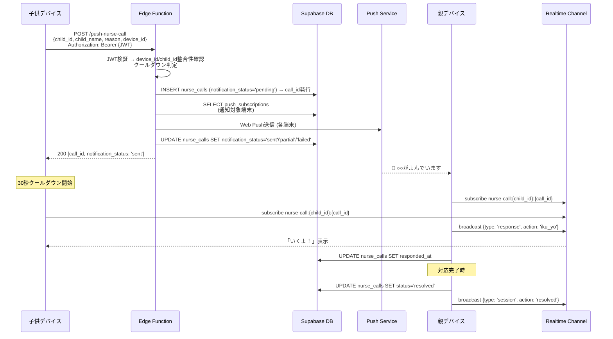
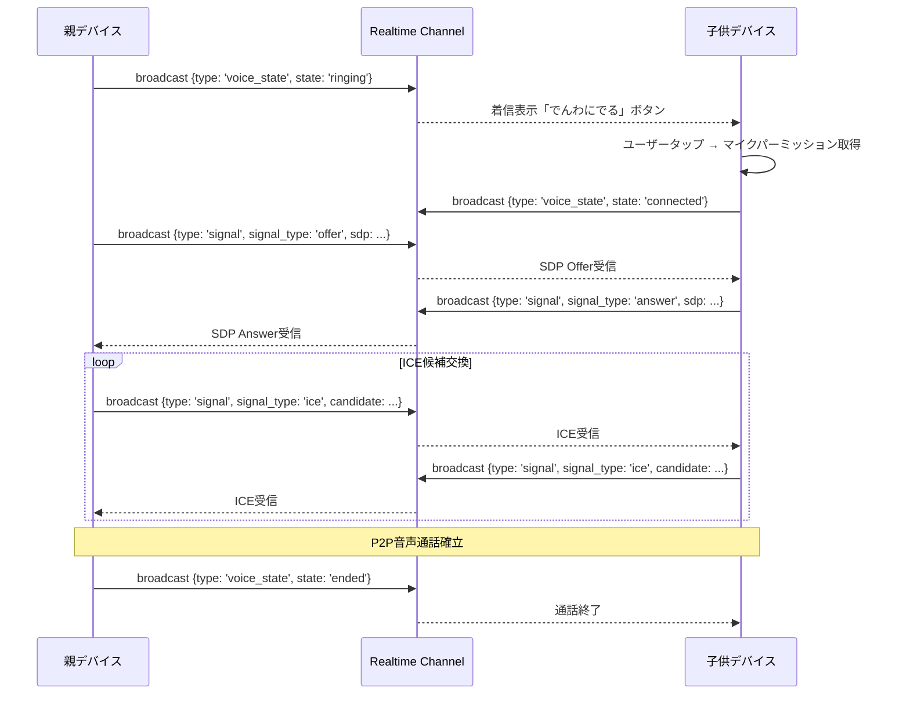
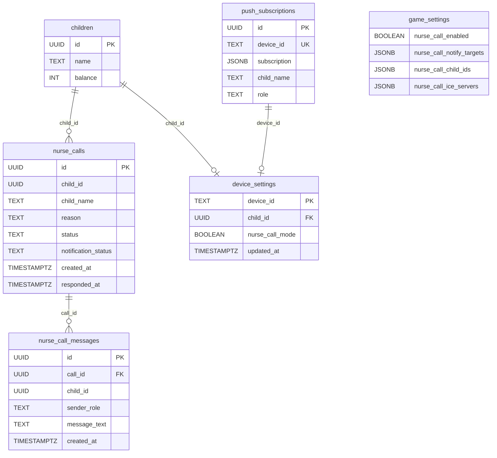

# 設計書: ナースコール機能

## Overview

ナースコール機能は、病気で隔離中の子供が親を即座に呼び出せるリアルタイム通知システムである。
既存の5分間隔cronベースのPush配信では間に合わないため、Supabase Edge Functionによる即時Push配信を核とする。

### 主要コンポーネント

1. **子供側UI** (`pages/nurse-call.html`) — 大きな呼び出しボタン + チャット + 音声通話
2. **Edge Function** (`push-nurse-call`) — JWT検証 + 即時Web Push配信 + 呼び出し記録
3. **Realtime通信** — 親→子供の応答、チャット、音声通話シグナリング（JWT認証ベース）
4. **デバイスロック** (`js/common.js`拡張) — ナースコールモード時の強制リダイレクト（await対応、フラッシュ防止）
5. **WebRTC音声通話** — ブラウザ間P2P音声通話（オプション、最後に実装）
6. **Anonymous Auth** — Supabase Anonymous Authによるセッション確立（ナースコール固有）

### 設計原則

- **即時性**: Edge Function直接呼び出しで5秒以内レスポンス（Pushサービス到達は保証外）
- **シンプルUI**: 体調の悪い子供でも迷わず操作できる大きなボタン
- **セッション管理**: `call_id`（nurse_calls.id）を軸に全イベントを紐付け
- **既存パターン踏襲**: Supabase Realtime Broadcast（puyo-battleで実績あり）
- **オフライン対応**: 最大1件のキュー + 復帰時自動送信
- **認証**: Supabase Anonymous Auth（JWT）でEdge FunctionとRealtimeチャネルを保護（ナースコール機能固有、既存機能に影響なし）

## Architecture

```mermaid
graph TB
    subgraph "子供デバイス"
        NC_PAGE[nurse-call.html]
        COMMON[common.js<br/>リダイレクト制御]
        NC_JS[nurse-call.js<br/>メインロジック]
        NC_CHAT[nurse-call-chat.js<br/>チャット]
        NC_VOICE[nurse-call-voice.js<br/>音声通話]
    end

    subgraph "親デバイス"
        NC_PARENT[nurse-call.html<br/>?child_id=...&call_id=...]
    end

    subgraph "Supabase"
        EDGE[Edge Function<br/>push-nurse-call]
        RT[Realtime Broadcast<br/>nurse-call:{child_id}:{call_id}]
        DB[(PostgreSQL<br/>nurse_calls<br/>nurse_call_messages<br/>device_settings)]
    end

    subgraph "外部"
        PUSH[Web Push API<br/>Apple/Google/Mozilla]
        STUN[STUN/TURN Server]
    end

    NC_PAGE --> NC_JS
    NC_JS -->|POST| EDGE
    EDGE -->|即時配信| PUSH
    PUSH -->|通知| NC_PARENT
    NC_JS <-->|Broadcast| RT
    NC_PARENT <-->|Broadcast| RT
    NC_CHAT <-->|Broadcast| RT
    NC_VOICE <-->|Signaling| RT
    NC_VOICE <-->|P2P音声| STUN
    COMMON -->|リダイレクト| NC_PAGE
    EDGE -->|INSERT| DB
    NC_CHAT -->|INSERT| DB
```

### シーケンス図: 呼び出し〜応答フロー



### シーケンス図: 音声通話フロー



## Components and Interfaces

### ファイル構成

```
pages/nurse-call.html          # ナースコール画面
js/nurse-call.js               # メインロジック（呼び出し、応答、状態管理）
js/nurse-call-chat.js          # チャットロジック
js/nurse-call-voice.js         # WebRTC音声通話
js/common.js                   # 既存ファイル拡張（デバイスロックリダイレクト追加）
sql/create_nurse_call_tables.sql  # DB定義
supabase/functions/push-nurse-call/index.ts  # Edge Function
```

### nurse-call.js — メインモジュール

```javascript
// 公開インターフェース
const NurseCall = {
  // 初期化（Anonymous Auth セッション確立含む）
  async init(childId, childName, callId),

  // Supabase Anonymous Auth セッション確立
  async ensureAuthSession(),

  // 呼び出し実行
  async sendCall(reason),

  // Realtimeチャネル購読（JWT付き）
  subscribeChannel(callId),

  // オフラインキュー管理
  queueOfflineCall(payload),
  flushOfflineQueue(),

  // call_id 解決
  async resolveCall(callId),  // 「対応完了」ボタン

  // 状態
  state: { cooldownRemaining, currentCallId, channelConnected }
};
```

### nurse-call-chat.js — チャットモジュール

```javascript
const NurseCallChat = {
  init(callId, childId, senderRole),
  async sendMessage(text),
  async sendQuickReply(presetKey),
  async loadHistory(callId, limit),
  onMessageReceived(callback),
  destroy()
};
```

### nurse-call-voice.js — 音声通話モジュール

```javascript
const NurseCallVoice = {
  init(callId, childId, role),
  async startCall(),           // 親側のみ
  async acceptCall(),          // 子供側
  endCall(),
  getState(),                  // 'idle' | 'ringing' | 'connected' | 'ended'
  onStateChange(callback),
  destroy()
};
```

### Edge Function: push-nurse-call

```typescript
// POST /functions/v1/push-nurse-call
// Required Header: Authorization: Bearer {JWT} (Supabase Anonymous Auth)

interface Request {
  child_id: string;       // UUID
  child_name: string;
  reason?: string;        // プリセット文字列
  device_id: string;      // localStorage push_device_id
}

interface Response {
  call_id: string;        // UUID (nurse_calls.id)
  notification_status: 'sent' | 'partial' | 'failed';
  message?: string;
}

// エラーレスポンス
// 401: JWT無効または欠落
// 429: クールダウン中
// 403: device_id未登録 or child_id不一致
// 500: 内部エラー
```

#### Edge Function 認証フロー

1. `Authorization: Bearer {JWT}` ヘッダーを取得
2. `supabase.auth.getUser(jwt)` でJWT検証（無効→401）
3. `device_id` が `device_settings` に存在し、`child_id` が一致することを確認（不一致→403）
4. クールダウン判定（30秒以内→429）
5. `nurse_calls` INSERT（`notification_status='pending'`）
6. Web Push送信
7. `notification_status` 更新: 全成功→`'sent'`、一部失敗→`'partial'`、全失敗→`'failed'`
8. レスポンス返却

### common.js 拡張 — デバイスロック制御

```javascript
// 既存common.jsの末尾に追加
// ページ表示前にチェック（フラッシュ防止）
document.body.style.visibility = 'hidden';

async function checkNurseCallMode() {
  const deviceId = localStorage.getItem('push_device_id');
  if (!deviceId) return;

  const cache = JSON.parse(localStorage.getItem('device_lock_cache') || 'null');
  const now = Date.now();
  const TTL = 5 * 60 * 1000; // 5分

  let nurseCallMode = false;

  if (cache && cache.updated_at && (now - new Date(cache.updated_at).getTime()) < TTL) {
    nurseCallMode = cache.nurse_call_mode;
  } else {
    // DBから取得
    const { data } = await client.from('device_settings')
      .select('nurse_call_mode')
      .eq('device_id', deviceId)
      .single();
    nurseCallMode = data?.nurse_call_mode || false;
    localStorage.setItem('device_lock_cache', JSON.stringify({
      nurse_call_mode: nurseCallMode,
      updated_at: new Date().toISOString()
    }));
  }

  if (nurseCallMode && !location.pathname.includes('nurse-call.html')) {
    location.href = '/okodukai_history/pages/nurse-call.html';
  }
}

// awaitで確実に完了を待ってからbody表示（ゲーム画面フラッシュ防止）
(async () => {
  await checkNurseCallMode();
  document.body.style.visibility = 'visible';
})();
```

### Realtimeチャネル設計

| イベントタイプ | 方向 | ペイロード |
|---|---|---|
| `response` | 親→子供 | `{action: 'iku_yo'}` |
| `session` | 親→子供 | `{action: 'resolved'}` |
| `chat` | 双方向 | `{sender_role, message_text, timestamp}` |
| `voice_state` | 双方向 | `{state: 'ringing'|'connected'|'ended'}` |
| `signal` | 双方向 | `{signal_type: 'offer'|'answer'|'ice', sdp?, candidate?}` |

チャネル名: `nurse-call:{child_id}:{call_id}`

#### チャネル認可

Supabase Realtimeの認証ベースアクセス制御を使用:
- クライアントはSupabase Anonymous Auth JWTを保持した状態でRealtimeに接続する
- `supabase.realtime.setAuth(jwt)` でJWTをRealtime接続に付与
- 有効なJWTを持たないクライアントはチャネルにsubscribeできない
- チャネル名に `child_id` と `call_id` を含めることで、意図しないセッションへのアクセスを防止

## Data Models

### 新規テーブル

#### nurse_calls

> 設計ノート: `child_name`は非正規化。呼び出し時点の名前を保持。表示時はchildrenから最新名で上書き可。（既存remindersテーブルと同パターン）

```sql
CREATE TABLE nurse_calls (
  id UUID PRIMARY KEY DEFAULT gen_random_uuid(),
  child_id UUID NOT NULL,
  child_name TEXT NOT NULL,
  reason TEXT,
  status TEXT NOT NULL DEFAULT 'active' CHECK (status IN ('active', 'resolved')),
  notification_status TEXT NOT NULL DEFAULT 'pending' CHECK (notification_status IN ('pending', 'sent', 'partial', 'failed')),
  created_at TIMESTAMPTZ NOT NULL DEFAULT now(),
  responded_at TIMESTAMPTZ
);

CREATE INDEX idx_nurse_calls_child_id ON nurse_calls(child_id);
CREATE INDEX idx_nurse_calls_created_at ON nurse_calls(created_at DESC);
CREATE INDEX idx_nurse_calls_active ON nurse_calls(status) WHERE status = 'active';
```

#### 自動resolve（30分無活動）

```sql
-- Supabase cron（pg_cron）で5分毎に実行
SELECT cron.schedule(
  'auto-resolve-nurse-calls',
  '*/5 * * * *',
  $$
    UPDATE nurse_calls
    SET status = 'resolved'
    WHERE status = 'active'
      AND GREATEST(
        responded_at,
        created_at,
        (SELECT MAX(created_at) FROM nurse_call_messages WHERE call_id = nurse_calls.id)
      ) < now() - interval '30 minutes';
  $$
);
```

#### nurse_call_messages

```sql
CREATE TABLE nurse_call_messages (
  id UUID PRIMARY KEY DEFAULT gen_random_uuid(),
  call_id UUID NOT NULL REFERENCES nurse_calls(id),
  child_id UUID NOT NULL,
  sender_role TEXT NOT NULL CHECK (sender_role IN ('parent', 'child')),
  message_text TEXT NOT NULL CHECK (char_length(message_text) BETWEEN 1 AND 500),
  created_at TIMESTAMPTZ NOT NULL DEFAULT now()
);

CREATE INDEX idx_nurse_call_messages_call_id ON nurse_call_messages(call_id);
```

#### device_settings

```sql
CREATE TABLE device_settings (
  device_id TEXT PRIMARY KEY,
  child_id UUID,
  nurse_call_mode BOOLEAN NOT NULL DEFAULT false,
  updated_at TIMESTAMPTZ NOT NULL DEFAULT now()
);
```

### game_settings 拡張

```sql
-- game_settings テーブル（id=1の1行）に以下のカラムを追加
ALTER TABLE game_settings ADD COLUMN nurse_call_enabled BOOLEAN NOT NULL DEFAULT false;
ALTER TABLE game_settings ADD COLUMN nurse_call_notify_targets JSONB; -- device_idの配列 or null
ALTER TABLE game_settings ADD COLUMN nurse_call_child_ids JSONB;      -- 対象child_idの配列 or null
ALTER TABLE game_settings ADD COLUMN nurse_call_ice_servers JSONB;    -- STUN/TURN設定
```

`nurse_call_ice_servers` の形式:
```json
[
  {"urls": "stun:stun.l.google.com:19302"},
  {"urls": "turn:relay.metered.ca:443", "username": "...", "credential": "..."}
]
```

> 運用ノート: 家庭内LAN環境ではSTUNのみで接続可能なケースが多い（TURNは不要）。Metered.ca無料枠にはTURN接続時間の制限あり。TURN接続量増加時は有料プラン移行が必要。`game_settings.nurse_call_ice_servers`からICE設定を取得するため、運用中にサーバー切替が可能。

### localStorage キー（新規）

| キー | 用途 | 形式 |
|---|---|---|
| `device_lock_cache` | デバイスロック状態キャッシュ | `{nurse_call_mode: boolean, updated_at: ISO8601}` |
| `nurse_call_offline_queue` | オフラインキュー | `{child_id, child_name, reason, device_id, queued_at}` or null |
| `nurse_call_current_call_id` | 現在アクティブなcall_id | UUID文字列 |

### 既存テーブルとの関係



## Correctness Properties

*プロパティとは、システムの全ての有効な実行において成り立つべき特性や振る舞いのことである。つまり、システムが何をすべきかについての形式的な宣言であり、人間が読める仕様と機械で検証可能な正しさの保証をつなぐ橋渡しとなる。*

### Property 1: 通知メッセージフォーマット

*For any* child_name（非空文字列）と任意のreason（文字列またはnull）に対して、通知メッセージフォーマット関数は以下を満たす:
- reasonが非null/非空の場合、出力に「🔔 {child_name}がよんでいます（{reason}）」が含まれる
- reasonがnullまたは空の場合、出力は「🔔 {child_name}がよんでいます」となる

**Validates: Requirements 2.3, 2.4**

### Property 2: 通知対象フィルタリング

*For any* notify_targets設定（device_idの配列またはnull）と任意のpush_subscriptionsリストに対して、送信対象決定関数は以下を満たす:
- notify_targetsが非空配列の場合、送信先はリスト内のdevice_idに一致するサブスクリプションのみ
- notify_targetsがnullまたは空配列の場合、送信先はrole='admin'の全サブスクリプション

**Validates: Requirements 2.6, 2.7**

### Property 3: サーバー側クールダウン判定

*For any* child_idと最新呼び出しのcreated_atタイムスタンプと現在時刻に対して、クールダウン判定関数は以下を満たす:
- (現在時刻 - created_at) < 30秒 の場合、リクエストを拒否する（429）
- (現在時刻 - created_at) >= 30秒 の場合、リクエストを許可する

**Validates: Requirements 3.5, 3.6, 8.8, 11.9**

### Property 4: セッション識別子生成（チャネル名・URL）

*For any* child_id（UUID）とcall_id（UUID）に対して:
- チャネル名生成関数は `nurse-call:{child_id}:{call_id}` 形式の文字列を返す
- 通知URL生成関数は `/pages/nurse-call.html?child_id={child_id}&call_id={call_id}` 形式の文字列を返す
- 生成された識別子からchild_idとcall_idを正しく抽出できる（round-trip）

**Validates: Requirements 5.1, 5.5, 11.6**

### Property 5: メッセージ受け入れフィルタリング

*For any* 受信メッセージ（child_id, call_idを含む）とローカル状態（自身のchild_id, 現在のcall_id）に対して:
- メッセージのchild_idとcall_idが両方ともローカル状態と一致する場合のみ受け入れる
- それ以外は無視する

**Validates: Requirements 5.6**

### Property 6: デバイスロックキャッシュTTL判定

*For any* キャッシュのupdated_atタイムスタンプと現在時刻に対して:
- (現在時刻 - updated_at) < 5分 の場合、キャッシュは有効（DBアクセス不要）
- (現在時刻 - updated_at) >= 5分 の場合、キャッシュは無効（DB再取得必要）
- キャッシュが存在しない場合、DB再取得必要

**Validates: Requirements 6.2, 6.3**

### Property 7: ナースコールモード リダイレクト判定

*For any* nurse_call_mode状態（boolean）と現在のページパス（文字列）に対して:
- nurse_call_mode=true かつ パスがnurse-call.htmlでない場合、リダイレクトが必要
- nurse_call_mode=true かつ パスがnurse-call.htmlの場合、リダイレクト不要
- nurse_call_mode=false の場合、リダイレクト不要

**Validates: Requirements 6.4, 6.5, 7.7**

### Property 8: オフラインキュー管理

*For any* 呼び出しペイロード列（N件、N >= 1）に対して:
- キューに保存後、キューサイズは常に1以下（最新のみ保持）
- キューからの読み出しは最後に保存したペイロードと一致する（round-trip）
- キュー送信後はキューが空になる

**Validates: Requirements 8.3, 8.6**

### Property 9: 音声通話状態機械

*For any* 状態遷移シーケンスに対して、Voice_Call_State状態機械は以下を満たす:
- 有効な遷移のみ: idle→ringing, ringing→connected, ringing→ended, connected→ended, ended→idle
- ringingまたはconnected状態からのstartCall（新規発信）は拒否される
- ended状態は自動的にidleに復帰する

**Validates: Requirements 10.18, 10.20, 10.21**

## Error Handling

### Edge Function エラー

| 状況 | HTTPステータス | レスポンス | 子供側UI表示 |
|---|---|---|---|
| 正常成功 | 200 | `{call_id, notification_status:'sent'}` | 「おくったよ！」 |
| 部分成功 | 200 | `{call_id, notification_status:'partial'}` | 「おくったよ！」（一部端末に届かなかった可能性あり） |
| Push全失敗 | 200 | `{call_id, notification_status:'failed'}` | 「おくったけど、届かなかったかも」 |
| JWT無効/欠落 | 401 | `{error:'unauthorized'}` | 「おくれなかったよ。もういちどおしてね」 |
| クールダウン中 | 429 | `{error:'cooldown', retry_after:N}` | 「まだおくれないよ。すこしまってね」 |
| device_id未登録/child_id不一致 | 403 | `{error:'forbidden'}` | 「おくれなかったよ。もういちどおしてね」 |
| 内部エラー | 500 | `{error:'internal_error'}` | 「おくれなかったよ。もういちどおしてね」 |
| ネットワーク接続なし | - (fetch失敗) | - | 「ネットがつながっていないけど、つながったらおくるね」 |

### オフラインキュー

- `navigator.onLine === false` 時にボタンが押された場合、localStorageにキュー保存
- `online` イベントで自動送信を試行
- キューは最大1件（再押下で上書き）
- キュー保存中は「つながったらおくるよ」を表示

### Realtime接続エラー

- チャネル接続失敗時: 5秒後にリトライ（最大3回）
- 接続断時: Supabase Realtime clientの自動再接続に委任

### 音声通話エラー

| 状況 | UI表示 |
|---|---|
| マイクパーミッション拒否 | 「マイクが使えないよ」 |
| WebRTC接続失敗 | 「つながらなかったよ。もういちどためしてね」 |
| 通話中に接続断 | 状態をendedに遷移、「きれちゃったよ」 |

## Testing Strategy

### テスト方針

本機能はPWA（静的HTML/JS）+ Supabase Edge Functionで構成される。
テストは以下の2層で実施する:

1. **プロパティテスト（Property-Based Testing）**: 純粋関数ロジックの正確性検証
2. **ユニットテスト（Example-Based）**: 特定シナリオ・UI動作・統合ポイントの確認

### プロパティテスト対象

プロパティテストライブラリ: **fast-check**（JavaScript用PBTライブラリ）

各プロパティテストは最低100イテレーション実行する。

| Property | テスト対象関数 | テストファイル |
|---|---|---|
| Property 1 | `formatNotificationMessage(childName, reason)` | `tests/nurse-call.property.test.js` |
| Property 2 | `filterNotifyTargets(targets, subscriptions)` | `tests/nurse-call.property.test.js` |
| Property 3 | `isCooldownActive(lastCreatedAt, now)` | `tests/nurse-call.property.test.js` |
| Property 4 | `buildChannelName(childId, callId)`, `buildNotifyUrl(childId, callId)` | `tests/nurse-call.property.test.js` |
| Property 5 | `shouldAcceptMessage(msg, localState)` | `tests/nurse-call.property.test.js` |
| Property 6 | `isCacheValid(cache, now)` | `tests/nurse-call.property.test.js` |
| Property 7 | `shouldRedirect(nurseCallMode, currentPath)` | `tests/nurse-call.property.test.js` |
| Property 8 | `offlineQueue.push(payload)`, `offlineQueue.peek()` | `tests/nurse-call.property.test.js` |
| Property 9 | `VoiceCallStateMachine.transition(event)` | `tests/nurse-call.property.test.js` |

タグフォーマット: `Feature: nurse-call, Property {N}: {property_text}`

### ユニットテスト対象

| テスト対象 | テスト内容 |
|---|---|
| Edge Function | リクエストバリデーション、レスポンス形式 |
| UI表示 | ボタン状態、クールダウン表示、エラーメッセージ |
| チャット | Quick Reply送信、メッセージ履歴ロード |
| 管理者操作 | ナースコールモードON/OFF、設定保存 |

### 統合テスト

- Edge Function → Supabase DB → Push配信の一連フロー
- Realtime Broadcast の送受信
- オフライン → オンライン復帰時のキュー送信

