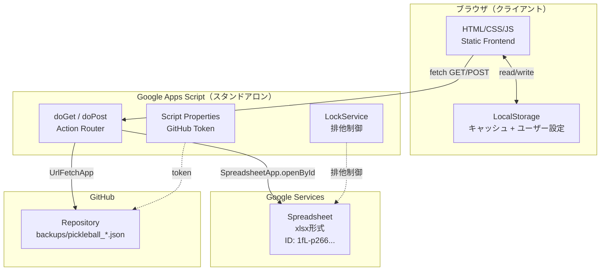
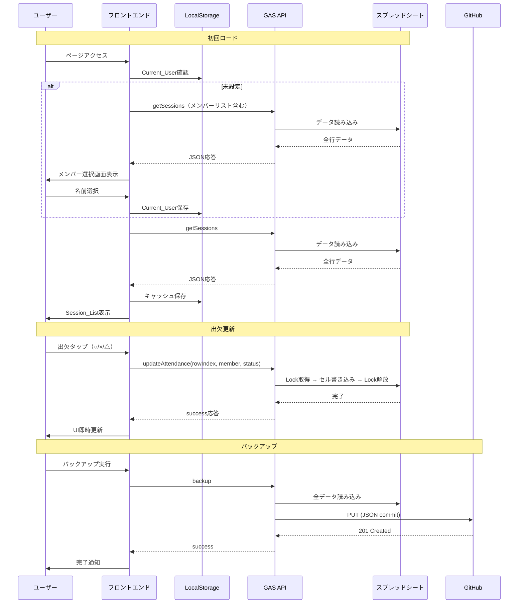

# Design Document: Pickleball Schedule Manager

## Overview

関東地区ピックル会（京セラピックルボールクラブ）の練習日程・出欠管理Webアプリケーション。
既存のGoogleスプレッドシート（xlsx形式）をデータストアとし、スタンドアロンGoogle Apps Script（GAS）を中間APIとしてフロントエンドから読み書きを行う。

### 主要設計判断

| 判断項目 | 選択 | 根拠 |
|----------|------|------|
| データストア | 既存xlsxスプレッドシート（変更なし） | 既存運用との併用を維持 |
| 中間API | スタンドアロンGAS | スプレッドシートに紐づけず独立運用、デプロイが容易 |
| 行識別 | rowIndex + 内容検証（date + venue + startTime） | ID列追加不要、既存シート構造を維持 |
| フロントエンド | 静的HTML + Vanilla JS | フレームワーク不要、GitHub Pages等で配信可能 |
| バックアップ | GAS → GitHub API | Script Propertiesでトークン管理、安全 |
| テーマ | ダークテーマ | 既存style.css準拠 |

## Architecture

### システム構成図



### データフロー



## Components and Interfaces

### フロントエンド コンポーネント構成

```
kc_pickleball_club_app/
├── index.html          # メインHTML（SPA的構成）
├── style.css           # ダークテーマCSS
├── common.js           # 設定定数、API通信、ユーティリティ
├── app.js              # メインアプリロジック、状態管理
├── components/
│   （ファイル分割はせず、app.js内でDOM操作）
└── README.md
```

実装はSPA的に単一ページ内で画面切替を行う（ルーターなし、表示/非表示切替）。

### フロントエンド モジュール構成

| モジュール | 責務 |
|-----------|------|
| common.js | GAS_API_URL定数、fetchラッパー（エラーハンドリング付き）、日付ユーティリティ、LocalStorageヘルパー |
| app.js | 状態管理、画面遷移、イベントハンドリング、DOM生成・更新 |

### GAS API インターフェース

```javascript
// リクエスト形式
// GET:  ?action=getSessions
// GET:  ?action=listBackups
// POST: { action: "updateAttendance", rowIndex, memberName, status, note }
// POST: { action: "addSession", date, venue, startTime, endTime, reservationId, notes }
// POST: { action: "updateSession", rowIndex, date, venue, startTime, endTime, reservationId, notes, expectedDate, expectedVenue, expectedStartTime }
// POST: { action: "deleteSession", rowIndex, expectedDate, expectedVenue, expectedStartTime }
// POST: { action: "backup" }
// POST: { action: "restore", fileName }

// レスポンス形式
{
  success: boolean,
  data?: {
    sessions?: Practice_Session[],  // getSessions
    members?: string[],             // getSessions（列ヘッダーから）
    backups?: BackupFile[],         // listBackups
    message?: string                // 成功メッセージ
  },
  error?: {
    code: string,    // ROW_MISMATCH | WRITE_CONFLICT | SPREADSHEET_ERROR | INVALID_PARAMS | GITHUB_ERROR | UNKNOWN_ERROR
    message: string  // 人間が読めるエラー詳細
  }
}
```

### GAS 内部構成

| ファイル | 責務 |
|---------|------|
| main.gs | doGet/doPost ルーター、アクションディスパッチ |
| spreadsheet.gs | スプレッドシート読み書きロジック（openById、行解析、セル書き込み） |
| github.gs | GitHub API連携（バックアップ保存、一覧取得、復元データ取得） |
| validation.gs | パラメータバリデーション、行内容検証 |
| response.gs | 統一レスポンスビルダー（success() / error()） |


### フロントエンド → GAS 通信仕様

- **GET**: `fetch(GAS_API_URL + '?action=xxx')` → CORS対応のためGASはdoGetで処理
- **POST**: `fetch(GAS_API_URL, { method: 'POST', body: JSON.stringify(payload) })`
- GASのWebアプリはCORSヘッダーを自動付与（ContentService.createTextOutput + setMimeType JSON）
- タイムアウト: フロントエンドで15秒タイムアウトを設定（UX優先、GASの実行上限は6分だが待たせすぎない）

### 画面構成（UI States）

```mermaid
statechart
```

| 画面 | 表示条件 | 主要UI要素 |
|------|----------|-----------|
| メンバー選択 | Current_User未設定 | メンバーリスト（ボタン形式） |
| Session_List（メイン） | Current_User設定済み | 練習日カード一覧、出欠ボタン、追加/設定ボタン |
| Session_Form（追加/編集） | 追加or編集アクション時 | 日付/会場/時刻入力フォーム |
| 設定 | 設定ボタン押下時 | ユーザー変更、バックアップ/復元 |
| エラー/オフライン | API失敗時 | エラーメッセージ、リトライ/読み取り専用表示 |

## Data Models

### スプレッドシート構造（推定）

```
| A列     | B列    | C列  | D列      | E列      | F列       | G列  | H列        | I列     | J列     | K列     | ...   |
|---------|--------|------|----------|----------|-----------|------|------------|---------|---------|---------|-------|
| 日付    | 曜日   | 会場 | 開始時刻 | 終了時刻 | 予約ID    | 備考 | 参加人数   | メンバーA | メンバーB | メンバーC | ...   |
| 2025/7/5| 土     | 緑SC | 9:00     | 12:00    | R-001     |      | 5          | ○       | ×       | △遅れて  | ...   |
```

### フロントエンド データ構造

```javascript
// アプリケーション状態（app.js内で管理）
const AppState = {
  currentUser: "",       // Current_User名
  sessions: [],          // Practice_Session[]
  members: [],           // メンバー名リスト
  offline: false,        // オフラインモードか
  loading: false         // API通信中か
};

// Practice_Session（APIレスポンスから受け取る）
{
  rowIndex: 5,                    // スプレッドシート行番号（※取得直後のみ有効、キャッシュされたrowIndexでの書き込み操作は禁止）
  date: "2025-07-05",            // YYYY-MM-DD
  dayOfWeek: "土",               // 曜日
  venue: "緑スポーツセンター",     // 会場
  startTime: "09:00",            // HH:MM
  endTime: "12:00",              // HH:MM
  reservationId: "R-001",        // 予約ID（nullable）
  notes: "",                     // 備考（nullable）
  participantCount: 5,            // 参加予定人数（Number、表示時に"5人"等にフォーマット）
  attendance: [                  // 全メンバーの出欠
    { memberName: "田中", status: "○", note: "" },
    { memberName: "鈴木", status: "×", note: "" },
    { memberName: "佐藤", status: "△", note: "遅れて参加" }
  ]
}

// LocalStorage構造
{
  "pb_currentUser": "田中",                    // Current_User名
  "pb_cache": {                                // オフラインキャッシュ
    "lastFetched": "2025-07-01T10:00:00+09:00", // ISO 8601 JST
    "sessions": [...],                          // Practice_Session[]
    "members": ["田中", "鈴木", "佐藤", ...]    // メンバーリスト
  }
}
```

### GAS内部データ変換

```javascript
// スプレッドシート行 → Practice_Session変換
function rowToSession(row, rowIndex, memberNames) {
  return {
    rowIndex: rowIndex,
    date: formatDate(row[0]),        // Date → "YYYY-MM-DD"
    dayOfWeek: row[1],               // そのまま
    venue: row[2],                   // そのまま
    startTime: formatTime(row[3]),   // → "HH:MM"
    endTime: formatTime(row[4]),     // → "HH:MM"
    reservationId: row[5] || "",
    notes: row[6] || "",
    participantCount: Number(row[7]) || 0,  // Number型で返す
    attendance: memberNames.map((name, i) => ({
      memberName: name,
      status: parseStatus(row[8 + i]),  // "○", "×", "△"
      note: parseNote(row[8 + i])       // △の場合の補足テキスト
    }))
  };
}
```

### バックアップJSON形式

```javascript
{
  "exportedAt": "2025-07-01T10:00:00+09:00",
  "spreadsheetId": "1fL-p266yVU2M8CZv2spousWvpY4TmjIv",
  "members": ["田中", "鈴木", "佐藤"],
  "sessions": [
    {
      "date": "2025-07-05",
      "dayOfWeek": "土",
      "venue": "緑スポーツセンター",
      "startTime": "09:00",
      "endTime": "12:00",
      "reservationId": "R-001",
      "notes": "",
      "attendance": {
        "田中": { "status": "○", "note": "" },
        "鈴木": { "status": "×", "note": "" },
        "佐藤": { "status": "△", "note": "遅れて参加" }
      }
    }
  ]
}
```


## Correctness Properties

*A property is a characteristic or behavior that should hold true across all valid executions of a system—essentially, a formal statement about what the system should do. Properties serve as the bridge between human-readable specifications and machine-verifiable correctness guarantees.*

### Property 1: Session sorting invariant

*For any* array of Practice_Sessions, after sorting, for every consecutive pair (sessions[i], sessions[i+1]), sessions[i].date ≤ sessions[i+1].date, and if dates are equal then sessions[i].startTime ≤ sessions[i+1].startTime.

**Validates: Requirements 1.1**

### Property 2: Session rendering completeness

*For any* valid Practice_Session with attendance array, the rendered HTML output SHALL contain the session's date, dayOfWeek, venue, startTime, endTime, and every member's attendance status.

**Validates: Requirements 1.2, 2.1**

### Property 3: Past session classification

*For any* Practice_Session date and a reference date "today", isPast(session.date, today) returns true if and only if session.date < today.

**Validates: Requirements 1.3**

### Property 4: Attendance display formatting

*For any* Attendance with status "△" and any note string (including empty), the formatted display SHALL be "△（{note}）" when note is non-empty, and "△（未定）" when note is empty or null.

**Validates: Requirements 2.2, 2.3**

### Property 5: Participant count calculation

*For any* array of Attendance objects, the participant count SHALL equal the number of entries where status is "○" plus the number of entries where status is "△".

**Validates: Requirements 2.4**

### Property 6: Session form validation

*For any* session form data object, validation SHALL reject when: (a) date is missing, (b) venue is missing, (c) startTime is missing, or (d) endTime ≤ startTime. Validation SHALL accept when all required fields are present and endTime > startTime.

**Validates: Requirements 4.4, 4.5, 5.5**

### Property 7: Attendance note length validation

*For any* string, note validation SHALL accept strings with length ≤ 20 characters and reject strings with length > 20 characters.

**Validates: Requirements 3.2**

### Property 8: Row content mismatch detection

*For any* row data (date, venue, startTime) and expected values (expectedDate, expectedVenue, expectedStartTime), the verification function SHALL return ROW_MISMATCH if and only if the row's date ≠ expectedDate OR the row's venue ≠ expectedVenue OR the row's startTime ≠ expectedStartTime.

**Validates: Requirements 5.4, 6.5, 8.5, 8.6, 13.4, 13.5**

### Property 9: API response format schema

*For any* success/error response built by the response builder, the output JSON SHALL have a boolean `success` field, and when success is false it SHALL have an `error` object with string fields `code` and `message`, and when success is true it MAY have a `data` object.

**Validates: Requirements 8.3**

### Property 10: Backup filename format

*For any* Date object in JST timezone, the generated backup filename SHALL match the pattern `backups/pickleball_YYYYMMDD_HHmmss.json` where YYYYMMDD and HHmmss correspond to the JST date and time components.

**Validates: Requirements 9.3**

### Property 11: Cache round-trip

*For any* valid sessions array and members array, storing them via the cache function and then retrieving SHALL return equivalent data, and the lastFetched timestamp SHALL be a valid ISO 8601 string in JST.

**Validates: Requirements 11.1**

## Error Handling

### フロントエンド エラーハンドリング

| エラー場面 | 表示 | ユーザーアクション |
|-----------|------|-----------------|
| API通信失敗（ネットワーク） | "通信エラーが発生しました" + キャッシュ表示 | リトライボタン |
| API通信失敗（タイムアウト15s） | "タイムアウトしました" | リトライボタン |
| ROW_MISMATCH | "データが更新されています。再読み込みしてください" | 自動リフレッシュ提案 |
| WRITE_CONFLICT | "他のユーザーが更新中です。少し待ってからリトライしてください" | リトライボタン |
| INVALID_PARAMS | "入力内容に誤りがあります: {details}" | フォーム再表示 |
| SPREADSHEET_ERROR | "スプレッドシートへのアクセスに失敗しました" | リトライボタン |
| GITHUB_ERROR | "バックアップに失敗しました: {details}" | リトライボタン |
| UNKNOWN_ERROR | "予期しないエラーが発生しました（{code}）" | リトライボタン |

### GAS側 エラーハンドリング

```javascript
// 統一エラーレスポンスビルダー
function errorResponse(code, message) {
  return ContentService.createTextOutput(JSON.stringify({
    success: false,
    error: { code, message }
  })).setMimeType(ContentService.MimeType.JSON);
}

// LockService タイムアウト処理
function withLock(fn) {
  const lock = LockService.getScriptLock();
  if (!lock.tryLock(10000)) {
    return errorResponse('WRITE_CONFLICT', '同時書き込みのため処理できませんでした');
  }
  try {
    return fn();
  } finally {
    lock.releaseLock();
  }
}

// Row検証（date + venue + startTime の3項目で検証）
function verifyRow(sheet, rowIndex, expectedDate, expectedVenue, expectedStartTime) {
  const row = sheet.getRange(rowIndex, 1, 1, 4).getValues()[0]; // A〜D列
  const actualDate = formatDate(row[0]);
  const actualVenue = String(row[2]);
  const actualStartTime = formatTime(row[3]);
  if (actualDate !== expectedDate || actualVenue !== expectedVenue || actualStartTime !== expectedStartTime) {
    return errorResponse('ROW_MISMATCH', '行の内容が変更されています。再読み込みしてください');
  }
  return null; // OK
}
```

### オフライン時の動作

1. API失敗を検出 → LocalStorageキャッシュを表示
2. 「オフラインデータ（{lastFetched}時点）」バナー表示
3. 全書き込み操作を無効化（ボタンdisabled + "読み取り専用"バッジ）
4. ユーザーが手動リフレッシュを試行可能

## Testing Strategy

### テストアプローチ

本プロジェクトはフロントエンド（Vanilla JS）とバックエンド（GAS）の2層構成のため、以下の戦略を取る。

### ユニットテスト（例示ベース）

フレームワーク: フロントエンドのピュア関数に対してブラウザ環境のテストランナーは不要。Node.js + Vitest で純粋ロジックをテスト。

対象:
- 日付比較・ソートロジック
- フォームバリデーション
- 出欠フォーマッティング
- 参加者カウント
- キャッシュ読み書き
- APIレスポンスパース

### プロパティベーステスト

フレームワーク: **fast-check**（Vitest + fast-check）

各正当性プロパティ（Property 1〜11）を fast-check で実装:
- 最低100イテレーション/プロパティ
- 各テストにコメントでプロパティ参照を記載
- タグ形式: `Feature: pickleball-schedule-manager, Property {N}: {title}`

対象関数:
- `sortSessions()` → Property 1
- `renderSession()` → Property 2
- `isPastSession()` → Property 3
- `formatAttendance()` → Property 4
- `countParticipants()` → Property 5
- `validateSessionForm()` → Property 6
- `validateNote()` → Property 7
- `verifyRowContent()` → Property 8
- `buildResponse()` → Property 9
- `generateBackupFilename()` → Property 10
- `cacheData() / getCachedData()` → Property 11

### インテグレーションテスト

対象:
- GAS API各エンドポイントの動作確認（実スプレッドシート使用）
- LockServiceの排他制御動作
- GitHub APIバックアップ/復元フロー

手法: GAS側のテスト関数として実装し、手動実行で検証。

### E2Eテスト（手動）

- メンバー選択 → セッション一覧表示 → 出欠登録の一連フロー
- 練習日追加/編集/削除
- バックアップ/復元
- オフライン動作確認
- モバイル表示確認

