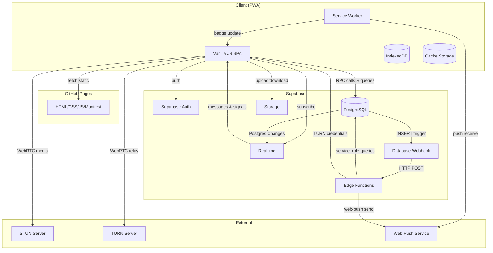
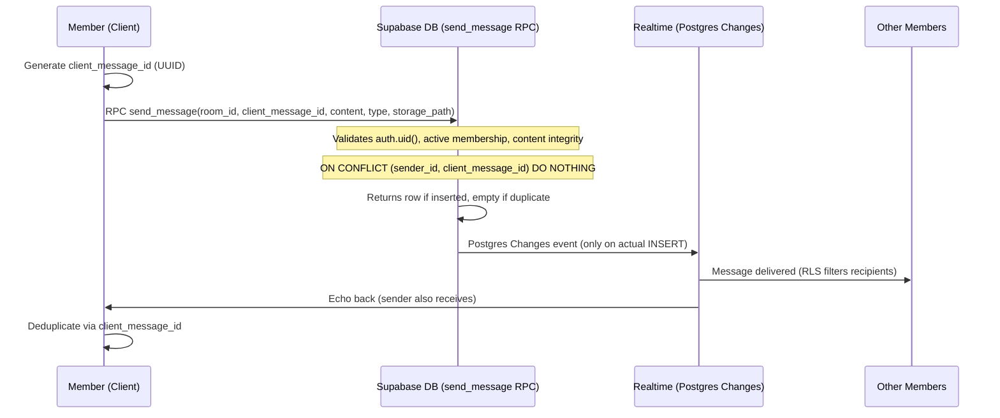
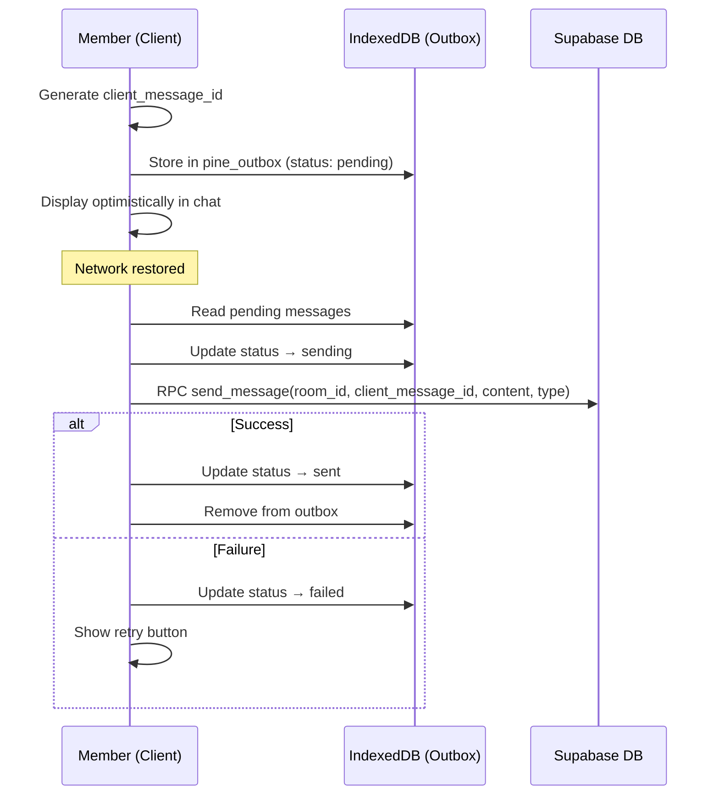
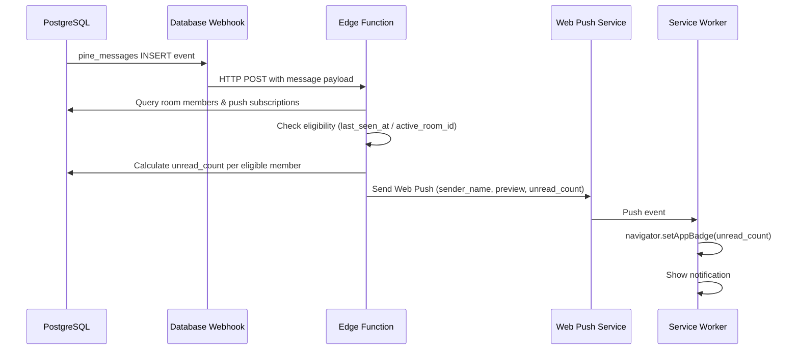
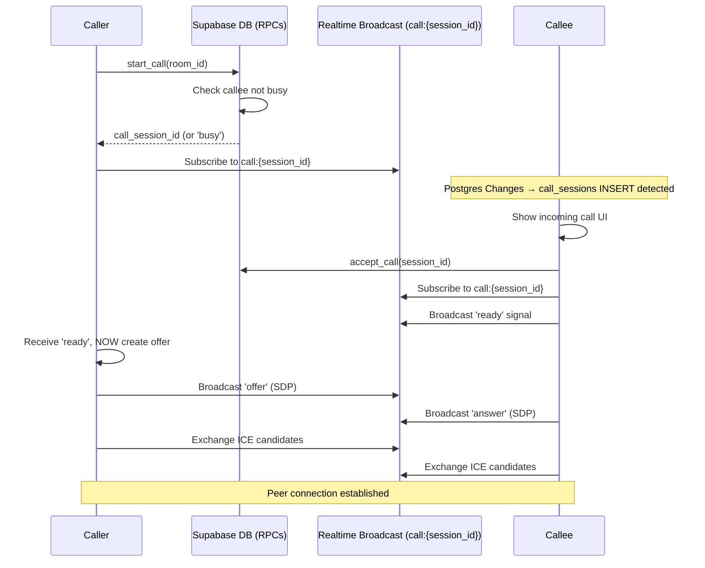
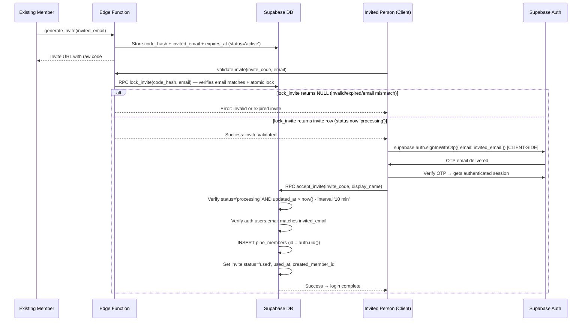

# Design Document: Pine Chat App

## Overview

Pine は家族＋子供の友達向けの小規模LINEライクチャットPWA。Supabase をバックエンドに、Vanilla JS + HTML/CSS のフロントエンドを GitHub Pages でホスティングする。全ビジネス状態変更は SECURITY DEFINER RPC 経由で行い、RLS で読み取り制御を実装する。

主要機能:
- テキスト・画像メッセージのリアルタイム送受信（Postgres Changes）
- WebRTC 1対1通話（Private Broadcast Channel シグナリング）
- Web Push プッシュ通知（Database Webhook → Edge Function）
- PWA バッジ通知・オフライン対応（IndexedDB + Cache Storage）
- 招待制認証（Supabase Auth Email OTP + Edge Function）

設計原則:
- **All business-state mutations are performed through SECURITY DEFINER RPCs. User-owned auxiliary state (read_status, push_subscriptions, pine_members presence fields) may be mutated directly under strict RLS.** — ビジネスデータはRPC経由、ユーザー所有補助データのみ直接CRUD許可
- **Supabase Storage object operations via Storage API + Storage RLS policies** — 画像アップロード/ダウンロードはStorage API経由
- **User-owned auxiliary data (read_status, push_subscriptions, pine_members presence fields) via direct RLS CRUD** — ユーザー所有補助データのみ直接CRUD許可
- **Realtime channel authorization via realtime.messages RLS policies** — WebRTCシグナリングの認可
- **Offline-first for reads** — IndexedDB キャッシュで即時表示
- **Progressive enhancement** — Badge API, Push API は非対応環境でグレースフルに無視
- **Configurable BASE_PATH** — GitHub Pages 対応（`/repo-name` or `''` for custom domains）

## Security Invariants

以下のセキュリティ不変条件はシステム全体で常に維持される:

- **S1.** Users cannot read rooms/messages where they are not active members
- **S2.** Users cannot write messages to rooms where they are not active members
- **S3.** Call sessions are only operable by caller/callee
- **S4.** At most one NON-DELETED DM room exists per member pair (DB-enforced via partial unique index on dm_member_a, dm_member_b WHERE deleted_at IS NULL). If a DM is soft-deleted and a new DM is needed between the same pair, a new room is created (the partial unique index allows this since deleted_at IS NOT NULL on the old room). Old messages remain in the deleted room but are inaccessible.
- **S5.** Active membership is unique per member/room (DB-enforced via partial unique index)
- **S6.** Invite acceptance requires email match between invite and authenticated user
- **S7.** Invite code plaintext is never stored in DB (only SHA-256 hash)
- **S8.** Private call channels are accessible only to caller/callee (Realtime Authorization)
- **S9.** Message sender_id always equals auth.uid() (RPC-enforced, no direct INSERT)
- **S10.** Room creator cannot leave group rooms without ownership transfer. DM rooms do not support leaving (only soft-delete via `delete_chat_room`).

### SECURITY DEFINER 関数設計規約

全ての SECURITY DEFINER 関数は以下の2分類に従うこと:

#### A. Client-facing (authenticated) — クライアントから直接呼び出す関数

```sql
CREATE FUNCTION function_name(params)
RETURNS return_type LANGUAGE plpgsql SECURITY DEFINER
SET search_path = public, pg_temp AS $fn$ ... $fn$;

-- 作成後に必ず実行（パラメータ型を含むフルシグネチャ）:
REVOKE EXECUTE ON FUNCTION function_name(param_types) FROM PUBLIC;
GRANT EXECUTE ON FUNCTION function_name(param_types) TO authenticated;
```

Client-facing RPCs (always check `auth.uid() IS NOT NULL`):
- `create_chat_room(TEXT, UUID[], BOOLEAN)`
- `get_or_create_dm_room(UUID)`
- `leave_chat_room(UUID)`
- `transfer_room_ownership(UUID, UUID)`
- `add_room_member(UUID, UUID)`
- `remove_room_member(UUID, UUID)`
- `rename_chat_room(UUID, TEXT)`
- `delete_chat_room(UUID)`
- `send_message(UUID, UUID, TEXT, TEXT, TEXT)`
- `start_call(UUID)`
- `accept_call(UUID)`
- `reject_call(UUID)`
- `cancel_call(UUID)`
- `end_call(UUID)`
- `fail_call(UUID)`
- `mark_call_connected(UUID)`
- `accept_invite(TEXT, TEXT)`

#### B. Service-only (service_role) — Edge Functionからのみ呼び出す関数

```sql
CREATE FUNCTION function_name(params)
RETURNS return_type LANGUAGE plpgsql SECURITY DEFINER
SET search_path = public, pg_temp AS $fn$ ... $fn$;

-- Explicit REVOKE from all client roles + GRANT to service_role only
REVOKE EXECUTE ON FUNCTION function_name(param_types) FROM PUBLIC;
REVOKE EXECUTE ON FUNCTION function_name(param_types) FROM anon;
REVOKE EXECUTE ON FUNCTION function_name(param_types) FROM authenticated;
GRANT EXECUTE ON FUNCTION function_name(param_types) TO service_role;
```

Service-only RPCs (called only by Edge Functions with service_role key):
- `lock_invite(TEXT, TEXT)` — called by validate-invite Edge Function
- `calculate_unread_count(UUID)` — called by push-notify Edge Function

#### RLS Helper Functions (SECURITY DEFINER)

To avoid self-referencing infinite recursion in RLS policies on `pine_chat_room_members`, use these helper functions:

```sql
-- Checks if a member is active in a room (avoids self-referencing RLS on pine_chat_room_members)
CREATE FUNCTION is_active_room_member(p_room_id UUID, p_member_id UUID)
RETURNS BOOLEAN LANGUAGE sql SECURITY DEFINER SET search_path = public, pg_temp
AS $$
  SELECT EXISTS (
    SELECT 1 FROM public.pine_chat_room_members
    WHERE chat_room_id = p_room_id AND member_id = p_member_id AND left_at IS NULL
  );
$$;

-- Checks if two members share any active room (for pine_members SELECT policy)
CREATE FUNCTION shares_any_room(p_member_id UUID)
RETURNS BOOLEAN LANGUAGE sql SECURITY DEFINER SET search_path = public, pg_temp
AS $$
  SELECT EXISTS (
    SELECT 1 FROM public.pine_chat_room_members AS my
    JOIN public.pine_chat_room_members AS their
      ON my.chat_room_id = their.chat_room_id
    WHERE my.member_id = auth.uid() AND my.left_at IS NULL
      AND their.member_id = p_member_id AND their.left_at IS NULL
  );
$$;
```

関数本体の必須チェック:
1. `IF auth.uid() IS NULL THEN RAISE EXCEPTION 'Not authenticated'; END IF;` を最初に実行（Client-facingのみ）
2. リソースの所有権・メンバーシップを必ず検証してから変更を実行
3. `search_path` を明示的に設定して search_path injection を防止

**RLS Helper Function REVOKE:** These functions are invoked by PostgreSQL's RLS evaluation engine (which runs as the table owner), not by client sessions directly. The REVOKE statements in the REVOKE/GRANT section above prevent clients from calling them directly.

## Architecture

### System Architecture Diagram



### Component Layers

```
┌─────────────────────────────────────────────────────────┐
│                    Presentation Layer                     │
│  Router │ ChatRoomList │ ChatRoom │ CallScreen │ Invite  │
├─────────────────────────────────────────────────────────┤
│                    Application Layer                      │
│  MessageService │ RoomService │ CallService │ AuthService│
│  PushService │ PresenceService │ UnreadService           │
├─────────────────────────────────────────────────────────┤
│                    Data Layer                             │
│  SupabaseClient │ IndexedDBStore │ OfflineOutbox         │
├─────────────────────────────────────────────────────────┤
│                    Service Worker                         │
│  CacheManager │ PushHandler │ BadgeManager               │
└─────────────────────────────────────────────────────────┘
```

### Key Data Flows

#### 1. Message Send (Online)



**send_message RPC pattern (replaces direct INSERT):**
```sql
CREATE FUNCTION send_message(
  p_room_id UUID,
  p_client_message_id UUID,
  p_content TEXT DEFAULT NULL,
  p_message_type TEXT DEFAULT 'text',
  p_storage_path TEXT DEFAULT NULL
) RETURNS pine_messages LANGUAGE plpgsql SECURITY DEFINER
SET search_path = public, pg_temp
AS $
DECLARE
  v_caller UUID := auth.uid();
  v_result pine_messages;
BEGIN
  IF v_caller IS NULL THEN RAISE EXCEPTION 'Not authenticated'; END IF;

  -- Validate active membership
  IF NOT EXISTS (
    SELECT 1 FROM pine_chat_room_members
    WHERE chat_room_id = p_room_id AND member_id = v_caller AND left_at IS NULL
  ) THEN
    RAISE EXCEPTION 'Not an active member of this room';
  END IF;

  -- Validate content integrity
  IF p_message_type = 'text' AND (p_content IS NULL OR p_storage_path IS NOT NULL) THEN
    RAISE EXCEPTION 'Text message must have content and no storage_path';
  END IF;
  IF p_message_type = 'image' AND (p_content IS NOT NULL OR p_storage_path IS NULL) THEN
    RAISE EXCEPTION 'Image message must have storage_path and no content';
  END IF;

  -- Validate text length limit
  IF p_message_type = 'text' AND char_length(p_content) > 4000 THEN
    RAISE EXCEPTION 'Message content exceeds 4000 character limit';
  END IF;

  -- Validate storage_path is within the target room folder
  IF p_message_type = 'image' THEN
    IF p_storage_path NOT LIKE p_room_id::text || '/%' THEN
      RAISE EXCEPTION 'storage_path must be within the target room folder';
    END IF;
  END IF;

  -- Idempotent insert
  INSERT INTO pine_messages (chat_room_id, sender_id, client_message_id, content, message_type, storage_path)
  VALUES (p_room_id, v_caller, p_client_message_id, p_content, p_message_type, p_storage_path)
  ON CONFLICT (sender_id, client_message_id) DO NOTHING
  RETURNING * INTO v_result;

  -- If conflict (duplicate), fetch existing
  IF v_result IS NULL THEN
    SELECT * INTO v_result FROM pine_messages
    WHERE sender_id = v_caller AND client_message_id = p_client_message_id;
  END IF;

  RETURN v_result;
END;
$;
```
- If insert succeeds: returns the new row → treat as success
- If conflict (duplicate): returns existing row → treat as success (already delivered)
- Outbox error handling: returns row in either case → mark outbox item as 'sent'

#### 2. Message Send (Offline → Online)



#### 3. Push Notification Flow



#### 4. WebRTC Call Initiation (Handshake Protocol)



**Handshake Protocol (Signaling Race Condition Prevention):**

1. Caller creates call session via RPC + subscribes to Broadcast channel
2. Callee detects incoming call via Postgres Changes on `pine_call_sessions`
3. Callee subscribes to Broadcast channel
4. Callee broadcasts `'ready'` signal
5. Caller receives `'ready'`, THEN creates and sends WebRTC offer
6. Normal WebRTC negotiation proceeds (answer + ICE exchange)

**ICE Candidate Buffering:** If `setRemoteDescription` has not yet completed when ICE candidates arrive, candidates MUST be buffered in an array and applied (via `addIceCandidate`) once `setRemoteDescription` resolves successfully.

#### 5. Invitation Flow (Client-Driven Post-Auth)



**Invitation Flow Redesign (Key Points):**
- `invited_email` is set at INVITE CREATION time (generate-invite), NOT at lock time. This prevents DoS where an attacker locks with a different email.
- `validate-invite` Edge Function checks code_hash + verifies email matches stored `invited_email` + sets status='processing'
- OTP is triggered CLIENT-SIDE via `supabase.auth.signInWithOtp({ email })` after validation succeeds (not server-side `generateLink()`)
- After authentication, client calls `accept_invite(invite_code, display_name)` RPC

**Post-Auth Design Rationale:**
- `generate-invite` Edge Function stores `code_hash` + `invited_email` + `expires_at` at creation time
- `validate-invite` Edge Function calls `lock_invite` RPC which verifies email matches stored `invited_email` + atomically sets status='processing'
- Client triggers OTP via `supabase.auth.signInWithOtp({ email: invited_email })` after validation succeeds
- After user authenticates, the client calls `accept_invite(invite_code, display_name)` RPC
- The RPC uses `auth.uid()` to: verify invite is in 'processing' state → verify email matches → create `pine_members` → set status='used'
- Email verification (S6) ensures only the invited email address can accept the invite

**Processing Timeout:** Invites in 'processing' status for more than 10 minutes are considered stale. The `accept_invite` RPC checks `updated_at > now() - interval '10 minutes'`. A scheduled cleanup (pg_cron or Edge Function cron) reverts stale 'processing' → 'active' after timeout.

## Components and Interfaces

### Frontend Modules

| Module | Responsibility | Key Interfaces |
|--------|---------------|----------------|
| `router.js` | Hash-based SPA routing | `navigate(path)`, `onRoute(pattern, handler)` |
| `auth-service.js` | Supabase Auth wrapper | `signIn(email)`, `verifyOtp(token)`, `getSession()`, `onAuthChange(cb)` |
| `message-service.js` | Message send (via RPC) + realtime subscription | `sendMessage(roomId, content, type)`, `subscribeMessages(roomId, cb)`, `loadHistory(roomId, cursor)` |
| `room-service.js` | Chat room management via RPCs | `createRoom(name, memberIds, isGroup)`, `getOrCreateDM(memberId)`, `leaveRoom(roomId)`, `deleteRoom(roomId)` |
| `call-service.js` | WebRTC call lifecycle | `startCall(roomId)`, `acceptCall(sessionId)`, `endCall(sessionId)`, `onIncomingCall(cb)` |
| `push-service.js` | Push subscription management | `subscribe()`, `unsubscribe()`, `getPermissionState()` |
| `presence-service.js` | last_seen_at / active_room_id updates (direct RLS UPDATE) | `enterRoom(roomId)`, `leaveRoom()`, `startHeartbeat()`, `stopHeartbeat()` |
| `unread-service.js` | Unread count calculation & badge | `getUnreadCounts()`, `markAsRead(roomId, messageId)`, `clearBadge()` |
| `offline-store.js` | IndexedDB abstraction | `cacheMessages(roomId, messages)`, `getCachedMessages(roomId)`, `addToOutbox(msg)`, `processOutbox()` |
| `storage-service.js` | Supabase Storage for images | `uploadImage(roomId, file)`, `getSignedUrl(storagePath, expiresIn)` |
| `config.js` | App configuration (BASE_PATH, constants) | `BASE_PATH`, `PUSH_SUPPRESS_TTL`, `SUPABASE_URL`, `SUPABASE_ANON_KEY` |

BASE_PATH defaults to `''` for custom domains, `'/repo-name'` for GitHub Pages (`*.github.io`). All URL construction (router, Service Worker notification clicks, asset paths) must use `BASE_PATH`.

**Storage signed URLs:** The `pine-chat` bucket is private. All image access uses signed URLs via `getSignedUrl(storagePath, expiresIn)`. Default TTL: 1 hour (3600 seconds). Public URLs are not available.

### Service Worker (`sw.js`)

```javascript
// Responsibilities:
// 1. Cache static assets (install/activate lifecycle)
// 2. Handle push events → show notification + update badge
// 3. Handle notification click → open/focus correct chat room
// 4. Network-first for API, cache-first for static assets

// BASE_PATH: Derived from Service Worker registration scope
// No manual configuration needed — works for both custom domains and GitHub Pages
const BASE_PATH = new URL(self.registration.scope).pathname.replace(/\/$/, '');

self.addEventListener('push', (event) => {
  const payload = event.data.json();
  // Update badge from push payload (with feature detection)
  if ('setAppBadge' in navigator) {
    navigator.setAppBadge(payload.unread_count).catch(() => {});
  }
  // Show notification
  event.waitUntil(
    self.registration.showNotification(payload.title, {
      body: payload.body,
      icon: `${BASE_PATH}/images/pine-icon-192.png`,
      data: { room_id: payload.room_id }
    })
  );
});

self.addEventListener('notificationclick', (event) => {
  const roomId = event.notification.data.room_id;
  const targetUrl = `${BASE_PATH}/pages/pine.html#room/${roomId}`;
  event.waitUntil(
    clients.matchAll({ type: 'window', includeUncontrolled: true }).then(windowClients => {
      // Focus existing PWA window if open
      for (const client of windowClients) {
        if (client.url.includes('/pages/pine.html') && 'focus' in client) {
          client.postMessage({ type: 'navigate', room_id: roomId });
          return client.focus();
        }
      }
      // No existing window, open new
      return clients.openWindow(targetUrl);
    })
  );
});
```

### Edge Functions

| Function | Trigger | Responsibility |
|----------|---------|----------------|
| `push-notify` | Database Webhook (pine_messages INSERT) | Verify webhook secret, calculate eligibility, compute unread_count, send Web Push |
| `generate-invite` | HTTP (authenticated member) | Verify JWT + pine_members existence, generate 256-bit code, SHA-256 hash + store with invited_email (lower(trim(email))), return invite URL. Rate limit: max 5 invites per member per day |
| `validate-invite` | HTTP (unauthenticated/new user) | Call `lock_invite` RPC (verifies email match + atomic lock) → return success for client-side OTP |
| `turn-credentials` | HTTP (authenticated member) | Return short-lived TURN credentials (coturn HMAC-SHA1) |

### RPC Function Signatures (SECURITY DEFINER)

All functions below follow the SECURITY DEFINER safety pattern defined in the Overview section (SET search_path, REVOKE/GRANT, auth.uid() validation).

```sql
-- Room management
CREATE FUNCTION create_chat_room(p_name TEXT, p_member_ids UUID[], p_is_group BOOLEAN)
  RETURNS UUID LANGUAGE plpgsql SECURITY DEFINER SET search_path = public, pg_temp;

CREATE FUNCTION get_or_create_dm_room(p_other_member_id UUID)
  RETURNS UUID LANGUAGE plpgsql SECURITY DEFINER SET search_path = public, pg_temp;

CREATE FUNCTION leave_chat_room(p_room_id UUID)
  RETURNS VOID LANGUAGE plpgsql SECURITY DEFINER SET search_path = public, pg_temp;

CREATE FUNCTION transfer_room_ownership(p_room_id UUID, p_new_owner_id UUID)
  RETURNS VOID LANGUAGE plpgsql SECURITY DEFINER SET search_path = public, pg_temp;

CREATE FUNCTION add_room_member(p_room_id UUID, p_member_id UUID)
  RETURNS VOID LANGUAGE plpgsql SECURITY DEFINER SET search_path = public, pg_temp;

CREATE FUNCTION remove_room_member(p_room_id UUID, p_member_id UUID)
  RETURNS VOID LANGUAGE plpgsql SECURITY DEFINER SET search_path = public, pg_temp;

CREATE FUNCTION rename_chat_room(p_room_id UUID, p_new_name TEXT)
  RETURNS VOID LANGUAGE plpgsql SECURITY DEFINER SET search_path = public, pg_temp;

CREATE FUNCTION delete_chat_room(p_room_id UUID)
  RETURNS VOID LANGUAGE plpgsql SECURITY DEFINER SET search_path = public, pg_temp;

-- Message send (replaces direct INSERT)
CREATE FUNCTION send_message(p_room_id UUID, p_client_message_id UUID, p_content TEXT, p_message_type TEXT, p_storage_path TEXT)
  RETURNS pine_messages LANGUAGE plpgsql SECURITY DEFINER SET search_path = public, pg_temp;

-- Call management
CREATE FUNCTION start_call(p_room_id UUID)
  RETURNS JSONB LANGUAGE plpgsql SECURITY DEFINER SET search_path = public, pg_temp;

CREATE FUNCTION accept_call(p_session_id UUID)
  RETURNS VOID LANGUAGE plpgsql SECURITY DEFINER SET search_path = public, pg_temp;

CREATE FUNCTION reject_call(p_session_id UUID)
  RETURNS VOID LANGUAGE plpgsql SECURITY DEFINER SET search_path = public, pg_temp;

CREATE FUNCTION cancel_call(p_session_id UUID)
  RETURNS VOID LANGUAGE plpgsql SECURITY DEFINER SET search_path = public, pg_temp;

CREATE FUNCTION end_call(p_session_id UUID)
  RETURNS VOID LANGUAGE plpgsql SECURITY DEFINER SET search_path = public, pg_temp;

CREATE FUNCTION fail_call(p_session_id UUID)
  RETURNS VOID LANGUAGE plpgsql SECURITY DEFINER SET search_path = public, pg_temp;

CREATE FUNCTION mark_call_connected(p_session_id UUID)
  RETURNS VOID LANGUAGE plpgsql SECURITY DEFINER SET search_path = public, pg_temp;

-- Invite management
CREATE FUNCTION accept_invite(p_invite_code TEXT, p_display_name TEXT)
  RETURNS UUID LANGUAGE plpgsql SECURITY DEFINER SET search_path = public, pg_temp;

CREATE FUNCTION lock_invite(p_code_hash TEXT, p_email TEXT)
  RETURNS pine_invites LANGUAGE plpgsql SECURITY DEFINER SET search_path = public, pg_temp;
-- lock_invite is called by validate-invite Edge Function (service_role)
-- Atomically: UPDATE pine_invites SET status='processing', updated_at=now()
--   WHERE code_hash=p_code_hash AND status='active' AND expires_at >= now() AND invited_email=lower(trim(p_email))
-- All email comparisons use lowercase normalized form
--   RETURNING *

CREATE FUNCTION calculate_unread_count(p_member_id UUID)
  RETURNS INTEGER LANGUAGE plpgsql SECURITY DEFINER SET search_path = public, pg_temp;
-- calculate_unread_count is called by push-notify Edge Function (service_role)
```

```sql
-- REVOKE/GRANT with full signatures (applied to ALL functions):

-- Client-facing RPCs (authenticated):
REVOKE EXECUTE ON FUNCTION create_chat_room(TEXT, UUID[], BOOLEAN) FROM PUBLIC;
GRANT EXECUTE ON FUNCTION create_chat_room(TEXT, UUID[], BOOLEAN) TO authenticated;

REVOKE EXECUTE ON FUNCTION get_or_create_dm_room(UUID) FROM PUBLIC;
GRANT EXECUTE ON FUNCTION get_or_create_dm_room(UUID) TO authenticated;

REVOKE EXECUTE ON FUNCTION leave_chat_room(UUID) FROM PUBLIC;
GRANT EXECUTE ON FUNCTION leave_chat_room(UUID) TO authenticated;

REVOKE EXECUTE ON FUNCTION transfer_room_ownership(UUID, UUID) FROM PUBLIC;
GRANT EXECUTE ON FUNCTION transfer_room_ownership(UUID, UUID) TO authenticated;

REVOKE EXECUTE ON FUNCTION add_room_member(UUID, UUID) FROM PUBLIC;
GRANT EXECUTE ON FUNCTION add_room_member(UUID, UUID) TO authenticated;

REVOKE EXECUTE ON FUNCTION remove_room_member(UUID, UUID) FROM PUBLIC;
GRANT EXECUTE ON FUNCTION remove_room_member(UUID, UUID) TO authenticated;

REVOKE EXECUTE ON FUNCTION rename_chat_room(UUID, TEXT) FROM PUBLIC;
GRANT EXECUTE ON FUNCTION rename_chat_room(UUID, TEXT) TO authenticated;

REVOKE EXECUTE ON FUNCTION delete_chat_room(UUID) FROM PUBLIC;
GRANT EXECUTE ON FUNCTION delete_chat_room(UUID) TO authenticated;

REVOKE EXECUTE ON FUNCTION send_message(UUID, UUID, TEXT, TEXT, TEXT) FROM PUBLIC;
GRANT EXECUTE ON FUNCTION send_message(UUID, UUID, TEXT, TEXT, TEXT) TO authenticated;

REVOKE EXECUTE ON FUNCTION start_call(UUID) FROM PUBLIC;
GRANT EXECUTE ON FUNCTION start_call(UUID) TO authenticated;

REVOKE EXECUTE ON FUNCTION accept_call(UUID) FROM PUBLIC;
GRANT EXECUTE ON FUNCTION accept_call(UUID) TO authenticated;

REVOKE EXECUTE ON FUNCTION reject_call(UUID) FROM PUBLIC;
GRANT EXECUTE ON FUNCTION reject_call(UUID) TO authenticated;

REVOKE EXECUTE ON FUNCTION cancel_call(UUID) FROM PUBLIC;
GRANT EXECUTE ON FUNCTION cancel_call(UUID) TO authenticated;

REVOKE EXECUTE ON FUNCTION end_call(UUID) FROM PUBLIC;
GRANT EXECUTE ON FUNCTION end_call(UUID) TO authenticated;

REVOKE EXECUTE ON FUNCTION fail_call(UUID) FROM PUBLIC;
GRANT EXECUTE ON FUNCTION fail_call(UUID) TO authenticated;

REVOKE EXECUTE ON FUNCTION mark_call_connected(UUID) FROM PUBLIC;
GRANT EXECUTE ON FUNCTION mark_call_connected(UUID) TO authenticated;

REVOKE EXECUTE ON FUNCTION accept_invite(TEXT, TEXT) FROM PUBLIC;
GRANT EXECUTE ON FUNCTION accept_invite(TEXT, TEXT) TO authenticated;

-- Service-only RPCs (service_role only, explicit GRANT to service_role):
REVOKE EXECUTE ON FUNCTION lock_invite(TEXT, TEXT) FROM PUBLIC;
REVOKE EXECUTE ON FUNCTION lock_invite(TEXT, TEXT) FROM anon;
REVOKE EXECUTE ON FUNCTION lock_invite(TEXT, TEXT) FROM authenticated;
GRANT EXECUTE ON FUNCTION lock_invite(TEXT, TEXT) TO service_role;

REVOKE EXECUTE ON FUNCTION calculate_unread_count(UUID) FROM PUBLIC;
REVOKE EXECUTE ON FUNCTION calculate_unread_count(UUID) FROM anon;
REVOKE EXECUTE ON FUNCTION calculate_unread_count(UUID) FROM authenticated;
GRANT EXECUTE ON FUNCTION calculate_unread_count(UUID) TO service_role;

-- RLS Helper Functions (invoked by PostgreSQL's RLS evaluation engine, not by client sessions directly):
REVOKE EXECUTE ON FUNCTION is_active_room_member(UUID, UUID) FROM PUBLIC;
REVOKE EXECUTE ON FUNCTION is_active_room_member(UUID, UUID) FROM anon;
REVOKE EXECUTE ON FUNCTION is_active_room_member(UUID, UUID) FROM authenticated;

REVOKE EXECUTE ON FUNCTION shares_any_room(UUID) FROM PUBLIC;
REVOKE EXECUTE ON FUNCTION shares_any_room(UUID) FROM anon;
REVOKE EXECUTE ON FUNCTION shares_any_room(UUID) FROM authenticated;
```

## Data Models

### Database Schema (from Requirements)

The database schema is defined in the requirements document. Key design decisions:

- **Composite PK on pine_chat_room_members** `(chat_room_id, member_id, joined_at)` — supports rejoin history. Future consideration: switch to surrogate UUID PK if membership needs to be referenced elsewhere. For MVP this is acceptable since no other table references membership records directly.
- **Partial unique index** `idx_active_room_member` — enforces at most one active membership per room
- **CHECK constraint on pine_messages** — enforces text/image mutual exclusivity
- **UNIQUE (sender_id, client_message_id)** — idempotent message insertion
- **Soft-delete** on pine_chat_rooms via `deleted_at`
- **DM uniqueness via canonical member pair** — prevents duplicate DM rooms under concurrent creation. DM deletion (soft-delete) means the DM disappears from both members' room lists. If a new DM is needed between the same pair later, a new room is created (the partial unique index on `(dm_member_a, dm_member_b) WHERE deleted_at IS NULL` allows this since `deleted_at IS NOT NULL` on the old room). Old messages remain in the deleted room but are inaccessible.
- **`updated_at` on pine_invites** — required for processing timeout detection
- **`invited_email` on pine_invites** — required for email verification on acceptance

#### Explicit Constraint SQL

```sql
-- At most one active membership per member per room
CREATE UNIQUE INDEX idx_active_room_member
  ON pine_chat_room_members (chat_room_id, member_id)
  WHERE left_at IS NULL;

-- At most one active DM room per member pair
CREATE UNIQUE INDEX idx_unique_dm_pair
  ON pine_chat_rooms (dm_member_a, dm_member_b)
  WHERE is_group = false AND deleted_at IS NULL;

-- Idempotent message insertion
ALTER TABLE pine_messages
  ADD CONSTRAINT uq_sender_client_message UNIQUE (sender_id, client_message_id);

-- Read status primary key
ALTER TABLE pine_read_status
  ADD CONSTRAINT pk_read_status PRIMARY KEY (member_id, chat_room_id);
```

#### DM Room Uniqueness (Race Condition Prevention)

To prevent concurrent `get_or_create_dm_room` calls from creating duplicate DM rooms, add canonical member pair columns with a UNIQUE constraint:

```sql
-- Add canonical DM member pair columns to pine_chat_rooms
ALTER TABLE pine_chat_rooms
  ADD COLUMN dm_member_a UUID,
  ADD COLUMN dm_member_b UUID;

-- Ensure dm_member_a < dm_member_b (canonical ordering)
ALTER TABLE pine_chat_rooms
  ADD CONSTRAINT chk_dm_members_ordered
  CHECK (dm_member_a IS NULL OR dm_member_a < dm_member_b);

-- Unique constraint: only one active DM per pair
CREATE UNIQUE INDEX idx_unique_dm_pair
  ON pine_chat_rooms (dm_member_a, dm_member_b)
  WHERE is_group = false AND deleted_at IS NULL;
```

Rules:
- `dm_member_a` / `dm_member_b` are NULL for group rooms
- For DM rooms: `dm_member_a = least(caller, other)`, `dm_member_b = greatest(caller, other)`
- The UNIQUE partial index prevents duplicates even under concurrent INSERT

#### pine_invites Schema Additions

```sql
ALTER TABLE pine_invites
  ADD COLUMN updated_at TIMESTAMPTZ NOT NULL DEFAULT now(),
  ADD COLUMN invited_email TEXT NOT NULL;
-- invited_email is set at INVITE CREATION time (generate-invite Edge Function)
-- validate-invite checks code + email against stored invited_email
-- lock_invite verifies p_email matches stored invited_email
-- accept_invite verifies auth.users.email matches invited_email
```

Used for processing timeout detection: invites with `status = 'processing' AND updated_at < now() - interval '10 minutes'` are considered stale.

### IndexedDB Schema

```javascript
// Database: pine_db, version: 1

// Object Store: pine_messages_cache
// Key Path: id (message UUID)
// Indexes:
//   - room_created: [chat_room_id, created_at, id] (for ordered retrieval per room)
//   - room_id: chat_room_id (for bulk room operations)
{
  id: "uuid",
  chat_room_id: "uuid",
  sender_id: "uuid",
  client_message_id: "uuid",
  content: "text or null",
  message_type: "text | image",
  storage_path: "path or null",
  created_at: "ISO timestamp",
  // Denormalized sender info for offline display
  sender_display_name: "string",
  sender_avatar_url: "string or null"
}

// Object Store: pine_outbox
// Key Path: client_message_id
// Indexes:
//   - status: status (for pending message retrieval)
//   - room_id: chat_room_id (for per-room outbox display)
{
  client_message_id: "uuid",
  chat_room_id: "uuid",
  content: "text",
  message_type: "text",  // MVP: text only for offline. Offline image sending is NOT supported.
  status: "pending | sending | sent | failed",
  created_at: "ISO timestamp",
  updated_at: "ISO timestamp",
  retry_count: 0
}
```

**Offline image sending:** NOT supported in MVP. When offline, the image send UI is disabled. Only text messages can be queued in the outbox.

**Outbox stuck recovery:** On app startup, check for items with `status='sending'` that have `updated_at` older than 5 minutes and revert them to `status='pending'` for re-processing. This handles cases where the app crashed or was killed while sending.

### RPC Implementation Pseudocode

#### `create_chat_room`

```sql
CREATE FUNCTION create_chat_room(p_name TEXT, p_member_ids UUID[], p_is_group BOOLEAN)
RETURNS UUID LANGUAGE plpgsql SECURITY DEFINER
SET search_path = public, pg_temp
AS $$
DECLARE
  v_room_id UUID;
  v_caller UUID := auth.uid();
  v_all_members UUID[];
BEGIN
  -- Validate caller is authenticated
  IF v_caller IS NULL THEN
    RAISE EXCEPTION 'Not authenticated';
  END IF;

  -- Block DM creation via this RPC (must use get_or_create_dm_room)
  IF p_is_group = false THEN
    RAISE EXCEPTION 'Use get_or_create_dm_room for 1-on-1 rooms';
  END IF;

  -- Validate p_name for group rooms (1-100 chars, required)
  IF p_name IS NULL OR char_length(trim(p_name)) = 0 THEN
    RAISE EXCEPTION 'Group room name is required';
  END IF;
  IF char_length(p_name) > 100 THEN
    RAISE EXCEPTION 'Room name must be 100 characters or less';
  END IF;

  -- Validate p_member_ids is not NULL or empty
  IF p_member_ids IS NULL OR array_length(p_member_ids, 1) IS NULL THEN
    RAISE EXCEPTION 'Member list cannot be empty';
  END IF;

  -- Validate member count limit (max 50)
  IF array_length(p_member_ids, 1) > 50 THEN
    RAISE EXCEPTION 'Cannot exceed 50 members per room';
  END IF;

  -- Ensure caller is in member list
  v_all_members := array_append(p_member_ids, v_caller);
  v_all_members := ARRAY(SELECT DISTINCT unnest(v_all_members));

  -- Validate all member_ids exist in pine_members
  IF EXISTS (
    SELECT 1 FROM unnest(v_all_members) AS mid
    WHERE NOT EXISTS (SELECT 1 FROM pine_members WHERE id = mid)
  ) THEN
    RAISE EXCEPTION 'One or more members do not exist';
  END IF;

  -- Validate member count for group rooms
  IF array_length(v_all_members, 1) < 3 THEN
    RAISE EXCEPTION 'Group room requires 3 or more members';
  END IF;

  -- Create room
  INSERT INTO pine_chat_rooms (name, is_group, created_by)
  VALUES (p_name, p_is_group, v_caller)
  RETURNING id INTO v_room_id;

  -- Insert all members
  INSERT INTO pine_chat_room_members (chat_room_id, member_id)
  SELECT v_room_id, unnest(v_all_members);

  RETURN v_room_id;
END;
$$;
```

#### `get_or_create_dm_room`

```sql
CREATE FUNCTION get_or_create_dm_room(p_other_member_id UUID)
RETURNS UUID LANGUAGE plpgsql SECURITY DEFINER
SET search_path = public, pg_temp
AS $$
DECLARE
  v_room_id UUID;
  v_caller UUID := auth.uid();
  v_member_a UUID;
  v_member_b UUID;
BEGIN
  IF v_caller IS NULL THEN RAISE EXCEPTION 'Not authenticated'; END IF;
  IF v_caller = p_other_member_id THEN RAISE EXCEPTION 'Cannot create DM with self'; END IF;

  -- Validate other member exists
  IF NOT EXISTS (SELECT 1 FROM pine_members WHERE id = p_other_member_id) THEN
    RAISE EXCEPTION 'Member does not exist';
  END IF;

  -- Compute canonical member pair
  v_member_a := least(v_caller, p_other_member_id);
  v_member_b := greatest(v_caller, p_other_member_id);

  -- Attempt INSERT with conflict resolution (race-condition safe)
  INSERT INTO pine_chat_rooms (is_group, created_by, dm_member_a, dm_member_b)
  VALUES (false, v_caller, v_member_a, v_member_b)
  ON CONFLICT (dm_member_a, dm_member_b) WHERE is_group = false AND deleted_at IS NULL
  DO NOTHING
  RETURNING id INTO v_room_id;

  -- If DO NOTHING fired (room already exists), SELECT it
  IF v_room_id IS NULL THEN
    SELECT id INTO v_room_id
    FROM pine_chat_rooms
    WHERE dm_member_a = v_member_a AND dm_member_b = v_member_b
      AND is_group = false AND deleted_at IS NULL;
  ELSE
    -- New room created — insert both members
    INSERT INTO pine_chat_room_members (chat_room_id, member_id)
    VALUES (v_room_id, v_caller), (v_room_id, p_other_member_id);
  END IF;

  RETURN v_room_id;
END;
$$;
```

#### `leave_chat_room`

```sql
CREATE FUNCTION leave_chat_room(p_room_id UUID)
RETURNS VOID LANGUAGE plpgsql SECURITY DEFINER
SET search_path = public, pg_temp
AS $$
DECLARE
  v_caller UUID := auth.uid();
  v_creator UUID;
  v_is_group BOOLEAN;
BEGIN
  IF v_caller IS NULL THEN RAISE EXCEPTION 'Not authenticated'; END IF;

  -- Check room type and creator
  SELECT created_by, is_group INTO v_creator, v_is_group
  FROM pine_chat_rooms WHERE id = p_room_id;

  -- DM rooms do NOT support leave. Use delete_chat_room to hide it instead.
  IF NOT v_is_group THEN
    RAISE EXCEPTION 'Cannot leave a DM room. Use delete_chat_room to hide it instead.';
  END IF;

  -- Creator leave restriction for group rooms
  IF v_creator = v_caller THEN
    RAISE EXCEPTION 'Room creator must transfer ownership before leaving';
  END IF;

  -- Set left_at on active membership
  UPDATE pine_chat_room_members
  SET left_at = now()
  WHERE chat_room_id = p_room_id
    AND member_id = v_caller
    AND left_at IS NULL;

  IF NOT FOUND THEN
    RAISE EXCEPTION 'Not an active member of this room';
  END IF;
END;
$$;
```

#### `transfer_room_ownership`

```sql
CREATE FUNCTION transfer_room_ownership(p_room_id UUID, p_new_owner_id UUID)
RETURNS VOID LANGUAGE plpgsql SECURITY DEFINER
SET search_path = public, pg_temp
AS $$
DECLARE
  v_caller UUID := auth.uid();
BEGIN
  IF v_caller IS NULL THEN RAISE EXCEPTION 'Not authenticated'; END IF;

  -- Verify caller is current creator
  IF NOT EXISTS (
    SELECT 1 FROM pine_chat_rooms
    WHERE id = p_room_id AND created_by = v_caller AND deleted_at IS NULL
  ) THEN
    RAISE EXCEPTION 'Only the room creator can transfer ownership';
  END IF;

  -- Verify new owner is active member
  IF NOT EXISTS (
    SELECT 1 FROM pine_chat_room_members
    WHERE chat_room_id = p_room_id AND member_id = p_new_owner_id AND left_at IS NULL
  ) THEN
    RAISE EXCEPTION 'New owner must be an active room member';
  END IF;

  UPDATE pine_chat_rooms SET created_by = p_new_owner_id WHERE id = p_room_id;
END;
$$;
```

#### Call State Machine

| Current State | Action | Next State | Who Can Do It |
|---------------|--------|------------|---------------|
| calling | accept_call | connecting | callee |
| calling | reject_call | ended | callee |
| calling | cancel_call | ended | caller |
| calling | timeout (30s client) | ended (via cancel_call) | caller client |
| calling | fail_call | failed | caller or callee |
| connecting | mark_call_connected | connected | caller or callee (client detects ICE connected) |
| connecting | end_call | ended | caller or callee |
| connecting | fail_call | failed | caller or callee |
| connected | end_call | ended | caller or callee |
| connected | fail_call | failed | caller or callee |

Simplified states: `calling → connecting → connected → ended` (or `→ failed` at any active state).

**Call timeout strategy:**
- Caller client enforces 30-second timeout by calling `cancel_call` RPC
- Server-side stale call cleanup via pg_cron (every 5 minutes): `UPDATE pine_call_sessions SET status='ended', ended_at=now() WHERE status IN ('calling','connecting') AND created_at < now() - interval '2 minutes'`
- `beforeunload`: attempt `end_call` but unreliable → server cleanup handles missed cases

**WebRTC failure detection:**
- ICE connection failure detected client-side via `oniceconnectionstatechange → 'failed'`
- Client calls `fail_call` RPC to transition session to 'failed' state
- Server-side stale cleanup handles cases where client cannot call RPC

#### Call RPC Pseudocode

```sql
-- accept_call: callee accepts incoming call
CREATE FUNCTION accept_call(p_session_id UUID)
RETURNS VOID LANGUAGE plpgsql SECURITY DEFINER
SET search_path = public, pg_temp
AS $$
DECLARE
  v_caller UUID := auth.uid();
  v_session RECORD;
BEGIN
  IF v_caller IS NULL THEN RAISE EXCEPTION 'Not authenticated'; END IF;

  SELECT * INTO v_session FROM pine_call_sessions WHERE id = p_session_id FOR UPDATE;
  IF NOT FOUND THEN RAISE EXCEPTION 'Call session not found'; END IF;
  IF v_session.callee_id <> v_caller THEN RAISE EXCEPTION 'Only callee can accept'; END IF;
  IF v_session.status <> 'calling' THEN
    RAISE EXCEPTION 'Cannot accept call in state: %', v_session.status;
  END IF;

  UPDATE pine_call_sessions SET status = 'connecting' WHERE id = p_session_id;
END;
$$;

-- reject_call: callee rejects incoming call
CREATE FUNCTION reject_call(p_session_id UUID)
RETURNS VOID LANGUAGE plpgsql SECURITY DEFINER
SET search_path = public, pg_temp
AS $$
DECLARE
  v_caller UUID := auth.uid();
  v_session RECORD;
BEGIN
  IF v_caller IS NULL THEN RAISE EXCEPTION 'Not authenticated'; END IF;

  SELECT * INTO v_session FROM pine_call_sessions WHERE id = p_session_id FOR UPDATE;
  IF NOT FOUND THEN RAISE EXCEPTION 'Call session not found'; END IF;
  IF v_session.callee_id <> v_caller THEN RAISE EXCEPTION 'Only callee can reject'; END IF;
  IF v_session.status <> 'calling' THEN
    RAISE EXCEPTION 'Cannot reject call in state: %', v_session.status;
  END IF;

  UPDATE pine_call_sessions SET status = 'ended', ended_at = now() WHERE id = p_session_id;
END;
$$;

-- cancel_call: caller cancels outgoing call
CREATE FUNCTION cancel_call(p_session_id UUID)
RETURNS VOID LANGUAGE plpgsql SECURITY DEFINER
SET search_path = public, pg_temp
AS $$
DECLARE
  v_caller UUID := auth.uid();
  v_session RECORD;
BEGIN
  IF v_caller IS NULL THEN RAISE EXCEPTION 'Not authenticated'; END IF;

  SELECT * INTO v_session FROM pine_call_sessions WHERE id = p_session_id FOR UPDATE;
  IF NOT FOUND THEN RAISE EXCEPTION 'Call session not found'; END IF;
  IF v_session.caller_id <> v_caller THEN RAISE EXCEPTION 'Only caller can cancel'; END IF;
  IF v_session.status <> 'calling' THEN
    RAISE EXCEPTION 'Cannot cancel call in state: %', v_session.status;
  END IF;

  UPDATE pine_call_sessions SET status = 'ended', ended_at = now() WHERE id = p_session_id;
END;
$$;

-- end_call: either party ends an active call
CREATE FUNCTION end_call(p_session_id UUID)
RETURNS VOID LANGUAGE plpgsql SECURITY DEFINER
SET search_path = public, pg_temp
AS $$
DECLARE
  v_caller UUID := auth.uid();
  v_session RECORD;
BEGIN
  IF v_caller IS NULL THEN RAISE EXCEPTION 'Not authenticated'; END IF;

  SELECT * INTO v_session FROM pine_call_sessions WHERE id = p_session_id FOR UPDATE;
  IF NOT FOUND THEN RAISE EXCEPTION 'Call session not found'; END IF;
  IF v_session.caller_id <> v_caller AND v_session.callee_id <> v_caller THEN
    RAISE EXCEPTION 'Only call participants can end the call';
  END IF;
  IF v_session.status NOT IN ('connecting', 'connected') THEN
    RAISE EXCEPTION 'Cannot end call in state: %', v_session.status;
  END IF;

  UPDATE pine_call_sessions SET status = 'ended', ended_at = now() WHERE id = p_session_id;
END;
$$;
```

#### `fail_call`

```sql
-- fail_call: either party reports a failure (ICE failure, network error)
CREATE FUNCTION fail_call(p_session_id UUID)
RETURNS VOID LANGUAGE plpgsql SECURITY DEFINER
SET search_path = public, pg_temp
AS $
DECLARE
  v_caller UUID := auth.uid();
  v_session RECORD;
BEGIN
  IF v_caller IS NULL THEN RAISE EXCEPTION 'Not authenticated'; END IF;

  SELECT * INTO v_session FROM pine_call_sessions WHERE id = p_session_id FOR UPDATE;
  IF NOT FOUND THEN RAISE EXCEPTION 'Call session not found'; END IF;
  IF v_session.caller_id <> v_caller AND v_session.callee_id <> v_caller THEN
    RAISE EXCEPTION 'Only call participants can fail the call';
  END IF;
  IF v_session.status IN ('ended', 'failed') THEN
    RAISE EXCEPTION 'Call already terminated';
  END IF;

  UPDATE pine_call_sessions SET status = 'failed', ended_at = now() WHERE id = p_session_id;
END;
$$;
```

#### `mark_call_connected`

```sql
-- mark_call_connected: either party marks the call as connected when ICE connects
CREATE FUNCTION mark_call_connected(p_session_id UUID)
RETURNS VOID LANGUAGE plpgsql SECURITY DEFINER
SET search_path = public, pg_temp
AS $$
DECLARE
  v_caller UUID := auth.uid();
  v_session RECORD;
BEGIN
  IF v_caller IS NULL THEN RAISE EXCEPTION 'Not authenticated'; END IF;

  SELECT * INTO v_session FROM pine_call_sessions WHERE id = p_session_id FOR UPDATE;
  IF NOT FOUND THEN RAISE EXCEPTION 'Call session not found'; END IF;
  IF v_session.caller_id <> v_caller AND v_session.callee_id <> v_caller THEN
    RAISE EXCEPTION 'Only participants can mark as connected';
  END IF;

  -- Idempotent: if already connected, return success (both parties may detect ICE connected)
  IF v_session.status = 'connected' THEN
    RETURN; -- Already connected, idempotent success
  END IF;
  IF v_session.status <> 'connecting' THEN
    RAISE EXCEPTION 'Can only transition from connecting to connected';
  END IF;

  UPDATE pine_call_sessions SET status = 'connected', started_at = now() WHERE id = p_session_id;
END;
$$;
```

Client calls `mark_call_connected` when `pc.onconnectionstatechange` fires `'connected'`.

#### `start_call`

```sql
CREATE FUNCTION start_call(p_room_id UUID)
RETURNS JSONB LANGUAGE plpgsql SECURITY DEFINER
SET search_path = public, pg_temp
AS $$
DECLARE
  v_caller UUID := auth.uid();
  v_callee UUID;
  v_session_id UUID;
BEGIN
  IF v_caller IS NULL THEN RAISE EXCEPTION 'Not authenticated'; END IF;

  -- Verify caller is active member of this room
  IF NOT EXISTS (
    SELECT 1 FROM pine_chat_room_members
    WHERE chat_room_id = p_room_id AND member_id = v_caller AND left_at IS NULL
  ) THEN
    RAISE EXCEPTION 'Not an active member of this room';
  END IF;

  -- Only allow calls in 1-on-1 rooms (group calls not supported in MVP)
  IF EXISTS (SELECT 1 FROM pine_chat_rooms WHERE id = p_room_id AND is_group = true) THEN
    RAISE EXCEPTION 'Group calls not supported in MVP';
  END IF;

  -- Verify the DM room has exactly 2 active members (caller + callee)
  IF (SELECT COUNT(*) FROM pine_chat_room_members WHERE chat_room_id = p_room_id AND left_at IS NULL) <> 2 THEN
    RAISE EXCEPTION 'DM room must have exactly 2 active members for calling';
  END IF;

  -- Get callee (the other member in 1-on-1 room)
  SELECT member_id INTO v_callee
  FROM pine_chat_room_members
  WHERE chat_room_id = p_room_id
    AND member_id <> v_caller
    AND left_at IS NULL
  LIMIT 1;

  IF v_callee IS NULL THEN
    RAISE EXCEPTION 'No callee found in room';
  END IF;

  -- Lock BOTH members in canonical UUID order to prevent deadlock (A→B, B→A simultaneous)
  IF v_caller < v_callee THEN
    PERFORM 1 FROM pine_members WHERE id = v_caller FOR UPDATE;
    PERFORM 1 FROM pine_members WHERE id = v_callee FOR UPDATE;
  ELSE
    PERFORM 1 FROM pine_members WHERE id = v_callee FOR UPDATE;
    PERFORM 1 FROM pine_members WHERE id = v_caller FOR UPDATE;
  END IF;

  -- Check callee not already in active call
  IF EXISTS (
    SELECT 1 FROM pine_call_sessions
    WHERE (caller_id = v_callee OR callee_id = v_callee)
      AND status IN ('calling', 'connecting', 'connected')
  ) THEN
    RETURN jsonb_build_object('status', 'busy');
  END IF;

  -- Check caller not already in active call
  IF EXISTS (
    SELECT 1 FROM pine_call_sessions
    WHERE (caller_id = v_caller OR callee_id = v_caller)
      AND status IN ('calling', 'connecting', 'connected')
  ) THEN
    RETURN jsonb_build_object('status', 'busy');
  END IF;

  -- Create call session
  INSERT INTO pine_call_sessions (chat_room_id, caller_id, callee_id, status)
  VALUES (p_room_id, v_caller, v_callee, 'calling')
  RETURNING id INTO v_session_id;

  RETURN jsonb_build_object('status', 'ok', 'session_id', v_session_id, 'callee_id', v_callee);
END;
$$;
```

#### `add_room_member` / `remove_room_member`

```sql
CREATE FUNCTION add_room_member(p_room_id UUID, p_member_id UUID)
RETURNS VOID LANGUAGE plpgsql SECURITY DEFINER
SET search_path = public, pg_temp
AS $$
DECLARE
  v_caller UUID := auth.uid();
BEGIN
  IF v_caller IS NULL THEN RAISE EXCEPTION 'Not authenticated'; END IF;

  -- Block operation on DM rooms
  IF NOT EXISTS (
    SELECT 1 FROM pine_chat_rooms WHERE id = p_room_id AND is_group = true
  ) THEN
    RAISE EXCEPTION 'Cannot add members in DM rooms';
  END IF;

  -- Only creator can add members
  IF NOT EXISTS (
    SELECT 1 FROM pine_chat_rooms
    WHERE id = p_room_id AND created_by = v_caller AND deleted_at IS NULL
  ) THEN
    RAISE EXCEPTION 'Only the room creator can add members';
  END IF;

  -- Validate target member exists
  IF NOT EXISTS (SELECT 1 FROM pine_members WHERE id = p_member_id) THEN
    RAISE EXCEPTION 'Member does not exist';
  END IF;

  -- Check target is not already active member
  IF EXISTS (
    SELECT 1 FROM pine_chat_room_members
    WHERE chat_room_id = p_room_id AND member_id = p_member_id AND left_at IS NULL
  ) THEN
    RAISE EXCEPTION 'Member is already active in this room';
  END IF;

  -- Insert new membership record (supports rejoin with new joined_at)
  INSERT INTO pine_chat_room_members (chat_room_id, member_id)
  VALUES (p_room_id, p_member_id);
END;
$$;

CREATE FUNCTION remove_room_member(p_room_id UUID, p_member_id UUID)
RETURNS VOID LANGUAGE plpgsql SECURITY DEFINER
SET search_path = public, pg_temp
AS $$
DECLARE
  v_caller UUID := auth.uid();
BEGIN
  IF v_caller IS NULL THEN RAISE EXCEPTION 'Not authenticated'; END IF;

  -- Block operation on DM rooms
  IF NOT EXISTS (
    SELECT 1 FROM pine_chat_rooms WHERE id = p_room_id AND is_group = true
  ) THEN
    RAISE EXCEPTION 'Cannot remove members in DM rooms';
  END IF;

  -- Only creator can remove members
  IF NOT EXISTS (
    SELECT 1 FROM pine_chat_rooms
    WHERE id = p_room_id AND created_by = v_caller AND deleted_at IS NULL
  ) THEN
    RAISE EXCEPTION 'Only the room creator can remove members';
  END IF;

  -- Cannot remove self (creator)
  IF p_member_id = v_caller THEN
    RAISE EXCEPTION 'Creator cannot remove themselves; use leave_chat_room after ownership transfer';
  END IF;

  UPDATE pine_chat_room_members
  SET left_at = now()
  WHERE chat_room_id = p_room_id AND member_id = p_member_id AND left_at IS NULL;

  IF NOT FOUND THEN
    RAISE EXCEPTION 'Target is not an active member of this room';
  END IF;
END;
$$;
```

#### `accept_invite` (Post-Auth)

```sql
CREATE FUNCTION accept_invite(p_invite_code TEXT, p_display_name TEXT)
RETURNS UUID LANGUAGE plpgsql SECURITY DEFINER
SET search_path = public, pg_temp
AS $$
DECLARE
  v_caller UUID := auth.uid();
  v_invite RECORD;
  v_code_hash TEXT;
  v_user_email TEXT;
BEGIN
  IF v_caller IS NULL THEN RAISE EXCEPTION 'Not authenticated'; END IF;

  -- Hash the provided invite code
  v_code_hash := encode(digest(p_invite_code, 'sha256'), 'hex');

  -- Find and validate the invite
  SELECT * INTO v_invite FROM pine_invites
  WHERE code_hash = v_code_hash;

  IF NOT FOUND THEN
    RAISE EXCEPTION 'Invalid invite code';
  END IF;

  -- Must be in 'processing' state (set by validate-invite Edge Function)
  IF v_invite.status <> 'processing' THEN
    RAISE EXCEPTION 'Invite is not in processing state (status: %)', v_invite.status;
  END IF;

  -- Check processing timeout (10 minutes)
  IF v_invite.updated_at < now() - interval '10 minutes' THEN
    -- Revert stale processing invite
    UPDATE pine_invites SET status = 'active', updated_at = now() WHERE id = v_invite.id;
    RAISE EXCEPTION 'Invite processing has timed out, please try again';
  END IF;

  -- Check expiration
  IF v_invite.expires_at < now() THEN
    UPDATE pine_invites SET status = 'expired' WHERE id = v_invite.id;
    RAISE EXCEPTION 'Invite has expired';
  END IF;

  -- Ensure member doesn't already exist
  IF EXISTS (SELECT 1 FROM pine_members WHERE id = v_caller) THEN
    RAISE EXCEPTION 'Member already exists';
  END IF;

  -- Verify authenticated user's email matches the invited email (S6)
  -- All email comparisons use lowercase normalized form
  SELECT email INTO v_user_email FROM auth.users WHERE id = v_caller;
  IF v_user_email IS NULL OR lower(trim(v_user_email)) <> lower(trim(v_invite.invited_email)) THEN
    RAISE EXCEPTION 'Email mismatch: authenticated user email does not match invite';
  END IF;

  -- Create pine_members record
  INSERT INTO pine_members (id, display_name)
  VALUES (v_caller, p_display_name);

  -- Mark invite as used
  UPDATE pine_invites
  SET status = 'used', used_at = now(), created_member_id = v_caller, updated_at = now()
  WHERE id = v_invite.id;

  RETURN v_caller;
END;
$$;
```

### RLS Policy Definitions

```sql
-- Enable RLS on all tables
ALTER TABLE pine_members ENABLE ROW LEVEL SECURITY;
ALTER TABLE pine_chat_rooms ENABLE ROW LEVEL SECURITY;
ALTER TABLE pine_chat_room_members ENABLE ROW LEVEL SECURITY;
ALTER TABLE pine_messages ENABLE ROW LEVEL SECURITY;
ALTER TABLE pine_read_status ENABLE ROW LEVEL SECURITY;
ALTER TABLE pine_push_subscriptions ENABLE ROW LEVEL SECURITY;
ALTER TABLE pine_call_sessions ENABLE ROW LEVEL SECURITY;
ALTER TABLE pine_invites ENABLE ROW LEVEL SECURITY;

-- pine_members
CREATE POLICY "members_select" ON pine_members FOR SELECT
  USING (
    id = auth.uid()
    OR shares_any_room(pine_members.id)
  );
CREATE POLICY "members_update_own" ON pine_members FOR UPDATE
  USING (id = auth.uid());
-- INSERT is performed only by accept_invite SECURITY DEFINER RPC
-- DELETE denied (no account deletion in MVP)

-- pine_chat_rooms
CREATE POLICY "rooms_select" ON pine_chat_rooms FOR SELECT
  USING (
    deleted_at IS NULL
    AND is_active_room_member(pine_chat_rooms.id, auth.uid())
  );
-- INSERT, UPDATE, DELETE denied (all via RPCs)

-- pine_chat_room_members
CREATE POLICY "room_members_select" ON pine_chat_room_members FOR SELECT
  USING (
    is_active_room_member(pine_chat_room_members.chat_room_id, auth.uid())
  );
-- INSERT, UPDATE, DELETE denied (all via RPCs)

-- pine_messages
CREATE POLICY "messages_select" ON pine_messages FOR SELECT
  USING (
    EXISTS (
      SELECT 1 FROM pine_chat_room_members
      WHERE chat_room_id = pine_messages.chat_room_id
        AND member_id = auth.uid()
        AND left_at IS NULL
        AND pine_messages.created_at >= joined_at
    )
  );
-- Note: messages_select uses inline subquery (not helper) because it needs joined_at boundary check
-- INSERT denied (all message creation via send_message RPC)
-- UPDATE, DELETE denied

-- pine_read_status
CREATE POLICY "read_status_all" ON pine_read_status FOR ALL
  USING (member_id = auth.uid())
  WITH CHECK (member_id = auth.uid());

-- pine_push_subscriptions
CREATE POLICY "push_subs_all" ON pine_push_subscriptions FOR ALL
  USING (member_id = auth.uid())
  WITH CHECK (member_id = auth.uid());

-- pine_call_sessions
CREATE POLICY "call_sessions_select" ON pine_call_sessions FOR SELECT
  USING (caller_id = auth.uid() OR callee_id = auth.uid());
-- INSERT, UPDATE, DELETE denied (all via RPCs)

-- pine_invites
-- INSERT denied for clients (only via generate-invite Edge Function with service_role)
-- SELECT, UPDATE, DELETE denied for clients (Edge Function uses service_role)
```

### Realtime Authorization (WebRTC Broadcast Channels)

Private Broadcast Channels for WebRTC signaling (`call:{session_id}`) require Realtime Authorization to prevent unauthorized users from joining.

```sql
-- Supabase Realtime Authorization: RLS policy on realtime.messages
-- This ensures only caller_id or callee_id can subscribe to the call channel
-- The LIKE pattern checks for UUID format before attempting cast (prevents exceptions on malformed topics)
CREATE POLICY "call_channel_authorization" ON realtime.messages FOR SELECT
  USING (
    realtime.messages.extension = 'broadcast'
    AND realtime.topic() LIKE 'call:________-____-____-____-____________'
    AND EXISTS (
      SELECT 1 FROM pine_call_sessions
      WHERE id = (split_part(realtime.topic(), ':', 2))::uuid
        AND (caller_id = auth.uid() OR callee_id = auth.uid())
        AND status NOT IN ('ended', 'failed')
    )
  );

CREATE POLICY "call_channel_insert" ON realtime.messages FOR INSERT
  WITH CHECK (
    realtime.messages.extension = 'broadcast'
    AND realtime.topic() LIKE 'call:________-____-____-____-____________'
    AND EXISTS (
      SELECT 1 FROM pine_call_sessions
      WHERE id = (split_part(realtime.topic(), ':', 2))::uuid
        AND (caller_id = auth.uid() OR callee_id = auth.uid())
        AND status NOT IN ('ended', 'failed')
    )
  );
```

This prevents anyone who knows the session_id from joining the broadcast channel unless they are the caller or callee of that specific call session. The LIKE pattern `'call:________-____-____-____-____________'` validates UUID format before casting, preventing exceptions on malformed topics like `"call:abc"`.

### Storage Bucket Policies

```sql
-- Bucket: pine-chat (private)

-- SELECT: Active room members can read images
CREATE POLICY "storage_select" ON storage.objects FOR SELECT
  USING (
    bucket_id = 'pine-chat'
    AND is_active_room_member((storage.foldername(name))[1]::uuid, auth.uid())
  );

-- INSERT: Active room members can upload images
CREATE POLICY "storage_insert" ON storage.objects FOR INSERT
  WITH CHECK (
    bucket_id = 'pine-chat'
    AND is_active_room_member((storage.foldername(name))[1]::uuid, auth.uid())
    -- MIME type and size enforced at bucket configuration level
  );

-- Bucket configuration:
-- allowed_mime_types: ['image/jpeg', 'image/png', 'image/webp']
-- file_size_limit: 10485760 (10MB)
```

### Authorization Matrix

Summary of which layer provides authorization for each operation:

| Operation | Client | RPC | RLS (Read) | Storage | Edge Function |
|-----------|--------|-----|------------|---------|---------------|
| Room create | - | creator=auth.uid(), member validation | room SELECT for participants | - | - |
| Room delete | - | creator check (group) / member check (DM) | - | - | - |
| Member add/remove | - | creator + group check | membership SELECT | - | - |
| Message send | - | member + content validation + storage_path check | messages SELECT with joined_at | - | - |
| Image upload | Storage API | - | - | room member check (is_active_room_member) | - |
| Image view | Storage API (signed URL) | - | - | room member check (is_active_room_member) | - |
| Call start | - | member + 1on1 + busy check + deadlock prevention | session SELECT for participants | - | TURN creds |
| Call signaling | Realtime Broadcast | - | - | - | realtime.messages RLS |
| Invite create | - | - | - | - | code gen + store invited_email |
| Invite accept | - | email match + status check | - | - | code + email validation |
| Push notify | - | - | - | - | webhook secret + eligibility |
| Presence update | Direct UPDATE | - | pine_members own record | - | - |
| Read status | Direct UPDATE | - | own record only | - | - |
| Push subscription | Direct CRUD | - | own record only | - | - |

### Edge Function Designs

#### `push-notify` (Database Webhook Handler)

```typescript
// Triggered by: Database Webhook on pine_messages INSERT
// Input: { type: "INSERT", record: { id, chat_room_id, sender_id, content, message_type, created_at } }
// Authentication: Verifies X-Webhook-Secret header matches configured secret
//
// Note: This is simplified pseudocode showing main logic flow. Production implementation
// must include try/catch for each push send, 410 handling for stale subscriptions,
// and error logging.

import { createClient } from '@supabase/supabase-js';
import webpush from 'web-push';

const PUSH_SUPPRESS_TTL_SECONDS = 30; // configurable
const WEBHOOK_SECRET = Deno.env.get('WEBHOOK_SECRET')!;

Deno.serve(async (req) => {
  // Verify webhook secret (prevents unauthorized invocations)
  const requestSecret = req.headers.get('X-Webhook-Secret');
  if (requestSecret !== WEBHOOK_SECRET) {
    return new Response('Unauthorized', { status: 401 });
  }

  const { record } = await req.json();
  const supabase = createClient(SUPABASE_URL, SUPABASE_SERVICE_ROLE_KEY);

  // Get room members (excluding sender)
  const { data: members } = await supabase
    .from('pine_chat_room_members')
    .select('member_id')
    .eq('chat_room_id', record.chat_room_id)
    .is('left_at', null)
    .neq('member_id', record.sender_id);

  // Get sender info
  const { data: sender } = await supabase
    .from('pine_members')
    .select('display_name')
    .eq('id', record.sender_id)
    .single();

  for (const member of members) {
    // Check eligibility
    const { data: memberInfo } = await supabase
      .from('pine_members')
      .select('last_seen_at, active_room_id')
      .eq('id', member.member_id)
      .single();

    const lastSeenAge = (Date.now() - new Date(memberInfo.last_seen_at).getTime()) / 1000;
    const isViewingRoom = memberInfo.active_room_id === record.chat_room_id;
    const isRecentlyActive = lastSeenAge < PUSH_SUPPRESS_TTL_SECONDS;

    if (isViewingRoom && isRecentlyActive) continue; // Skip push

    // Calculate unread count (sum across all active rooms)
    const unreadCount = await calculateTotalUnreadCount(supabase, member.member_id);

    // Get push subscriptions
    const { data: subs } = await supabase
      .from('pine_push_subscriptions')
      .select('*')
      .eq('member_id', member.member_id);

    // Send push to all subscriptions
    const preview = record.message_type === 'text'
      ? record.content.substring(0, 100)
      : '📷 画像';

    for (const sub of subs) {
      await webpush.sendNotification(
        { endpoint: sub.endpoint, keys: { p256dh: sub.keys_p256dh, auth: sub.keys_auth } },
        JSON.stringify({
          title: sender.display_name,
          body: preview,
          room_id: record.chat_room_id,
          unread_count: unreadCount,
        })
      );
    }
  }

  return new Response('ok');
});

/**
 * Calculate total unread count across all active rooms for a member.
 *
 * Logic:
 * 1. Get all rooms where member is active (left_at IS NULL)
 * 2. For each room, get last_read_message_id from pine_read_status
 * 3. Count messages where:
 *    - (created_at, id) > last_read_message's (created_at, id)
 *    - sender_id <> member_id (exclude own messages)
 *    - created_at >= joined_at (respect rejoin boundary)
 * 4. If last_read_message_id IS NULL, count all messages after joined_at (excluding own)
 * 5. Sum across all rooms
 */
async function calculateTotalUnreadCount(supabase, memberId: string): Promise<number> {
  // SQL equivalent (executed via service_role for performance):
  const { data, error } = await supabase.rpc('calculate_unread_count', {
    p_member_id: memberId,
  });
  return data ?? 0;
}

// Supporting RPC (SECURITY DEFINER, called by Edge Function with service_role):
// CREATE FUNCTION calculate_unread_count(p_member_id UUID)
// RETURNS INTEGER LANGUAGE plpgsql SECURITY DEFINER
// SET search_path = public, pg_temp
// AS $$
// DECLARE
//   v_total INTEGER := 0;
//   v_room RECORD;
//   v_last_read_created_at TIMESTAMPTZ;
//   v_last_read_id UUID;
//   v_count INTEGER;
// BEGIN
//   FOR v_room IN
//     SELECT crm.chat_room_id, crm.joined_at, rs.last_read_message_id
//     FROM pine_chat_room_members crm
//     LEFT JOIN pine_read_status rs
//       ON rs.member_id = crm.member_id AND rs.chat_room_id = crm.chat_room_id
//     WHERE crm.member_id = p_member_id AND crm.left_at IS NULL
//   LOOP
//     IF v_room.last_read_message_id IS NOT NULL THEN
//       -- Get the timestamp of the last read message
//       SELECT created_at, id INTO v_last_read_created_at, v_last_read_id
//       FROM pine_messages WHERE id = v_room.last_read_message_id;
//
//       -- Count unread: messages after last_read, not from self, after joined_at
//       SELECT COUNT(*) INTO v_count
//       FROM pine_messages
//       WHERE chat_room_id = v_room.chat_room_id
//         AND sender_id <> p_member_id
//         AND created_at >= v_room.joined_at
//         AND (created_at, id) > (v_last_read_created_at, v_last_read_id);
//     ELSE
//       -- No last_read: count all messages after joined_at, not from self
//       SELECT COUNT(*) INTO v_count
//       FROM pine_messages
//       WHERE chat_room_id = v_room.chat_room_id
//         AND sender_id <> p_member_id
//         AND created_at >= v_room.joined_at;
//     END IF;
//
//     v_total := v_total + v_count;
//   END LOOP;
//
//   RETURN v_total;
// END;
// $$;
```

**Performance note (Push N+1):** MVP uses per-member queries for eligibility checking and push delivery (acceptable for <20 members per room). Future optimization: batch query via `get_push_recipients(p_room_id, p_sender_id)` RPC that returns eligible members with their subscriptions in a single query.

**Push idempotency (MVP limitation):** MVP accepts potential duplicate pushes when multiple Database Webhooks fire concurrently for the same message. Each push delivery is independent and the Service Worker always uses the most recently received `unread_count`. A future enhancement could add a `pine_push_deliveries(message_id, member_id, sent_at)` table with `UNIQUE(message_id, member_id)` and use `INSERT ... ON CONFLICT DO NOTHING` to ensure at-most-once delivery per message per member.

#### `turn-credentials`

```typescript
// Returns short-lived TURN credentials (coturn with time-limited HMAC-SHA1)
// Authentication: Requires valid JWT (authenticated member)
// Credential format: username = "${expires_timestamp}:${user_id}"
//                    credential = HMAC-SHA1(shared_secret, username)
// Credential TTL: 1 hour (3600 seconds)

import { createClient } from '@supabase/supabase-js';

const TURN_SECRET = Deno.env.get('TURN_SHARED_SECRET')!;
const TURN_SERVER_URL = Deno.env.get('TURN_SERVER_URL')!; // e.g., "turn:turn.example.com:3478"
const CREDENTIAL_TTL = 3600; // 1 hour

async function hmacSha1(secret: string, message: string): Promise<string> {
  const encoder = new TextEncoder();
  const key = await crypto.subtle.importKey(
    'raw',
    encoder.encode(secret),
    { name: 'HMAC', hash: 'SHA-1' },
    false,
    ['sign']
  );
  const sig = await crypto.subtle.sign('HMAC', key, encoder.encode(message));
  return btoa(String.fromCharCode(...new Uint8Array(sig)));
}

Deno.serve(async (req) => {
  // Verify auth from Authorization header
  const supabase = createClient(SUPABASE_URL, SUPABASE_SERVICE_ROLE_KEY);
  const token = req.headers.get('Authorization')?.replace('Bearer ', '');
  const { data: { user } } = await supabase.auth.getUser(token);
  if (!user) return new Response('Unauthorized', { status: 401 });

  // Generate time-limited TURN credentials (coturn HMAC-SHA1 format)
  const expiresAt = Math.floor(Date.now() / 1000) + CREDENTIAL_TTL;
  const username = `${expiresAt}:${user.id}`;
  const credential = await hmacSha1(TURN_SECRET, username);

  const credentials = {
    iceServers: [
      { urls: 'stun:stun.l.google.com:19302' },
      {
        urls: [TURN_SERVER_URL, TURN_SERVER_URL.replace('turn:', 'turns:')],
        username,
        credential,
      }
    ],
    ttl: CREDENTIAL_TTL,
  };

  return new Response(JSON.stringify(credentials), {
    headers: { 'Content-Type': 'application/json' }
  });
});
```

#### `generate-invite` (Invite Link Generation)

```typescript
// Authentication: Requires valid JWT (must be authenticated member)
// Authorization: Caller must exist in pine_members (verified via service_role query)
// MVP: Any authenticated member can generate invites (no additional permission check)
// Rate limit: max 5 invites per member per day
//
// Process:
//   1. Verify JWT from Authorization header
//   2. Verify caller exists in pine_members (using service_role)
//   3. Check rate limit (max 5 invites per member per day)
//   4. Generate 256-bit random invite code
//   5. SHA-256 hash the code
//   6. INSERT into pine_invites with service_role (invited_email stored as lower(trim(email)))
//   7. Return invite URL containing raw code
//
// Input: { invited_email: string } (required, normalized to lowercase trim)
// Output: { invite_url: string, expires_at: string }

import { createClient } from '@supabase/supabase-js';

Deno.serve(async (req) => {
  const supabase = createClient(SUPABASE_URL, SUPABASE_SERVICE_ROLE_KEY);

  // 1. Verify JWT
  const token = req.headers.get('Authorization')?.replace('Bearer ', '');
  const { data: { user }, error: authError } = await supabase.auth.getUser(token);
  if (authError || !user) return new Response(JSON.stringify({ error: 'Unauthorized' }), { status: 401 });

  // 2. Verify caller exists in pine_members
  const { data: member } = await supabase
    .from('pine_members')
    .select('id')
    .eq('id', user.id)
    .single();
  if (!member) return new Response(JSON.stringify({ error: 'Not a registered member' }), { status: 403 });

  const { invited_email } = await req.json();
  if (!invited_email) return new Response(JSON.stringify({ error: 'invited_email required' }), { status: 400 });
  const normalizedEmail = invited_email.trim().toLowerCase();

  // 3. Rate limit: max 5 invites per member per day
  const oneDayAgo = new Date(Date.now() - 24 * 60 * 60 * 1000).toISOString();
  const { count } = await supabase
    .from('pine_invites')
    .select('*', { count: 'exact', head: true })
    .eq('created_by', user.id)
    .gte('created_at', oneDayAgo);
  if ((count ?? 0) >= 5) return new Response(JSON.stringify({ error: 'Rate limit: max 5 invites per day' }), { status: 429 });

  // 4. Generate 256-bit random code
  const codeBytes = new Uint8Array(32);
  crypto.getRandomValues(codeBytes);
  const inviteCode = Array.from(codeBytes).map(b => b.toString(16).padStart(2, '0')).join('');

  // 5. SHA-256 hash
  const encoder = new TextEncoder();
  const hashBuffer = await crypto.subtle.digest('SHA-256', encoder.encode(inviteCode));
  const codeHash = Array.from(new Uint8Array(hashBuffer)).map(b => b.toString(16).padStart(2, '0')).join('');

  // 6. INSERT into pine_invites with service_role
  const expiresAt = new Date(Date.now() + 7 * 24 * 60 * 60 * 1000).toISOString(); // 7 days
  const { error: insertError } = await supabase
    .from('pine_invites')
    .insert({
      code_hash: codeHash,
      created_by: user.id,
      invited_email: normalizedEmail,
      expires_at: expiresAt,
    });
  if (insertError) return new Response(JSON.stringify({ error: 'Failed to create invite' }), { status: 500 });

  // 7. Return invite URL
  const inviteUrl = `${BASE_URL}/pages/pine.html#invite?code=${inviteCode}`;
  return new Response(JSON.stringify({ invite_url: inviteUrl, expires_at: expiresAt }), {
    headers: { 'Content-Type': 'application/json' }
  });
});
```

#### `validate-invite` (Atomic Lock + Email Verification)

```typescript
// Called by invited person with invite_code + email
// Uses lock_invite RPC (service_role) to verify email matches stored invited_email + atomic lock
// OTP is triggered CLIENT-SIDE after this succeeds (not here)

import { createClient } from '@supabase/supabase-js';

Deno.serve(async (req) => {
  const { invite_code, email } = await req.json();
  if (!invite_code || !email) {
    return new Response(JSON.stringify({ error: 'Missing invite_code or email' }), { status: 400 });
  }

  const supabase = createClient(SUPABASE_URL, SUPABASE_SERVICE_ROLE_KEY);

  // Hash the invite code
  const encoder = new TextEncoder();
  const hashBuffer = await crypto.subtle.digest('SHA-256', encoder.encode(invite_code));
  const code_hash = Array.from(new Uint8Array(hashBuffer))
    .map(b => b.toString(16).padStart(2, '0')).join('');

  // Atomic lock: verifies email matches stored invited_email + sets status='processing'
  // lock_invite checks: code_hash match + status='active' + expires_at >= now() + email = invited_email
  const { data: invite, error } = await supabase.rpc('lock_invite', {
    p_code_hash: code_hash,
    p_email: email,
  });

  if (error || !invite) {
    return new Response(JSON.stringify({ error: 'Invalid or expired invite code, or email mismatch' }), { status: 400 });
  }

  // Success — client will now trigger OTP via supabase.auth.signInWithOtp({ email })
  return new Response(JSON.stringify({ success: true, invite_id: invite.id }), {
    headers: { 'Content-Type': 'application/json' }
  });
});
```

**`lock_invite` RPC (called by Edge Function with service_role):**
```sql
CREATE FUNCTION lock_invite(p_code_hash TEXT, p_email TEXT)
RETURNS pine_invites LANGUAGE plpgsql SECURITY DEFINER
SET search_path = public, pg_temp
AS $$
DECLARE
  v_invite pine_invites;
BEGIN
  -- Atomic: SELECT + UPDATE in one statement, prevents race conditions
  -- Verifies p_email matches the stored invited_email (set at creation time)
  UPDATE pine_invites
  SET status = 'processing', updated_at = now()
  WHERE code_hash = p_code_hash
    AND status = 'active'
    AND expires_at >= now()
    AND invited_email = lower(trim(p_email))
  RETURNING * INTO v_invite;

  -- Returns NULL if no matching active invite found or email mismatch
  RETURN v_invite;
END;
$$;
-- REVOKE EXECUTE ON FUNCTION lock_invite(TEXT, TEXT) FROM PUBLIC;
-- REVOKE EXECUTE ON FUNCTION lock_invite(TEXT, TEXT) FROM anon;
-- REVOKE EXECUTE ON FUNCTION lock_invite(TEXT, TEXT) FROM authenticated;
-- GRANT EXECUTE ON FUNCTION lock_invite(TEXT, TEXT) TO service_role;
```

#### `delete_chat_room` RPC

```sql
CREATE FUNCTION delete_chat_room(p_room_id UUID)
RETURNS VOID LANGUAGE plpgsql SECURITY DEFINER
SET search_path = public, pg_temp
AS $
DECLARE
  v_caller UUID := auth.uid();
  v_room RECORD;
BEGIN
  IF v_caller IS NULL THEN RAISE EXCEPTION 'Not authenticated'; END IF;

  SELECT * INTO v_room FROM pine_chat_rooms WHERE id = p_room_id AND deleted_at IS NULL;
  IF NOT FOUND THEN RAISE EXCEPTION 'Room not found'; END IF;

  -- Group rooms: only creator can delete
  -- DM rooms: either member can delete
  IF v_room.is_group THEN
    IF v_room.created_by <> v_caller THEN
      RAISE EXCEPTION 'Only the room creator can delete group rooms';
    END IF;
  ELSE
    -- DM: verify caller is a member
    IF NOT EXISTS (
      SELECT 1 FROM pine_chat_room_members
      WHERE chat_room_id = p_room_id AND member_id = v_caller AND left_at IS NULL
    ) THEN
      RAISE EXCEPTION 'Not a member of this room';
    END IF;
  END IF;

  -- Soft-delete only: messages/members/storage are NOT physically deleted
  UPDATE pine_chat_rooms SET deleted_at = now() WHERE id = p_room_id;

  -- End any active call sessions in this room
  UPDATE pine_call_sessions
  SET status = 'ended', ended_at = now()
  WHERE chat_room_id = p_room_id
    AND status IN ('calling', 'connecting', 'connected');
END;
$;
```

### Presence / Heartbeat Specification

**Heartbeat interval:** 15 seconds (while app is in foreground)

| Event | Action |
|-------|--------|
| App open | `UPDATE pine_members SET last_seen_at=now(), active_room_id=NULL WHERE id=auth.uid()` |
| Room enter | `UPDATE pine_members SET active_room_id=p_room_id, last_seen_at=now() WHERE id=auth.uid()` |
| Room leave / background | `UPDATE pine_members SET active_room_id=NULL, last_seen_at=now() WHERE id=auth.uid()` |
| Heartbeat (every 15s) | `UPDATE pine_members SET last_seen_at=now() WHERE id=auth.uid()` |

These updates are performed via direct RLS UPDATE (pine_members UPDATE own record policy allows `id = auth.uid()`). No RPC needed since this is user-owned auxiliary data.

**pine_members column restriction note:** pine_members contains ONLY user-facing public profile data and presence state. The allowed update columns for MVP are: `display_name`, `avatar_url`, `last_seen_at`, `active_room_id`. No administrative fields (role, permissions, etc.) SHALL be added to this table. If admin fields are needed in the future, create a separate `pine_member_settings` table with service_role-only access.

### Frontend Architecture

#### Router Design

```javascript
// Hash-based routing: pages/pine.html#room/{id}, #call/{id}, #invite
class PineRouter {
  constructor() {
    this.routes = new Map();
    window.addEventListener('hashchange', () => this.resolve());
  }

  on(pattern, handler) { this.routes.set(pattern, handler); }

  resolve() {
    const hash = location.hash.slice(1) || '/';
    for (const [pattern, handler] of this.routes) {
      const match = this.match(pattern, hash);
      if (match) { handler(match.params); return; }
    }
    // Default: room list
    this.routes.get('/')?.({});
  }
}
```

#### State Management

No framework — simple event-driven pattern:

```javascript
// EventBus for cross-module communication
const EventBus = {
  listeners: new Map(),
  on(event, fn) { /* ... */ },
  off(event, fn) { /* ... */ },
  emit(event, data) { /* ... */ },
};

// Events:
// 'message:new' - new message received
// 'room:updated' - room list changed
// 'call:incoming' - incoming call
// 'auth:changed' - auth state changed
// 'online:changed' - connectivity changed
// 'unread:updated' - unread counts changed
```

#### WebRTC Connection Flow (Client)

```javascript
class CallService {
  constructor() {
    this.pc = null;
    this.channel = null;
    this.iceCandidateBuffer = []; // Buffer for ICE candidates before remote description is set
    this.remoteDescriptionSet = false;
  }

  async startCall(roomId) {
    // 1. Call RPC
    const { data } = await supabase.rpc('start_call', { p_room_id: roomId });
    if (data.status === 'busy') { showBusyUI(); return; }

    // 2. Get TURN credentials
    const iceConfig = await fetchTurnCredentials();

    // 3. Create RTCPeerConnection
    this.pc = new RTCPeerConnection(iceConfig);

    // 4. Subscribe to broadcast channel
    this.channel = supabase.channel(`call:${data.session_id}`, {
      config: { private: true, broadcast: { self: false } }
    });

    // 5. Set up media tracks
    const stream = await navigator.mediaDevices.getUserMedia({ audio: true, video: true });
    stream.getTracks().forEach(track => this.pc.addTrack(track, stream));

    // 6. Handle ICE candidates (buffer until remote description set)
    this.pc.onicecandidate = (e) => {
      if (e.candidate) {
        this.channel.send({ type: 'broadcast', event: 'ice', payload: e.candidate });
      }
    };

    // 7. Listen for 'ready' signal from callee BEFORE sending offer
    this.channel.on('broadcast', { event: 'ready' }, async () => {
      // Callee has subscribed — safe to send offer now
      const offer = await this.pc.createOffer();
      await this.pc.setLocalDescription(offer);
      this.channel.send({ type: 'broadcast', event: 'offer', payload: { sdp: offer } });
    });

    // 8. Listen for answer
    this.channel.on('broadcast', { event: 'answer' }, async ({ payload }) => {
      await this.pc.setRemoteDescription(new RTCSessionDescription(payload.sdp));
      this.remoteDescriptionSet = true;
      // Flush buffered ICE candidates
      for (const candidate of this.iceCandidateBuffer) {
        await this.pc.addIceCandidate(new RTCIceCandidate(candidate));
      }
      this.iceCandidateBuffer = [];
    });

    // 9. Listen for remote ICE candidates (with buffering)
    this.channel.on('broadcast', { event: 'ice' }, async ({ payload }) => {
      if (this.remoteDescriptionSet) {
        await this.pc.addIceCandidate(new RTCIceCandidate(payload));
      } else {
        // Buffer until setRemoteDescription completes
        this.iceCandidateBuffer.push(payload);
      }
    });

    // Subscribe to channel (activates listeners)
    await this.channel.subscribe();
  }

  async handleIncomingCall(sessionId) {
    // Called when callee detects incoming call via Postgres Changes on pine_call_sessions

    // 1. Get TURN credentials
    const iceConfig = await fetchTurnCredentials();

    // 2. Create RTCPeerConnection
    this.pc = new RTCPeerConnection(iceConfig);
    this.iceCandidateBuffer = [];
    this.remoteDescriptionSet = false;

    // 3. Subscribe to broadcast channel
    this.channel = supabase.channel(`call:${sessionId}`, {
      config: { private: true, broadcast: { self: false } }
    });

    // 4. Set up media tracks
    const stream = await navigator.mediaDevices.getUserMedia({ audio: true, video: true });
    stream.getTracks().forEach(track => this.pc.addTrack(track, stream));

    // 5. Handle ICE candidates
    this.pc.onicecandidate = (e) => {
      if (e.candidate) {
        this.channel.send({ type: 'broadcast', event: 'ice', payload: e.candidate });
      }
    };

    // 6. Listen for offer
    this.channel.on('broadcast', { event: 'offer' }, async ({ payload }) => {
      await this.pc.setRemoteDescription(new RTCSessionDescription(payload.sdp));
      this.remoteDescriptionSet = true;
      // Flush buffered ICE candidates
      for (const candidate of this.iceCandidateBuffer) {
        await this.pc.addIceCandidate(new RTCIceCandidate(candidate));
      }
      this.iceCandidateBuffer = [];
      // Create and send answer
      const answer = await this.pc.createAnswer();
      await this.pc.setLocalDescription(answer);
      this.channel.send({ type: 'broadcast', event: 'answer', payload: { sdp: answer } });
    });

    // 7. Listen for remote ICE candidates (with buffering)
    this.channel.on('broadcast', { event: 'ice' }, async ({ payload }) => {
      if (this.remoteDescriptionSet) {
        await this.pc.addIceCandidate(new RTCIceCandidate(payload));
      } else {
        this.iceCandidateBuffer.push(payload);
      }
    });

    // 8. Subscribe to channel
    await this.channel.subscribe();

    // 9. Accept via RPC, then signal 'ready' to caller
    await supabase.rpc('accept_call', { p_session_id: sessionId });
    this.channel.send({ type: 'broadcast', event: 'ready', payload: {} });
  }
}
```


## Correctness Properties

*A property is a characteristic or behavior that should hold true across all valid executions of a system — essentially, a formal statement about what the system should do. Properties serve as the bridge between human-readable specifications and machine-verifiable correctness guarantees.*

### Property 1: Message Ordering Stability

*For any* set of messages in a chat room with varying `created_at` timestamps (including ties), ordering by `(created_at, id)` SHALL produce a deterministic total order where no two messages share the same position.

**Note:** When created_at timestamps are identical, UUID lexicographic ordering provides deterministic (but not chronological) tie-breaking. This is acceptable for display consistency.

**Validates: Requirements 1.1, 7.4**

### Property 2: Message Content Integrity

*For any* message object, the validation function SHALL accept it if and only if exactly one of the following holds: (message_type = 'text' AND content IS NOT NULL AND storage_path IS NULL) OR (message_type = 'image' AND content IS NULL AND storage_path IS NOT NULL). All other combinations SHALL be rejected.

**Validates: Requirements 1.10**

### Property 3: Room Creator Enforcement

*For any* authenticated caller invoking `create_chat_room`, the resulting room's `created_by` field SHALL always equal the caller's `auth.uid()`, regardless of input parameters.

**Validates: Requirements 2.2**

### Property 4: DM Room Idempotency

*For any* pair of members (A, B), invoking `get_or_create_dm_room` multiple times (in any order by either member) SHALL always return the same room_id, and at most one DM room SHALL exist between them.

**Validates: Requirements 2.4**

### Property 5: Soft-Deleted Room Invisibility

*For any* chat room with `deleted_at IS NOT NULL`, querying rooms as any member (including former participants) SHALL never include that room in results.

**Validates: Requirements 2.7**

### Property 6: Left Member Access Revocation

*For any* member with `left_at IS NOT NULL` in a chat room, querying messages for that room as that member SHALL return zero rows.

**Validates: Requirements 2.8**

### Property 7: Creator Leave Prevention and DM Leave Rejection

*For any* group chat room (is_group=true) where the leaving member equals `created_by`, the `leave_chat_room` RPC SHALL reject the operation with an error, leaving the membership unchanged. *For any* DM room (is_group=false), `leave_chat_room` SHALL always reject with an error regardless of caller (DM rooms do not support leaving; use `delete_chat_room` for soft-delete instead).

**Validates: Requirements 2.9**

### Property 8: Ownership Transfer Correctness

*For any* chat room and valid active member (not the current creator), after invoking `transfer_room_ownership`, the room's `created_by` SHALL equal the new owner's id, and the previous creator SHALL be able to leave.

**Validates: Requirements 2.10**

### Property 9: Rejoined Member Message Visibility

*For any* member who has left and been re-added to a chat room, all messages visible to that member (via SELECT) SHALL have `created_at >= member's current joined_at`. Messages created before the new `joined_at` SHALL not be visible, and unread count SHALL only include messages after `joined_at`.

**Validates: Requirements 2.11, 2.12**

### Property 10: Active Membership Uniqueness

*For any* sequence of join, leave, and rejoin operations on a (chat_room_id, member_id) pair, there SHALL be at most one record with `left_at IS NULL` at any point in time.

**Validates: Requirements 2.13**

### Property 11: Room Creation Validation

`create_chat_room(is_group=false, ...)` SHALL always reject (must use `get_or_create_dm_room` instead). `create_chat_room(is_group=true, ...)` with fewer than 3 distinct members (including caller) SHALL reject. `get_or_create_dm_room` always creates or returns a 2-member DM room.

**Validates: Requirements 2.15**

### Property 12: Push Eligibility Determination

*For any* member state `(last_seen_at, active_room_id)` and target room, the push eligibility function SHALL return ineligible if and only if `active_room_id == target_room_id AND (now - last_seen_at) < PUSH_SUPPRESS_TTL`. All other combinations SHALL be eligible.

**Validates: Requirements 3.6**

### Property 13: Call State Machine Correctness

*For any* call session in state S, invoking an RPC (accept, reject, cancel, end, fail) SHALL transition to the expected next state according to the state machine (calling→connecting→connected→ended, or →failed at any active state). Invalid transitions (e.g., `accept_call` on a session in 'connected' state) SHALL be rejected. Additionally, `start_call` SHALL return 'busy' for any callee who already participates in a session with status IN ('calling', 'connecting', 'connected').

**Validates: Requirements 4.1, 4.8, 4.9**

### Property 14: Unread Count Calculation

*For any* set of messages in a room, a reader member, and a `last_read_message_id` (which may be NULL), the unread count SHALL equal the count of messages where `(created_at, id) > (last_read_message.created_at, last_read_message.id)` AND `sender_id ≠ reader_id` AND `created_at >= reader's joined_at`. When `last_read_message_id` is NULL, all messages after `joined_at` (excluding own) are unread.

**Validates: Requirements 6.1, 6.2**

### Property 15: Message Deduplication Idempotency

*For any* message with a given `(sender_id, client_message_id)`, inserting it N times (N ≥ 1) SHALL result in exactly one stored message. The UNIQUE constraint ensures no duplicates regardless of retry count.

**Validates: Requirements 7.2, 7.3**

### Property 16: Invite Code Hash Security

*For any* generated invite code, the stored `code_hash` SHALL NOT equal the plaintext code, AND `hash(plaintext_code) == code_hash` SHALL hold. The hash function is one-way.

**Validates: Requirements 8.3**

### Property 17: Invite Status Validation

*For any* invite: `accept_invite` SHALL succeed only when status = 'processing' AND processing timeout not expired (updated_at > now() - 10min) AND expires_at >= now() AND authenticated user's email matches invited_email. All other states (status ∈ {'active', 'used', 'expired'} OR timeout expired OR email mismatch) SHALL be rejected with an appropriate error.

**Validates: Requirements 8.8**

### Property 18: Outbox State Machine

*For any* outbox item, state transitions SHALL follow only valid paths: `pending → sending → sent` OR `pending → sending → failed`. No other transitions are permitted. Items in 'failed' state MAY transition back to 'pending' on manual retry.

**Validates: Requirements 11.6, 11.7**

## Error Handling

### Network Errors (Client)

| Scenario | Handling |
|----------|----------|
| Message send fails (offline) | Store in outbox (IndexedDB), show pending indicator, retry on reconnect |
| Message send fails (online) | Show error toast, allow retry with same client_message_id |
| Image upload fails | Show error, allow retry. No orphan cleanup needed (upload precedes INSERT) |
| Image INSERT fails after upload | Delete uploaded Storage object, show error |
| Realtime disconnection | Auto-reconnect (Supabase client handles). Show "reconnecting" indicator |
| Auth token expired | Auto-refresh via Supabase client. On failure, redirect to login |

### RPC Errors (Server)

| RPC | Error Conditions | Response |
|-----|-----------------|----------|
| `create_chat_room` | DM creation attempt, invalid member count (<3), unauthenticated, non-existent member, name too long (>100), empty name, too many members (>50), empty member list | Raise exception with descriptive message |
| `send_message` | Not authenticated, not active member, content integrity violation, text >4000 chars, storage_path not in room folder | Raise exception |
| `leave_chat_room` | DM room (leave not supported), creator trying to leave group room, not a member | Raise exception |
| `start_call` | Callee busy, no callee in room, caller already in call, group room, not a member, DM room not exactly 2 active members | Return `{ status: 'busy' }` or raise exception |
| `fail_call` | Not authenticated, not a participant, call already terminated | Raise exception |
| `mark_call_connected` | Not authenticated, not a participant, not in 'connecting' state (idempotent if already 'connected') | Raise exception (or return success if already connected) |
| `add_room_member` | Not authenticated, not creator, DM room, member already active, member not found | Raise exception |
| `remove_room_member` | Not authenticated, not creator, DM room, target not active member | Raise exception |
| `delete_chat_room` | Not creator (group), not member (DM), room not found | Raise exception |
| `transfer_room_ownership` | Not creator, new owner not active member | Raise exception |
| `accept_invite` | Expired, used, not processing, invalid hash, timed out, email mismatch | Raise exception with specific error code |

### Edge Function Errors

| Function | Error | Handling |
|----------|-------|----------|
| `push-notify` | Missing/invalid X-Webhook-Secret header | Return 401 Unauthorized |
| `push-notify` | Invalid subscription (410 Gone) | Delete stale subscription from DB, continue with others |
| `push-notify` | Member lookup fails | Log error, skip member, continue |
| `validate-invite` | Email mismatch or invalid/expired invite | Return error immediately (lock_invite returns NULL) |
| `validate-invite` | Invalid or expired invite code | Return error immediately (lock_invite returns NULL) |
| `turn-credentials` | TURN provider error | Return error with fallback to STUN-only |

### WebRTC Errors

| Scenario | Handling |
|----------|----------|
| ICE connection failure | Detected client-side via `oniceconnectionstatechange → 'failed'`. Client calls `fail_call` RPC → status = 'failed', notify both users |
| No answer timeout (30s) | Caller client enforces 30-second timeout by calling `cancel_call` RPC → status = 'ended' |
| Browser tab close during call | `beforeunload` → attempt `end_call` RPC (unreliable). Server-side stale cleanup (pg_cron every 5 minutes) handles missed cases: `UPDATE pine_call_sessions SET status='ended', ended_at=now() WHERE status IN ('calling','connecting') AND created_at < now() - interval '2 minutes'` |
| Media permission denied | Show permission instructions, do not create call_session |

### Offline Outbox Errors

| Scenario | Handling |
|----------|----------|
| Outbox full (unlikely for text) | Warn user, prevent new messages until space available |
| Send fails on reconnect | Mark as 'failed', show retry button. Max 3 auto-retries |
| Duplicate detection on send | Server ON CONFLICT returns nothing → treat as success → mark outbox item as 'sent' |

## Testing Strategy

### Property-Based Testing

Library: **fast-check** (JavaScript)

Each correctness property is implemented as a property-based test with minimum 100 iterations. Tests target the pure logic functions extracted from RPCs and client-side services.

```javascript
// Example: Property 14 - Unread Count Calculation
// Feature: pine-chat-app, Property 14: Unread Count Calculation
import fc from 'fast-check';

fc.assert(
  fc.property(
    messageSetArbitrary,    // generates random message sets
    memberArbitrary,        // generates a reader member
    lastReadArbitrary,      // generates a last_read_message_id (nullable)
    (messages, reader, lastRead) => {
      const result = calculateUnreadCount(messages, reader, lastRead);
      const expected = messages.filter(m =>
        m.sender_id !== reader.id
        && m.created_at >= reader.joined_at
        && (lastRead === null || compareTuple(m, lastRead) > 0)
      ).length;
      return result === expected;
    }
  ),
  { numRuns: 100 }
);
```

Properties to implement as PBT:
- Property 1: Message ordering (test sort function)
- Property 2: Message content validation (test validator)
- Property 4: DM idempotency (test with mock DB)
- Property 11: Member count validation (test RPC logic)
- Property 12: Push eligibility (test pure eligibility function)
- Property 13: Call state machine (test state transition function)
- Property 14: Unread count calculation (test calculation function)
- Property 15: Message deduplication (test with mock DB)
- Property 17: Invite status validation (test validation function)
- Property 18: Outbox state machine (test state transitions)

### Unit Tests (Example-Based)

Focus areas:
- Router navigation (hash → correct view)
- Message bubble alignment (own vs other)
- Push notification click handler routing
- Badge API graceful degradation
- Image upload path construction
- Offline indicator display logic
- Service Worker cache strategies

### Integration Tests

Focus areas:
- Full message send/receive via Supabase
- RLS policy enforcement (access granted/denied)
- Storage policy enforcement (MIME, size, membership)
- Push notification pipeline (Webhook → Edge Function → Push)
- WebRTC signaling via Broadcast Channel
- Invite acceptance flow (end-to-end)
- Realtime subscription filtering

### Test Configuration

```json
{
  "testFramework": "vitest",
  "pbtLibrary": "fast-check",
  "pbtMinRuns": 100,
  "coverage": {
    "branches": 80,
    "functions": 80
  }
}
```

Test file organization:
```
tests/
├── properties/          # Property-based tests
│   ├── message-ordering.test.js
│   ├── message-validation.test.js
│   ├── room-management.test.js
│   ├── call-state-machine.test.js
│   ├── unread-count.test.js
│   ├── push-eligibility.test.js
│   ├── invite-validation.test.js
│   └── outbox-state-machine.test.js
├── unit/               # Example-based unit tests
│   ├── router.test.js
│   ├── message-ui.test.js
│   ├── badge-manager.test.js
│   └── storage-service.test.js
└── integration/        # Integration tests (requires Supabase)
    ├── rls-policies.test.js
    ├── rpc-functions.test.js
    ├── push-pipeline.test.js
    └── storage-policies.test.js
```
