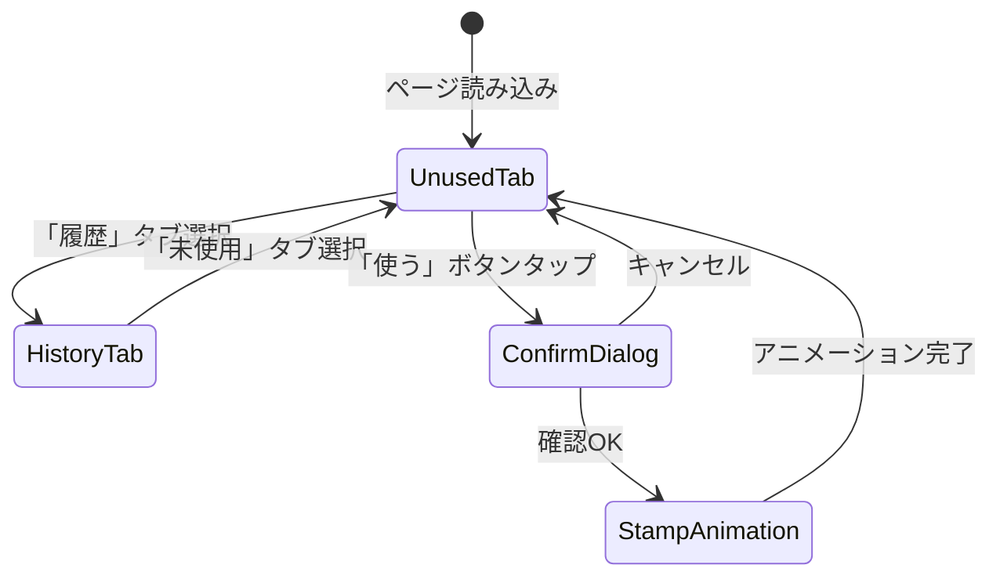

# 設計書: あそびチケット (Play Ticket)

## 概要

あそびチケットは、紙の「あそびチケット」をデジタル化し、既存のお小遣い管理PWAに組み込む機能である。管理者（つじ）がチケットを発行し、子供たち（かいせい、はるちか、いろは）がチケットを使用して遊びの予約を行う。

チケットは紙のデザインを忠実に再現したCSS/HTMLで表示され、使用済みチケットには赤い半透明の「つかったよ」スタンプがオーバーレイされる。

### 設計方針

- **単一ページ・タブ切り替え構成**: `pages/ticket.html` 内で「未使用」「履歴」タブを切り替え
- **既存パターン踏襲**: Supabase CDN + common.js読み込み、インラインCSS/JS
- **管理者発行UI**: `pages/admin.html` に新セクションとして追加
- **チケットビジュアル**: CSS/HTMLのみで紙のチケットデザインを再現（画像不使用）
- **状態遷移の原子性**: `UPDATE ... WHERE status='unused'` による楽観的排他制御
- **認可方針**: deviceRoleによるUI制御のみ（既存アプリと同じ方針）。ticketsテーブルはRLS無効（既存パターンに合わせる。全許可RLSは実質意味がないため）

## アーキテクチャ

### ページ構成

```
pages/ticket.html   （チケット一覧・使用・履歴画面）
pages/admin.html    （既存管理者ページにチケット発行セクション追加）
```

### ビュー構成（ticket.html内）



| ビュー | 説明 |
|--------|------|
| 未使用タブ | 未使用チケットをカード形式で一覧表示。Owner向けは自分のチケットのみ、Admin向けはOwner別に表示 |
| 履歴タブ | 使用済みチケットを使用日時降順で一覧表示 |
| 確認ダイアログ | 「このチケットを使いますか？」モーダル |
| スタンプ演出 | 使用確定後にスタンプが押されるアニメーション |

### 管理者発行UI（admin.html内）

既存の管理者ページに「🎫 チケット発行」セクションを追加:
- Owner選択（かいせい / はるちか / いろは）
- 遊び時間（分）入力（5〜480）
- 枚数入力（1〜100）
- 発行ボタン

### ナビゲーション

- index.html のアカウントカード横、または child.html から `pages/ticket.html?owner=かいせい` でアクセス
- ticket.html の `←` ボタン: `if (history.length > 1) history.back(); else location.href = '../index.html';`（直接URL流入時の安全対策）
- `🏠` でindex.htmlに直帰

## コンポーネントとインターフェース

### 1. アプリ初期化 (initTicketPage)

```javascript
const VALID_OWNERS = ['かいせい', 'はるちか', 'いろは'];

async function initTicketPage() {
  // オフラインチェック
  if (!navigator.onLine) {
    document.body.classList.add('offline');
    // キャッシュからチケット表示
    unusedTickets = JSON.parse(localStorage.getItem('ticketCache_unused') || '[]');
    usedTickets = JSON.parse(localStorage.getItem('ticketCache_used') || '[]');
    renderCurrentTab();
    disableAllTicketActions();
    showError('オフラインです');
    return;
  }

  resolveOwner();       // localStorageからOwner解決（バリデーション含む）
  if (!isAdmin && !currentOwner) {
    return;
  }
  await loadTickets();  // Supabaseからチケット取得
  renderCurrentTab();   // 現在のタブを描画
}

function resolveOwner() {
  // URLパラメータ or localStorage "selectedChild" から解決
  const params = new URLSearchParams(location.search);
  const paramOwner = params.get('owner');
  const storedOwner = localStorage.getItem('selectedChild');
  
  // Admin以外はURLパラメータとlocalStorageの一致を検証（URL直打ち対策）
  if (!isAdmin && paramOwner && paramOwner !== storedOwner) {
    showError('権限がありません');
    return false;
  }
  currentOwner = paramOwner || storedOwner;
  
  // Owner名バリデーション（URL改ざん対策）
  if (!isAdmin && !VALID_OWNERS.includes(currentOwner)) {
    currentOwner = null;
    showError('所有者が不正です');
    return false;
  }
  return true;
}

// オフライン時: 使用・発行ボタンを無効化
// 注: use-btnは描画時にdisabled属性を付与（renderTicketCard内）。
// issueBtnはDOMContentLoaded後にdisable。
function disableAllTicketActions() {
  document.querySelectorAll('.use-btn, #issueBtn').forEach(b => b.disabled = true);
}

// onLine復帰時に再有効化
window.addEventListener('online', () => {
  document.body.classList.remove('offline');
  document.querySelectorAll('.use-btn, #issueBtn').forEach(b => b.disabled = false);
  loadTickets().then(renderCurrentTab);
});

// offline時にダイアログが開いていたら閉じる
window.addEventListener('offline', () => {
  document.body.classList.add('offline');
  cancelUse();
  disableAllTicketActions();
  showError('オフラインです');
});
```

### 2. チケット取得 (loadTickets)

```javascript
let unusedTickets = [];
let usedTickets = [];

async function loadTickets() {
  shownLoadError = false; // リセット
  await Promise.all([loadUnusedTickets(), loadUsedTickets()]);
  // オフラインキャッシュ保存（成功時のみ）
  if (unusedTickets.length > 0 || usedTickets.length > 0) {
    localStorage.setItem('ticketCache_unused', JSON.stringify(unusedTickets));
    localStorage.setItem('ticketCache_used', JSON.stringify(usedTickets));
  }
}

async function loadUnusedTickets() {
  let query = client.from('tickets').select('*').eq('status', 'unused');
  if (!isAdmin) {
    query = query.eq('owner', currentOwner).order('ticket_no', { ascending: true });
  } else {
    query = query.order('owner').order('ticket_no', { ascending: true });
  }
  
  const { data, error } = await query;
  if (error) { showLoadErrorOnce(); return; }
  unusedTickets = data || [];
}

async function loadUsedTickets() {
  let query = client.from('tickets').select('*').eq('status', 'used');
  if (!isAdmin) query = query.eq('owner', currentOwner);
  query = query.order('used_at', { ascending: false });
  
  const { data, error } = await query;
  if (error) { showLoadErrorOnce(); return; }
  usedTickets = data || [];
}

// エラー重複表示防止
let shownLoadError = false;
function showLoadErrorOnce() {
  if (shownLoadError) return;
  shownLoadError = true;
  showError('データの取得に失敗しました');
}
```

### 3. タブ切り替え (switchTab)

```javascript
let currentTab = 'unused'; // 'unused' | 'history'

function switchTab(tab) {
  currentTab = tab;
  document.querySelectorAll('.tab-btn').forEach(b => b.classList.remove('active'));
  document.querySelector(`[data-tab="${tab}"]`).classList.add('active');
  renderCurrentTab();
}

function renderCurrentTab() {
  if (currentTab === 'unused') renderUnusedTickets();
  else renderHistory();
}
```

### 4. 未使用チケット描画 (renderUnusedTickets)

```javascript
function renderUnusedTickets() {
  const container = document.getElementById('ticketList');
  
  if (isAdmin) {
    // Admin: Owner別にグループ表示
    const grouped = groupByOwner(unusedTickets);
    container.innerHTML = Object.entries(grouped)
      .map(([owner, tix]) => renderOwnerGroup(owner, tix)).join('');
  } else {
    // Owner: 残数表示 + チケット一覧
    container.innerHTML = `
      <div class="ticket-count">のこり <strong>${unusedTickets.length}</strong> まい</div>
      ${unusedTickets.map(t => renderTicketCard(t)).join('')}
    `;
  }
}

// Owner別にグループ化
function groupByOwner(tickets) {
  return tickets.reduce((acc, t) => {
    (acc[t.owner] = acc[t.owner] || []).push(t);
    return acc;
  }, {});
}

// Owner別グループ描画
function renderOwnerGroup(owner, tickets) {
  return `
    <div class="owner-group">
      <h3 class="owner-group-title">${esc(owner)}（${tickets.length}枚）</h3>
      ${tickets.map(t => renderTicketCard(t)).join('')}
    </div>
  `;
}
```

### 5. チケットカード描画 (renderTicketCard)

```javascript
function renderTicketCard(ticket) {
  const isUsed = ticket.status === 'used';
  return `
    <div class="ticket-card ${isUsed ? 'used' : ''}" data-ticket-id="${ticket.id}">
      <div class="ticket-body">
        <div class="ticket-gold-line"></div>
        <div class="ticket-content">
          <div class="ticket-header">
            <div class="ticket-title-en">PLAY WITH TSUJI !!</div>
            <div class="ticket-title-ja">あそびチケット</div>
            <div class="ticket-no">No.${String(ticket.ticket_no)}</div>
          </div>
          <div class="ticket-desc">このチケットを使うとつじはどんなあそびにも付き合います</div>
          <div class="ticket-rules">
            <div class="rule">・時間中は券を使った人が最優先されます</div>
            <div class="rule">・この券は連続で使用できます</div>
            <div class="rule">・この券は予約性です</div>
            <div class="rule">・予約は先着順です</div>
            <div class="rule">・ご飯の時間になるとつじはご飯をたべます</div>
          </div>
          <div class="ticket-duration">${esc(String(ticket.duration_minutes))}分</div>
          <div class="ticket-meta">
            <span class="ticket-owner">${esc(ticket.owner)}</span>
            <span class="ticket-issuer">発行: TSUJI</span>
            <span class="ticket-expiry">有効期限: ∞</span>
          </div>
          <div class="ticket-icons">📖 ⚽ 🪁 🎮</div>
        </div>
      </div>
      ${isUsed ? '<div class="stamp-overlay">つかったよ</div>' : ''}
      ${!isUsed && !isAdmin ? `<button class="use-btn" ${!navigator.onLine ? 'disabled' : ''} onclick="confirmUse('${ticket.id}')">使う</button>` : ''}
    </div>
  `;
}

// XSSエスケープ（DB値が壊れた場合の防御）
function esc(s) {
  return String(s).replaceAll('&','&amp;').replaceAll('<','&lt;').replaceAll('>','&gt;').replaceAll('"','&quot;');
}
```

### 6. チケット使用確認 (confirmUse)

```javascript
let pendingTicketId = null;

function confirmUse(ticketId) {
  if (pendingTicketId) return; // 多重押し防止
  pendingTicketId = ticketId;
  document.getElementById('confirmOverlay').classList.add('active');
}

function cancelUse() {
  pendingTicketId = null;
  document.getElementById('confirmOverlay').classList.remove('active');
}
```

### 7. チケット使用実行 (executeUse)

```javascript
async function executeUse() {
  if (!pendingTicketId) return;
  
  const btn = document.querySelector('.confirm-ok-btn');
  btn.disabled = true;
  
  try {
    // 原子的更新: status='unused' の条件付きUPDATE
    const { data, error } = await client
      .from('tickets')
      .update({ status: 'used', used_at: new Date().toISOString() })
      .eq('id', pendingTicketId)
      .eq('status', 'unused')
      .select();
    
    if (error || !data || data.length === 0) {
      // エラーと「既に使用済み」を区別
      if (error) {
        showError('チケットの使用に失敗しました');
      } else {
        showError('このチケットは既に使われています');
        await loadTickets();
        renderCurrentTab();
      }
      cancelUse();
      return;
    }
    
    // pendingTicketIdを退避してからcancelUse()（cancelUseでnullになるため）
    const ticketId = pendingTicketId;
    cancelUse();
    
    // スタンプ演出（アニメーション完了を待ってから再描画）
    showStampAnimation(ticketId);
    await new Promise(r => setTimeout(r, 600));
    
    // Discord通知（非同期fire-and-forget。失敗してもUXを止めない）
    const ticket = data[0];
    notifyWithTimeout(`🎫 ${ticket.owner}がチケットNo.${String(ticket.ticket_no)}を使いました！（${ticket.duration_minutes}分）`)
      .catch(() => console.warn('Discord通知失敗'));
    
    // 一覧を再描画
    await loadTickets();
    renderCurrentTab();
  } finally {
    btn.disabled = false;
  }
}
```

### 8. スタンプ演出 (showStampAnimation)

```javascript
function showStampAnimation(ticketId) {
  const card = document.querySelector(`[data-ticket-id="${ticketId}"]`);
  if (!card) return;
  
  const stamp = document.createElement('div');
  stamp.className = 'stamp-overlay stamp-animate';
  stamp.textContent = 'つかったよ';
  // カード全体に被せる（ticket-bodyではなくcard直下）
  card.appendChild(stamp);
  
  // アニメーション: 大きく表示→縮小して定位置に
  setTimeout(() => stamp.classList.add('stamp-done'), 500);
}
```

### 9. 履歴描画 (renderHistory)

```javascript
function renderHistory() {
  const container = document.getElementById('ticketList');
  
  if (usedTickets.length === 0) {
    container.innerHTML = '<div class="empty-msg">まだ使ったチケットはありません</div>';
    return;
  }
  
  container.innerHTML = usedTickets.map(t => {
    const date = new Date(t.used_at);
    const dateStr = `${date.getMonth()+1}/${date.getDate()} ${date.getHours()}:${String(date.getMinutes()).padStart(2,'0')}`;
    // 表示はクライアント端末のローカルタイムゾーン（JST想定）
    return `
      <div class="history-item">
        ${renderTicketCard(t)}
        <div class="used-date">使用: ${dateStr}</div>
      </div>
    `;
  }).join('');
}
```

### 10. チケット発行 (admin.html内: issueTickets)

```javascript
async function issueTickets() {
  // Admin権限ガード（JS直叩き対策）
  if (localStorage.getItem('deviceRole') !== 'admin') {
    showTicketError('権限がありません');
    return;
  }

  const owner = document.getElementById('ticketOwner').value;
  const duration = parseInt(document.getElementById('ticketDuration').value, 10);
  const quantity = parseInt(document.getElementById('ticketQuantity').value, 10);
  
  // バリデーション
  if (!owner) { showTicketError('所有者を選択してください'); return; }
  if (!duration || duration < 5 || duration > 480) { showTicketError('時間は5〜480分で入力してください'); return; }
  if (!quantity || quantity < 1 || quantity > 100) { showTicketError('枚数は1〜100で入力してください'); return; }
  
  const btn = document.querySelector('#issueBtn');
  btn.disabled = true;
  
  try {
    // 一括挿入（Supabaseのinsertは配列対応）
    // 注: Supabase insert(rows) は単一リクエストで送信される。
    // 厳密なall-or-nothing保証が必要な場合はRPC化を検討。
    // 現状はDB制約（CHECK, UNIQUE）で不正データを防止。
    const rows = Array.from({ length: quantity }, () => ({
      owner,
      duration_minutes: duration,
      status: 'unused'
    }));
    
    const { data, error } = await client.from('tickets').insert(rows).select();
    
    if (error) {
      showTicketError('発行に失敗しました: ' + error.message);
      return;
    }
    
    // Discord通知
    notifyWithTimeout(`🎫 ${owner}にチケットを${quantity}枚発行しました（${duration}分）`)
      .catch(() => {});
    
    // 成功メッセージ
    const msg = document.getElementById('ticketIssueMsg');
    msg.style.display = 'block';
    msg.textContent = `✓ ${owner}に${quantity}枚発行しました`;
    setTimeout(() => msg.style.display = 'none', 3000);
  } finally {
    btn.disabled = false;
  }
}
```

## データモデル

### Supabaseテーブル: tickets

要件ドキュメントのDatabase Schemaをそのまま使用:

```sql
CREATE SEQUENCE tickets_ticket_no_seq;

CREATE TABLE tickets (
  id UUID DEFAULT gen_random_uuid() PRIMARY KEY,
  ticket_no BIGINT UNIQUE DEFAULT nextval('tickets_ticket_no_seq'),
  owner TEXT NOT NULL CHECK (owner IN ('かいせい','はるちか','いろは')),
  duration_minutes INT NOT NULL CHECK (duration_minutes BETWEEN 5 AND 480),
  status TEXT NOT NULL DEFAULT 'unused' CHECK (status IN ('unused','used')),
  created_at TIMESTAMPTZ NOT NULL DEFAULT now(),
  used_at TIMESTAMPTZ
);

-- used_at と status の整合性制約
ALTER TABLE tickets ADD CONSTRAINT chk_used_ticket_consistency CHECK (
  (status = 'unused' AND used_at IS NULL)
  OR
  (status = 'used' AND used_at IS NOT NULL)
);

-- sequence ownership（table drop時に追従）
ALTER SEQUENCE tickets_ticket_no_seq OWNED BY tickets.ticket_no;

-- パフォーマンス用インデックス
CREATE INDEX idx_tickets_owner_status ON tickets(owner, status);
CREATE INDEX idx_tickets_used_at ON tickets(used_at DESC);
CREATE INDEX idx_tickets_status_ticket_no ON tickets(status, ticket_no);
```

> **RLSポリシー:**
> ```sql
> -- RLSは無効（既存方針に合わせる。deviceRole制御のみで統一）
> ALTER TABLE tickets DISABLE ROW LEVEL SECURITY;
> ```

> **ticket_no欠番について:** sequenceを使用するため、INSERT失敗（rollback）時に欠番が発生する。これは仕様として許容する（連番の連続性は保証しない）。

### localStorage使用

| キー | 用途 | 永続性 |
|------|------|--------|
| `selectedChild` | 現在選択中のOwner名（既存） | 永続 |
| `deviceRole` | 端末権限（既存） | 永続 |
| `ticketCache_unused` | オフライン表示用キャッシュ（未使用チケット） | 永続 |
| `ticketCache_used` | オフライン表示用キャッシュ（使用済みチケット） | 永続 |

### クエリパターン

| 操作 | クエリ |
|------|--------|
| 未使用チケット取得（Owner） | `SELECT * FROM tickets WHERE owner=? AND status='unused' ORDER BY ticket_no ASC` |
| 未使用チケット取得（Admin） | `SELECT * FROM tickets WHERE status='unused' ORDER BY owner, ticket_no ASC` |
| 使用済みチケット取得（Owner） | `SELECT * FROM tickets WHERE owner=? AND status='used' ORDER BY used_at DESC` |
| 使用済みチケット取得（Admin） | `SELECT * FROM tickets WHERE status='used' ORDER BY used_at DESC` |
| チケット使用 | `UPDATE tickets SET status='used', used_at=now() WHERE id=? AND status='unused'` |
| チケット発行 | `INSERT INTO tickets (owner, duration_minutes) VALUES ...` (複数行) |

## チケットビジュアルデザイン

### CSS設計

チケットは紙のデザインを忠実にCSS/HTMLで再現する。画像は使用しない。

```css
.ticket-card {
  position: relative;
  background: linear-gradient(135deg, #fdf6e3 0%, #f5e6c8 100%);
  border-radius: 12px;
  padding: 20px 24px 20px 20px;
  margin-bottom: 16px;
  box-shadow: 0 3px 12px rgba(0,0,0,0.1);
  border: 1px solid #e8d5a3;
  overflow: hidden;
}

.ticket-gold-line {
  position: absolute;
  top: 0; right: 0;
  width: 8px; height: 100%;
  background: linear-gradient(to bottom, #d4a017, #b8860b, #d4a017);
}

.ticket-title-en {
  font-size: 1.1em;
  font-weight: 700;
  color: #5a3e1b;
  letter-spacing: 1px;
}

.ticket-title-ja {
  font-size: 1.4em;
  font-weight: 800;
  color: #3d2b0f;
  margin-bottom: 8px;
}

.ticket-no {
  position: absolute;
  top: 12px; right: 20px;
  font-size: 0.8em;
  color: #8b7355;
  font-weight: 600;
}

.ticket-desc {
  font-size: 0.85em;
  color: #5a4a2f;
  margin-bottom: 10px;
  line-height: 1.4;
}

.ticket-rules {
  font-size: 0.75em;
  color: #6b5b3f;
  margin-bottom: 12px;
  line-height: 1.6;
}

.ticket-duration {
  font-size: 1.8em;
  font-weight: 800;
  color: #c0392b;
  text-align: center;
  margin: 8px 0;
}

.ticket-meta {
  display: flex;
  justify-content: space-between;
  font-size: 0.75em;
  color: #7a6b4f;
  margin-top: 8px;
}

.ticket-icons {
  text-align: center;
  font-size: 1.4em;
  margin-top: 10px;
  letter-spacing: 8px;
}
```

### スタンプ（電子印）デザイン

```css
.stamp-overlay {
  position: absolute;
  top: 50%; left: 50%;
  transform: translate(-50%, -50%) rotate(-15deg);
  font-size: 2.2em;
  font-weight: 900;
  color: rgba(220, 50, 50, 0.6);
  border: 4px solid rgba(220, 50, 50, 0.6);
  border-radius: 12px;
  padding: 8px 20px;
  pointer-events: none;
  white-space: nowrap;
}

/* スタンプ押下アニメーション */
.stamp-animate {
  animation: stampPress 0.5s cubic-bezier(0.25, 0.46, 0.45, 0.94) forwards;
}

@keyframes stampPress {
  0% { transform: translate(-50%, -50%) rotate(-15deg) scale(3); opacity: 0; }
  60% { transform: translate(-50%, -50%) rotate(-15deg) scale(0.9); opacity: 0.8; }
  100% { transform: translate(-50%, -50%) rotate(-15deg) scale(1); opacity: 1; }
}
```

### 使用ボタン

```css
.use-btn {
  display: block;
  width: 100%;
  margin-top: 12px;
  padding: 12px;
  background: #4caf50;
  color: #fff;
  border: none;
  border-radius: 8px;
  font-size: 1.1em;
  font-weight: 700;
  cursor: pointer;
}

.use-btn:disabled {
  background: #ccc;
  cursor: not-allowed;
}

.use-btn:hover:not(:disabled) {
  opacity: 0.9;
}
```

## Discord通知フォーマット

| イベント | メッセージ |
|----------|-----------|
| チケット使用 | `🎫 {owner}がチケットNo.{ticket_no}を使いました！（{duration}分）` |
| チケット発行 | `🎫 {owner}にチケットを{quantity}枚発行しました（{duration}分）` |

通知先: `js/common.js` の `DISCORD_WEBHOOK` 定数（既存）を使用。`notifyDiscord()` 関数で送信。

### 通知タイムアウト

Webhookが遅い場合にUXを止めないよう、3秒タイムアウトを設ける:

```javascript
function notifyWithTimeout(msg) {
  return Promise.race([
    notifyDiscord(msg),
    new Promise((_, reject) => setTimeout(() => reject('timeout'), 3000))
  ]).catch(() => console.warn('Discord通知失敗/タイムアウト'));
}
```


## 正しさの性質 (Correctness Properties)

*性質（プロパティ）とは、システムのすべての有効な実行において真であるべき特性や振る舞いのことである。人間が読める仕様と機械で検証可能な正しさの保証をつなぐ橋渡しとなる。*

### Property 1: チケットフィルタリングの正確性

*任意の*チケット配列とOwner名に対して、未使用チケットフィルタの結果に含まれるすべてのチケットは `status='unused'` かつ指定されたOwnerに属していなければならず、条件を満たすチケットが漏れてはならない。

**Validates: Requirements 1.2, 1.3, 4.1, 4.4**

### Property 2: ソート順の正確性

*任意の*チケット配列に対して、未使用チケット一覧は `ticket_no` 昇順でソートされ、使用済み履歴は `used_at` 降順でソートされなければならない。

**Validates: Requirements 1.5, 4.3**

### Property 3: チケット描画に動的データが含まれる

*任意の*有効なチケットデータに対して、renderTicketCard関数の出力には `duration_minutes`（"〇〇分"形式）、`owner`名、`ticket_no` が含まれなければならない。

**Validates: Requirements 2.4, 2.5, 2.7, 5.3**

### Property 4: スタンプ表示とステータスの一致

*任意の*チケットに対して、renderTicketCard関数の出力にスタンプオーバーレイ（"つかったよ"）が含まれるのは `status='used'` の場合に限り、`status='unused'` の場合はスタンプが含まれてはならない。

**Validates: Requirements 2.8, 3.4**

### Property 5: 状態遷移の不変条件

*任意の*チケットに対して、使用操作が成功するのは現在の `status='unused'` の場合に限る。`status='used'` のチケットへの使用操作は必ず失敗し、状態は変更されてはならない。使用成功後は `used_at` が非nullのタイムスタンプでなければならない。

**Validates: Requirements 3.3, 3.7, 6.4, 8.1, 8.2**

### Property 6: 遊び時間バリデーション

*任意の*整数値に対して、チケット発行が成功するのは `duration_minutes` が 5以上480以下の場合に限る。範囲外の値では発行が拒否されなければならない。

**Validates: Requirements 5.2**

### Property 7: Owner名バリデーション

*任意の*文字列に対して、チケット発行が成功するのは Owner が "かいせい"、"はるちか"、"いろは" のいずれかの場合に限る。それ以外の値では発行が拒否されなければならない。

**Validates: Requirements 6.3**

### Property 8: 発行枚数バリデーション

*任意の*整数値に対して、一括発行が成功するのは枚数が 1以上100以下の場合に限る。範囲外の値では発行が拒否されなければならない。

**Validates: Requirements 6.6**

### Property 9: オフライン時操作禁止

*任意の*オフライン状態において、使用ボタン（use-btn）と発行ボタン（issueBtn）は `disabled` でなければならず、チケット使用・発行操作は実行されてはならない。

**Validates: Requirements 7.4**

| エラー状況 | 対応 | UI表示 |
|-----------|------|--------|
| Supabase接続失敗 | チケット一覧を空表示 | 「データの取得に失敗しました」メッセージ |
| チケット使用失敗（DB更新エラー） | チケットを未使用状態のまま維持 | 「チケットの使用に失敗しました」メッセージ |
| チケット使用失敗（既に使用済み） | 一覧を再読み込み | 「このチケットは既に使われています」メッセージ |
| 発行バリデーションエラー | 発行を阻止 | 具体的なバリデーションエラーメッセージ（alert） |
| 発行DB挿入失敗 | 発行を阻止 | 「発行に失敗しました」メッセージ |
| Discord通知失敗 | チケット操作は正常完了 | ログ出力のみ（ユーザーには非表示） |
| オフライン時 | キャッシュからチケット表示、使用/発行ボタン無効化 | 「オフラインです」メッセージ |

### エラー表示パターン

```javascript
// ticket.html用
function showError(msg) {
  const el = document.getElementById('errorMsg');
  el.textContent = msg;
  el.style.display = 'block';
  setTimeout(() => el.style.display = 'none', 5000);
}

// admin.html チケット発行セクション用（toast形式、alertは使わない）
function showTicketError(msg) {
  const el = document.getElementById('ticketErrorMsg');
  el.textContent = msg;
  el.style.display = 'block';
  el.style.color = '#e53935';
  setTimeout(() => el.style.display = 'none', 5000);
}
```

## テスト戦略

### プロパティベーステスト

ライブラリ: **fast-check** (JavaScript用PBTライブラリ)

各プロパティテストは最低100回のイテレーションで実行する。

テストタグ形式: `Feature: play-ticket, Property {number}: {property_text}`

対象プロパティ:
- Property 1: チケットフィルタリング（filterTickets関数）
- Property 2: ソート順（sortUnused / sortHistory関数）
- Property 3: チケット描画の動的データ含有（renderTicketCard関数）
- Property 4: スタンプ表示とステータスの一致（renderTicketCard関数）
- Property 5: 状態遷移の不変条件（executeUse関数、モック使用）
- Property 6: 遊び時間バリデーション（validateDuration関数）
- Property 7: Owner名バリデーション（validateOwner関数）
- Property 8: 発行枚数バリデーション（validateQuantity関数）
- Property 9: オフライン時操作禁止（ボタンdisabled状態）

### ユニットテスト（example-based）

- チケットカードに静的テキスト（タイトル、ルール、発行者）が含まれること
- 確認ダイアログの表示/非表示
- ボタンのdisabled状態管理
- Discord通知失敗時にチケット更新が完了すること
- Admin/User表示切り替え（deviceRole依存）
- resolveOwner()のURLパラメータ/localStorage優先順位

### 統合テスト

- Supabaseへのチケット挿入・取得
- 原子的UPDATE（status='unused'条件付き）の動作確認
- 一括発行のトランザクション性
- ticket_noシーケンスの一意性
- race condition: 同一チケットへの同時use（1件成功、1件失敗）
- offline → online recovery: disable → 再取得・再有効化
- XSS: ownerに`<script>alert(1)</script>`を入れて描画されないこと

### テスト実行

```bash
npx vitest --run tests/play-ticket/
```

テストファイル構成:
```
tests/play-ticket/
├── filter-sort.property.test.js   # Property 1, 2
├── render.property.test.js        # Property 3, 4
├── state.property.test.js         # Property 5
├── validation.property.test.js    # Property 6, 7, 8
└── ticket.test.js                 # ユニットテスト（example-based）
```

### テスト用ジェネレータ（fast-check）

```javascript
// チケットデータのジェネレータ（DB制約 chk_used_ticket_consistency に準拠）
const unusedTicketGen = fc.record({
  id: fc.uuid(),
  ticket_no: fc.integer({ min: 1, max: 10000 }),
  owner: fc.constantFrom('かいせい', 'はるちか', 'いろは'),
  duration_minutes: fc.integer({ min: 5, max: 480 }),
  status: fc.constant('unused'),
  created_at: fc.date().map(d => d.toISOString()),
  used_at: fc.constant(null)
});

const usedTicketGen = fc.record({
  id: fc.uuid(),
  ticket_no: fc.integer({ min: 1, max: 10000 }),
  owner: fc.constantFrom('かいせい', 'はるちか', 'いろは'),
  duration_minutes: fc.integer({ min: 5, max: 480 }),
  status: fc.constant('used'),
  created_at: fc.date().map(d => d.toISOString()),
  used_at: fc.date().map(d => d.toISOString())
});

const ticketGen = fc.oneof(unusedTicketGen, usedTicketGen);

// 有効なチケット配列のジェネレータ
const ticketArrayGen = fc.array(ticketGen, { minLength: 0, maxLength: 50 });
```
