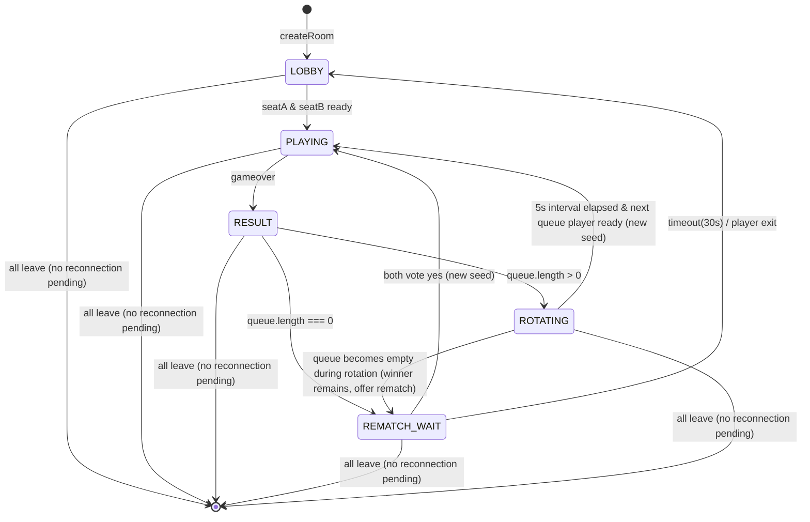
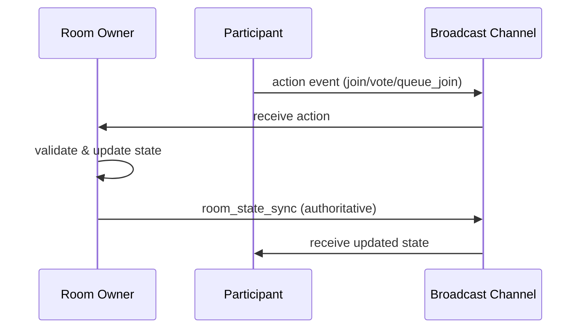

# Design Document: puyo-battle-multiplayer

## Overview

ぴくぴく対戦（puyo-battle.html）を2人限定の対戦から、最大6人が同時接続可能なマルチプレイヤールームに拡張する。再戦機能、勝ち残り方式、観戦/順番待ち選択、観戦のみ制限、再接続、オーナーシップ移譲を実装する。

現在の実装は単一HTMLファイル（pages/puyo-battle.html）内にすべてのロジックが含まれ、Supabase Realtime Broadcastでチャンネルベースの通信を行っている。この構造を維持しつつ、ルーム状態管理を拡張する。

### Design Decisions

1. **単一HTMLファイル維持**: 既存アーキテクチャに合わせ、puyo-battle.html内にすべてのロジックを追加する
2. **クライアントサイド状態管理**: Supabase Realtime Broadcastはサーバーレスのため、ルームオーナーのクライアントが状態管理の権威（authority）を持つ
3. **DB最小利用**: puyo_battlesテーブルはルーム検索・永続化のみに使用し、リアルタイム状態はBroadcastで管理
4. **オーナー権威モデル**: 状態遷移の決定権はRoom_Ownerが持ち、競合を防止する
5. **Immutable Client ID**: 各参加者はUUID（`crypto.randomUUID()`）で識別する。表示名（name）は表示用のみ。ownerIdやseat管理はすべてclientIdベース。clientIdはlocalStorageに永続化し、リロード時も同一IDを維持する（`localStorage.getItem('puyo_client_id') || crypto.randomUUID()`）
6. **Server-generated timestamps**: すべての順序付けはOwnerのmonotonic counter（joinCounter, queueCounter）で生成する。クライアントのDate.now()は使用しない（clock skew防止）。counterはroomState内に保持し、owner移譲後も引き継がれる
7. **Owner Heartbeat**: Ownerは5秒ごとにheartbeatをbroadcast。15秒間heartbeatが途絶えた場合、最古参がownership transferを実行する

## Architecture

### State Machine



Note: CLOSED is a conceptual terminal state (channel destroyed). Not tracked as an explicit runtime state — when all participants leave with no pending reconnection timers, the channel is simply unsubscribed and the DB row marked 'finished'.

### Authority Model

Room_Owner（ルーム作成者、移譲後は最古参）がルーム状態の権威を持つ:
- 状態遷移の決定・ブロードキャスト
- Queue順序の管理
- 再接続タイマーの管理
- 勝ち残りローテーションの実行

他の参加者はイベントを送信し、Ownerが検証・反映・ブロードキャストする。

**Security**: Clients SHALL ignore `room_state_sync` not sent by current ownerId. 不正なクライアントからの状態同期は無視する。

### Owner Heartbeat

Owner SHALL broadcast `heartbeat` event every 5 seconds with a monotonically increasing sequence number. If any participant misses 3 consecutive heartbeats (sequence gap ≥ 3), the oldest remaining participant (by joinOrder) SHALL initiate ownership transfer via `ownership_claim` event. This prevents SPOF (Single Point of Failure) when the owner's tab freezes.

Sequence-based detection is preferred over wall-clock timeout because browser background throttling (especially Chrome mobile) can delay timers, causing false positives with time-based checks.

#### Ownership Claim Protocol (race prevention)

Multiple clients may detect heartbeat timeout simultaneously. To prevent race conditions:

1. Heartbeat timeout detected → candidate checks if they are the oldest participant (lowest joinOrder)
2. If yes → broadcast `ownership_claim { candidateId, joinOrder, nextEpoch }`
3. Other participants receiving `ownership_claim`:
   - Compare joinOrder: lowest joinOrder wins
   - If tie (should not happen with monotonic counter): lexicographically smaller clientId wins
   - If candidateId is the deterministic winner → accept, stop own claim attempt
   - Otherwise → ignore (wrong candidate)
4. Claim winner broadcasts `ownership_transfer { newOwnerId, epoch }` and begins broadcasting `room_state_sync`
5. New owner inherits full roomState including joinCounter, queueCounter, and all timers

```javascript
// Owner side — heartbeat with sequence number
let heartbeatSeq = 0;
const HEARTBEAT_INTERVAL = 5000;
setInterval(() => {
  heartbeatSeq++;
  channel.send({ type: 'broadcast', event: 'heartbeat', payload: { ownerId: myClientId, stateId, seq: heartbeatSeq } });
}, HEARTBEAT_INTERVAL);

// All participants — sequence-based miss detection with jitter
let lastReceivedSeq = 0;
let missCount = 0;
function scheduleHeartbeatCheck() {
  const jitter = 4000 + Math.random() * 2000; // 4-6s to prevent thundering herd
  setTimeout(() => {
    // Check if we received a new heartbeat since last check
    if (lastReceivedSeq === lastCheckedSeq) {
      missCount++;
    } else {
      missCount = 0;
      lastCheckedSeq = lastReceivedSeq;
    }
    if (missCount >= 3 && !isOwner) {
      if (amIOldestParticipant()) {
        channel.send({ type: 'broadcast', event: 'ownership_claim', payload: {
          candidateId: myClientId, joinOrder: myJoinOrder, nextEpoch: stateId.epoch + 1
        }});
      }
    }
    scheduleHeartbeatCheck();
  }, jitter);
}
let lastCheckedSeq = 0;
scheduleHeartbeatCheck();
```

### Communication Flow



## Components and Interfaces

### 0. Owner Command Validation

Owner SHALL validate all incoming action events before applying them:

```javascript
function validateAction(event, payload, senderClientId) {
  // CRITICAL: verify sender identity matches payload.clientId
  // Supabase Broadcast includes sender info — use it to prevent spoofing
  if (payload.clientId !== senderClientId) return false; // spoof rejected

  switch (event) {
    case 'rematch_vote':
      // Only active players (seatA/seatB) can vote, and battleId must match
      if (!isActivePlayer(payload.clientId)) return false;
      if (payload.battleId !== roomState.battleId) return false; // stale vote
      break;
    case 'role_choice':
    case 'role_switch':
      // Only spectators/queue players can switch roles
      if (isActivePlayer(payload.clientId)) return false;
      break;
    case 'garbage':
    case 'state':
      // Only active players can send game state
      if (!isActivePlayer(payload.clientId)) return false;
      break;
  }
  return true;
}
```

**Sender Identity**: Supabase Realtime Broadcast does not natively provide verified sender identity. To mitigate spoofing, each participant generates a `reconnectToken` (crypto.randomUUID()) on join, stored in sessionStorage (survives reload, does not survive browser close). The owner stores each participant's token. Reconnection requires both `clientId` AND `reconnectToken` to match.

```javascript
// On join — reconnectToken persisted in sessionStorage
const reconnectToken = sessionStorage.getItem('puyo_reconnect_token') || (() => {
  const t = crypto.randomUUID();
  sessionStorage.setItem('puyo_reconnect_token', t);
  return t;
})();
// Sent in player_join payload: { clientId, name, reconnectToken }
// Owner stores: participants.set(clientId, { name, joinOrder, reconnectToken })
// On reconnect: must provide matching reconnectToken
```

Invalid events are silently dropped.

### 1. RoomStateManager

ルーム全体の状態を管理するモジュール。

```javascript
const RoomStateManager = {
  state: 'LOBBY', // LOBBY|PLAYING|RESULT|REMATCH_WAIT|ROTATING
  seatA: null,    // { clientId, name, joinOrder, wins }
  seatB: null,    // { clientId, name, joinOrder, wins }
  spectators: [], // [{ clientId, name, joinOrder }]
  queue: [],      // [{ clientId, name, joinOrder, queueOrder }] FIFO by queueOrder
  rematchVotes: { seatA: false, seatB: false },
  battleId: 0, // monotonic, increments each new battle. Votes with stale battleId are rejected
  spectatorOnly: false,
  ownerId: null,  // owner's clientId (immutable UUID)
  stateId: { epoch: 0, version: 0 }, // epoch increments on owner change
  joinCounter: 0, // monotonic counter for join ordering (persisted in roomState, survives owner transfer)
  queueCounter: 0, // monotonic counter for queue ordering (persisted in roomState, survives owner transfer)

  // State transitions
  transition(newState) {},
  canTransition(from, to) {},

  // Seat management
  assignSeat(clientId, seat) {},
  vacateSeat(seat) {},

  // Queue management
  enqueue(clientId) {},
  dequeue() {},
  removeFromQueue(clientId) {},

  // Rotation (winner-stays)
  rotate(winnerClientId, loserClientId) {},
};
```

### 2. Broadcast Event Protocol

#### New Events (追加)

| Event | Direction | Payload | Description |
|-------|-----------|---------|-------------|
| `room_state_sync` | Owner→All | Full room state + stateId | 権威的状態同期（ownerId検証必須） |
| `player_join` | Player→Owner | `{ clientId, name, reconnectToken }` | 入室通知 |
| `player_leave` | Player→Owner | `{ clientId }` | 退室通知 |
| `role_choice` | Player→Owner | `{ clientId, role: 'spectator'\|'queue' }` | 観戦/順番待ち選択 |
| `role_switch` | Player→Owner | `{ clientId, newRole: 'spectator'\|'queue' }` | 役割変更 |
| `rematch_vote` | Player→Owner | `{ clientId, vote: bool, battleId }` | 再戦投票（battleId不一致は reject） |
| `rematch_cancel` | Player→Owner | `{ clientId }` | 再戦拒否（ロビーに戻る） |
| `rotating_ready` | Owner→All | `{ nextSeatB, countdown }` | ローテーション開始 |
| `new_battle_start` | Owner→All | `{ seed, seatA, seatB }` | 新対戦開始 |
| `disconnect_notice` | Owner→All | `{ clientId, role, timeout }` | 切断通知 |
| `reconnect_success` | Owner→All | `{ clientId, role }` | 再接続成功 |
| `ownership_transfer` | Owner→All | `{ newOwnerId, epoch, roomStateSnapshot }` | オーナー移譲（epoch increment + full state for fast recovery） |
| `ownership_claim` | Candidate→All | `{ candidateId, joinOrder, nextEpoch }` | オーナー候補宣言（tie-break: lowest joinOrder, then lexicographic clientId） |
| `win_streak` | Owner→All | `{ clientId, streak }` | 連勝数更新 |
| `heartbeat` | Owner→All | `{ ownerId, stateId, seq }` | Owner生存確認（5秒間隔、seq monotonic） |

#### Existing Events (変更なし)

| Event | Description |
|-------|-------------|
| `state` | 盤面状態送信（Active_Player間のみ） |
| `garbage` | お邪魔ぷよ送信（Active_Player間のみ） |
| `gameover` | ゲームオーバー通知 |
| `seed` | PRNGシード共有 |
| `reconnect_request` | 再接続要求 |
| `reconnect_state` | PRNG状態復元 |

### 3. UI Components

#### Lobby UI (拡張)

- 「観戦のみ」チェックボックス（ルーム作成時）
- ルーム一覧に👁アイコン（観戦のみルーム）
- 参加者数表示（例: "2/6"）

#### Role Selection UI (新規)

3人目以降の参加者に表示:
```
┌─────────────────────┐
│  このルームに参加    │
│                     │
│  [👀 観戦する]      │
│  [🎮 順番待ちする]  │  ← spectatorOnly時は非表示
│                     │
└─────────────────────┘
```

#### Spectator View (新規)

- 両プレイヤーの盤面をread-onlyで表示（既存のoppCanvas描画ロジックを流用）
- 参加者一覧パネル（名前 + 役割アイコン）
- 順番待ちリスト表示（自分の順番ハイライト）
- 「順番待ちに入る」/「順番待ちをやめる」ボタン

#### Result Overlay (拡張)

- 「もういちど」ボタン（queue空 & spectatorOnly OFF時のみ表示）
- 相手の投票状態表示（「相手の応答を待っています...」）
- 30秒タイムアウトカウントダウン
- 勝ち残り時: 「次の対戦まで 5秒...」表示

#### Participant List Panel

```
┌─────────────────────┐
│ 参加者 (4/6)        │
│ ─────────────────── │
│ 🎮 たろう (3連勝)  │ ← seatA
│ 🎮 じろう          │ ← seatB
│ 👁 さぶろう        │ ← spectator
│ ⏳ しろう (1番目)  │ ← queue
│ 👑 = ルームオーナー │
└─────────────────────┘
```

### 4. Reconnection Manager

```javascript
const ReconnectionManager = {
  disconnected: new Map(), // clientId → { role, seatData, timeout, disconnectedAt }
  GRACE_PERIOD: 30000, // 30秒

  onDisconnect(clientId) {
    // Immediately freeze input for disconnected Active_Player
    // (no moves accepted from their last known state)
  },
  onReconnect(clientId) {},
  startTimer(clientId) {},
  handleTimeout(clientId) {},
  preserveRole(clientId) {},
  restoreRole(clientId) {},
};
```

**Input Freeze**: When an Active_Player disconnects, their input SHALL be frozen immediately. The game continues rendering their last known grid state, but no new moves are processed. This prevents ghost moves during disconnection.

### 5. Ownership Manager

```javascript
const OwnershipManager = {
  currentOwnerId: null, // clientId (UUID)
  epoch: 0, // increments on each ownership change

  transfer() {}, // oldest participant (by joinOrder) becomes owner, epoch++
  notifyAll() {},
  isOwner(clientId) {},
};
```

#### Timer Inheritance via Deadline Reconstruction

JS timer handles cannot be transferred between clients. Instead, time-sensitive deadlines are stored as absolute timestamps in roomState:

```javascript
// In roomState:
deadlines: {
  rematchTimeout: null,   // timestamp when rematch vote expires
  reconnectTimeouts: {},  // clientId → timestamp when forfeit triggers
  rotatingEnd: null       // timestamp when ROTATING interval ends
}
```

On ownership transfer, the new owner reads these deadlines from the inherited roomState and reconstructs local `setTimeout` calls based on `deadline - Date.now()`. If a deadline has already passed, the action is executed immediately.

## Data Models

### DB Schema Changes (puyo_battles table)

```sql
-- 既存カラムの status CHECK制約を拡張
ALTER TABLE puyo_battles DROP CONSTRAINT IF EXISTS puyo_battles_status_check;
ALTER TABLE puyo_battles ADD CONSTRAINT puyo_battles_status_check
  CHECK (status IN ('waiting', 'playing', 'finished', 'lobby', 'rotating'));

-- 新規カラム追加
ALTER TABLE puyo_battles ADD COLUMN IF NOT EXISTS max_players INT DEFAULT 6;
ALTER TABLE puyo_battles ADD COLUMN IF NOT EXISTS spectator_only BOOLEAN DEFAULT false;
ALTER TABLE puyo_battles ADD COLUMN IF NOT EXISTS owner_client_id TEXT;
ALTER TABLE puyo_battles ADD COLUMN IF NOT EXISTS updated_at TIMESTAMPTZ DEFAULT now();

-- インデックス
CREATE INDEX IF NOT EXISTS idx_puyo_battles_status ON puyo_battles(status);
CREATE INDEX IF NOT EXISTS idx_puyo_battles_updated_at ON puyo_battles(updated_at);
```

Note: `current_players` and `player_names` are NOT stored in DB. The broadcast `room_state_sync` is the single source of truth. DB is used only for room discovery (lobby list) and final result persistence.

### DB Cleanup Responsibility

- Owner is responsible for marking DB row 'finished' when room closes
- Owner updates `updated_at` on every heartbeat: `UPDATE puyo_battles SET updated_at = now() WHERE id = roomId`
- On ownership transfer, new owner inherits DB cleanup responsibility
- Fallback: existing `cleanupStaleRooms()` function deletes rooms where `updated_at < now() - 15min` for waiting/finished, `updated_at < now() - 2h` for playing/lobby/rotating. This handles orphaned rooms where owner died without cleanup. Using `updated_at` (not `created_at`) prevents accidental deletion of long-running rooms with active heartbeats.

### Client-Side Room State (Broadcast経由で同期)

```typescript
interface RoomState {
  state: 'LOBBY' | 'PLAYING' | 'RESULT' | 'REMATCH_WAIT' | 'ROTATING';
  seatA: PlayerInfo | null;
  seatB: PlayerInfo | null;
  spectators: PlayerInfo[];
  queue: QueueEntry[];
  rematchVotes: { seatA: boolean; seatB: boolean };
  battleId: number; // monotonic, increments each new battle. Stale votes rejected
  spectatorOnly: boolean;
  ownerId: string; // clientId (UUID)
  stateId: { epoch: number; version: number }; // epoch increments on owner change
  winStreaks: Record<string, number>; // clientId → consecutive wins
}

interface PlayerInfo {
  clientId: string; // immutable UUID (crypto.randomUUID())
  name: string;     // display name only
  joinOrder: number; // monotonic counter assigned by owner
}

interface QueueEntry extends PlayerInfo {
  queueOrder: number; // monotonic counter for FIFO ordering
}
```

### Client ID Persistence

```javascript
// clientId is persisted in localStorage to survive page reloads
const myClientId = localStorage.getItem('puyo_client_id') || (() => {
  const id = crypto.randomUUID();
  localStorage.setItem('puyo_client_id', id);
  return id;
})();
```

### Reconnection State

```typescript
interface DisconnectedPlayer {
  clientId: string;
  name: string;
  role: 'seatA' | 'seatB' | 'spectator' | 'queue';
  queuePosition?: number;
  disconnectedAt: number;
  inputFrozen: boolean; // Active_Player input immediately frozen on disconnect
  gameState?: {
    grid: number[][];
    score: number;
    puyoRngState: number;
    garbageRngState: number;
    puyoSeqIndex: number;
    pendingGarbage: number;
  };
}
```

### State Transition Rules

| From | To | Condition |
|------|----|-----------|
| LOBBY | PLAYING | seatA && seatB assigned, owner broadcasts `new_battle_start` |
| PLAYING | RESULT | `gameover` event received |
| RESULT | REMATCH_WAIT | queue.length === 0 |
| RESULT | ROTATING | queue.length > 0 |
| REMATCH_WAIT | PLAYING | rematchVotes.seatA && rematchVotes.seatB |
| REMATCH_WAIT | LOBBY | timeout(30s) OR player exits |
| ROTATING | PLAYING | 5s elapsed, next queue player ready, new seed generated |
| ROTATING | REMATCH_WAIT | queue becomes empty during rotation (winner still present) |
| Any | terminal | all participants disconnected with no pending reconnection timers (channel destroyed, DB marked 'finished') |

Note: `spectatorOnly` does NOT affect the RESULT→REMATCH_WAIT transition condition. It only prevents queue from being non-empty (since no one can join the queue). The transition is purely determined by `queue.length`.


## Correctness Properties

*A property is a characteristic or behavior that should hold true across all valid executions of a system—essentially, a formal statement about what the system should do. Properties serve as the bridge between human-readable specifications and machine-verifiable correctness guarantees.*

### Property 1: Post-RESULT state transition is determined by queue

*For any* room in RESULT state, if queue.length > 0 the next state SHALL be ROTATING, and if queue.length === 0 the next state SHALL be REMATCH_WAIT.

**Validates: Requirements 1.7, 4.4**

### Property 2: Rematch preserves room settings

*For any* room configuration (difficulty type, colors, cols, rows, speed settings, passcode), when both players vote for rematch, the new battle SHALL use identical settings to the previous battle.

**Validates: Requirements 1.2**

### Property 3: PRNG seed synchronization

*For any* seed value, two PRNG instances initialized with the same seed SHALL produce identical sequences of puyo colors for any number of generated values.

**Validates: Requirements 1.5**

### Property 4: Winner-stays rotation correctness

*For any* game result with a winner, a loser, and a non-empty queue, after rotation: (a) the winner SHALL be in seatA, (b) the previous queue[0] SHALL be in seatB, (c) the loser SHALL be at queue[queue.length-1], and (d) queue.length SHALL remain unchanged.

**Validates: Requirements 4.1, 4.2, 4.3**

### Property 5: Queue FIFO integrity

*For any* sequence of enqueue operations, the queue order SHALL always be sorted by queueOrder ascending, and no operation (join, leave, rotate) SHALL change the relative order of remaining entries.

**Validates: Requirements 3.3, 8.1, 8.3**

### Property 6: Role switch correctness

*For any* spectator switching to queue, they SHALL be removed from spectators[] and appended to queue[] tail. *For any* queue player switching to spectator, they SHALL be removed from queue[] (preserving remaining order) and added to spectators[].

**Validates: Requirements 3.7, 3.8**

### Property 7: Participant removal consistency

*For any* participant leaving a room, their name SHALL not appear in any list (seatA, seatB, spectators[], queue[]) after removal, and all other participants SHALL remain in their positions.

**Validates: Requirements 3.6**

### Property 8: Reconnection role round-trip

*For any* participant with any role (seatA/seatB/spectator/queue position N), disconnecting and reconnecting within 30 seconds SHALL restore them to their original role and position.

**Validates: Requirements 6.1, 6.2**

### Property 9: Ownership transfers to oldest participant

*For any* set of participants with distinct joinOrder values, when the current owner leaves or heartbeat times out, the participant with the minimum joinOrder value SHALL become the new owner.

**Validates: Requirements 7.1**

### Property 10: Win streak tracking

*For any* sequence of game results, the winner's streak SHALL increment by 1 after each win, and the loser's streak SHALL reset to 0.

**Validates: Requirements 4.6**

### Property 11: SpectatorOnly mode enforcement

*For any* room with spectatorOnly=true, the queue SHALL always be empty (no one can join it), and after RESULT the state SHALL always transition to REMATCH_WAIT (because queue.length === 0).

**Validates: Requirements 5.2, 5.4**

### Property 12: Room closure on empty

*For any* room state, when the last participant leaves and no reconnection timers are pending, the channel SHALL be unsubscribed and the DB row marked 'finished'.

**Validates: Requirements 7.3**

### Property 13: Participant list broadcast consistency

*For any* room_state_sync broadcast, the participant count SHALL equal seatA(0|1) + seatB(0|1) + spectators.length + queue.length, and all clientIds SHALL be unique.

**Validates: Requirements 2.5**

### Property 14: Owner heartbeat liveness

*For any* owner, if 3 consecutive heartbeat sequences are missed (missCount >= 3), ownership transfer SHALL be initiated to the participant with the lowest joinOrder. Sequence-based detection prevents false positives from browser background throttling.

**Validates: Design Decision 7**

### Property 15: State identity prevents split-brain

*For any* two room_state_sync messages, if message A has stateId {epoch: e1, version: v1} and message B has stateId {epoch: e2, version: v2} where e2 > e1, then message B SHALL always be accepted regardless of v1 vs v2. A former owner's messages (lower epoch) SHALL always be rejected.

**Validates: Design Decision (epoch versioning)**

### Property 16: Input freeze on disconnect

*For any* Active_Player disconnect event, the system SHALL immediately stop processing input from that player. No grid state changes SHALL occur for the disconnected player after the disconnect event is detected.

**Validates: Reconnection Manager (input freeze)**

### Property 17: Ownership claim deterministic

*For any* set of simultaneous ownership_claim events, the winner SHALL be deterministically selected by: (1) lowest joinOrder, (2) if tie, lexicographically smaller clientId. All participants SHALL converge on the same winner.

**Validates: Ownership Claim Protocol**

### Property 18: battleId isolates rematch votes

*For any* rematch_vote with battleId !== roomState.battleId, the vote SHALL be rejected. Votes from a previous battle SHALL never affect the current battle's rematch decision.

**Validates: Rematch vote stale prevention**

### Property 19: Sender spoof rejected

*For any* action event where the payload.clientId does not match the actual sender's identity (verified via sessionToken), the event SHALL be silently dropped.

**Validates: Owner Command Validation (anti-spoofing)**

### Property 20: queueCounter monotonic after owner transfer

*For any* ownership transfer, the new owner's first queueCounter assignment SHALL be strictly greater than all existing queueOrder values in the queue. No ordering inversion SHALL occur across owner transfers.

**Validates: Queue integrity across ownership changes**

## Error Handling

### Network Errors

| Scenario | Handling |
|----------|----------|
| Broadcast send failure | Retry 3 times with 500ms backoff, then show error toast |
| Channel subscription failure | Show "接続エラー" and offer retry button |
| DB write failure (room creation) | Show error, allow retry |
| DB read failure (room list) | Show cached list or "読み込みに失敗しました" |

### State Conflicts

| Scenario | Handling |
|----------|----------|
| Two players claim same seat | Owner resolves by joinOrder (lowest wins) |
| Stale state received after transition | Ignore events with older state version |
| Owner disconnects during state transition | New owner (after transfer, epoch++) re-broadcasts current state |
| Simultaneous gameover from both players | First received wins; second is ignored |
| Former owner reconnects after transfer | Treated as regular participant (not owner), stateId epoch prevents split-brain |

### Edge Cases

| Scenario | Handling |
|----------|----------|
| 7th player attempts join | Reject with "ルームが満員です" message |
| Owner disconnects permanently | Ownership transfers, room continues |
| All active players disconnect | Room enters grace period, then CLOSED |
| Queue player disconnects during ROTATING | Skip them, dequeue next; if queue becomes empty, transition to REMATCH_WAIT (winner remains) |
| Rematch vote received after timeout | Ignore (state already transitioned) |
| Player name collision | Append suffix (e.g., "たろう(2)") |

### State Version Control

Each `room_state_sync` includes a `stateId = { epoch, version }`. `epoch` increments on ownership change, `version` increments on each state broadcast within the same epoch. Clients ignore state updates with stateId ≤ their current stateId (compare epoch first, then version). This prevents split-brain when a former owner reconnects.

```javascript
let stateId = { epoch: 0, version: 0 };

function broadcastRoomState() {
  stateId.version++;
  channel.send({
    type: 'broadcast', event: 'room_state_sync',
    payload: { ...roomState, stateId, ownerId: myClientId }
  });
}

function handleRoomStateSync(msg) {
  // Security: accept if epoch is higher (new owner)
  const incoming = msg.payload.stateId;
  if (incoming.epoch > stateId.epoch) {
    // New epoch — accept and update currentOwnerId
    currentOwnerId = msg.payload.ownerId;
    stateId = incoming;
    applyRoomState(msg.payload);
    return;
  }
  // Same epoch — must be from current owner
  if (msg.payload.ownerId !== currentOwnerId) return;
  if (incoming.epoch === stateId.epoch && incoming.version <= stateId.version) return;
  stateId = incoming;
  applyRoomState(msg.payload);
}
```

## Testing Strategy

### Unit Tests (Example-Based)

- State machine transitions: verify each valid transition and reject invalid ones
- UI rendering: result overlay shows correct buttons based on state
- Role selection UI: appears for 3rd+ player, hidden for first two
- Timeout behavior: 30s rematch timeout, 30s reconnection timeout, 5s rotation interval
- Spectator view: both canvases render in read-only mode
- Room list display: 👁 icon for spectatorOnly rooms, player count

### Property-Based Tests

Library: **fast-check** (JavaScript property-based testing library)

Configuration: minimum 100 iterations per property test.

Each property test tagged with: `Feature: puyo-battle-multiplayer, Property {N}: {title}`

Properties to implement:
1. Post-RESULT state transition
2. Rematch preserves room settings
3. PRNG seed synchronization
4. Winner-stays rotation correctness
5. Queue FIFO integrity
6. Role switch correctness
7. Participant removal consistency
8. Reconnection role round-trip
9. Ownership transfers to oldest
10. Win streak tracking
11. SpectatorOnly mode enforcement
12. Room closure on empty
13. Participant list broadcast consistency
14. Owner heartbeat liveness
15. State identity prevents split-brain (epoch comparison)
16. Input freeze on disconnect
17. Ownership claim deterministic (tie-break)
18. battleId isolates rematch votes
19. Sender spoof rejected
20. queueCounter monotonic after owner transfer

### Integration Tests

- Supabase Realtime channel subscription and message delivery
- DB operations: room creation, status update, cleanup of stale rooms
- Multi-client scenario: 3+ clients joining same channel
- Reconnection flow end-to-end with actual channel disconnect/reconnect

### Test Architecture

Property tests will operate on the pure logic layer (RoomStateManager, queue operations, rotation logic) extracted from the HTML file. Integration tests will use actual Supabase connections.

**Recommended implementation order** (pure JS modules first, then HTML wiring):
1. `js/puyo-room-state.js` — RoomStateManager (state machine, seat/queue management, rotation)
2. `js/puyo-ownership.js` — OwnershipManager (heartbeat, claim protocol, transfer)
3. `js/puyo-reconnect.js` — ReconnectionManager (grace period, role preservation, input freeze)
4. Property tests against pure modules
5. HTML wiring (UI, canvas, Supabase channel integration)

```
tests/
├── puyo-battle-multiplayer.property.test.js  # Property-based tests (fast-check)
├── puyo-battle-multiplayer.unit.test.js      # Example-based unit tests
└── puyo-battle-multiplayer.integration.test.js # Supabase integration tests
```
