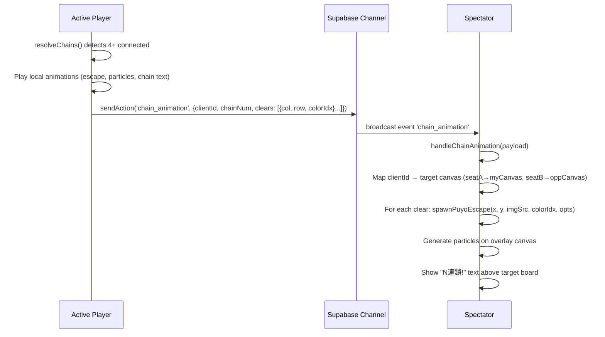
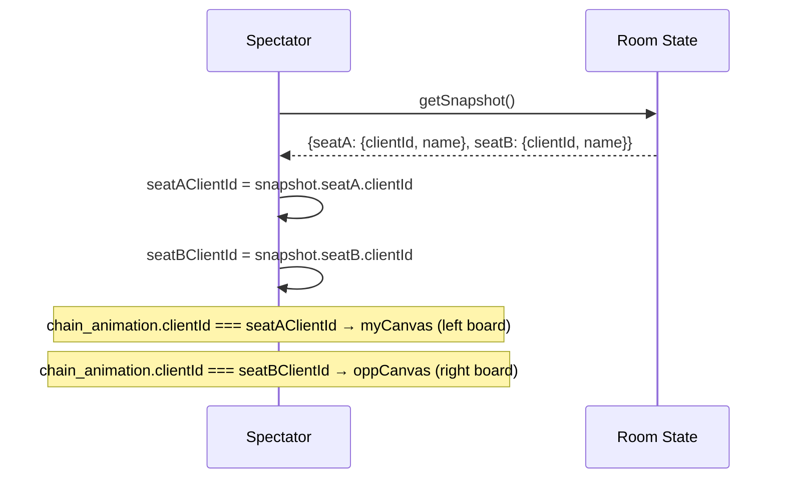

# Design Document: Spectator Battle Animations

## Overview

観戦者（spectator）が対戦中のプレイヤーと同じ視覚体験を得られるようにする機能。現在、観戦者は200msごとにブロードキャストされるグリッド状態のみを受信しており、連鎖演出（逃走アニメーション、連鎖テキスト、パーティクル）が表示されない。

本設計では、プレイヤーが連鎖消去を行った際に軽量なアニメーショントリガーイベントをブロードキャストし、観戦者側でローカルにアニメーションを再生する方式を採用する。観戦者は両方のプレイヤーのボード（左: seatA、右: seatB）それぞれで連鎖演出を見ることができる。グリッド差分検出方式と比較して、タイミングの正確性とイベント情報の完全性（消去位置・色・連鎖数）で優位性がある。

## Architecture

```mermaid
graph TD
    subgraph "Active Player (seatA/seatB)"
        A[resolveChains] --> B[Chain Clear Detected]
        B --> C[Local Animation: escape + particles + chain text]
        B --> D[Broadcast: chain_animation event]
    end

    subgraph "Supabase Realtime"
        D --> E[battle_{roomCode} channel]
    end

    subgraph "Spectator"
        E --> F[handleChainAnimation]
        F --> G[Determine target canvas: myCanvas or oppCanvas]
        F --> H[spawnPuyoEscape for each cleared puyo]
        F --> I[Generate particles on spectator canvas]
        F --> J[Show chain text above target board]
    end
```

## Sequence Diagrams

### Chain Animation Broadcast Flow



### Spectator Board Identification



## Components and Interfaces

### Component 1: Chain Animation Broadcaster (Player Side)

**Purpose**: 連鎖消去発生時にアニメーション情報をブロードキャストする

**Interface**:
```javascript
// Payload structure for chain_animation event
interface ChainAnimationPayload {
  clientId: string;          // Broadcasting player's client ID
  chainNum: number;          // Current chain number (1, 2, 3...)
  clears: Array<{
    col: number;             // Column index of cleared puyo
    row: number;             // Row index of cleared puyo
    colorIdx: number;        // Color index (0-8, or -2 for garbage)
  }>;
}
```

**Responsibilities**:
- `resolveChains()` 内で消去グループ検出後にイベントを送信
- 消去されたぷよの位置と色情報を収集
- 連鎖番号を含めて送信（連鎖テキスト表示用）
- お邪魔ぷよ（colorIdx = -2）の消去は逃走アニメーション対象外（パーティクルのみ）

### Component 2: Spectator Animation Renderer

**Purpose**: 受信したアニメーションイベントを観戦者画面で再生する

**Interface**:
```javascript
// Spectator-side animation handler
function handleChainAnimation(payload: ChainAnimationPayload): void;

// Map clientId to the correct canvas element
function getTargetCanvas(clientId: string): { canvas: HTMLCanvasElement, label: string };

// Spawn escape animation relative to a specific canvas
function spawnSpectatorEscape(canvas: HTMLCanvasElement, col: number, row: number, colorIdx: number): void;

// Show chain text above a specific canvas
function showSpectatorChainText(canvas: HTMLCanvasElement, chainNum: number): void;

// Generate particles on spectator overlay
function spawnSpectatorParticles(canvas: HTMLCanvasElement, col: number, row: number, colorIdx: number): void;
```

**Responsibilities**:
- `chain_animation` イベントを受信し、対象ボードを特定
- 各消去位置に対して逃走アニメーションを生成
- パーティクルを生成（canvas overlay上に描画）
- 2連鎖以上で連鎖テキストを表示
- アクティブプレイヤーの場合はイベントを無視（自分のアニメーションは既にローカルで再生済み）

### Component 3: Spectator Particle Canvas

**Purpose**: 観戦者用のパーティクルエフェクトを描画するオーバーレイcanvas

**Interface**:
```javascript
// Particle overlay for spectator mode
interface SpectatorParticleSystem {
  canvas: HTMLCanvasElement;       // Overlay canvas (position: absolute over game boards)
  particles: Array<Particle>;     // Active particles
  animFrameId: number | null;     // requestAnimationFrame ID
  
  init(container: HTMLElement): void;
  addParticles(worldX: number, worldY: number, colorIdx: number, count: number): void;
  startLoop(): void;
  stopLoop(): void;
}

interface Particle {
  x: number; y: number;
  vx: number; vy: number;
  color: string;
  size: number;
  life: number;  // 0.0 - 1.0, decreases over time
}
```

## Data Models

### Chain Animation Event

```javascript
// Broadcast payload
const chainAnimationEvent = {
  clientId: "abc123",       // Who triggered the chain
  chainNum: 3,             // This is the 3rd chain in sequence
  clears: [
    { col: 2, row: 10, colorIdx: 0 },  // Red puyo at (2,10)
    { col: 2, row: 11, colorIdx: 0 },  // Red puyo at (2,11)
    { col: 3, row: 10, colorIdx: 0 },  // Red puyo at (3,10)
    { col: 3, row: 11, colorIdx: 0 },  // Red puyo at (3,11)
  ]
};
```

**Validation Rules**:
- `chainNum >= 1`
- `clears.length >= 4` (minimum connected group size)
- `colorIdx` in range [-2, 8] (-2 = garbage, 0-8 = color puyos)
- `col` in range [0, cols-1], `row` in range [0, rows-1]

### Spectator State Extension

```javascript
// Added to spectator's local state
let spectatorMode = false;           // true when role is 'spectator' or 'queue'
let seatAClientId = null;            // Player on left board
let seatBClientId = null;            // Player on right board
let spectatorParticles = [];         // Particle array for spectator overlay
let spectatorParticleCanvas = null;  // Overlay canvas element
let spectatorAnimFrame = null;       // Animation frame ID
```

## Algorithmic Pseudocode

### Player-Side: Broadcast Chain Animation

```javascript
// Modified resolveChains() - add broadcast after each chain step
function resolveChains() {
  let totalChains = 0;

  while (true) {
    const groups = findConnectedGroups();
    if (groups.length === 0) break;

    totalChains++;
    const clears = [];

    groups.forEach(group => {
      group.forEach(([r, c]) => {
        const colorIdx = grid[r][c];
        if (colorIdx >= 0) {  // Only color puyos get escape animation
          clears.push({ col: c, row: r, colorIdx });
        }
        // ... existing clear logic (adjacent garbage, grid[r][c] = -1)
      });
    });

    // NEW: Broadcast animation event for spectators
    if (clears.length > 0) {
      sendAction('chain_animation', {
        clientId: myClientId,
        chainNum: totalChains,
        clears
      });
    }

    // ... existing score calculation, gravity, etc.
  }

  return totalChains;
}
```

**Preconditions:**
- `gameRunning === true`
- `grid` contains valid cell values (-2, -1, or 0-8)
- `channel` is connected and subscribed

**Postconditions:**
- For each chain step with cleared color puyos, one `chain_animation` event is broadcast
- Event contains exact positions and colors of all cleared puyos in that step
- Existing score calculation and garbage logic remain unchanged
- Local animations continue to be triggered independently (not from this event)

### Spectator-Side: Handle Chain Animation

```javascript
function handleChainAnimation(payload) {
  // PRECONDITION: spectator or queue role
  // Active players ignore this (they have local animations)
  if (myRole === 'seatA' || myRole === 'seatB') return;
  if (!payload.clears || payload.clears.length === 0) return;

  const { clientId, chainNum, clears } = payload;

  // Determine which canvas this animation targets
  const targetCanvas = (clientId === seatAClientId) ? myCanvas : oppCanvas;
  const canvasRect = targetCanvas.getBoundingClientRect();
  const cellW = targetCanvas.width / cols;
  const cellH = targetCanvas.height / rows;

  // Spawn escape animations for each cleared puyo
  clears.forEach(({ col, row, colorIdx }) => {
    if (colorIdx < 0) return;  // Skip garbage puyos for escape animation

    const startX = canvasRect.left + col * cellW + cellW / 2 - 14;
    const startY = canvasRect.top + row * cellH + cellH / 2 - 14;
    const imgSrc = PUYO_IMGS_SRC[colorIdx];
    const groundY = canvasRect.bottom + 10;

    spawnPuyoEscape(startX, startY, imgSrc, colorIdx, {
      size: Math.min(28, cellW),
      groundY
    });
  });

  // Generate particles
  clears.forEach(({ col, row, colorIdx }) => {
    if (colorIdx < 0) return;
    const px = canvasRect.left + col * cellW + cellW / 2;
    const py = canvasRect.top + row * cellH + cellH / 2;
    for (let i = 0; i < 3; i++) {
      spectatorParticles.push({
        x: px, y: py,
        vx: (Math.random() - 0.5) * 4,
        vy: (Math.random() - 0.5) * 4,
        color: PUYO_COLORS[colorIdx] || '#999',
        size: 2 + Math.random() * 2,
        life: 0.6
      });
    }
  });

  // Show chain text if chainNum >= 2
  if (chainNum >= 2) {
    showSpectatorChainText(targetCanvas, chainNum);
  }

  // Start particle render loop if not running
  if (!spectatorAnimFrame) startSpectatorParticleLoop();
}
```

**Preconditions:**
- Spectator has received `room_state_sync` with seatA/seatB clientIds
- `myRole` is 'spectator' or 'queue'
- `puyo-escape.js` is loaded (provides `spawnPuyoEscape`)
- Target canvas is initialized and visible

**Postconditions:**
- One escape animation DOM element spawned per cleared color puyo
- 3 particles generated per cleared color puyo
- Chain text shown if `chainNum >= 2`
- No effect on game state (purely visual)

**Loop Invariants:**
- Total concurrent escape DOM elements ≤ 60 (performance cap)
- Particle array cleaned up when all particles expire (life ≤ 0)

### Spectator Particle Render Loop

```javascript
function startSpectatorParticleLoop() {
  if (spectatorAnimFrame) return;

  const overlay = getOrCreateParticleOverlay();
  const ctx = overlay.getContext('2d');

  function loop() {
    ctx.clearRect(0, 0, overlay.width, overlay.height);

    spectatorParticles = spectatorParticles.filter(p => {
      p.x += p.vx;
      p.y += p.vy;
      p.vy += 0.15;  // gravity
      p.life -= 0.025;
      if (p.life <= 0) return false;

      ctx.globalAlpha = p.life;
      ctx.fillStyle = p.color;
      ctx.beginPath();
      ctx.arc(p.x, p.y, p.size, 0, Math.PI * 2);
      ctx.fill();
      return true;
    });

    ctx.globalAlpha = 1;

    if (spectatorParticles.length > 0) {
      spectatorAnimFrame = requestAnimationFrame(loop);
    } else {
      spectatorAnimFrame = null;
    }
  }

  spectatorAnimFrame = requestAnimationFrame(loop);
}
```

**Preconditions:**
- Particle overlay canvas exists and is positioned over game boards
- `spectatorParticles` array contains active particles

**Postconditions:**
- All particles rendered with decreasing opacity
- Expired particles (life ≤ 0) removed from array
- Loop self-terminates when no particles remain

### Chain Text Display

```javascript
function showSpectatorChainText(targetCanvas, chainNum) {
  const existingId = 'chain-text-' + (targetCanvas === myCanvas ? 'left' : 'right');
  let el = document.getElementById(existingId);

  if (!el) {
    el = document.createElement('div');
    el.id = existingId;
    el.style.cssText = 'position:fixed;pointer-events:none;z-index:35;'
      + 'font-size:24px;font-weight:bold;color:#fff;text-shadow:2px 2px 4px #000;'
      + 'transition:opacity 0.3s;';
    document.body.appendChild(el);
  }

  const rect = targetCanvas.getBoundingClientRect();
  el.style.left = (rect.left + rect.width / 2) + 'px';
  el.style.top = (rect.top - 30) + 'px';
  el.style.transform = 'translateX(-50%)';
  el.textContent = `${chainNum}連鎖!`;
  el.style.opacity = '1';

  // Auto-hide after 1.5s
  clearTimeout(el._hideTimer);
  el._hideTimer = setTimeout(() => {
    el.style.opacity = '0';
  }, 1500);
}
```

## Key Functions with Formal Specifications

### Function 1: sendAction('chain_animation', payload)

```javascript
sendAction('chain_animation', { clientId, chainNum, clears })
```

**Preconditions:**
- `channel` is connected and in SUBSCRIBED state
- `clientId` is the broadcasting player's ID
- `chainNum >= 1`
- `clears` is non-empty array of `{col, row, colorIdx}` objects

**Postconditions:**
- Event delivered to all channel subscribers (including spectators)
- Payload size is bounded: max ~40 clears per chain step (worst case 10-chain)
- No effect on game state or score

### Function 2: handleChainAnimation(payload)

```javascript
function handleChainAnimation(payload)
```

**Preconditions:**
- `payload` has valid `clientId`, `chainNum`, `clears` fields
- Spectator has initialized canvases and knows seatA/seatB clientIds

**Postconditions:**
- If caller is active player (seatA/seatB): no-op (early return)
- If caller is spectator/queue: animations spawned on correct board
- DOM element count bounded by performance cap (≤ 60 concurrent)
- Chain text shown only for `chainNum >= 2`

### Function 3: getOrCreateParticleOverlay()

```javascript
function getOrCreateParticleOverlay(): HTMLCanvasElement
```

**Preconditions:**
- Battle area DOM is visible
- At least one canvas (myCanvas or oppCanvas) is initialized

**Postconditions:**
- Returns a canvas element positioned over the battle area
- Canvas dimensions match the battle area container
- Canvas has `pointer-events: none` and high z-index
- Reuses existing overlay if already created

## Example Usage

```javascript
// === Player side (in resolveChains) ===
// After detecting a chain clear:
const clears = [
  { col: 2, row: 10, colorIdx: 0 },
  { col: 2, row: 11, colorIdx: 0 },
  { col: 3, row: 10, colorIdx: 0 },
  { col: 3, row: 11, colorIdx: 0 }
];
sendAction('chain_animation', {
  clientId: myClientId,
  chainNum: 2,
  clears
});

// === Spectator side (event handler) ===
channel.on('broadcast', { event: 'chain_animation' }, ({ payload }) => {
  handleChainAnimation(payload);
});

// === Spectator initialization (in showSpectatorView) ===
function showSpectatorView() {
  // ... existing code ...
  const snapshot = roomManager.getSnapshot();
  seatAClientId = snapshot.seatA ? snapshot.seatA.clientId : null;
  seatBClientId = snapshot.seatB ? snapshot.seatB.clientId : null;
  spectatorMode = true;
}
```

## Correctness Properties

*A property is a characteristic or behavior that should hold true across all valid executions of a system—essentially, a formal statement about what the system should do. Properties serve as the bridge between human-readable specifications and machine-verifiable correctness guarantees.*

### Property 1: Broadcast Payload Completeness

*For any* grid state that produces a chain clear, the broadcast payload SHALL contain exactly the col, row, and colorIdx of every cleared Color_Puyo in that step, with no additional fields beyond clientId, chainNum, and clears.

**Validates: Requirements 1.1, 1.2, 1.3**

### Property 2: Chain Step Sequencing

*For any* grid state that produces an N-step chain sequence, exactly N Chain_Animation_Events SHALL be sent, with chainNum values incrementing from 1 to N.

**Validates: Requirement 1.4**

### Property 3: Escape Animation Count

*For any* Chain_Animation_Event with a clears array, the number of spawned Escape_Animations SHALL equal the number of entries where colorIdx >= 0. Entries with colorIdx < 0 (garbage) SHALL produce no Escape_Animation.

**Validates: Requirements 2.1, 2.5**

### Property 4: Particle Count Consistency

*For any* Chain_Animation_Event with N cleared Color_Puyos (colorIdx >= 0), exactly N * 3 particles SHALL be generated on the spectator's Particle_Overlay.

**Validates: Requirement 2.2**

### Property 5: Chain Text Threshold

*For any* Chain_Animation_Event where chainNum >= 2, Chain_Text SHALL be displayed above the Target_Board. For chainNum < 2, no Chain_Text SHALL appear.

**Validates: Requirements 2.3, 2.4**

### Property 6: Board Targeting Accuracy

*For any* Chain_Animation_Event with a given clientId, the Animation_Renderer SHALL render animations on myCanvas (left board) if clientId matches seatAClientId, and on oppCanvas (right board) if clientId matches seatBClientId.

**Validates: Requirements 3.1, 3.2**

### Property 7: Active Player Isolation

*For any* Chain_Animation_Event received by an Active_Player (role = seatA or seatB), the handleChainAnimation function SHALL be a no-op, spawning zero animations and zero particles.

**Validates: Requirement 4.1**

### Property 8: Particle Loop Self-Termination

*For any* set of active particles, when all particles have expired (life <= 0), the render loop SHALL self-terminate (spectatorAnimFrame becomes null).

**Validates: Requirement 5.3**

### Property 9: DOM Element Cap Invariant

*For any* sequence of Chain_Animation_Events, the total concurrent Escape_Animation DOM elements SHALL never exceed 60.

**Validates: Requirement 6.1**

### Property 10: Payload Validation Robustness

*For any* malformed Chain_Animation_Event (missing fields, invalid types, or out-of-range values), the Animation_Renderer SHALL not throw an error and SHALL not spawn animations for invalid entries while still processing valid entries in the same payload.

**Validates: Requirements 7.1, 7.2**

## Error Handling

### Error Scenario 1: Spectator Joins Mid-Chain

**Condition**: Spectator connects while a chain sequence is in progress
**Response**: Spectator misses animations for chain steps that occurred before subscription. Grid state will be correct on next 200ms broadcast.
**Recovery**: No recovery needed. Visual-only impact. Next chain will animate correctly.

### Error Scenario 2: Channel Disconnection During Animation

**Condition**: Spectator loses connection while animations are playing
**Response**: In-flight animations complete locally (DOM-based, no network dependency). Missed events during disconnection are lost.
**Recovery**: On reconnect, spectator receives fresh grid state. No stale animation state.

### Error Scenario 3: Invalid Payload

**Condition**: `chain_animation` event has malformed data (missing fields, out-of-range values)
**Response**: `handleChainAnimation` validates payload and returns early if invalid. No crash.
**Recovery**: Automatic. Next valid event will be processed normally.

### Error Scenario 4: Canvas Not Ready

**Condition**: `chain_animation` received before `initCanvases()` completes
**Response**: `getBoundingClientRect()` returns zero-size rect. Animations spawn at (0,0).
**Recovery**: Guard with `if (!myCanvas.width) return;` check. Event is dropped silently.

## Testing Strategy

### Unit Testing Approach

- Test `handleChainAnimation` correctly maps clientId to target canvas
- Test particle generation count (3 per cleared puyo)
- Test chain text visibility threshold (shown only for chainNum >= 2)
- Test active player isolation (handler returns early for seatA/seatB roles)
- Test payload validation (malformed data doesn't crash)
- Test DOM element cap enforcement (max 60 concurrent)

### Property-Based Testing Approach

**Property Test Library**: fast-check

- Generate random `clears` arrays → verify particle count = `clears.filter(c => c.colorIdx >= 0).length * 3`
- Generate random `clientId` values → verify correct canvas targeting based on seatA/seatB mapping
- Generate random `chainNum` values → verify chain text visibility matches `chainNum >= 2`
- Generate random sequences of chain events → verify DOM element count never exceeds 60

### Integration Testing Approach

- Full spectator flow: create room → join as spectator → trigger chain on player → verify animations appear on spectator screen
- Both boards: trigger chains on both players → verify animations appear on correct respective boards
- Performance: trigger rapid successive chains → verify no frame drops or memory leaks
- Reconnection: spectator disconnects and reconnects → verify next chain animates correctly

## Performance Considerations

- **Payload size**: Each `chain_animation` event is ~200-500 bytes (typical 4-8 clears per step). Negligible compared to 200ms grid broadcasts.
- **DOM element cap**: 60 concurrent escape elements prevents memory/rendering issues during large chains (10-chain worst case: ~40 puyos).
- **Particle overlay**: Single canvas with requestAnimationFrame loop. Self-terminates when no particles active.
- **Event frequency**: Chain events fire once per chain step (not per frame). A 5-chain sequence = 5 events total, spread over ~2.5 seconds.
- **No additional polling**: Event-driven, not polling-based. Zero overhead when no chains are occurring.

## Security Considerations

- **Payload validation**: Spectator validates all fields before processing. Out-of-range values are ignored.
- **No game state mutation**: Animation handler is purely visual. Cannot affect scores, grids, or game logic.
- **Rate limiting**: DOM element cap prevents malicious flood of animation events from causing DoS.
- **Client ID verification**: Spectator only processes events from known seatA/seatB clientIds.

## Dependencies

- `js/puyo-escape.js` — Existing shared escape animation library (provides `spawnPuyoEscape`)
- `css/puyo-escape.css` — Existing shared animation CSS keyframes
- Supabase Realtime Broadcast — Existing channel infrastructure (`battle_{roomCode}`)
- No new external dependencies required
