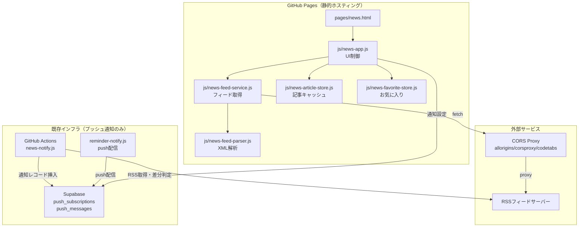
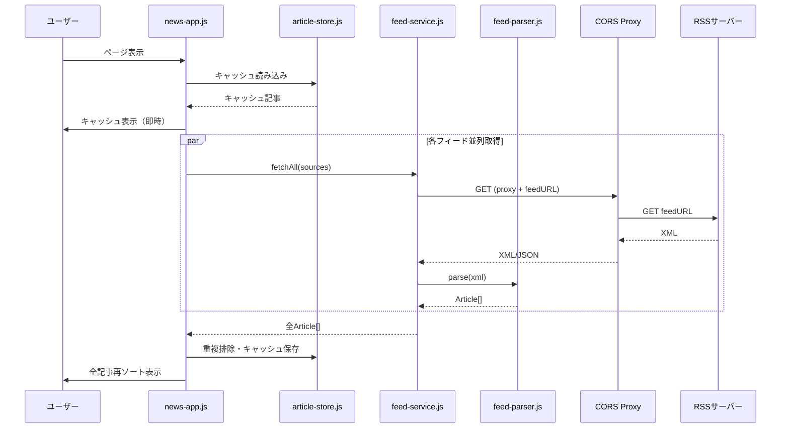

# 技術設計書: ファミリーニュース

## 概要

ファミリーニュースは、既存のお小遣い手帳アプリ集に追加するRSSニュースアグリゲーター機能。GitHub Pages上でフロントエンドのみ（HTML/CSS/JS）で動作し、RSSフィード取得はCORS Proxy経由で行う。プッシュ通知のみ既存Supabase + GitHub Actions基盤を利用する。

### 設計方針

- **フロントエンドのみ**: バックエンド不要（プッシュ通知除く）、localStorageでデータ永続化
- **エラー耐性重視**: フィード単位の独立したエラー処理、CORSプロキシのフォールバック
- **モジュール分離**: 各責務を独立JSファイルに分離し、テスト容易性を確保
- **既存基盤活用**: sw.js、reminder-notify.js、push_subscriptionsを流用
- **stale-while-revalidate**: キャッシュ優先表示 → バックグラウンド更新
- **RSS取得の二重経路**: ブラウザ利用（CORS Proxy経由）と通知バッチ（GitHub Actions直接取得）は完全に独立した処理。データ共有はしない

### 責務分離: ブラウザ利用 vs 通知バッチ

| 項目 | ブラウザ利用 | 通知バッチ（GitHub Actions） |
|------|-------------|--------------------------|
| 実行環境 | ユーザーのブラウザ | GitHub Actionsサーバー（Node.js） |
| RSS取得 | CORS Proxy経由 | 直接fetch（サーバーサイドなのでCORS不要） |
| データ保存先 | localStorage | Supabase（news_last_check） |
| 目的 | ユーザーへの記事表示 | 新着差分判定→Push通知 |
| 実行頻度 | ユーザーがページを開いた時 | 毎朝07:00 Cron |

注意: 将来的に「記事保存場所を共通化したい」場合はSupabaseに記事テーブルを新設し、ブラウザ側からもAPI経由で取得する設計変更が必要になる。現時点では独立した二重取得で問題ない。

### 表示件数制限

| 項目 | 上限 |
|------|------|
| 1フィードあたり取得記事数 | 最大20件 |
| 画面表示件数 | 最大100件 |
| キャッシュ保持件数 | 最大200件 |

### Article.id生成タイミング

```
RSS取得時（非同期OK）:
  XML → parseFeed → normalizeUrl → SHA-256 → Article.id付与 → localStorage保存

キャッシュ読み込み時（同期）:
  localStorage.getItem → JSON.parse → Article[]（idはそのまま利用、再生成しない）
```

SHA-256生成はフィード取得時にPromise.allで一括実行。キャッシュ読み込み・お気に入り判定・フィルタリングはすべて保存済みidを参照するため同期処理で完結する。

## アーキテクチャ

### システム構成図



### データフロー



## コンポーネントとインタフェース

### モジュール構成

| ファイル | 責務 | 依存先 |
|----------|------|--------|
| `pages/news.html` | ページ構造・CSS | - |
| `css/news.css` | ニュースアプリ専用スタイル | - |
| `js/news-feed-parser.js` | RSS/Atom XML解析、HTMLサニタイズ | - |
| `js/news-feed-service.js` | CORS Proxy経由のフィード取得、リトライ | news-feed-parser.js |
| `js/news-article-store.js` | 記事キャッシュ、重複排除、容量管理 | - |
| `js/news-favorite-store.js` | お気に入り管理 | - |
| `js/news-app.js` | UI制御、タブ切替、イベントハンドリング | 上記全モジュール |
| `scripts/news-notify.js` | GitHub Actions用：RSS差分→プッシュ通知 | - |

### インタフェース定義

#### news-feed-parser.js

```javascript
/**
 * RSS/Atom XMLを解析してArticleオブジェクト配列を返す
 * XML解析・サニタイズは同期処理。ID生成（SHA-256）のみ非同期。
 * @param {string} xmlText - RSS/AtomフィードのXMLテキスト
 * @param {FeedSource} source - フィードソース情報
 * @returns {Promise<Article[]>} 解析された記事配列（ID生成のためPromise）
 * @throws {ParseError} 無効なXMLの場合
 */
async function parseFeed(xmlText, source) {}

/**
 * HTMLタグを除去してプレーンテキストを返す（XSS対策）
 * @param {string} html - サニタイズ対象のHTML文字列
 * @param {number} maxLength - 最大文字数（デフォルト200）
 * @returns {string} サニタイズ済みプレーンテキスト
 */
function sanitizeHtml(html, maxLength = 200) {}

/**
 * URLを正規化してSHA-256ハッシュIDを生成
 * 注意: ID生成はフィード取得時のみ実行。キャッシュ読み込み時は保存済みidをそのまま利用する（再計算しない）
 * @param {string} url - 記事URL
 * @returns {Promise<string>} hex形式のSHA-256ハッシュ
 */
async function generateArticleId(url) {}

/**
 * URLを正規化する（トレイリングスラッシュ除去、クエリパラメータソート）
 * 注意: http/httpsは別URLとして扱う（プロトコル変換しない）
 * 実装例:
 *   const u = new URL(url);
 *   u.hash = "";
 *   u.pathname = u.pathname.replace(/\/$/, "");
 *   u.search = new URLSearchParams([...u.searchParams.entries()].sort());
 *   return u.toString();
 * @param {string} url - 正規化対象URL
 * @returns {string} 正規化されたURL
 */
function normalizeUrl(url) {}
```

#### news-feed-service.js

```javascript
/**
 * 全有効フィードソースから記事を並列取得
 * @param {FeedSource[]} sources - 有効フィードソース配列
 * @param {ProxyConfig[]} proxies - CORSプロキシ候補配列
 * @param {function} onPartialResult - 部分結果コールバック(source, articles)
 * @returns {Promise<{articles: Article[], errors: FeedError[]}>}
 */
async function fetchAllFeeds(sources, proxies, onPartialResult) {}

/**
 * 単一フィードをプロキシフォールバック付きで取得
 * @param {FeedSource} source - フィードソース
 * @param {ProxyConfig[]} proxies - プロキシ候補リスト
 * @returns {Promise<{articles: Article[], usedProxy: string}>}
 * @throws {FeedFetchError} 全プロキシ失敗時
 */
async function fetchFeed(source, proxies) {}
```

#### news-article-store.js

```javascript
/**
 * 記事キャッシュを読み込み（保存済みidをそのまま利用、再計算しない）
 * @returns {Article[]} キャッシュ済み記事（最大200件）
 */
function loadCache() {}

/**
 * 記事をキャッシュに保存（既存キャッシュとのマージ・重複排除・容量管理付き）
 * 保存フロー: load → merge with new → deduplicate → prune → save
 * @param {Article[]} articles - 保存対象記事
 * @returns {{saved: number, duplicates: number, pruned: number}} 保存結果
 */
function saveToCache(articles) {}

/**
 * 期限切れ記事を削除（30日経過）
 * @returns {number} 削除件数
 */
function pruneExpired() {}

/**
 * URL正規化+SHA-256で重複判定
 * @param {Article[]} newArticles - 新規記事
 * @param {Article[]} existing - 既存記事
 * @returns {Promise<Article[]>} 重複除去後の新規記事
 */
async function deduplicateArticles(newArticles, existing) {}
```

#### news-favorite-store.js

```javascript
/**
 * お気に入り一覧を読み込み
 * @returns {FavoriteArticle[]} お気に入り記事（保存日時降順）
 */
function loadFavorites() {}

/**
 * 記事をお気に入りに追加（上限100件管理）
 * @param {Article} article - 対象記事
 * @returns {{added: boolean, removed: FavoriteArticle|null}} 追加結果
 */
function addFavorite(article) {}

/**
 * お気に入りから削除
 * @param {string} articleId - 記事ID
 * @returns {boolean} 削除成功
 */
function removeFavorite(articleId) {}

/**
 * 記事IDがお気に入りかどうか判定
 * @param {string} articleId - 記事ID
 * @returns {boolean}
 */
function isFavorite(articleId) {}
```

## データモデル

### localStorage構造

```javascript
// family-news-feeds: FeedSource[]
[
  {
    id: "hacker-news",
    name: "Hacker News",
    url: "https://hnrss.org/frontpage",
    category: "テック",
    enabled: true,
    lastSuccessAt: "2025-01-15T10:30:00Z",
    errorCount: 0,
    lastError: "",        // 直近のエラー種別（例: "proxy_timeout", "xml_parse_error", "network_error"）
    lastErrorAt: ""       // 直近のエラー発生日時（ISO8601）
  }
]

// family-news-cache: Article[]（最大200件）
[
  {
    id: "a1b2c3d4e5...",  // SHA-256 of normalized URL
    title: "記事タイトル",
    url: "https://example.com/article",
    publishedAt: "2025-01-15T08:00:00Z",
    description: "記事概要（最大200文字、サニタイズ済み）",
    sourceName: "Hacker News",
    sourceId: "hacker-news",
    sourceCategory: "テック",
    fetchedAt: "2025-01-15T10:30:00Z"
  }
]

// family-news-favorites: FavoriteArticle[]（最大100件）
[
  {
    id: "a1b2c3d4e5...",
    title: "記事タイトル",
    url: "https://example.com/article",
    sourceName: "Hacker News",
    sourceCategory: "テック",
    publishedAt: "2025-01-15T08:00:00Z",
    savedAt: "2025-01-15T12:00:00Z"
  }
]

// family-news-settings
{
  proxies: [
    { name: "allorigins", urlPrefix: "https://api.allorigins.win/raw?url=", type: "raw" },
    { name: "corsproxy", urlPrefix: "https://corsproxy.io/?", type: "raw" },
    { name: "codetabs", urlPrefix: "https://api.codetabs.com/v1/proxy?quest=", type: "raw" }
  ],
  debugLog: false,
  lastNotifyCheck: "2025-01-15T07:00:00Z"
}
```

### Supabaseテーブル変更

#### push_subscriptions（既存テーブルにカラム追加）

```sql
ALTER TABLE push_subscriptions
ADD COLUMN news_notification_enabled BOOLEAN NOT NULL DEFAULT false;
```

### FeedSource 状態遷移

FeedSourceはerrorCountに基づき以下の表示ステータスを導出する:

```
           取得成功              取得成功
  active <──────── warning <──────── error
    │                 ▲                ▲
    │ 1回失敗          │ 2回目失敗        │ 3回以上連続失敗
    └────────────────>└───────────────>│
```

| errorCount | 表示ステータス | UIアイコン | 説明 |
|-----------|-------------|----------|------|
| 0 | active | 🟢 | 正常 |
| 1-2 | warning | 🟡 | 一時的な失敗（次回復帰可能） |
| 3+ | error | 🔴 | 継続的な問題（ユーザーに確認促す） |

ステータスはerrorCountから算出するため、別フィールドは不要。lastError/lastErrorAtで原因特定が可能。

エラー種別（lastError値）:
- `proxy_timeout` — 全プロキシがタイムアウト
- `xml_parse_error` — RSS/Atom XMLの解析失敗
- `network_error` — ネットワーク切断
- `http_error_XXX` — HTTPステータスエラー（例: http_error_403）

### Service Worker設計

既存sw.jsとの責務分離:

| 管理対象 | 管理手段 | 説明 |
|---------|---------|------|
| 静的リソース（HTML/CSS/JS） | Service Worker（Cache API） | オフラインでもページを開ける |
| RSS記事データ | localStorage | 記事の保存・検索・フィルタ |

sw.jsのASSETSリストにニュースアプリのファイルを追加するのみ。記事データのキャッシュはService Workerでは管理しない。

### GitHub Actions用 状態管理

`scripts/news-notify.js`はSupabaseに前回チェック時のフィード状態を保存:

```sql
-- news_last_check テーブル（新規作成）
CREATE TABLE news_last_check (
  id UUID PRIMARY KEY DEFAULT gen_random_uuid(),
  feed_url TEXT NOT NULL UNIQUE,
  last_article_ids JSONB NOT NULL DEFAULT '[]',
  checked_at TIMESTAMPTZ NOT NULL DEFAULT now()
);
```


## 正当性プロパティ (Correctness Properties)

*プロパティとは、システムのすべての有効な実行において真であるべき特性や振る舞い—つまり、システムが何をすべきかについての形式的な記述です。プロパティは、人間が読める仕様と機械で検証可能な正当性保証との橋渡しを行います。*

### Property 1: 記事の公開日時降順ソート

*For any* 記事配列に対して、ソート関数を適用した結果は、すべての隣接する要素ペアにおいて `articles[i].publishedAt >= articles[i+1].publishedAt` を満たすこと。

**Validates: Requirements 1.1, 1.3**

### Property 2: フィード解析の主要フィールド保持（セマンティック等価）

*For any* 有効なRSS 2.0またはAtom形式のXMLにおいて、parseFeedの結果が元のXMLに含まれるtitle、link、date、summaryの各値と意味的に等価であること（HTMLエンティティやCDATA展開後の比較）。

**Validates: Requirements 2.1, 2.2, 2.3**

### Property 3: Atomフィードのlink優先選択

*For any* 複数の`<link>`要素を持つAtomエントリにおいて、`rel="alternate"`を持つlinkが存在する場合、parseFeedはそのhref値を採用すること。

**Validates: Requirements 2.4**

### Property 4: 無効XMLの安全なエラーハンドリング

*For any* 無効なXML文字列（ランダムテキスト、不完全なタグ、空文字列等）に対して、parseFeedは例外をスローせず、エラー結果を返すこと。

**Validates: Requirements 2.5**

### Property 5: HTMLサニタイズによるタグ完全除去

*For any* HTML文字列に対して、sanitizeHtmlの結果にはHTMLタグ（`<script>`、`<iframe>`、`onerror`属性を含む全タグ）が一切含まれないこと。

**Validates: Requirements 3.1, 3.3**

### Property 6: フィードソースのlocalStorage永続化ラウンドトリップ

*For any* 有効なFeedSource配列に対して、localStorageへの保存後に読み込んだ結果が元の配列と等価であること。

**Validates: Requirements 4.2, 4.6**

### Property 7: フィードソース削除時のキャッシュ・お気に入り保持

*For any* FeedSourceとそのsourceIdを持つキャッシュ記事・お気に入り記事がある状態で、当該FeedSourceを削除した後も、キャッシュおよびお気に入りの記事は変更されないこと。

**Validates: Requirements 4.3, 4.7**

### Property 8: 有効フィードのみ取得対象

*For any* FeedSource配列において、`enabled: false`のソースはfetchAllFeedsの取得対象に含まれないこと。

**Validates: Requirements 4.4**

### Property 9: 無効URL形式のバリデーション拒否

*For any* 有効なURL形式でない文字列（スキームなし、空文字列、スペース含有等）に対して、URL検証関数はfalseを返すこと。

**Validates: Requirements 4.5**

### Property 10: お気に入り追加のラウンドトリップ（description除外）

*For any* Article に対して、addFavoriteで保存した後にloadFavoritesで取得した結果に、当該記事のid・title・url・sourceName・sourceCategory・publishedAtが含まれ、descriptionは含まれないこと。

**Validates: Requirements 5.1, 5.4, 5.5, 5.6**

### Property 11: お気に入り削除後の非存在

*For any* お気に入りに追加済みの記事IDに対して、removeFavorite実行後にisFavoriteがfalseを返すこと。

**Validates: Requirements 5.2**

### Property 12: カテゴリフィルタリングの正確性

*For any* 記事配列と選択カテゴリに対して、フィルタ結果のすべての記事は `sourceCategory === selectedCategory` を満たすこと。カテゴリが「すべて」の場合は、全記事が返されること。

**Validates: Requirements 6.2, 6.3**

### Property 13: プロキシフォールバックとエラー分離

*For any* フィード取得において、先頭プロキシが失敗した場合は次のプロキシで再試行し、全プロキシ失敗時は当該フィードのみエラーとし、他のフィードの取得結果は影響を受けないこと。

**Validates: Requirements 7.2, 7.4, 7.5**

### Property 14: フィードステータスの正確な更新

*For any* フィード取得結果（成功/失敗）に対して、成功時は`lastSuccessAt`が現在時刻に更新され`errorCount`が0にリセットされ、失敗時は`errorCount`がインクリメントされること。

**Validates: Requirements 7.7**

### Property 15: URL正規化の等価性

*For any* 意味的に同一のURL（同一プロトコル内で、末尾スラッシュの有無・クエリパラメータの順序違いのみが異なる）に対して、normalizeUrlは同一の文字列を返し、generateArticleIdは同一のハッシュを返すこと。http/httpsは別URLとして扱う。

**Validates: Requirements 12.1**

### Property 16: 重複排除後のID一意性

*For any* 重複IDを含む記事配列に対して、deduplicateArticlesの結果はすべてのArticle.idが一意であり、各IDの最初の出現のみが保持されること。

**Validates: Requirements 12.2, 12.3**

### Property 17: プッシュ通知本文のフォーマット正確性

*For any* 新着記事配列（1件以上）に対して、通知フォーマット関数の結果は記事件数と先頭記事のタイトルを含むこと。

**Validates: Requirements 13.7**

## エラーハンドリング

### フィード取得エラー

| エラー種別 | 対処 | ユーザー通知 |
|-----------|------|-------------|
| プロキシタイムアウト（10秒） | 次のプロキシ候補で再試行 | なし（全候補失敗まで） |
| 全プロキシ失敗 | errorCount++、キャッシュから表示 | 「一部フィードの取得に失敗しました（N件）」バナー |
| XML解析エラー | 該当フィードスキップ、エラー記録 | console.warn出力 |
| ネットワーク切断 | キャッシュ表示、「オフラインモード」バナー | バナー表示 |

### localStorage容量管理

| 状況 | 対処 |
|------|------|
| キャッシュ200件超過 | fetchedAt古い順に削除 |
| キャッシュ30日経過 | 自動pruneで削除 |
| お気に入り100件超過 | savedAt古い順に自動削除（事前通知） |
| localStorage 4MB超過 | キャッシュ記事を古い順に50件削除 |

### プッシュ通知エラー

| 状況 | 対処 |
|------|------|
| Supabase API失敗 | console.error出力、次回実行で再試行 |
| サブスクリプション期限切れ（410） | 自動削除（既存reminder-notify.jsの処理） |
| ブラウザ通知拒否 | 設定画面に案内メッセージ表示 |

## テスティング戦略

### プロパティベーステスト（PBT）

このフィーチャーはPBTに適している。以下の理由による:
- 純粋関数が多い（パーサー、サニタイザー、正規化、フィルタ、ソート）
- 入力空間が広い（任意のXML、URL、記事データ）
- ラウンドトリップ・不変条件が多数存在

**テストライブラリ**: [fast-check](https://github.com/dubzzz/fast-check)（JavaScriptのPBTライブラリ）

**設定**:
- 各プロパティテスト: 最低100イテレーション
- タグ形式: `Feature: tech-news-app, Property {number}: {property_text}`

### テスト対象モジュールとテスト種別

| モジュール | プロパティテスト | ユニットテスト | 統合テスト |
|-----------|----------------|--------------|-----------|
| news-feed-parser.js | Property 2, 3, 4, 5 | Atom/RSS具体例 | - |
| news-article-store.js | Property 6, 7, 15, 16 | 容量管理の境界値 | - |
| news-favorite-store.js | Property 10, 11 | 100件超過時の動作 | - |
| news-feed-service.js | Property 8, 13, 14 | タイムアウト設定 | 実プロキシ接続 |
| news-app.js (フィルタ/ソート) | Property 1, 12 | タブ切替UI | - |
| scripts/news-notify.js | Property 17 | - | Supabase連携 |

### ユニットテスト（example-based）

プロパティテストで網羅できない以下をカバー:
- デフォルトフィード初期登録（4.1）
- UI要素の存在確認（8.1, 9.2, 9.3）
- アクセシビリティ属性（9.6, 9.7）
- ログ出力フォーマット（15.1, 15.2）
- ブラウザ通知拒否時のUI（13.6）

### 統合テスト

- CORSプロキシ経由の実RSS取得（手動実行のみ）
- Supabase push_messages挿入→配信フロー
- Service Workerキャッシュ動作

## ファイル構成

```
pages/
  └ news.html                    # ニュースアプリページ
css/
  └ news.css                     # ニュースアプリ専用スタイル
js/
  ├ news-app.js                  # UI制御・タブ切替・イベント
  ├ news-feed-service.js         # CORS Proxy経由フィード取得
  ├ news-feed-parser.js          # RSS/Atom XML解析・サニタイズ
  ├ news-article-store.js        # 記事キャッシュ・重複排除・容量管理
  ├ news-favorite-store.js       # お気に入り管理
  └ news-setting-store.js        # 設定管理（プロキシ・通知等）
scripts/
  └ news-notify.js               # GitHub Actions用：RSS差分→Push通知
.github/workflows/
  └ news-notify.yml              # 毎朝07:00 Cronワークフロー
tests/
  ├ news-feed-parser.test.js     # パーサーテスト（PBT + example）
  ├ news-article-store.test.js   # ストアテスト（PBT + 境界値）
  ├ news-favorite-store.test.js  # お気に入りテスト（PBT）
  ├ news-feed-service.test.js    # サービステスト（PBT + mock）
  └ news-notify.test.js          # 通知スクリプトテスト
```

