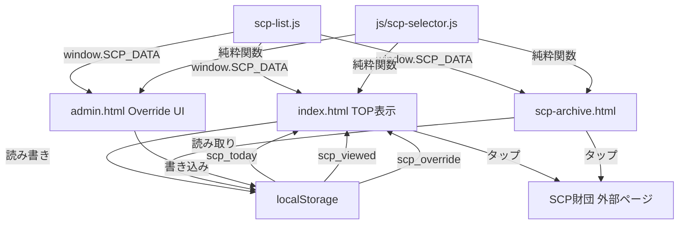

# Design Document: 今日のSCP

## Overview

「今日のSCP」は、既存の「今日のサイエンス」パターンを踏襲したSCP記事の日替わり紹介機能である。SCPの詳細はアプリ内に埋め込まず、SCP財団の外部ページへ直接リンクする。

主要な差異（サイエンスとの比較）:
- 画像なし → 外部URLへの直接リンク（`target="_blank" rel="noopener noreferrer"`）
- 専用表示ページなし → カードタップで外部ページを開く
- データは手動管理（自動生成スクリプト不要）
- SCP選択ロジックは独立モジュール `js/scp-selector.js` に分離

## Architecture



### SCP選択フロー

```mermaid
flowchart TD
    Start[ページ読み込み] --> CheckData{SCP_DATA.length > 0?}
    CheckData -->|No| Hide[セクション非表示]
    CheckData -->|Yes| CheckOverride{scp_override が当日日付<br>かつ ID が SCP_DATA に存在?}
    CheckOverride -->|Yes| UseOverride[override の ID を使用]
    CheckOverride -->|No| CheckToday{scp_today が当日日付<br>かつ ID が SCP_DATA に存在?}
    CheckToday -->|Yes| UseSaved[保存済み ID を使用]
    CheckToday -->|No| CalcUnviewed[未閲覧リスト算出]
    CalcUnviewed --> HasUnviewed{未閲覧 > 0?}
    HasUnviewed -->|Yes| SelectUnviewed[hash&#40;todayStr&#41; % unviewedCount で選択]
    HasUnviewed -->|No| SelectAll[hash&#40;todayStr&#41; % totalCount で選択]
    SelectUnviewed --> SaveToday[scp_today に保存]
    SelectAll --> SaveToday
    UseOverride --> UpdateToday[scp_today も同 ID で更新<br>クリア後も同日中は scp_today が残る]
    UpdateToday --> Display
    UseSaved --> Display[カード表示]
    SaveToday --> Display
```



### Override の寿命

overrideは翌日になると自動的に無効化される（日付不一致で無視される）。`scp_override` に保存された日付が当日と一致しない場合、override は適用されず通常の選択ロジックが走る。これは子供向けの事故防止として、1日限定の設計を意図的に採用している。

override使用時は `scp_today` も同じIDで更新する。overrideクリア後も同日中は `scp_today` が残り、そのIDが表示され続ける（これは正常動作である）。翌日になれば `scp_today` の日付不一致により新規選択が走る。

## Components and Interfaces

### ファイル構成

```
js/
├── scp-selector.js      # SCP選択ロジック（純粋関数モジュール）

data/
├── scp-list.js          # SCP_DATA 定義（手動管理）

pages/
├── scp-archive.html     # SCPアーカイブページ

index.html               # TOPページ（「今日のSCP」セクション追加）
pages/admin.html         # 管理者ページ（SCP Override UI追加）

.kiro/specs/today-scp/
├── requirements.md      # 要件
├── design.md            # 本ドキュメント
└── .config.kiro         # スペック設定
```

### モジュール責務

| ファイル | 責務 |
|---------|------|
| `js/scp-selector.js` | SCP選択・閲覧管理・読了率計算の純粋関数を提供 |
| `data/scp-list.js` | SCP_DATA グローバル変数の提供 |
| `index.html` | TOP表示、localStorage読み書き、scp-selector.js の呼び出し |
| `pages/scp-archive.html` | 全SCP一覧、閲覧状態表示、読了率表示、viewedリスト正規化 |
| `pages/admin.html` | Override UI（指定・クリア） |

### js/scp-selector.js モジュール API

```javascript
/**
 * 簡易ハッシュ関数（日付文字列 → 数値シード）
 * @param {string} str - 入力文字列（例: "2026-06-03"）
 * @returns {number} 非負整数のハッシュ値
 */
function hash(str) → number

/**
 * 当日表示するSCPを選択する（純粋関数）
 * @param {ScpEntry[]} scpData - SCP_DATA配列
 * @param {string[]} viewedIds - 閲覧済みIDリスト
 * @param {{date: string, id: string}|null} override - override設定（nullなら無し）
 * @param {string} todayStr - 当日日付 "YYYY-MM-DD"
 * @returns {string|null} 選択されたSCP ID（データ空ならnull）
 */
function selectScp(scpData, viewedIds, override, todayStr) → string | null

/**
 * 閲覧済みリストにIDを追加（存在確認・重複チェック付き）
 * scpDataに存在しないIDは拒否される
 * @param {string[]} viewedIds - 現在の閲覧済みIDリスト
 * @param {string} id - 追加するSCP ID
 * @param {ScpEntry[]} scpData - SCP_DATA配列（無効ID拒否のため必須）
 * @returns {string[]} 更新後の閲覧済みIDリスト（無効IDの場合は変更なし）
 */
function markViewed(viewedIds, id, scpData) → string[]

/**
 * 読了率を計算する（純粋関数）
 * 戻り値は 0.0〜1.0 の浮動小数点数。表示側で Math.round(rate * 100) してパーセント表示する。
 * viewedIds に SCP_DATA に存在しないIDが含まれる場合は除外して計算する。
 * @param {ScpEntry[]} scpData - SCP_DATA配列
 * @param {string[]} viewedIds - 閲覧済みIDリスト
 * @returns {number} 読了率（0.0〜1.0）
 */
function calcReadRate(scpData, viewedIds) → number

/**
 * SCPエントリのバリデーション
 * @param {object} entry - 検証対象エントリ
 * @returns {boolean} 有効ならtrue
 */
function validateScpEntry(entry) → boolean
```

### 選択アルゴリズム詳細（hash ベース・日付シードによる決定的選択）

従来の `dayOfYear % count` では毎年同じ順番になるため、日付文字列のハッシュ値を使用する。未閲覧集合からの選択・全体からの選択いずれも、当日日付文字列をシードとした決定的アルゴリズムにより選択する:

```javascript
// 簡易ハッシュ関数（djb2ベース）
function hash(str) {
  let h = 5381;
  for (let i = 0; i < str.length; i++) {
    h = ((h << 5) + h) + str.charCodeAt(i);
    h = h & 0x7fffffff; // 正の32bit整数に制限
  }
  return h;
}

// 使用例
const seed = hash('2026-06-03');
const index = seed % unviewed.length;
```

### 共通ヘルパー関数（各ページのインライン）

各ページで使用するlocalStorage読み書き関数（scp-selector.js とは別にページ内で定義）:

```javascript
// 閲覧済みリスト取得（破損時は空配列にフォールバック）
function getScpViewed() {
  try { return JSON.parse(localStorage.getItem('scp_viewed') || '[]'); }
  catch(e) { return []; }
}

// 閲覧済み登録（markViewed純粋関数を利用し、結果をlocalStorageに保存）
function markScpViewed(id) {
  const viewed = getScpViewed();
  const updated = markViewed(viewed, id, window.SCP_DATA);
  if (updated.length !== viewed.length) {
    localStorage.setItem('scp_viewed', JSON.stringify(updated));
  }
}
```

## Data Models

### SCP_DATA エントリ

```typescript
interface ScpEntry {
  id: string;       // 一意識別子（例: "scp-173"）
  number: string;   // SCP番号（例: "SCP-173"）
  title: string;    // 日本語タイトル（例: "彫刻 - オリジナル"）
  url: string;      // 外部URL（例: "https://scp-jp.wikidot.com/scp-173"）
}
```

### localStorage キー

| キー | 形式 | 用途 | 永続性 |
|------|------|------|--------|
| `scp_today` | `{date: "YYYY-MM-DD", id: string}` | 当日固定のSCP ID | 日替わり（override適用時も更新される） |
| `scp_viewed` | `string[]` (JSON配列) | 閲覧済みSCPのIDリスト | 永続 |
| `scp_override` | `{date: "YYYY-MM-DD", id: string}` | 管理者指定SCP ID | 1日限定（翌日自動無効化） |

### scp-list.js フォーマット

```javascript
window.SCP_DATA = [
  {
    "id": "scp-173",
    "number": "SCP-173",
    "title": "彫刻 - オリジナル",
    "url": "https://scp-jp.wikidot.com/scp-173"
  },
  // ...
];
```

## Correctness Properties

*A property is a characteristic or behavior that should hold true across all valid executions of a system—essentially, a formal statement about what the system should do. Properties serve as the bridge between human-readable specifications and machine-verifiable correctness guarantees.*

### Property 1: Selector Determinism（選択の決定性）

*For any* same date string and same inputs (scpData, viewedIds, override), the selector SHALL return the same ID without using external mutable state. `selectScp` は `todayStr` を必ず引数で受け取る純粋関数であり、内部で `new Date()` 等の外部状態を参照しない。

**Validates: Requirements 2.2, 3.2, 8.1**

### Property 2: Override Priority（Override最優先）

*For any* valid override `{date, id}` where date equals today and id exists in SCP_DATA, the selector SHALL return that override ID regardless of the viewed set or other state.

**Validates: Requirements 2.1, 6.3, 8.5**

### Property 3: Unviewed Priority（未閲覧優先選択）

*For any* SCP data list and viewed set where at least one SCP is unviewed, when no valid override exists, the selector SHALL return an ID that is NOT in the viewed set.

**Validates: Requirements 2.1, 8.2**

### Property 4: Viewed List Idempotence（閲覧リスト冪等性）

*For any* SCP ID that exists in SCP_DATA, calling markViewed with that ID any number of times SHALL result in the ID appearing exactly once in the returned viewed array.

**Validates: Requirements 1.3, 4.2, 8.3**

### Property 5: Upper Bound Invariant（閲覧数上界不変条件）

*For any* sequence of markViewed operations, `|scp_viewed ∩ SCP_DATA_IDS| <= |SCP_DATA|` が常に成立する。scp_viewed にはデータ削除等により SCP_DATA に存在しないIDが残る可能性があるが、SCP_DATA に存在するIDの数は SCP_DATA の件数を超えない。

**Validates: Requirements 4.4, 8.4**

### Property 6: Read Rate Correctness（読了率計算の正確性）

*For any* SCP_DATA array and scp_viewed array (which may contain stale IDs not in SCP_DATA), the computed read rate SHALL equal `|scp_viewed ∩ SCP_DATA_IDS| / |SCP_DATA|`.

**Validates: Requirements 5.4, 5.5**

### Property 7: Data Schema Validity（データスキーマ整合性）

*For any* entry in SCP_DATA, the entry SHALL have non-empty `id`, `number`, `title` fields and a `url` field starting with `"https://"`.

**Validates: Requirements 7.1, 7.4, 7.5**

### Property 8: Invalid ID Rejection（無効ID拒否）

*For any* ID that does NOT exist in SCP_DATA, calling markViewed with that ID SHALL return the viewedIds array unchanged（無効IDは登録されない）.

**Validates: Requirements 4.2, 4.4**

## Error Handling

| 状況 | 対処 |
|------|------|
| `SCP_DATA` が空 or 未定義 | SCPセクションを非表示 |
| `scp_viewed` がパース不可 | 空配列 `[]` として扱う |
| `scp_today` がパース不可 | 新規選択を実行 |
| `scp_override` がパース不可 | override無視、通常選択 |
| `scp_today` の ID が SCP_DATA に無い | 新規選択を実行 |
| `scp_override` の ID が SCP_DATA に無い | override無視、通常選択 |
| `markScpViewed` に SCP_DATA に無い ID が渡される | 登録せずにスキップ |

## Testing Strategy

### Property-Based Testing（PBT）

ライブラリ: [fast-check](https://github.com/dubzzz/fast-check)（JavaScript用PBTライブラリ）

`js/scp-selector.js` の純粋関数に対して以下のプロパティテストを実行する:

- 各テストは最低100回のランダム入力で実行
- テストタグ形式: `Feature: today-scp, Property {N}: {title}`

テスト対象の純粋関数（`js/scp-selector.js` からエクスポート）:
```javascript
function hash(str) → number
function selectScp(scpData, viewedIds, override, todayStr) → string | null  // todayStrを引数で受け取る、内部でnew Date()等を参照しない
function markViewed(viewedIds, id, scpData) → string[]  // scpDataで無効ID拒否
function calcReadRate(scpData, viewedIds) → number  // 戻り値 0.0〜1.0
function validateScpEntry(entry) → boolean
```

### Unit Tests（例示テスト）

- TOP表示: SCP_DATAが空の場合にセクション非表示
- アーカイブ: 閲覧済み/未閲覧の表示切替
- Override: 指定・クリア操作の動作確認
- Override寿命: 翌日日付では override が無視されること
- 外部リンク: `target="_blank"` かつ `rel="noopener noreferrer"` の確認
- 無効ID: SCP_DATAに存在しないIDで markScpViewed を呼んでも登録されないこと
- hash関数: 同じ文字列で同じ値、異なる文字列で異なる値を返すこと

### Edge Cases

- `scp_viewed` が不正JSON（`"abc"`）→ 空配列フォールバック
- `scp_today` が不正JSON → 新規選択を実行
- `scp_override` が不正JSON → override無視、通常選択
- `scp_override` のIDがSCP_DATAに存在しない → 無視
- `scp_today` のIDがSCP_DATAから削除された → 再選択
- 全SCP閲覧済み → hash(todayStr) % totalCount で全体から選択
- `markScpViewed` にSCP_DATAに存在しないIDを渡す → 登録せずスキップ
- 外部リンクに `rel="noopener noreferrer"` が欠落 → セキュリティリスク（テストで検出）
- アーカイブ表示時に `viewed.filter(id => scpData.some(s => s.id === id))` で正規化し、削除済みSCPのIDを除外
