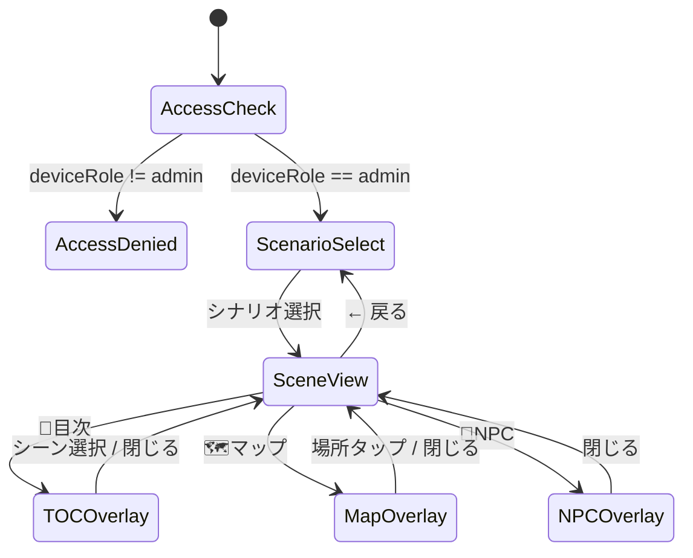
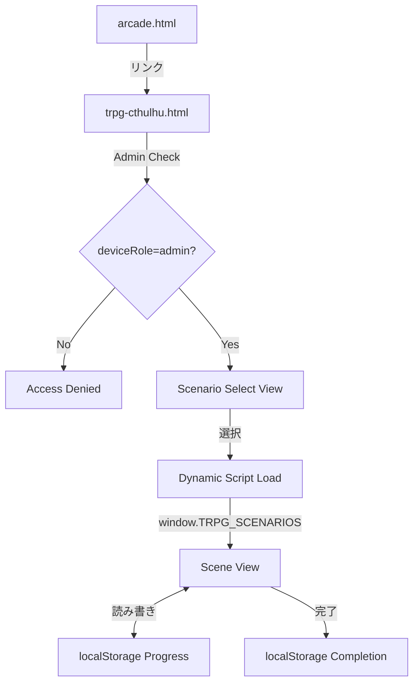

# Design Document: TRPG Cthulhu Scenario Reader

## Overview

KP（キーパー）向けTRPGシナリオリーダー。管理者がスマホでシナリオを参照しながら口頭でセッションを進行するためのツール。ゲームブック方式（選択肢分岐）ではなく、KPが自由にシーン間を移動し、PLの行動に応じて適切なシーンを開く設計。

### 主要特徴
- 管理者限定アクセス（deviceRole='admin'）
- シナリオ選択 → シーン表示のSPA風ビュー切り替え
- 自由遷移（TOC/マップ/関連シーンから任意のシーンへ）
- KPメモ（判定値・NPC指針）の折りたたみ表示
- SVG/CSSマップ（場所ノード＋接続線）
- NPC一覧（折りたたみ詳細）
- フェーズ別目次（キーワードフィルタ付き）
- 進行状態のlocalStorage保存（シナリオごと独立）
- Dynamic script load（`window.TRPG_SCENARIOS[id]`方式）
- クトゥルフ風ダークテーマ
- フォントサイズ変更

### 技術スタック
- 単一HTML（`pages/trpg-cthulhu.html`）+ 外部シナリオJS（`js/trpg-poisoned-soup-scenario.js`）
- Supabase: game_settings.game_publish の読み取りのみ（arcade.html側）
- localStorage: 進行状態・完了状態・フォントサイズ
- 外部ライブラリなし（Vanilla JS + CSS + inline SVG）

## Architecture

### ビュー構成（SPA風切り替え）



### ファイル構成

```
pages/trpg-cthulhu.html       # メインHTML（全ビュー・ロジック含む）
js/trpg-poisoned-soup-scenario.js  # 「毒入りスープ」シナリオデータ
```

### データフロー



### 設計方針

1. **既存パターン踏襲**: arcade.html のカード形式、olimar.html のヘッダー構造、common.js の共通ユーティリティを参考
2. **自己完結**: Supabase依存なし（arcade.html側のgame_publish制御のみ）。オフラインでも動作
3. **拡張容易**: シナリオ追加 = JSファイル追加 + Registry配列に1エントリ追加のみ
4. **モバイルファースト**: max-width 420px、タッチ操作最適化

### オフライン仕様

- 初回ロードにはネットワーク接続が必要（HTML + シナリオJSの取得）
- 一度ロードされたページとシナリオスクリプトは、ブラウザキャッシュ（既存sw.jsのネットワーク優先戦略）により以降オフラインでも利用可能
- localStorage操作はすべてオフラインで動作

### アクセス制御の詳細

- Access denied 状態ではシナリオスクリプトのロードを一切行わない（URLの直打ち対策）
- checkAccess() は view 切り替えのみ（リダイレクトなし）。SPA内で完結

## Components and Interfaces

### 1. AccessGuard

管理者チェック。ページロード時に即座に判定。

```javascript
function checkAccess() {
  if (localStorage.getItem('deviceRole') !== 'admin') {
    showView('access-denied');
    return false;
  }
  return true;
}
```

### 2. ScenarioSelect（シナリオ選択画面）

HTML内に定義された `SCENARIO_REGISTRY` 配列を元にカード一覧を描画。

```javascript
const SCENARIO_REGISTRY = [
  {
    id: "poisoned_soup",
    title: "毒入りスープ",
    description: "初心者向け・1セッション完結",
    estimatedTime: "60-90分",
    playerCount: "2-4人",
    icon: "🦑",
    file: "js/trpg-poisoned-soup-scenario.js"
  }
];
```

**責務:**
- Registry からカード描画
- Progress_State / Completion_State の読み取りでステータス表示
- シナリオ選択時に ScenarioLoader を呼び出し

### 3. ScenarioLoader（動的スクリプトロード）

連打による二重ロード防止のため、pending Promise を共有する。

```javascript
const pendingLoads = new Map();

async function loadScenario(registryEntry) {
  const id = registryEntry.id;
  // 既にロード済みならスキップ
  if (window.TRPG_SCENARIOS && window.TRPG_SCENARIOS[id]) {
    return window.TRPG_SCENARIOS[id];
  }
  // 既にロード中ならPromise共有（連打対策）
  if (pendingLoads.has(id)) {
    return pendingLoads.get(id);
  }
  // script要素注入 + 5000msタイムアウト
  const promise = new Promise((resolve, reject) => {
    const script = document.createElement('script');
    script.src = '../' + registryEntry.file;
    const timer = setTimeout(() => {
      script.remove();
      pendingLoads.delete(id);
      reject(new Error('Script load timeout'));
    }, 5000);
    script.onload = () => {
      clearTimeout(timer);
      pendingLoads.delete(id);
      const data = window.TRPG_SCENARIOS && window.TRPG_SCENARIOS[id];
      data ? resolve(data) : reject(new Error('Scenario not registered'));
    };
    script.onerror = () => {
      clearTimeout(timer);
      script.remove();
      pendingLoads.delete(id);
      reject(new Error('Script load failed'));
    };
    document.head.appendChild(script);
  });
  pendingLoads.set(id, promise);
  return promise;
}
```

### 4. ScenarioValidator（データ検証）

ロード後にシナリオデータの整合性を検証。

```javascript
function validateScenario(data) {
  const errors = [];
  // startNode存在チェック
  if (!data.nodes[data.startNode]) errors.push(`startNode "${data.startNode}" not found`);
  // relatedScenes参照チェック
  Object.values(data.nodes).forEach(node => {
    (node.relatedScenes || []).forEach(ref => {
      if (!data.nodes[ref]) errors.push(`Node "${node.id}": relatedScene "${ref}" not found`);
    });
  });
  // phase存在チェック（node → phases）
  const phaseIds = data.phases.map(p => p.id);
  Object.values(data.nodes).forEach(node => {
    if (!phaseIds.includes(node.phase)) errors.push(`Node "${node.id}": phase "${node.phase}" not found`);
  });
  // phases[].nodes 存在チェック（phases → nodes）
  data.phases.forEach(p => {
    p.nodes.forEach(nodeId => {
      if (!data.nodes[nodeId]) errors.push(`Phase "${p.id}": node "${nodeId}" not found`);
    });
  });
  // 全ノードがいずれかのphaseに属するかチェック
  const allPhaseNodeIds = new Set(data.phases.flatMap(p => p.nodes));
  Object.keys(data.nodes).forEach(nodeId => {
    if (!allPhaseNodeIds.has(nodeId)) errors.push(`Node "${nodeId}" is not listed in any phase`);
  });
  // location存在チェック（map定義時のみ）
  if (data.map) {
    const locIds = data.map.locations.map(l => l.id);
    Object.values(data.nodes).forEach(node => {
      if (node.location && !locIds.includes(node.location)) errors.push(`Node "${node.id}": location "${node.location}" not found`);
    });
  }
  return errors;
}
```

### 5. ProgressManager（進行状態管理）

```javascript
const ProgressManager = {
  _key(scenarioId) { return `trpg_cthulhu_progress_${scenarioId}`; },
  _completionKey(scenarioId) { return `trpg_cthulhu_completed_${scenarioId}`; },

  load(scenarioId) {
    try {
      const raw = localStorage.getItem(this._key(scenarioId));
      return raw ? JSON.parse(raw) : null;
    } catch { return null; }
  },

  save(scenarioId, state) {
    state.updatedAt = Date.now();
    localStorage.setItem(this._key(scenarioId), JSON.stringify(state));
  },

  reset(scenarioId) {
    localStorage.removeItem(this._key(scenarioId));
  },

  markCompleted(scenarioId) {
    localStorage.setItem(this._completionKey(scenarioId), JSON.stringify({ completed: true, completedAt: Date.now() }));
  },

  isCompleted(scenarioId) {
    try {
      const raw = localStorage.getItem(this._completionKey(scenarioId));
      return raw ? JSON.parse(raw).completed === true : false;
    } catch { return false; }
  },

  hasProgress(scenarioId) {
    return this.load(scenarioId) !== null;
  }
};
```

### 6. SceneRenderer（シーン描画）

**責務:**
- Scene_Node の text[] を段落表示
- KP_Note の折りたたみ表示
- relatedScenes のボタン描画
- 現在ノードID・フェーズ名の表示

### 7. MapRenderer（マップ描画）

SVGベースの場所ノード＋接続線描画。

```javascript
function renderMap(mapData, currentLocation, visitedNodeIds, nodes) {
  // SVG viewBox: 0 0 100 100（%座標）
  // locations → circle + text
  // connections → line（双方向）
  // currentLocation → ハイライト色
  // visited locations → 別色
  // location is "visited" iff ANY node at that location is in visitedNodeIds
}
```

**visited判定**: `location is visited` ⟺ そのlocationを持つノードが1つでも `visitedNodeIds` に含まれる。

**マップタップ時のナビゲーション**: 現在のノードをhistoryに積んでから遷移する。

### 8. TOCRenderer（目次描画）

フェーズ別グループ化 + キーワードフィルタ。

**表示順**: `phases[].nodes` の定義順に従う。
**フィルタ対象**: `node.title` のみ（case-insensitive substring match）。
**ナビゲーション**: TOCからシーン選択時、現在ノードをhistoryに積んでから遷移する。

### 9. NPCRenderer（NPC一覧描画）

折りたたみ式NPC詳細表示。

### 10. FontSizeManager（フォントサイズ管理）

CSS custom property 方式で安全にフォントサイズを適用。DOM要素の存在に依存しない。

```javascript
const FontSizeManager = {
  KEY: 'trpg_cthulhu_font_size',
  SIZES: { small: '0.85em', medium: '0.95em', large: '1.1em' },
  get() { return localStorage.getItem(this.KEY) || 'medium'; },
  set(size) { localStorage.setItem(this.KEY, size); this.apply(size); },
  apply(size) {
    document.documentElement.style.setProperty('--scene-font-size', this.SIZES[size]);
  }
};
```

CSS側:
```css
.scene-text { font-size: var(--scene-font-size, 0.95em); }
.kp-note-content { font-size: var(--scene-font-size, 0.95em); }
```

## Data Models

### Scenario_Registry Entry（HTML内定義）

| Field | Type | Description |
|-------|------|-------------|
| id | string | シナリオ一意ID |
| title | string | 表示タイトル |
| description | string | 短い説明 |
| estimatedTime | string | 想定プレイ時間 |
| playerCount | string | 推奨人数 |
| icon | string | 絵文字アイコン |
| file | string | JSファイルパス（js/から） |

### Scenario_Data（外部JSファイル）

```typescript
interface ScenarioData {
  id: string;
  title: string;
  startNode: string;
  phases: Phase[];
  npcs?: NPC[];
  map?: MapData;
  nodes: Record<string, SceneNode>;
}

interface Phase {
  id: string;
  title: string;
  nodes: string[];  // ノードID配列（表示順）
}

interface NPC {
  id: string;
  name: string;
  age: number;
  description: string;
  defaultLocation: string;
  secret: string;
}

interface MapData {
  locations: MapLocation[];
  connections: MapConnection[];
}

interface MapLocation {
  id: string;
  label: string;
  x: number;  // 0-100 (%)
  y: number;  // 0-100 (%)
}

interface MapConnection {
  from: string;
  to: string;
  directional?: boolean;  // default: false (bidirectional)
}

interface SceneNode {
  id: string;
  title: string;
  phase: string;
  location?: string;
  text: string[];
  kpNote?: string;
  relatedScenes?: string[];
  handouts?: Handout[];
}

interface Handout {
  id: string;
  title: string;
  type: "text" | "image";
  content: string;  // text: 本文, image: URL/path
}
```

### Progress_State（localStorage）

```typescript
interface ProgressState {
  currentNodeId: string;
  visitedNodeIds: string[];  // Set-like, no duplicates
  history: string[];         // stack for Back navigation
  phase: string;
  updatedAt: number;         // Date.now()
}
```

Key: `trpg_cthulhu_progress_{scenarioId}`

### Completion_State（localStorage）

```typescript
interface CompletionState {
  completed: boolean;
  completedAt: number;  // Date.now()
}
```

Key: `trpg_cthulhu_completed_{scenarioId}`

### Font Size Setting（localStorage）

Key: `trpg_cthulhu_font_size`
Values: `"small"` | `"medium"` | `"large"`


## Correctness Properties

*A property is a characteristic or behavior that should hold true across all valid executions of a system—essentially, a formal statement about what the system should do. Properties serve as the bridge between human-readable specifications and machine-verifiable correctness guarantees.*

### Property 1: Scenario validation catches all reference errors

*For any* scenario data object, the validator SHALL report an error for every case where: (a) startNode does not exist in nodes, (b) a relatedScenes entry references a non-existent node, (c) a node's phase does not exist in phases[], (d) a node's location does not exist in map.locations (when map is defined), (e) a phases[].nodes entry references a non-existent node, or (f) a node is not listed in any phase. Conversely, a fully valid scenario SHALL produce zero errors.

**Validates: Requirements 8.1, 8.2, 8.3, 8.4, 7.2, 7.3**

### Property 2: Progress state save/load round-trip

*For any* valid Progress_State object (containing currentNodeId, visitedNodeIds[], history[], phase, updatedAt), saving it to localStorage and then loading it back SHALL produce an equivalent object.

**Validates: Requirements 9.1, 9.2, 9.6**

### Property 3: Navigation pushes current node to history

*For any* current scene and any target scene, navigating from current to target SHALL result in the history stack having the current node appended to its end, and the new currentNodeId being the target.

**Validates: Requirements 3.4**

### Property 4: Back pops from history stack

*For any* non-empty history stack, pressing Back SHALL navigate to the last element of the history stack, remove that element from the stack, and set it as currentNodeId.

**Validates: Requirements 3.5**

### Property 5: Scenario progress independence

*For any* two distinct scenario IDs and any Progress_State, saving progress for one scenario SHALL NOT modify the stored progress of the other scenario.

**Validates: Requirements 9.5**

### Property 6: Reset preserves completion state

*For any* scenario that has both a Progress_State and a Completion_State stored, resetting progress SHALL remove the Progress_State but leave the Completion_State unchanged.

**Validates: Requirements 9.7, 13.5**

### Property 7: Invalid JSON fallback

*For any* non-JSON string stored in the progress localStorage key, loading progress SHALL return null (triggering startNode display) rather than throwing an error.

**Validates: Requirements 8.7**

### Property 8: TOC ordering matches phases definition

*For any* scenario data, the TOC listing SHALL display nodes grouped by phase in the exact order defined by `phases[].nodes` arrays.

**Validates: Requirements 10.2**

### Property 9: TOC keyword filtering

*For any* keyword string and any scenario data, the filtered TOC SHALL show exactly those nodes whose title contains the keyword as a substring (case-insensitive).

**Validates: Requirements 10.5**

### Property 10: Map connections are bidirectional by default

*For any* map connection without `directional: true`, both endpoints SHALL be reachable from each other (i.e., if location A connects to B, then B also connects to A).

**Validates: Requirements 5.4**

### Property 11: Font size persistence round-trip

*For any* font size option (small/medium/large), setting it SHALL immediately apply the corresponding CSS value to text content, and reloading SHALL restore the same setting from localStorage.

**Validates: Requirements 14.2, 14.3**

## Error Handling

### Script Load Errors
- **Timeout (5000ms)**: script要素を削除し、エラーメッセージ表示。Scenario_Selectに留まる
- **Network error / 404**: onerrorハンドラでキャッチ。同上
- **Script loaded but scenario not registered**: `window.TRPG_SCENARIOS[id]` が undefined の場合エラー

### Data Validation Errors
- validateScenario() がエラーを返した場合、エラー内容をリスト表示し Scenario_Select に戻る
- クラッシュ防止: try-catch で全体をラップ

### localStorage Errors
- JSON.parse 失敗: Progress_State を破棄し startNode から開始
- localStorage 容量超過: 古い進行データの上書きで対応（実質問題にならないサイズ）
- Completion_State の parse 失敗: 未完了として扱う

### UI エラー表示
- エラーメッセージは `.error-toast` クラスで画面上部に3秒表示
- 致命的エラー（シナリオロード失敗）は Scenario_Select 画面にインラインで表示

## Testing Strategy

### Unit Tests（example-based）

以下の具体的なケースをテスト:
- AccessGuard: admin/non-admin の2パターン
- ScenarioLoader: 正常ロード、タイムアウト、ネットワークエラー、既存データ再利用
- SceneRenderer: KP_Note あり/なし、relatedScenes あり/なし
- MapRenderer: マップあり/なし、単一ノード場所/複数ノード場所
- NPCRenderer: NPC あり/なし、展開/折りたたみ
- 完了管理: セッション終了ボタン表示条件（ending phase のみ）
- Reset: 確認ダイアログ表示、Progress クリア、Completion 維持

### Property-Based Tests

Property-based testing library: **fast-check**（JavaScript）

各プロパティテストは最低100イテレーション実行。テストタグ形式:

```
Feature: trpg-cthulhu-poisoned-soup, Property {N}: {property_text}
```

テスト対象の純粋関数:
1. `validateScenario(data)` — シナリオデータ検証
2. `ProgressManager.save/load` — 進行状態の永続化
3. `navigateTo(state, targetNodeId)` — ナビゲーション状態遷移
4. `goBack(state)` — Back操作の状態遷移
5. `filterTOC(nodes, phases, keyword)` — TOCフィルタリング
6. `getReachableLocations(connections, locationId)` — マップ接続の双方向性
7. `FontSizeManager.set/get` — フォントサイズ永続化

### Integration Tests

- arcade.html でのカード表示/非表示（game_publish + deviceRole）
- Dynamic script injection の実際の動作
- localStorage の実際の読み書き

### Manual Testing

- スマホ実機でのタッチ操作確認
- ダークテーマの視認性確認
- オフライン動作確認（シナリオロード後）

## Behavioral Clarifications

- **Reset後の表示**: Reset は即座に startNode を表示する（Scenario_Select には戻らない）
- **Map navigation**: マップからのシーン遷移も history に積む（Back で戻れる）
- **TOC filter 対象**: `node.title` のみ（kpNote や text は対象外）
- **Map visited 判定**: location が visited ⟺ その location を持つノードが1つでも visitedNodeIds に含まれる
