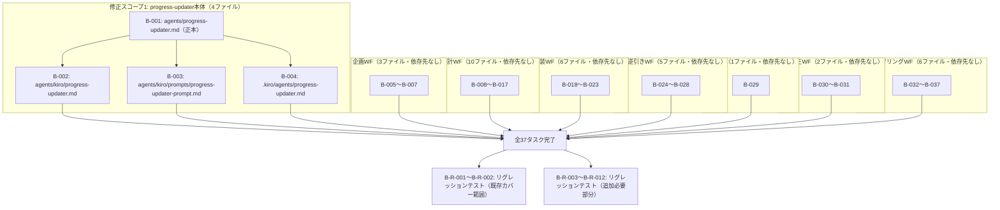

# 差分タスクリスト

## 対策種別
根本対策（fix-plan.md より引き継ぎ）

**判定理由（fix-plan.md より引き継ぎ）:** 本バグの原因は「進捗ファイルが存在しない場合に、誰が・どこで新しく作るかが手順書に定義されていない」という構造的な欠落です。今回の修正は、`progress-updater` の write モードに新規作成処理を追加し、全7WFのSKILL.mdに `progress_file_path` の明示指定を追加するものであり、原因そのものを取り除きます。特定症状の回避や例外の握りつぶしではないため、暫定対策には該当しません。

**注記:** 本バグ修正は全てMarkdown手順書（`agents/*.md`、`skills/*/SKILL.md`）の記述変更であり、クラス・publicメソッドという概念は存在しません。1ファイル=1親タスクとし、サブタスクは設けません。

## 依存関係グラフ

**並列実行可能性:**
- B-001 完了後、B-002・B-003・B-004 は並列実行可能（異なるファイル・同一内容の反映のみ）
- B-005〜B-037（33ファイル）は、B-001〜B-004 および互いに対して同一ファイルを変更しないため、全て依存先なしで並列起動可能
- リグレッションテスト（B-R-001〜B-R-012）は全37タスク完了後に実行する

## タスク一覧

### 修正スコープ1: progress-updater本体

### タスク B-001: agents/progress-updater.md（正本）への write モード新規作成処理（W1.5）追加
- 種別: 既存変更
- 対象ファイル: agents/progress-updater.md
- テストファイル: なし（自動テスト未導入。動作確認はリグレッションテストタスク B-R-003〜B-R-009 参照）
- 依存先: なし
- 設計参照: fix-design-progress-updater.md の「変更対象1: agents/progress-updater.md（正本）— write モード実行フロー」（before→after）
- テスト観点:
  - 実行フロー表に W1.5（進捗ファイル新規作成）行が W1 と W2 の間に追加されていること
  - W1.5 の詳細手順（正規表現によるWF識別子抽出→マッピング表参照→テンプレート構築→Write）が before→after の after 通りに記述されていること
  - W2 の記述が「W1.5で新規作成した場合はチェックをスキップする」旨に更新されていること
  - verify / fix_open / fix_close モードのセクションに一切変更がないこと（fix-plan.md の方針: verifyモード無修正の遵守確認）

### タスク B-002: agents/kiro/progress-updater.md への同期反映
- 種別: 既存変更
- 対象ファイル: agents/kiro/progress-updater.md
- テストファイル: なし（自動テスト未導入。動作確認はリグレッションテストタスク B-R-004〜B-R-005 参照）
- 依存先: B-001
- 設計参照: fix-design-progress-updater.md の「変更対象2: agents/kiro/progress-updater.md（Kiro IDE配布用・同期対象）」
- テスト観点:
  - write モードの本文が B-001 適用後の agents/progress-updater.md と一字一句同一であること
  - フロントマター（`tools: ["@builtin"]`）が変更されていないこと

### タスク B-003: agents/kiro/prompts/progress-updater-prompt.md への同期反映
- 種別: 既存変更
- 対象ファイル: agents/kiro/prompts/progress-updater-prompt.md
- テストファイル: なし（自動テスト未導入。動作確認はリグレッションテストタスク B-R-004〜B-R-005 参照）
- 依存先: B-001
- 設計参照: fix-design-progress-updater.md の「変更対象3: agents/kiro/prompts/progress-updater-prompt.md（Kiro CLI配布用・同期対象）」
- テスト観点:
  - write モードの本文が B-001 適用後の agents/progress-updater.md と一字一句同一であること
  - フロントマターなしの構造（本文が「あなたは『進捗アップデーター』です。」から直接始まる構造）が維持されていること

### タスク B-004: .kiro/agents/progress-updater.md への同期反映
- 種別: 既存変更
- 対象ファイル: .kiro/agents/progress-updater.md
- テストファイル: なし（自動テスト未導入。動作確認はリグレッションテストタスク B-R-003〜B-R-009 参照）
- 依存先: B-001
- 設計参照: fix-design-progress-updater.md の「変更対象4: .kiro/agents/progress-updater.md（ワークスペース配布済みコピー・同期対象）」
- テスト観点:
  - write モードの本文が B-001 適用後の agents/progress-updater.md と一字一句同一であること
  - フロントマター構造が B-002 と同様に維持されていること
  - 本ファイルはワークスペースへの実行時配布コピーであり、リグレッションテスト実施の前提として同期が完了していること

### 修正スコープ2: 企画WF（progress_file_path 明示指定追加）

### タスク B-005: skills/fs-planning-phase1-intake-and-init/SKILL.md への progress_file_path 明示指定追加
- 種別: 既存変更
- 対象ファイル: skills/fs-planning-phase1-intake-and-init/SKILL.md
- テストファイル: なし（自動テスト未導入。動作確認はリグレッションテストタスク B-R-009, B-R-012 参照）
- 依存先: なし
- 設計参照: fix-design-skill-progress-path-planning.md の「対象ファイル1」（before→after）
- テスト観点:
  - 後処理の `phase-report-check (aide-powers skill: write)` 呼び出し文に `呼び出し時に progress_file_path=`.aide/specs/{feature_name}/planning-progress.md` を渡す。` が追加されていること
  - 既存の記載文言（「フェーズ完了検証結果(後処理):」等）が変更されていないこと

### タスク B-006: skills/fs-planning-phase2-explore/SKILL.md への progress_file_path 明示指定追加
- 種別: 既存変更
- 対象ファイル: skills/fs-planning-phase2-explore/SKILL.md
- テストファイル: なし
- 依存先: なし
- 設計参照: fix-design-skill-progress-path-planning.md の「対象ファイル2」（before→after）
- テスト観点:
  - 後処理の `phase-report-check (write)` 呼び出し文に progress_file_path 明示指定が追加されていること
  - 探索ループ（Step7）中の git-commit-workflow 呼び出しには変更が及んでいないこと

### タスク B-007: skills/fs-planning-phase3-finalize/SKILL.md への progress_file_path 明示指定追加
- 種別: 既存変更
- 対象ファイル: skills/fs-planning-phase3-finalize/SKILL.md
- テストファイル: なし
- 依存先: なし
- 設計参照: fix-design-skill-progress-path-planning.md の「対象ファイル3」（before→after）
- テスト観点:
  - 後処理の `phase-report-check (write)` 呼び出し文に progress_file_path 明示指定が追加されていること
  - fix_close（修正履歴クローズ処理）セクションが対象外であり変更されていないこと

### 修正スコープ2: 設計WF（progress_file_path 明示指定追加）

### タスク B-008: skills/fs-design-phase1-user-req/SKILL.md への progress_file_path 明示指定追加
- 種別: 既存変更
- 対象ファイル: skills/fs-design-phase1-user-req/SKILL.md
- テストファイル: なし
- 依存先: なし
- 設計参照: fix-design-skill-progress-path-design.md の「対象ファイル1」（before→after）
- テスト観点:
  - 後処理の `phase-report-check (write)` 呼び出し文に `progress_file_path=`.aide/specs/{feature_name}/design-progress.md` を渡す。` が追加されていること

### タスク B-009: skills/fs-design-phase2-system-req/SKILL.md への progress_file_path 明示指定追加
- 種別: 既存変更
- 対象ファイル: skills/fs-design-phase2-system-req/SKILL.md
- テストファイル: なし
- 依存先: なし
- 設計参照: fix-design-skill-progress-path-design.md の「対象ファイル2」（before→after）
- テスト観点:
  - 後処理の `phase-report-check (write)` 呼び出し文に progress_file_path 明示指定が追加されていること

### タスク B-010: skills/fs-design-phase3-dev-plan/SKILL.md への progress_file_path 明示指定追加
- 種別: 既存変更
- 対象ファイル: skills/fs-design-phase3-dev-plan/SKILL.md
- テストファイル: なし
- 依存先: なし
- 設計参照: fix-design-skill-progress-path-design.md の「対象ファイル3」（before→after）
- テスト観点:
  - 後処理の `phase-report-check (write)` 呼び出し文に progress_file_path 明示指定が追加されていること
  - ゲート1のREJECTED修正委譲経路（phase1/phase2へのfixモード委譲）には変更が及んでいないこと

### タスク B-011: skills/fs-design-phase4-architecture/SKILL.md への progress_file_path 明示指定追加
- 種別: 既存変更
- 対象ファイル: skills/fs-design-phase4-architecture/SKILL.md
- テストファイル: なし
- 依存先: なし
- 設計参照: fix-design-skill-progress-path-design.md の「対象ファイル4」（before→after）
- テスト観点:
  - 後処理の `phase-report-check (write)` 呼び出し文に progress_file_path 明示指定が追加されていること

### タスク B-012: skills/fs-design-phase5-gui/SKILL.md への progress_file_path 明示指定追加
- 種別: 既存変更
- 対象ファイル: skills/fs-design-phase5-gui/SKILL.md
- テストファイル: なし
- 依存先: なし
- 設計参照: fix-design-skill-progress-path-design.md の「対象ファイル5」（before→after）
- テスト観点:
  - 後処理の `phase-report-check (write)` 呼び出し文に progress_file_path 明示指定が追加されていること
  - GUIスキップ分岐（完了ステータスB）でも後処理が通常通り実行される記述に影響がないこと

### タスク B-013: skills/fs-design-phase6-usecase/SKILL.md への progress_file_path 明示指定追加
- 種別: 既存変更
- 対象ファイル: skills/fs-design-phase6-usecase/SKILL.md
- テストファイル: なし
- 依存先: なし
- 設計参照: fix-design-skill-progress-path-design.md の「対象ファイル6」（before→after）
- テスト観点:
  - 後処理の `phase-report-check (write)` 呼び出し文に progress_file_path 明示指定が追加されていること

### タスク B-014: skills/fs-design-phase7-ddd/SKILL.md への progress_file_path 明示指定追加
- 種別: 既存変更
- 対象ファイル: skills/fs-design-phase7-ddd/SKILL.md
- テストファイル: なし
- 依存先: なし
- 設計参照: fix-design-skill-progress-path-design.md の「対象ファイル7」（before→after）
- テスト観点:
  - 後処理の `phase-report-check (write)` 呼び出し文に progress_file_path 明示指定が追加されていること
  - ゲート2のREJECTED修正ループ（design-qa-dispatch再実行）には変更が及んでいないこと

### タスク B-015: skills/fs-design-phase8-object/SKILL.md への progress_file_path 明示指定追加
- 種別: 既存変更
- 対象ファイル: skills/fs-design-phase8-object/SKILL.md
- テストファイル: なし
- 依存先: なし
- 設計参照: fix-design-skill-progress-path-design.md の「対象ファイル8」（before→after）
- テスト観点:
  - 後処理の `phase-report-check (write)` 呼び出し文に progress_file_path 明示指定が追加されていること
  - 5サブフェーズ+gate3構成のうち、フェーズ全体後処理1箇所のみに追加されていること

### タスク B-016: skills/fs-design-phase9-infra/SKILL.md への progress_file_path 明示指定追加
- 種別: 既存変更
- 対象ファイル: skills/fs-design-phase9-infra/SKILL.md
- テストファイル: なし
- 依存先: なし
- 設計参照: fix-design-skill-progress-path-design.md の「対象ファイル9」（before→after）
- テスト観点:
  - 後処理の `phase-report-check (write)` 呼び出し文に progress_file_path 明示指定が追加されていること

### タスク B-017: skills/fs-design-phase10-program/SKILL.md への progress_file_path 明示指定追加
- 種別: 既存変更
- 対象ファイル: skills/fs-design-phase10-program/SKILL.md
- テストファイル: なし
- 依存先: なし
- 設計参照: fix-design-skill-progress-path-design.md の「対象ファイル10」（before→after）
- テスト観点:
  - 後処理の `phase-report-check (write)` 呼び出し文に progress_file_path 明示指定が追加されていること
  - ゲート4のREJECTED委譲経路（phase1/4/5/7/8/9へのfixモード委譲）には変更が及んでいないこと

### 修正スコープ2: 実装WF（progress_file_path 明示指定追加）

### タスク B-018: skills/fs-impl-phase1-gate/SKILL.md への progress_file_path 明示指定追加
- 種別: 既存変更
- 対象ファイル: skills/fs-impl-phase1-gate/SKILL.md
- テストファイル: なし
- 依存先: なし
- 設計参照: fix-design-skill-progress-path-impl.md の「対象ファイル1」（before→after）
- テスト観点:
  - 後処理の `phase-report-check (write)` 呼び出し文に `progress_file_path=`.aide/specs/{feature_name}/impl-progress.md` を渡す。` が追加されていること

### タスク B-019: skills/fs-impl-phase2-preparation/SKILL.md への progress_file_path 明示指定追加
- 種別: 既存変更
- 対象ファイル: skills/fs-impl-phase2-preparation/SKILL.md
- テストファイル: なし
- 依存先: なし
- 設計参照: fix-design-skill-progress-path-impl.md の「対象ファイル2」（before→after）
- テスト観点:
  - 後処理の `phase-report-check (write)` 呼び出し文に progress_file_path 明示指定が追加されていること

### タスク B-020: skills/fs-impl-phase3-gui-mockup/SKILL.md への progress_file_path 明示指定追加
- 種別: 既存変更
- 対象ファイル: skills/fs-impl-phase3-gui-mockup/SKILL.md
- テストファイル: なし
- 依存先: なし
- 設計参照: fix-design-skill-progress-path-impl.md の「対象ファイル3」（before→after）
- テスト観点:
  - 後処理の `phase-report-check (write)` 呼び出し文に progress_file_path 明示指定が追加されていること
  - GUI無し/スキップ/通常完了の3分岐（完了ステータスA/B/C）いずれでも後処理は共通実行される記述であること

### タスク B-021: skills/fs-impl-phase4-execution/SKILL.md への progress_file_path 明示指定追加
- 種別: 既存変更
- 対象ファイル: skills/fs-impl-phase4-execution/SKILL.md
- テストファイル: なし
- 依存先: なし
- 設計参照: fix-design-skill-progress-path-impl.md の「対象ファイル4」（before→after）
- テスト観点:
  - 後処理の `phase-report-check (write)` 呼び出し文に progress_file_path 明示指定が追加されていること

### タスク B-022: skills/fs-impl-phase5-final-check/SKILL.md への progress_file_path 明示指定追加
- 種別: 既存変更
- 対象ファイル: skills/fs-impl-phase5-final-check/SKILL.md
- テストファイル: なし
- 依存先: なし
- 設計参照: fix-design-skill-progress-path-impl.md の「対象ファイル5」（before→after）
- テスト観点:
  - 既存の `required_items` を渡す記述文に `progress_file_path=`.aide/specs/{feature_name}/impl-progress.md` を渡し、` が追加された形になっていること（既存の他パラメータ受け渡し記述と共存していること）
  - 「レポート記載項目リスト」セクション自体には変更が及んでいないこと

### タスク B-023: skills/fs-impl-phase6-doc-generation/SKILL.md への progress_file_path 明示指定追加
- 種別: 既存変更
- 対象ファイル: skills/fs-impl-phase6-doc-generation/SKILL.md
- テストファイル: なし
- 依存先: なし
- 設計参照: fix-design-skill-progress-path-impl.md の「対象ファイル6」（before→after）
- テスト観点:
  - 後処理の `phase-report-check (write)` 呼び出し文に progress_file_path 明示指定が追加されていること

### 修正スコープ2: 設計逆引きWF（progress_file_path 明示指定追加）

### タスク B-024: skills/fs-reverse-phase1-program/SKILL.md への progress_file_path 明示指定追加
- 種別: 既存変更
- 対象ファイル: skills/fs-reverse-phase1-program/SKILL.md
- テストファイル: なし
- 依存先: なし
- 設計参照: fix-design-skill-progress-path-reverse.md の「対象ファイル1」（before→after）
- テスト観点:
  - 後処理の `phase-report-check (write)` 呼び出し文に `progress_file_path=`.aide/specs/{feature_name}/reverse-progress.md` を渡す。` が追加されていること
  - 3パス解析ループ（Step1〜4）には変更が及んでおらず、後処理1箇所のみへの追加であること

### タスク B-025: skills/fs-reverse-phase2-dev-env/SKILL.md への progress_file_path 明示指定追加
- 種別: 既存変更
- 対象ファイル: skills/fs-reverse-phase2-dev-env/SKILL.md
- テストファイル: なし
- 依存先: なし
- 設計参照: fix-design-skill-progress-path-reverse.md の「対象ファイル2」（before→after）
- テスト観点:
  - 後処理の `phase-report-check (write)` 呼び出し文に progress_file_path 明示指定が追加されていること

### タスク B-026: skills/fs-reverse-phase3-system-req/SKILL.md への progress_file_path 明示指定追加
- 種別: 既存変更
- 対象ファイル: skills/fs-reverse-phase3-system-req/SKILL.md
- テストファイル: なし
- 依存先: なし
- 設計参照: fix-design-skill-progress-path-reverse.md の「対象ファイル3」（before→after）
- テスト観点:
  - 後処理の `phase-report-check (write)` 呼び出し文に progress_file_path 明示指定が追加されていること

### タスク B-027: skills/fs-reverse-phase4-user-req/SKILL.md への progress_file_path 明示指定追加
- 種別: 既存変更
- 対象ファイル: skills/fs-reverse-phase4-user-req/SKILL.md
- テストファイル: なし
- 依存先: なし
- 設計参照: fix-design-skill-progress-path-reverse.md の「対象ファイル4」（before→after）
- テスト観点:
  - 後処理の `phase-report-check (write)` 呼び出し文に progress_file_path 明示指定が追加されていること

### タスク B-028: skills/fs-reverse-phase5-optional-phases/SKILL.md への progress_file_path 明示指定追加
- 種別: 既存変更
- 対象ファイル: skills/fs-reverse-phase5-optional-phases/SKILL.md
- テストファイル: なし
- 依存先: なし
- 設計参照: fix-design-skill-progress-path-reverse.md の「対象ファイル5」（before→after）
- テスト観点:
  - 後処理の `phase-report-check (write)` 呼び出し文に progress_file_path 明示指定が追加されていること
  - オプションフェーズ順次実行ループ中の個別 git-commit-workflow 呼び出しには変更が及んでいないこと

### 修正スコープ2: 変更WF（動的パスWF・progress_file_path 明示指定追加）

### タスク B-029: skills/fs-change-phase2-impl/SKILL.md への progress_file_path 明示指定追加
- 種別: 既存変更
- 対象ファイル: skills/fs-change-phase2-impl/SKILL.md
- テストファイル: なし
- 依存先: なし
- 設計参照: fix-design-skill-progress-path-change-bugfix-refactoring.md の「対象ファイル1」（before→after）
- テスト観点:
  - 後処理の `phase-report-check (write)` 呼び出し文に `progress_file_path=`{changes_dir}/change-progress.md`（phase1 Step 6 で確定した changes_dir を使用）を渡す。` が追加されていること
  - changes_dir を本フェーズ内で新規確定せず phase1 から Input from caller で引き継ぐ旨と整合していること
  - fs-change-phase1-analysis/SKILL.md（既に明示指定済み・スコープ外）が変更されていないこと（B-R-010 で確認）

### 修正スコープ2: バグ修正WF（動的パスWF・progress_file_path 明示指定追加）

### タスク B-030: skills/fs-bugfix-phase1-analysis/SKILL.md への progress_file_path 明示指定追加
- 種別: 既存変更
- 対象ファイル: skills/fs-bugfix-phase1-analysis/SKILL.md
- テストファイル: なし
- 依存先: なし
- 設計参照: fix-design-skill-progress-path-change-bugfix-refactoring.md の「対象ファイル2」（before→after）
- テスト観点:
  - 後処理の `phase-report-check (write)` 呼び出し文に `progress_file_path=`{bugfix_dir}/bugfix-progress.md`（Step 7 で確定した bugfix_dir を使用）を渡す。` が追加されていること
  - Step 7（フォルダ統合判定）で確定する bugfix_dir を参照する記述であること（本バグの主要発生条件との対応）

### タスク B-031: skills/fs-bugfix-phase2-impl/SKILL.md への progress_file_path 明示指定追加
- 種別: 既存変更
- 対象ファイル: skills/fs-bugfix-phase2-impl/SKILL.md
- テストファイル: なし
- 依存先: なし
- 設計参照: fix-design-skill-progress-path-change-bugfix-refactoring.md の「対象ファイル3」（before→after）
- テスト観点:
  - 後処理の `phase-report-check (write)` 呼び出し文に `progress_file_path=`{bugfix_dir}/bugfix-progress.md`（phase1 Step 7 で確定した bugfix_dir を使用）を渡す。` が追加されていること
  - bugfix_dir を本フェーズ内で新規確定せず phase1 から引き継ぐ旨と整合していること

### 修正スコープ2: リファクタリングWF（動的パスWF・progress_file_path 明示指定追加）

### タスク B-032: skills/fs-refactoring-phase1-status/SKILL.md への progress_file_path 明示指定追加
- 種別: 既存変更
- 対象ファイル: skills/fs-refactoring-phase1-status/SKILL.md
- テストファイル: なし
- 依存先: なし
- 設計参照: fix-design-skill-progress-path-change-bugfix-refactoring.md の「対象ファイル4」（before→after）
- テスト観点:
  - 後処理の `phase-report-check (write)` 呼び出し文に `progress_file_path=`{refactoring_dir}/refactoring-progress.md`（Step 2 で確定した refactoring_dir を使用）を渡す。` が追加されていること
  - refactoring_dir の確定点（Step2、セーフティネット基準の記録時）と整合していること

### タスク B-033: skills/fs-refactoring-phase2-candidates/SKILL.md への progress_file_path 明示指定追加
- 種別: 既存変更
- 対象ファイル: skills/fs-refactoring-phase2-candidates/SKILL.md
- テストファイル: なし
- 依存先: なし
- 設計参照: fix-design-skill-progress-path-change-bugfix-refactoring.md の「対象ファイル5」（before→after）
- テスト観点:
  - 後処理の `phase-report-check (write)` 呼び出し文に、Step2（フォルダ統合判定）での再確定と、引き継ぎ経路（Step2実行なし）でのphase1 Step2確定値使用の両方に対応した progress_file_path 明示指定が追加されていること

### タスク B-034: skills/fs-refactoring-phase3-plan/SKILL.md への progress_file_path 明示指定追加
- 種別: 既存変更
- 対象ファイル: skills/fs-refactoring-phase3-plan/SKILL.md
- テストファイル: なし
- 依存先: なし
- 設計参照: fix-design-skill-progress-path-change-bugfix-refactoring.md の「対象ファイル6」（before→after）
- テスト観点:
  - 後処理の `phase-report-check (write)` 呼び出し文に `progress_file_path=`{refactoring_dir}/refactoring-progress.md`（phase1 Step 2 で確定した refactoring_dir を使用。phase2 でフォルダ統合が発生した場合はその確定値を使用）を渡す。` が追加されていること

### タスク B-035: skills/fs-refactoring-phase4-design/SKILL.md への progress_file_path 明示指定追加
- 種別: 既存変更
- 対象ファイル: skills/fs-refactoring-phase4-design/SKILL.md
- テストファイル: なし
- 依存先: なし
- 設計参照: fix-design-skill-progress-path-change-bugfix-refactoring.md の「対象ファイル7」（before→after）
- テスト観点:
  - 後処理の `phase-report-check (write)` 呼び出し文に progress_file_path 明示指定が追加されていること
  - QA REJECTED修正ループ（Step3〜4）・却下・中止分岐（Step2）には変更が及んでおらず、通常完了時の後処理1箇所のみへの追加であること

### タスク B-036: skills/fs-refactoring-phase5-impl/SKILL.md への progress_file_path 明示指定追加
- 種別: 既存変更
- 対象ファイル: skills/fs-refactoring-phase5-impl/SKILL.md
- テストファイル: なし
- 依存先: なし
- 設計参照: fix-design-skill-progress-path-change-bugfix-refactoring.md の「対象ファイル8」（before→after）
- テスト観点:
  - 後処理の `phase-report-check (write)` 呼び出し文に progress_file_path 明示指定が追加されていること

### タスク B-037: skills/fs-refactoring-phase6-doc/SKILL.md への progress_file_path 明示指定追加
- 種別: 既存変更
- 対象ファイル: skills/fs-refactoring-phase6-doc/SKILL.md
- テストファイル: なし
- 依存先: なし
- 設計参照: fix-design-skill-progress-path-change-bugfix-refactoring.md の「対象ファイル9」（before→after）
- テスト観点:
  - 後処理の `phase-report-check (write)` 呼び出し文に progress_file_path 明示指定が追加されていること
  - doc-sync による設計書反映後の後処理であり、gitコミット（phase7でまとめて実行）には影響がないこと

### リグレッションテスト（全タスク完了後）

fix-plan.md の「既存動作でカバー済みの範囲」は「なし（自動テストフレームワーク自体が未導入）」とされているが、bug-analysis.md のテストカバレッジ調査および fix-design.md の「既存テストへの影響」の記述に基づき、既存動作（手動検証手順・既存正常系）が今回の修正で壊れていないことを確認する手動リグレッションテストを「既存カバー範囲」として2件設定する。これに、fix-design.md の「リグレッションテスト設計 → 追加テストケース」10件（テスト1〜10）を「追加必要部分」として反映する。

**注記（run_test 工程の未実施について）:** 以下の B-R-001〜B-R-012 は、リグレッションテストのタスク定義（手動検証の内容・目的・観点）として記録として残すが、ユーザー指示により run_test 工程（実際の手動検証の実行）は実施しない。「リグレッションテストを実施しない場合、本バグ修正が実際に正しく動作するかの検証が行われないまま完了することになる」というリスクをユーザーに説明した上で、ユーザーが明示的にリグレッションテスト未実施を承認している。実施状況は impl-process-checklist.md の B-R-001::run_test〜B-R-012::run_test（➖skip）を参照。

#### タスク B-R-001: 既存正常系（進捗ファイル既存時）の write モード動作のリグレッションテスト（既存カバー範囲）
- テスト種別: リグレッション（既存カバー範囲）
- 対象テストファイル: なし（手動検証。対象: agents/progress-updater.md の write モード）
- 確認内容: 進捗ファイルが既に存在する状態でフェーズを完了させ、write モードを呼び出す。W1.5 が「存在する場合は何もしない」ため、W2〜W5（前フェーズ完了状態確認・成果物確認・ステータステーブル更新・フェーズ詳細追記）が修正前と同じ手順・同じ結果で実行されることを確認する
- 目的（防ぐバグ）: fix-design-progress-updater.md の設計方針（既存の正常系の動作は変わらない）が破られ、既存ワークフローの通常フェーズ完了処理に新たな不具合が生じることを防ぐ

#### タスク B-R-002: 既存動作確認手順（インストーラ実行確認・ハブスキル発動確認）への影響なし確認（既存カバー範囲）
- テスト種別: リグレッション（既存カバー範囲）
- 対象テストファイル: なし（手動検証。対象: dev-environment.md §7.1 インストーラ実行確認、§7.2 ハブスキル発動確認の手順）
- 確認内容: dev-environment.md §7.1（setup.bat / setup.sh の配置動作確認）および §7.2（using-aide-powers ハブスキルの読み込み確認）の既存手順を実施し、今回の修正（progress-updater の write モード分岐追加、33ファイルの SKILL.md 記述追加）が配置先・読み込み経路・ファイル形式に影響していないことを確認する
- 目的（防ぐバグ）: fix-design.md の「既存テストへの影響」記述（既存動作確認手順への影響なし）が実際に成立していることを確認し、修正によるインストーラ・ハブスキル発動への意図しない副作用を防ぐ

#### タスク B-R-003: バグ修正WF Phase1完了時の進捗ファイル新規作成（追加必要部分）
- テスト種別: リグレッション（追加必要部分）
- 対象テストファイル: なし（手動検証。対象: agents/progress-updater.md write モード、fs-bugfix-phase1-analysis）
- 確認内容: `.aide/specs/aide-powers-test/bugfix/{テスト用日時}-{概略}/` に bugfix-progress.md が存在しない状態でバグ修正WFを新規開始し Phase1 の全Stepを完了させ、`{bugfix_dir}/bugfix-progress.md` が progress-file-format.md §7.6 の初期テンプレートで新規作成され、Phase1行が `✅ 完了` に更新され、フェーズ詳細セクションが追記されていることを確認する
- 目的（防ぐバグ）: bug-report.md の症状そのもの（Phase1 の後処理で進捗ファイルが作成されない）を直接検証する（fix-design.md テスト1に対応）

#### タスク B-R-004: 7ワークフロー全てでの初期テンプレート正しい選択（追加必要部分）
- テスト種別: リグレッション（追加必要部分）
- 対象テストファイル: なし（手動検証。対象: agents/progress-updater.md write モード W1.5）
- 確認内容: 企画・設計・実装・設計逆引き・変更・バグ修正・リファクタリングの7ワークフローそれぞれの先頭フェーズの skill_name で write モードを呼び出し、進捗ファイル不在状態から新規作成させ、各WFに対応する進捗ファイル名・表示名・フェーズ一覧が progress-file-format.md §7.1〜§7.7 のマッピング通りに生成されること（リファクタリングWFはテスト結果列追加）を確認する
- 目的（防ぐバグ）: bug-analysis.md が指摘する「7ワークフロー共通の構造的欠落」を横断的に検証し、特定WFのみの局所修正になっていないことを確認する（fix-design.md テスト2に対応）

#### タスク B-R-005: N=1とN>1双方での新規作成（追加必要部分）
- テスト種別: リグレッション（追加必要部分）
- 対象テストファイル: なし（手動検証。対象: agents/progress-updater.md write モード W1.5・W2）
- 確認内容: (a) N=1（fs-bugfix-phase1-analysis）で進捗ファイル不在状態から write モードを実行、(b) N=2（fs-refactoring-phase2-candidates、フォルダ統合発生想定）かつ進捗ファイル不在状態で write モードを実行し、両ケースとも W1.5 で新規作成、W2 の前フェーズ完了チェックがスキップされて FAIL にならず W3〜W5 まで正常完了することを確認する
- 目的（防ぐバグ）: fix-plan.md の境界値確認方針（N=1とN>1の両方でファイル不在時に新規作成が正しく行われること）を検証し、W2 のスキップ分岐漏れによる新たな FAIL を防ぐ（fix-design.md テスト3に対応）

#### タスク B-R-006: write → verify の連携（verifyモード無修正の裏付け）（追加必要部分）
- テスト種別: リグレッション（追加必要部分）
- 対象テストファイル: なし（手動検証。対象: agents/progress-updater.md verify モード、fs-bugfix-phase1-analysis → fs-bugfix-phase2-impl）
- 確認内容: Phase1（N=1）の write モードで進捗ファイルが新規作成された状態にした後、Phase2（N=2）の前処理で phase-report-check (verify) → progress-updater (verify) を実行し、verify モードが Phase1（N-1=1）の完了状態を正しく Read でき `✅ 完了` として PASS を返すことを確認する
- 目的（防ぐバグ）: fix-plan.md の統合確認方針を検証し、write モードの新規作成後に verify モードが正しく機能することを確認する（verify モード自体は無修正であることの裏付け）（fix-design.md テスト4に対応）

#### タスク B-R-007: フォルダ統合（folder-merge-check）後の新規作成（追加必要部分）
- テスト種別: リグレッション（追加必要部分）
- 対象テストファイル: なし（手動検証。対象: agents/progress-updater.md write モード、folder-merge-check、バグ修正WFまたはリファクタリングWF）
- 確認内容: 起因元フォルダが存在するバグ報告でバグ修正WFを開始し、Step 7（フォルダ統合判定）で folder-merge-check が旧 bugfix-progress.md を old/{日付}/ に退避し、新しい bugfix_dir に進捗ファイルが存在しない状態にしたうえで後処理まで進め、新しい bugfix_dir に bugfix-progress.md が正しく新規作成され、統合後のワークフロー進行に支障が出ないことを確認する
- 目的（防ぐバグ）: bug-report.md の「発生環境・条件」（フォルダ統合が関与するケースで顕在化しやすい）に直接対応するシナリオであり、本バグの主要な発生条件を検証する（fix-design.md テスト5に対応）

#### タスク B-R-008: skill_name 命名規則不一致時の異常系（追加必要部分）
- テスト種別: リグレッション（追加必要部分）
- 対象テストファイル: なし（手動検証。対象: agents/progress-updater.md write モード W1.5 の異常系分岐）
- 確認内容: 命名規則 `fs-{WF名}-phase{N}-{名称}` に合致しない skill_name（例: custom-skill-abc）を渡し、進捗ファイル不在状態で write モードを呼び出し、W1.5 でワークフロー識別子が抽出できず FAIL となり、ユーザーに「skill_name が命名規則に合致せず新規作成に必要なワークフロー識別子を抽出できない」旨が通知されることを確認する
- 目的（防ぐバグ）: fix-plan.md の副作用リスク（命名規則に沿わない skill_name が将来的に渡された場合の異常系）を検証し、異常系が握りつぶされず正しく FAIL 報告されることを確認する（fix-design.md テスト6に対応）

#### タスク B-R-009: 37ファイル全件の progress_file_path 明示指定記述確認（網羅性チェック）（追加必要部分）
- テスト種別: リグレッション（追加必要部分）
- 対象テストファイル: なし（手動検証。対象: 修正対象37ファイル全て）
- 確認内容: 修正後の各SKILL.md後処理セクションおよびagents/progress-updater.md系4ファイルをそれぞれ Read し、33ファイルについては各WFの進捗ファイルパス変数を用いた progress_file_path の明示指定、4ファイルについてはW1.5新規作成処理が、変更WF既存記述パターンおよびfix-design-progress-updater.mdの設計と一貫した形式で記述されているかを1件ずつ確認する
- 目的（防ぐバグ）: bug-analysis.md の「progress_file_path 明示指定の欠落状況」調査で判明した33ファイルの欠落、および progress-updater 本体の欠落を、記述レベルで全件解消したことを確認する（fix-design.md テスト7に対応。対象ファイル数はfix-design.mdの33ファイルに加えprogress-updater系4ファイルを含めた37ファイルに拡張して確認する）

#### タスク B-R-010: 修正対象外ファイル（fs-change-phase1-analysis/SKILL.md）の無変更確認（追加必要部分）
- テスト種別: リグレッション（追加必要部分）
- 対象テストファイル: なし（手動検証。対象: skills/fs-change-phase1-analysis/SKILL.md）
- 確認内容: 修正後の本ファイルを Read し、後処理セクションの記述を確認する。本ファイルは既に明示指定済み（今回のスコープ外）であるため、変更されていないこと（既存の「Step 6 で確定した changes_dir を使用」という記述が変わっていないこと）を確認する
- 目的（防ぐバグ）: スコープ外ファイルへの意図しない変更（副作用）がないことを確認する（fix-design.md テスト8に対応）

#### タスク B-R-011: フォルダ統合発生時の progress_file_path 実動確認（動的パスWF）（追加必要部分）
- テスト種別: リグレッション（追加必要部分）
- 対象テストファイル: なし（手動検証。対象: バグ修正WFまたはリファクタリングWFの実行、folder-merge-check 発生ケース）
- 確認内容: B-R-007 と同じ条件（起因元フォルダが存在するケース）でワークフローを実際に実行し、後処理実行時に渡される progress_file_path の値をログ・レポート（fs-bugfix-phase1-report.txt 等）から確認し、Step 7（または該当Step）で確定した統合後の bugfix_dir（または refactoring_dir）を用いた progress_file_path が渡され、進捗ファイルが統合後の正しいフォルダに作成・更新されることを確認する
- 目的（防ぐバグ）: fix-plan.md の実動確認方針に対応し、記述追加が実際のワークフロー実行結果に反映されることを確認する（fix-design.md テスト9に対応）

#### タスク B-R-012: 静的パスWFでの記述機能確認（追加必要部分）
- テスト種別: リグレッション（追加必要部分）
- 対象テストファイル: なし（手動検証。対象: 企画WFまたは設計WFの実行）
- 確認内容: 企画WFまたは設計WFを実際に実行し、後処理実行時に明示指定された progress_file_path（静的パス）を用いて進捗ファイルが正しく作成・更新されることを確認する
- 目的（防ぐバグ）: specs_dir が静的なWF（企画・設計・実装・設計逆引き）についても記述追加が正しく機能することを確認する（fix-design.md テスト10に対応）

## 網羅性チェック結果

- チェック回数: 2回
  - 1回目: fix-design.md（本体）+ 6分割ファイル（fix-design-progress-updater.md, fix-design-skill-progress-path-planning.md, fix-design-skill-progress-path-design.md, fix-design-skill-progress-path-impl.md, fix-design-skill-progress-path-reverse.md, fix-design-skill-progress-path-change-bugfix-refactoring.md）を全て Read し、修正対象ファイル一覧（37ファイル: progress-updater系4 + 企画3 + 設計10 + 実装6 + 設計逆引き5 + 変更1 + バグ修正2 + リファクタリング6）と追加テストケース10件を抽出し、タスク B-001〜B-037・B-R-003〜B-R-012 を作成
  - 2回目: fix-design.md の「修正対象の差分設計」の内訳表（33ファイルの内訳）および各分割ファイルの「対象ファイル」見出し数を再カウントし、タスク一覧（B-001〜B-037）と1件ずつ照合。fix-plan.md の「既存動作でカバー済みの範囲」記述（自動テストなし）を踏まえ、bug-analysis.md の記述に基づく既存カバー範囲の手動リグレッションタスク B-R-001・B-R-002 を追加し、漏れがないことを確認
- 設計書の総変更項目数: 47項目（修正対象ファイル37件 + fix-design.md「リグレッションテスト設計 → 追加テストケース」10件）
- タスクリストの総タスク数: 49件（既存変更タスク37件 + リグレッションテスト12件〔既存カバー範囲2件・追加必要部分10件〕）
- 最終結果: 漏れなし

## タスクサマリー
- 既存変更タスク: 37件（progress-updater本体4件 + 企画WF3件 + 設計WF10件 + 実装WF6件 + 設計逆引きWF5件 + 変更WF1件 + バグ修正WF2件 + リファクタリングWF6件）
- 新規追加タスク: 0件（fix-design.md「新規追加の設計」= 新規追加なし）
- 既存テスト変更タスク: 0件（fix-design.md「既存テストへの影響」= 既存動作確認手順への影響なし）
- リグレッションテスト（既存カバー範囲）: 2件
- リグレッションテスト（追加必要部分）: 10件
- 合計: 49件
