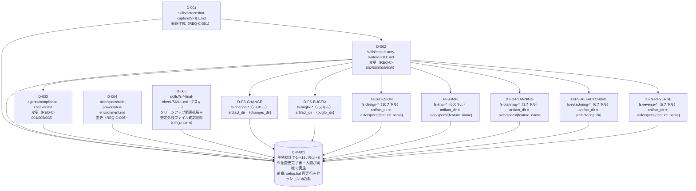

# 差分タスクリスト: スクリーンショット証跡による履歴偽装検出の強化

> 入力: delta-design.md（索引）+ 7分割（overview / screenshot-capture / step-history-writer / compliance-checker / fs-star-callsites / dev-environment / final-check-cleanup〔C-5〕）／ impact-analysis.md（手動検証項目 T-1〜23・R-1〜8）／ approach.md ／ dev-environment.md（テスト方針＝手動検証・反映条件）
> 対象 REQ: REQ-C-001〜010

## このタスクリストの特殊性（必読・メタ開発）

> 本件は **aide-powers フレームワーク自体のメタ開発**である。「実装コード」に相当するのは Markdown のスキル定義（`skills/{name}/SKILL.md`）・エージェント定義（`agents/*.md`）・参照ファイル（`dev-environment.md`）である。**`src/` や `tests/` は存在せず、プログラムコードのクラス/public メソッドという単位は当てはまらない**（dev-environment.md §1/§14.1）。
>
> - **タスク分解の単位 = 1つの成果物ファイルへの変更（または新規作成）。** public メソッド単位のサブタスクは適用しない。同一ファイルへの複数の変更（delta-design の「変更1〜N」）は、1タスク内の **「変更観点」** として列挙する。
> - **program-structure.md は存在しない**（dev-environment.md §14.1）。依存関係は「スキル/エージェント間の参照関係」（step-history-writer → screenshot-capture を activate、compliance-checker が履歴メタ＝成果物フォルダパスを読む、fs-* が step-history-writer を呼ぶ）として捉える。
> - **自動テストは導入しない**（dev-environment.md §7。手動検証）。「テストファイル」「テストコード作成タスク」は作らない。各実装タスクのテスト欄は一律 **「なし（メタ開発・自動テスト不在）」**。impact-analysis.md の手動検証項目（T-1〜18 / R-1〜8）を各タスクの「手動検証観点」に紐づけ、最後に手動検証タスク（D-V-001）として集約する。
> - **メタ開発の反映には setup.bat 再実行＋セッション再起動が必要**（dev-environment.md §0/§11）。`skills/`・`agents/` を編集してもグローバル領域（`~/.kiro/`）には自動反映されず、AI Agent の挙動は即座に変わらない。最終手動検証タスク（D-V-001）の前提として明記する。

## 変更種別

**両方（追加 + 変更）**

| 区分 | 内容 | 対象 REQ | タスク |
|---|---|---|---|
| 追加 | スクリーンショット撮影共通スキル `screenshot-capture` 新規作成 | REQ-C-001 | D-001 |
| 変更 | step-history-writer SKILL.md（artifact_dir 入力・メタ改訂・スクショ呼び出し・履歴欠落検出） | REQ-C-002/003/008/009 | D-002 |
| 変更 | compliance-checker.md（照合キー導出+絞り込み・W4-D FSタイムスタンプ化・W5スクショ照合） | REQ-C-004/005/008 | D-003 |
| 変更（ドキュメント） | dev-environment.md（Python/.venv 方針改訂） | REQ-C-006 | D-004 |
| 変更（機械適用） | 全フェーズスキル fs-*（34スキル）の step-history-writer 呼び出しへ artifact_dir 引数追加 | REQ-C-007 | D-FS-*（7グループ） |
| 変更 | final-check 系7スキルのクリーンアップ範囲拡張（`session-history-*.txt`→`.txt`/`.png`/`.err` の3拡張子）＋想定外残ファイルのユーザー確認削除 | REQ-C-010 | D-005 |
| 手動検証 | T-1〜23 / R-1〜8 を人間が実機検証 | 全 REQ | D-V-001 |

## 依存関係グラフ

### 依存原則

1. **D-001 → D-002:** step-history-writer（D-002）は screenshot-capture（D-001）の `output_path` 仕様・`.err` 排他挙動を参照して呼び出し工程を書くため、D-001 を先行させる。
2. **D-002 → D-003:** compliance-checker（D-003）は step-history-writer（D-002）が記録するメタ情報フォーマット（成果物フォルダパス1行追加・完了日時1行削除）に整合させて W4-0 絞り込み・W4-D 改修を行うため、D-002 を先行させる。
3. **D-002 → D-FS-*（7グループ）:** fs-* の呼び出しに渡す `artifact_dir` 入力パラメータは D-002 で確定するため、D-002 を先行させる。
4. **D-FS-* 各グループは相互に独立（並列可）。** WF 種別ごとに渡す値が異なるだけの同一パターン機械適用。task-orchestration で並列適用する想定（approach.md / AC-007-1・AC-007-4）。
5. **D-004 は独立**（dev-environment.md の記載整合のみ。他タスクと参照関係なし・並列可）。**D-005（final-check 系7スキルのクリーンアップ範囲拡張）も独立**（`.png`/`.err` の生成元は D-001 だが、final-check のクリーンアップ記述追加は D-001 の完了に依存せず並列可。D-004 と同様の独立扱い）。
6. **同一ファイルを複数タスクで触らない。** step-history-writer は D-002 のみ、compliance-checker は D-003 のみ、各 fs-* は所属する1グループのみが変更する。**循環依存なし。**
7. **D-V-001（手動検証）は全変更タスク（D-001〜D-005 + D-FS-* 全7グループ）完了後**に、人間が setup.bat 再実行＋セッション再起動のうえ実機で実施する。

## 実装タスク一覧

> **凡例** — 種別: 追加（新規ファイル作成）／既存変更（既存ファイルへの観点追加・改訂）。設計参照は delta-design の分割ファイル名 + 該当変更番号。テストファイル欄は一律「なし（メタ開発・自動テスト不在）」。手動検証観点は impact-analysis.md の T-/R- 番号に紐づける。

### 新規追加

#### D-001: skills/screenshot-capture/SKILL.md を新規作成
- 種別: 追加（新規）
- 対象ファイル: `skills/screenshot-capture/SKILL.md`
- テストファイル: なし（メタ開発・自動テスト不在）
- 依存先: なし
- 設計参照: delta-design-screenshot-capture.md「after（新規作成する SKILL.md の全文設計）」全文 + 「受入基準カバレッジ」表（AC-001-1〜6）
- 関連 REQ/AC: REQ-C-001（AC-001-1〜6）
- 作業内容: pyautogui で指定パス（`output_path`）に現在画面を撮影・保存する単一責任の共通スキルを新規作成する。delta-design-screenshot-capture.md の after ブロックに完全準拠（front-matter `name`/`description` → タイトル → 責務（単一責任・履歴ドメイン非依存）→ 呼び出し元 → 入力パラメータ表（output_path のみ）→ 出力ファイル（排他）表 → Process Step1〜4 + 排他の保証 → エラー時の動作 → Integration）。既存スキル（step-history-writer・visual-companion）の節構成・敬語スタイルに合わせ、Windows（PowerShell）系を主・bash 系を従で併記。
- 変更観点（= 設計の主要セクション）:
  1. **責務の限定（単一責任）:** 「画面を撮る／`.err` 代替／pyautogui を `.venv` 導入」の3点のみ。履歴ドメイン概念（何が写っているべきか）を引数に取らず・検証ロジックを持たない（AC-001-6）。
  2. **入力パラメータ:** `output_path`（保存先ファイルパス）のみ（AC-001-1/5）。
  3. **`.venv` 隔離・グローバル非汚染:** pyautogui 未導入時は `.venv` に導入。`pip install`（グローバル）/`--user` 禁止（AC-001-2／dev-environment.md §13）。
  4. **画像／`.err` 排他:** 成功時は画像1ファイル・`.err` を残さない／失敗時は同名ベース `.err`・画像を残さない。両方同時に存在してはならない（AC-001-3/4）。
  5. **撮影失敗を致命的エラーにしない:** `.err` を残して正常に制御を返す（呼び出し元のフェーズ進行を中断させない）。
- 手動検証観点: T-1（画像保存）／T-2（`.venv` 自動導入・グローバル非汚染）／T-3（`.err` 代替・排他）

### 既存変更

#### D-002: skills/step-history-writer/SKILL.md を変更
- 種別: 既存変更
- 対象ファイル: `skills/step-history-writer/SKILL.md`
- テストファイル: なし（メタ開発・自動テスト不在）
- 依存先: **D-001**（screenshot-capture の `output_path` 仕様・`.err` 排他挙動を参照して Step2 呼び出し工程を記述する）
- 設計参照: delta-design-step-history-writer.md 変更1〜5 + 「受入基準カバレッジ」表
- 関連 REQ/AC: REQ-C-002（AC-002-1〜5）／REQ-C-003（AC-003-1〜6）／REQ-C-008（AC-008-1/2）／REQ-C-009（AC-009-1〜5）
- 作業内容: 同一ファイルへの5つの変更を1タスクに集約。各 before→after は delta-design-step-history-writer.md に完全準拠。既存の中核責務（会話履歴そのまま転記・step_id ごと1ファイル）と「## 会話履歴（そのまま転記）」セクションは不変に保つ。
- 変更観点（delta-design 変更1〜5）:
  1. **変更1（REQ-C-003）:** 入力パラメータ表に `artifact_dir`（汎用名・成果物フォルダパス・未指定時 `(未指定)`・自己導出しない）を追加。
  2. **変更2（REQ-C-003/008）:** 「## メタ情報」ブロックに `- 成果物フォルダパス: {artifact_dir}` を1行追加し、`- 完了日時: ...` を1行削除。他メタ項目（スキル名・Step ID・Step タイトル）は維持。フォールバックは `(未指定)`。
  3. **変更3（REQ-C-002）:** Step1（履歴書き出し）完了後に「### Step 2: スクリーンショットの保存」を新設。同名・拡張子違いの `.png` パス構築 → screenshot-capture を **activate** して実行（自己流 pyautogui 直書き禁止）→ 撮影時の写り込み確認・撮り直し（一次保証）→ 撮影失敗は履歴書き出しを妨げない。
  4. **変更4（REQ-C-002）:** 「### エラー時の動作」に、スクショ撮影失敗（`.err`）でもフェーズを中断しない旨を1行補記。
  5. **変更5（REQ-C-009）:** Step1 冒頭（「処理: 1」より前）に「書き込み前チェック（履歴欠落検出）」を新設。skill_name から SKILL.md の Process 順序を参照（自己流推定禁止）→ 前処理・現 Step より前の Step 履歴の欠落を検出 → 欠落時はユーザー通知＋欠落先頭 Process からのやり直し促し（最終判断はユーザー/オーケストレータ）→ 欠落なしは通常書き込み。
- 実行順の確認: 「Step1 書き込み前チェック（変更5）→ Step1 履歴書き出し（既存・変更2）→ Step2 スクショ保存（変更3）」。
- 手動検証観点: T-4（同時 activate 呼び出し）／T-5（写り込み確認・撮り直し）／T-6（撮影失敗が書き出しを妨げない）／T-7（成果物フォルダパス記録）／T-8（`(未指定)` フォールバック）／T-9（完了日時消失）／T-16（履歴欠落検出・やり直し促し）／T-17（判定根拠は SKILL.md の Process 順序）／R-1（会話履歴そのまま転記の非退行）／R-2（既存エラー時動作の非退行）

#### D-003: agents/compliance-checker.md を変更
- 種別: 既存変更
- 対象ファイル: `agents/compliance-checker.md`
- テストファイル: なし（メタ開発・自動テスト不在）
- 依存先: **D-002**（step-history-writer のメタ情報フォーマット＝成果物フォルダパス追加・完了日時削除に整合させて W4-0 絞り込み・W4-D 改修を行う）
- 設計参照: delta-design-compliance-checker.md 変更1〜4 + 「確定事項」表 + 「受入基準カバレッジ」表
- 関連 REQ/AC: REQ-C-004（AC-004-1〜7）／REQ-C-005（AC-005-1〜6）／REQ-C-008（AC-008-3/4/5）
- 作業内容: 同一ファイルへの4つの変更を1タスクに集約。既存の署名検証（W3/W4-A）・テキスト履歴検証（W5-1/W5-2）は変更しない。W4-C 本体（処理内容ベースの最低実行時間見積もり判定）も維持し、時刻ソースの統一と要約行整合のみ扱う。各 before→after は delta-design-compliance-checker.md に完全準拠。
- 変更観点（delta-design 変更1〜4）:
  1. **変更1（REQ-C-004）:** W4 冒頭に「#### 0. 照合キーの決定と成果物フォルダパスによる絞り込み」を新設。照合キーを WF 種別で導出（`fs-change-`/`fs-bugfix-`/`fs-refactoring-` は write 入力 `changes_dir` 等をそのまま／`fs-design-`/`fs-impl-`/`fs-planning-`/`fs-reverse-` は `progress_file_path` 親 or `skill_name` から `.aide/specs/{feature_name}` を機械導出）。各履歴メタの成果物フォルダパスと文字列照合し、一致のみ検証対象に。不一致・`(未指定)` は除外。0件は W4-A の FAIL ルール適用（AC-004-1〜7）。
  2. **変更2（REQ-C-008）:** W4-D を「メタ完了日時 vs ファイル更新時刻の乖離比較」から「履歴ファイル作成日時（FSタイムスタンプ。Windows: CreationTime 優先・取得不能時 LastWriteTime）基準」へ差し替え。メタ完了日時への依存を一切残さない。W4-B/W4-C の時刻ソースも FS タイムスタンプに統一（W4-C 判定ロジック自体は不変）。乖離比較起因の FAIL・ユーザー確認を廃止（AC-008-3/4/5）。
  3. **変更3（REQ-C-008・軽微）:** 判定原則「軸1: W3〜W4」の箇条書きを更新。「メタ情報と実タイムスタンプの乖離（2時間以上）→ FAIL」を削除、「1分以内一括生成 → FAIL」を「処理内容に対し生成間隔が短すぎる → FAIL」へ更新。
  4. **変更4（REQ-C-005）:** W5 前準備に「2'. 対応スクショ/`.err` の特定・読み込み」「5. → W5-3 実行」を追加し、W5-2 直後に **W5-3（スクリーンショット照合チェック）** を新設（番人としての独立検証・撮り直ししない・W5-3-A 改ざん検出/部分一致許容・W5-3-B 写り込み独立検証・W5-3-C 偽装判定（同一画面/無関係/chat不在）・W5-3-D `.err` 環境確認）。W5 全体判定・チェック結果表の完全性ルール（3→4セクション）に W5-3 を反映（AC-005-1〜6）。
- スコープ厳守: W6/W7（進捗ファイルの完了日時）は変更しない（履歴メタの完了日時とは別系統。delta-design-compliance-checker.md「W7完了日時について」）。
- 手動検証観点: T-10（成果物フォルダパス絞り込み）／T-11（照合キー導出 両系統）／T-12（絞り込み0件で FAIL）／T-13（W4-D FSタイムスタンプ基準・メタ非依存）／T-14（W5-3 スクショ照合）／T-15（W5-3-D `.err` 環境確認・撮り直ししない）／R-3（W3/W4-A/B/C 非退行）／R-4（W5-1/W5-2 非退行）／R-5（W6/W7 非退行）

#### D-004: .aide/specs/aide-powers/dev-environment.md を変更
- 種別: 既存変更（ドキュメント）
- 対象ファイル: `.aide/specs/aide-powers/dev-environment.md`
- テストファイル: なし（メタ開発・自動テスト不在）
- 依存先: なし（独立・並列可）
- 設計参照: delta-design-dev-environment.md 変更1〜4 + 「§13 との整合確認」節 + 「セクション番号に関する申し送り」
- 関連 REQ/AC: REQ-C-006（AC-006-1〜4）
- 作業内容: 「Python 不使用 /.py 不在 /.venv 不使用」記載を「一部スキル（screenshot-capture）が pyautogui を補助使用・依存は `.venv` に隔離（グローバル非汚染、§13 と整合）」へ改訂。現物の見出し番号に合わせて反映（記述内容を正とする）。
- 変更観点（delta-design 変更1〜4 + 整合）:
  1. **変更1（AC-006-1）:** §1 プロジェクトの性質に「一部スキルは Python を補助使用・`.venv` 隔離・グローバル非汚染」を追記。
  2. **変更2（AC-006-2）:** §6 依存ツール表の Python 行を「不要」→「一部スキルで必要（pyautogui／.venv 隔離）」へ改訂。
  3. **変更3（AC-006-3）:** §6 末尾「仮想環境を使用しない」を「screenshot-capture が pyautogui 依存隔離のため `.venv` を使用」へ改訂。
  4. **変更4（AC-006-3/4）:** §12 仮想環境の表・グローバルルール §5-3 適用記述を「screenshot-capture 用に `.venv` 使用／§5-3 が `.venv` に適用」へ改訂。
  5. **§13 整合（AC-006-4）:** 改訂後の §1/§6/§12 が `.venv` 隔離・グローバル非インストールを明記し §13 と矛盾しないことを担保（§13 本体改訂は不要・任意の補記のみ）。
  6. **§2 末尾整合補強（申し送り）:** §2「Python ファイル（.py）は存在しません」は、リポジトリ追跡対象に .py が増えない（`.venv/` は .gitignore 除外）ため厳密には誤りにならないが、必要なら「リポジトリ追跡対象に .py は存在しない」等の明確化を確認（impact-analysis.md 懸念事項1）。
- 留意: dev-environment.md は設計エージェントが直接編集していないため、本タスクが唯一の反映工程。反映後の AI 挙動反映には setup.bat 再実行＋セッション再起動が必要（§0/§11）。
- 手動検証観点: （ドキュメント整合のため実機振る舞い検証なし。D-001 の T-2 と一体で `.venv` 隔離の実態整合を確認）

### fs-* への artifact_dir 引数追加（REQ-C-007・34スキル・グループ親タスク）

> **共通方針（全7グループ共通）:** delta-design-fs-star-callsites.md に従い、各 fs-* の step-history-writer 呼び出し記述に `artifact_dir` 引数を**末尾追加**する（既存 `skill_name`/`step_id`/`step_title` は維持）。適用箇所は2種類: (X) 冒頭の「step-history-writer について／呼び出しルール（全Step共通）」見出しのパラメータ定義、(Y) 各 Step 末尾の個別呼び出し指示行（括弧付き含む）。**両方**に追加する。**フェーズ構成・Process 手順・各フェーズの責務は一切変更しない**（AC-007-5・非破壊な機械適用）。
>
> **並列適用:** 7グループは相互に独立。各グループ内の個別スキルも別ファイルのため並列可。**task-orchestration で並列適用する想定**（approach.md / AC-007-1・AC-007-4）。漏れなく全34スキルへ同一の汎用名 `artifact_dir` を適用すること（適用漏れがあるとそのスキルの履歴に成果物フォルダパスが記録されず REQ-C-004 の絞り込みが効かなくなる）。
>
> **共通の依存先:** 全グループとも **D-002**（artifact_dir 入力パラメータ確定）に依存。テストファイル: 各スキルとも「なし（メタ開発・自動テスト不在）」。設計参照: delta-design-fs-star-callsites.md（代表 before→after・対象スキル一覧表・WF 種別ごとの渡し値）。関連 REQ/AC: REQ-C-007（AC-007-1〜5）。手動検証観点: T-18（全34スキルが artifact_dir を渡す）／R-7（フェーズ構成・Process・責務の非退行）。

#### D-FS-CHANGE: fs-change-* の step-history-writer 呼び出しへ artifact_dir 追加
- 渡す値: `{changes_dir}`（= `.aide/specs/{feature_name}/changes/{timestamp}-{name}`）
- 対象スキル（2）:
  - `fs-change-phase1-analysis`（出現13）
  - `fs-change-phase2-impl`（出現22）
- 備考: 冒頭「呼び出しルール（全Step共通）」見出し＋各 Step 後処理の括弧付き呼び出しの2段構成（代表例3）。両方に `artifact_dir: {changes_dir}` を追加。

#### D-FS-BUGFIX: fs-bugfix-* の step-history-writer 呼び出しへ artifact_dir 追加
- 渡す値: `{bugfix_dir}`（= `.aide/specs/{feature_name}/bugfix/{YYYYMMDDHHmm}-{対処概略}(-{番号})`。変更WF の changes_dir 相当）
- 対象スキル（2）:
  - `fs-bugfix-phase1-analysis`（出現14）
  - `fs-bugfix-phase2-impl`（出現20）

#### D-FS-DESIGN: fs-design-* の step-history-writer 呼び出しへ artifact_dir 追加
- 渡す値: `.aide/specs/{feature_name}`（feature フォルダを成果物フォルダパスとする）
- 対象スキル（10）:
  - `fs-design-phase1-user-req`（出現6）
  - `fs-design-phase2-system-req`（出現6）
  - `fs-design-phase3-dev-plan`（出現7）
  - `fs-design-phase4-architecture`（出現6）
  - `fs-design-phase5-gui`（出現6）
  - `fs-design-phase6-usecase`（出現10）
  - `fs-design-phase7-ddd`（出現5）
  - `fs-design-phase8-object`（出現10）
  - `fs-design-phase9-infra`（出現6）
  - `fs-design-phase10-program`（出現7）
- 備考: 冒頭「step-history-writer について」見出しのパラメータ定義（代表例2）＋各 Step 末尾の個別呼び出し指示行（代表例1）。両方に `artifact_dir: .aide/specs/{feature_name}` を追加。

#### D-FS-IMPL: fs-impl-* の step-history-writer 呼び出しへ artifact_dir 追加
- 渡す値: `.aide/specs/{feature_name}`
- 対象スキル（6）:
  - `fs-impl-phase1-gate`（出現5）
  - `fs-impl-phase2-preparation`（出現8）
  - `fs-impl-phase3-gui-mockup`（出現11）
  - `fs-impl-phase4-execution`（出現8）
  - `fs-impl-phase5-final-check`（出現6）※名称に final-check を含むが step-history-writer を呼ぶ実装WF中間の検証フェーズ＝改修対象
  - `fs-impl-phase6-doc-generation`（出現7）

#### D-FS-PLANNING: fs-planning-* の step-history-writer 呼び出しへ artifact_dir 追加
- 渡す値: `.aide/specs/{feature_name}`
- 対象スキル（3）:
  - `fs-planning-phase1-intake-and-init`（出現8）
  - `fs-planning-phase2-explore`（出現10）
  - `fs-planning-phase3-finalize`（出現7）

#### D-FS-REFACTORING: fs-refactoring-* の step-history-writer 呼び出しへ artifact_dir 追加
- 渡す値: `{refactoring_dir}`（= `.aide/specs/{feature_name}/refactoring/{refactoring_dir}`。変更WF の changes_dir 相当）
- 対象スキル（6）:
  - `fs-refactoring-phase1-status`（出現6）
  - `fs-refactoring-phase2-candidates`（出現7）
  - `fs-refactoring-phase3-plan`（出現6）
  - `fs-refactoring-phase4-design`（出現8）
  - `fs-refactoring-phase5-impl`（出現8）※本文に `{changes_dir}` 表記がある箇所も渡す値は `{refactoring_dir}`（当該スキルが保持する成果物フォルダ変数を確認のうえ適用）
  - `fs-refactoring-phase6-doc`（出現7）

#### D-FS-REVERSE: fs-reverse-* の step-history-writer 呼び出しへ artifact_dir 追加
- 渡す値: `.aide/specs/{feature_name}`
- 対象スキル（5）:
  - `fs-reverse-phase1-program`（出現7）
  - `fs-reverse-phase2-dev-env`（出現5）
  - `fs-reverse-phase3-system-req`（出現5）
  - `fs-reverse-phase4-user-req`（出現7）
  - `fs-reverse-phase5-optional-phases`（出現7）

> **対象外（改修しない）7スキル（final-check 系・step-history-writer 呼び出し0件）:** fs-bugfix-phase3-final-check / fs-change-phase3-final-check / fs-design-phase11-final-check / fs-impl-phase7-final-check / fs-planning-phase4-final-check / fs-refactoring-phase7-final-check / fs-reverse-phase6-final-check。これらは履歴を削除する側であり artifact_dir 追加対象ではない（delta-design-fs-star-callsites.md「対象外スキル」）。**ただし REQ-C-007（artifact_dir 追加）の対象外という意味であり、REQ-C-010（クリーンアップ範囲拡張・想定外残ファイル確認削除）では D-005 でこれら7スキルを改修対象とする（別 REQ・別 Step〔Step 2 一時ファイル削除〕への独立した変更）。**

### final-check 系7スキルのクリーンアップ範囲拡張（REQ-C-010・7スキル・グループ親タスク）

> **共通方針:** delta-design-final-check-cleanup.md に従い、final-check 系7スキルの「### Step 2: 一時ファイルの削除」を改修する。(改修1) 削除対象 glob を `session-history-*.txt` のみから `.txt`/`.png`/`.err` の3拡張子へ拡張（7スキル全て・AC-010-1/2）、(改修2) session-history 系以外の想定外残ファイルをユーザーへ番号付き選択肢で提示し削除可否を確認する手順を追加（7スキル全て・AC-010-3/4）、(改修3) Iron Law / 完了条件の `session-history-*.txt` 表現を3拡張子表現へ整合（fs-bugfix-phase3 / fs-change-phase3 のみ・AC-010-1 波及）。**いずれも Step 2「一時ファイルの削除」内に閉じ、Step 1 の progress-final-checker 委譲による署名検証・進捗更新には一切手を加えない（AC-010-5）。**

#### D-005（= D-FS-FINALCHECK-CLEANUP）: final-check 系7スキルの一時ファイルクリーンアップ範囲拡張＋想定外残ファイル確認削除
- 種別: 既存変更
- 対象ファイル: final-check 系7スキル `skills/fs-*-final-check/SKILL.md`（fs-bugfix-phase3-final-check / fs-change-phase3-final-check / fs-design-phase11-final-check / fs-impl-phase7-final-check / fs-planning-phase4-final-check / fs-refactoring-phase7-final-check / fs-reverse-phase6-final-check）
- テストファイル: なし（メタ開発・自動テスト不在）
- 依存先: **なし（独立・並列可）。** クリーンアップ記述自体は他タスクの完了を待たずに書ける。設計上 `.png`/`.err` は screenshot-capture（D-001）由来だが、final-check の記述追加は D-001 の完了に依存しない（既存 D-004 と同様の独立扱い）。※D-001 と論理的に関連（`.png`/`.err` の生成元）だが記述追加は独立して可能。task-orchestration で7スキルへ並列適用する想定。
- 設計参照: delta-design-final-check-cleanup.md（改修1〔4章・4.4 網羅テーブル〕／改修2〔5章・5.1 追記ブロック・5.3 網羅テーブル〕／改修3〔6章・6.1 Iron Law・6.2 完了条件・6.3 網羅テーブル〕／7章 AC-010-5 担保／9章 AC 対応サマリ）
- 関連 REQ/AC: REQ-C-010（AC-010-1〜5）
- 作業内容: 対象7スキルの「### Step 2: 一時ファイルの削除」へ、記述の揺れ（A1: 番号付き「処理:」2項目形式＝fs-bugfix-phase3 / fs-change-phase3／A2: 一文形式「検証完了後、〜削除する。」＝fs-design-phase11／A3: 一文形式「〜削除する（次回ワークフロー実行時の誤判定防止）。」＝fs-impl-phase7 / fs-planning-phase4 / fs-refactoring-phase7 / fs-reverse-phase6）に応じた before→after を delta-design-final-check-cleanup.md に完全準拠で反映。**既存の検証フロー（Step 1 = progress-final-checker 委譲・署名検証・進捗更新）と Step 2 の検証 PASS 後の後段位置づけは不変。**
- 変更観点（delta-design 改修1〜3）:
  1. **改修1（glob 拡張・7スキル全て／AC-010-1・2）:** 各スキルの削除対象を `.aide/tmp/session-history-*.txt` から `.aide/tmp/session-history-*.txt`・`.png`・`.err` の3拡張子へ拡張（バリアント A1/A2/A3 の代表 after に準拠）。`.png`/`.err` は screenshot-capture が履歴と対で生成するスクショ物証である旨を補記。
  2. **改修2（想定外残ファイルのユーザー確認削除・7スキル全て／AC-010-3・4）:** session-history 系削除の**後**に、`.aide/tmp/` 配下の残ファイルから session-history 系（`session-history-*.{txt,png,err}`）を除いた想定外ファイルを抽出し、0件なら確認なし／1件以上ならユーザーへ一覧提示して番号付き選択肢（1.すべて削除する / 2.残置する / 3.その他〔自由記述〕）で削除可否を確認（5.1 追記ブロック・global-rules 準拠）。A1 は番号付きリストの新項目、A2/A3 は段落として追記（5.2 挿入位置）。
  3. **改修3（Iron Law・完了条件整合・fs-bugfix-phase3 と fs-change-phase3 のみ／AC-010-1 波及）:** 両スキルの Iron Law 行（`- **session-history-*.txt の確実な削除** …`）と完了条件 PASS 条件（`3. 一時ファイル（session-history-*.txt）が削除されている`）を、3拡張子＋想定外残ファイルのユーザー確認を含む表現へ整合（6.1 / 6.2 の after に準拠・両スキル共通）。他5スキルには該当する Iron Law / 完了条件の txt 記述が存在しないため対象外（6.3）。
- スコープ厳守: Step 1（progress-final-checker 委譲による署名検証・進捗ファイル更新）には一切手を加えない。改修は Step 2「一時ファイルの削除」（検証 PASS 後の後段処理）内に閉じ、PASS/FAIL 判定・進捗ステータス更新を変えない（AC-010-5・7章）。
- 手動検証観点: T-19（3拡張子削除）／T-20（7スキル全てに同一拡張が漏れなく適用）／T-21（想定外残ファイルの一覧提示・番号付き選択肢確認）／T-22（ユーザー判断どおりの削除/残置）／T-23（検証フロー判定への非影響）／R-8（既存 `.txt` 削除の非退行）
- 7スキル個別サブ追跡（既存 D-FS-* のグループ内個別スキル工程テーブルと同形式・impl-process-checklist.md 側に「実装」「設計準拠レビュー」列を新設）:
  - fs-bugfix-phase3-final-check（A1・改修1/2/3）
  - fs-change-phase3-final-check（A1・改修1/2/3）
  - fs-design-phase11-final-check（A2・改修1/2）
  - fs-impl-phase7-final-check（A3・改修1/2）
  - fs-planning-phase4-final-check（A3・改修1/2）
  - fs-refactoring-phase7-final-check（A3・改修1/2）
  - fs-reverse-phase6-final-check（A3・改修1/2）

## 手動検証タスク（全変更完了後・人間が実機で実施）

#### D-V-001: impact-analysis.md の手動検証項目（T-1〜23 / R-1〜8）を実機検証
- 実施者: **人間（フレームワークオーナー / メタ開発者）**
- 依存先: 全変更タスク（D-001〜D-005 + D-FS-* 全7グループ）完了
- **前提（必読・AIセッション内では実行不能）:** skills/・agents/・dev-environment.md の編集はグローバル領域（`~/.kiro/`）に自動反映されない。**setup.bat 再実行 → グローバル領域反映 → AI Agent セッション再起動**を行ってから検証する（dev-environment.md §0/§11）。
- **自動テストは作らない**（dev-environment.md §7。「既存テストの全実行」も自動テスト不在のため適用不可・スキップ）。
- 設計参照: impact-analysis.md「テスト対象機能（手動検証項目として記述）」A.（T-1〜23）/ B.（R-1〜8）
- 検証項目（新規振る舞い T-1〜23）:
  - T-1〜3（screenshot-capture: 画像保存／`.venv` 自動導入・グローバル非汚染／`.err` 排他）
  - T-4〜9（step-history-writer: 同時 activate 呼び出し／写り込み確認・撮り直し／撮影失敗が書き出しを妨げない／成果物フォルダパス記録／`(未指定)` フォールバック／完了日時消失）
  - T-10〜15（compliance-checker: 成果物フォルダパス絞り込み／照合キー導出両系統／0件 FAIL／W4-D FSタイムスタンプ基準／W5-3 スクショ照合／`.err` 環境確認・撮り直ししない）
  - T-16〜17（step-history-writer: 履歴欠落検出・やり直し促し／判定根拠は SKILL.md の Process 順序）
  - T-18（全34 fs-* が artifact_dir を渡す）
  - T-19〜23（final-check 系7スキル〔D-005〕: 3拡張子削除〔T-19〕／7スキル全てに同一適用〔T-20〕／想定外残ファイルの一覧提示・番号付き選択肢確認〔T-21〕／ユーザー判断どおりの削除/残置〔T-22〕／検証フロー判定への非影響〔T-23〕）
- 検証項目（リグレッション R-1〜8）:
  - R-1（会話履歴そのまま転記の非退行）／R-2（既存エラー時動作の非退行）
  - R-3（W3/W4-A/B/C 非退行）／R-4（W5-1/W5-2 非退行）／R-5（W6/W7 進捗ファイル完了日時の非退行）
  - R-6（progress-final-checker 非退行・履歴/スクショ非読込）／R-7（fs-* のフェーズ構成・Process・責務の非退行）／R-8（final-check 系7スキルの `.aide/tmp` クリーンアップ非退行。REQ-C-010 で `.txt`/`.png`/`.err` の3拡張子削除へ拡張・想定外残ファイル確認削除を追加するが、既存の `.txt` 削除を壊さないこと）

## 網羅性チェック

### delta-design 全変更項目 vs タスクの対応

| delta-design 項目 | 対象ファイル | 関連 REQ | 変更数 | タスク | 反映 |
|---|---|---|---|---|---|
| N-1（screenshot-capture 新規） | `skills/screenshot-capture/SKILL.md` | REQ-C-001 | 新規1（変更観点5） | D-001 | ✅ |
| C-1（step-history-writer） | `skills/step-history-writer/SKILL.md` | REQ-C-002/003/008/009 | 変更1〜5（5項目） | D-002 | ✅ |
| C-2（compliance-checker） | `agents/compliance-checker.md` | REQ-C-004/005/008 | 変更1〜4（4項目） | D-003 | ✅ |
| C-3（fs-* 34スキル） | `skills/fs-*/SKILL.md` | REQ-C-007 | 34スキル | D-FS-*（7グループ） | ✅ |
| C-4（dev-environment.md） | `.aide/specs/aide-powers/dev-environment.md` | REQ-C-006 | 変更1〜4＋§13/§2整合 | D-004 | ✅ |
| C-5（final-check cleanup） | `skills/fs-*-final-check/SKILL.md`（7スキル） | REQ-C-010 | 改修1〜3（glob拡張／想定外残ファイル確認削除／Iron Law・完了条件整合） | D-005 | ✅ |

### REQ-C-001〜010 カバレッジ

| REQ | 内容 | タスク | 反映 |
|---|---|---|---|
| REQ-C-001 | screenshot-capture 新規スキル | D-001 | ✅ |
| REQ-C-002 | step-history-writer スクショ呼び出し | D-002（変更3/4） | ✅ |
| REQ-C-003 | artifact_dir 入力・メタ成果物フォルダパス追加 | D-002（変更1/2） | ✅ |
| REQ-C-004 | 照合キー導出+成果物フォルダパス絞り込み | D-003（変更1） | ✅ |
| REQ-C-005 | W5 スクショ偽装検出 | D-003（変更4） | ✅ |
| REQ-C-006 | dev-environment.md Python/.venv 方針改訂 | D-004 | ✅ |
| REQ-C-007 | fs-* 34スキルへ artifact_dir 引数追加 | D-FS-*（7グループ） | ✅ |
| REQ-C-008 | メタ完了日時削除＋W4-D FSタイムスタンプ基準化 | D-002（変更2）/ D-003（変更2/3） | ✅ |
| REQ-C-009 | step-history-writer 履歴欠落検出・やり直し促し | D-002（変更5） | ✅ |
| REQ-C-010 | final-check 系7スキルのクリーンアップ範囲拡張（3拡張子）＋想定外残ファイル確認削除 | D-005 | ✅ |

### 集計

- **設計の変更対象ファイル数:** 4ファイル（screenshot-capture 新規 / step-history-writer / compliance-checker / dev-environment）＋ fs-* 34スキル ＋ final-check 系7スキル = **45成果物ファイル**。
- **実装タスク数:** 新規追加 1（D-001）＋ 既存変更 3（D-002/003/004）＋ fs-* グループ親 7（D-FS-*、内訳34スキル）＋ final-check グループ親 1（D-005、内訳7スキル）＝ **タスク12件**（個別カウントすると 4 + 34 + 7 = 45成果物ファイル）。
- **手動検証タスク:** 1件（D-V-001、内訳 T-1〜23 + R-1〜8 = 31検証項目）。
- **REQ-C-001〜010（10要求）→ 全てタスクに反映。漏れゼロ。**
- **同一ファイル競合なし**（各成果物ファイルは単一タスクのみが変更）。**循環依存なし。**
