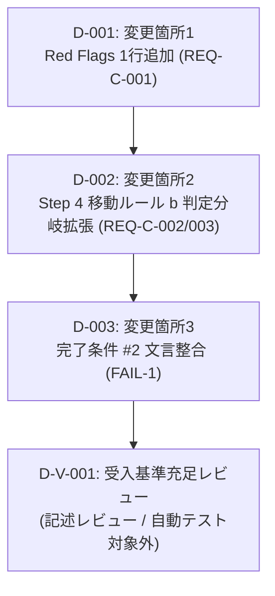

# 差分タスクリスト

## 前提

本変更は単一の Markdown スキル定義ドキュメント `skills/folder-merge-check/SKILL.md`（実体はグローバルエリア `~/.kiro/skills/folder-merge-check/SKILL.md`）への内部ルール追記・更新で完結する。**プログラムコードではないため、クラス/publicメソッド単位のサブタスク分割は適用しない**（非プログラム成果物）。

- 変更箇所は3箇所（変更箇所1: Red Flags テーブルに1行追加 / 変更箇所2: Step 4 移動ルール b を判定分岐構造へ拡張 / 変更箇所3: 完了条件 #2 の文言整合）。すべて同一ファイル内。
- 全タスクが同一ファイル（`skills/folder-merge-check/SKILL.md`）を変更するため、**同一ファイル競合を避けるべく逐次実行**とする（依存関係で直列につなぐ）。
- 各編集タスクは**非プログラム成果物の簡略サイクル（実装 → 設計準拠レビュー）**で扱う。
- 検証は**自動テスト対象外**。改修後 SKILL.md の記述レビュー（受入基準充足確認）と、ユーザーによる手動動作検証で行う（dev-environment.md §7「動作確認の方法」に準拠）。

---

## 依存関係グラフ

実行リンク: `D-001 → D-002 → D-003 → D-V-001`（全タスク同一ファイル変更のため完全逐次。並列スタート可能なタスクなし）

---

## タスク一覧

### D-001: 変更箇所1 — Red Flags テーブルに1行追加（REQ-C-001）

- **種別**: 非プログラム成果物（簡略サイクル: 実装 → 設計準拠レビュー）
- **対象ファイル**: `skills/folder-merge-check/SKILL.md`（実体: `~/.kiro/skills/folder-merge-check/SKILL.md`）
- **変更箇所**: `## Red Flags - STOP` セクションのテーブル末尾（既存6行の後に1行追加）
- **依存先**: なし
- **設計参照**: delta-design.md「変更箇所 1: Red Flags テーブル（REQ-C-001）」before/after
- **作業内容**: WF種別差（`changes/` / `bugfix/` / `refactoring/`）を理由とした統合拒否を STOP 対象とする Red Flag 行を1行追加する。「なぜ危険か」列に (a) folder-merge-check の目的は同じコード変更に起因するドキュメントを1箇所に集約しトレーサビリティを確保すること、(b) WF種別やディレクトリ階層の違いは統合を阻む条件ではないこと、の両方を記載する。既存6行は削除・改変しない（追記のみ）。
- **レビュー観点（設計準拠）**: delta-design.md 変更箇所1の after と一致するか。AC-001-1 / AC-001-2 / AC-001-3 を満たすか。

### D-002: 変更箇所2 — Step 4 移動ルール b を判定分岐構造へ拡張（REQ-C-002 / REQ-C-003）

- **種別**: 非プログラム成果物（簡略サイクル: 実装 → 設計準拠レビュー）
- **対象ファイル**: `skills/folder-merge-check/SKILL.md`（実体: `~/.kiro/skills/folder-merge-check/SKILL.md`）
- **変更箇所**: `Step 4` ファイル移動の実行 — 移動ルール b（同名ファイルが存在する場合）
- **依存先**: D-001（同一ファイル競合回避のため逐次）
- **設計参照**: delta-design.md「変更箇所 2: Step 4 移動ルール（REQ-C-002 / REQ-C-003）」before/after
- **作業内容**: 移動ルール b を判定分岐構造へ拡張する。同名衝突時にまず判定基準で (a) 恒久的設計資産 / (b) その時用の設計資料・進捗ファイルに分類し、(a) は末尾追記ヘッダ付きで追記・更新（既存の単純追記挙動を (a) ルートとして保持）、(b) は統合先フォルダ配下 `old/{日付}/`（`{日付}` は history.md 記載日付）へ退避して今回WFの成果物を正規名で配置する。判定基準・対象例・退避ファイルの後続フェーズ入力除外・どちらにも該当しない場合は (a) を従来適用・全WF共通・旧サフィックス方式不採用、を明記する。既存の挙動（単純追記）は削除・破壊的改変しない。
- **レビュー観点（設計準拠）**: delta-design.md 変更箇所2の after と一致するか。AC-002-1〜5 / AC-003-1〜6 を満たすか。既存の単純追記挙動が (a) ルートとして保持されているか。

### D-003: 変更箇所3 — 完了条件 #2 の文言整合（FAIL-1）

- **種別**: 非プログラム成果物（簡略サイクル: 実装 → 設計準拠レビュー）
- **対象ファイル**: `skills/folder-merge-check/SKILL.md`（実体: `~/.kiro/skills/folder-merge-check/SKILL.md`）
- **変更箇所**: 完了条件「統合した場合」の項目2
- **依存先**: D-002（同一ファイル競合回避のため逐次。かつ移動ルール b の拡張内容に整合させる必要があるため D-002 後）
- **設計参照**: delta-design.md「変更箇所 3: 完了条件 #2（FAIL-1）」before/after
- **作業内容**: 完了条件「統合した場合」項目2「同名ファイルの衝突が追記ルールに従って解決されている」を、移動ルール b の判定分岐＝(a) 恒久的設計資産→追記・更新／(b) その時用の設計資料・進捗ファイル→`old/{日付}/` 退避 の2分類に従って解決されている、へ更新する。項目1・3・4・5 は改変しない。
- **レビュー観点（設計準拠）**: delta-design.md 変更箇所3の after と一致するか。改修後 SKILL.md 内で移動ルール b（D-002）と完了条件 #2 が矛盾しないか（FAIL-1 の解消）。

### D-V-001: 改修後 SKILL.md の受入基準充足レビュー（検証 / 自動テスト対象外）

- **種別**: 検証（記述レビューによる受入基準充足確認）
- **対象ファイル**: `skills/folder-merge-check/SKILL.md`（実体: `~/.kiro/skills/folder-merge-check/SKILL.md`）
- **依存先**: D-003
- **設計参照**: change-requirements.md（AC-001-1〜3 / AC-002-1〜5 / AC-003-1〜6）、delta-design.md 変更箇所3（FAIL-1 完了条件整合）
- **検証方法**: **自動テスト対象外**（変更対象は Markdown スキル定義ドキュメントでありプログラムコードではないため。dev-environment.md §7 に準拠）。改修後 SKILL.md の記述を読み、以下を確認する。
  - AC-001-1 / AC-001-2 / AC-001-3（変更箇所1）
  - AC-002-1 / AC-002-2 / AC-002-3 / AC-002-4 / AC-002-5（変更箇所2）
  - AC-003-1 / AC-003-2 / AC-003-3 / AC-003-4 / AC-003-5 / AC-003-6（変更箇所2）
  - FAIL-1: 完了条件 #2 が移動ルール b の判定分岐に整合し、改修後 SKILL.md 内に矛盾がないこと（変更箇所3）
  - 既存セクション構造（Overview / The Iron Law / Process Step 1〜6 / Red Flags / Common Rationalizations / Integration）が維持されていること
- **補足**: リグレッションテストも自動テスト対象外。ユーザーによる手動動作検証（実際のフォルダ統合シナリオでの挙動確認）は本タスクの記述レビュー完了後にユーザー側で実施する。

---

## 網羅性チェック結果

- チェック回数: 1回
- 差分設計書の総変更項目数: 3件（変更箇所1 / 変更箇所2 / 変更箇所3）
- タスクリストの編集タスク数: 3件（D-001 / D-002 / D-003）＋ 検証タスク1件（D-V-001）
- 最終結果: 漏れなし

| 差分設計の変更項目 | 対応要求 | 対応タスク | 反映 |
|---|---|---|---|
| 変更箇所1: Red Flags テーブルに1行追加 | REQ-C-001 | D-001 | ✅ |
| 変更箇所2: Step 4 移動ルール b を判定分岐構造へ拡張 | REQ-C-002 / REQ-C-003 | D-002 | ✅ |
| 変更箇所3: 完了条件 #2 の文言整合 | FAIL-1 | D-003 | ✅ |
| 受入基準充足の検証（AC-001-x / AC-002-x / AC-003-x / FAIL-1） | 全要求 | D-V-001 | ✅ |

差分設計書の全変更項目（変更箇所1〜3）がタスクリストに反映されている。漏れゼロ。

---

## タスクサマリー

| 区分 | 件数 |
|---|---|
| 編集タスク（非プログラム成果物・簡略サイクル） | 3件（D-001 / D-002 / D-003） |
| 検証タスク（記述レビュー・自動テスト対象外） | 1件（D-V-001） |
| **合計** | **4件** |

- 実行順序: D-001 → D-002 → D-003 → D-V-001（全タスク同一ファイル変更のため完全逐次。並列実行なし）
- 循環依存: なし
- 対象ファイル: `skills/folder-merge-check/SKILL.md`（実体: `~/.kiro/skills/folder-merge-check/SKILL.md`）の1ファイルのみ
