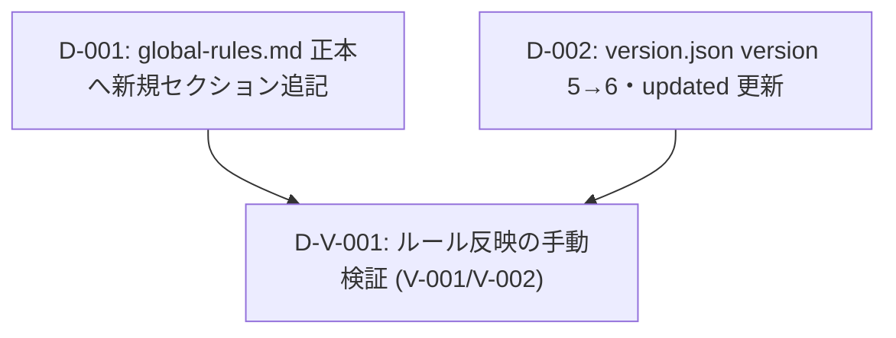

# 差分タスクリスト: 大きいファイル全行読み出しルールの追記

> 本変更はコード実装ではなく、フレームワークのルールドキュメント変更（メタ開発・非プログラム成果物）である。
> aide-powers は自動テストフレームワークを持たず、動作確認は手動検証で行う（dev-environment.md §7）。
> よってプログラムの単体テストタスクは作らず、impact-analysis.md の確認対象のうち本WFスコープ（V-001／V-002）を「検証タスク」として組み込む。
> 1サブタスク=1ファイル変更の原則に従い、変更対象ファイルごとにタスクを分ける（メソッド実装がないためサブタスクなし）。
> 配布（`.aide/references/` 置き換え＋`.kiro/steering/` 再生成）は本変更WFでは手動実行しない。version +1 をトリガーに次回 using-aide-powers 起動時の起動時手順＋rules-distribute が自動反映するため、本WFスコープ外（delta-design.md fix1／impact-analysis.md と整合）。

## 依存関係グラフ

実行リンク:
- 並列スタート可能: `D-001`, `D-002`（依存先なし、同時起動可）
- `D-001, D-002 → D-V-001`（両方完了後に本WFスコープの手動検証）

## タスク一覧

### タスク D-001: global-rules.md 正本への「大きいファイルを分割して全行読み出すルール」セクション追記
- 種別: 新規追加
- 対象ファイル: `skills/using-aide-powers/references/global-rules.md`
- 依存先: なし
- 設計参照: delta-design.md「新規追加の設計 > global-rules.md への新規セクション追記」（before/after 完成形、追記理由の内容根拠5点）/ impact-analysis.md「変更対象ファイル」表
- 実装内容:
  - 「スキルの所在ルール」セクション末尾（`注意: SKILL.md 本体だけは…` の行）に続く `---` 区切りと、「## 実行環境ルール」の間に、新セクション「## 大きいファイルを分割して全行読み出すルール」本体＋直後の `---` 区切りを挿入する。
  - 挿入後の並びは「スキルの所在ルール → 大きいファイルを分割して全行読み出すルール → 実行環境ルール」となること。
  - 既存セクションの文言・順序には一切手を加えない（追加のみ・OCP整合）。
  - 追記本文は delta-design.md「after（追記するセクションの完成形）」のとおりとし、AC-002〜AC-004 を満たす5要素（全行読み／部分ロード・AST要約時は分割で末尾まで全行取得／read_code 要約モード依存禁止／恒久・汎用・全エージェント全工程適用／false positive・false negative 禁止）を明文として含めること。
- 設計準拠レビュー観点（検証観点）:
  - V-001: 「## 大きいファイルを分割して全行読み出すルール」が、スキルの所在ルール直後・実行環境ルール前に独立セクションとして存在すること。
  - V-001: AC-002〜AC-004 の明文（全行読み／分割取得／要約モード依存禁止／恒久・汎用／false positive・false negative 禁止）が本文に含まれること。
  - 既存セクション（ツールマップ参照ルール・スキルの所在ルール・実行環境ルール等）の文言・順序が不変であること（追加のみであることの確認）。

### タスク D-002: version.json の version 5→6・updated 更新
- 種別: 既存変更
- 対象ファイル: `skills/using-aide-powers/references/version.json`
- 依存先: なし
- 設計参照: delta-design.md「既存変更の設計 > version.json」（before/after・変更理由）/ impact-analysis.md「変更対象ファイル」表
- 実装内容:
  - `version` を `5` → `6` に更新する。
  - `updated` を `2026-06-11` に更新する。
  - `_comment` 行および JSON 全体構造は変更しない（version 値と updated 値の2行のみ変更）。
- 設計準拠レビュー観点（検証観点）:
  - V-002: `version` が `6`、`updated` が更新されていること（配布反映トリガーの成立）。
  - JSON が壊れていない（パース可能）こと。

### リグレッション/検証（全タスク完了後）

#### タスク D-V-001: ルール反映の手動検証（本WFスコープ）
- 種別: 検証（手動）
- テスト種別: 検証（手動）／リグレッション相当
- 対象: 正本ファイル群（`skills/using-aide-powers/references/global-rules.md`・`version.json`）＝本変更WFの成果物
- 依存先: D-001, D-002
- 設計参照: impact-analysis.md「確認対象（テスト対象に相当）」表 V-001／V-002（本WFで実施・検証）/ dev-environment.md §7（手動検証）
- 確認内容（V-001／V-002）:
  - V-001: 正本への追記反映 — `skills/using-aide-powers/references/global-rules.md` に新セクションが正しい位置（スキルの所在ルール直後・実行環境ルール前）で存在し、AC-002〜AC-004 の明文を含むこと（AC-001〜AC-004）。
  - V-002: version 更新 — `skills/using-aide-powers/references/version.json` の `version` が 6、`updated` が更新されていること（AC-005）。
- スコープ外（本WFでは検証しない）:
  - V-003（`.aide/references/global-rules.md` への反映・AC-007）／V-004（`.kiro/steering/aide-powers-global-rules.md` への反映・AC-006）／V-005（フェーズスキル前処理での取り込み）は、version +1 をトリガーに**次回 using-aide-powers 起動時の起動時手順＋rules-distribute による自動配布で反映・有効化される**ため、本変更WFの検証対象から外す（配布先の手動編集は禁止）。

## 網羅性チェック結果
- チェック回数: 1回
- 設計書（delta-design.md）の総変更項目数: 2件（① global-rules.md への新規セクション追記、② version.json の version 5→6・updated 更新）
- 本WFスコープの検証項目: 1件（③ V-001／V-002 手動検証＝impact-analysis「確認対象」のうち本WFスコープ分）
- タスクリストの総タスク数: 3件（D-001／D-002／D-V-001）
- 変更項目→タスク対応:
  - ① global-rules 追記 → D-001 ✅
  - ② version 更新 → D-002 ✅
  - ③ 確認対象 V-001／V-002 → D-V-001 ✅
- 配布（`.aide/references/` 置き換え＋`.kiro/steering/` 再生成）および確認対象 V-003〜V-005 について:
  - 本変更WFでは手動実行・検証しない。version +1（D-002）をトリガーに次回 using-aide-powers 起動時の起動時手順＋rules-distribute が自動配布・反映するため、本WFスコープ外として意図的にタスク化していない（取りこぼしではない。delta-design.md fix1／impact-analysis.md と整合）。
- 最終結果: 漏れなし（循環依存なし。トポロジカルソート: D-001/D-002 → D-V-001）

## タスクサマリー
| 種別 | 件数 | タスク |
|---|---|---|
| 新規追加 | 1 | D-001 |
| 既存変更 | 1 | D-002 |
| 検証（手動） | 1 | D-V-001 |
| **合計** | **3** | — |

- 全タスクが非プログラム成果物（ルールドキュメント変更・手動検証）であり、プログラムコードの単体テストタスクは存在しない。
- 配布は本WFスコープ外（次回 using-aide-powers 起動時に version +1 をトリガーに自動反映）のため、配布タスクは設けない。
