# 差分タスクリスト（署名検証機構の削除）

## 依存関係グラフ

```mermaid
graph TD
    T1[1. 削除: phase-compliance-check]
    T2[2. 削除: compliance-checker x2]
    T3[3. 削除: create-sig.sh]
    T4[4. 簡素化: phase-report-check/SKILL.md]
    T5[5. 新規: progress-updater.md x2]
    T6[6. 削除: phase-report-checker.md x2]
    T7[7. 簡素化: progress-final-checker.md x2]
    T8[8. 参照更新: phase-skill-rules.md — skills版]
    T9[9. 参照更新: phase-skill-rules.md — .kiro版]
    T10[10. 参照更新: session-handover/SKILL.md]
    T11[11. 参照更新: progress-file-format.md]
    T12[12. 参照更新: step-history-writer/SKILL.md]
    T13[13. 一括変更: フェーズスキル群 — reverse系]
    T14[14. 一括変更: フェーズスキル群 — refactoring系]
    T15[15. 一括変更: フェーズスキル群 — planning系]
    T16[16. 一括変更: フェーズスキル群 — impl系]
    T17[17. 一括変更: フェーズスキル群 — design系]
    T18[18. 一括変更: フェーズスキル群 — change系]
    T19[19. 一括変更: フェーズスキル群 — bugfix系]
    T20[20. リグレッション確認]

    T1 --> T4
    T2 --> T4
    T3 --> T4
    T5 --> T4
    T6 --> T5
    T7 --> T4
    T8 --> T1
    T9 --> T1
    T10 --> T1
    T10 --> T4
    T11 --> T4
    T12 --> T7
    T13 --> T4
    T13 --> T5
    T14 --> T4
    T14 --> T5
    T15 --> T4
    T15 --> T5
    T16 --> T4
    T16 --> T5
    T17 --> T4
    T17 --> T5
    T18 --> T4
    T18 --> T5
    T19 --> T4
    T19 --> T5
    T20 --> T13
    T20 --> T14
    T20 --> T15
    T20 --> T16
    T20 --> T17
    T20 --> T18
    T20 --> T19
```

## 実装順序（トポロジカルソート）

| Wave | タスク | 並列可否 |
|---|---|---|
| Wave 1 | T1, T2, T3 | 並列可（独立した削除） |
| Wave 2 | T4, T6 | 並列可（T4: phase-report-check 簡素化、T6: 旧エージェント削除） |
| Wave 3 | T5, T7, T8, T9, T10, T11 | 並列可（Wave 2 完了後） |
| Wave 4 | T12, T13, T14, T15, T16, T17, T18, T19 | 並列可（Wave 3 完了後） |
| Wave 5 | T20 | 単独（全タスク完了後） |

---

## タスク詳細

---

### タスク 1: 削除 — `skills/phase-compliance-check/`

- **種別**: 既存変更（削除）
- **対象ファイル**: `skills/phase-compliance-check/SKILL.md`（ディレクトリごと削除）
- **依存先**: なし
- **設計参照**: delta-design-core.md §1.1

#### 作業内容
- `skills/phase-compliance-check/` ディレクトリを完全削除する

---

### タスク 2: 削除 — compliance-checker エージェント

- **種別**: 既存変更（削除）
- **対象ファイル**: `agents/compliance-checker.md`, `agents/kiro/compliance-checker.md`
- **依存先**: なし
- **設計参照**: delta-design-core.md §1.2, §1.3

#### サブタスク

| # | 内容 | 対象ファイル |
|---|---|---|
| 2.1 | `agents/compliance-checker.md` を削除する | `agents/compliance-checker.md` |
| 2.2 | `agents/kiro/compliance-checker.md` を削除する | `agents/kiro/compliance-checker.md` |

---

### タスク 3: 削除 — `create-sig.sh`

- **種別**: 既存変更（削除）
- **対象ファイル**: `.aide/scripts/create-sig.sh`
- **依存先**: なし
- **設計参照**: delta-design-core.md §1.4

#### 作業内容
- `.aide/scripts/create-sig.sh` を削除する（`.gitignore` で追跡除外済みのためローカル削除のみ）

---

### タスク 4: 簡素化 — `skills/phase-report-check/SKILL.md`

- **種別**: 既存変更（簡素化）
- **対象ファイル**: `skills/phase-report-check/SKILL.md`
- **依存先**: T1, T2, T3（削除完了後に参照が消えた状態で編集）
- **設計参照**: delta-design-core.md §2（§2.1〜§2.8 全体）

#### 作業内容
- フロントマター更新（§2.2）
- Overview セクション更新（§2.3）
- モードテーブル更新（§2.4）
- verify モード全面書き換え（§2.5）
- write モード全面書き換え（§2.6）
- fix_open / fix_close のサブエージェント名変更（§2.7）
- 不要セクション削除（§2.8: 空欄の扱い、省略なし宣言ルール、誠実性原則）

---

### タスク 5: 新規作成 — progress-updater エージェント

- **種別**: 新規作成（名称変更を伴う新規）
- **対象ファイル**: `agents/progress-updater.md`, `agents/kiro/progress-updater.md`
- **依存先**: T6（旧ファイル削除後に新規作成）, T4（phase-report-check の内容が確定後）
- **設計参照**: delta-design-core.md §3（§3.1〜§3.9 全体）

#### サブタスク

| # | 内容 | 対象ファイル |
|---|---|---|
| 5.1 | `agents/progress-updater.md` を新規作成する | `agents/progress-updater.md` |
| 5.2 | `agents/kiro/progress-updater.md` を新規作成する | `agents/kiro/progress-updater.md` |

---

### タスク 6: 削除 — 旧 phase-report-checker エージェント

- **種別**: 既存変更（削除）
- **対象ファイル**: `agents/phase-report-checker.md`, `agents/kiro/phase-report-checker.md`
- **依存先**: なし（T5 の前提として先に削除する）
- **設計参照**: delta-design-core.md §3.1

#### サブタスク

| # | 内容 | 対象ファイル |
|---|---|---|
| 6.1 | `agents/phase-report-checker.md` を削除する | `agents/phase-report-checker.md` |
| 6.2 | `agents/kiro/phase-report-checker.md` を削除する | `agents/kiro/phase-report-checker.md` |

---

### タスク 7: 簡素化 — progress-final-checker エージェント

- **種別**: 既存変更（簡素化）
- **対象ファイル**: `agents/progress-final-checker.md`, `agents/kiro/progress-final-checker.md`
- **依存先**: T4（phase-report-check の方針確定後）
- **設計参照**: delta-design-core.md §4（§4.1〜§4.6 全体）

#### サブタスク

| # | 内容 | 対象ファイル |
|---|---|---|
| 7.1 | `agents/progress-final-checker.md` を簡素化する | `agents/progress-final-checker.md` |
| 7.2 | `agents/kiro/progress-final-checker.md` を簡素化する | `agents/kiro/progress-final-checker.md` |

---

### タスク 8: 参照更新 — `skills/using-aide-powers/references/phase-skill-rules.md`

- **種別**: 既存変更（参照更新）
- **対象ファイル**: `skills/using-aide-powers/references/phase-skill-rules.md`
- **依存先**: T1（phase-compliance-check 削除後に参照を除去）
- **設計参照**: delta-design-references.md §1（§1.1, §1.2）

#### 作業内容
- 「前処理・後処理の絶対実行」セクション更新（§1.1）
- 「ユーザーによる中止（全WF共通）」セクション更新（§1.2）

---

### タスク 9: 参照更新 — `.kiro/steering/aide-powers-phase-skill-rules.md`

- **種別**: 既存変更（参照更新）
- **対象ファイル**: `.kiro/steering/aide-powers-phase-skill-rules.md`
- **依存先**: T1（phase-compliance-check 削除後に参照を除去）
- **設計参照**: delta-design-references.md §2

#### 作業内容
- T8 と同一の変更を適用する（配布同期ファイル）

---

### タスク 10: 参照更新 — `skills/session-handover/SKILL.md`

- **種別**: 既存変更（参照更新）
- **対象ファイル**: `skills/session-handover/SKILL.md`
- **依存先**: T1（phase-compliance-check 削除）, T4（phase-report-check 簡素化完了後）
- **設計参照**: delta-design-references.md §3（§3.1〜§3.5）

#### 作業内容
- 実行証跡テンプレート内の参照変更（§3.1, §3.2）
- 記載条件・説明文の更新（§3.3）
- 「なぜ必要か」セクション更新（§3.4）
- 署名検証の詳細例更新（§3.5）

---

### タスク 11: 参照更新 — `skills/using-aide-powers/references/progress-file-format.md`

- **種別**: 既存変更（参照更新）
- **対象ファイル**: `skills/using-aide-powers/references/progress-file-format.md`
- **依存先**: T4（phase-report-check 簡素化完了後）
- **設計参照**: delta-design-references.md §4（§4.1, §4.2）

#### 作業内容
- §3.3 修正履歴テーブル内の署名関連記述を削除する（§4.1）
- §9 関連スキルテーブルは変更なし（§4.2）

---

### タスク 12: 参照更新 — `skills/step-history-writer/SKILL.md`

- **種別**: 既存変更（参照更新）
- **対象ファイル**: `skills/step-history-writer/SKILL.md`
- **依存先**: T7（progress-final-checker 簡素化完了後）
- **設計参照**: delta-design-references.md §5（§5.1, §5.2）

#### 作業内容
- 概要の説明文更新（§5.1）
- Used by セクション更新（§5.2）

---

### タスク 13: 一括変更 — フェーズスキル群（reverse系）

- **種別**: 既存変更（一括パターン変更）
- **対象ファイル**: 6ファイル（下表参照）
- **依存先**: T4（phase-report-check 簡素化完了後）, T5（progress-updater 作成完了後）
- **設計参照**: delta-design-phase-skills.md §1〜§5, §6（#1〜#6）

#### サブタスク

| # | 内容 | 対象ファイル | 適用パターン |
|---|---|---|---|
| 13.1 | fs-reverse-phase1-program 前処理・後処理更新 | `skills/fs-reverse-phase1-program/SKILL.md` | A + B |
| 13.2 | fs-reverse-phase2-dev-env 前処理・後処理更新 | `skills/fs-reverse-phase2-dev-env/SKILL.md` | A + B |
| 13.3 | fs-reverse-phase3-system-req 前処理・後処理更新 | `skills/fs-reverse-phase3-system-req/SKILL.md` | A + B |
| 13.4 | fs-reverse-phase4-user-req 前処理・後処理更新 | `skills/fs-reverse-phase4-user-req/SKILL.md` | A + B |
| 13.5 | fs-reverse-phase5-optional-phases 前処理・後処理更新 | `skills/fs-reverse-phase5-optional-phases/SKILL.md` | A + B |
| 13.6 | fs-reverse-phase6-final-check 前処理・本体・中止モード更新 | `skills/fs-reverse-phase6-final-check/SKILL.md` | A + C + D + E |

---

### タスク 14: 一括変更 — フェーズスキル群（refactoring系）

- **種別**: 既存変更（一括パターン変更）
- **対象ファイル**: 7ファイル（下表参照）
- **依存先**: T4, T5
- **設計参照**: delta-design-phase-skills.md §1〜§5, §6（#7〜#13）

#### サブタスク

| # | 内容 | 対象ファイル | 適用パターン |
|---|---|---|---|
| 14.1 | fs-refactoring-phase1-status 前処理・後処理更新 | `skills/fs-refactoring-phase1-status/SKILL.md` | A + B |
| 14.2 | fs-refactoring-phase2-candidates 前処理・後処理更新 | `skills/fs-refactoring-phase2-candidates/SKILL.md` | A + B |
| 14.3 | fs-refactoring-phase3-plan 前処理・後処理更新 | `skills/fs-refactoring-phase3-plan/SKILL.md` | A + B |
| 14.4 | fs-refactoring-phase4-design 前処理・後処理更新 | `skills/fs-refactoring-phase4-design/SKILL.md` | A + B |
| 14.5 | fs-refactoring-phase5-impl 前処理・後処理更新 | `skills/fs-refactoring-phase5-impl/SKILL.md` | A + B |
| 14.6 | fs-refactoring-phase6-doc 前処理・後処理更新 | `skills/fs-refactoring-phase6-doc/SKILL.md` | A + B |
| 14.7 | fs-refactoring-phase7-final-check 前処理・本体・中止モード更新 | `skills/fs-refactoring-phase7-final-check/SKILL.md` | A + C + D + E |

---

### タスク 15: 一括変更 — フェーズスキル群（planning系）

- **種別**: 既存変更（一括パターン変更）
- **対象ファイル**: 4ファイル（下表参照）
- **依存先**: T4, T5
- **設計参照**: delta-design-phase-skills.md §1〜§5, §6（#14〜#17）

#### サブタスク

| # | 内容 | 対象ファイル | 適用パターン |
|---|---|---|---|
| 15.1 | fs-planning-phase1-intake-and-init 前処理・後処理更新 | `skills/fs-planning-phase1-intake-and-init/SKILL.md` | A + B |
| 15.2 | fs-planning-phase2-explore 前処理・後処理更新 | `skills/fs-planning-phase2-explore/SKILL.md` | A + B |
| 15.3 | fs-planning-phase3-finalize 前処理・後処理更新 | `skills/fs-planning-phase3-finalize/SKILL.md` | A + B |
| 15.4 | fs-planning-phase4-final-check 前処理・本体・中止モード更新 | `skills/fs-planning-phase4-final-check/SKILL.md` | A + C + D + E |

---

### タスク 16: 一括変更 — フェーズスキル群（impl系）

- **種別**: 既存変更（一括パターン変更）
- **対象ファイル**: 7ファイル（下表参照）
- **依存先**: T4, T5
- **設計参照**: delta-design-phase-skills.md §1〜§5, §6（#18〜#24）

#### サブタスク

| # | 内容 | 対象ファイル | 適用パターン |
|---|---|---|---|
| 16.1 | fs-impl-phase1-gate 前処理・後処理更新 | `skills/fs-impl-phase1-gate/SKILL.md` | A + B |
| 16.2 | fs-impl-phase2-preparation 前処理・後処理更新 | `skills/fs-impl-phase2-preparation/SKILL.md` | A + B |
| 16.3 | fs-impl-phase3-gui-mockup 前処理・後処理更新 | `skills/fs-impl-phase3-gui-mockup/SKILL.md` | A + B |
| 16.4 | fs-impl-phase4-execution 前処理・後処理更新 | `skills/fs-impl-phase4-execution/SKILL.md` | A + B |
| 16.5 | fs-impl-phase5-final-check 前処理・本体・中止モード更新 | `skills/fs-impl-phase5-final-check/SKILL.md` | A + C + D + E |
| 16.6 | fs-impl-phase6-doc-generation 前処理・後処理更新 | `skills/fs-impl-phase6-doc-generation/SKILL.md` | A + B |
| 16.7 | fs-impl-phase7-final-check 前処理・本体・中止モード更新 | `skills/fs-impl-phase7-final-check/SKILL.md` | A + C + D + E |

---

### タスク 17: 一括変更 — フェーズスキル群（design系）

- **種別**: 既存変更（一括パターン変更）
- **対象ファイル**: 11ファイル（下表参照）
- **依存先**: T4, T5
- **設計参照**: delta-design-phase-skills.md §1〜§5, §6（#25〜#35）

#### サブタスク

| # | 内容 | 対象ファイル | 適用パターン |
|---|---|---|---|
| 17.1 | fs-design-phase1-user-req 前処理・後処理更新 | `skills/fs-design-phase1-user-req/SKILL.md` | A + B |
| 17.2 | fs-design-phase2-system-req 前処理・後処理更新 | `skills/fs-design-phase2-system-req/SKILL.md` | A + B |
| 17.3 | fs-design-phase3-dev-plan 前処理・後処理更新 | `skills/fs-design-phase3-dev-plan/SKILL.md` | A + B |
| 17.4 | fs-design-phase4-architecture 前処理・後処理更新 | `skills/fs-design-phase4-architecture/SKILL.md` | A + B |
| 17.5 | fs-design-phase5-gui 前処理・後処理更新 | `skills/fs-design-phase5-gui/SKILL.md` | A + B |
| 17.6 | fs-design-phase6-usecase 前処理・後処理更新 | `skills/fs-design-phase6-usecase/SKILL.md` | A + B |
| 17.7 | fs-design-phase7-ddd 前処理・後処理更新 | `skills/fs-design-phase7-ddd/SKILL.md` | A + B |
| 17.8 | fs-design-phase8-object 前処理・後処理更新 | `skills/fs-design-phase8-object/SKILL.md` | A + B |
| 17.9 | fs-design-phase9-infra 前処理・後処理更新 | `skills/fs-design-phase9-infra/SKILL.md` | A + B |
| 17.10 | fs-design-phase10-program 前処理・後処理更新 | `skills/fs-design-phase10-program/SKILL.md` | A + B |
| 17.11 | fs-design-phase11-final-check 前処理・本体・中止モード更新 | `skills/fs-design-phase11-final-check/SKILL.md` | A + C + D + E |

---

### タスク 18: 一括変更 — フェーズスキル群（change系）

- **種別**: 既存変更（一括パターン変更）
- **対象ファイル**: 3ファイル（下表参照）
- **依存先**: T4, T5
- **設計参照**: delta-design-phase-skills.md §1〜§5, §6（#36〜#38）

#### サブタスク

| # | 内容 | 対象ファイル | 適用パターン |
|---|---|---|---|
| 18.1 | fs-change-phase1-analysis 前処理・後処理更新 | `skills/fs-change-phase1-analysis/SKILL.md` | A + B |
| 18.2 | fs-change-phase2-impl 前処理・後処理更新 | `skills/fs-change-phase2-impl/SKILL.md` | A + B |
| 18.3 | fs-change-phase3-final-check 前処理・本体・中止モード更新 | `skills/fs-change-phase3-final-check/SKILL.md` | A + C + D + E |

---

### タスク 19: 一括変更 — フェーズスキル群（bugfix系）

- **種別**: 既存変更（一括パターン変更）
- **対象ファイル**: 3ファイル（下表参照）
- **依存先**: T4, T5
- **設計参照**: delta-design-phase-skills.md §1〜§5, §6（#39〜#41）

#### サブタスク

| # | 内容 | 対象ファイル | 適用パターン |
|---|---|---|---|
| 19.1 | fs-bugfix-phase1-analysis 前処理・後処理更新 | `skills/fs-bugfix-phase1-analysis/SKILL.md` | A + B |
| 19.2 | fs-bugfix-phase2-impl 前処理・後処理更新 | `skills/fs-bugfix-phase2-impl/SKILL.md` | A + B |
| 19.3 | fs-bugfix-phase3-final-check 前処理・本体・中止モード更新 | `skills/fs-bugfix-phase3-final-check/SKILL.md` | A + C + D + E |

---

### タスク 20: リグレッション確認（手動検証）

- **種別**: リグレッションテスト
- **依存先**: T13〜T19（全フェーズスキル変更完了後）
- **設計参照**: impact-analysis.md §5

#### 検証項目

| # | テスト対象 | テスト観点 | 確認方法 |
|---|---|---|---|
| 20.1 | phase-report-check (verify) | 進捗確認が正しく動作するか（前フェーズ ✅完了 → PASS、未完了 → FAIL） | setup.bat 再デプロイ後の手動実行確認 |
| 20.2 | phase-report-check (write) | `required_items`/`report_file_path` なしで成果物確認＋進捗更新が動作するか | setup.bat 再デプロイ後の手動実行確認 |
| 20.3 | progress-updater | verify/write/fix_open/fix_close の全モードが正しく動作するか | setup.bat 再デプロイ後の手動実行確認 |
| 20.4 | progress-final-checker | 署名検証なしで全フェーズ完了確認が動作するか | setup.bat 再デプロイ後の手動実行確認 |
| 20.5 | phase-compliance-check 削除確認 | 削除後に参照エラーが発生しないこと | grep で残存参照なし確認 |
| 20.6 | compliance-checker 削除確認 | 削除後に参照エラーが発生しないこと | grep で残存参照なし確認 |
| 20.7 | フェーズスキル前処理フロー | 「進捗確認結果」で正しく分岐するか | 任意WF のフェーズ1開始で確認 |
| 20.8 | フェーズスキル後処理フロー | パラメータ削減後の write 呼び出しが正しく動作するか | 任意WF のフェーズ1完了で確認 |
| 20.9 | 最終チェックフェーズの中止モード | 「署名検証をスキップし」除去後も中止フローが正常に動作するか | 目視確認 |
| 20.10 | session-handover の実行証跡 | テンプレート更新後も引き継ぎが正しく機能するか | 目視確認 |

---

## 網羅性チェック

### delta-design-core.md の変更項目

| # | 変更項目 | 対応タスク |
|---|---|---|
| 1 | §1.1 phase-compliance-check 削除 | T1 |
| 2 | §1.2 compliance-checker.md 削除 | T2 (2.1) |
| 3 | §1.3 kiro/compliance-checker.md 削除 | T2 (2.2) |
| 4 | §1.4 create-sig.sh 削除 | T3 |
| 5 | §2 phase-report-check 簡素化（§2.1〜§2.8） | T4 |
| 6 | §3 progress-updater 新規作成（§3.1〜§3.9） | T5 + T6 |
| 7 | §4 progress-final-checker 簡素化（§4.1〜§4.6） | T7 |

### delta-design-references.md の変更項目

| # | 変更項目 | 対応タスク |
|---|---|---|
| 1 | §1 phase-skill-rules.md（skills版） | T8 |
| 2 | §2 phase-skill-rules.md（.kiro版） | T9 |
| 3 | §3 session-handover/SKILL.md | T10 |
| 4 | §4 progress-file-format.md | T11 |
| 5 | §5 step-history-writer/SKILL.md | T12 |

### delta-design-phase-skills.md の変更項目

| # | 変更項目 | 対応タスク |
|---|---|---|
| 1 | #1〜#5 reverse系（5通常 + 1final） | T13 |
| 2 | #7〜#13 refactoring系（6通常 + 1final） | T14 |
| 3 | #14〜#17 planning系（3通常 + 1final） | T15 |
| 4 | #18〜#24 impl系（5通常 + 2final） | T16 |
| 5 | #25〜#35 design系（10通常 + 1final） | T17 |
| 6 | #36〜#38 change系（2通常 + 1final） | T18 |
| 7 | #39〜#41 bugfix系（2通常 + 1final） | T19 |

### impact-analysis.md のテスト対象

| # | テスト項目 | 対応タスク |
|---|---|---|
| T1〜T6 | 新規テスト対象 | T20 (20.1〜20.6) |
| R1〜R6 | リグレッションテスト対象（優先度 必須〜中） | T20 (20.7〜20.10) |
| R7〜R8 | リグレッションテスト対象（優先度 低） | T12, T11 で変更時に目視確認 |

**網羅性チェック結果: 漏れなし ✅**

---

## タスクサマリ

| カテゴリ | タスク数 | サブタスク数 | ファイル数 |
|---|---|---|---|
| 削除 | 3（T1, T2, T3） | 4 | 5 |
| コア簡素化 | 2（T4, T7） | 2 | 3 |
| 新規作成 | 1（T5） | 2 | 2 |
| 旧ファイル削除（名称変更前提） | 1（T6） | 2 | 2 |
| 参照更新 | 5（T8〜T12） | — | 5 |
| フェーズスキル一括変更 | 7（T13〜T19） | 41 | 41 |
| リグレッション確認 | 1（T20） | 10 | — |
| **合計** | **20** | **61** | **58** |
