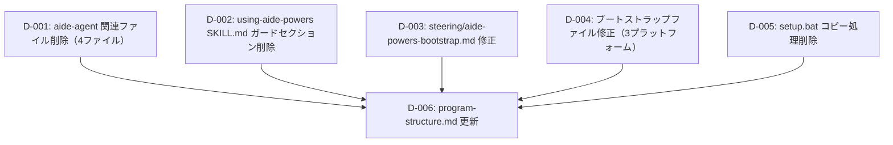

# 差分タスクリスト

## 依存関係グラフ

## タスク一覧

### タスク D-001: aide-agent 関連ファイル削除（4ファイル）
- 種別: 非プログラム削除
- 対象ファイル:
  - `steering/aide-agent.md`
  - `agents/aide-agent.md`
  - `.kiro/steering/aide-agent.md`
  - `.kiro/agents/aide-agent.json`
- テストファイル: なし（非プログラム成果物）
- 依存先: なし
- 設計参照: delta-design.md の「削除対象ファイル」セクション（削除1〜削除4）
- 手動確認観点:
  - T-001: 削除対象4ファイルがワークスペース内に存在しないこと（ls / dir で確認）

---

### タスク D-002: using-aide-powers SKILL.md エージェント切り替えガードセクション削除
- 種別: 非プログラム変更
- 対象ファイル: `skills/using-aide-powers/SKILL.md`
- テストファイル: なし（非プログラム成果物）
- 依存先: なし
- 設計参照: delta-design.md の「修正2: skills/using-aide-powers/SKILL.md」セクション
- 手動確認観点:
  - T-002: 修正後ファイルに `aide-agent` への参照が残っていないこと（grep 確認）
  - T-003: 直前のセパレータ `---` が残り、直後の `## 起動時の手順` に正しく接続していること

---

### タスク D-003: steering/aide-powers-bootstrap.md 修正
- 種別: 非プログラム変更
- 対象ファイル: `steering/aide-powers-bootstrap.md`
- テストファイル: なし（非プログラム成果物）
- 依存先: なし
- 設計参照: delta-design.md の「修正1: steering/aide-powers-bootstrap.md」セクション
- 手動確認観点:
  - T-002: 修正後ファイルに `aide-agent` への参照が残っていないこと（grep 確認）
  - T-003: 「using-aide-powers スキルを activate」の記述になっていること

---

### タスク D-004: プラットフォーム別ブートストラップファイル修正（3ファイル）
- 種別: 非プログラム変更
- 対象ファイル:
  - `rules/aide-powers-bootstrap.md`（Claude Code 用）
  - `rules/aide-powers-bootstrap.mdc`（Cursor 用）
  - `instructions/aide-powers-bootstrap.instructions.md`（Copilot 用）
- テストファイル: なし（非プログラム成果物）
- 依存先: なし
- 設計参照: delta-design.md の「修正4」「修正5」「修正6」セクション
- 手動確認観点:
  - T-002: 修正後の各ファイルに `aide-agent` への参照が残っていないこと（grep 確認）
  - T-003: 全ファイルが「using-aide-powers スキルを activate し、その指示に従ってください」の記述になっていること
  - T-005: Kiro IDE でプロジェクトを開き、ソフトウェア開発要求を出した際に using-aide-powers が activate されること

---

### タスク D-005: setup.bat aide-agent.md コピー処理削除
- 種別: 非プログラム変更
- 対象ファイル: `setup.bat`
- テストファイル: なし（非プログラム成果物）
- 依存先: なし
- 設計参照: delta-design.md の「修正3: setup.bat」セクション
- 手動確認観点:
  - T-002: 修正後ファイルに `aide-agent` への参照が残っていないこと（grep 確認）
  - T-004: setup.bat の実行が正常に完了すること（aide-agent.md コピー処理の削除によるエラーなし）

---

### タスク D-006: program-structure.md 更新
- 種別: 非プログラム変更
- 対象ファイル: `.aide/specs/aide-powers/program-structure.md`
- テストファイル: なし（非プログラム成果物）
- 依存先: D-001, D-002, D-003, D-004, D-005
- 設計参照: delta-design.md の「更新が必要な設計資料」セクション
- 更新内容:
  - エージェント一覧表（13→12）
  - フォルダツリー（`agents/aide-agent.md` 行の削除、`steering/aide-agent.md` 行の削除）
  - 起動フロー図（aide-agent steering 経由の段を削除）
  - 「aide-agent が agents/kiro/ に存在しない理由」セクション全体の削除
  - 配布マッピング表（`steering/aide-agent.md` 行の削除）
- 手動確認観点:
  - T-006: program-structure.md が aide-agent 削除後の実態と一致していること（ドキュメント内容の目視確認）
  - T-002: 更新後ファイルに不整合な `aide-agent` への参照が残っていないこと

---

## 網羅性チェック結果

### delta-design.md との照合

| delta-design.md 記載項目 | 対応タスク | カバー状態 |
|---|---|---|
| 削除1: steering/aide-agent.md | D-001 | ✅ |
| 削除2: agents/aide-agent.md | D-001 | ✅ |
| 削除3: .kiro/steering/aide-agent.md | D-001 | ✅ |
| 削除4: .kiro/agents/aide-agent.json | D-001 | ✅ |
| 修正1: steering/aide-powers-bootstrap.md | D-003 | ✅ |
| 修正2: skills/using-aide-powers/SKILL.md | D-002 | ✅ |
| 修正3: setup.bat | D-005 | ✅ |
| 修正4: rules/aide-powers-bootstrap.md | D-004 | ✅ |
| 修正5: rules/aide-powers-bootstrap.mdc | D-004 | ✅ |
| 修正6: instructions/aide-powers-bootstrap.instructions.md | D-004 | ✅ |
| 設計資料更新: program-structure.md | D-006 | ✅ |

### impact-analysis.md テスト項目との照合

| テスト項目 | 対応タスク | カバー状態 |
|---|---|---|
| T-001: 削除対象4ファイル不存在確認 | D-001 | ✅ |
| T-002: aide-agent 参照残留なし確認 | D-002〜D-006 | ✅ |
| T-003: using-aide-powers activate 記述確認 | D-002〜D-004 | ✅ |
| T-004: setup.bat 正常実行確認 | D-005 | ✅ |
| T-005: Kiro IDE 動作確認 | D-004 | ✅ |
| T-006: program-structure.md 整合確認 | D-006 | ✅ |

### 漏れ確認
- 全削除対象ファイル（4件）: カバー済み
- 全修正対象ファイル（6件）: カバー済み
- 設計ドキュメント更新（1件）: カバー済み
- **漏れなし**

---

## タスクサマリー

| タスク | 種別 | 並列可否 | 依存先 |
|---|---|---|---|
| D-001 | 非プログラム削除 | ✅ 並列可 | なし |
| D-002 | 非プログラム変更 | ✅ 並列可 | なし |
| D-003 | 非プログラム変更 | ✅ 並列可 | なし |
| D-004 | 非プログラム変更 | ✅ 並列可 | なし |
| D-005 | 非プログラム変更 | ✅ 並列可 | なし |
| D-006 | 非プログラム変更 | ❌ 直列 | D-001〜D-005 全完了後 |

- **総タスク数**: 6
- **並列実行可能**: D-001〜D-005（5タスク同時可）
- **直列実行必須**: D-006（最後に実行）
- **推定実行ウェーブ**: 2ウェーブ（Wave 1: D-001〜D-005 並列 → Wave 2: D-006）
