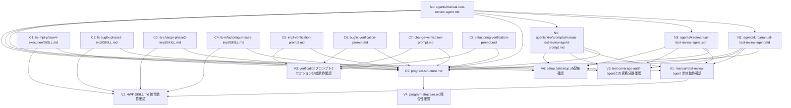

# 差分タスクリスト — 動作確認試験書レビューループの導入

- **feature_name:** aide-powers
- **変更ID:** 202607010000-manual-test-review-loop
- **入力:** delta-design.md（索引＋分割4ファイル）、impact-analysis.md（再分析版）、approach.md
- **本変更の性質:** メタ開発（実装対象＝Markdownファイル。スキル定義・エージェント定義・プロンプトファイル）

## 変更概要

動作確認試験書レビュー専用の名前付きエージェント `manual-test-review-agent` を4系統（N1〜N4）新設し、4WF（実装・バグ修正・変更・リファクタリング）の動作確認Step（C1〜C4）を「①試験書作成→②レビューPASSまでループ→③試験実行」の3工程に再構成する。3工程分離を実現するため、4本のverificationプロンプト（C5〜C8）を「試験書作成」「試験実行」の2セクション構成に再編する。program-structure.md（C9）はエージェント数12→13の全記述（22変更箇所）を更新する。

## 成果物種別

**非プログラム成果物（Markdownスキル定義・エージェント定義・プロンプトファイル）。** 通常のクラス・publicメソッドを持たないため、以下の特例を適用する:

- 「1親タスク=1ファイル」の原則は適用する
- 「サブタスク=publicメソッド単位」は適用しない。全タスクはサブタスクなしの親タスク単位で扱う（メソッドのないクラスと同様の扱い）
- 動作確認・リグレッションテスト（impact-analysis.md T-1〜T-12, R-1〜R-7）は別途「動作確認タスク」（V1〜V6）として扱う。テスト実装は該当しないため対象外、テスト実行に相当する工程は実際の動作確認実施として実工程とする

## テスト方針

- 自動テストフレームワーク: 導入しない（dev-environment.md §7.4）
- 検証方法: 手動検証（インストーラ実行確認・ハブスキル発動確認・setup-localによるテスト用ディレクトリ検証。dev-environment.md §7.1〜7.3）
- N1〜N4, C1〜C9: 実装＋設計準拠レビュー（目視）のみを実工程とする
- V1〜V6: 動作確認タスクとして、動作確認実施（テスト実行相当）＋動作確認結果レビューを実工程とする
- T-13（docs-dev/qa-agents.md への解説追記の動作確認）は本タスクリストの実装スコープ外（後述「スコープ外」参照）のため、動作確認タスクを設けない

---

## 依存関係グラフ（Mermaid）

**並列スタート可能タスク（依存先なし）:** N1, C1, C2, C3, C4, C5, C6, C7, C8（9タスクが同時起動可能）

---

## 新規追加タスク（N1〜N4）

### N1: agents/manual-test-review-agent.md 新規作成

| 項目 | 内容 |
|---|---|
| タスクID | N1 |
| 種別 | 新規追加 |
| 対象ファイル | `agents/manual-test-review-agent.md` |
| 依存先 | なし |
| 設計参照 | delta-design-review-agent.md「N1: agents/manual-test-review-agent.md（新規作成）」 |
| 作業内容 | フロントマター（name/description/Examples）＋プロンプト本文（担当範囲／担当外／入力／レビュープロセス4ステップ／出力フォーマット／行動規範7項目）を、設計書記載のコードブロックのとおり新規作成する |
| 検証項目 | T-1, T-2（V1で動作確認） |

### N2: agents/kiro/manual-test-review-agent.md 新規作成

| 項目 | 内容 |
|---|---|
| タスクID | N2 |
| 種別 | 新規追加 |
| 対象ファイル | `agents/kiro/manual-test-review-agent.md` |
| 依存先 | N1（本文はN1のプロンプト本文をそのまま使用するため） |
| 設計参照 | delta-design-review-agent.md「N2: agents/kiro/manual-test-review-agent.md（新規作成）」 |
| 作業内容 | N1と同一フロントマター＋`tools: ["@builtin"]`を追加し、`---`以降の本文はN1の本文をそのまま配置する |
| 検証項目 | T-1, T-2（V1で動作確認） |

### N3: agents/kiro/manual-test-review-agent.json 新規作成

| 項目 | 内容 |
|---|---|
| タスクID | N3 |
| 種別 | 新規追加 |
| 対象ファイル | `agents/kiro/manual-test-review-agent.json` |
| 依存先 | N1（description等の内容はN1と整合させるため） |
| 設計参照 | delta-design-review-agent.md「N3: agents/kiro/manual-test-review-agent.json（新規作成）」 |
| 作業内容 | `test-coverage-audit-agent.json`と同型のJSON（name/description/prompt/tools/allowedTools）を設計書記載のとおり新規作成する |
| 検証項目 | T-1, T-2（V1で動作確認） |

### N4: agents/kiro/prompts/manual-test-review-agent-prompt.md 新規作成

| 項目 | 内容 |
|---|---|
| タスクID | N4 |
| 種別 | 新規追加 |
| 対象ファイル | `agents/kiro/prompts/manual-test-review-agent-prompt.md` |
| 依存先 | N1（本文をそのまま使用するため。N3のJSONが `file://./prompts/manual-test-review-agent-prompt.md` で本ファイルを参照する） |
| 設計参照 | delta-design-review-agent.md「N4: agents/kiro/prompts/manual-test-review-agent-prompt.md（新規作成）」 |
| 作業内容 | N1のフロントマター以降の本文（`---`区切り線の下）をそのまま配置する（フロントマターなし、プロンプト本文のみ） |
| 検証項目 | T-1, T-2（V1で動作確認） |

---

## 既存変更タスク（C1〜C9）

### C1: skills/fs-impl-phase4-execution/SKILL.md — Step 2 再構成

| 項目 | 内容 |
|---|---|
| タスクID | C1 |
| 種別 | 既存変更 |
| 対象ファイル | `skills/fs-impl-phase4-execution/SKILL.md` |
| 依存先 | なし（N1〜N4と並列実行可能。C9のみがC1完了を要求） |
| 設計参照 | delta-design-skill-steps.md「C1: skills/fs-impl-phase4-execution/SKILL.md — Step 2 再構成」before→after、Integrationセクション before→after |
| 作業内容 | Step 2全文を、①試験書作成→②`manual-test-review-agent`によるレビュー（PASSまでループ、プロセスC準拠10回停滞ルール）→③試験実行の3工程構成に書き換える。完了条件・状態判定を更新する。Integrationセクションに`impl-verification-prompt.md`の役割変更（工程①③の2モード）と`manual-test-review-agent`の呼び出し追記を反映する |
| 検証項目 | T-3, T-7, T-11（V2で動作確認）、R-1, R-2（V2で動作確認） |

### C2: skills/fs-bugfix-phase2-impl/SKILL.md — Step 10 再構成

| 項目 | 内容 |
|---|---|
| タスクID | C2 |
| 種別 | 既存変更 |
| 対象ファイル | `skills/fs-bugfix-phase2-impl/SKILL.md` |
| 依存先 | なし |
| 設計参照 | delta-design-skill-steps.md「C2: skills/fs-bugfix-phase2-impl/SKILL.md — Step 10 再構成」before→after、Integrationセクション before→after |
| 作業内容 | Step 10全文を、wf_type=bugfixで①②③の3工程構成に書き換える（`bug-report.md`/`fix-plan.md`をWF固有入力として渡す）。完了条件・状態判定を更新する。Integrationセクションを更新する |
| 検証項目 | T-4, T-7, T-11（V2で動作確認）、R-1, R-2（V2で動作確認） |

### C3: skills/fs-change-phase2-impl/SKILL.md — Step 12 再構成

| 項目 | 内容 |
|---|---|
| タスクID | C3 |
| 種別 | 既存変更 |
| 対象ファイル | `skills/fs-change-phase2-impl/SKILL.md` |
| 依存先 | なし |
| 設計参照 | delta-design-skill-steps.md「C3: skills/fs-change-phase2-impl/SKILL.md — Step 12 再構成」（C1/C2との差異点）、Integrationセクション before→after |
| 作業内容 | Step 12を、wf_type=changeで①②③の3工程構成に書き換える（`change-requirements.md`の受入基準をWF固有入力として渡す）。完了条件の試験書パスを`{changes_dir}/testing/...`に、遷移先をStep13にする。Integrationセクションを更新する |
| 検証項目 | T-5, T-7, T-11（V2で動作確認）、R-1, R-2（V2で動作確認） |

### C4: skills/fs-refactoring-phase5-impl/SKILL.md — Step 3 再構成

| 項目 | 内容 |
|---|---|
| タスクID | C4 |
| 種別 | 既存変更 |
| 対象ファイル | `skills/fs-refactoring-phase5-impl/SKILL.md` |
| 依存先 | なし |
| 設計参照 | delta-design-skill-steps.md「C4: skills/fs-refactoring-phase5-impl/SKILL.md — Step 3 再構成」（C1/C2との差異点）、Integrationセクション before→after |
| 作業内容 | Step 3を、wf_type=refactoringで①②③の3工程構成に書き換える（`refactoring-plan.md`の外部振る舞い基準をWF固有入力として渡す）。完了条件の試験書パスを`{refactoring_dir}/testing/...`に、遷移先を後処理にする。Integrationセクションを更新する |
| 検証項目 | T-6, T-7, T-11（V2で動作確認）、R-1, R-2（V2で動作確認） |

### C5: skills/fs-impl-phase4-execution/impl-verification-prompt.md 2セクション化

| 項目 | 内容 |
|---|---|
| タスクID | C5 |
| 種別 | 既存変更 |
| 対象ファイル | `skills/fs-impl-phase4-execution/impl-verification-prompt.md` |
| 依存先 | なし |
| 設計参照 | delta-design-verification-prompts.md「C5: impl-verification-prompt.md」before→after |
| 作業内容 | 冒頭に`{{execution_mode}}`分岐説明を追加。プレースホルダーに`{{execution_mode}}`, `{{test_plan_paths}}`, `{{review_fix_instructions}}`を追加。「セクション1: 試験書作成」（機能リスト作成・試験書作成・`{{review_fix_instructions}}`への対応手順・セクション1の出力）と「セクション2: 試験実行」（試験実行方法・結果の出力＝試験項目ごとの実施方法テーブル）に再編する |
| 検証項目 | T-8, T-9, T-10（V3で動作確認）、R-3, R-4（V3で動作確認） |

### C6: skills/fs-bugfix-phase2-impl/bugfix-verification-prompt.md 2セクション化

| 項目 | 内容 |
|---|---|
| タスクID | C6 |
| 種別 | 既存変更 |
| 対象ファイル | `skills/fs-bugfix-phase2-impl/bugfix-verification-prompt.md` |
| 依存先 | なし |
| 設計参照 | delta-design-verification-prompts.md「C6: bugfix-verification-prompt.md」（C5との構造差分表） |
| 作業内容 | C5と同一の2セクション構造に再編する。プレースホルダーを`{{bugfix_dir}}`, `{{bug_report_path}}`, `{{fix_plan_path}}`, `{{fix_design_path}}`, `{{reproduction_steps}}`, `{{acceptance_criteria}}`に、機能洗い出し元をbug-report.md/fix-plan.md/fix-design.mdに置き換える。`{{execution_mode}}`, `{{test_plan_paths}}`, `{{review_fix_instructions}}`を追加する |
| 検証項目 | T-8, T-9, T-10（V3で動作確認）、R-3, R-4（V3で動作確認） |

### C7: skills/fs-change-phase2-impl/change-verification-prompt.md 2セクション化

| 項目 | 内容 |
|---|---|
| タスクID | C7 |
| 種別 | 既存変更 |
| 対象ファイル | `skills/fs-change-phase2-impl/change-verification-prompt.md` |
| 依存先 | なし |
| 設計参照 | delta-design-verification-prompts.md「C7: change-verification-prompt.md」（C5との構造差分表） |
| 作業内容 | C5と同一の2セクション構造に再編する。プレースホルダーを`{{changes_dir}}`, `{{change_requirements_path}}`, `{{delta_design_path}}`, `{{acceptance_criteria}}`, `{{impact_analysis_path}}`に、機能洗い出し元をchange-requirements.md/delta-design.md/impact-analysis.mdに置き換える。`{{execution_mode}}`, `{{test_plan_paths}}`, `{{review_fix_instructions}}`を追加する |
| 検証項目 | T-8, T-9, T-10（V3で動作確認）、R-3, R-4（V3で動作確認） |

### C8: skills/fs-refactoring-phase5-impl/refactoring-verification-prompt.md 2セクション化

| 項目 | 内容 |
|---|---|
| タスクID | C8 |
| 種別 | 既存変更 |
| 対象ファイル | `skills/fs-refactoring-phase5-impl/refactoring-verification-prompt.md` |
| 依存先 | なし |
| 設計参照 | delta-design-verification-prompts.md「C8: refactoring-verification-prompt.md」（C5との構造差分表） |
| 作業内容 | C5と同一の2セクション構造に再編する。プレースホルダーを`{{refactoring_dir}}`, `{{refactoring_design_path}}`, `{{safety_net_result}}`に、機能洗い出し元をrefactoring-design.mdの変更対象に置き換える。`{{execution_mode}}`, `{{test_plan_paths}}`, `{{review_fix_instructions}}`を追加する |
| 検証項目 | T-8, T-9, T-10（V3で動作確認）、R-3, R-4（V3で動作確認） |

### C9: .aide/specs/aide-powers/program-structure.md 更新（22変更箇所）

| 項目 | 内容 |
|---|---|
| タスクID | C9 |
| 種別 | 既存変更 |
| 対象ファイル | `.aide/specs/aide-powers/program-structure.md` |
| 依存先 | N1, N2, N3, N4, C1, C2, C3, C4, C5, C6, C7, C8（全ファイルの実体・呼び出し構成が確定した後に構成記述を整合させるため） |
| 設計参照 | delta-design-program-structure.md 変更箇所1〜22（フォルダ構成ツリー×3、解説文「12→13」×8、エージェント一覧・役割分担マトリクスへの行追加×2、エージェント別詳細解析への新規セクション×1、4WF各SKILLセクションの呼び出しエージェント欄追加＋Step番号誤記訂正×4） |
| 作業内容 | 変更箇所1〜22を1件ずつ、設計書記載のbefore→afterのとおりに反映する。特に変更箇所2・3（アルファベット順配置訂正）、変更箇所13（`#### 13. manual-test-review-agent`セクション新規追加）、変更箇所21（change WFのStep12/13誤記訂正）を漏れなく反映する |
| 検証項目 | T-12（V4で動作確認）、R-6（V4で動作確認） |

---

## テスト・動作確認タスク（V1〜V6）

impact-analysis.md の「テスト対象機能」（T-1〜T-12, R-1〜R-7）から抽出。テスト実装は該当しないため対象外（`➖ skip`）とし、動作確認の実施そのものを実工程とする。

### V1: manual-test-review-agent 単体動作確認

| 項目 | 内容 |
|---|---|
| タスクID | V1 |
| 種別 | 動作確認 |
| 対象 | N1〜N4（4系統のmanual-test-review-agent） |
| 依存先 | N1, N2, N3, N4 |
| 対応するテスト対象 | T-1（4観点・wf_type別基準の適用と出力への明記）、T-2（APPROVED/NEEDS_FIX判定ロジック、指摘の修正可能粒度） |
| 動作確認方法 | 4系統（`agents/manual-test-review-agent.md`, `agents/kiro/manual-test-review-agent.md`, `agents/kiro/manual-test-review-agent.json`, `agents/kiro/prompts/manual-test-review-agent-prompt.md`）でエージェントを実際に起動し、サンプル試験書（意図的に内部視点混入・期待結果目視不能等の不備を含むもの）に対してレビューさせ、NEEDS_FIX＋修正可能粒度の指摘が出ること、不備を修正した試験書に対してAPPROVEDが返ることを確認する。wf_type（impl/bugfix/change/refactoring）を切り替え、出力の「適用基準」欄に正しいWF別基準が明記されることを確認する |

### V2: 4WF動作確認Step 統合動作確認

| 項目 | 内容 |
|---|---|
| タスクID | V2 |
| 種別 | 動作確認 |
| 対象 | C1〜C4（4 SKILL.mdの動作確認Step） |
| 依存先 | C1, C2, C3, C4, V1 |
| 対応するテスト対象 | T-3, T-4, T-5, T-6（3工程再構成の順序保証）、T-7（10回停滞時のユーザー相談・続行選択時のカウントリセット）、T-11（ユーザー報告のエビデンス明示）、R-1（NG時の既存差し戻しフロー維持）、R-2（追加確認要求/NG分岐の既存フロー維持） |
| 動作確認方法 | 4WFいずれかを実際に実行し、動作確認Stepで①試験書作成→②レビュー（NEEDS_FIXの場合は修正→再レビューのループ）→③試験実行の順序が守られ、②APPROVED前に③が実行されないことを確認する。ユーザー報告に試験項目ごとの実施方法・エビデンスが添えられることを確認する。可能であれば意図的にNEEDS_FIXを誘発し、ループと10回停滞時のユーザー相談導線を確認する（実運用上10回の実施が困難な場合はコードレビューによる代替確認とし、その旨を報告する） |

### V3: verificationプロンプト2セクション分岐動作確認

| 項目 | 内容 |
|---|---|
| タスクID | V3 |
| 種別 | 動作確認 |
| 対象 | C5〜C8（4 verification-prompt.md） |
| 依存先 | C5, C6, C7, C8 |
| 対応するテスト対象 | T-8（execution_mode分岐）、T-9（review_fix_instructionsによる指摘反映）、T-10（エビデンス報告テーブル）、R-3（試験実行部分の内容維持）、R-4（機能リスト作成手順の維持） |
| 動作確認方法 | `execution_mode=create`指定時に「セクション1」のみ実行され試験実行が行われないこと、`execution_mode=execute`指定時に「セクション2」のみ実行されることを確認する。`review_fix_instructions`を渡した再実行で指摘が試験書に反映されることを確認する。結果報告に試験項目ごとの実施方法（実動作確認/コードレビュー代替）テーブルが出力されることを確認する |

### V4: program-structure.md 整合性確認

| 項目 | 内容 |
|---|---|
| タスクID | V4 |
| 種別 | 動作確認 |
| 対象 | C9 |
| 依存先 | C9 |
| 対応するテスト対象 | T-12（22変更箇所の反映・「12」残存記述ゼロ）、R-6（change WFのStep12/13呼び出し記述の実態一致確認） |
| 動作確認方法 | program-structure.md内を検索し「12」の残存記述がゼロであることを確認する。エージェント一覧・役割分担マトリクス・4WF各SKILLセクションの「呼び出しエージェント」欄・アルファベット順配置・change WFのStep番号訂正が反映されていることを目視確認する。`skills/fs-change-phase2-impl/SKILL.md`の実ファイルを確認し、`change-verification-prompt.md`=Step12、`change-doc-syncer-prompt.md`=Step13であることとprogram-structure.mdの記述が一致することを確認する |

### V5: test-coverage-audit-agent との責務分離確認

| 項目 | 内容 |
|---|---|
| タスクID | V5 |
| 種別 | 動作確認 |
| 対象 | N1〜N4（既存test-coverage-audit-agentとの並行動作） |
| 依存先 | N1, N2, N3, N4 |
| 対応するテスト対象 | R-5（test-coverage-audit-agentの量的網羅性監査が重複実行・機能低下しないこと） |
| 動作確認方法 | 実装WFの最終チェック（fs-impl-phase5-final-check）で`test-coverage-audit-agent`が従来通り動作すること、`manual-test-review-agent`の追加によって処理内容・出力形式に変化がないことを確認する。両エージェントの「担当外」セクションの相互参照が実際の担当範囲と一致していることを確認する |

### V6: setup.bat / setup.sh 配布確認

| 項目 | 内容 |
|---|---|
| タスクID | V6 |
| 種別 | 動作確認 |
| 対象 | N1〜N4（新規4ファイルの配布） |
| 依存先 | N1, N2, N3, N4 |
| 対応するテスト対象 | R-7（setup.bat/setup.shによる新規4ファイルの配布） |
| 動作確認方法 | dev-environment.md §7.3 の setup-local によるテスト用ディレクトリ検証を用い、`setup-local.bat <テスト用ディレクトリ>` または `./setup-local.sh <テスト用ディレクトリ>` を実行し、`agents/kiro/`丸ごとコピー・`agents/*.md`個別コピーによって新規4ファイルが正しく配布先に含まれることを確認する |

---

## スコープ外（本タスクリストで扱わない項目）

| 項目 | 理由 |
|---|---|
| T-13: docs-dev/02-ai-agent/04-agents/qa-agents.md への `manual-test-review-agent` 解説追記（D1） | delta-design.md「更新が必要な設計資料」に before→after が記載済みだが、更新タイミングは「本変更の実装時（doc-sync で対応）」と明記されている。各WFの doc-sync Step（例: change WF Step13 `change-doc-syncer-prompt.md`）が実行時に自動反映する対象であり、本差分タスクリストが個別タスク化する対象ではない |
| user-requirements.md UR-004 / system-requirements.md §1.2 の「12種」記述更新 | impact-analysis.md §4.3 のとおり、delta-design.md の更新対象に含まれておらず、本エージェントは delta-design.md の修正権限を持たない。ユーザー・後続の設計担当への申し送り事項として扱う（本タスクリストでは着手しない） |

---

## 網羅性チェック結果

delta-design.md（メイン＋分割4ファイル）の全変更項目（N1〜N4, C1〜C9 = 13ファイル）と、impact-analysis.mdのテスト対象機能（T-1〜T-13, R-1〜R-7）を、タスクリストの全タスクと照合した。

### チェック1回目

| 変更項目 | 対応タスク | 判定 |
|---|---|---|
| N1: agents/manual-test-review-agent.md | N1 | ✅ 反映済み |
| N2: agents/kiro/manual-test-review-agent.md | N2 | ✅ 反映済み |
| N3: agents/kiro/manual-test-review-agent.json | N3 | ✅ 反映済み |
| N4: agents/kiro/prompts/manual-test-review-agent-prompt.md | N4 | ✅ 反映済み |
| C1: skills/fs-impl-phase4-execution/SKILL.md | C1 | ✅ 反映済み |
| C2: skills/fs-bugfix-phase2-impl/SKILL.md | C2 | ✅ 反映済み |
| C3: skills/fs-change-phase2-impl/SKILL.md | C3 | ✅ 反映済み |
| C4: skills/fs-refactoring-phase5-impl/SKILL.md | C4 | ✅ 反映済み |
| C5: skills/fs-impl-phase4-execution/impl-verification-prompt.md | C5 | ✅ 反映済み |
| C6: skills/fs-bugfix-phase2-impl/bugfix-verification-prompt.md | C6 | ✅ 反映済み |
| C7: skills/fs-change-phase2-impl/change-verification-prompt.md | C7 | ✅ 反映済み |
| C8: skills/fs-refactoring-phase5-impl/refactoring-verification-prompt.md | C8 | ✅ 反映済み |
| C9: .aide/specs/aide-powers/program-structure.md | C9 | ✅ 反映済み |

| テスト対象 | 対応タスク | 判定 |
|---|---|---|
| T-1, T-2 | V1 | ✅ 反映済み |
| T-3 | V2 | ✅ 反映済み |
| T-4 | V2 | ✅ 反映済み |
| T-5 | V2 | ✅ 反映済み |
| T-6 | V2 | ✅ 反映済み |
| T-7 | V2 | ✅ 反映済み |
| T-8, T-9, T-10 | V3 | ✅ 反映済み |
| T-11 | V2 | ✅ 反映済み |
| T-12 | V4 | ✅ 反映済み |
| T-13 | スコープ外（doc-syncで自動反映。理由記載済み） | ✅ 判定済み（未反映ではなく対象外判定） |
| R-1, R-2 | V2 | ✅ 反映済み |
| R-3, R-4 | V3 | ✅ 反映済み |
| R-5 | V5 | ✅ 反映済み |
| R-6 | V4 | ✅ 反映済み |
| R-7 | V6 | ✅ 反映済み |

**結果:** 漏れ 0件。delta-design.mdの全13変更項目、impact-analysis.mdの全19テスト対象（T-1〜T-13, R-1〜R-7）が、タスクリストの19タスク（N1〜N4, C1〜C9, V1〜V6）に反映済み。ループ終了。

---

## 実行順序（トポロジカルソート結果）

| 順序 | タスクID | 起動条件 |
|---|---|---|
| 1（並列） | N1, C1, C2, C3, C4, C5, C6, C7, C8 | 依存先なし。9タスク同時起動可能 |
| 2（並列） | N2, N3, N4 | N1 完了後。3タスク同時起動可能 |
| 3（並列） | V1, V5, V6 | N1〜N4 完了後。3タスク同時起動可能 |
| 4（並列） | V2, V3 | V2: C1〜C4, V1 完了後／V3: C5〜C8 完了後 |
| 5 | C9 | N1〜N4, C1〜C8 完了後 |
| 6 | V4 | C9 完了後 |

**最大並列度:** 9（ステップ1）

**循環依存チェック:** N1→N2/N3/N4→C9、C1〜C8→C9、C9→V4という一方向の流れのみであり、循環依存は検出されなかった。
