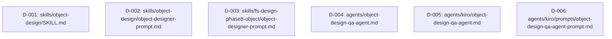

# 差分タスクリスト: object-design 役割定義明確化（外部連携部分の技術調査・公式ドキュメント整合性検証）

> 本変更は6つのスキル/エージェント定義ファイル（Markdown）への既存変更（記述追加）であり、新規プログラムクラスの追加ではない。
> 全て非プログラム成果物（実行ロジックを持たないMarkdown定義ファイル）のため、テスト実装・テスト実行・コード品質レビューは対象外とし、実装・設計準拠レビューのみを実工程とする（dev-environment.md §7.4 自動テストなし方針）。
> 「既存変更=1変更箇所=1親タスク」ルールに従い、ファイル単位で6親タスク（D-001〜D-006）を構成する。各ファイルは既存メソッド変更ではなくMarkdown記述の追記であり、publicメソッド単位のサブタスク分割は適用外（impl-task-planningの「既存メソッド変更のみの場合はサブタスクなし」に相当）。サブタスクは設けない。

## 依存関係グラフ

実行リンク:
- 並列スタート可能: `D-001, D-002, D-003, D-004, D-005, D-006`（6タスク全て依存先なし。同時起動可能）
- 各タスクは別ファイルを変更するため、同一ファイル競合チェック・同一テストファイル競合チェックのいずれにも該当しない
- 循環依存: なし（トポロジカルソート: レベル1のみ、6タスク全てが最終レベル兼開始レベル）

## タスク一覧

### タスク D-001: skills/object-design/SKILL.md
- 状態: ✅ 完了（implement ✅ done / spec_review ✅ done、impl-process-checklist.md 参照）
- 種別: 既存変更
- 対象ファイル: `skills/object-design/SKILL.md`
- 依存先: なし
- 対応REQ: REQ-C-002
- 設計参照: `delta-design-object-design-skill.md` 変更対象1-1〜1-4（before/after全文）／`impact-analysis.md` 変更対象ファイル表 #1
- 実装内容（4項目）:
  1. 【変更対象1-1】mode: create Step2 — サブエージェント検証内容の箇条書き末尾に「外部連携部分の技術調査結果・参考ドキュメントリンクの記載状況」を追加する
  2. 【変更対象1-2】mode: delta Step3 — 既存Write手順（旧手順4）の直前に「変更が外部ツール・外部サービス連携部分に及ぶ場合、tech-investigation (aide-powers skill) を実施し、調査結果と参考ドキュメントリンクを技術的実装情報セクションに反映する」を挿入し、後続手順の番号を1つずらす
  3. 【変更対象1-3】mode: reverse Step2 — 既存6項目の番号リスト末尾に「外部連携部分の参考ドキュメントリンクの記録（既存コードのコメントやREADME等から抽出できる場合は記録し、抽出できない場合は tech-investigation (aide-powers skill) で補足調査してもよい）」を7番目として追加する
  4. 【変更対象1-4】Integration > Related skills — 既存3項目の末尾に `tech-investigation (aide-powers skill)` への参照行を追加する
- 設計準拠レビュー観点:
  - 4項目全てが該当箇所に追加されており、既存の記述・順序・意味関係が変化していないこと（追加のみであることの確認）
  - delta モード・reverse モードの番号ずれが設計書の指示どおりであること（delta: 旧4→5、reverse: 新規7番目追加のみで既存1〜6は不変）

### タスク D-002: skills/object-design/object-designer-prompt.md
- 状態: ✅ 完了（implement ✅ done / spec_review ✅ done、impl-process-checklist.md 参照）
- 種別: 既存変更
- 対象ファイル: `skills/object-design/object-designer-prompt.md`
- 依存先: なし
- 対応REQ: REQ-C-001, REQ-C-002
- 設計参照: `delta-design-object-designer-prompt.md` 変更対象2-1〜2-4（before/after全文）／`impact-analysis.md` 変更対象ファイル表 #2
- 実装内容（5項目）:
  1. 【変更対象2-1a】quality_check モード品質基準チェック項目冒頭の総数表記「以下の8カテゴリを全レイヤーに適用して検証する。」を「以下の9カテゴリを全レイヤーに適用して検証する。」に修正する
  2. 【変更対象2-1b】quality_check モード — 既存カテゴリ8「技術的実装情報の反映チェック」の直後に、カテゴリ9「外部連携部分の技術調査・参考ドキュメントチェック（全レイヤー）」（4つの検証観点＋「外部連携が存在しないクラスは対象外」の但し書き）を新設する
  3. 【変更対象2-2】delta モード処理手順 手順7 — 「技術情報の反映を確認する」の箇条書きに「変更が外部ツール・外部サービス連携部分に及ぶ場合、tech-investigation (aide-powers skill) を実施し、調査結果の要約を『技術調査結果』カテゴリ、参照した公式ドキュメントのURLを『参考ドキュメント（URLリンク付き）』カテゴリにそれぞれ反映する」を追加する（手順番号7〜9は不変）
  4. 【変更対象2-3】reverse モード処理手順 手順10 — 「技術的実装情報を抽出する」の箇条書きに「外部ツール・外部サービスと連携するクラスについては、既存コードのコメントやREADME等から参考ドキュメントURLを抽出できる場合は『参考ドキュメント（URLリンク付き）』カテゴリに記録する。抽出できない場合は tech-investigation (aide-powers skill) で補足調査してもよい。調査結果の要約は『技術調査結果』カテゴリに記載する」を追加する（手順番号は不変）
  5. 【変更対象2-4】reverse モード出力形式テンプレート — 「技術的実装情報」テーブル（既存5カテゴリ）の末尾に「技術調査結果」「参考ドキュメント（URLリンク付き）」の2カテゴリ行を追加する（既存の運用注記「※該当するカテゴリのみ記載する。該当なしの場合はセクション自体を省略してよい。」は変更しない）
- 設計準拠レビュー観点:
  - カテゴリ総数表記（8→9）と実際のカテゴリ数（新設カテゴリ9追加後の総数）が一致していること
  - 既存カテゴリ1〜8、既存delta手順1〜9、既存reverse手順1〜9・11以降の記述・順序・番号が変化していないこと
  - reverseモード出力テンプレートの新設2行が既存5行と同一の列構成（カテゴリ／内容）であること

### タスク D-003: skills/fs-design-phase8-object/object-designer-prompt.md
- 状態: ✅ 完了（implement ✅ done / spec_review ✅ done、impl-process-checklist.md 参照）
- 種別: 既存変更
- 対象ファイル: `skills/fs-design-phase8-object/object-designer-prompt.md`
- 依存先: なし
- 対応REQ: REQ-C-001, REQ-C-002
- 設計参照: `delta-design-phase8-prompt.md` 変更対象3-1〜3-3（before/after全文）／`impact-analysis.md` 変更対象ファイル表 #3
- 実装内容（3項目）:
  1. 【変更対象3-1】クラス設計の共通要件（全モード共通） — 既存4項目（役割／パブリックメソッド／パブリックプロパティ／依存関係）の直後、「オブジェクトの生成・管理パターン」セクションの直前に、「技術的実装情報（該当する場合）」テーブル（既存5カテゴリ＋新規2カテゴリの計7カテゴリ）を新設する。本ファイルには当該テンプレート自体が存在しなかったため新設であり、既存構造の変更ではない
  2. 【変更対象3-2】mode: phase8_{layer-name} 処理手順 — 既存Write手順（旧手順5）の直前に「対象クラスが外部ツール・外部サービスと連携する場合、tech-investigation (aide-powers skill) を実施し、調査結果の要約を『技術調査結果』カテゴリ、参照した公式ドキュメントのURLを『参考ドキュメント（URLリンク付き）』カテゴリとして、技術的実装情報セクションに反映する」を挿入し、後続手順の番号を1つずらす（旧5→6、旧6→7）
  3. 【変更対象3-3】mode: fix 処理手順 手順1 — 問題種別の箇条書き（既存4項目）に「外部連携部分の技術調査・参考ドキュメント不足 → tech-investigation (aide-powers skill) を実施し、調査結果と参考ドキュメントリンクを技術的実装情報セクションに反映する」を追加する
- 設計準拠レビュー観点:
  - 新設テンプレートが `skills/object-design/object-designer-prompt.md` のreverseモード出力テンプレート（変更対象2-4）と同一の7カテゴリ構成・同一運用ルールであること（共通スキル側とローカル複製側の一貫性）
  - phase8_{layer-name} 処理手順の既存手順1〜4の記述・順序が変化しておらず、新設手順挿入による番号ずれ（旧5→6、旧6→7）のみであること
  - mode: fix の既存4項目の対応方法が変化していないこと

### タスク D-004: agents/object-design-qa-agent.md
- 状態: ✅ 完了（implement ✅ done / spec_review ✅ done、impl-process-checklist.md 参照）
- 種別: 既存変更
- 対象ファイル: `agents/object-design-qa-agent.md`
- 依存先: なし
- 対応REQ: REQ-C-003
- 設計参照: `delta-design-qa-agents.md` 変更対象4-1・4-2 および「追加対応: 見出し番号の不整合解消（ユーザー指摘）」セクション全文／`impact-analysis.md` 変更対象ファイル表 #4
- 実装内容（3項目）:
  1. 【変更対象4-1】担当範囲 — 既存10項目リストの末尾に「外部連携部分の技術調査結果・公式ドキュメントリンク検証」を追加する
  2. 【変更対象4-2前半】検証項目K「技術情報記載有無検証」の直後に、検証項目L「外部連携部分の技術調査結果・公式ドキュメントリンク検証」（4つの検証観点＋「外部連携が存在しないクラスは対象外」「全レイヤーに適用する」の記述）を新設する
  3. 【変更対象4-2後半・見出し番号修正】検証項目リスト直後の見出し「ステップ3: 判定と結果の出力」を「ステップ4: 判定と結果の出力」に修正する（直前の「ステップ3: 検証項目の実行」との番号重複を解消。ユーザー承認済み: 2026-07-06、選択肢2「今回の変更に含めて修正する」）
- 設計準拠レビュー観点:
  - 検証項目A〜Kの判定ロジック・出力フォーマット・総合判定計算方法（FAIL=0かつWARNING=0→APPROVED）が変化していないこと
  - 見出し修正後、本ファイル内のステップ番号が1（読み込み）→2（考慮漏れ検証）→3（検証項目の実行）→4（判定と結果の出力）の連番になっていること

### タスク D-005: agents/kiro/object-design-qa-agent.md
- 状態: ✅ 完了（implement ✅ done / spec_review ✅ done、impl-process-checklist.md 参照）
- 種別: 既存変更
- 対象ファイル: `agents/kiro/object-design-qa-agent.md`
- 依存先: なし
- 対応REQ: REQ-C-003
- 設計参照: `delta-design-qa-agents.md` 変更対象5-1・5-2（before/after全文）／`impact-analysis.md` 変更対象ファイル表 #5
- 実装内容（2項目）:
  1. 【変更対象5-1】担当範囲 — 既存10項目リストの末尾に「外部連携部分の技術調査結果・公式ドキュメントリンク検証」を追加する（D-004と同一内容）
  2. 【変更対象5-2】検証項目K直後に検証項目Lを新設する（D-004と同一内容）。本ファイルは元から見出しが「ステップ4: 判定と結果の出力」と正しい連番になっているため、見出し番号の変更は行わない
- 設計準拠レビュー観点:
  - 検証項目A〜Kの判定ロジック・出力フォーマットが変化していないこと
  - 見出し「ステップ4: 判定と結果の出力」を誤って変更していないこと（変更不要な項目への誤修正防止）

### タスク D-006: agents/kiro/prompts/object-design-qa-agent-prompt.md
- 状態: ✅ 完了（implement ✅ done / spec_review ✅ done、impl-process-checklist.md 参照）
- 種別: 既存変更
- 対象ファイル: `agents/kiro/prompts/object-design-qa-agent-prompt.md`
- 依存先: なし
- 対応REQ: REQ-C-003
- 設計参照: `delta-design-qa-agents.md` 変更対象6-1・6-2（before/after全文）／`impact-analysis.md` 変更対象ファイル表 #6
- 実装内容（2項目）:
  1. 【変更対象6-1】担当範囲 — 既存10項目リストの末尾に「外部連携部分の技術調査結果・公式ドキュメントリンク検証」を追加する（D-004・D-005と同一内容）
  2. 【変更対象6-2】検証項目K直後に検証項目Lを新設する（D-004・D-005と同一内容）。本ファイルは元から見出しが「ステップ4: 判定と結果の出力」と正しい連番になっているため、見出し番号の変更は行わない
- 設計準拠レビュー観点:
  - 検証項目A〜Kの判定ロジック・出力フォーマットが変化していないこと
  - 見出し「ステップ4: 判定と結果の出力」を誤って変更していないこと（変更不要な項目への誤修正防止）

## 網羅性チェック結果

- チェック回数: 1回
- 設計書（delta-design.md、4分割ファイル）の総変更項目数: 14件（D-001:4件、D-002:5件[カテゴリ新設1件+カテゴリ数表記修正1件+delta手順1件+reverse手順1件+reverse出力テンプレート1件]、D-003:3件、D-004:3件[担当範囲1件+検証項目L新設1件+見出し修正1件]、D-005:2件、D-006:2件）
- タスクリストの総タスク数: 6件（D-001〜D-006）
- 変更項目→タスク対応:
  - D-001（4項目: 1-1create/1-2delta/1-3reverse/1-4Related skills）→ タスクD-001 実装内容1〜4 ✅
  - D-002（5項目: 2-1a総数表記/2-1bカテゴリ9新設/2-2delta手順7/2-3reverse手順10/2-4reverse出力テンプレート）→ タスクD-002 実装内容1〜5 ✅
  - D-003（3項目: 3-1テンプレート新設/3-2phase8手順/3-3fix手順1）→ タスクD-003 実装内容1〜3 ✅
  - D-004（3項目: 4-1担当範囲/4-2検証項目L新設/4-2見出し修正）→ タスクD-004 実装内容1〜3 ✅
  - D-005（2項目: 5-1担当範囲/5-2検証項目L新設）→ タスクD-005 実装内容1〜2 ✅
  - D-006（2項目: 6-1担当範囲/6-2検証項目L新設）→ タスクD-006 実装内容1〜2 ✅
- 最終結果: 漏れなし

## タスクサマリー

| 種別 | 件数 | タスク |
|---|---|---|
| 既存変更 | 6 | D-001, D-002, D-003, D-004, D-005, D-006 |
| **合計** | **6** | — |

- 全タスクが非プログラム成果物（Markdown定義ファイルへの記述追加）であり、プログラムコードの実装・テスト実装・テスト実行・コード品質レビューは対象外。実装／設計準拠レビューのみを実工程とする。
- 全6タスクは依存先なし・相互に独立したファイル変更のため、最大並列度6（同時に全タスクを起動可能）。
- 動作確認（tech-investigation実施ステップの実働確認、検証項目Lの判定動作確認等）は fs-change-phase2-impl Step11（動作確認Step）で実施するため、本タスクリストには含めない。
