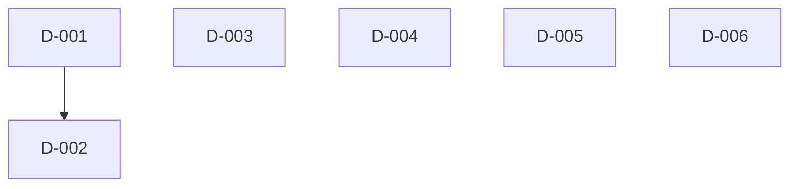

# 差分タスクリスト

## 依存関係グラフ

## タスク一覧

### タスク D-001: skills/object-design/SKILL.md — 品質基準セクションへのルール追加
- 種別: 既存変更
- 対象ファイル: skills/object-design/SKILL.md
- テストファイル: なし（非プログラム）
- 依存先: なし
- 設計参照: delta-design.md の「変更対象1: skills/object-design/SKILL.md — 品質基準セクションへのルール追加」
- 成果物種別: 非プログラム

**変更内容:**
- 品質基準（全モード共通）セクション末尾に「役割定義→publicメソッド導出ルール」サブセクションを追加
- 導出手順（5ステップ）、セルフチェック基準（3項目）、トレーサビリティ（1項目）を記載

---

### タスク D-002: skills/object-design/object-designer-prompt.md — テンプレート・手順・チェック項目の拡張
- 種別: 既存変更
- 対象ファイル: skills/object-design/object-designer-prompt.md
- テストファイル: なし（非プログラム）
- 依存先: D-001（品質基準ルールを参照するため）
- 設計参照: delta-design.md の「変更対象2」「変更対象3」「変更対象4」「変更対象5」
- 成果物種別: 非プログラム

**変更内容（4箇所）:**
1. reverse モード出力形式のクラス一覧テンプレートに「役割定義（具体）」セクション追加、メソッドテーブルに「対応する役割定義」列追加、「技術的実装情報」セクション追加（変更対象2）
2. delta モード処理手順にステップ6（セルフチェック）・ステップ7（技術情報反映確認）追加、旧ステップ6〜7を8〜9に繰り下げ（変更対象3）
3. quality_check モード品質基準チェック項目を6カテゴリ→8カテゴリに拡張（カテゴリ7・8追加）（変更対象4）
4. reverse モード処理手順にステップ9（役割定義導出）・ステップ10（技術情報抽出）追加、旧ステップ9〜11を11〜13に繰り下げ（変更対象5）

---

### タスク D-003: agents/object-design-qa-agent.md — 検証項目J・Kの追加
- 種別: 既存変更
- 対象ファイル: agents/object-design-qa-agent.md
- テストファイル: なし（非プログラム）
- 依存先: なし
- 設計参照: delta-design.md の「変更対象6」「変更対象7」
- 成果物種別: 非プログラム

**変更内容:**
- ステップ3の検証項目I の後に検証項目J（役割↔publicメソッド網羅性検証）と検証項目K（技術情報記載有無検証）を追加
- ステップ番号構造は変更なし（既存のままとする）

---

### タスク D-004: agents/kiro/object-design-qa-agent.md — 検証項目J・Kの追加（Kiro IDE版）
- 種別: 既存変更
- 対象ファイル: agents/kiro/object-design-qa-agent.md
- テストファイル: なし（非プログラム）
- 依存先: なし
- 設計参照: delta-design.md の「変更対象8」
- 成果物種別: 非プログラム

**変更内容:**
- 変更対象6と同一の差分（検証項目J・K）をKiro IDE版にも適用

---

### タスク D-005: agents/kiro/prompts/object-design-qa-agent-prompt.md — 検証項目J・Kの追加（Kiro CLI版）
- 種別: 既存変更
- 対象ファイル: agents/kiro/prompts/object-design-qa-agent-prompt.md
- テストファイル: なし（非プログラム）
- 依存先: なし
- 設計参照: delta-design.md の「変更対象9」
- 成果物種別: 非プログラム

**変更内容:**
- 変更対象6と同一の差分（検証項目J・K）をKiro CLI版プロンプトにも適用

---

### タスク D-006: agents/kiro/object-design-qa-agent.json — description更新
- 種別: 既存変更
- 対象ファイル: agents/kiro/object-design-qa-agent.json
- テストファイル: なし（非プログラム）
- 依存先: なし
- 設計参照: delta-design.md の「変更対象10」
- 成果物種別: 非プログラム

**変更内容:**
- description フィールドに「役割↔publicメソッド網羅性、技術情報記載有無を検証する。」を追記

---

## 網羅性チェック結果
- 設計書の総変更項目数: 10件
- タスクリストの総タスク数: 6件（同一ファイルの変更をまとめた後）
- マッピング:
  - 変更対象1 → D-001
  - 変更対象2〜5 → D-002（同一ファイル object-designer-prompt.md への4箇所の変更）
  - 変更対象6〜7 → D-003（同一ファイル agents/object-design-qa-agent.md への2項目追加）
  - 変更対象8 → D-004
  - 変更対象9 → D-005
  - 変更対象10 → D-006
- 最終結果: 漏れなし

## タスクサマリー
- 新規追加タスク: 0件
- 既存変更タスク: 6件
- GUI実装タスク: 0件
- リグレッションテスト: 0件
- 合計: 6件
