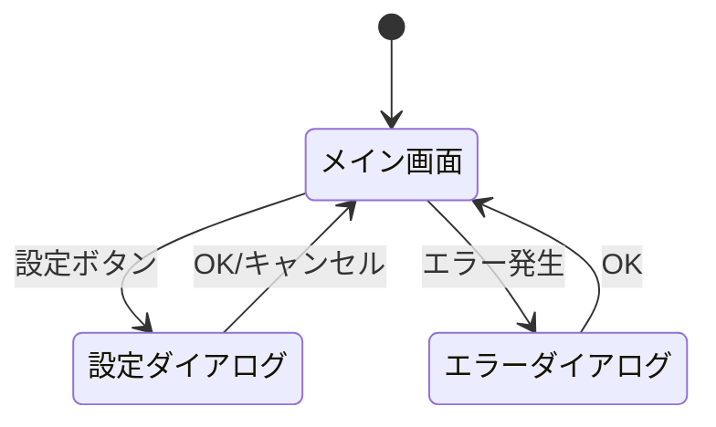

# 差分設計書: GUI設計スキルへの3セクション追加

対象REQ-C: 001, 002, 003

## 変更対象ファイル

- `skills/gui-design/SKILL.md`
- `skills/gui-design/gui-designer-prompt.md`
- `skills/gui-design/gui-reverse-prompt.md`

---

## 1. skills/gui-design/SKILL.md — 完了条件の拡張

### 変更理由

gui-design スキルの完了条件に「画面遷移フロー」「イベント制御表」「状態遷移図」を必須成果物として追加する。これにより、GUI設計フェーズ実行時にこれら3セクションが省略不可となる。

### before

```markdown
**DONE（正常完了）:**
- create / reverse モードでは gui-design.md が作成されている
- delta モードでは `{changes_dir}/delta-gui-design.md` が作成されている（既存 gui-design.md は変更しない）
- gui-design.md（create / reverse モード）に以下が含まれている: 画面一覧、各画面の構成、画面遷移図、共通UIルール
- ユーザーが内容に合意している
```

### after

```markdown
**DONE（正常完了）:**
- create / reverse モードでは gui-design.md が作成されている
- delta モードでは `{changes_dir}/delta-gui-design.md` が作成されている（既存 gui-design.md は変更しない）
- gui-design.md（create / reverse モード）に以下が含まれている: 画面一覧、各画面の構成、画面遷移図、画面遷移フロー、イベント制御表、状態遷移図、共通UIルール
- ユーザーが内容に合意している
```

---

## 2. skills/gui-design/gui-designer-prompt.md — create モードのプロセスにステップ追加

### 変更理由

create モードのプロセスに「画面遷移フロー」「イベント制御表」「状態遷移図」の作成ステップを追加する。既存のステップ4（画面遷移の設計）の直後に3つのステップを挿入し、以降のステップ番号を繰り下げる。

### before

```markdown
## create モードのプロセス

以下の手順で GUI設計を行うこと:

### ステップ1: 前提成果物の読み込み
（省略）

### ステップ2: 画面一覧の定義
（省略）

### ステップ3: 各画面の構成設計
（省略）

### ステップ4: 画面遷移の設計

Mermaid記法（stateDiagram または flowchart）で画面遷移図を作成する:
- 全画面間の遷移を網羅する
- 遷移のトリガー（ボタンクリック、メニュー選択等）を明記する
- ダイアログの表示・非表示も遷移として記録する
- エラー時の遷移も含める

### ステップ5: 共通UIルールの定義
（省略）

### ステップ6: gui-design.md の作成
（省略）

### ステップ7: ユーザー確認・合意取得
（省略）
```

### after

```markdown
## create モードのプロセス

以下の手順で GUI設計を行うこと:

### ステップ1: 前提成果物の読み込み
（既存のまま）

### ステップ2: 画面一覧の定義
（既存のまま）

### ステップ3: 各画面の構成設計
（既存のまま）

### ステップ4: 画面遷移の設計
（既存のまま）

### ステップ5: 画面遷移フローの定義

全画面間の遷移条件をテーブル形式で定義する。ステップ4のMermaid遷移図を補完する詳細定義として、全遷移を網羅する:

| 遷移元画面 | 遷移先画面 | トリガー操作 | 遷移条件 |
|---|---|---|---|
| {画面ID} | {画面ID} | {ボタンクリック/メニュー選択/キーボードショートカット等} | {遷移が発生する条件。無条件の場合は「なし」} |

**確認事項:**
- ステップ4の画面遷移図（Mermaid）に含まれる全遷移がテーブルに記載されているか
- ダイアログの表示・非表示遷移も含まれているか
- エラー時の遷移も含まれているか
- 条件分岐がある遷移（同一トリガーで条件により遷移先が異なる場合）は行を分けて記載する

### ステップ6: イベント制御表の定義

各画面のUIコンポーネントに対するイベントごとの処理内容をテーブル形式で定義する。ステップ3の各画面構成設計と対応づけて、全操作イベントを網羅する:

| 画面名 | コンポーネント名 | イベント種別 | 処理内容 |
|---|---|---|---|
| {画面ID} | {UI要素名} | {click/input/focus/hover/keypress/change/submit等} | {処理の概要: バリデーション実行、API呼び出し、画面遷移、状態更新等} |

**確認事項:**
- ステップ3で定義した全画面の全UI要素について、対応するイベントが記載されているか
- ユーザーが操作可能な全コンポーネント（ボタン、入力フィールド、チェックボックス、ドロップダウン等）のイベントが網羅されているか
- キーボードショートカットのイベントも含まれているか
- フォーカス移動・ホバー等の暗黙的イベントのうち、処理が発生するものが含まれているか

### ステップ7: 状態遷移図の定義

画面またはコンポーネントが取りうる状態と、状態間の遷移をテーブル形式で定義する。ステップ3の各画面の「状態」定義を拡張し、遷移条件を明確化する:

| 対象（画面/コンポーネント） | 状態名 | 遷移トリガー | 遷移条件 | 遷移先状態 |
|---|---|---|---|---|
| {画面IDまたはコンポーネント名} | {初期状態/入力中/処理中/完了/エラー等} | {ユーザー操作/システムイベント} | {遷移が発生する条件} | {遷移先の状態名} |

**確認事項:**
- ステップ3で定義した各画面の「状態」がすべて状態遷移テーブルに反映されているか
- 初期状態からの遷移が定義されているか
- エラー状態からの復帰遷移が定義されているか
- 処理中状態（非同期処理等）の完了・失敗遷移が定義されているか
- 複数の状態を持つコンポーネント（トグルボタン、アコーディオン等）の状態遷移も含まれているか

### ステップ8: 共通UIルールの定義
（既存のステップ5の内容をそのまま）

### ステップ9: gui-design.md の作成
（既存のステップ6の内容をそのまま）

### ステップ10: ユーザー確認・合意取得
（既存のステップ7の内容をそのまま）
```

---

## 3. skills/gui-design/gui-designer-prompt.md — 成果物フォーマットへの3セクション追加

### 変更理由

gui-design.md の成果物フォーマットに「画面遷移フロー」「イベント制御表」「状態遷移図」のテンプレートを追加する。「画面遷移」セクションの直後に配置する。

### before

```markdown
## 画面遷移



## 共通UIルール
```

### after

```markdown
## 画面遷移


## 画面遷移フロー

| 遷移元画面 | 遷移先画面 | トリガー操作 | 遷移条件 |
|---|---|---|---|
| {画面ID} | {画面ID} | {操作内容} | {条件。無条件の場合は「なし」} |
| ... | ... | ... | ... |

## イベント制御表

| 画面名 | コンポーネント名 | イベント種別 | 処理内容 |
|---|---|---|---|
| {画面ID} | {UI要素名} | {click/input/focus/hover/keypress/change/submit等} | {処理概要} |
| ... | ... | ... | ... |

## 状態遷移図

| 対象（画面/コンポーネント） | 状態名 | 遷移トリガー | 遷移条件 | 遷移先状態 |
|---|---|---|---|---|
| {画面IDまたはコンポーネント名} | {状態名} | {トリガー} | {条件} | {遷移先状態名} |
| ... | ... | ... | ... | ... |

## 共通UIルール
```

---

## 4. skills/gui-design/gui-reverse-prompt.md — 逆引きプロセスへの3セクション抽出手順追加

### 変更理由

逆引きモードでも3セクション（画面遷移フロー・イベント制御表・状態遷移図）を抽出・記録する必要がある。既存のステップ7（共通UIルールの抽出）の前に3つのステップを挿入する。

### before

```markdown
## reverse モードのプロセス（7ステップ）

### ステップ1: GUIフレームワークの特定
（省略）

### ステップ2: メインウィンドウの解析
（省略）

### ステップ3: 画面・タブの一覧抽出
（省略）

### ステップ4: 各画面のウィジェット解析
（省略）

### ステップ5: ダイアログ・サブウィンドウの解析
（省略）

### ステップ6: スレッド・非同期処理の解析
（省略）

### ステップ7: 共通UIルールの抽出
（省略）
```

### after

```markdown
## reverse モードのプロセス（10ステップ）

### ステップ1: GUIフレームワークの特定
（既存のまま）

### ステップ2: メインウィンドウの解析
（既存のまま）

### ステップ3: 画面・タブの一覧抽出
（既存のまま）

### ステップ4: 各画面のウィジェット解析
（既存のまま）

### ステップ5: ダイアログ・サブウィンドウの解析
（既存のまま）

### ステップ6: スレッド・非同期処理の解析
（既存のまま）

### ステップ7: 画面遷移フローの抽出

コードから画面間の遷移を解析し、テーブル形式で記録する:
- 画面切り替えメソッドの呼び出し箇所を特定する
- 遷移元画面・遷移先画面・トリガー操作（ボタンクリック、メニュー選択等）・遷移条件（if文の条件等）を記録する
- ダイアログの表示・非表示も遷移として記録する
- 遷移条件がコードから読み取れない場合は「※コードから推測」と注記する

### ステップ8: イベント制御表の抽出

コードのイベントバインディングを解析し、テーブル形式で記録する:
- ステップ4で抽出した各ウィジェットのイベントバインディング（command, bind, connect等）を網羅的に記録する
- 画面名・コンポーネント名（変数名と一致させる）・イベント種別・処理内容（呼び出し先メソッド名）を記録する
- 暗黙的なイベント（validation on focus out等）もコードに存在すれば記録する

### ステップ9: 状態遷移図の抽出

コードから画面・コンポーネントの状態管理を解析し、テーブル形式で記録する:
- 状態変数（state, status, mode等の名前を持つ変数）の値の変化を追跡する
- 状態を変更するメソッドとそのトリガーを特定する
- UI要素の有効/無効切り替え（enabled/disabled）、表示/非表示切り替え（visible/hidden）も状態遷移として記録する
- 状態管理が明示的でない場合は「※状態管理なし（UI要素の直接操作のみ）」と注記する

### ステップ10: 共通UIルールの抽出
（既存のステップ7の内容をそのまま）
```

---

## 5. skills/gui-design/gui-designer-prompt.md — delta モードのステップ2拡張

### 変更理由

delta モードで差分設計書のGUI変更内容を確認する際に、3セクション（画面遷移フロー・イベント制御表・状態遷移図）の変更も抽出対象に含める。

### before

```markdown
### ステップ2: 差分設計書のGUI変更内容の確認

差分設計書（delta-design.md / fix-design.md / refactoring-design.md）から、GUI関連の変更内容を抽出する:
- 画面の追加
- 画面の削除
- 画面構成の変更（UI要素の追加/削除/変更）
- 画面遷移の変更
- 共通UIルールの変更
```

### after

```markdown
### ステップ2: 差分設計書のGUI変更内容の確認

差分設計書（delta-design.md / fix-design.md / refactoring-design.md）から、GUI関連の変更内容を抽出する:
- 画面の追加
- 画面の削除
- 画面構成の変更（UI要素の追加/削除/変更）
- 画面遷移の変更
- 画面遷移フローの変更（遷移条件の追加/削除/変更）
- イベント制御表の変更（イベント処理の追加/削除/変更）
- 状態遷移図の変更（状態の追加/削除、遷移条件の変更）
- 共通UIルールの変更
```

---

## 6. skills/gui-design/gui-designer-prompt.md — delta モードのステップ3拡張

### 変更理由

delta モードの before→after 差分作成時に、3セクションの変更も差分として記述する。

### before

```markdown
### ステップ3: before→after 形式で差分を作成

差分設計書の内容に基づき、変更箇所を before→after 形式の差分として作成する。既存 gui-design.md は直接編集しない:
- 画面追加: 追加する画面の構成設計と遷移を after として記述する
- 画面削除: 削除対象の画面・関連遷移を before として示し、削除後を after として記述する
- 画面変更: 該当画面の構成設計を before→after で記述する
- 遷移変更: 遷移図の変更を before→after で記述する
- UIルール変更: 共通UIルールの変更を before→after で記述する
```

### after

```markdown
### ステップ3: before→after 形式で差分を作成

差分設計書の内容に基づき、変更箇所を before→after 形式の差分として作成する。既存 gui-design.md は直接編集しない:
- 画面追加: 追加する画面の構成設計と遷移を after として記述する
- 画面削除: 削除対象の画面・関連遷移を before として示し、削除後を after として記述する
- 画面変更: 該当画面の構成設計を before→after で記述する
- 遷移変更: 遷移図の変更を before→after で記述する
- 遷移フロー変更: 画面遷移フローテーブルの該当行を before→after で記述する
- イベント制御変更: イベント制御表の該当行を before→after で記述する
- 状態遷移変更: 状態遷移図テーブルの該当行を before→after で記述する
- UIルール変更: 共通UIルールの変更を before→after で記述する
```

---

## 7. skills/gui-design/SKILL.md — Red Flags への追加

### 変更理由

3セクションの省略を防止するRed Flagを追加する。

### before

```markdown
| 「画面遷移図を省略しよう」 | 画面遷移は必須。画面が1つでも、ダイアログやエラー表示の遷移を定義すること |
```

### after

```markdown
| 「画面遷移図を省略しよう」 | 画面遷移は必須。画面が1つでも、ダイアログやエラー表示の遷移を定義すること |
| 「画面遷移フロー・イベント制御表・状態遷移図を省略しよう」 | 3セクションは全て必須。画面遷移図（Mermaid）だけでは遷移条件・イベント処理・状態管理の詳細が不足する |
```
