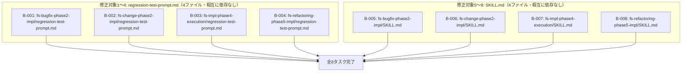

# 差分タスクリスト

## 対策種別
根本対策（fix-plan.md より引き継ぎ）

**判定理由（fix-plan.md より引き継ぎ）:** 本バグの原因は、regression-test-prompt.md 4ファイルが micro-impl-agent（実装専任エージェント）の責務外の用途（リグレッションテスト実行）で委譲先を固定していたこと、およびその独自「委譲先エージェント」セクションが他のプロンプトテンプレートの構造と不整合であったことである。今回の修正は、regression-test-prompt.md 4ファイルの委譲先固定記述・独自セクション・コードブロック入れ子構造を除去し、呼び出し元の SKILL.md 4ファイルの Integration 節（および fs-refactoring-phase5-impl の Step2 本文）の `micro-impl-agent` 具体名指定を委譲先を固定しない汎用表現に置き換えるものであり、原因そのものを解消する。特定症状の回避や例外の握りつぶしではないため、暫定対策には該当しない。

**注記:** 本バグ修正は全てMarkdownスキル定義ファイル（`skills/*/regression-test-prompt.md`、`skills/*/SKILL.md`）の構造・記述修正であり、クラス・publicメソッドという概念は存在しない。1ファイル=1親タスクとし、サブタスクは設けない。

## 依存関係グラフ



**並列実行可能性:**
- B-001〜B-008 は全て異なるファイルを変更し、かつ互いにファイル競合がないため、8タスク全て依存先なしで同時に並列起動可能である
- B-001〜B-004（regression-test-prompt.md）と B-005〜B-008（SKILL.md）は論理的には対応する内容変更だが、ファイルとしては独立しているため技術的な依存関係は発生しない。整合性確認は各タスクのテスト観点でクロスチェックする

## タスク一覧

### タスク B-001: skills/fs-bugfix-phase2-impl/regression-test-prompt.md の構造統一
- 種別: 既存変更
- 対象ファイル: skills/fs-bugfix-phase2-impl/regression-test-prompt.md
- テストファイル: なし（自動テスト対象外。Markdownのスキル定義ファイルに対する自動テストは存在しない）
- 依存先: なし
- 設計参照: fix-design.md の「変更対象1: skills/fs-bugfix-phase2-impl/regression-test-prompt.md」（before→after）
- テスト観点:
  - 「## 委譲先エージェント」セクションが削除されていること
  - 「## プレースホルダー（FSが実データで置き替える）」セクションが削除されていること
  - 「## 実行内容」の見出しと「`micro-impl-agent (aide-powers agent)` を以下のプロンプトで起動する:」の一文が削除されていること
  - コードブロック（```）が外され、「### タスク情報」〜「## 報告フォーマット」がファイルのトップレベル構造に引き上げられていること（見出しレベル・内容は変更されていないこと）
  - プロンプト本文（テスト実行指示の内容そのもの: タスク情報・実行モード・テスト実行コマンド・開発環境情報・テスト実行ルール・報告フォーマット）が修正前後で一字一句変わっていないこと（diff確認）
  - 「## 出力」セクションがそのまま残っていること
  - 冒頭見出し「# リグレッションテスト実行エージェント（バグ修正WF用）」と説明文が変更されていないこと
  - 修正後のファイル全体構造が、他のプロンプトテンプレート（bugfix-reporter-prompt.md, bugfix-analyzer-prompt.md 等）と同一の構造パターン（「委譲先エージェント」セクションを持たず、ファイル全体がそのままサブエージェントへのプロンプトとして成り立つ）に統一されていること

### タスク B-002: skills/fs-change-phase2-impl/regression-test-prompt.md の構造統一
- 種別: 既存変更
- 対象ファイル: skills/fs-change-phase2-impl/regression-test-prompt.md
- テストファイル: なし（自動テスト対象外）
- 依存先: なし
- 設計参照: fix-design.md の「変更対象2: skills/fs-change-phase2-impl/regression-test-prompt.md」（before→after、変更対象1と同一の変更を適用）
- テスト観点:
  - 「## 委譲先エージェント」セクションが削除されていること
  - 「## プレースホルダー（FSが実データで置き替える）」セクションが削除されていること
  - 「## 実行内容」の見出しと「`micro-impl-agent (aide-powers agent)` を以下のプロンプトで起動する:」の一文が削除されていること
  - コードブロックが外され、「### タスク情報」〜「## 報告フォーマット」がトップレベルに引き上げられていること
  - プロンプト本文（`{{changes_dir}}` 等の変数、「呼び出し元ワークフロー: 変更WF（fs-change-phase2-impl Step11）」を含む）が修正前後で一字一句変わっていないこと（diff確認）
  - 「## 出力」セクションがそのまま残っていること
  - 冒頭見出し「# リグレッションテスト実行エージェント（変更WF用）」と説明文が変更されていないこと
  - 修正後の構造が B-001 適用後の fs-bugfix-phase2-impl/regression-test-prompt.md と同一パターン（見出し文言・変数名を除く）であること

### タスク B-003: skills/fs-impl-phase4-execution/regression-test-prompt.md の構造統一
- 種別: 既存変更
- 対象ファイル: skills/fs-impl-phase4-execution/regression-test-prompt.md
- テストファイル: なし（自動テスト対象外）
- 依存先: なし
- 設計参照: fix-design.md の「変更対象3: skills/fs-impl-phase4-execution/regression-test-prompt.md」（before→after、変更対象1と同一の変更を適用）
- テスト観点:
  - 「## 委譲先エージェント」セクションが削除されていること
  - 「## プレースホルダー（FSが実データで置き替える）」セクションが削除されていること
  - 「## 実行内容」の見出しと「`micro-impl-agent (aide-powers agent)` を以下のプロンプトで起動する:」の一文が削除されていること
  - コードブロックが外され、「### タスク情報」〜「## 報告フォーマット」がトップレベルに引き上げられていること
  - プロンプト本文（`{{spec_dir}}` 等の変数、「呼び出し元ワークフロー: 実装WF（fs-impl-phase4-execution Step2）」を含む）が修正前後で一字一句変わっていないこと（diff確認）
  - 「## 出力」セクションがそのまま残っていること
  - 冒頭見出し「# リグレッションテスト実行エージェント（実装WF用）」と説明文が変更されていないこと
  - 修正後の構造が B-001 適用後の fs-bugfix-phase2-impl/regression-test-prompt.md と同一パターン（見出し文言・変数名を除く）であること

### タスク B-004: skills/fs-refactoring-phase5-impl/regression-test-prompt.md の構造統一（基準比較機能は維持）
- 種別: 既存変更
- 対象ファイル: skills/fs-refactoring-phase5-impl/regression-test-prompt.md
- テストファイル: なし（自動テスト対象外）
- 依存先: なし
- 設計参照: fix-design.md の「変更対象4: skills/fs-refactoring-phase5-impl/regression-test-prompt.md」（before→after）
- テスト観点:
  - 「## 委譲先エージェント」セクションが削除されていること
  - 「## プレースホルダー（FSが実データで置き替える）」セクションが削除されていること（`{{safety_net_baseline}}` を含む4変数の宣言セクション全体）
  - 「## 実行内容」の見出しと「`micro-impl-agent (aide-powers agent)` を以下のプロンプトで起動する:」の一文が削除されていること
  - コードブロックが外され、「### タスク情報」〜「## 報告フォーマット」（「### 開始前基準（比較対象）」セクションおよび基準比較の判定ロジック〔完全一致／FAIL数増加／スキップ数変化〕を含む）がトップレベルに引き上げられていること
  - 「## 出力」セクション（「開始前基準との比較結果」の項目を含む）がそのまま残っていること
  - 冒頭見出し「# リグレッションテスト実行エージェント（リファクタリングWF用）」と、フェーズ1で記録した開始前基準との比較結果を報告する旨の説明文が変更されていないこと
  - 他3ファイル（B-001〜B-003）との構造差異（基準比較ロジックの有無・`{{safety_net_baseline}}` 変数）が維持されていること（fix-plan.md/fix-design.mdの方針: 規模・目的の違いによる正当な差異は統一しない）
  - プロンプト本文（テスト実行指示・基準比較ロジックの内容そのもの）が修正前後で一字一句変わっていないこと（diff確認）

### タスク B-005: skills/fs-bugfix-phase2-impl/SKILL.md のIntegration節・プロンプトテンプレート欄の委譲先固定記述解消
- 種別: 既存変更
- 対象ファイル: skills/fs-bugfix-phase2-impl/SKILL.md
- テストファイル: なし（自動テスト対象外）
- 依存先: なし
- 設計参照: fix-design.md の「変更対象5: skills/fs-bugfix-phase2-impl/SKILL.md（Integration節 + プロンプトテンプレート欄）」（before→after）
- テスト観点:
  - 見出し「**呼び出す名前付きエージェント（Step 9 工程①）:**」が「**呼び出すサブエージェント（Step 9 工程①）:**」に変更されていること
  - 直下の `` `micro-impl-agent (aide-powers agent)` — Step 9 工程①（リグレッションテスト実行。regression-test-prompt.md 経由。工程②〜④より先行） `` の行が、委譲先を固定しない旨の記述（「委譲先は具体的なエージェント名で固定しない。regression-test-prompt.md の内容（プレースホルダー置換済み）をそのままプロンプトとしてサブエージェントに渡し、プラットフォームのツールマップに従って汎用のサブエージェントを起動する（Step 9 工程①: リグレッションテスト実行。工程②〜④より先行）」）に置き換えられていること
  - 「プロンプトテンプレート」欄の `` `regression-test-prompt.md` — Step 9（工程①: リグレッションテスト実行専任。micro-impl-agent 用。新規。動作確認試験より先行実行） `` の `micro-impl-agent 用` が `汎用のサブエージェント用` に置き換えられていること
  - 同一 SKILL.md 内で「委譲先エージェント名は固定しない」（呼び出すサブエージェント欄）と「micro-impl-agent 用」（プロンプトテンプレート欄）が数行違いで併存する内部矛盾が解消されていること
  - 「**呼び出す名前付きエージェント（すべて coding-test-2review 経由・Step 8）:**」欄の `micro-impl-agent (aide-powers agent)` は coding-test-2review 経由の正当な用途であり、本修正の対象外として変更されていないこと
  - 「**呼び出す名前付きエージェント（Step 9 工程③）:**」（manual-test-review-agent）の記述が変更されていないこと
  - Step 9 本文（工程①〜④の記述）・工程②〜④（動作確認試験、coding-test-2review経由部分等）の他の記述が変更されていないこと（diff確認）
  - B-001（regression-test-prompt.md）修正後の内容と、本タスクのIntegration節修正が「委譲先を固定しない」という趣旨で整合していること（クロスチェック）

### タスク B-006: skills/fs-change-phase2-impl/SKILL.md のIntegration節・プロンプトテンプレート欄の委譲先固定記述解消
- 種別: 既存変更
- 対象ファイル: skills/fs-change-phase2-impl/SKILL.md
- テストファイル: なし（自動テスト対象外）
- 依存先: なし
- 設計参照: fix-design.md の「変更対象6: skills/fs-change-phase2-impl/SKILL.md（Integration節 + プロンプトテンプレート欄）」（before→after、変更対象5と同一。Step番号のみ異なる）
- テスト観点:
  - 見出し「**呼び出す名前付きエージェント（Step 11 工程①）:**」が「**呼び出すサブエージェント（Step 11 工程①）:**」に変更されていること
  - 直下の `micro-impl-agent (aide-powers agent)` 行が、委譲先を固定しない旨の記述（Step 11 工程①: リグレッションテスト実行。工程②〜④より先行）に置き換えられていること
  - 「プロンプトテンプレート」欄の `` `regression-test-prompt.md` — Step 11（工程①: リグレッションテスト実行専任。micro-impl-agent 用。新規。動作確認試験より先行実行） `` の `micro-impl-agent 用` が `汎用のサブエージェント用` に置き換えられていること
  - 同一節内の「呼び出すサブエージェント」欄と「プロンプトテンプレート」欄の記述が内部矛盾なく統一されていること
  - 「**呼び出す名前付きエージェント（すべて coding-test-2review 経由・Step 10）:**」欄は本修正の対象外として変更されていないこと
  - 「**呼び出す名前付きエージェント（Step 11 工程③）:**」（manual-test-review-agent）の記述が変更されていないこと
  - Step 11 本文（工程①〜④の記述）・工程②〜④の他の記述が変更されていないこと（diff確認）
  - B-002（regression-test-prompt.md）修正後の内容と整合していること（クロスチェック）

### タスク B-007: skills/fs-impl-phase4-execution/SKILL.md のIntegration節・プロンプトテンプレート欄の委譲先固定記述解消
- 種別: 既存変更
- 対象ファイル: skills/fs-impl-phase4-execution/SKILL.md
- テストファイル: なし（自動テスト対象外）
- 依存先: なし
- 設計参照: fix-design.md の「変更対象7: skills/fs-impl-phase4-execution/SKILL.md（Integration節 + プロンプトテンプレート欄）」（before→after、変更対象5と同一。Step番号のみ異なる）
- テスト観点:
  - 見出し「**呼び出す名前付きエージェント（Step 2 工程①）:**」が「**呼び出すサブエージェント（Step 2 工程①）:**」に変更されていること
  - 直下の `micro-impl-agent (aide-powers agent)` 行が、委譲先を固定しない旨の記述（Step 2 工程①: リグレッションテスト実行。工程②〜④より先行）に置き換えられていること
  - 「プロンプトテンプレート」欄の `` `regression-test-prompt.md` — Step 2（工程①: リグレッションテスト実行専任。micro-impl-agent 用。新規。動作確認試験より先行実行） `` の `micro-impl-agent 用` が `汎用のサブエージェント用` に置き換えられていること
  - 同一節内の「呼び出すサブエージェント」欄と「プロンプトテンプレート」欄の記述が内部矛盾なく統一されていること
  - 「**呼び出す名前付きエージェント（すべて coding-test-2review 経由・Step 1）:**」欄は本修正の対象外として変更されていないこと
  - 「**呼び出す名前付きエージェント（Step 2 工程③）:**」（manual-test-review-agent）の記述が変更されていないこと
  - Step 2 本文（工程①〜④の記述）・工程②〜④の他の記述が変更されていないこと（diff確認）
  - B-003（regression-test-prompt.md）修正後の内容と整合していること（クロスチェック）

### タスク B-008: skills/fs-refactoring-phase5-impl/SKILL.md のIntegration節・サブエージェントプロンプト欄・Step2本文の委譲先固定記述解消
- 種別: 既存変更
- 対象ファイル: skills/fs-refactoring-phase5-impl/SKILL.md
- テストファイル: なし（自動テスト対象外）
- 依存先: なし
- 設計参照: fix-design.md の「変更対象8: skills/fs-refactoring-phase5-impl/SKILL.md（Integration節 + サブエージェントプロンプト欄 + Step2本文）」（before→after）
- テスト観点:
  - 見出し「**呼び出す名前付きエージェント（Step 2）:**」が「**呼び出すサブエージェント（Step 2）:**」に変更されていること
  - 直下の `` `micro-impl-agent (aide-powers agent)` — Step 2（リグレッションテスト実行。regression-test-prompt.md 経由） `` の行が、委譲先を固定しない旨の記述（「委譲先は具体的なエージェント名で固定しない。regression-test-prompt.md の内容（プレースホルダー置換済み）をそのままプロンプトとしてサブエージェントに渡し、プラットフォームのツールマップに従って汎用のサブエージェントを起動する（Step 2: リグレッションテスト実行。開始前基準〔セーフティネットベースライン〕との比較報告を含む）」）に置き換えられていること
  - 「サブエージェントプロンプト」欄の `` `regression-test-prompt.md` — Step 2 専任（工程番号なし・単独の呼び出し。micro-impl-agent 用。新規。phase1-statusのセーフティネット基準との比較報告を含む） `` の `micro-impl-agent 用` が `汎用のサブエージェント用` に置き換えられていること（他の文言「phase1-statusのセーフティネット基準との比較報告を含む」は変更されていないこと）
  - Step2 本文中の「本スキルディレクトリの `regression-test-prompt.md` のプレースホルダーを実データで置き替えたデータをプロンプトとして `micro-impl-agent` を起動し、既存テスト全実行（リグレッションテスト）を実際に実行させ、フェーズ1（fs-refactoring-phase1-status）で記録した開始前基準（セーフティネットベースライン）との比較結果を確認・報告させる。」の `` `micro-impl-agent` を起動し `` の部分が、他3ファイル（B-005〜B-007）のStep本文と揺れのない同一の汎用表現「サブエージェントを起動し」に修正されていること（それ以外の文言「開始前基準（セーフティネットベースライン）との比較結果を確認・報告させる」等は変更されていないこと）
  - 「**呼び出す名前付きエージェント（Step 3 工程②）:**」（manual-test-review-agent）の記述が変更されていないこと
  - 「**呼び出す名前付きエージェント（すべて coding-test-2review 経由・Step 1）:**」欄は本修正の対象外として変更されていないこと
  - B-004（regression-test-prompt.md）修正後の内容と整合していること（クロスチェック）

## 網羅性チェック結果
- チェック回数: 2回
  - 1回目: fix-design.md の「修正対象の差分設計」（変更対象1〜8）を全て一覧化し、タスク B-001〜B-008 を1対1で作成
  - 2回目: fix-design.md の「新規追加の設計」（該当なし）、「既存テストへの影響」（既存テストへの影響なし。品質担保はレビューで実施）、「リグレッションテスト設計 → 追加テストケース」（なし）を再確認し、追加タスクが不要であることを確認。fix-plan.md の「修正対象ファイル」8件ともタスク一覧が一字一句一致することを照合。program-structure.md（変更対象8内で言及される「本修正の影響を受ける既存の正式設計書」）は fix-design.md 上で「本修正の対象ファイル自身ではない」「実装タスクでは直接編集しない」「更新タイミング: バグ修正WF Step10『設計書反映』（doc-sync）」と明記されており、本タスクリストの実装タスクには含めないことを確認（doc-sync フェーズの担当範囲）
- 設計書の総変更項目数: 8件（fix-design.md の変更対象1〜8。新規追加0件、既存テスト変更0件、追加テストケース0件）
- タスクリストの総タスク数: 8件
- 最終結果: 漏れなし

## タスクサマリー
- 既存変更タスク: 8件（regression-test-prompt.md 4件 + SKILL.md 4件）
- 新規追加タスク: 0件（fix-design.md「新規追加の設計」= 該当なし）
- 既存テスト変更タスク: 0件（fix-design.md「既存テストへの影響」= 既存テストへの影響なし。自動テスト対象外）
- 合計: 8件
