# 差分タスクリスト

## 前提
- 本変更の対象は全て Markdown（SKILL.md・プロンプトテンプレート・docs-dev/docs 配下ドキュメント）であり、Pythonクラス等の実行可能プログラムではない。
- 「1ファイル = 1親タスク」の原則を適用し、public メソッド単位のサブタスク分割は行わない（メソッドの概念が存在しないため）。
- dev-environment.md により、本リポジトリには自動テストフレームワークが存在せず、動作確認は手動検証で行う方針が確定している。そのため各タスクの「テスト観点」は、実装後にサブエージェント自身が該当ファイルを読み直し before→after の記述が正確に反映されているかを確認する観点として定義する。
- リグレッションテスト（既存機能の非破壊確認）は impact-analysis.md の「リグレッションテスト対象（既存機能の非破壊確認）」R1〜R5 を起点に、全タスク完了後の手動確認タスク（D-R-001〜D-R-005）として計画する。

## 依存関係グラフ

```mermaid
graph TD
    D001[D-001: coding-test-2review/SKILL.md]
    D002[D-002: coding-test-2review/implementer-prompt.md]
    D003[D-003: coding-test-2review/spec-reviewer-prompt.md]
    D004[D-004: coding-test-2review/code-quality-reviewer-prompt.md]
    D005[D-005: impl-coding-standards/SKILL.md]
    D006[D-006: multi-stage-code-review/SKILL.md]
    D007[D-007: fs-impl-phase4-execution/SKILL.md]
    D008[D-008: fs-impl-phase4-execution/implementer-prompt.md]
    D009[D-009: fs-refactoring-phase5-impl/SKILL.md]
    D010[D-010: fs-refactoring-phase5-impl/implementer-prompt.md]
    D011[D-011: fs-change-phase2-impl/SKILL.md]
    D012[D-012: fs-change-phase2-impl/change-task-planner-prompt.md]
    D013[D-013: fs-bugfix-phase2-impl/SKILL.md]
    D014[D-014: fs-bugfix-phase2-impl/bugfix-task-planner-prompt.md]
    D015[D-015: regression-test-prompt.md（実装WF）]
    D016[D-016: regression-test-prompt.md（変更WF）]
    D017[D-017: regression-test-prompt.md（バグ修正WF）]
    D018[D-018: regression-test-prompt.md（リファクタリングWF）]
    D019[D-019: test-review/SKILL.md]
    D020[D-020: impl-task-planning/SKILL.md]
    D021[D-021: implementation-agents.md]
    D022[D-022: impl.md]
    D023[D-023: bugfix.md]
    D024[D-024: refactoring.md]
    D025[D-025: 07-refactoring.md]
    D026[D-026: docs/03-usage.md]

    D015 --> D007
    D018 --> D009
    D016 --> D011
    D017 --> D013
    D005 --> D021
    D005 --> D022
    D006 --> D022
    D013 --> D023
    D009 --> D024
    D009 --> D025
    D009 --> D026
    D013 --> D026

    DR001[D-R-001: coding-test-2review write_testリグレッション確認]
    DR002[D-R-002: coding-test-2reviewレビュー出力フォーマット確認]
    DR003[D-R-003: impl-coding-standards run_testリグレッション確認]
    DR004[D-R-004: multi-stage-code-reviewフロー確認]
    DR005[D-R-005: fs-refactoring-phase1-status維持確認]

    D002 --> DR001
    D003 --> DR002
    D004 --> DR002
    D005 --> DR003
    D006 --> DR004
```

**実行リンク**: D-001〜D-006, D-008, D-010, D-012, D-014〜D-020 は依存先がなく即座に起動可能。D-007/D-009/D-011/D-013 はそれぞれ対応する regression-test-prompt.md（D-015〜D-018）の完了後に着手可能。D-021〜D-026 は対応する SKILL.md 変更完了後に着手可能（ドキュメントが最終確定内容を正確に説明できるようにするため）。D-R-001〜D-R-005 は全タスク完了後の最終確認として実施する。

## タスク一覧

### タスク D-001: coding-test-2review/SKILL.md の preservation check・bugfix_dir 廃止
- 種別: 既存変更
- 対象ファイル: `skills/coding-test-2review/SKILL.md`
- テストファイル: なし（非プログラム成果物）
- 依存先: なし
- 設計参照: delta-design-coding-test-2review.md の「1. skills/coding-test-2review/SKILL.md」（1-1〜1-6）
- テスト観点:
  - 入力パラメータ表から bugfix_dir 行が削除されていること（1-1 after と一致）
  - 「工程: テスト実装」から preservation check 行が削除されていること（1-2）
  - 「工程: 設計準拠レビュー」「工程: コード品質レビュー」から preservation check 行が削除されていること（1-3）
  - エージェント呼び出しペイロード表から bugfix_dir 行が削除されていること（1-4）
  - Red Flags 表から bugfix_dir 関連行が削除されていること（1-5）
  - 1-6 で確認済みの「変更不要」部分（Integration節）が誤って変更されていないこと

### タスク D-002: coding-test-2review/implementer-prompt.md のpreservation check・全体リグレッション廃止
- 種別: 既存変更
- 対象ファイル: `skills/coding-test-2review/implementer-prompt.md`
- テストファイル: なし（非プログラム成果物）
- 依存先: なし
- 設計参照: delta-design-coding-test-2review.md の「2. skills/coding-test-2review/implementer-prompt.md」（2-1, 2-2）
- テスト観点:
  - mode: write_test から bugfix_dir 見出し行・preservation check ルールが削除され、task_kind 行は維持されていること（2-1）
  - mode: run_test のテスト実行コマンドが「対象テスト＋全体リグレッション」から「ユニットテスト」単独に変更されていること（2-2）
  - テスト実行ルール本文の「対象テスト＋全体リグレッションを実行」が「ユニットテストを実行」に置換されていること

### タスク D-003: coding-test-2review/spec-reviewer-prompt.md のpreservation check廃止
- 種別: 既存変更
- 対象ファイル: `skills/coding-test-2review/spec-reviewer-prompt.md`
- テストファイル: なし（非プログラム成果物）
- 依存先: なし
- 設計参照: delta-design-coding-test-2review.md の「3. skills/coding-test-2review/spec-reviewer-prompt.md」（3-1）
- テスト観点:
  - mode: combined から task_kind/bugfix_dir 見出し行のうち bugfix_dir 行が削除されていること
  - 「preservation check（過去不具合の再混入検出）」セクションが削除されていること
  - 判定/報告フォーマットから preservation check 行が削除されていること
  - レビュー観点4「過去不具合修正の保持検証」は維持されていること（削除対象外）

### タスク D-004: coding-test-2review/code-quality-reviewer-prompt.md のpreservation check廃止
- 種別: 既存変更
- 対象ファイル: `skills/coding-test-2review/code-quality-reviewer-prompt.md`
- テストファイル: なし（非プログラム成果物）
- 依存先: なし
- 設計参照: delta-design-coding-test-2review.md の「4. skills/coding-test-2review/code-quality-reviewer-prompt.md」（4-1）
- テスト観点:
  - mode: combined から task_kind/bugfix_dir 見出し行のうち bugfix_dir 行が削除されていること
  - 「preservation check（過去不具合の再混入検出）」セクションが削除されていること
  - 判定/報告フォーマットから preservation check 行が削除されていること
  - レビュー観点「品質」欄の「過去不具合再発チェック」は維持されていること（削除対象外）

### タスク D-005: impl-coding-standards/SKILL.md の全体リグレッション廃止
- 種別: 既存変更
- 対象ファイル: `skills/impl-coding-standards/SKILL.md`
- テストファイル: なし（非プログラム成果物）
- 依存先: なし
- 設計参照: delta-design-shared-skills.md の「1. skills/impl-coding-standards/SKILL.md」（1-1〜1-6）
- テスト観点:
  - mode: run_test の Step1〜Step3 が「対象テスト＋全体リグレッション」から「ユニットテスト」単独実行に変更されていること
  - テスト実行ルール（mode: run_test）セクション全体が after の内容（2本立てルール廃止、全体リグレッション失敗の特別扱い削除）に一致していること
  - 完了条件テーブルの run_test 行が「ユニットテスト実行済み」に修正されていること
  - 報告テンプレート（mode: run_test）が「ユニットテスト結果」表記に統一されていること
  - ワークフロー別差異のリファクタリング行から「既存テスト全実行（セーフティネット）」が削除されていること

### タスク D-006: multi-stage-code-review/SKILL.md の既存テスト全実行記述廃止
- 種別: 既存変更
- 対象ファイル: `skills/multi-stage-code-review/SKILL.md`
- テストファイル: なし（非プログラム成果物）
- 依存先: なし
- 設計参照: delta-design-shared-skills.md の「2. skills/multi-stage-code-review/SKILL.md」（2-1）
- テスト観点:
  - Stage 3: Test Execution から「変更・バグ修正・リファクタリングの場合: 既存テスト全実行（リグレッション確認）」行が削除されていること
  - 「対象テスト」が「ユニットテスト」に置換されていること
  - 「既存テスト全実行（リグレッションテスト）は本ステージでは実施しない」旨の注記が追加されていること

### タスク D-007: fs-impl-phase4-execution/SKILL.md のStep2を動作確認Stepに再編
- 種別: 既存変更
- 対象ファイル: `skills/fs-impl-phase4-execution/SKILL.md`
- テストファイル: なし（非プログラム成果物）
- 依存先: D-015（regression-test-prompt.md の内容と整合させる必要があるため）
- 設計参照: delta-design-impl-wf.md の「1. skills/fs-impl-phase4-execution/SKILL.md」（1-1〜1-3）
- テスト観点:
  - 成果物テーブルの verification-report.md 説明にリグレッションテスト結果の記述が追加されていること
  - Step2 見出しが「動作確認Step（動作確認試験＋リグレッションテスト）」に変更されていること
  - 工程①（リグレッションテスト実行・先行・ブロッキング）→工程②（試験書作成）→工程③（試験書レビュー）→工程④（試験実行）の順序で記載されていること
  - 完了条件にリグレッションテスト全パスの項目が追加されていること
  - 状態判定にリグレッションテスト失敗時の差し戻しフロー（Step1へ）が追加されていること
  - Integration節にregression-test-prompt.mdとmicro-impl-agentの呼び出しが工程①として追記されていること

### タスク D-008: fs-impl-phase4-execution/implementer-prompt.md の全体リグレッション廃止
- 種別: 既存変更
- 対象ファイル: `skills/fs-impl-phase4-execution/implementer-prompt.md`
- テストファイル: なし（非プログラム成果物）
- 依存先: なし
- 設計参照: delta-design-impl-wf.md の「2. skills/fs-impl-phase4-execution/implementer-prompt.md」（2-1）
- テスト観点:
  - mode: run_test のテスト実行コマンドが「対象テスト＋全体リグレッション」から「ユニットテスト」単独に変更されていること
  - テスト実行ルールから「全体リグレッションテストを実行し、既存テストが壊れていないことを確認する」行が削除されていること

### タスク D-009: fs-refactoring-phase5-impl/SKILL.md のStep2内容変更（Step2/Step3分離維持）
- 種別: 既存変更
- 対象ファイル: `skills/fs-refactoring-phase5-impl/SKILL.md`
- テストファイル: なし（非プログラム成果物）
- 依存先: D-018（regression-test-prompt.md の内容と整合させる必要があるため）
- 設計参照: delta-design-refactoring-wf.md の「1. skills/fs-refactoring-phase5-impl/SKILL.md」（1-1〜1-4）
- テスト観点:
  - The Iron Laws の「NEVER MERGE TASKS」記述から「既存テスト全実行のセーフティネット」への言及が削除されていること
  - Step1（タスク実装ループ）から bugfix_dir パラメータと preservation check 注記が削除され、「テスト実行工程ではユニットテストのみ実行する」旨に修正されていること
  - Step2の見出し・Step番号は維持されたまま、中身が「coding-test-2reviewの出力確認のみ」から「regression-test-prompt.md による実際のリグレッションテスト実行＋開始前基準比較」に変更されていること
  - Step3（動作確認試験）が一切変更されていないこと（変更対象外の確認）
  - Integration節にregression-test-prompt.md（Step2専任）とmicro-impl-agentの呼び出しが追記され、refactoring-verification-prompt.mdとmanual-test-review-agentの記述はStep3側で元のまま維持されていること
  - Input from callerからbugfix_dirの説明行が削除されていること

### タスク D-010: fs-refactoring-phase5-impl/implementer-prompt.md の全体リグレッション（セーフティネット）廃止
- 種別: 既存変更
- 対象ファイル: `skills/fs-refactoring-phase5-impl/implementer-prompt.md`
- テストファイル: なし（非プログラム成果物）
- 依存先: なし
- 設計参照: delta-design-refactoring-wf.md の「2. skills/fs-refactoring-phase5-impl/implementer-prompt.md」（2-1）
- テスト観点:
  - mode: run_test のTest Commandsが「Target test + Full regression (SAFETY NET)」から「Unit test」単独に変更されていること
  - 「必ず全体リグレッション（セーフティネット）も実行すること」の注記が削除されていること

### タスク D-011: fs-change-phase2-impl/SKILL.md のStep統合・リナンバリング
- 種別: 既存変更
- 対象ファイル: `skills/fs-change-phase2-impl/SKILL.md`
- テストファイル: なし（非プログラム成果物）
- 依存先: D-016（regression-test-prompt.md の内容と整合させる必要があるため）
- 設計参照: delta-design-change-wf.md の「1. skills/fs-change-phase2-impl/SKILL.md」（1-1〜1-9）
- テスト観点:
  - 成果物テーブルのtest-{機能名}-test-plan.md説明にリグレッションテスト結果の記述が追加されていること
  - Step10（タスク実装ループ）からbugfix_dirパラメータとpreservation check注記が削除されていること
  - 旧Step11（リグレッション確認）+旧Step12（動作検証）が新Step11（動作確認Step）に統合され、工程①（リグレッションテスト先行）〜工程④（試験実行）の構成になっていること
  - 旧Step13（設計書反映）が新Step12に、旧Step14（pending-issues）が新Step13に、旧Step15（完了案内）が新Step14にリナンバリングされていること（Step本文中のStep番号参照も含む）
  - 完了条件（章末）の項目5が「ユニットテスト全PASS」に修正され、項目6「動作確認Stepでリグレッションテスト1回実施」が追加されていること
  - Integration節のプロンプトテンプレート表・呼び出しエージェント表がStep11基準に更新され、regression-test-prompt.mdとmicro-impl-agentが追記されていること
  - change-doc-syncer-prompt.mdの参照Step表記が新Step12基準に更新されていること

### タスク D-012: fs-change-phase2-impl/change-task-planner-prompt.md のリグレッションテストタスク抽出廃止
- 種別: 既存変更
- 対象ファイル: `skills/fs-change-phase2-impl/change-task-planner-prompt.md`
- テストファイル: なし（非プログラム成果物）
- 依存先: なし
- 設計参照: delta-design-change-wf.md の「2. skills/fs-change-phase2-impl/change-task-planner-prompt.md」（2-1〜2-4）
- テスト観点:
  - 変更ワークフロー固有のルールから「リグレッションテスト必須」項目（旧項目2）が削除され、以降の項目番号が詰められていること
  - タスク分解手順ステップ2からリグレッションテストタスク抽出手順（旧手順4）が削除されていること
  - delta-task-list.md作成テンプレートから「リグレッションテスト（全タスク完了後）」セクションが削除され、タスクサマリーからリグレッションテスト件数の記載が削除されていること
  - 報告フォーマットのタスクサマリー説明からリグレッションテストの言及が削除されていること

### タスク D-013: fs-bugfix-phase2-impl/SKILL.md のStep統合・リナンバリング
- 種別: 既存変更
- 対象ファイル: `skills/fs-bugfix-phase2-impl/SKILL.md`
- テストファイル: なし（非プログラム成果物）
- 依存先: D-017（regression-test-prompt.md の内容と整合させる必要があるため）
- 設計参照: delta-design-bugfix-wf.md の「1. skills/fs-bugfix-phase2-impl/SKILL.md」（1-1〜1-8）
- テスト観点:
  - 成果物テーブルのtest-{機能名}-test-plan.md説明にリグレッションテスト結果の記述が追加されていること
  - Step6（差分タスクリストの作成）から「リグレッションテスト必須」の注記が削除され、代替の注記（動作確認Stepに一本化、バグ再現テストは実装タスクの一部として維持）に置き換わっていること
  - Step8（タスク実装ループ）からbugfix_dirパラメータとpreservation check注記が削除されていること
  - 旧Step9（リグレッション確認）+旧Step10（動作検証）が新Step9（動作確認Step）に統合され、工程①（リグレッションテスト先行）〜工程④（試験実行）の構成になっていること
  - 旧Step11（設計書反映）が新Step10に、旧Step12（pending-issues）が新Step11に、旧Step13（完了案内）が新Step12にリナンバリングされていること（Step本文中のStep番号参照も含む）
  - Step12（旧Step13）のテスト実行結果表記が「全テスト」から「ユニットテスト」に統一されていること
  - Integration節のプロンプトテンプレート表・呼び出しエージェント表がStep9基準に更新され、regression-test-prompt.mdとmicro-impl-agentが追記されていること

### タスク D-014: fs-bugfix-phase2-impl/bugfix-task-planner-prompt.md のリグレッションテストタスク抽出廃止
- 種別: 既存変更
- 対象ファイル: `skills/fs-bugfix-phase2-impl/bugfix-task-planner-prompt.md`
- テストファイル: なし（非プログラム成果物）
- 依存先: なし
- 設計参照: delta-design-bugfix-wf.md の「2. skills/fs-bugfix-phase2-impl/bugfix-task-planner-prompt.md」（2-1〜2-5）
- テスト観点:
  - バグ修正ワークフロー固有のルールから「リグレッションテスト必須・絶対省略禁止」項目（旧項目3）が削除され、バグ再現テストが「既存変更」（旧項目1）の追加項目として実装タスクへ統合される形に修正されていること
  - タスク分解手順ステップ2から既存カバー範囲リグレッションテストタスク抽出手順（旧手順5）が削除され、旧手順4（追加リグレッションテストタスク抽出）が「対象実装タスクのテストファイルに含める」形に修正されていること
  - delta-task-list.md作成テンプレートから「リグレッションテスト（全タスク完了後）」セクション（B-R-001, B-R-002）が削除されていること
  - 完了条件の自己チェック・報告フォーマットからリグレッションテストタスクに関する項目が削除され、バグ再現テストの統合確認項目が維持されていること
  - Red Flags・Common Rationalizationsの該当行が更新（既存カバー範囲リグレッション関連は削除、バグ再現テストの目的記載漏れ・統合漏れは維持）されていること

### タスク D-015: fs-impl-phase4-execution/regression-test-prompt.md の新規作成
- 種別: 新規追加
- 対象ファイル: `skills/fs-impl-phase4-execution/regression-test-prompt.md`
- テストファイル: なし（非プログラム成果物）
- 依存先: なし
- 設計参照: delta-design-regression-test-prompts.md の「skills/fs-impl-phase4-execution/regression-test-prompt.md（新規）」全文
- テスト観点:
  - 委譲先エージェントがmicro-impl-agentであること
  - プレースホルダー（feature_name, spec_dir, dev_environment_path）が定義されていること
  - 実行内容のプロンプトテンプレートに全テスト実行コマンド・報告フォーマットが設計書の全文と一致していること
  - 出力セクションにリグレッションテスト実行結果が記載されていること

### タスク D-016: fs-change-phase2-impl/regression-test-prompt.md の新規作成
- 種別: 新規追加
- 対象ファイル: `skills/fs-change-phase2-impl/regression-test-prompt.md`
- テストファイル: なし（非プログラム成果物）
- 依存先: なし
- 設計参照: delta-design-regression-test-prompts.md の「skills/fs-change-phase2-impl/regression-test-prompt.md（新規）」全文
- テスト観点:
  - 委譲先エージェントがmicro-impl-agentであること
  - プレースホルダー（feature_name, changes_dir, dev_environment_path）が定義されていること
  - 呼び出し元ワークフロー記述が「変更WF（fs-change-phase2-impl Step11）」であること
  - 実行内容・報告フォーマットが設計書の全文と一致していること

### タスク D-017: fs-bugfix-phase2-impl/regression-test-prompt.md の新規作成
- 種別: 新規追加
- 対象ファイル: `skills/fs-bugfix-phase2-impl/regression-test-prompt.md`
- テストファイル: なし（非プログラム成果物）
- 依存先: なし
- 設計参照: delta-design-regression-test-prompts.md の「skills/fs-bugfix-phase2-impl/regression-test-prompt.md（新規）」全文
- テスト観点:
  - 委譲先エージェントがmicro-impl-agentであること
  - プレースホルダー（feature_name, bugfix_dir, dev_environment_path）が定義されていること
  - 呼び出し元ワークフロー記述が「バグ修正WF（fs-bugfix-phase2-impl Step9）」であること
  - テスト実行ルールに「バグ再現テストが全テストの一部として実行されていることを確認する」旨が含まれていること
  - 実行内容・報告フォーマットが設計書の全文と一致していること

### タスク D-018: fs-refactoring-phase5-impl/regression-test-prompt.md の新規作成
- 種別: 新規追加
- 対象ファイル: `skills/fs-refactoring-phase5-impl/regression-test-prompt.md`
- テストファイル: なし（非プログラム成果物）
- 依存先: なし
- 設計参照: delta-design-regression-test-prompts.md の「skills/fs-refactoring-phase5-impl/regression-test-prompt.md（新規）」全文
- テスト観点:
  - 委譲先エージェントがmicro-impl-agentであること
  - プレースホルダー（feature_name, refactoring_dir, dev_environment_path, safety_net_baseline）が定義されていること
  - 呼び出し元ワークフロー記述が「リファクタリングWF（fs-refactoring-phase5-impl Step2）」であること
  - 開始前基準（safety_net_baseline）との比較ルール（完全一致/FAIL数増加/スキップ数変化の3パターン）が記載されていること
  - 出力セクションに「開始前基準との比較結果」が記載されていること

### タスク D-019: test-review/SKILL.md のリグレッション観点廃止
- 種別: 既存変更
- 対象ファイル: `skills/test-review/SKILL.md`
- テストファイル: なし（非プログラム成果物）
- 依存先: なし
- 設計参照: delta-design-shared-skills.md の「3. skills/test-review/SKILL.md」（3-1, 3-2）
- テスト観点:
  - Process ステップ1のbugfix行から「リグレッションテスト必須」「既存テスト全パスの確認」が削除され、「バグ再現テストの存在確認」に修正されていること
  - Process ステップ1のrefactoring行から「既存テスト全パス必須（セーフティネットの確認）」が削除されていること
  - ワークフロー別差異テーブルのbugfix/refactoring行が上記と整合する形に修正されていること
  - change行（過去不具合修正テストの保持検証）は変更されず維持されていること

### タスク D-020: impl-task-planning/SKILL.md のリグレッションテスト必須記述廃止
- 種別: 既存変更
- 対象ファイル: `skills/impl-task-planning/SKILL.md`
- テストファイル: なし（非プログラム成果物）
- 依存先: なし
- 設計参照: delta-design-shared-skills.md の「4. skills/impl-task-planning/SKILL.md」（4-1）
- テスト観点:
  - ワークフロー別差異テーブルの「リグレッションテスト」行が「変更・バグ修正WFでは必須」から「どのWFでも実装タスクとしては計画しない（動作確認Stepで1回実施する設計に統一）」に修正されていること

### タスク D-021: docs-dev/implementation-agents.md のrun_test説明更新
- 種別: 既存変更
- 対象ファイル: `docs-dev/02-ai-agent/04-agents/implementation-agents.md`
- テストファイル: なし（非プログラム成果物）
- 依存先: D-005（impl-coding-standards/SKILL.md の変更内容と整合させるため）
- 設計参照: delta-design-docs.md の「1. docs-dev/02-ai-agent/04-agents/implementation-agents.md」（1-1）
- テスト観点:
  - micro-impl-agentのモード表run_test行が「対象テスト＋全体リグレッション」から「ユニットテストを実行」＋「既存テスト全実行は動作確認Stepで1回実施」に修正されていること

### タスク D-022: docs-dev/impl.md のテスト実行ルール説明更新
- 種別: 既存変更
- 対象ファイル: `docs-dev/02-ai-agent/03-common-skills/impl.md`
- テストファイル: なし（非プログラム成果物）
- 依存先: D-005, D-006（impl-coding-standards・multi-stage-code-review の変更内容と整合させるため）
- 設計参照: delta-design-docs.md の「2. docs-dev/02-ai-agent/03-common-skills/impl.md」（2-1, 2-2）
- テスト観点:
  - impl-coding-standardsの「メインプロセスの要点」テスト実行ルール説明が「ユニットテストを実行。既存テスト全実行は動作確認Stepで1回実施」に修正されていること
  - multi-stage-code-reviewのパイプライン図が変更不要（2-2確認結果）であることを踏まえ、誤って変更されていないこと

### タスク D-023: docs-dev/bugfix.md のリグレッションテスト記述修正
- 種別: 既存変更
- 対象ファイル: `docs-dev/02-ai-agent/02-phase-skills/bugfix.md`
- テストファイル: なし（非プログラム成果物）
- 依存先: D-013（fs-bugfix-phase2-impl/SKILL.md の変更内容と整合させるため）
- 設計参照: delta-design-docs.md の「3. docs-dev/02-ai-agent/02-phase-skills/bugfix.md」（3-1, 3-2, 3-3）
- テスト観点:
  - fs-bugfix-phase2-implの責務説明が「動作確認Step（バグ再現テストを含む動作確認試験＋リグレッションテストを1回実施）」に修正されていること
  - Iron Lawの代表ルールが「バグ再現テスト必須・リグレッションテストは動作確認Stepで1回」に修正され、「全テストパス」が「ユニットテストパス」に統一されていること
  - 「主要な共通スキル呼び出し」一覧は変更不要（3-3確認結果）であることを踏まえ、誤って変更されていないこと

### タスク D-024: docs-dev/refactoring.md のセーフティネット説明修正
- 種別: 既存変更
- 対象ファイル: `docs-dev/02-ai-agent/02-phase-skills/refactoring.md`
- テストファイル: なし（非プログラム成果物）
- 依存先: D-009（fs-refactoring-phase5-impl/SKILL.md の変更内容と整合させるため）
- 設計参照: delta-design-docs.md の「4. docs-dev/02-ai-agent/02-phase-skills/refactoring.md」（4-1, 4-2）
- テスト観点:
  - fs-refactoring-phase5-implの責務説明が「各タスク完了時に必ず実行」から「全タスク完了後の動作確認Stepで1回実行」に修正されていること
  - Iron Lawの代表ルールが「NO TASK PROCEEDS WITHOUT SAFETY NET PASS」から「NO WORKFLOW COMPLETION WITHOUT SAFETY NET PASS」に修正されていること
  - 「主要な共通スキル呼び出し」一覧は変更不要（4-2確認結果）であることを踏まえ、誤って変更されていないこと

### タスク D-025: docs-dev/07-refactoring.md のセーフティネット説明修正
- 種別: 既存変更
- 対象ファイル: `docs-dev/02-ai-agent/01-workflows/07-refactoring.md`
- テストファイル: なし（非プログラム成果物）
- 依存先: D-009（fs-refactoring-phase5-impl/SKILL.md の変更内容と整合させるため）
- 設計参照: delta-design-docs.md の「5. docs-dev/02-ai-agent/01-workflows/07-refactoring.md」（5-1, 5-2, 5-3）
- テスト観点:
  - 概要文（セーフティネットの仕組み自体の説明）は変更不要（5-1確認結果）であることを踏まえ、誤って変更されていないこと
  - 「セーフティネット（フェーズ5のタスクごと）」見出しが「セーフティネット（フェーズ5の動作確認Stepで1回）」に変更され、判定表の記述が動作確認Step基準に修正されていること
  - Iron Lawが「NO TASK PROCEEDS WITHOUT SAFETY NET PASS」から「NO WORKFLOW COMPLETION WITHOUT SAFETY NET PASS」に修正されていること

### タスク D-026: docs/03-usage.md のリグレッションテスト実施タイミング記述修正
- 種別: 既存変更
- 対象ファイル: `docs/03-usage.md`
- テストファイル: なし（非プログラム成果物）
- 依存先: D-009, D-013（fs-refactoring-phase5-impl・fs-bugfix-phase2-impl の変更内容と整合させるため）
- 設計参照: delta-design-docs.md の「6. docs/03-usage.md」（6-1, 6-2, 6-3）
- テスト観点:
  - §5.6リファクタリングワークフローの説明が「各タスク完了ごとに既存テストを再実行」から「実装がすべて完了した後の動作確認Stepで既存テストを再実行」に修正されていること
  - §5.7バグ修正ワークフローの説明が「各タスク完了時には既存テスト全実行」から「実装完了後の動作確認Stepで既存テスト全実行を1回実施」に修正され、「リグレッションテスト（バグ再現テスト）の設計」自体の文言は維持されていること
  - §8.1トークン消費傾向表のバグ修正WF・リファクタリングWF行が「動作確認Stepでの既存テスト全実行」表記に統一されていること

### リグレッションテスト（全タスク完了後）

#### タスク D-R-001: coding-test-2review の write_test モードのリグレッションテスト
- テスト種別: リグレッション
- 対象テストファイル: なし（手動確認。`skills/coding-test-2review/implementer-prompt.md` を対象に確認）
- 確認内容: impact-analysis.md R1「coding-test-2review の write_test モード」— preservation check 記述削除後もテスト作成手順（テスト観点の全ケースカバー、モック禁止、境界値・異常系テスト）が正常に読み取れ、bugfix_dir・preservation check への言及が完全に消えていることを確認する

#### タスク D-R-002: coding-test-2review の設計準拠レビュー/コード品質レビューのリグレッションテスト
- テスト種別: リグレッション
- 対象テストファイル: なし（手動確認。`spec-reviewer-prompt.md`, `code-quality-reviewer-prompt.md` を対象に確認）
- 確認内容: impact-analysis.md R2「coding-test-2review の設計準拠レビュー/コード品質レビュー」— レビュー出力フォーマットが preservation check 行なしで一貫していること、レビュー観点4（過去不具合修正の保持検証）・「過去不具合再発チェック」（品質観点）が意図せず削除されていないことを確認する

#### タスク D-R-003: impl-coding-standards の run_test モードのリグレッションテスト
- テスト種別: リグレッション
- 対象テストファイル: なし（手動確認。`skills/impl-coding-standards/SKILL.md` を対象に確認）
- 確認内容: impact-analysis.md R3「impl-coding-standards の run_test モード」— ユニットテストのみ実行する設計で完了条件・報告テンプレート・失敗時フローが一貫しており矛盾がないことを確認する

#### タスク D-R-004: multi-stage-code-review のリグレッションテスト
- テスト種別: リグレッション
- 対象テストファイル: なし（手動確認。`skills/multi-stage-code-review/SKILL.md` を対象に確認）
- 確認内容: impact-analysis.md R4「multi-stage-code-review」— 「既存テスト全実行」記述廃止後も Stage1〜Stage3 のレビューフロー（設計準拠レビュー・コード品質レビュー・テスト実行）が正常に連続した手順として記述されていることを確認する

#### タスク D-R-005: fs-refactoring-phase1-status の維持確認
- テスト種別: リグレッション
- 対象テストファイル: なし（手動確認。`skills/fs-refactoring-phase1-status/SKILL.md` を対象に確認）
- 確認内容: impact-analysis.md R5「fs-refactoring-phase1-status」（V1: 維持判定済み）— 本変更のいずれのタスクからも `fs-refactoring-phase1-status/SKILL.md` が変更されていないこと、かつ D-018（regression-test-prompt.md リファクタリングWF用）が参照する `{{safety_net_baseline}}` プレースホルダーの記録元として整合していることを確認する

## 網羅性チェック結果
- チェック回数: 2回
- 設計書の総変更項目数: 30件（delta-design.md メイン記載の合計26件〈既存変更19件＋新規追加4件＋間接影響のうち廃止・修正済み内包分〉に、リグレッションテスト対象5件〔V1〜V5相当のうちR1〜R5〕を加えた実行観点での総数。ファイル単位では既存変更19件＋新規追加4件＝23ファイルが直接編集・作成対象、うち間接影響ファイル7件〔test-review, impl-task-planning, change-task-planner-prompt.md, bugfix-task-planner-prompt.md, docs-dev4件, docs/03-usage.mdの一部〕を含む）
- タスクリストの総タスク数: 31件（D-001〜D-026: 26件 ＋ D-R-001〜D-R-005: 5件）
- 最終結果: 漏れなし
  - 1回目チェックで、approach.md「対象ファイル数の集計」に記載の既存変更19件・新規追加4件・docs-dev/docs 6件（うち docs/03-usage.md は既存変更に含まれる）と、D-001〜D-026 の対象ファイルを1件ずつ照合し、全26ファイルの対応を確認した
  - 2回目チェックで、impact-analysis.md「テスト対象機能の特定」T1〜T7（直接変更）が D-001〜D-026 のテスト観点に反映され、R1〜R5（リグレッション対象）が D-R-001〜D-R-005 に反映されていることを確認した

## タスクサマリー
- 新規追加タスク: 4件（D-015〜D-018）
- 既存変更タスク: 22件（D-001〜D-014, D-019〜D-026）
- GUI実装タスク: 0件（本変更はGUIを持たない）
- リグレッションテスト: 5件（D-R-001〜D-R-005）
- 合計: 31件
