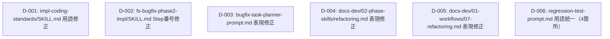

# 差分タスクリスト: リグレッションテスト用語・番号の残存修正

> 本変更は前回変更WF（202607021424-remove-regression-test-rename-terms 初回変更）のdelta-designスコープ外に残存した
> 旧用語・旧番号（PI-056〜PI-061）を新用語・新番号に修正するものであり、いずれも既存ドキュメント/スキル定義ファイル内の
> 文字列（用語・番号）修正のみである。新規クラス追加・既存メソッドのシグネチャ変更は一切含まない
> （delta-design.md「インターフェース影響サマリ」/ impact-analysis.md「シグネチャ変更追跡結果」参照）。
> よって、各修正対象ファイルを1親タスク（1ファイル=1親タスク）として扱い、サブタスクは設けない。
> 各タスクの実工程は「実装」「設計準拠レビュー」のみとし、「テスト実装」「テスト実行」「コード品質レビュー」は
> ➖ skip とする（aide-powers は自動テストフレームワークを持たず、本変更はプログラムコードを含まないため。
> dev-environment.md §1, §7 参照）。

## 依存関係グラフ



実行リンク:
- 並列スタート可能: `D-001`, `D-002`, `D-003`, `D-004`, `D-005`, `D-006`（全タスク、依存先なし・全て異なるファイルのため同時起動可）

## タスク一覧

### タスク D-001: impl-coding-standards/SKILL.md の旧用語修正（REQ-C-001対応）
- 種別: 既存変更（文字列修正）
- 対象ファイル: `skills/impl-coding-standards/SKILL.md`
- 依存先: なし
- 設計参照: delta-design.md「修正1: impl-coding-standards/SKILL.md（REQ-C-001対応）」（before/after・変更理由 PI-056）
- 実装内容:
  - ステータス運用ルール表の **DONE** 行の例において、旧用語「対象 + 全体リグレッション」を新用語「対象ユニットテスト」に文字列修正する。
  - before: `テスト全パス（対象 + 全体リグレッション）` → after: `テスト全パス（対象ユニットテスト）`
  - 表の他のセル・他の行、および表以外の記述には一切変更を加えない。
- 設計準拠レビュー観点（検証観点）:
  - delta-design.md「修正1」の after 文言と完全一致していること（`テスト全パス（対象ユニットテスト）`）。
  - 修正箇所以外（表の他の行・他のセクション）に変更がないこと。

### タスク D-002: fs-bugfix-phase2-impl/SKILL.md Integration節のStep番号修正（REQ-C-002対応）
- 種別: 既存変更（文字列修正）
- 対象ファイル: `skills/fs-bugfix-phase2-impl/SKILL.md`
- 依存先: なし
- 設計参照: delta-design.md「修正2: fs-bugfix-phase2-impl/SKILL.md Integration節（REQ-C-002対応）」（before/after・変更理由 PI-057）
- 実装内容:
  - Integration節「呼び出す共通スキル」リストの `doc-sync` の参照Stepを「Step 11」→「Step 10」に修正する。
  - 同リストの `pending-issues-management` の参照Stepを「Step 12 (check) / Step 13 (present)」→「Step 11 (check) / Step 12 (present)」に修正する。
  - 本文中のStep定義（Step1〜Step12の実体）は既に正しい番号のため変更しない。Integration節の参照表記のみを修正する。
- 設計準拠レビュー観点（検証観点）:
  - Integration節の `doc-sync` 参照が「Step 10」に修正されていること。
  - Integration節の `pending-issues-management` 参照が「Step 11 (check) / Step 12 (present)」に修正されていること。
  - 本文中のStep定義（実体）に変更がないこと（番号のズレが発生していないこと）。

### タスク D-003: bugfix-task-planner-prompt.md の運用ルール節の旧表現修正（REQ-C-003対応）
- 種別: 既存変更（文字列修正）
- 対象ファイル: `skills/fs-bugfix-phase2-impl/bugfix-task-planner-prompt.md`
- 依存先: なし
- 設計参照: delta-design.md「修正3: fs-bugfix-phase2-impl/bugfix-task-planner-prompt.md（REQ-C-003対応）」（before/after・変更理由 PI-058）
- 実装内容:
  - 運用ルール節の以下2行を削除し、1行に統合する:
    - before:
      ```
      - リグレッションテストタスクを「既存カバー範囲」と「追加必要部分」の2系統で必ず分けること
      - 各リグレッションテストタスクに「目的（防ぐバグ）」を必ず記載すること
      ```
    - after:
      ```
      - バグ再現テストを対象実装タスクのテスト観点に「目的（防ぐバグ）」を明記して含めること
      ```
  - 運用ルール節の他の行、および他のセクションには変更を加えない。
- 設計準拠レビュー観点（検証観点）:
  - 旧2行（「2系統で…分ける」「各リグレッションテストタスクに…」）が削除されていること。
  - after の1行（`バグ再現テストを対象実装タスクのテスト観点に「目的（防ぐバグ）」を明記して含めること`）が正しく追加されていること。
  - 運用ルール節の他の記載・他のセクションに変更がないこと。

### タスク D-004: docs-dev/02-ai-agent/02-phase-skills/refactoring.md の冒頭一覧表修正（REQ-C-004対応）
- 種別: 既存変更（文字列修正）
- 対象ファイル: `docs-dev/02-ai-agent/02-phase-skills/refactoring.md`
- 依存先: なし
- 設計参照: delta-design.md「修正4: docs-dev/02-ai-agent/02-phase-skills/refactoring.md（REQ-C-004対応）」（before/after・変更理由 PI-059）
- 実装内容:
  - 冒頭一覧表の `fs-refactoring-phase5-impl` 行の説明列を修正する。
  - before: `実装 + 各タスクごとのセーフティネット全実行` → after: `実装 + 動作確認Stepでセーフティネット全実行（1回）`
  - 表の他の行、および表以外の記述には一切変更を加えない。
- 設計準拠レビュー観点（検証観点）:
  - `fs-refactoring-phase5-impl` 行の説明列が after の文言（`実装 + 動作確認Stepでセーフティネット全実行（1回）`）と完全一致していること。
  - 表の他の行・他のセクションに変更がないこと。

### タスク D-005: docs-dev/02-ai-agent/01-workflows/07-refactoring.md の複数節修正（REQ-C-005対応）
- 種別: 既存変更（文字列修正）
- 対象ファイル: `docs-dev/02-ai-agent/01-workflows/07-refactoring.md`
- 依存先: なし
- 設計参照: delta-design.md「修正5: docs-dev/02-ai-agent/01-workflows/07-refactoring.md（REQ-C-005対応）」（箇所1・箇所2 before/after・変更理由 PI-060）
- 実装内容:
  - 箇所1（ワークフローの目的セクション）:
    - before: `各タスク完了ごとに既存テスト全実行で外部振る舞いの保持を確認する`
    - after: `全タスク完了後の動作確認Stepで既存テスト全実行し外部振る舞いの保持を確認する`
  - 箇所2（フェーズ一覧テーブルの `fs-refactoring-phase5-impl` 行）:
    - before: `1 タスクごとに 3エージェント体制で実装 + 既存テスト全実行`
    - after: `3エージェント体制で実装 + 動作確認Stepでセーフティネット全実行（1回）`
  - 箇所1・箇所2以外の記述には一切変更を加えない。
- 設計準拠レビュー観点（検証観点）:
  - 箇所1（ワークフローの目的セクション）が after の文言と完全一致していること。
  - 箇所2（フェーズ一覧テーブルの `fs-refactoring-phase5-impl` 行）が after の文言と完全一致していること。
  - 箇所1・箇所2以外の記述、他のセクションに変更がないこと。

### タスク D-006: regression-test-prompt.md の記録項目数表現の用語統一（REQ-C-006対応）
- 種別: 既存変更（文字列修正）
- 対象ファイル: `skills/fs-refactoring-phase5-impl/regression-test-prompt.md`
- 依存先: なし
- 設計参照: delta-design.md「修正6: fs-refactoring-phase5-impl/regression-test-prompt.md の用語統一（REQ-C-006対応）」（箇所1〜箇所4 before/after・変更理由 PI-061）。
  なお impact-analysis.md 記載の対象ファイルパス（`skills/fs-refactoring-phase1-status/SKILL.md`）は誤記であり、正しい対象ファイルは本タスクの `skills/fs-refactoring-phase5-impl/regression-test-prompt.md` である（delta-design.md 修正6内のNote記載どおり。impact-analysis.md の記載不整合の修正自体は本差分設計のスコープ外）。
- 実装内容: 以下の4箇所すべてを修正する。
  - 箇所1（開始前基準記述）:
    - before: `開始前のセーフティネット基準（PASS数・FAIL数・スキップ数）`
    - after: `開始前のセーフティネット基準（総テスト数・パス数・失敗数・スキップ数）`
  - 箇所2（報告フォーマット内、開始前基準比較記述）:
    - before: `基準値（PASS/FAIL/スキップ数） vs 今回結果`
    - after: `基準値（総テスト数/パス数/失敗数/スキップ数） vs 今回結果`
  - 箇所3（テンプレート変数説明内、baseline記述）:
    - before: `{{safety_net_baseline}}（fs-refactoring-phase1-status で記録した PASS数 / FAIL数 / スキップ数）`
    - after: `{{safety_net_baseline}}（fs-refactoring-phase1-status で記録した 総テスト数 / パス数 / 失敗数 / スキップ数）`
  - 箇所4（比較判定セクション内、baseline比較記述）:
    - before: `{{safety_net_baseline}}（開始前基準の PASS数・FAIL数・スキップ数）と今回の実行結果を比較する:`
    - after: `{{safety_net_baseline}}（開始前基準の 総テスト数・パス数・失敗数・スキップ数）と今回の実行結果を比較する:`
  - 4箇所以外の記述には一切変更を加えない。
- 設計準拠レビュー観点（検証観点）:
  - 箇所1〜箇所4のすべてが delta-design.md 修正6の after 文言と完全一致していること（4箇所とも「総テスト数・パス数・失敗数・スキップ数」表記に統一されていること）。
  - ファイル内に旧表記（`PASS数`・`FAIL数`のみで「総テスト数」を含まない表現）が残存していないこと。
  - 4箇所以外の記述に変更がないこと。

## 網羅性チェック結果
- チェック回数: 1回
- delta-design.mdの総修正項目数: 6件（修正1〜修正6）
- タスクリストの総タスク数: 6件（D-001〜D-006）
- 修正項目→タスク対応:
  - 修正1（impl-coding-standards/SKILL.md） → D-001 ✅
  - 修正2（fs-bugfix-phase2-impl/SKILL.md） → D-002 ✅
  - 修正3（bugfix-task-planner-prompt.md） → D-003 ✅
  - 修正4（docs-dev/02-phase-skills/refactoring.md） → D-004 ✅
  - 修正5（docs-dev/01-workflows/07-refactoring.md） → D-005 ✅
  - 修正6（regression-test-prompt.md） → D-006 ✅
- 循環依存: なし（全6タスクが異なるファイルへの独立した文字列修正であり、依存関係自体が存在しない）
- 最終結果: 漏れなし

## タスクサマリー
| タスクID | 対象ファイル | 種別 | 依存先 |
|---|---|---|---|
| D-001 | skills/impl-coding-standards/SKILL.md | 既存変更（文字列修正） | なし |
| D-002 | skills/fs-bugfix-phase2-impl/SKILL.md | 既存変更（文字列修正） | なし |
| D-003 | skills/fs-bugfix-phase2-impl/bugfix-task-planner-prompt.md | 既存変更（文字列修正） | なし |
| D-004 | docs-dev/02-ai-agent/02-phase-skills/refactoring.md | 既存変更（文字列修正） | なし |
| D-005 | docs-dev/02-ai-agent/01-workflows/07-refactoring.md | 既存変更（文字列修正） | なし |
| D-006 | skills/fs-refactoring-phase5-impl/regression-test-prompt.md | 既存変更（文字列修正） | なし |

- 全6タスクが非プログラム成果物（既存ドキュメント/スキル定義ファイル内の用語・番号の文字列修正）であり、新規クラス追加・既存メソッドのシグネチャ変更は一切ない。
- 全タスクがサブタスクなし（1親タスク=1ファイル=実装単位）。
- 全6タスクが並列実行可能（依存先なし、全て異なるファイル）。
