# 差分タスクリスト

## 依存関係グラフ

```mermaid
graph TD
    D001[D-001: fs-change-phase2-impl/SKILL.md]
    D002[D-002: fs-bugfix-phase2-impl/SKILL.md]
    D003[D-003: fs-refactoring-phase6-doc/SKILL.md]
    D004[D-004: fs-impl-phase5-final-check/SKILL.md]
    D005[D-005: fs-change-phase3-final-check/SKILL.md]
    D006[D-006: fs-bugfix-phase3-final-check/SKILL.md]
    D007[D-007: fs-refactoring-phase7-final-check/SKILL.md]
    D008[D-008: fs-impl-phase7-final-check/SKILL.md]
    D009[D-009: fs-planning-phase4-final-check/SKILL.md]
    D010[D-010: fs-design-phase11-final-check/SKILL.md]
    D011[D-011: fs-reverse-phase6-final-check/SKILL.md]
```

**依存関係の確認結果（実際に確認済み）:**
- 対象11ファイルの実ファイル内容を全て Read し、delta-design.md の before 記述（Step見出し・完了条件・Integration記載・レポート記載項目リスト）と一字一句一致することを確認した
- パターンA対象4ファイル（D-001〜D-004、実装フェーズ・最終チェックフェーズからのStep削除系）とパターンB対象7ファイル（D-005〜D-011、全7WFのfinal-check後処理への追加系）の間で、Step番号・見出し・Integration記載を相互参照する箇所がないことをgrep検索で確認した（`fs-change-phase2-impl.*Step` 等のパターンで final-check 系ファイルを検索した結果、マッチ0件）
- 11ファイルはそれぞれ独立したSKILL.mdファイルであり、同一ファイルを複数タスクが変更するケースもない（1タスク=1ファイルの1:1対応）
- 各ファイルの編集対象箇所（Step削除+リナンバリング、または後処理へのpending-issues追加）はファイル内部に閉じた変更であり、他ファイルの内容確定を前提としない

**結論:** 全11タスクの依存先は「なし」。実行リンク（矢印）は存在せず、全ノードが独立した並列スタート可能ノードである。Wave 1 で11タスク全てを同時に起動できる。

## 実行順序（トポロジカルソート）

| Wave | タスク | 並列可否 |
|---|---|---|
| Wave 1 | D-001, D-002, D-003, D-004, D-005, D-006, D-007, D-008, D-009, D-010, D-011 | 並列可（11タスク全て依存先なし。最大並列度11） |

## タスク一覧

### タスク D-001: fs-change-phase2-impl/SKILL.md の更新
- 種別: 既存変更
- 対象ファイル: skills/fs-change-phase2-impl/SKILL.md
- テストファイル: なし（形式チェックのみ。自動テストコード非対象。dev-environment.md §7.4準拠）
- 依存先: なし
- 設計参照: delta-design.md の A-1
- 変更内容:
  - `## Step 13: pending-issues 書き込み忘れチェック` セクション全体を削除する
  - 旧 `## Step 14: 変更完了の案内` を `## Step 13: 変更完了の案内` にリナンバリングする（見出し・本文中の `(Step14)` 表記を全て `(Step13)` に変更）
  - 新Step13内の pending-issues-management (present) 呼び出し記述（`pending-issues-management(present)の出力(Step14):` / `pending-issues対応方針(Step14):` を含む段落）を削除する
  - 新Step13の完了条件から `pending-issues-management(present)の出力(Step14)` / `pending-issues対応方針(Step14)` を除去する
  - フェーズ末尾「完了条件」セクションの項目9（pending-issues 書き込み忘れチェックが完了している）を削除し、後続項目（旧10〜14）を9〜13に繰り上げる
  - Integrationセクション「呼び出す共通スキル」から `pending-issues-management (aide-powers skill) — Step 13 (check) / Step 14 (present)` の行を削除する
- テスト観点:
  - `## Step 13: pending-issues 書き込み忘れチェック` の見出し・本文が完全に削除されていること
  - `## Step 14: 変更完了の案内` が `## Step 13: 変更完了の案内` に変更され、本文中の `(Step14)` 表記が全て `(Step13)` に変更されていること
  - 新Step13にpending-issues-management(present)の呼び出し記述が残っていないこと
  - フェーズ末尾「完了条件」セクションの項目番号が1〜13の連番になっていること（旧項目9削除・後続繰り上げ）
  - Integrationセクションにpending-issues-managementの参照行が存在しないこと
  - Markdown構文が正しいこと（見出しレベル、テーブル構造、リスト構造）

### タスク D-002: fs-bugfix-phase2-impl/SKILL.md の更新
- 種別: 既存変更
- 対象ファイル: skills/fs-bugfix-phase2-impl/SKILL.md
- テストファイル: なし（形式チェックのみ。自動テストコード非対象。dev-environment.md §7.4準拠）
- 依存先: なし
- 設計参照: delta-design.md の A-2
- 変更内容:
  - `## Step 11: pending-issues 書き込み忘れチェック` セクション全体を削除する
  - 旧 `## Step 12: バグ修正完了の案内` を `## Step 11: バグ修正完了の案内` にリナンバリングする（見出し・本文中の `(Step12)` 表記を全て `(Step11)` に変更）
  - 新Step11内の pending-issues-management (present) 呼び出し記述（`pending-issues-management(present)の出力(Step12):` / `pending-issues対応方針(Step12):` を含む段落）を削除する
  - 新Step11の完了条件から `pending-issues-management(present)の出力(Step12)` / `pending-issues対応方針(Step12)` を除去する
  - Integrationセクション「呼び出す共通スキル」から `pending-issues-management (aide-powers skill) — Step 11 (check) / Step 12 (present)` の行を削除する
  - 本ファイルには独立した「# 完了条件」トップレベルセクション（項目番号付きリスト）は存在しないため、その削除・繰り上げ作業は対象外（fs-change-phase2-impl固有の構造であることを実ファイル確認済み）
- テスト観点:
  - `## Step 11: pending-issues 書き込み忘れチェック` の見出し・本文が完全に削除されていること
  - `## Step 12: バグ修正完了の案内` が `## Step 11: バグ修正完了の案内` に変更され、本文中の `(Step12)` 表記が全て `(Step11)` に変更されていること
  - 新Step11にpending-issues-management(present)の呼び出し記述が残っていないこと
  - Integrationセクションにpending-issues-managementの参照行が存在しないこと
  - Markdown構文が正しいこと（見出しレベル、テーブル構造、リスト構造）

### タスク D-003: fs-refactoring-phase6-doc/SKILL.md の更新
- 種別: 既存変更
- 対象ファイル: skills/fs-refactoring-phase6-doc/SKILL.md
- テストファイル: なし（形式チェックのみ。自動テストコード非対象。dev-environment.md §7.4準拠）
- 依存先: なし
- 設計参照: delta-design.md の A-3
- 変更内容:
  - `## Step 2: pending-issues 書き込み忘れチェック` セクション全体を削除する
  - 旧 `## Step 3: リファクタリング完了案内` を `## Step 2: リファクタリング完了案内` にリナンバリングする（見出し・本文中の `(Step3)` 表記を全て `(Step2)` に変更）
  - 旧 `## Step 4: 完了案内のユーザー承認` を `## Step 3: 完了案内のユーザー承認` にリナンバリングする（見出し・本文中の `(Step4)` 表記を全て `(Step3)` に変更）
  - Step 1 の状態判定の遷移先記述を、削除後のリナンバリングに合わせて整合させる（旧Step 1 の状態判定「Step2へ遷移する」は削除後の新Step2＝旧Step3を指すため文言変更不要。旧Step2の状態判定「Step3へ遷移する」は削除されるため参照ごと消える）
  - Integrationセクション「呼び出す共通スキル」から `pending-issues-management (aide-powers skill: check) — Step 2（書き込み忘れチェック）` の行を削除する
  - 本ファイルには独立した「# 完了条件」トップレベルセクション（項目番号付きリスト）は存在しないため、その削除・繰り上げ作業は対象外
- テスト観点:
  - `## Step 2: pending-issues 書き込み忘れチェック` の見出し・本文が完全に削除されていること
  - `## Step 3: リファクタリング完了案内` が `## Step 2: リファクタリング完了案内` に、`## Step 4: 完了案内のユーザー承認` が `## Step 3: 完了案内のユーザー承認` に変更され、本文中の `(Step3)`→`(Step2)`、`(Step4)`→`(Step3)` の表記変更が全て反映されていること
  - Step1〜新Step3の状態判定の遷移先（Step番号）が実際の見出し番号と一致し、存在しないStep番号を指していないこと
  - Integrationセクションにpending-issues-managementの参照行が存在しないこと
  - Markdown構文が正しいこと（見出しレベル、テーブル構造、リスト構造）

### タスク D-004: fs-impl-phase5-final-check/SKILL.md の更新
- 種別: 既存変更
- 対象ファイル: skills/fs-impl-phase5-final-check/SKILL.md
- テストファイル: なし（形式チェックのみ。自動テストコード非対象。dev-environment.md §7.4準拠）
- 依存先: なし
- 設計参照: delta-design.md の A-4（本タスクのみ「付随変更: レポート記載項目リスト」を含む。impact-analysis.md 2.3節で指摘され、2回目QAレビューで delta-design.md に反映済み・APPROVED済みの箇所）
- 変更内容:
  - `## Step 3: pending-issues の確認と書き込み忘れチェック` セクション全体を削除する（Step 3 が本フェーズの最終Stepのためリナンバリングは不要）
  - Step 2 の状態判定の文言を「完了条件を満たし"網羅性チェック結果(Step2)"が全要件カバーの場合 Step3 へ遷移する。」から「完了条件を満たし"網羅性チェック結果(Step2)"が全要件カバーの場合 後処理へ遷移する。」に変更する
  - Integrationセクション「呼び出す共通スキル」から `pending-issues-management (aide-powers skill) — Step 3 (check) / Step 3 (present)` の行を削除する
  - `# レポート記載項目リスト` セクションから以下4項目を削除する: `pending-issues-management(check)の出力(Step3):` / `書き込み漏れの有無と対応(Step3):` / `pending-issues-management(present)の出力(Step3):` / `pending-issues提示結果(Step3):`
- テスト観点:
  - `## Step 3: pending-issues の確認と書き込み忘れチェック` の見出し・本文が完全に削除されていること
  - Step 2 の状態判定の遷移先文言が「後処理へ遷移する」に変更されていること
  - Integrationセクションにpending-issues-managementの参照行が存在しないこと
  - `# レポート記載項目リスト` セクションに Step3 関連4項目（pending-issues-management(check)の出力(Step3) / 書き込み漏れの有無と対応(Step3) / pending-issues-management(present)の出力(Step3) / pending-issues提示結果(Step3)）が残っていないこと（impact-analysis.md 2.3節で指摘された記載項目漏れ誤判定リスクの解消確認）
  - Markdown構文が正しいこと（見出しレベル、テーブル構造、リスト構造）

### タスク D-005: fs-change-phase3-final-check/SKILL.md の更新
- 種別: 既存変更
- 対象ファイル: skills/fs-change-phase3-final-check/SKILL.md
- テストファイル: なし（形式チェックのみ。自動テストコード非対象。dev-environment.md §7.4準拠）
- 依存先: なし
- 設計参照: delta-design.md の B-1（パターンBの完全例。before/after全文が明記されている）
- 変更内容:
  - 後処理の「以下を満たすこと」セクションで、`git-commit-workflow (aide-powers skill)を activate して実行し...変更WF最終コミット結果(後処理):` の記載直後・`完了ステータス(後処理):` の記載直前に、以下2手順を追加する:
    - `pending-issues-management (aide-powers skill: check)` 呼び出し（pending_issues_path: `.aide/specs/{feature_name}/pending-issues.md`）と `書き込み漏れの有無と対応(後処理):` 記載
    - `pending-issues-management (aide-powers skill: present)` 呼び出し（同パス）と `pending-issues対応方針(後処理):` 記載
  - 後処理の「完了条件」に `pending-issues-management(check)の出力(後処理)` / `pending-issues-management(present)の出力(後処理)` を追加する
  - Integrationセクション「呼び出す共通スキル」の `git-commit-workflow (aide-powers skill) — 後処理（変更WF全体のコミット）` 行の直後に `pending-issues-management (aide-powers skill) — 後処理（check: 書き込み忘れチェック / present: 既存issues提示・対応確認）` 行を追加する
- テスト観点:
  - 後処理内の実行順序が「doc-index-maintenance → user-profile-management(update) → git-commit-workflow → pending-issues-management(check) → pending-issues-management(present) → 完了ステータス」の順になっていること
  - 追加された2手順の記載文言が delta-design.md B-1 の after 例（`pending-issues-management (aide-powers skill: check)を activate して実行し...` 等）と一致していること
  - 後処理の完了条件に上記2項目が追加されていること
  - Integrationセクションに `pending-issues-management (aide-powers skill) — 後処理（check: 書き込み忘れチェック / present: 既存issues提示・対応確認）` の行が追加されていること
  - Markdown構文が正しいこと（見出しレベル、テーブル構造、リスト構造）

### タスク D-006: fs-bugfix-phase3-final-check/SKILL.md の更新
- 種別: 既存変更
- 対象ファイル: skills/fs-bugfix-phase3-final-check/SKILL.md
- テストファイル: なし（形式チェックのみ。自動テストコード非対象。dev-environment.md §7.4準拠）
- 依存先: なし
- 設計参照: delta-design.md の B-2（B-1と同一パターン。差分: レポートファイル名 `fs-bugfix-phase3-report.txt`、コミット説明文「バグ修正ワークフロー全体の成果物をまとめてコミットする」、コミット結果記載項目名 `コミット結果(後処理):`、次フェーズ遷移先「なし（バグ修正ワークフロー最終フェーズ）」）
- 変更内容:
  - 後処理の「以下を満たすこと」セクションで、`git-commit-workflow (aide-powers skill)を activate して実行し...コミット結果(後処理):` の記載直後・`完了ステータス(後処理):` の記載直前に、B-1と同型のpending-issues check→present 2手順を追加する
  - 後処理の「完了条件」に `pending-issues-management(check)の出力(後処理)` / `pending-issues-management(present)の出力(後処理)` を追加する
  - Integrationセクション「呼び出す共通スキル」の `git-commit-workflow (aide-powers skill) — 後処理（バグ修正WF全体のコミット）` 行の直後に `pending-issues-management (aide-powers skill) — 後処理（check: 書き込み忘れチェック / present: 既存issues提示・対応確認）` 行を追加する
- テスト観点:
  - 後処理内の実行順序が「doc-index-maintenance → user-profile-management(update) → git-commit-workflow → pending-issues-management(check) → pending-issues-management(present) → 完了ステータス」の順になっていること
  - 追加された2手順の記載文言がB-1のパターンと同型で、レポートファイル名・コミット結果記載項目名等のファイル固有差分が正しく反映されていること
  - 後処理の完了条件に上記2項目が追加されていること
  - Integrationセクションに `pending-issues-management (aide-powers skill)` の行が `git-commit-workflow` 行の直後に追加されていること（delta-design.md B-2 明記のbefore/afterと一致）
  - Markdown構文が正しいこと（見出しレベル、テーブル構造、リスト構造）

### タスク D-007: fs-refactoring-phase7-final-check/SKILL.md の更新
- 種別: 既存変更
- 対象ファイル: skills/fs-refactoring-phase7-final-check/SKILL.md
- テストファイル: なし（形式チェックのみ。自動テストコード非対象。dev-environment.md §7.4準拠）
- 依存先: なし
- 設計参照: delta-design.md の B-3（doc-index-maintenance / user-profile-management を呼ばない構造。差分: レポートファイル名 `fs-refactoring-phase7-report.txt`、コミット説明文「リファクタリングワークフロー全フェーズの成果物...をまとめてコミットする」、コミット結果記載項目名 `最終進捗更新のコミット結果(後処理):`、次フェーズ遷移先「なし（リファクタリングワークフロー最終フェーズ）」）
- 変更内容:
  - 後処理の「以下を満たすこと」セクションで、`git-commit-workflow (aide-powers skill)を activate して実行し...最終進捗更新のコミット結果(後処理):` の記載直後・`完了ステータス(後処理):` の記載直前に、pending-issues check→present 2手順を追加する
  - 後処理の注記（「doc-index-maintenance / user-profile-management(update) は前フェーズ fs-refactoring-phase6-doc で実施済みのため本フェーズでは呼ばない。」）の直後にpending-issues追加に関する注記を配置する
  - 後処理の「完了条件」に `pending-issues-management(check)の出力(後処理)` / `pending-issues-management(present)の出力(後処理)` を追加する
  - Integrationセクション「呼び出す共通スキル」の `git-commit-workflow (aide-powers skill) — 後処理（リファクタリングWF唯一のまとめコミット。progress-final-checker の最終進捗更新後に実行）` 行の直後に `pending-issues-management (aide-powers skill) — 後処理（check: 書き込み忘れチェック / present: 既存issues提示・対応確認）` 行を追加する
- テスト観点:
  - pending-issues 手順の挿入位置が「git-commit-workflow の記載項目の直後、完了ステータス(後処理): の直前」であること（delta-design.md B-3 の配置指定と一致）
  - doc-index-maintenance / user-profile-management を呼ばない構造が維持され、それらの呼び出しが誤って追加されていないこと
  - 後処理の完了条件に上記2項目が追加されていること
  - Integrationセクションに `pending-issues-management (aide-powers skill)` の行が `git-commit-workflow` 行の直後に追加されていること
  - Markdown構文が正しいこと（見出しレベル、テーブル構造、リスト構造）

### タスク D-008: fs-impl-phase7-final-check/SKILL.md の更新
- 種別: 既存変更
- 対象ファイル: skills/fs-impl-phase7-final-check/SKILL.md
- テストファイル: なし（形式チェックのみ。自動テストコード非対象。dev-environment.md §7.4準拠）
- 依存先: なし
- 設計参照: delta-design.md の B-4（B-3と同一パターン。doc-index-maintenance / user-profile-management を呼ばない構造。差分: レポートファイル名 `fs-impl-phase7-report.txt`、コミット説明文「実装ワークフローは各フェーズコミット型であり...」、コミット結果記載項目名 `最終進捗更新のコミット結果(後処理):`、次フェーズ遷移先「なし（実装ワークフロー最終フェーズ）」）
- 変更内容:
  - 後処理の「以下を満たすこと」セクションで、`git-commit-workflow (aide-powers skill)を activate して実行し...最終進捗更新のコミット結果(後処理):` の記載直後・`完了ステータス(後処理):` の記載直前に、pending-issues check→present 2手順を追加する
  - 後処理の注記（「doc-index-maintenance / user-profile-management(update) は本フェーズの後処理では実行しない」）の直後にpending-issues追加に関する注記を配置する
  - 後処理の「完了条件」に `pending-issues-management(check)の出力(後処理)` / `pending-issues-management(present)の出力(後処理)` を追加する
  - Integrationセクション「呼び出す共通スキル」の `git-commit-workflow (aide-powers skill) — 後処理（各フェーズコミット型。progress-final-checker による最終進捗更新の後にコミット）` 行の直後に `pending-issues-management (aide-powers skill) — 後処理（check: 書き込み忘れチェック / present: 既存issues提示・対応確認）` 行を追加する
- テスト観点:
  - pending-issues 手順の挿入位置が「git-commit-workflow の記載項目の直後、完了ステータス(後処理): の直前」であること
  - doc-index-maintenance / user-profile-management を呼ばない構造が維持されていること
  - 後処理の完了条件に上記2項目が追加されていること
  - Integrationセクションに `pending-issues-management (aide-powers skill)` の行が `git-commit-workflow` 行の直後に追加されていること
  - Markdown構文が正しいこと（見出しレベル、テーブル構造、リスト構造）

### タスク D-009: fs-planning-phase4-final-check/SKILL.md の更新
- 種別: 既存変更
- 対象ファイル: skills/fs-planning-phase4-final-check/SKILL.md
- テストファイル: なし（形式チェックのみ。自動テストコード非対象。dev-environment.md §7.4準拠）
- 依存先: なし
- 設計参照: delta-design.md の B-5（B-1と同一パターン。差分: レポートファイル名 `fs-planning-phase4-report.txt`、コミット説明文「本フェーズで progress-final-checker が最終フェーズ行を ✅ 完了 に更新した進捗ファイルを含め、企画ワークフローの最終状態をコミットする」、コミット結果記載項目名 `コミット結果(後処理):`、次フェーズ遷移先「なし（企画ワークフロー最終フェーズ）」）
- 変更内容:
  - 後処理の「以下を満たすこと」セクションで、`git-commit-workflow (aide-powers skill)を activate して実行し...コミット結果(後処理):` の記載直後・`完了ステータス(後処理):` の記載直前に、B-1と同型のpending-issues check→present 2手順を追加する
  - 後処理の「完了条件」に `pending-issues-management(check)の出力(後処理)` / `pending-issues-management(present)の出力(後処理)` を追加する
  - Integrationセクション「呼び出す共通スキル」の `git-commit-workflow (aide-powers skill) — 後処理（企画WF最終状態のコミット）` 行の直後に `pending-issues-management (aide-powers skill) — 後処理（check: 書き込み忘れチェック / present: 既存issues提示・対応確認）` 行を追加する
- テスト観点:
  - 後処理内の実行順序が「doc-index-maintenance → user-profile-management(update) → git-commit-workflow → pending-issues-management(check) → pending-issues-management(present) → 完了ステータス」の順になっていること
  - 追加された2手順の記載文言がB-1のパターンと同型で、レポートファイル名・コミット結果記載項目名等のファイル固有差分が正しく反映されていること
  - 後処理の完了条件に上記2項目が追加されていること
  - Integrationセクションに `pending-issues-management (aide-powers skill)` の行が `git-commit-workflow` 行の直後に追加されていること
  - Markdown構文が正しいこと（見出しレベル、テーブル構造、リスト構造）

### タスク D-010: fs-design-phase11-final-check/SKILL.md の更新
- 種別: 既存変更
- 対象ファイル: skills/fs-design-phase11-final-check/SKILL.md
- テストファイル: なし（形式チェックのみ。自動テストコード非対象。dev-environment.md §7.4準拠）
- 依存先: なし
- 設計参照: delta-design.md の B-6（B-1と同一パターン。差分: レポートファイル名 `fs-design-phase11-report.txt`、コミット説明文「設計ワークフロー最終フェーズの最終進捗更新...を含めてコミットする」、コミット結果記載項目名 `コミット結果(後処理):`、次フェーズ遷移先「なし（設計ワークフロー最終フェーズ）」）
- 変更内容:
  - 後処理の「以下を満たすこと」セクションで、`git-commit-workflow (aide-powers skill)を activate して実行し...コミット結果(後処理):` の記載直後・`完了ステータス(後処理):` の記載直前に、B-1と同型のpending-issues check→present 2手順を追加する
  - 後処理の「完了条件」に `pending-issues-management(check)の出力(後処理)` / `pending-issues-management(present)の出力(後処理)` を追加する
  - Integrationセクション「呼び出す共通スキル」の `git-commit-workflow (aide-powers skill) — 後処理（最終進捗更新後のコミット。設計WFは各フェーズコミット型のため、最終フェーズ行 ✅ 完了 の取りこぼし防止に必須）` 行の直後に `pending-issues-management (aide-powers skill) — 後処理（check: 書き込み忘れチェック / present: 既存issues提示・対応確認）` 行を追加する
- テスト観点:
  - 後処理内の実行順序が「doc-index-maintenance → user-profile-management(update) → git-commit-workflow → pending-issues-management(check) → pending-issues-management(present) → 完了ステータス」の順になっていること
  - 追加された2手順の記載文言がB-1のパターンと同型で、レポートファイル名・コミット結果記載項目名等のファイル固有差分が正しく反映されていること
  - 後処理の完了条件に上記2項目が追加されていること
  - Integrationセクションに `pending-issues-management (aide-powers skill)` の行が `git-commit-workflow` 行の直後に追加されていること
  - Markdown構文が正しいこと（見出しレベル、テーブル構造、リスト構造）

### タスク D-011: fs-reverse-phase6-final-check/SKILL.md の更新
- 種別: 既存変更
- 対象ファイル: skills/fs-reverse-phase6-final-check/SKILL.md
- テストファイル: なし（形式チェックのみ。自動テストコード非対象。dev-environment.md §7.4準拠）
- 依存先: なし
- 設計参照: delta-design.md の B-7（B-1と同一パターン。差分: レポートファイル名 `fs-reverse-phase6-report.txt`、コミット説明文「設計逆引きワークフロー最終フェーズの最終進捗更新...を含めてコミットする」、コミット結果記載項目名 `最終進捗更新のコミット結果(後処理):`、次フェーズ遷移先「なし（設計逆引きワークフロー最終フェーズ）」）
- 変更内容:
  - 後処理の「以下を満たすこと」セクションで、`git-commit-workflow (aide-powers skill)を activate して実行し...最終進捗更新のコミット結果(後処理):` の記載直後・`完了ステータス(後処理):` の記載直前に、B-1と同型のpending-issues check→present 2手順を追加する
  - 後処理の「完了条件」に `pending-issues-management(check)の出力(後処理)` / `pending-issues-management(present)の出力(後処理)` を追加する
  - Integrationセクション「呼び出す共通スキル」の `git-commit-workflow (aide-powers skill) — 後処理（最終進捗更新後のコミット。設計逆引きWFは各フェーズコミット型のため、最終フェーズ行 ✅ 完了 の取りこぼし防止に必須）` 行の直後に `pending-issues-management (aide-powers skill) — 後処理（check: 書き込み忘れチェック / present: 既存issues提示・対応確認）` 行を追加する
- テスト観点:
  - 後処理内の実行順序が「doc-index-maintenance → user-profile-management(update) → git-commit-workflow → pending-issues-management(check) → pending-issues-management(present) → 完了ステータス」の順になっていること
  - 追加された2手順の記載文言がB-1のパターンと同型で、レポートファイル名・コミット結果記載項目名等のファイル固有差分が正しく反映されていること
  - 後処理の完了条件に上記2項目が追加されていること
  - Integrationセクションに `pending-issues-management (aide-powers skill)` の行が `git-commit-workflow` 行の直後に追加されていること
  - Markdown構文が正しいこと（見出しレベル、テーブル構造、リスト構造）

## 網羅性チェック結果

- チェック回数: 2回
  - 1回目: delta-design.md（全文）を Read し、パターンA（A-1〜A-4）・パターンB（B-1〜B-7）の合計11変更項目を抽出し、タスク D-001〜D-011 を1項目=1タスクで作成した
  - 2回目: impact-analysis.md（更新版）2.3節・2.4節の「新規検出」記載（fs-impl-phase5-final-checkの「レポート記載項目リスト」更新漏れリスク、B-2〜B-7のIntegrationセクション追加の暗黙要求）が、delta-design.md 本文（2回目QAレビューAPPROVED済み版）に既に反映済みであることを確認し、D-004（レポート記載項目リスト4項目削除を明記）およびD-006〜D-011（Integrationセクション追加を個別に明記）の変更内容に正しく反映されていることを再確認した
- 設計書の総変更項目数: 11件（A-1, A-2, A-3, A-4, B-1, B-2, B-3, B-4, B-5, B-6, B-7）
- タスクリストの総タスク数: 11件（D-001〜D-011）
- 最終結果: 漏れなし

## タスクサマリー
- 既存変更タスク: 11件（Step削除・リナンバリング系4件〔D-001〜D-004〕+ 後処理pending-issues追加系7件〔D-005〜D-011〕）
- 新規追加タスク: 0件（本変更はスキル定義ファイルの既存内容変更のみ。新規ファイル作成はなし）
- 合計: 11件
