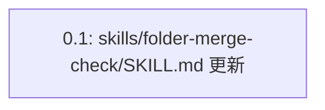

# 差分タスクリスト: folder-merge-scope-judgement

## 依存関係グラフ

実行リンク: `0.1`（依存先なし・単独実行可能。他に並列/逐次関係を持つタスクは存在しない）

## タスク一覧

### タスク 0.1: skills/folder-merge-check/SKILL.md の更新（新設Step3挿入＋既存Step3〜6のリナンバリング＋完了条件/Red Flags/Common Rationalizations更新）

- 種別: 既存変更（新設Stepの挿入を含む。SKILL.md 1ファイル全体を1つの変更単位として扱う）
- 対象ファイル: `skills/folder-merge-check/SKILL.md`
- テストファイル: なし（本リポジトリは自動テストフレームワーク非導入・手動検証方針〔dev-environment.md §7.4〕。動作確認は後続のStep11〔動作確認Step〕で手動検証として実施する）
- 依存先: なし
- 設計参照:
  - delta-design.md「新規追加」セクション全文（新設Step「起因元要件との関連性判断」(a)〜(e)）
  - delta-design.md「既存変更」セクション 変更1〜7（Step3→Step4リナンバリング＋提示情報拡張、旧Step4→Step5リナンバリング、旧Step5→Step6リナンバリング、旧Step6→Step7リナンバリング、完了条件セクション更新、Red Flags追加、Common Rationalizations追加）
- テスト観点（impact-analysis.md「テスト対象機能の特定」#1〜18の要点。後続Step11の動作確認Stepで手動検証する):
  - 新設Step3(a): 起因元要件のまとめが優先順位付き3段階（優先1: トップレベル現存(b)分類ファイル／優先2: old/{日付}/配下の過去要求文書〔最新日付優先〕／優先3: history.md）で読み込まれ要約されること
  - 新設Step3(b): `workflow_type` に応じて統合先要件（change-requirements.md／bug-report.md＋bug-analysis.md／refactoring-candidates.md）が `current_dir` から機械的に特定・読み込まれること
  - 新設Step3(c): 起因元要件と統合先要件の内容比較に基づき関連性の強弱が二値判断され、判断理由（根拠）が明文化されること
  - 新設Step3(d): 強弱の判断が困難な場合、AIが独自判断で確定せず、1.強い／2.弱い・なし／3.その他の選択肢でユーザー確認を行うこと
  - 新設Step3(e): 「強い」確定時は判断結果・根拠を保持したまま新Step4へ進み、「弱い・なし」確定時は `merged=false, result_dir=current_dir` を返しStep4以降をスキップすること
  - 新Step4（旧Step3）: ユーザー提示情報の「過去の経緯」と「現在のフォルダ」の間に「関連性の判断結果」「判断理由（根拠）」が追加提示され、「1.はい」選択時の遷移先が新Step5になっていること
  - 新Step5（旧Step4）: 移動ルール（a/b/b-2/c）・Step5-事前（退避処理）の内部ロジックが変更されておらず、自己参照「本Step4の判定基準」が「本Step5の判定基準」に正しく更新されていること
  - 新Step6（旧Step5）: `workflow_type` による分岐処理（変更/リファクタリング即時更新、バグ修正はdoc-sync委譲）が変更されていないこと
  - 新Step7（旧Step6）: `merged=true, result_dir=origin_folder_path` の返却処理が変更されていないこと
  - 完了条件セクション: 「統合した場合」項目1（新設Step3の判断完了）〜8、「統合しなかった場合」項目1（関連性「弱い・なし」分岐の追加）が正しく反映されていること
  - Red Flagsテーブル: 末尾に2行（「Step3を経ずに即座にユーザーへ統合可否を確認する」／「関連性の強弱判断（Step3）は省略してよい」）が追加されていること
  - Common Rationalizationsテーブル: 末尾に2行（「history.mdの経緯だけで関連性は判断できる」／「判断が難しいときは『強い』側に倒す」）が追加されていること

サブタスクなし: 本タスクはMarkdown形式のスキル定義ファイル1ファイルへの内部プロセス変更であり、impl-task-planning共通スキルの「既存メソッド変更のみの場合はサブタスクなし」の原則、および本変更固有の指示「SKILL.md 1ファイル全体を1つの変更単位として扱う」に従い、新設Stepの挿入・既存Step3〜6のリナンバリング・完了条件/Red Flags/Common Rationalizationsの各更新を1つの親タスクにまとめている。

## 網羅性チェック結果

delta-design.md の全変更項目（新規追加1件＋既存変更7件）とタスク一覧を照合した。

| # | delta-design.md の変更項目 | タスクリストでの反映箇所 |
|---|---|---|
| 1 | 新規追加: 新設Step「起因元要件との関連性判断」(a)〜(e) | タスク0.1（設計参照「新規追加」セクション全文、テスト観点の新設Step3(a)〜(e)の各項） |
| 2 | 既存変更1: Step3→Step4リナンバリングと提示情報拡張 | タスク0.1（テスト観点「新Step4（旧Step3）」の項） |
| 3 | 既存変更2: 旧Step4→Step5リナンバリング（自己参照更新含む） | タスク0.1（テスト観点「新Step5（旧Step4）」の項） |
| 4 | 既存変更3: 旧Step5→Step6リナンバリング | タスク0.1（テスト観点「新Step6（旧Step5）」の項） |
| 5 | 既存変更4: 旧Step6→Step7リナンバリング | タスク0.1（テスト観点「新Step7（旧Step6）」の項） |
| 6 | 既存変更5: 完了条件セクションの整合性更新 | タスク0.1（テスト観点「完了条件セクション」の項） |
| 7 | 既存変更6: Red Flagsテーブルへの項目追加 | タスク0.1（テスト観点「Red Flagsテーブル」の項） |
| 8 | 既存変更7: Common Rationalizationsテーブルへの項目追加 | タスク0.1（テスト観点「Common Rationalizationsテーブル」の項） |

- チェック回数: 1回
- 設計書の総変更項目数: 8件（新規追加1件＋既存変更7件）
- タスクリストの総タスク数: 1件（変更対象ファイルが `skills/folder-merge-check/SKILL.md` の1ファイルに限定されるため、ファイル競合防止の原則に従い全変更項目を単一親タスクに集約）
- 最終結果: 漏れなし

## タスクサマリー

- 新規追加タスク: 0件（新設Stepの追加は既存ファイルへの変更として本変更ワークフロー固有ルールに基づきタスク0.1に統合）
- 既存変更タスク: 1件（タスク0.1）
- GUI実装タスク: 0件（該当なし）
- 合計: 1件
