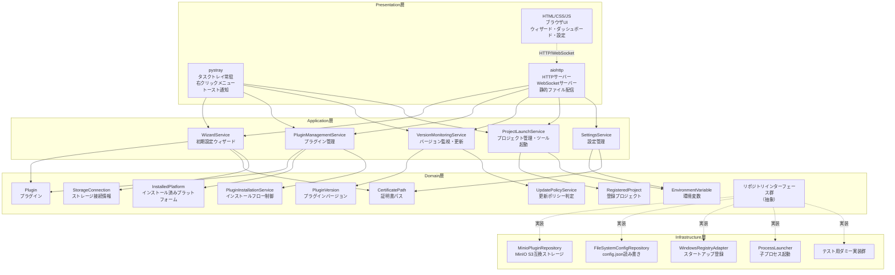
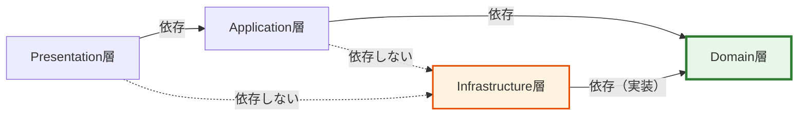

# レイヤードアーキテクチャ設計: aide-powers タスクトレイ管理アプリ

## 1. DDD採用可否の判断

### 1.1 分析観点

| # | 分析観点 | 評価 | 根拠 |
|---|---|---|---|
| 1 | ドメインルール・振る舞いの有無 | **あり** | バージョン比較ロジック（セマンティックバージョニング）、環境変数のバリデーション（キー重複禁止・空チェック）、証明書パス検証、プラグインインストールフロー（ステップ管理・リトライ）、更新ポリシー（全自動更新禁止・ユーザートリガー必須）、プロジェクト管理（登録・削除・最終使用日時更新）等、ビジネスロジックとして独立したルール・振る舞いが明確に存在する |
| 2 | ルール変更の主体 | **自チーム** | バージョン比較ルール、更新ポリシー、環境変数プリセット、プラグインインストール手順等はすべて自チームの判断で変更可能。外部ライブラリ（minio-py, pystray等）はインフラ層の実装詳細であり、ドメインルールそのものではない |
| 3 | 変更の可能性 | **高い** | 将来のdesk-agents追加（REQ-S04）により、プラグイン管理・バージョン監視の対象が拡大する。更新ポリシーの変更（段階的ロールアウト等）、新しいプラットフォーム追加時の環境変数プリセット変更等が見込まれる |
| 4 | ドメインオブジェクトの再利用価値 | **高い** | バージョン比較は更新チェック・ダッシュボード表示・更新実行の3ユースケースで共通利用。環境変数管理はウィザード・設定画面・開発ツール起動の3ユースケースで共通利用。プロジェクト管理はタスクトレイメニュー・ダッシュボードの2ユースケースで共通利用 |
| 5 | ドメインの複雑さ | **中程度** | 単純なCRUDではなく、バージョン比較・インストールフロー・更新ポリシー等の判断ロジックが存在する。ただし金融・医療等の高度に複雑なドメインではない |

### 1.2 結論

**DDD採用: 採用する**

### 1.3 理由

- ドメイン固有のルール・振る舞いが明確に存在し、単なるデータの受け渡し・変換ではない
- ルール変更が自チームの判断で発生しうる（更新ポリシー、プリセット変更、desk-agents追加等）
- 複数のユースケースでドメインオブジェクトを再利用する価値がある（バージョン比較、環境変数管理等）
- 将来のdesk-agents追加（REQ-S04）に備え、ドメインロジックをインフラ実装から分離しておくことで変更容易性を確保できる

---

## 2. アーキテクチャパターンの選択

### 2.1 選択結果

**4層レイヤードアーキテクチャ**（Presentation → Application → Domain ← Infrastructure）

### 2.2 選択理由

| 判断観点 | 評価 | 根拠 |
|---|---|---|
| プロジェクト規模 | 小〜中規模 | Windowsデスクトップアプリ（タスクトレイ常駐）。開発チーム1名 |
| 外部I/Oの多様性 | 中程度 | MinIO（S3互換）、ファイルシステム、Windowsレジストリ、子プロセス起動の4種。ヘキサゴナルほどの柔軟性は不要 |
| DIPの必要度 | 中程度 | MinIO→boto3の差し替え（REQ-M13）に対応するため、ストレージ層の抽象化は必須。ただしオニオン/クリーンほどの徹底は不要 |
| 学習コスト | 低い | 4層レイヤードはDDDの標準的なパターンであり、理解しやすい |
| テスト独立性 | 中程度 | ドメイン層の純粋ロジックはモック不要でテスト可能。インフラ層はRepositoryインターフェースで差し替え可能 |

ヘキサゴナル・オニオン・クリーンアーキテクチャは、本プロジェクトの規模・チーム構成に対してオーバーエンジニアリングとなるため不採用。

---

## 3. レイヤー構成図

### 3.1 全体構成



### 3.2 依存方向図



**依存ルールの要約:**
- Presentation → Application → Domain（上位から下位への一方向依存）
- Infrastructure → Domain（依存性逆転: Infrastructure層がDomain層のインターフェースを実装）
- Domain層は他のどの層にも依存しない（最も安定した層）

---

## 4. 各レイヤーの責務定義

### 4.1 Presentation層

| 項目 | 内容 |
|---|---|
| 責務 | ユーザーとのインタラクション。入力の受け取り、出力の表示。UIの状態管理 |
| 技術 | pystray（タスクトレイ）、aiohttp（HTTP + WebSocketサーバー）、HTML/CSS/JS（ブラウザUI）、webbrowser（ブラウザ起動）、Pillow（アイコン画像） |
| 依存先 | Application層のサービスを呼び出す |
| 禁止事項 | ビジネスロジックの実装、Infrastructure層への直接アクセス、ドメインオブジェクトの生成・操作（Application層経由で行う） |

#### 配置するコンポーネント

| コンポーネント | 役割 |
|---|---|
| TrayIcon | pystrayによるタスクトレイアイコン管理。右クリックメニュー構築、トースト通知、アイコンバッジ更新 |
| WebServer | aiohttpによるHTTPサーバー。静的ファイル配信、REST APIエンドポイント、WebSocket接続管理 |
| APIRoutes | REST APIルーティング。リクエストのバリデーション（形式チェック）とApplication層への委譲 |
| WebSocketHandler | WebSocket接続管理。進捗通知のリアルタイム配信 |
| StaticFiles | HTML/CSS/JSの静的ファイル群。ウィザード、ダッシュボード、設定画面のフロントエンド |

### 4.2 Application層

| 項目 | 内容 |
|---|---|
| 責務 | ユースケースの実現。ドメインオブジェクトの協調、トランザクション境界の管理、外部サービス呼び出しの調整 |
| 技術 | 純粋なPython。フレームワーク非依存 |
| 依存先 | Domain層のエンティティ・値オブジェクト・ドメインサービス・リポジトリインターフェース |
| 禁止事項 | ビジネスルールの実装（Domain層に委譲）、Infrastructure層の具体実装への直接依存、UI固有のロジック |

#### 配置するコンポーネント

| コンポーネント | 役割 | 対応ユースケース |
|---|---|---|
| WizardService | 初期設定ウィザードのフロー制御。ステップ遷移管理、設定値の永続化調整 | WIZ-01〜WIZ-05 |
| PluginManagementService | プラグインのインストール・削除・一覧取得。インストールステップの進捗管理 | WIZ-04、SETTINGS プラットフォーム管理 |
| VersionMonitoringService | バージョンチェックの実行、更新有無の判定、更新実行の調整 | DASH 更新通知、TRAY-MENU 更新確認・実行 |
| ProjectLaunchService | プロジェクト登録・削除・一覧取得、開発ツール起動の調整 | UC-043、DASH 登録プロジェクト |
| SettingsService | 設定値の読み込み・保存の調整。環境変数管理、証明書パス管理、一般設定 | UC-044、SETTINGS 全般タブ |

### 4.3 Domain層

| 項目 | 内容 |
|---|---|
| 責務 | ビジネスロジックの実装。ドメインルール・不変条件の保証。ビジネス概念のモデリング |
| 技術 | 純粋なPython。外部ライブラリへの依存なし |
| 依存先 | なし（他のどの層にも依存しない） |
| 禁止事項 | 外部技術への依存（DB型、ORM制約、外部APIデータ構造）、技術的命名（~Data, ~Manager, ~Flag）、Infrastructure層の具体実装への参照 |

#### 配置するコンポーネント

| 分類 | コンポーネント | 役割 |
|---|---|---|
| エンティティ | Plugin | プラグインの同一性管理。名前・バージョン・インストール状態を保持 |
| エンティティ | InstalledPlatform | インストール済みプラットフォームの管理。現在バージョン・最新バージョン・更新状態を保持 |
| エンティティ | RegisteredProject | 登録プロジェクトの管理。パス・最終使用日時・存在検証を保持 |
| 値オブジェクト | PluginVersion | セマンティックバージョニングに基づくバージョン表現。比較演算（より新しい・同一・互換性）を提供 |
| 値オブジェクト | EnvironmentVariable | 環境変数のキー・値ペア。キーのバリデーション（空チェック・形式チェック）を内包 |
| 値オブジェクト | CertificatePath | 証明書ファイルパスの表現。パス形式検証・拡張子検証（.pem）を内包 |
| 値オブジェクト | StorageConnection | ストレージ接続情報（エンドポイント・アクセスキー・シークレットキー）の表現。URL形式検証を内包 |
| ドメインサービス | PluginInstallationService | プラグインインストールフローの制御。ステップ管理・リトライ判定 |
| ドメインサービス | UpdatePolicyService | 更新ポリシーの判定。更新可否・更新優先度の決定 |
| リポジトリIF | PluginRepository | プラグインの取得・保存の抽象インターフェース |
| リポジトリIF | ConfigRepository | 設定情報の読み込み・保存の抽象インターフェース |
| リポジトリIF | PlatformInstaller | プラットフォームへのプラグイン配置の抽象インターフェース |
| リポジトリIF | StartupRegistry | スタートアップ登録の抽象インターフェース |
| リポジトリIF | DevelopmentToolLauncher | 開発ツール起動の抽象インターフェース |

### 4.4 Infrastructure層

| 項目 | 内容 |
|---|---|
| 責務 | 外部システムとの接続。Domain層が定義したインターフェースの具体実装。技術固有の処理 |
| 技術 | minio-py（S3互換ストレージ）、json（config.json読み書き）、winreg（Windowsレジストリ）、subprocess（子プロセス起動）、os/pathlib（ファイルシステム） |
| 依存先 | Domain層のリポジトリインターフェースを実装する |
| 禁止事項 | ビジネスロジックの実装、ドメインオブジェクトの不変条件の検証（Domain層の責務） |

#### 配置するコンポーネント

| コンポーネント | 実装するインターフェース | 技術 |
|---|---|---|
| MinioPluginRepository | PluginRepository | minio-py。S3互換APIでプラグインパッケージのダウンロード・バージョン情報取得 |
| FileSystemConfigRepository | ConfigRepository | json + pathlib。`%LOCALAPPDATA%\aide-powers\config.json` の読み書き |
| FileSystemPlatformInstaller | PlatformInstaller | pathlib + shutil。各プラットフォームのプラグインディレクトリへのファイル配置 |
| WindowsRegistryAdapter | StartupRegistry | winreg。`HKCU\Software\Microsoft\Windows\CurrentVersion\Run` への登録・解除 |
| ProcessLauncher | DevelopmentToolLauncher | subprocess。環境変数を設定した子プロセスとして開発ツールを起動 |

---

## 5. レイヤー間の依存ルール

### 5.1 基本ルール

| # | ルール | 説明 |
|---|---|---|
| 1 | **一方向依存** | 依存は Presentation → Application → Domain の方向のみ。逆方向の依存を禁止する |
| 2 | **依存性逆転（DIP）** | Infrastructure層はDomain層が定義したインターフェース（抽象基底クラス / Protocol）を実装する。Application層・Presentation層はInfrastructure層の具体実装を直接参照しない |
| 3 | **Domain層の独立性** | Domain層は他のどの層にも依存しない。Python標準ライブラリ（dataclasses, typing, abc, enum, re, datetime等）のみ使用可能 |
| 4 | **層スキップ禁止** | Presentation層がDomain層を直接操作することを禁止する。必ずApplication層を経由する |
| 5 | **インターフェース経由** | 層をまたぐ依存は必ずインターフェース（抽象）を経由する |

### 5.2 import ルール

```python
# ✅ 許可: Presentation → Application
from app.application.services import VersionMonitoringService

# ✅ 許可: Application → Domain
from app.domain.entities import Plugin
from app.domain.value_objects import PluginVersion
from app.domain.repositories import PluginRepository  # インターフェース

# ✅ 許可: Infrastructure → Domain（インターフェース実装）
from app.domain.repositories import PluginRepository
class MinioPluginRepository(PluginRepository): ...

# ❌ 禁止: Application → Infrastructure（具体実装への直接依存）
from app.infrastructure.minio_plugin_repository import MinioPluginRepository

# ❌ 禁止: Domain → Application / Infrastructure / Presentation
from app.application.services import WizardService  # 禁止
from app.infrastructure.minio_plugin_repository import MinioPluginRepository  # 禁止

# ❌ 禁止: Presentation → Domain（層スキップ）
from app.domain.entities import Plugin  # Application層経由で行う

# ❌ 禁止: Presentation → Infrastructure
from app.infrastructure.minio_plugin_repository import MinioPluginRepository
```

### 5.3 DI（依存性注入）の方針

Application層のサービスはコンストラクタでリポジトリインターフェースを受け取る。具体実装の注入はアプリケーション起動時（Composition Root）で行う。

```python
# Application層: インターフェースに依存
class VersionMonitoringService:
    def __init__(self, plugin_repo: PluginRepository, config_repo: ConfigRepository):
        self._plugin_repo = plugin_repo
        self._config_repo = config_repo

# Composition Root（起動時）: 具体実装を注入
plugin_repo = MinioPluginRepository(endpoint, access_key, secret_key)
config_repo = FileSystemConfigRepository(config_path)
version_service = VersionMonitoringService(plugin_repo, config_repo)
```

---

## 6. 各レイヤーに配置するコンポーネントの分類基準

### 6.1 分類フローチャート

コンポーネントをどのレイヤーに配置するかは、以下の基準で判断する。

```
Q1: ユーザーとの直接的なインタラクション（UI表示・入力受付・通知）に関わるか？
  → Yes → Presentation層

Q2: 外部システム（ストレージ・ファイルシステム・レジストリ・子プロセス）との接続に関わるか？
  → Yes → Infrastructure層

Q3: ビジネスルール・不変条件・ドメイン概念の表現に関わるか？
  → Yes → Domain層

Q4: 上記のいずれでもなく、ユースケースのフロー制御・調整に関わるか？
  → Yes → Application層
```

### 6.2 判断に迷うケースの指針

| ケース | 判断 | 理由 |
|---|---|---|
| バージョン文字列のパース・比較 | Domain層（PluginVersion値オブジェクト） | ビジネスルール。外部技術に依存しない純粋ロジック |
| 環境変数キーの重複チェック | Domain層（EnvironmentVariable値オブジェクト のコレクション操作） | ビジネスルール。不変条件の保証 |
| config.jsonの読み書き | Infrastructure層（FileSystemConfigRepository） | ファイルシステムへのアクセス |
| インストール進捗のWebSocket配信 | Presentation層（WebSocketHandler） | UIへの出力 |
| インストールステップの順序制御 | Domain層（PluginInstallationService） | ビジネスフロー。ステップの順序・リトライ判定はドメインルール |
| MinIOからのファイルダウンロード | Infrastructure層（MinioPluginRepository） | 外部ストレージへのアクセス |
| 「更新を実行するか」の判定 | Domain層（UpdatePolicyService） | 更新ポリシーはビジネスルール |
| 更新実行のトリガー管理 | Application層（VersionMonitoringService） | ユースケースのフロー制御 |
| 証明書ファイルの存在チェック | Infrastructure層（ファイルシステムアクセス）をDomain層のインターフェース経由で呼び出し | ファイルシステムへのアクセスだが、Domain層は「存在するか」の結果のみを受け取る |

---

## 7. 依存性逆転（DIP）を適用する箇所の一覧

### 7.1 リポジトリインターフェース

| # | インターフェース（Domain層） | 具体実装（Infrastructure層） | 目的 |
|---|---|---|---|
| 1 | `PluginRepository` | `MinioPluginRepository` | S3互換ストレージからのプラグイン取得。将来boto3への差し替え対応（REQ-M13） |
| 2 | `ConfigRepository` | `FileSystemConfigRepository` | config.jsonの読み書き。テスト時はインメモリ実装に差し替え可能 |
| 3 | `PlatformInstaller` | `FileSystemPlatformInstaller` | プラットフォームへのプラグインファイル配置 |
| 4 | `StartupRegistry` | `WindowsRegistryAdapter` | Windowsスタートアップ登録。テスト時はダミー実装に差し替え |
| 5 | `DevelopmentToolLauncher` | `ProcessLauncher` | 開発ツールの子プロセス起動。テスト時はダミー実装に差し替え |

### 7.2 将来の差し替えシナリオ

| シナリオ | 変更箇所 | Domain層への影響 |
|---|---|---|
| MinIO → AWS S3 | `MinioPluginRepository` → `Boto3PluginRepository` に差し替え | なし |
| config.json → SQLite | `FileSystemConfigRepository` → `SqliteConfigRepository` に差し替え | なし |
| Windows → macOS対応 | `WindowsRegistryAdapter` → `LaunchAgentAdapter` に差し替え | なし |
| テスト実行 | 全リポジトリをダミー実装に差し替え | なし |

---

## 8. テスト用ダミー実装の配置方針

### 8.1 方針

外部インフラにアクセスする各リポジトリインターフェースについて、疑似的な結果を返すダミー実装（dry run用）を設計・配置する。ダミー実装は同一インターフェースを実装し、DIで本番実装と切り替え可能にする。

### 8.2 ダミー実装の一覧

| # | ダミー実装クラス | 実装するインターフェース | 配置先 | 振る舞い |
|---|---|---|---|---|
| 1 | `InMemoryPluginRepository` | `PluginRepository` | Infrastructure層（テスト用サブパッケージ） | メモリ上のdict/listでプラグイン情報を保持。ネットワークアクセスなし |
| 2 | `InMemoryConfigRepository` | `ConfigRepository` | Infrastructure層（テスト用サブパッケージ） | メモリ上のdictで設定値を保持。ファイルI/Oなし |
| 3 | `DummyPlatformInstaller` | `PlatformInstaller` | Infrastructure層（テスト用サブパッケージ） | インストール操作をログ出力のみで実行。ファイル配置なし |
| 4 | `DummyStartupRegistry` | `StartupRegistry` | Infrastructure層（テスト用サブパッケージ） | レジストリ操作をスキップ。登録状態をメモリ上で管理 |
| 5 | `DummyDevelopmentToolLauncher` | `DevelopmentToolLauncher` | Infrastructure層（テスト用サブパッケージ） | 子プロセス起動をスキップ。起動コマンドをログ出力のみ |

### 8.3 配置ディレクトリ構成

```
app/
├── domain/                    # Domain層
│   ├── entities/
│   ├── value_objects/
│   ├── services/
│   └── repositories/          # リポジトリインターフェース（abc / Protocol）
├── application/               # Application層
│   └── services/
├── infrastructure/            # Infrastructure層
│   ├── minio/                 # MinIO実装
│   ├── filesystem/            # ファイルシステム実装
│   ├── registry/              # Windowsレジストリ実装
│   ├── process/               # 子プロセス実装
│   └── testing/               # テスト用ダミー実装
│       ├── in_memory_plugin_repository.py
│       ├── in_memory_config_repository.py
│       ├── dummy_platform_installer.py
│       ├── dummy_startup_registry.py
│       └── dummy_development_tool_launcher.py
└── presentation/              # Presentation層
    ├── tray/                  # pystray関連
    ├── web/                   # aiohttp関連（サーバー・ルーティング）
    └── static/                # HTML/CSS/JS（ブラウザUI）
```

### 8.4 切り替え方式

環境変数 `AIDE_DRY_RUN=1` またはコマンドライン引数 `--dry-run` でダミー実装に切り替える。Composition Root（起動時）で判定し、注入する実装を選択する。

```python
# Composition Root（起動時）
if os.environ.get("AIDE_DRY_RUN") == "1" or "--dry-run" in sys.argv:
    plugin_repo = InMemoryPluginRepository()
    config_repo = InMemoryConfigRepository()
    # ... 他のダミー実装
else:
    plugin_repo = MinioPluginRepository(endpoint, access_key, secret_key)
    config_repo = FileSystemConfigRepository(config_path)
    # ... 他の本番実装
```

---

## 9. 変更容易性の確保方針

### 9.1 ドメイン層の保護

- ドメイン層のビジネスロジックは外部技術に依存させない
- バージョン比較、環境変数バリデーション、更新ポリシー判定等の純粋ロジックは、外部ライブラリなしでテスト可能
- ドメインオブジェクトのメソッドは副作用を持たない（または最小限に抑える）

### 9.2 インフラ層の差し替え容易性

- インフラ層の実装を差し替えてもドメイン層に影響しない
- 新しいストレージバックエンド追加時は、`PluginRepository` インターフェースの新しい実装クラスを追加するだけ
- Composition Rootの設定変更のみで切り替え完了

### 9.3 ユースケース追加時の拡張性

- 新しいユースケース追加時、既存のドメインオブジェクトを再利用できる
- 将来のdesk-agents追加（REQ-S04）時は、Application層に新しいサービスを追加し、既存のドメインオブジェクト（Plugin, PluginVersion, UpdatePolicyService等）を再利用する
- Presentation層のAPIエンドポイント追加とApplication層のサービス追加で対応可能。Domain層・Infrastructure層の変更は最小限

---

## 10. 通信アーキテクチャ

### 10.1 概要

obra/superpowersのbrainstorming方式を参考に、HTTP + WebSocketの統合通信アーキテクチャを採用する。

### 10.2 通信方式

| 通信方式 | 用途 | 方向 |
|---|---|---|
| HTTP REST API | 設定の読み書き、アクション実行（更新開始、プロジェクト追加等） | ブラウザUI → aiohttpサーバー |
| HTTP 静的ファイル配信 | HTML/CSS/JSの配信 | aiohttpサーバー → ブラウザUI |
| WebSocket | インストール進捗、バージョンチェック結果等のリアルタイム通知 | aiohttpサーバー → ブラウザUI（プッシュ） |

### 10.3 セキュリティ

- aiohttpサーバーは `127.0.0.1` のみにバインド（外部ネットワークからのアクセス不可）
- ポートはランダムな高ポート（49152〜65534）を使用し、競合時は順次試行

---

*本文書はユーザー要件定義書（user-requirements.md）、システム要件定義書（system-requirements.md）、GUI設計書（gui-design.md）、ユースケース分析（usecases/usecase-tray-app.md）、ステアリングファイル（agent-layered-architecture.md）に基づき作成されたレイヤードアーキテクチャ設計書です。*
