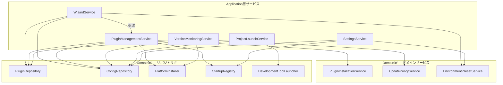

# アプリケーション層オブジェクト設計: aide-powers タスクトレイ管理アプリ

## 1. 設計方針

### 1.1 Application層の責務

Application層はユースケースの実現を担う。具体的には以下の責務を持つ:

- **ドメインオブジェクトの協調**: 複数のドメインオブジェクト・ドメインサービスを組み合わせてユースケースを実現する
- **トランザクション境界の管理**: 設定の読み込み・保存の一貫性を保証する
- **外部サービス呼び出しの調整**: リポジトリインターフェース経由でインフラ層の機能を利用する
- **エラーハンドリング**: ドメイン例外・インフラ例外をキャッチし、Application層の例外に変換する

### 1.2 禁止事項

| # | 禁止事項 | 理由 |
|---|---|---|
| 1 | ビジネスルールの実装 | ビジネスルール（バージョン比較、環境変数バリデーション、更新ポリシー判定等）はDomain層に委譲する |
| 2 | Infrastructure層の具体実装への直接依存 | `MinioPluginRepository` 等の具象クラスをimportしない。リポジトリインターフェース経由で利用する |
| 3 | UI固有のロジック | HTML生成、HTTPレスポンス構築等はPresentation層の責務 |
| 4 | 外部ライブラリの直接利用 | `minio`, `winreg`, `subprocess` 等はInfrastructure層で使用する |
| 5 | ドメインオブジェクトの不変条件の検証 | バリデーションはドメインオブジェクト自身が行う |

### 1.3 DI（依存性注入）方針

- すべてのサービスクラスはコンストラクタでリポジトリインターフェース（抽象）を受け取る
- 具体実装の注入はComposition Root（アプリケーション起動時）で行う
- テスト時はダミー実装（InMemory系、Dummy系）を注入する

### 1.4 ライフサイクル

Application層のサービスはすべてシングルトンとして生成し、アプリケーションの起動から終了まで同一インスタンスを使用する。リクエストスコープの管理は不要（デスクトップアプリのため）。

---

## 2. アプリケーション層例外クラス

### 2.1 ApplicationError（基底クラス）

| 項目 | 内容 |
|---|---|
| 役割 | アプリケーション層の全例外の基底クラス |
| 継承元 | `Exception`（Python標準） |
| 属性 | `message: str` — エラーメッセージ |

### 2.2 例外クラス一覧

| 例外クラス | 継承元 | 発生条件 | 使用箇所 |
|---|---|---|---|
| `StorageConnectionError` | `ApplicationError` | ストレージサーバーへの接続に失敗した | WizardService, PluginManagementService, VersionMonitoringService |
| `PluginDownloadError` | `ApplicationError` | プラグインパッケージのダウンロードに失敗した | PluginManagementService |
| `PluginInstallError` | `ApplicationError` | プラグインのインストール（ファイル配置）に失敗した | PluginManagementService |
| `PluginUninstallError` | `ApplicationError` | プラグインの削除に失敗した | PluginManagementService |
| `ConfigLoadError` | `ApplicationError` | 設定ファイルの読み込みに失敗した | SettingsService, WizardService |
| `ConfigSaveError` | `ApplicationError` | 設定ファイルの保存に失敗した | SettingsService, WizardService |
| `ToolNotFoundError` | `ApplicationError` | 開発ツールの実行ファイルが見つからない | ProjectLaunchService |
| `ProjectPathNotFoundError` | `ApplicationError` | 登録プロジェクトのフォルダが存在しない | ProjectLaunchService |
| `CertificateFileNotFoundError` | `ApplicationError` | 証明書ファイルが指定パスに存在しない | WizardService, SettingsService |
| `UpdateExecutionError` | `ApplicationError` | 更新実行中にエラーが発生した | VersionMonitoringService |
| `SetupNotCompletedError` | `ApplicationError` | 初期設定ウィザードが未完了の状態で操作が試行された | 各サービス共通 |

---

## 3. DTO（Data Transfer Object）定義

Application層とPresentation層の間でデータを受け渡すためのDTOを定義する。DTOは振る舞いを持たない純粋なデータコンテナである。

### 3.1 WizardStateDTO

| 項目 | 内容 |
|---|---|
| 役割 | ウィザードの現在の状態をPresentation層に伝達する |

| フィールド | 型 | 説明 |
|---|---|---|
| `current_step` | `int` | 現在のステップ番号（1〜6） |
| `selected_platforms` | `list[str]` | 選択済みプラットフォームの表示名リスト |
| `certificate_path` | `str \| None` | 設定済み証明書パス |
| `storage_endpoint` | `str \| None` | 設定済みストレージエンドポイント |
| `is_storage_connected` | `bool` | ストレージ接続テスト成功済みか |
| `is_certificate_valid` | `bool` | 証明書ファイルが存在するか |
| `setup_completed` | `bool` | セットアップ完了済みか |

### 3.2 InstallProgressDTO

| 項目 | 内容 |
|---|---|
| 役割 | インストール・更新の進捗状態をPresentation層に伝達する |

| フィールド | 型 | 説明 |
|---|---|---|
| `percentage` | `int` | 全体の進捗パーセンテージ（0〜100） |
| `total_steps` | `int` | 全ステップ数 |
| `completed_steps` | `int` | 完了済みステップ数 |
| `current_step_name` | `str \| None` | 現在実行中のステップ名 |
| `steps` | `list[InstallStepDTO]` | 各ステップの状態リスト |
| `is_completed` | `bool` | 全ステップ完了か |
| `has_error` | `bool` | エラーが発生しているか |
| `error_message` | `str \| None` | エラーメッセージ（エラー時のみ） |

### 3.3 InstallStepDTO

| 項目 | 内容 |
|---|---|
| 役割 | 個別のインストールステップの状態をPresentation層に伝達する |

| フィールド | 型 | 説明 |
|---|---|---|
| `name` | `str` | ステップ名（例: "プラグインのダウンロード"） |
| `status` | `str` | 状態（"pending" / "running" / "completed" / "failed"） |
| `error_message` | `str \| None` | 失敗時のエラーメッセージ |

### 3.4 PlatformStatusDTO

| 項目 | 内容 |
|---|---|
| 役割 | プラットフォームの状態をPresentation層に伝達する |

| フィールド | 型 | 説明 |
|---|---|---|
| `platform_name` | `str` | プラットフォーム表示名（例: "Claude Code"） |
| `platform_type` | `str` | プラットフォーム種別キー（例: "CLAUDE_CODE"） |
| `current_version` | `str \| None` | 現在のバージョン文字列 |
| `latest_version` | `str \| None` | 最新バージョン文字列 |
| `update_status` | `str` | 更新状態（"up_to_date" / "update_available" / "error" / "unknown"） |
| `has_update` | `bool` | 更新が利用可能か |

### 3.5 RegisteredProjectDTO

| 項目 | 内容 |
|---|---|
| 役割 | 登録プロジェクトの情報をPresentation層に伝達する |

| フィールド | 型 | 説明 |
|---|---|---|
| `path` | `str` | プロジェクトフォルダの絶対パス |
| `folder_name` | `str` | フォルダ名（表示用） |
| `last_used_at` | `str \| None` | 最終使用日時（ISO 8601形式文字列） |

### 3.6 EnvironmentVariableDTO

| 項目 | 内容 |
|---|---|
| 役割 | 環境変数のキー・値ペアをPresentation層に伝達する |

| フィールド | 型 | 説明 |
|---|---|---|
| `key` | `str` | 環境変数キー |
| `value` | `str` | 環境変数値 |

### 3.7 GeneralSettingsDTO

| 項目 | 内容 |
|---|---|
| 役割 | 全般設定の値をPresentation層に伝達する |

| フィールド | 型 | 説明 |
|---|---|---|
| `check_interval_minutes` | `int` | バージョンチェック間隔（分） |
| `auto_start` | `bool` | Windows起動時の自動起動ON/OFF |
| `default_tool` | `str` | デフォルト起動ツール名 |
| `certificate_path` | `str \| None` | CA証明書ファイルパス |
| `env_vars_enabled` | `bool` | 環境変数自動設定ON/OFF |
| `environment_variables` | `list[EnvironmentVariableDTO]` | 環境変数一覧 |
| `log_level` | `str` | ログレベル（"DEBUG" / "INFO" / "WARNING" / "ERROR"） |

---


## 4. サービスクラス詳細設計

### 4.1 WizardService（初期設定ウィザードサービス）

| 項目 | 内容 |
|---|---|
| 役割 | 初期設定ウィザード（WIZ-01〜WIZ-05）のフロー制御。ステップ遷移管理、各ステップの設定値永続化、インストール実行の調整を行う |
| 対応ユースケース | WIZ-01〜WIZ-05、UC-045（証明書設定） |
| ライフサイクル | シングルトン |

#### コンストラクタ

```python
def __init__(
    self,
    config_repo: ConfigRepository,
    plugin_repo: PluginRepository,
    plugin_management_service: PluginManagementService,
    environment_preset_service: EnvironmentPresetService,
) -> None
```

| 引数 | 型 | 説明 |
|---|---|---|
| `config_repo` | `ConfigRepository` | 設定リポジトリIF（証明書パス・ストレージ接続情報・プラットフォーム一覧の永続化） |
| `plugin_repo` | `PluginRepository` | プラグインリポジトリIF（ストレージ接続テスト） |
| `plugin_management_service` | `PluginManagementService` | プラグイン管理サービス（インストール実行の委譲先） |
| `environment_preset_service` | `EnvironmentPresetService` | 環境変数プリセットサービス（ドメインサービス。証明書パスからプリセット生成） |

#### パブリックメソッド

| メソッド | 引数 | 戻り値 | 概要 | Raises |
|---|---|---|---|---|
| `is_setup_completed()` | — | `bool` | 初期設定ウィザードが完了済みかを返す。config.jsonの`setup_completed`フラグを確認する | `ConfigLoadError`: 設定読み込み失敗時 |
| `get_wizard_state()` | — | `WizardStateDTO` | ウィザードの現在の状態（選択済みプラットフォーム、証明書パス、ストレージ接続状態等）を返す | `ConfigLoadError`: 設定読み込み失敗時 |
| `save_selected_platforms(platform_types)` | `platform_types: list[str]` | `None` | 選択されたプラットフォーム種別をconfig.jsonに保存する。WIZ-02の「次へ」で呼ばれる | `ConfigSaveError`: 設定保存失敗時 |
| `save_certificate_path(path)` | `path: str` | `None` | 証明書パスをバリデーション後にconfig.jsonに保存する。証明書パスに基づく環境変数プリセットも自動生成・保存する。WIZ-02Bの「次へ」で呼ばれる | `InvalidCertificatePathError`: パス形式不正時, `CertificateFileNotFoundError`: ファイル不在時, `ConfigSaveError`: 設定保存失敗時 |
| `save_storage_connection(endpoint, access_key, secret_key)` | `endpoint: str, access_key: str, secret_key: str` | `None` | ストレージ接続情報をバリデーション後にconfig.jsonに保存する。WIZ-03の「次へ」で呼ばれる | `InvalidStorageConnectionError`: 接続情報不正時, `ConfigSaveError`: 設定保存失敗時 |
| `test_storage_connection(endpoint, access_key, secret_key)` | `endpoint: str, access_key: str, secret_key: str` | `bool` | ストレージへの接続テストを実行する。WIZ-03の「接続テスト」で呼ばれる | `StorageConnectionError`: 接続失敗時 |
| `start_installation()` | — | `None` | 保存済みの設定に基づいてプラグインのインストールを開始する。WIZ-04の「インストール開始」で呼ばれる。PluginManagementServiceに委譲する | `StorageConnectionError`: ストレージ接続失敗時, `PluginDownloadError`: ダウンロード失敗時, `PluginInstallError`: インストール失敗時 |
| `get_install_progress()` | — | `InstallProgressDTO` | 現在のインストール進捗を返す。WIZ-04のポーリングで呼ばれる | — |
| `complete_setup()` | — | `None` | 初期設定の完了を記録する。config.jsonの`setup_completed`をtrueに設定する。WIZ-05表示時に呼ばれる | `ConfigSaveError`: 設定保存失敗時 |

#### 処理フロー: save_certificate_path

```
1. CertificatePath値オブジェクトを生成（パス形式・拡張子バリデーション）
2. ファイル存在チェック（ConfigRepository経由 — 注: ファイル存在チェックはInfra層の責務）
3. config_repo.save_certificate_path() で証明書パスを保存
4. environment_preset_service.create_preset() で環境変数プリセットを生成
5. config_repo.save_environment_variables() でプリセットを保存
```

#### 処理フロー: start_installation

```
1. config_repo から選択済みプラットフォーム一覧を読み込む
2. plugin_management_service.install_plugin() に委譲する
3. インストール進捗はplugin_management_serviceが内部で管理する
```

#### テスト観点

- `is_setup_completed`: 完了済み→True、未完了→False、設定ファイル不在→False
- `save_selected_platforms`: 正常保存、空リストの拒否（1つ以上必須）
- `save_certificate_path`: 正常保存 + プリセット自動生成、パス形式不正時のドメイン例外伝播、ファイル不在時のApplicationError変換
- `save_storage_connection`: 正常保存、接続情報不正時のドメイン例外伝播
- `test_storage_connection`: 接続成功→True、接続失敗→StorageConnectionError
- `start_installation`: PluginManagementServiceへの正しい委譲
- `complete_setup`: setup_completedフラグの設定

---

### 4.2 PluginManagementService（プラグイン管理サービス）

| 項目 | 内容 |
|---|---|
| 役割 | プラグインのインストール・削除・一覧取得。インストールステップの進捗管理を行う |
| 対応ユースケース | WIZ-04（インストール実行）、SETTINGS プラットフォーム管理（追加・削除） |
| ライフサイクル | シングルトン |

#### コンストラクタ

```python
def __init__(
    self,
    plugin_repo: PluginRepository,
    config_repo: ConfigRepository,
    platform_installer: PlatformInstaller,
    startup_registry: StartupRegistry,
    plugin_installation_service: PluginInstallationService,
) -> None
```

| 引数 | 型 | 説明 |
|---|---|---|
| `plugin_repo` | `PluginRepository` | プラグインリポジトリIF（パッケージダウンロード） |
| `config_repo` | `ConfigRepository` | 設定リポジトリIF（インストール済みプラットフォームの永続化） |
| `platform_installer` | `PlatformInstaller` | プラットフォームインストーラーIF（ファイル配置） |
| `startup_registry` | `StartupRegistry` | スタートアップレジストリIF（スタートアップ登録） |
| `plugin_installation_service` | `PluginInstallationService` | インストールフロー制御（ドメインサービス。ステップ生成・進捗計算・リトライ判定） |

#### パブリックメソッド

| メソッド | 引数 | 戻り値 | 概要 | Raises |
|---|---|---|---|---|
| `install_plugin(platform_types)` | `platform_types: list[PlatformType]` | `None` | 指定プラットフォームにプラグインをインストールする。ダウンロード→展開→各プラットフォームへの配置→スタートアップ登録の順で実行する | `StorageConnectionError`: ストレージ接続失敗時, `PluginDownloadError`: ダウンロード失敗時, `PluginInstallError`: インストール失敗時 |
| `uninstall_plugin(platform_type)` | `platform_type: PlatformType` | `None` | 指定プラットフォームからプラグインを削除する。SETTINGS画面の「削除」で呼ばれる | `PluginUninstallError`: 削除失敗時 |
| `add_platforms(platform_types)` | `platform_types: list[PlatformType]` | `None` | 追加のプラットフォームにプラグインをインストールする。SETTINGS画面の「追加」で呼ばれる。install_pluginと同じフローだがスタートアップ登録は省略する | `StorageConnectionError`, `PluginDownloadError`, `PluginInstallError` |
| `get_installed_platforms()` | — | `list[PlatformStatusDTO]` | インストール済みプラットフォームの一覧と状態を返す | `ConfigLoadError`: 設定読み込み失敗時 |
| `get_install_progress()` | — | `InstallProgressDTO` | 現在のインストール進捗を返す。進捗はドメインサービスのcalculate_progressで計算する | — |
| `retry_failed_step()` | — | `None` | 失敗したインストールステップをリトライする。WIZ-04の「リトライ」で呼ばれる。リトライ可否はドメインサービスのcan_retryで判定する | `PluginInstallError`: リトライ失敗時 |

#### 処理フロー: install_plugin

```
1. plugin_installation_service.create_install_steps() でステップ一覧を生成
2. ステップを順次実行:
   a. DOWNLOAD: plugin_repo.download_package() でパッケージをダウンロード
   b. EXTRACT: ダウンロードしたパッケージを展開（メモリ上で処理）
   c. DEPLOY: 各platform_typeに対して platform_installer.install() でファイル配置
   d. REGISTER_STARTUP: startup_registry.register() でスタートアップ登録
3. 各ステップの完了/失敗に応じてInstallStepの状態を遷移
4. config_repo.save_installed_platforms() でインストール結果を永続化
```

#### 処理フロー: uninstall_plugin

```
1. platform_installer.uninstall() でプラグインファイルを削除
2. config_repo.load_installed_platforms() で現在の一覧を取得
3. 対象プラットフォームを一覧から除外
4. config_repo.save_installed_platforms() で更新後の一覧を保存
5. インストール済みプラットフォームが0件になった場合、startup_registry.unregister() でスタートアップ登録を解除
```

#### テスト観点

- `install_plugin`: 全ステップの正常完了、各ステップでの失敗時のエラーハンドリング、進捗の正確な更新
- `uninstall_plugin`: 正常削除、最後のプラットフォーム削除時のスタートアップ解除
- `add_platforms`: 既存インストール済み環境への追加インストール
- `get_installed_platforms`: 正常取得、空一覧の場合
- `get_install_progress`: インストール中/完了/エラー各状態での進捗DTO
- `retry_failed_step`: リトライ可能→再実行、リトライ上限超過→エラー

---

### 4.3 VersionMonitoringService（バージョン監視サービス）

| 項目 | 内容 |
|---|---|
| 役割 | バージョンチェックの実行、更新有無の判定、更新実行の調整を行う。定期チェックのスケジューリングは行わない（Presentation層のタイマーが呼び出す） |
| 対応ユースケース | DASH 更新通知・更新実行、TRAY-MENU 更新確認・更新実行 |
| ライフサイクル | シングルトン |

#### コンストラクタ

```python
def __init__(
    self,
    plugin_repo: PluginRepository,
    config_repo: ConfigRepository,
    platform_installer: PlatformInstaller,
    update_policy_service: UpdatePolicyService,
) -> None
```

| 引数 | 型 | 説明 |
|---|---|---|
| `plugin_repo` | `PluginRepository` | プラグインリポジトリIF（最新バージョン取得・パッケージダウンロード） |
| `config_repo` | `ConfigRepository` | 設定リポジトリIF（インストール済みプラットフォームの読み書き） |
| `platform_installer` | `PlatformInstaller` | プラットフォームインストーラーIF（更新時のファイル配置） |
| `update_policy_service` | `UpdatePolicyService` | 更新ポリシーサービス（ドメインサービス。更新可否・更新優先度の判定） |

#### パブリックメソッド

| メソッド | 引数 | 戻り値 | 概要 | Raises |
|---|---|---|---|---|
| `check_for_updates()` | — | `list[PlatformStatusDTO]` | ストレージ上の最新バージョンを取得し、全インストール済みプラットフォームの更新状態を返す。TRAY-MENUの「更新を確認」およびDASHの「今すぐ確認」で呼ばれる | `StorageConnectionError`: ストレージ接続失敗時 |
| `has_any_update()` | — | `bool` | いずれかのプラットフォームに更新があるかを返す。タスクトレイアイコンのバッジ表示判定に使用する | `StorageConnectionError`: ストレージ接続失敗時 |
| `update_platform(platform_type)` | `platform_type: str` | `None` | 指定プラットフォームのプラグインを最新バージョンに更新する。DASHの個別「更新」ボタンで呼ばれる | `UpdateExecutionError`: 更新失敗時, `StorageConnectionError`: ストレージ接続失敗時 |
| `update_all_platforms()` | — | `None` | 更新可能な全プラットフォームを一括更新する。DASHの「すべて更新」ボタンで呼ばれる | `UpdateExecutionError`: 更新失敗時, `StorageConnectionError`: ストレージ接続失敗時 |
| `get_update_progress()` | — | `InstallProgressDTO` | 現在の更新進捗を返す。DASHのポーリングで呼ばれる | — |

#### 処理フロー: check_for_updates

```
1. plugin_repo.get_latest_version() でストレージ上の最新バージョンを取得
2. config_repo.load_installed_platforms() でインストール済みプラットフォーム一覧を取得
3. 各プラットフォームの latest_version を更新
4. config_repo.save_installed_platforms() で更新状態を永続化
5. 各プラットフォームの状態をPlatformStatusDTOに変換して返す
```

#### 処理フロー: update_platform

```
1. config_repo.load_installed_platforms() で対象プラットフォームを取得
2. update_policy_service.can_update() で更新可否を判定
3. 更新不可の場合は早期リターン（更新不要）
4. plugin_repo.download_package() で最新パッケージをダウンロード
5. platform_installer.install() でファイルを配置（上書き更新）
6. プラットフォームの current_version を更新
7. config_repo.save_installed_platforms() で更新結果を永続化
```

#### テスト観点

- `check_for_updates`: 最新バージョン取得→各プラットフォームの状態更新、ストレージ接続失敗時のエラー
- `has_any_update`: 更新あり→True、全て最新→False
- `update_platform`: 正常更新、更新不要時のスキップ、ダウンロード失敗時のエラー、インストール失敗時のエラー
- `update_all_platforms`: 複数プラットフォームの一括更新、一部失敗時の継続動作
- `get_update_progress`: 更新中/完了/エラー各状態での進捗DTO

---


### 4.4 ProjectLaunchService（プロジェクト起動サービス）

| 項目 | 内容 |
|---|---|
| 役割 | プロジェクトの登録・削除・一覧取得、および開発ツール起動の調整を行う。環境変数を設定した状態で開発ツールを子プロセスとして起動する |
| 対応ユースケース | UC-043（プロジェクトを登録して開発ツールで開く）、DASH 登録プロジェクト、TRAY-MENU プロジェクトを開く |
| ライフサイクル | シングルトン |

#### コンストラクタ

```python
def __init__(
    self,
    config_repo: ConfigRepository,
    tool_launcher: DevelopmentToolLauncher,
) -> None
```

| 引数 | 型 | 説明 |
|---|---|---|
| `config_repo` | `ConfigRepository` | 設定リポジトリIF（登録プロジェクト・環境変数の読み書き） |
| `tool_launcher` | `DevelopmentToolLauncher` | 開発ツールランチャーIF（環境変数付きで開発ツールを起動） |

#### パブリックメソッド

| メソッド | 引数 | 戻り値 | 概要 | Raises |
|---|---|---|---|---|
| `get_registered_projects()` | — | `list[RegisteredProjectDTO]` | 登録プロジェクトの一覧を返す。DASH・TRAY-MENUのプロジェクト一覧表示で呼ばれる | `ConfigLoadError`: 設定読み込み失敗時 |
| `register_project(path)` | `path: str` | `RegisteredProjectDTO` | 新しいプロジェクトを登録する。TRAY-MENUの「プロジェクトを追加...」およびDASHの「+ プロジェクトを追加」で呼ばれる | `InvalidProjectPathError`: パスが空の場合, `ProjectPathNotFoundError`: フォルダが存在しない場合, `ConfigSaveError`: 設定保存失敗時 |
| `unregister_project(path)` | `path: str` | `None` | プロジェクトの登録を解除する（プロジェクトファイル自体は削除しない）。DASHの「削除」ボタンで呼ばれる | `ConfigSaveError`: 設定保存失敗時 |
| `launch_project(path)` | `path: str` | `None` | 登録済みプロジェクトを開発ツールで開く。環境変数を設定した子プロセスとしてツールを起動し、最終使用日時を更新する | `ProjectPathNotFoundError`: フォルダが存在しない場合, `ToolNotFoundError`: 開発ツールが見つからない場合, `ConfigLoadError`: 設定読み込み失敗時 |
| `is_tool_available()` | — | `bool` | デフォルト起動ツールが利用可能かを返す | — |

#### 処理フロー: register_project

```
1. RegisteredProject エンティティを生成（パスのバリデーションはドメイン層で実行）
2. フォルダ存在チェック（Infrastructure層経由）
3. config_repo.load_registered_projects() で現在の一覧を取得
4. 重複チェック（同一パスが既に登録されていないか）
5. 一覧に追加
6. config_repo.save_registered_projects() で保存
7. RegisteredProjectDTO に変換して返す
```

#### 処理フロー: launch_project

```
1. config_repo.load_registered_projects() から対象プロジェクトを取得
2. フォルダ存在チェック
3. tool_launcher.is_tool_available() で開発ツールの存在を確認
4. config_repo.load_environment_variables() で環境変数一覧を取得
5. EnvironmentVariableCollection.to_dict() でdict形式に変換
6. tool_launcher.launch(project_path, env_vars) で開発ツールを起動
7. RegisteredProject.record_usage(現在日時) で最終使用日時を更新
8. config_repo.save_registered_projects() で更新を永続化
```

#### テスト観点

- `get_registered_projects`: 正常取得、空一覧の場合
- `register_project`: 正常登録、パス空→InvalidProjectPathError、フォルダ不在→ProjectPathNotFoundError、重複登録の防止
- `unregister_project`: 正常解除、存在しないパスの解除（エラーにならない）
- `launch_project`: 正常起動（環境変数設定 + ツール起動 + 最終使用日時更新）、フォルダ不在→ProjectPathNotFoundError、ツール不在→ToolNotFoundError
- `is_tool_available`: ツールあり→True、ツールなし→False

---

### 4.5 SettingsService（設定管理サービス）

| 項目 | 内容 |
|---|---|
| 役割 | 設定値の読み込み・保存の調整。環境変数管理、証明書パス管理、一般設定（チェック間隔・スタートアップ・デフォルトツール・ログレベル）を扱う |
| 対応ユースケース | UC-044（環境変数カスタマイズ）、SETTINGS 全般タブ、SETTINGS ストレージタブ |
| ライフサイクル | シングルトン |

#### コンストラクタ

```python
def __init__(
    self,
    config_repo: ConfigRepository,
    startup_registry: StartupRegistry,
    environment_preset_service: EnvironmentPresetService,
) -> None
```

| 引数 | 型 | 説明 |
|---|---|---|
| `config_repo` | `ConfigRepository` | 設定リポジトリIF（全設定値の読み書き） |
| `startup_registry` | `StartupRegistry` | スタートアップレジストリIF（スタートアップ登録/解除） |
| `environment_preset_service` | `EnvironmentPresetService` | 環境変数プリセットサービス（ドメインサービス。プリセットリセット時に使用） |

#### パブリックメソッド

| メソッド | 引数 | 戻り値 | 概要 | Raises |
|---|---|---|---|---|
| `get_general_settings()` | — | `GeneralSettingsDTO` | 全般設定の現在値を返す。SETTINGS全般タブの表示で呼ばれる | `ConfigLoadError`: 設定読み込み失敗時 |
| `save_general_settings(settings)` | `settings: GeneralSettingsDTO` | `None` | 全般設定を保存する。SETTINGS全般タブの「保存」で呼ばれる。スタートアップ設定変更時はレジストリも即時更新する | `ConfigSaveError`: 設定保存失敗時 |
| `get_environment_variables()` | — | `list[EnvironmentVariableDTO]` | 環境変数一覧を返す | `ConfigLoadError`: 設定読み込み失敗時 |
| `save_environment_variables(variables)` | `variables: list[EnvironmentVariableDTO]` | `None` | 環境変数一覧を保存する。ドメイン層のバリデーション（キー空チェック・重複チェック）を経由する | `InvalidEnvironmentVariableError`: キー不正時, `DuplicateEnvironmentVariableError`: キー重複時, `ConfigSaveError`: 設定保存失敗時 |
| `reset_environment_preset()` | — | `None` | 環境変数をデフォルトのプリセットにリセットする。SETTINGS全般タブの「プリセットに戻す」で呼ばれる | `ConfigLoadError`: 証明書パス読み込み失敗時, `ConfigSaveError`: 設定保存失敗時 |
| `save_certificate_path(path)` | `path: str` | `None` | 証明書パスを保存し、関連する環境変数の値を自動更新する。SETTINGS全般タブの証明書パス変更で呼ばれる | `InvalidCertificatePathError`: パス形式不正時, `ConfigSaveError`: 設定保存失敗時 |
| `save_storage_connection(endpoint, access_key, secret_key)` | `endpoint: str, access_key: str, secret_key: str` | `None` | ストレージ接続情報を保存する。SETTINGSストレージタブの「保存」で呼ばれる | `InvalidStorageConnectionError`: 接続情報不正時, `ConfigSaveError`: 設定保存失敗時 |
| `test_storage_connection(endpoint, access_key, secret_key)` | `endpoint: str, access_key: str, secret_key: str` | `bool` | ストレージ接続テストを実行する。SETTINGSストレージタブの「接続テスト」で呼ばれる | `StorageConnectionError`: 接続失敗時 |
| `get_storage_connection()` | — | `dict[str, str] \| None` | 現在のストレージ接続情報を返す（シークレットキーはマスク表示用に部分的に返す）。SETTINGSストレージタブの表示で呼ばれる | `ConfigLoadError`: 設定読み込み失敗時 |

#### 処理フロー: save_general_settings

```
1. 設定値をconfig_repoに保存
2. スタートアップ設定が変更された場合:
   a. auto_start=True → startup_registry.register()
   b. auto_start=False → startup_registry.unregister()
3. チェック間隔が変更された場合:
   a. 新しい間隔値を保存（タイマーリセットはPresentation層が行う）
```

#### 処理フロー: save_environment_variables

```
1. 各EnvironmentVariableDTOからEnvironmentVariable値オブジェクトを生成（キーバリデーション）
2. EnvironmentVariableCollectionを生成（重複チェック）
3. config_repo.save_environment_variables() で保存
```

#### 処理フロー: reset_environment_preset

```
1. config_repo.load_certificate_path() で現在の証明書パスを取得
2. 証明書パスが設定されていない場合はエラー
3. environment_preset_service.create_preset() でデフォルトプリセットを生成
4. config_repo.save_environment_variables() でプリセットを保存
```

#### 処理フロー: save_certificate_path

```
1. CertificatePath値オブジェクトを生成（パス形式・拡張子バリデーション）
2. config_repo.save_certificate_path() で証明書パスを保存
3. config_repo.load_environment_variables() で現在の環境変数を取得
4. 証明書パス関連の環境変数（NODE_EXTRA_CA_CERTS, REQUESTS_CA_BUNDLE等）の値を新しいパスで更新
5. SSL_CERT_DIR を新しいパスの親ディレクトリで更新
6. config_repo.save_environment_variables() で更新後の環境変数を保存
```

#### テスト観点

- `get_general_settings`: 正常取得、デフォルト値の確認
- `save_general_settings`: 正常保存、スタートアップON→register呼び出し、スタートアップOFF→unregister呼び出し
- `get_environment_variables`: 正常取得、空一覧の場合
- `save_environment_variables`: 正常保存、キー空→InvalidEnvironmentVariableError、キー重複→DuplicateEnvironmentVariableError
- `reset_environment_preset`: 証明書パスありでのプリセットリセット、証明書パスなしでのエラー
- `save_certificate_path`: 正常保存 + 関連環境変数の自動更新、パス形式不正時のエラー
- `save_storage_connection`: 正常保存、接続情報不正時のエラー
- `test_storage_connection`: 接続成功→True、接続失敗→StorageConnectionError
- `get_storage_connection`: 正常取得、未設定時→None

---

## 5. サービス間の依存関係

### 5.1 依存関係図



### 5.2 依存関係マトリクス

| サービス | PluginRepository | ConfigRepository | PlatformInstaller | StartupRegistry | DevelopmentToolLauncher | PluginInstallationService | UpdatePolicyService | EnvironmentPresetService | PluginManagementService |
|---|---|---|---|---|---|---|---|---|---|
| WizardService | ✅ | ✅ | — | — | — | — | — | ✅ | ✅（サービス間依存） |
| PluginManagementService | ✅ | ✅ | ✅ | ✅ | — | ✅ | — | — | — |
| VersionMonitoringService | ✅ | ✅ | ✅ | — | — | — | ✅ | — | — |
| ProjectLaunchService | — | ✅ | — | — | ✅ | — | — | — | — |
| SettingsService | — | ✅ | — | ✅ | — | — | — | ✅ | — |

### 5.3 サービス間依存の説明

- **WizardService → PluginManagementService**: ウィザードのインストール実行をPluginManagementServiceに委譲する。WizardServiceはインストールの詳細を知らず、PluginManagementServiceのパブリックメソッドのみを呼び出す
- 上記以外のサービス間の直接依存は存在しない。各サービスはリポジトリIF・ドメインサービスを通じて間接的に連携する

### 5.4 Composition Root での組み立て順序

```python
# 1. ドメインサービスの生成（依存なし）
plugin_installation_service = PluginInstallationService()
update_policy_service = UpdatePolicyService()
environment_preset_service = EnvironmentPresetService()

# 2. リポジトリ具象実装の生成（Infrastructure層）
plugin_repo = MinioPluginRepository(endpoint, access_key, secret_key)
config_repo = FileSystemConfigRepository(config_path)
platform_installer = FileSystemPlatformInstaller()
startup_registry = WindowsRegistryAdapter()
tool_launcher = ProcessLauncher(default_tool_path)

# 3. Application層サービスの生成（依存注入）
plugin_management_service = PluginManagementService(
    plugin_repo, config_repo, platform_installer,
    startup_registry, plugin_installation_service,
)
wizard_service = WizardService(
    config_repo, plugin_repo,
    plugin_management_service, environment_preset_service,
)
version_monitoring_service = VersionMonitoringService(
    plugin_repo, config_repo, platform_installer,
    update_policy_service,
)
project_launch_service = ProjectLaunchService(
    config_repo, tool_launcher,
)
settings_service = SettingsService(
    config_repo, startup_registry, environment_preset_service,
)
```

---

## 6. Application層のインフラ浸食防止チェックリスト

| # | チェック項目 | 状態 | 備考 |
|---|---|---|---|
| 1 | Application層に外部ライブラリ（minio, winreg, subprocess等）のimportがないこと | ✅ | リポジトリIF経由でInfrastructure層に委譲 |
| 2 | Application層がInfrastructure層の具象クラス（MinioPluginRepository等）を直接参照していないこと | ✅ | コンストラクタでインターフェースを受け取る |
| 3 | ビジネスルール（バージョン比較、環境変数バリデーション、更新ポリシー判定等）がApplication層に実装されていないこと | ✅ | Domain層のエンティティ・値オブジェクト・ドメインサービスに委譲 |
| 4 | Application層のサービスがコンストラクタインジェクションでDI対応していること | ✅ | 全サービスがコンストラクタでインターフェースを受け取る |
| 5 | DTOがドメインオブジェクトの内部構造を漏洩していないこと | ✅ | DTOはプリミティブ型・文字列で構成。ドメインオブジェクトの型を直接公開しない |
| 6 | Application層にUI固有のロジック（HTML生成、HTTPレスポンス構築等）がないこと | ✅ | Presentation層の責務 |
| 7 | Application層の例外がドメイン例外・インフラ例外と分離されていること | ✅ | ApplicationError基底クラスで独立した例外階層を定義 |
| 8 | テスト時にダミー実装（InMemory系、Dummy系）を注入してテスト可能な構造であること | ✅ | コンストラクタインジェクションにより差し替え可能 |
| 9 | 技術的命名（~Data, ~Manager, ~Flag, ~Helper）がApplication層に存在しないこと | ✅ | ユビキタス言語辞書に準拠した命名 |
| 10 | サービスクラスの変更理由が1つに限定されていること（単一責任原則） | ✅ | 各サービスが1つのユースケース群に対応 |

---

*本文書はユーザー要件定義書（user-requirements.md）、GUI設計書（gui-design.md）、レイヤードアーキテクチャ設計書（layered-architecture.md）、ドメイン層オブジェクト設計書（object-design-domain.md）、ユースケース分析（usecase-tray-app.md）、ユビキタス言語辞書（ubiquitous-language.md）に基づき作成されたアプリケーション層オブジェクト設計書です。*