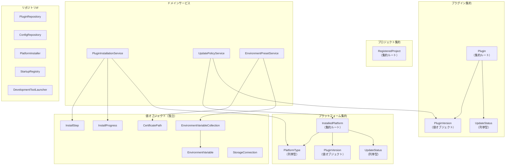

# ドメイン層オブジェクト設計: aide-powers タスクトレイ管理アプリ

## 1. 設計方針

### 1.1 DDDパターンの適用

layered-architecture.md §4.3 で定義されたドメイン層コンポーネントに対し、DDDの戦術的パターンを適用する。

- **エンティティ**: 同一性（ID）を持ち、ライフサイクルを通じて追跡されるオブジェクト
- **値オブジェクト**: 不変、属性の組み合わせで等価性が決まるオブジェクト。ドメイン概念を型で表現する
- **集約**: 整合性の境界。集約ルートを通じてのみ内部オブジェクトにアクセスする
- **ドメインサービス**: 単一のエンティティ・値オブジェクトに属さないビジネスロジック
- **リポジトリインターフェース**: ドメイン層に定義し、永続化を抽象化する

### 1.2 テスタビリティ

ドメイン層のすべてのパブリックメソッドは、モックやスタブを一切使わずにテスト可能な純粋ロジックとして設計する。外部依存（現在時刻、ファイルI/O、ネットワーク等）はドメイン層に直接含めず、引数やインターフェース経由で外部から注入する。

### 1.3 ドメインモデル貧血症の防止

エンティティ・値オブジェクトは単なるデータの入れ物にしない。ビジネスルール（バリデーション、比較、状態遷移判定等）をドメインオブジェクト自身に持たせる。

---

## 2. ドメイン例外クラス

ドメイン層固有の例外を定義する。すべてのドメイン例外は共通基底クラスを継承する。

### 2.1 DomainError（基底クラス）

| 項目 | 内容 |
|---|---|
| 役割 | ドメイン層の全例外の基底クラス |
| 継承元 | `Exception`（Python標準） |
| 属性 | `message: str` — エラーメッセージ |

### 2.2 例外クラス一覧

| 例外クラス | 継承元 | 発生条件 | 使用箇所 |
|---|---|---|---|
| `InvalidVersionError` | `DomainError` | バージョン文字列がセマンティックバージョニング形式でない | PluginVersion |
| `InvalidEnvironmentVariableError` | `DomainError` | 環境変数キーが空、または不正な形式 | EnvironmentVariable |
| `DuplicateEnvironmentVariableError` | `DomainError` | 環境変数キーが重複している | EnvironmentVariableCollection |
| `InvalidCertificatePathError` | `DomainError` | 証明書パスが空、または拡張子が.pemでない | CertificatePath |
| `InvalidStorageConnectionError` | `DomainError` | ストレージ接続情報が不正（エンドポイントがURL形式でない等） | StorageConnection |
| `InvalidProjectPathError` | `DomainError` | プロジェクトパスが空 | RegisteredProject |
| `InstallStepTransitionError` | `DomainError` | インストールステップの不正な状態遷移 | InstallStep |
| `PluginNotInstalledError` | `DomainError` | プラグインが未インストールの状態で更新を試行 | Plugin |

---

## 3. 値オブジェクト

### 3.1 PluginVersion（プラグインバージョン）

| 項目 | 内容 |
|---|---|
| 役割 | セマンティックバージョニング（major.minor.patch）に基づくバージョン表現。比較演算を提供する |
| 不変条件 | major, minor, patch はすべて0以上の整数。生成後に変更不可 |
| 等価性 | major, minor, patch の3属性がすべて一致する場合に等価 |

#### パブリックプロパティ

| プロパティ | 型 | 読み取り専用 | 説明 |
|---|---|---|---|
| `major` | `int` | はい | メジャーバージョン |
| `minor` | `int` | はい | マイナーバージョン |
| `patch` | `int` | はい | パッチバージョン |

#### パブリックメソッド

| メソッド | 引数 | 戻り値 | 概要 | Raises |
|---|---|---|---|---|
| `from_string(version_str)` | `version_str: str` | `PluginVersion` | バージョン文字列（例: "1.2.3"）をパースしてインスタンスを生成するクラスメソッド | `InvalidVersionError`: 形式不正時 |
| `is_newer_than(other)` | `other: PluginVersion` | `bool` | selfがotherより新しいバージョンかを判定する | — |
| `is_same_as(other)` | `other: PluginVersion` | `bool` | selfとotherが同一バージョンかを判定する | — |
| `is_compatible_with(other)` | `other: PluginVersion` | `bool` | メジャーバージョンが同一（後方互換性あり）かを判定する | — |
| `__str__()` | — | `str` | "major.minor.patch" 形式の文字列を返す | — |
| `__eq__(other)` | `other: object` | `bool` | 等価性比較 | — |
| `__lt__(other)` | `other: PluginVersion` | `bool` | 順序比較（ソート可能にする） | — |
| `__hash__()` | — | `int` | ハッシュ値（dictのキーやsetの要素として使用可能にする） | — |

#### バリデーションロジック

- バージョン文字列は `^\d+\.\d+\.\d+$` の正規表現に一致すること
- major, minor, patch はそれぞれ0以上の整数であること
- 先頭の "v" プレフィックス（例: "v1.2.3"）は許容し、自動的に除去する

#### テスト観点

- 正常なバージョン文字列のパース（"1.0.0", "0.1.0", "10.20.30"）
- "v" プレフィックス付きのパース（"v1.2.3" → 1.2.3）
- 不正な文字列の拒否（"1.2", "abc", "", "1.2.3.4", "-1.0.0"）
- バージョン比較（1.2.3 > 1.2.2, 1.3.0 > 1.2.9, 2.0.0 > 1.9.9）
- 等価性（1.2.3 == 1.2.3, 1.2.3 != 1.2.4）
- 互換性判定（1.2.3 と 1.3.0 は互換、1.2.3 と 2.0.0 は非互換）
- ハッシュ値の一貫性（等価なオブジェクトは同一ハッシュ）

---

### 3.2 EnvironmentVariable（環境変数）

| 項目 | 内容 |
|---|---|
| 役割 | 開発ツール起動時に子プロセスに設定する環境変数のキー・値ペア。キーのバリデーションを内包する |
| 不変条件 | キーは空でない。キーは英数字・アンダースコアのみ（`^[A-Za-z_][A-Za-z0-9_]*$`）。生成後に変更不可 |
| 等価性 | key と value の両方が一致する場合に等価 |

#### パブリックプロパティ

| プロパティ | 型 | 読み取り専用 | 説明 |
|---|---|---|---|
| `key` | `str` | はい | 環境変数キー（例: NODE_EXTRA_CA_CERTS） |
| `value` | `str` | はい | 環境変数値（例: C:\cert\cert.pem） |

#### パブリックメソッド

| メソッド | 引数 | 戻り値 | 概要 | Raises |
|---|---|---|---|---|
| `__init__(key, value)` | `key: str, value: str` | — | キーのバリデーションを行いインスタンスを生成する | `InvalidEnvironmentVariableError`: キーが空または不正形式 |
| `with_value(new_value)` | `new_value: str` | `EnvironmentVariable` | 値を変更した新しいインスタンスを返す（不変性を維持） | — |
| `__eq__(other)` | `other: object` | `bool` | 等価性比較 | — |
| `__hash__()` | — | `int` | ハッシュ値 | — |

#### テスト観点

- 正常なキーでの生成（"NODE_EXTRA_CA_CERTS", "SSL_CERT_FILE", "_PRIVATE"）
- 不正なキーの拒否（"", "123start", "key-with-dash", "key with space"）
- 値の変更（with_value）で新しいインスタンスが返ること（元のインスタンスは不変）
- 等価性（同一key+valueは等価、keyが異なれば非等価）

---

### 3.3 EnvironmentVariableCollection（環境変数コレクション）

| 項目 | 内容 |
|---|---|
| 役割 | 環境変数の集合を管理する値オブジェクト。キーの重複禁止ルールを保証する |
| 不変条件 | コレクション内にキーの重複がないこと。生成後に変更不可 |
| 等価性 | 含まれる環境変数の集合が一致する場合に等価 |

#### パブリックメソッド

| メソッド | 引数 | 戻り値 | 概要 | Raises |
|---|---|---|---|---|
| `__init__(variables)` | `variables: Sequence[EnvironmentVariable]` | — | 重複チェックを行いインスタンスを生成する | `DuplicateEnvironmentVariableError`: キー重複時 |
| `add(variable)` | `variable: EnvironmentVariable` | `EnvironmentVariableCollection` | 環境変数を追加した新しいコレクションを返す | `DuplicateEnvironmentVariableError`: キー重複時 |
| `remove(key)` | `key: str` | `EnvironmentVariableCollection` | 指定キーの環境変数を除いた新しいコレクションを返す | — |
| `update(variable)` | `variable: EnvironmentVariable` | `EnvironmentVariableCollection` | 指定キーの環境変数を更新した新しいコレクションを返す。キーが存在しない場合は追加する | — |
| `find_by_key(key)` | `key: str` | `EnvironmentVariable \| None` | 指定キーの環境変数を検索する | — |
| `contains_key(key)` | `key: str` | `bool` | 指定キーが存在するかを判定する | — |
| `to_dict()` | — | `dict[str, str]` | 環境変数をdict形式（{key: value}）で返す。子プロセス起動時に使用する | — |
| `count` | — | `int`（プロパティ） | 環境変数の数を返す | — |
| `__iter__()` | — | `Iterator[EnvironmentVariable]` | イテレーション対応 | — |

#### テスト観点

- 重複なしでの正常生成
- 重複キーでの生成拒否（DuplicateEnvironmentVariableError）
- add で重複キーを追加した場合の拒否
- remove で存在しないキーを指定した場合（エラーにならず元のコレクションを返す）
- update で既存キーの値を変更
- update で新規キーを追加
- to_dict の正確性
- 不変性の確認（操作後に元のコレクションが変更されていないこと）

---

### 3.4 CertificatePath（証明書パス）

| 項目 | 内容 |
|---|---|
| 役割 | 社内プロキシ対応のCA証明書ファイルパスの表現。パス形式検証・拡張子検証を内包する |
| 不変条件 | パスが空でない。拡張子が `.pem` である。生成後に変更不可 |
| 等価性 | パス文字列が一致する場合に等価 |

#### パブリックプロパティ

| プロパティ | 型 | 読み取り専用 | 説明 |
|---|---|---|---|
| `path` | `str` | はい | 証明書ファイルの絶対パス |
| `directory` | `str` | はい | 証明書ファイルの親ディレクトリパス（SSL_CERT_DIR用） |

#### パブリックメソッド

| メソッド | 引数 | 戻り値 | 概要 | Raises |
|---|---|---|---|---|
| `__init__(path)` | `path: str` | — | パスのバリデーション（空チェック・拡張子チェック）を行いインスタンスを生成する | `InvalidCertificatePathError`: パスが空または拡張子不正 |
| `__eq__(other)` | `other: object` | `bool` | 等価性比較 | — |
| `__hash__()` | — | `int` | ハッシュ値 | — |
| `__str__()` | — | `str` | パス文字列を返す | — |

#### テスト観点

- 正常なパスでの生成（"C:\\cert\\cert.pem", "/etc/ssl/cert.pem"）
- 空パスの拒否
- 不正な拡張子の拒否（".crt", ".cer", ".key", 拡張子なし）
- directory プロパティの正確性（"C:\\cert\\cert.pem" → "C:\\cert"）
- 等価性（同一パスは等価、異なるパスは非等価）

---

### 3.5 StorageConnection（ストレージ接続情報）

| 項目 | 内容 |
|---|---|
| 役割 | MinIOストレージへの接続情報（エンドポイント・アクセスキー・シークレットキー）の表現。URL形式検証を内包する |
| 不変条件 | エンドポイントが空でなくURL形式であること。アクセスキー・シークレットキーが空でないこと。生成後に変更不可 |
| 等価性 | endpoint, access_key, secret_key の3属性がすべて一致する場合に等価 |

#### パブリックプロパティ

| プロパティ | 型 | 読み取り専用 | 説明 |
|---|---|---|---|
| `endpoint` | `str` | はい | ストレージサーバーのURL（例: https://minio.example.com） |
| `access_key` | `str` | はい | アクセスキー |
| `secret_key` | `str` | はい | シークレットキー |

#### パブリックメソッド

| メソッド | 引数 | 戻り値 | 概要 | Raises |
|---|---|---|---|---|
| `__init__(endpoint, access_key, secret_key)` | `endpoint: str, access_key: str, secret_key: str` | — | 各フィールドのバリデーションを行いインスタンスを生成する | `InvalidStorageConnectionError`: バリデーション失敗時 |
| `__eq__(other)` | `other: object` | `bool` | 等価性比較 | — |
| `__hash__()` | — | `int` | ハッシュ値 | — |

#### バリデーションロジック

- エンドポイントは `http://` または `https://` で始まるURL形式であること
- アクセスキーは空でないこと
- シークレットキーは空でないこと

#### テスト観点

- 正常な接続情報での生成
- エンドポイントが空の場合の拒否
- エンドポイントがURL形式でない場合の拒否（"not-a-url", "ftp://..."）
- アクセスキーが空の場合の拒否
- シークレットキーが空の場合の拒否
- 等価性の確認

---

### 3.6 PlatformType（プラットフォーム種別）

| 項目 | 内容 |
|---|---|
| 役割 | 対応する8プラットフォームの列挙型 |
| 不変条件 | 定義済みの8種のいずれかであること |

#### 列挙値

| 値 | 表示名 | 備考 |
|---|---|---|
| `CLAUDE_CODE` | Claude Code | メインターゲット |
| `CODEX_CLI` | Codex CLI | — |
| `KIRO` | Kiro | — |
| `CURSOR` | Cursor | — |
| `OPENCODE` | OpenCode | — |
| `GEMINI_CLI` | Gemini CLI | — |
| `COPILOT_CLI` | Copilot CLI | — |
| `VSCODE_COPILOT` | VSCode GitHub Copilot | — |

#### パブリックプロパティ

| プロパティ | 型 | 読み取り専用 | 説明 |
|---|---|---|---|
| `display_name` | `str` | はい | ユーザー向け表示名 |

#### テスト観点

- 全8種の列挙値が定義されていること
- display_name が正しいこと

---

### 3.7 UpdateStatus（更新状態）

| 項目 | 内容 |
|---|---|
| 役割 | プラットフォームの更新状態を表す列挙型 |

#### 列挙値

| 値 | 意味 |
|---|---|
| `UP_TO_DATE` | 最新（更新不要） |
| `UPDATE_AVAILABLE` | 更新あり |
| `ERROR` | エラー（バージョンチェック失敗等） |
| `UNKNOWN` | 未チェック |

#### テスト観点

- 全4種の列挙値が定義されていること

---

### 3.8 InstallStepStatus（インストールステップ状態）

| 項目 | 内容 |
|---|---|
| 役割 | インストールステップの状態を表す列挙型 |

#### 列挙値

| 値 | 意味 |
|---|---|
| `PENDING` | 未着手 |
| `RUNNING` | 実行中 |
| `COMPLETED` | 完了 |
| `FAILED` | 失敗 |

---

### 3.9 InstallStepType（インストールステップ種別）

| 項目 | 内容 |
|---|---|
| 役割 | インストールの各工程を表す列挙型 |

#### 列挙値

| 値 | 表示名 | 順序 |
|---|---|---|
| `DOWNLOAD` | プラグインのダウンロード | 1 |
| `EXTRACT` | プラグインの展開 | 2 |
| `DEPLOY` | プラットフォームへのインストール | 3 |
| `REGISTER_STARTUP` | スタートアップ登録 | 4 |

---

## 4. エンティティ

### 4.1 Plugin（プラグイン）

| 項目 | 内容 |
|---|---|
| 役割 | aide-powersプラグイン本体を表すエンティティ。名前・バージョン・インストール状態を保持し、バージョン更新判定の振る舞いを持つ |
| 同一性 | `name: str`（プラグイン名）で識別する |
| 不変条件 | name は空でない。installed_version が設定されている場合、latest_version は installed_version 以上である |

#### パブリックプロパティ

| プロパティ | 型 | 読み取り専用 | 説明 |
|---|---|---|---|
| `name` | `str` | はい | プラグイン名（例: "aide-powers"） |
| `installed_version` | `PluginVersion \| None` | いいえ | インストール済みバージョン。未インストール時はNone |
| `latest_version` | `PluginVersion \| None` | いいえ | ストレージ上の最新バージョン。未チェック時はNone |

#### パブリックメソッド

| メソッド | 引数 | 戻り値 | 概要 | Raises |
|---|---|---|---|---|
| `__init__(name)` | `name: str` | — | プラグイン名を指定してインスタンスを生成する | `ValueError`: name が空の場合 |
| `is_installed()` | — | `bool` | プラグインがインストール済みかを判定する | — |
| `has_update()` | — | `bool` | 新しいバージョンが利用可能かを判定する。installed_version と latest_version を比較する | — |
| `update_installed_version(version)` | `version: PluginVersion` | — | インストール済みバージョンを更新する | — |
| `update_latest_version(version)` | `version: PluginVersion` | — | 最新バージョン情報を更新する | — |
| `get_update_status()` | — | `UpdateStatus` | 現在の更新状態を返す。latest_version未設定→UNKNOWN、同一→UP_TO_DATE、新しい→UPDATE_AVAILABLE | — |

#### テスト観点

- 未インストール状態での is_installed() → False
- インストール済み状態での is_installed() → True
- 同一バージョンでの has_update() → False
- 新バージョンありでの has_update() → True
- latest_version 未設定での has_update() → False
- get_update_status の各状態遷移

---

### 4.2 InstalledPlatform（インストール済みプラットフォーム）

| 項目 | 内容 |
|---|---|
| 役割 | aide-powersがインストールされたプラットフォームを表すエンティティ。プラットフォーム種別・現在バージョン・最新バージョン・更新状態を保持する |
| 同一性 | `platform_type: PlatformType` で識別する |
| 不変条件 | platform_type は PlatformType の有効な値であること |

#### パブリックプロパティ

| プロパティ | 型 | 読み取り専用 | 説明 |
|---|---|---|---|
| `platform_type` | `PlatformType` | はい | プラットフォーム種別 |
| `current_version` | `PluginVersion \| None` | いいえ | 現在インストールされているバージョン |
| `latest_version` | `PluginVersion \| None` | いいえ | 利用可能な最新バージョン |

#### パブリックメソッド

| メソッド | 引数 | 戻り値 | 概要 | Raises |
|---|---|---|---|---|
| `__init__(platform_type, current_version)` | `platform_type: PlatformType, current_version: PluginVersion \| None` | — | インスタンスを生成する | — |
| `get_display_name()` | — | `str` | プラットフォームの表示名を返す | — |
| `has_update()` | — | `bool` | 更新が利用可能かを判定する | — |
| `get_update_status()` | — | `UpdateStatus` | 現在の更新状態を返す | — |
| `update_current_version(version)` | `version: PluginVersion` | — | 現在バージョンを更新する（更新実行後に呼ばれる） | — |
| `update_latest_version(version)` | `version: PluginVersion` | — | 最新バージョン情報を更新する（バージョンチェック後に呼ばれる） | — |

#### テスト観点

- 各プラットフォーム種別での生成
- has_update の判定（同一バージョン→False、新バージョン→True、未チェック→False）
- get_update_status の各状態
- バージョン更新後の状態変化

---

### 4.3 RegisteredProject（登録プロジェクト）

| 項目 | 内容 |
|---|---|
| 役割 | ユーザーが登録したワークスペースフォルダを表すエンティティ。パス・最終使用日時を保持し、開発ツール起動の対象となる |
| 同一性 | `path: str`（プロジェクトフォルダの絶対パス）で識別する |
| 不変条件 | path は空でない |

#### パブリックプロパティ

| プロパティ | 型 | 読み取り専用 | 説明 |
|---|---|---|---|
| `path` | `str` | はい | プロジェクトフォルダの絶対パス |
| `last_used_at` | `datetime \| None` | いいえ | 最後に開発ツールを起動した日時。未使用時はNone |

#### パブリックメソッド

| メソッド | 引数 | 戻り値 | 概要 | Raises |
|---|---|---|---|---|
| `__init__(path)` | `path: str` | — | プロジェクトパスを指定してインスタンスを生成する | `InvalidProjectPathError`: path が空の場合 |
| `record_usage(used_at)` | `used_at: datetime` | — | 最終使用日時を更新する。開発ツール起動時に呼ばれる | — |
| `get_folder_name()` | — | `str` | パスの末尾フォルダ名を返す（表示用） | — |
| `__eq__(other)` | `other: object` | `bool` | パスが一致する場合に等価 | — |
| `__hash__()` | — | `int` | ハッシュ値 | — |

#### テスト観点

- 正常なパスでの生成
- 空パスでの生成拒否（InvalidProjectPathError）
- record_usage で最終使用日時が更新されること
- get_folder_name の正確性（"C:\\projects\\my-app" → "my-app"）
- 同一パスのプロジェクトは等価

---

## 5. 集約の境界定義

### 5.1 集約一覧

| 集約 | 集約ルート | 内部オブジェクト | 整合性の境界 |
|---|---|---|---|
| プラグイン集約 | Plugin | — | プラグインのバージョン管理・更新状態の整合性 |
| プラットフォーム集約 | InstalledPlatform | — | プラットフォームごとのバージョン・更新状態の整合性 |
| プロジェクト集約 | RegisteredProject | — | プロジェクトの登録情報・使用履歴の整合性 |

### 5.2 集約間の参照

- Plugin と InstalledPlatform は独立した集約。InstalledPlatform は Plugin の latest_version を参照するが、ID参照（バージョン値の受け渡し）で行う
- RegisteredProject は他の集約を参照しない（独立）
- 集約間の整合性は結果整合性（Application層で調整）

### 5.3 集約サイズの検証

各集約は単一のエンティティで構成されており、内部に子エンティティを持たない。これは本ドメインの特性（プラグイン管理・プロジェクト管理という比較的シンプルなドメイン）に適した粒度である。集約が大きすぎる問題は発生しない。

---

## 6. ドメインサービス

### 6.1 PluginInstallationService（プラグインインストールサービス）

| 項目 | 内容 |
|---|---|
| 役割 | プラグインインストールフローの制御。インストールステップの順序管理・進捗追跡・リトライ判定を行う。単一エンティティに属さないドメインロジック |
| 依存 | なし（純粋ドメインロジック） |

#### パブリックメソッド

| メソッド | 引数 | 戻り値 | 概要 | Raises |
|---|---|---|---|---|
| `create_install_steps(platforms)` | `platforms: list[PlatformType]` | `list[InstallStep]` | 選択されたプラットフォームに基づいてインストールステップ一覧を生成する | — |
| `calculate_progress(steps)` | `steps: list[InstallStep]` | `InstallProgress` | ステップ一覧から全体の進捗を計算する | — |
| `can_retry(step)` | `step: InstallStep` | `bool` | 失敗したステップがリトライ可能かを判定する（最大リトライ回数の検証） | — |
| `get_next_step(steps)` | `steps: list[InstallStep]` | `InstallStep \| None` | 次に実行すべきステップを返す。全完了時はNone | — |

#### InstallStep（インストールステップ — 値オブジェクト）

| 項目 | 内容 |
|---|---|
| 役割 | インストールの各工程を表す値オブジェクト。種別・状態・リトライ回数を保持する |
| 不変条件 | retry_count は0以上。状態遷移は PENDING→RUNNING→COMPLETED/FAILED のみ |

| プロパティ | 型 | 説明 |
|---|---|---|
| `step_type` | `InstallStepType` | ステップ種別 |
| `status` | `InstallStepStatus` | 現在の状態 |
| `retry_count` | `int` | リトライ回数 |
| `error_message` | `str \| None` | 失敗時のエラーメッセージ |

| メソッド | 引数 | 戻り値 | 概要 | Raises |
|---|---|---|---|---|
| `start()` | — | `InstallStep` | 状態をRUNNINGに遷移した新しいインスタンスを返す | `InstallStepTransitionError`: PENDING以外から遷移した場合 |
| `complete()` | — | `InstallStep` | 状態をCOMPLETEDに遷移した新しいインスタンスを返す | `InstallStepTransitionError`: RUNNING以外から遷移した場合 |
| `fail(error_message)` | `error_message: str` | `InstallStep` | 状態をFAILEDに遷移した新しいインスタンスを返す | `InstallStepTransitionError`: RUNNING以外から遷移した場合 |
| `retry()` | — | `InstallStep` | 状態をPENDINGに戻し、retry_countを+1した新しいインスタンスを返す | `InstallStepTransitionError`: FAILED以外から遷移した場合 |

#### InstallProgress（インストール進捗 — 値オブジェクト）

| プロパティ | 型 | 説明 |
|---|---|---|
| `percentage` | `int` | 全体の進捗パーセンテージ（0〜100） |
| `total_steps` | `int` | 全ステップ数 |
| `completed_steps` | `int` | 完了済みステップ数 |
| `current_step` | `InstallStep \| None` | 現在実行中のステップ |
| `is_completed` | `bool` | 全ステップが完了したか |
| `has_error` | `bool` | 失敗したステップがあるか |

#### テスト観点

- create_install_steps: プラットフォーム数に応じたステップ生成（DOWNLOAD→EXTRACT→DEPLOY×N→REGISTER_STARTUP）
- calculate_progress: 各状態での進捗計算の正確性
- can_retry: 最大リトライ回数（3回）以内→True、超過→False
- get_next_step: 正しい順序で次のステップを返すこと
- InstallStep の状態遷移: 正常遷移と不正遷移の検証
- InstallStep の不変性: 操作後に元のインスタンスが変更されていないこと

---

### 6.2 UpdatePolicyService（更新ポリシーサービス）

| 項目 | 内容 |
|---|---|
| 役割 | 更新可否・更新優先度の判定を行う。全自動更新禁止ルール（REQ-M14）を含む更新ポリシーのドメインロジック |
| 依存 | なし（純粋ドメインロジック） |

#### パブリックメソッド

| メソッド | 引数 | 戻り値 | 概要 | Raises |
|---|---|---|---|---|
| `can_update(platform)` | `platform: InstalledPlatform` | `bool` | 指定プラットフォームが更新可能かを判定する。更新ありかつインストール済みの場合にTrue | — |
| `get_updatable_platforms(platforms)` | `platforms: list[InstalledPlatform]` | `list[InstalledPlatform]` | 更新可能なプラットフォームの一覧を返す | — |
| `has_any_update(platforms)` | `platforms: list[InstalledPlatform]` | `bool` | いずれかのプラットフォームに更新があるかを判定する | — |
| `is_major_update(current, latest)` | `current: PluginVersion, latest: PluginVersion` | `bool` | メジャーバージョンの更新かを判定する（互換性に影響する可能性がある更新） | — |

#### テスト観点

- can_update: 更新あり→True、最新→False、未インストール→False、未チェック→False
- get_updatable_platforms: 複数プラットフォームから更新可能なもののみ抽出
- has_any_update: 1つでも更新あり→True、全て最新→False
- is_major_update: メジャーバージョン変更→True、マイナー/パッチ変更→False

---

### 6.3 EnvironmentPresetService（環境変数プリセットサービス）

| 項目 | 内容 |
|---|---|
| 役割 | 証明書パスに基づいてデフォルトの環境変数プリセットを生成する。UC-045で定義された自動生成ロジックを担う |
| 依存 | なし（純粋ドメインロジック） |

#### パブリックメソッド

| メソッド | 引数 | 戻り値 | 概要 | Raises |
|---|---|---|---|---|
| `create_preset(certificate_path)` | `certificate_path: CertificatePath` | `EnvironmentVariableCollection` | 証明書パスに基づいてデフォルトの環境変数プリセットを生成する | — |

#### プリセット生成ロジック

証明書パスから以下の環境変数を自動生成する:

| キー | 値 |
|---|---|
| `NODE_EXTRA_CA_CERTS` | 証明書パス |
| `REQUESTS_CA_BUNDLE` | 証明書パス |
| `SSL_CERT_FILE` | 証明書パス |
| `CURL_CA_BUNDLE` | 証明書パス |
| `GIT_SSL_CAINFO` | 証明書パス |
| `SSL_CERT_DIR` | 証明書パスの親ディレクトリ |
| `ELECTRON_EXTRA_CA_CERTS` | 証明書パス |
| `UV_NO_SYNC` | `1` |
| `UV_SYSTEM_PYTHON` | `1` |

#### テスト観点

- 正常な証明書パスからのプリセット生成（9個の環境変数が生成されること）
- 各環境変数のキーと値の正確性
- SSL_CERT_DIR が証明書パスの親ディレクトリであること
- 生成されたコレクションにキーの重複がないこと

---

## 7. リポジトリインターフェース

### 7.1 PluginRepository（プラグインリポジトリ）

| 項目 | 内容 |
|---|---|
| 役割 | プラグインの取得・保存の抽象インターフェース。ストレージからのバージョン情報取得・パッケージダウンロードを抽象化する |
| 実装先 | Infrastructure層（MinioPluginRepository） |

#### メソッドシグネチャ

| メソッド | 引数 | 戻り値 | 概要 |
|---|---|---|---|
| `get_latest_version()` | — | `PluginVersion` | ストレージ上の最新バージョンを取得する |
| `download_package(version)` | `version: PluginVersion` | `bytes` | 指定バージョンのプラグインパッケージをダウンロードする |
| `is_available()` | — | `bool` | ストレージに接続可能かを確認する |

#### 契約

- 事前条件: なし
- 事後条件: get_latest_version は有効な PluginVersion を返す。download_package は非空のバイト列を返す
- 例外: ストレージ接続失敗時は実装固有の例外をスローする（ドメイン層では定義しない）

---

### 7.2 ConfigRepository（設定リポジトリ）

| 項目 | 内容 |
|---|---|
| 役割 | 設定情報（config.json）の読み込み・保存の抽象インターフェース |
| 実装先 | Infrastructure層（FileSystemConfigRepository） |

#### メソッドシグネチャ

| メソッド | 引数 | 戻り値 | 概要 |
|---|---|---|---|
| `load_storage_connection()` | — | `StorageConnection \| None` | ストレージ接続情報を読み込む。未設定時はNone |
| `save_storage_connection(connection)` | `connection: StorageConnection` | — | ストレージ接続情報を保存する |
| `load_certificate_path()` | — | `CertificatePath \| None` | 証明書パスを読み込む。未設定時はNone |
| `save_certificate_path(path)` | `path: CertificatePath` | — | 証明書パスを保存する |
| `load_environment_variables()` | — | `EnvironmentVariableCollection` | 環境変数一覧を読み込む |
| `save_environment_variables(variables)` | `variables: EnvironmentVariableCollection` | — | 環境変数一覧を保存する |
| `load_installed_platforms()` | — | `list[InstalledPlatform]` | インストール済みプラットフォーム一覧を読み込む |
| `save_installed_platforms(platforms)` | `platforms: list[InstalledPlatform]` | — | インストール済みプラットフォーム一覧を保存する |
| `load_registered_projects()` | — | `list[RegisteredProject]` | 登録プロジェクト一覧を読み込む |
| `save_registered_projects(projects)` | `projects: list[RegisteredProject]` | — | 登録プロジェクト一覧を保存する |
| `is_setup_completed()` | — | `bool` | 初期設定ウィザードが完了済みかを返す |
| `mark_setup_completed()` | — | — | 初期設定ウィザードの完了を記録する |

---

### 7.3 PlatformInstaller（プラットフォームインストーラー）

| 項目 | 内容 |
|---|---|
| 役割 | プラットフォームへのプラグインファイル配置の抽象インターフェース |
| 実装先 | Infrastructure層（FileSystemPlatformInstaller） |

#### メソッドシグネチャ

| メソッド | 引数 | 戻り値 | 概要 |
|---|---|---|---|
| `install(platform_type, package_data)` | `platform_type: PlatformType, package_data: bytes` | — | 指定プラットフォームにプラグインパッケージを配置する |
| `uninstall(platform_type)` | `platform_type: PlatformType` | — | 指定プラットフォームからプラグインを削除する |
| `get_installed_version(platform_type)` | `platform_type: PlatformType` | `PluginVersion \| None` | 指定プラットフォームにインストールされているバージョンを取得する |

---

### 7.4 StartupRegistry（スタートアップレジストリ）

| 項目 | 内容 |
|---|---|
| 役割 | Windowsスタートアップ登録の抽象インターフェース |
| 実装先 | Infrastructure層（WindowsRegistryAdapter） |

#### メソッドシグネチャ

| メソッド | 引数 | 戻り値 | 概要 |
|---|---|---|---|
| `register()` | — | — | スタートアップに登録する |
| `unregister()` | — | — | スタートアップ登録を解除する |
| `is_registered()` | — | `bool` | スタートアップに登録されているかを確認する |

---

### 7.5 DevelopmentToolLauncher（開発ツールランチャー）

| 項目 | 内容 |
|---|---|
| 役割 | 開発ツール起動の抽象インターフェース。環境変数を設定した子プロセスとしてツールを起動する |
| 実装先 | Infrastructure層（ProcessLauncher） |

#### メソッドシグネチャ

| メソッド | 引数 | 戻り値 | 概要 |
|---|---|---|---|
| `launch(project_path, env_vars)` | `project_path: str, env_vars: dict[str, str]` | — | 環境変数を設定した状態で開発ツールを起動する |
| `is_tool_available()` | — | `bool` | 開発ツールの実行ファイルが利用可能かを確認する |

---

## 8. 集約境界とレイヤー間の関係図

---

## 9. インフラ浸食の防止チェックリスト

| チェック項目 | 状態 | 備考 |
|---|---|---|
| ドメイン層に外部ライブラリのimportがないこと | ✅ | Python標準ライブラリ（dataclasses, typing, abc, enum, re, datetime）のみ使用 |
| ドメインオブジェクトにDB型・ORM制約が混入していないこと | ✅ | 永続化はリポジトリIF経由 |
| ドメインオブジェクトに外部APIのデータ構造が混入していないこと | ✅ | MinIO APIの構造はInfrastructure層で変換 |
| リポジトリインターフェースがドメイン層に定義されていること | ✅ | §7で定義 |
| ドメインサービスが外部依存を持たないこと | ✅ | 純粋ロジックのみ |
| 値オブジェクトが不変であること | ✅ | 全VOが不変設計（操作は新インスタンスを返す） |
| エンティティのビジネスルールがエンティティ自身に実装されていること | ✅ | has_update, get_update_status 等 |
| 技術的命名（~Data, ~Manager, ~Flag）がドメイン層に存在しないこと | ✅ | ユビキタス言語辞書に準拠 |

---

*本文書はユーザー要件定義書（user-requirements.md）、システム要件定義書（system-requirements.md）、GUI設計書（gui-design.md）、レイヤードアーキテクチャ設計書（layered-architecture.md）、ユースケース分析（usecase-tray-app.md）、ユビキタス言語辞書（ubiquitous-language.md）に基づき作成されたドメイン層オブジェクト設計書です。*
