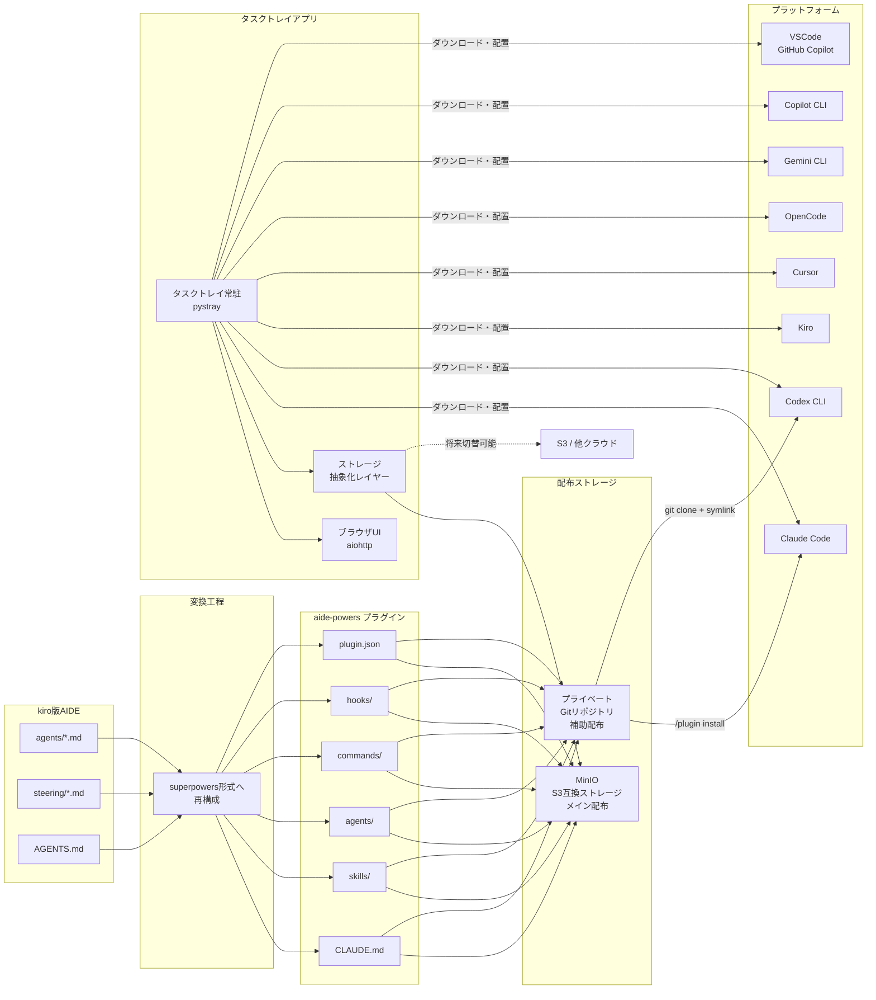

# 開発企画書: aide-powers

## 1. プロジェクト概要

### 1.1 目的

kiro版AIDE（オーケストレーター+サブエージェント構成のマルチエージェント開発フレームワーク）を、superpowers形式（スキルシステム、プラグイン配布、サブエージェント生成パターン等）に再構成し、マルチプラットフォームで動作するAIDEの本体とする。

### 1.2 背景・動機

- 社内からの希望として、Kiro以外の環境でもAIDEの開発プロセスを使いたいという要望がある
- チームメンバーがClaude Code / Codex CLIを日常的に使用している
- kiro専用AIDEは開発停止とし、aide-powers（旧称 aide-for-claude-code / aide-claude）が全プラットフォーム共通のAIDEとなる

### 1.3 対象ユーザー

社内の幅広いメンバー（非エンジニアも含む）

### 1.4 初期イメージ

- AIDEの全機能（7つのオーケストレーター + サブエージェント群）をsuperpowers形式のプラグインとして再構成する
- Claude Code、Codex CLI、Kiro、Cursor、OpenCode、Gemini CLI、Copilot CLI、VSCode GitHub Copilotの8プラットフォームで動作する
- 社内限定で配布する
- Windowsタスクトレイ常駐アプリにより、非エンジニアでもsetup.bat実行→初期設定ウィザード→プラグイン自動インストール→利用開始までをGUIで完結できる。更新もタスクトレイの右クリックメニューから通知確認・実行が可能

### 1.5 成功基準

- **機能面**: 既存kiro版AIDEと同等以上の成果物（設計書・コード・ドキュメント）が漏れなく生成されること。7つのオーケストレーター全てがClaude Code上で動作し、各オーケストレーターが生成する全ドキュメント（orchestrator-index.mdの成果物一覧に記載されたもの）が正しく出力されること
- **品質面**: 各オーケストレーターで想定しているサブエージェントが正しく実行されること。具体的には、オーケストレーターがサブエージェントに委譲すべき作業を自身で実行せず、定義されたサブエージェントが呼び出され、4ステータス管理（DONE/DONE_WITH_CONCERNS/NEEDS_CONTEXT/BLOCKED）で報告し、2段階レビュー（スペック準拠→コード品質）が機能すること
- **展開面**: 社内メンバーがsetup.bat（またはsetup.exe）を実行し、タスクトレイアプリの初期設定ウィザードを経て、10分以内にAIDEの初回実行（任意のオーケストレーターの起動）ができること

### 1.6 関連ビジネスロジック

- 社内の日常の開発業務全般（新規開発・保守・バグ修正等すべて）で利用される
- ドキュメント駆動開発のプロセスを各プラットフォーム上で実現する
- 社内限定ライセンスのため、publicに展開不可。配布方法自体も検討対象に含まれる

## 2. 機能詳細

### 2.1 マルチプラットフォーム対応

#### できること
以下の8プラットフォームでAIDEを動作させる:
1. Claude Code（メインターゲット）
2. Codex CLI
3. Kiro
4. Cursor
5. OpenCode
6. Gemini CLI
7. Copilot CLI（GitHub Copilot CLI）
8. VSCode GitHub Copilot

#### メリット
- チームメンバーが好みのエディタ/CLIでAIDEの開発プロセスを利用できる
- プラットフォームロックインを回避できる

#### 実現方法
- superpowersの既存6プラットフォーム対応（Claude Code、Cursor、Codex、OpenCode、Gemini CLI、Copilot CLI）をベースにする
- **Kiro対応（技術調査完了・条件付き可能）**: Agent Skills標準（agentskills.io）をネイティブサポートしており、SKILL.md形式のスキルがそのまま利用可能。サブエージェント機構もIDE（`invokeSubAgent`）・CLI（`subagent`）両方で利用可能。ただし、Claude Codeとツール名が異なるため `kiro-tools.md` の作成が必要。配布はgit clone + symlink方式（Codexパターンに類似）が最も現実的。ハブスキル（using-superpowers相当）の読み込み方式は以下の3候補を**開発しながらそれぞれ試験し、良いものを採用する**方針:
  - 候補1: `inclusion: always` のステアリングファイル（`~/.kiro/steering/aide-bootstrap.md`）— 最もシンプルで確実。最初の実装ターゲット
  - 候補2: AGENTS.md に記述（ワークスペースルートまたは `~/.kiro/steering/`）— AGENTS.md標準に準拠。他ツールとの互換性が高い
  - 候補3: Kiro Powers としてバンドル（POWER.md + steering/ 構成）— キーワードベースのアクティベーションでコンテキスト効率が良い。ただしagents/skills配布不可、常時アクティブ不可、CLI未対応
- **VSCode GitHub Copilot対応（技術調査完了・可能）**: Agent Skills標準をネイティブサポートし、SKILL.md形式がそのまま利用可能。サブエージェント機構（`runSubagent`）も充実。Claude形式のツール名を一部自動マッピングする機能あり。Agent Plugins（Preview）による配布が最適で、`.github/plugin.json` を追加するだけで対応可能。SessionStartフックによるコンテキスト注入も対応済み。superpowersの全機能がネイティブに利用可能であり、最も統合しやすいプラットフォームの一つ
- 各プラットフォーム固有の設定ファイル（.claude-plugin/, .cursor-plugin/, .codex/, .kiro/, .github/, .opencode/等）を用意

#### 技術的な裏付け確認
- Claude Codeのサブエージェント機構（Taskツール）でAIDEのオーケストレーター→サブエージェント委譲パターンが実現可能 → [01-subagent-task-tool.md](./tech-investigation/01-subagent-task-tool.md)
- Codex CLIのmulti_agent機能でも同様のパターンが実現可能（ただし実験的機能） → [01-subagent-task-tool.md](./tech-investigation/01-subagent-task-tool.md)
- Kiroはsuperpowers構成への追加が条件付きで可能。スキル・サブエージェントは対応可能だが、ツールマッピングとブートストラップ方式の作成が必要 → [07-kiro-superpowers-integration.md](./tech-investigation/07-kiro-superpowers-integration.md)
- VSCode GitHub Copilotはsuperpowers構成への追加が可能。スキル・サブエージェント・フック・プラグイン配布の全てがネイティブサポート → [08-vscode-copilot-superpowers-integration.md](./tech-investigation/08-vscode-copilot-superpowers-integration.md)

#### 難易度
中〜高 — superpowersの既存6プラットフォーム対応をベースにできる。VSCode GitHub Copilotは統合しやすい（Agent Skills標準の互換性が高く、Claude形式の自動マッピングもある）。Kiroはツールマッピングファイルの作成とブートストラップ方式の試験・確定が必要で、やや工数がかかる

#### 進歩性・特筆すべき良い点
- kiro版AIDEはKiro専用だったが、aide-powersは8プラットフォームで動作する
- Agent Skills標準（agentskills.io）に準拠することで、将来のプラットフォーム追加も容易

#### 重要度・優先順位
必須 — マルチプラットフォーム対応がaide-powersの存在意義そのもの

### 2.2 プラグイン形式での社内配布

#### できること
AIDEの全構成要素（スキル、エージェント定義、コマンド、フック）を1つのプラグインとしてパッケージ化し、MinIO（S3互換）ストレージからダウンロード配布する。タスクトレイ管理アプリ（2.5参照）がMinIOからのダウンロード・インストールを自動で行う。Git配布（プライベートGitリポジトリからの `/plugin install`）も補助的に残す。

#### メリット
- タスクトレイアプリ経由で非エンジニアでもインストール・更新が可能
- MinIO（S3互換）によりバージョン管理された配布が可能
- ストレージ抽象化設計により、将来S3や他クラウドストレージへの切り替えが容易
- Git配布も残すことで、エンジニアは従来通り `/plugin install` でもインストール可能
- エンジニアはgit clone方式で手軽にaide-powersだけを利用することも可能（superpowersと同じ体験）

#### 実現方法
2つのセットアップ方式を並立させる:

**方式A: タスクトレイアプリ方式（フル機能）**
- タスクトレイアプリがMinIOストレージからプラグインパッケージをダウンロードし、各プラットフォームの所定ディレクトリに配置する
- バージョン管理・更新通知・ユーザートリガー更新を提供
- 将来のdesk-agents対応にも対応
- 非エンジニア向けの推奨方式

**方式B: git clone方式（シンプル）**
- superpowersと同じ手法でaide-powersをセットアップする
- git cloneしてsetup.sh/setup.batを実行するだけ
- バージョン管理・更新通知・desk-agents等は非対応
- エンジニアが手軽にaide-powersだけを使いたい場合の方式

**共通**
- プラグイン構成: .claude-plugin/plugin.json + agents/ + skills/ + commands/ + hooks/
- ストレージ抽象化: MinIO（S3互換）をデフォルトストレージとし、将来S3や他クラウドストレージに切り替え可能な抽象化レイヤーを設ける（方式Aのみ）
- 認証: MinIOはアクセスキー認証（方式A）、Gitは既存のgit認証情報ヘルパーを使用（方式B）

#### 技術的な裏付け確認
- Claude Codeプラグインシステムでプライベートリポジトリからの配布が可能 → [03-plugin-distribution.md](./tech-investigation/03-plugin-distribution.md)
- プラグインに含められるコンポーネント（skills, agents, commands, hooks, MCPサーバー）を確認済み → [03-plugin-distribution.md](./tech-investigation/03-plugin-distribution.md)
- Codex CLI向けはgit clone + symlink方式で対応可能 → [03-plugin-distribution.md](./tech-investigation/03-plugin-distribution.md)
- MinIO配布に関する技術調査は未実施（フェーズ2で調査予定）

#### 難易度
中 — MinIOからのダウンロード・バージョン管理の仕組み構築が追加。ストレージ抽象化レイヤーの設計も必要

#### 進歩性・特筆すべき良い点
- kiro版AIDEはsetup.sh/setup.batによるファイルコピー方式だったが、MinIO配布+タスクトレイアプリにより、非エンジニアでも利用可能な配布・更新管理が実現される

#### 重要度・優先順位
必須 — 社内配布はプロジェクトの要件。非エンジニアへの展開にはMinIO経由のタスクトレイアプリ配布が不可欠

### 2.3 AIDEの7つのオーケストレーター自動選択

#### できること
ユーザーのリクエスト内容に応じて、7つのオーケストレーター（企画・設計・実装・設計逆引き・変更・リファクタリング・バグ修正）から適切なものを自動選択し、対応するスキルを呼び出す。

#### メリット
- ユーザーはオーケストレーターの存在を意識せず、自然言語でリクエストするだけでよい
- kiro版AIDEと同等のオーケストレーター選択体験を提供できる

#### 実現方法
- CLAUDE.mdに簡潔な選択ガイド（約30行）を記述
- using-aide-powersメタスキルに詳細な選択ロジックを配置
- 各オーケストレータースキルのdescriptionに具体的なトリガーワードを含める
- CLAUDE.mdに「AIDEのプロセスに従う場合は、まず using-aide-powers スキルを呼び出すこと」と記述

#### 技術的な裏付け確認
- superpowersのusing-superpowersスキルが同様のメタスキルパターンを採用しており、実績あり → [04-aide-features-detailed-verification.md](./tech-investigation/04-aide-features-detailed-verification.md)
- スキルのdescriptionに基づくClaude の自動選択機能を確認済み → [02-skills-and-claude-md.md](./tech-investigation/02-skills-and-claude-md.md)

#### 難易度
中 — 7つのオーケストレーターの自動選択精度はdescriptionの記述品質に依存。誤選択のリスクがある

#### 進歩性・特筆すべき良い点
- kiro版AIDEではステアリングのinclusion: alwaysで常時読み込みしていたが、スキルのオンデマンド読み込みにより、コンテキスト効率が向上する

#### 重要度・優先順位
必須 — オーケストレーター選択はAIDEの入口。これが機能しないとAIDEのプロセスが開始できない

### 2.4 superpowersの仕組みを取り入れた最適化再構成

#### できること
kiro版AIDEの構成ファイルを、superpowersの優れた仕組みを取り入れながらsuperpowers形式に最適化再構成する。出力（成果物）はkiro版AIDEと同等のものが生成されるが、内部のプロセスやロジックはsuperpowersの知見で強化・最適化される。

#### メリット
- kiro版AIDEと同等の成果物を生成しつつ、プロセスの品質・堅牢性が向上する
- superpowersの実績ある仕組み（4ステータス管理、Iron Lawパターン、ゲート関数パターン、2段階レビュー、体系的デバッグ等）を取り入れることで、エージェントの規律と品質保証が強化される
- 設計品質保証（DDD、SOLID、QAゲート等）もAIDEの強みとして維持・強化される
- 再構成工程自体がドキュメント化されるため、将来の更新や拡張に活用できる

#### 実現方法
企画・設計・実装の3オーケストレーターをPoCとして先行再構成し、その結果から全体の再構成工程を確定する。単なる機械的なファイル変換ではなく、superpowersの良い仕組みを取り入れた設計判断を伴う再構成である。

- **PoC対象**: 企画・設計・実装の3オーケストレーターをsuperpowers形式のスキルチェーンに再構成する。superpowersのメインフロー（brainstorming → writing-plans → SDD/executing-plans）に対応する3つを通しで検証し、スキルチェーン間の遷移（企画完了→設計開始、設計完了→実装開始）も含めて検証する
- **再構成方式**: 各オーケストレーターをフェーズスキル群 + ハブスキルに分割し、superpowersのワークフローチェーン（REQUIRED SUB-SKILL形式の遷移）で連携させる
- **superpowersの良い仕組みの取り込み**:
  - 4ステータス管理（DONE/DONE_WITH_CONCERNS/NEEDS_CONTEXT/BLOCKED）によるサブエージェント報告の構造化
  - Iron Lawパターン（「Xなしに、Yしてはならない」形式）と多層防御（精神条項、Red Flags、Common Rationalizations、Gate Function）による規律の強化
  - ゲート関数パターン（IDENTIFY→RUN→READ→VERIFY→CLAIM）による検証の厳格化
  - 2段階レビュー（スペック準拠→コード品質）による品質保証の多層化
  - 体系的デバッグ（4フェーズ+3回失敗ルール）による問題解決の構造化
- **設計品質保証の強化**: AIDEの設計品質保証（DDD、SOLID、QAゲート等）を維持しつつ、superpowersの仕組みで補強する
- **スキル作成方法**: superpowersのwriting-skillsスキルのTDDアプローチ（RED-GREEN-REFACTOR）で各フェーズスキルを作成する
- **評価環境**: VSCode GitHub Copilotで動作検証する
- **PoCの成果**: 再構成工程の確立 + 開発専用Agent/SKILLの定義確定
- **再構成の優先順位**: 推奨順序は planning → design → impl（PoC先行）→ CLAUDE.md → change → bugfix → refactoring → reverse

#### 技術的な裏付け確認
- 完全マッピング表で全ファイルの変換先と変換方法を定義済み → [06-full-mapping-table.md](./tech-investigation/06-full-mapping-table.md)
- 構成要素判定表で全84ファイルの分類済み（そのまま使う25件、中身を差し替える30件、新規作成1件） → [poc-framework-analysis.md](./poc-framework-analysis.md)

#### 難易度
高 — 単なるファイル変換ではなく、superpowersの仕組みを取り入れた設計判断を伴う再構成であるため、各オーケストレーターの特性を理解した上での最適化が必要。対象ファイル数も多く、再構成工程の設計と実行の両方に大きな作業量が必要

#### 進歩性・特筆すべき良い点
- kiro版AIDEの成果物品質を維持しつつ、superpowersの実績ある仕組みでプロセスを強化する「良いとこ取り」のアプローチ
- 再構成工程をドキュメント化することで、将来のAIDE更新時の再構成が効率化される

#### 重要度・優先順位
必須 — 再構成工程なしには成果物が生成できない

### 2.5 タスクトレイ管理アプリ

#### できること
Windowsタスクトレイに常駐し、aide-powersのインストール・初期設定・プラグイン管理・更新管理をGUIで行う。具体的には以下の機能を提供する:

1. **setup.bat/setup.exe でインストール**: ワンクリックでタスクトレイアプリ自体をセットアップ
2. **Windowsスタートアップ登録**: PC起動時にタスクトレイアプリが自動起動
3. **初期設定ウィザード**: ブラウザベースのUIで使用するAIエージェント（プラットフォーム）を選択
4. **プラグイン自動インストール**: 選択したプラットフォームに応じてMinIOからプラグインをダウンロード・配置
5. **MinIOバージョン監視**: MinIOストレージ上のプラグインバージョンを定期的にチェック
6. **更新通知**: 新バージョンが利用可能な場合、タスクトレイから通知を表示
7. **ユーザートリガーで更新実行**: 右クリックメニューからユーザーが明示的に更新を実行（全自動更新は禁止）

#### メリット
- 非エンジニアでもコマンドライン不要でaide-powersを利用開始・管理できる
- セットアップから利用開始までの手順が大幅に簡素化される
- 更新管理がGUIで完結し、バージョンの不整合を防止できる

#### 実現方法
- **タスクトレイ常駐**: pystray 0.19.5 でWindowsタスクトレイに常駐。右クリックメニュー（`pystray.Menu` / `pystray.MenuItem`）で操作を提供。通知は `icon.notify()` メソッドで実現（Windows win32バックエンドで通知サポート済み）。リッチ通知が必要になった場合は Windows-Toasts 1.3.1 を追加導入する
- **ブラウザUI**: aiohttp 3.9.x を asyncio イベントループで起動（`aiohttp.web.AppRunner` + `aiohttp.web.TCPSite`、`host='127.0.0.1'`）。テンプレートエンジンは aiohttp-jinja2 経由で Jinja2 を使用。ブラウザ起動は Python 標準ライブラリ `webbrowser.open()` で実現。ローカルのみアクセス可能（`127.0.0.1` バインド）
- **ストレージSDK**: minio-py 7.2.x でMinIO（S3互換）ストレージと通信。バージョン監視は `stat_object()` でカスタムメタデータ（`x-amz-meta-version`）を定期チェック。ダウンロードは `fget_object()` で実行。Repositoryパターンで抽象化し、将来boto3（AWS S3直接）への切り替えはRepository実装の差し替えのみで対応可能
- **exe化・配布**: PyInstaller 6.13.x で単一exeファイルを生成（`--onefile --windowed --icon=app.ico`）。`--windowed` でコンソール非表示、`--onefile` で単一ファイル配布。setup.bat でインストール先（`%LOCALAPPDATA%\aide-powers`）へのコピーとスタートアップ登録を実行
- **スタートアップ登録**: winreg（Python標準ライブラリ）で `HKEY_CURRENT_USER\Software\Microsoft\Windows\CurrentVersion\Run` にレジストリ登録。管理者権限不要。タスクトレイアプリの設定画面からON/OFF切り替え可能
- **更新制御**: バージョン監視は自動（バックグラウンドで定期チェック）、更新実行はユーザーの明示的なトリガーのみ
- **将来拡張**: kiro-desk-agentsの追加に対応できる設計にする（今回のスコープ外だが、desk-agents単体利用もあり得るため拡張性を考慮）

#### 技術的な裏付け確認
技術調査完了。全5項目とも実現可能と判断 → [09-tray-app-tech-stack.md](./tech-investigation/09-tray-app-tech-stack.md)

| 技術要素 | 推奨ライブラリ | 実現可能性 | 難易度 |
|---|---|---|---|
| タスクトレイ常駐 | pystray 0.19.5（LGPLv3） | ✅ 可能 | 低 |
| ブラウザUI | aiohttp 3.9.x（Apache 2.0）+ aiohttp-jinja2 + webbrowser（標準ライブラリ） | ✅ 可能 | 低 |
| ストレージSDK | minio-py 7.2.x（Apache 2.0）+ Repositoryパターン | ✅ 可能 | 低〜中 |
| exe化・配布 | PyInstaller 6.13.x（GPL v2 / ブートローダーApache 2.0）+ setup.bat | ✅ 可能 | 低 |
| スタートアップ登録 | winreg（標準ライブラリ） | ✅ 可能 | 低 |

主な制約事項:
- pystrayの最終リリースは2023年9月（安定版として機能中。Windows APIは変わりにくい）
- PyInstaller製exeがウイルス対策ソフトに誤検知される可能性あり（コード署名で対策可能）
- `--onefile` モードは初回起動時にテンポラリ展開が発生し数秒遅い
- ローカルサーバーのポート競合の可能性あり（動的ポート割り当てまたは設定可能にする）
- `list_objects` ではカスタムメタデータ取得不可（個別に `stat_object` が必要）
- MinIOサーバーへのネットワーク接続が必要（オフライン時のフォールバック設計が必要）

#### 難易度
中 — 個々の技術要素は成熟しており難易度は低いが、タスクトレイ常駐+ブラウザUI+ストレージ抽象化+exe化の統合設計が必要。特にバージョン監視ロジック（定期チェック、差分検出、ダウンロード管理）とオフラインフォールバックの設計に工数がかかる

#### 進歩性・特筆すべき良い点
- kiro版AIDEにはなかった管理UIを提供する
- 非エンジニアの利用障壁を大幅に下げ、社内展開のスケーラビリティが向上する

#### 重要度・優先順位
必須 — 非エンジニアへの展開に不可欠。aide-powersの対象ユーザーを「エンジニアのみ」から「社内メンバー全員」に拡大するための中核機能


## 3. 全体イメージ

### 3.1 解説

aide-powers（旧称 aide-for-claude-code / aide-claude）は、kiro版AIDEのマルチエージェント開発フレームワークを、superpowersの優れた仕組みを取り入れながらsuperpowers形式のプラグインとして最適化再構成したものである。7つのオーケストレーター（企画・設計・実装・設計逆引き・変更・リファクタリング・バグ修正）とサブエージェント群が、ドキュメント駆動開発のプロセスを8つのプラットフォーム上で実現する。出力（成果物）はkiro版AIDEと同等のものが生成されるが、内部のプロセスやロジックはsuperpowersの知見（4ステータス管理、Iron Lawパターン、ゲート関数パターン、2段階レビュー、体系的デバッグ等）で強化・最適化される。

技術的には、kiro版AIDEの構成要素（agents/*.md + steering/*.md + AGENTS.md）を、superpowers形式（スキル + サブエージェント定義 + CLAUDE.md）に最適化再構成する。具体的なファイル構成は設計フェーズで確定する。サブエージェントのユーザー対話については、Claude Codeのフォアグラウンドサブエージェントで AskUserQuestion がパススルーされる仕様（公式ドキュメント記載）を活用し、既存AIDEのサブエージェントがユーザーと直接対話するシーケンスをそのまま維持する。

配布はMinIO（S3互換）ストレージをメインとし、Windowsタスクトレイ常駐アプリ（pystray + aiohttp ブラウザUI）がインストール・初期設定・プラグイン管理・更新管理をGUIで提供する。これにより非エンジニアでもsetup.bat実行から10分以内にAIDEの利用を開始できる。補助的にClaude Codeプラグインシステム（プライベートGitリポジトリからの `/plugin install`）やCodex CLI向けgit clone + symlink方式も維持する。

### 3.2 ビジネスフロー

```mermaid
flowchart TD
    subgraph インストール・管理フロー
        S1[setup.bat/setup.exe 実行] --> S2[タスクトレイアプリ起動]
        S2 --> S3[初期設定ウィザード<br/>ブラウザUIで表示]
        S3 --> S4[使用するAIエージェント<br/>プラットフォームを選択]
        S4 --> S5[MinIOからプラグインを<br/>自動ダウンロード・配置]
        S5 --> S6[セットアップ完了<br/>タスクトレイに常駐]
        S6 --> S7{バージョン監視<br/>定期チェック}
        S7 -->|新バージョンあり| S8[更新通知を表示]
        S8 --> S9{ユーザーが更新を<br/>トリガー?}
        S9 -->|はい| S10[MinIOから最新版を<br/>ダウンロード・更新]
        S10 --> S7
        S9 -->|いいえ| S7
    end

    subgraph AIDE利用フロー
        A[ユーザーがリクエスト] --> B{CLAUDE.md + using-aide-powers スキル<br/>オーケストレーター自動選択}
        
        B -->|アイデア段階| C[企画オーケストレーター]
        B -->|要件定義から| D[設計オーケストレーター]
        B -->|設計書に基づく実装| E[実装オーケストレーター]
        B -->|既存コードから設計書逆生成| F[設計逆引きオーケストレーター]
        B -->|機能追加・仕様変更| G[変更オーケストレーター]
        B -->|バグ修正| H[バグ修正オーケストレーター]
        B -->|内部構造改善| I[リファクタリングオーケストレーター]
        
        C --> C1[ヒアリング] --> C2[技術調査] --> C3[企画書作成]
        D --> D1[要件定義] --> D2[設計] --> D3[QAゲート]
        E --> E1[タスク分解] --> E2[実装ループ] --> E3[レビュー]
        F --> F1[コード解析] --> F2[設計書逆生成] --> F3[ユーザー確認]
        G --> G1[影響分析] --> G2[差分設計] --> G3[差分実装]
        H --> H1[原因分析] --> H2[修正設計] --> H3[修正実装]
        I --> I1[対象特定] --> I2[方針確定] --> I3[リファクタ実装]
        
        C3 --> J[成果物<br/>設計書・コード・ドキュメント]
        D3 --> J
        E3 --> J
        F3 --> J
        G3 --> J
        H3 --> J
        I3 --> J
    end

    S6 -.->|セットアップ完了後| A
```

### 3.3 データフロー



### 3.4 API/IF

該当なし — aide-powersは外部APIを提供しない。各プラットフォームのネイティブ機能（スキル、サブエージェント、プラグイン）を活用する内部フレームワークである。

### 3.5 運用コスト

- **MinIOストレージ**: セルフホスト型のため、ホスティングサーバーの費用が発生する。プラグインパッケージのサイズは小さい（テキストファイル中心）ため、ストレージ容量自体は最小限。サーバー費用は社内インフラの既存リソースを活用できる場合は追加コストなし。専用サーバーを立てる場合の費用はフェーズ2で見積もる
- **プラグインシステム**: 無料（Claude Codeプラグインシステム自体に費用なし）
- **Gitリポジトリホスティング**: 既存の社内Git基盤を使用する場合は追加コストなし
- **AIモデル利用料**: 各プラットフォームの既存契約に依存。aide-powersはサブエージェントを多用するため、1回のオーケストレーター実行あたりのトークン消費量はkiro版AIDEと同等を想定する。superpowers形式への変換によるトークン増減は、スキルのオンデマンド読み込み（コンテキスト効率向上）とサブエージェントのプロンプトテンプレート構築（コンテキスト隔離）により、kiro版AIDEと同等かやや減少する見込み。具体的な金額はプラットフォームの契約形態に依存するため、PoC実施時に実測する
- **プラットフォーム間のコスト差異**: Claude Code（Anthropic API）、Codex CLI（OpenAI API）、Kiro（AWS Bedrock）等、プラットフォームごとにモデル利用料の課金体系が異なる。aide-powers自体は追加コストを発生させず、各プラットフォームの既存契約内で動作する


### 3.6 実現性

**条件付きGo**

判断根拠:
- **Go要素**: 技術調査により、AIDEの全構成ファイルについてsuperpowers形式への変換方針を整理済み。変換不可能なファイルはゼロ。Claude Codeのサブエージェント機構、スキルシステム、プラグイン配布の全てが要件を満たす
- **Go要素（調査完了）**: タスクトレイ管理アプリの技術調査が完了し、全5項目（タスクトレイ常駐・ブラウザUI・ストレージSDK・exe化・スタートアップ登録）とも実現可能と判断。推奨技術スタック（pystray + aiohttp + minio-py + PyInstaller + winreg）が確定 → [09-tray-app-tech-stack.md](./tech-investigation/09-tray-app-tech-stack.md)
- **条件1**: サブエージェントのユーザー対話について、Claude Codeのフォアグラウンドサブエージェントでは AskUserQuestion がパススルーされる（公式ドキュメント記載）。既存AIDEのサブエージェントがユーザーと直接対話するシーケンスをフォアグラウンドモードで維持する
- **条件2（調査完了）**: Kiroは条件付きで可能（ツールマッピングとブートストラップ方式の作成が必要）、VSCode GitHub Copilotは可能（Agent Skills標準の互換性が高く、Agent Pluginsによる配布も対応）。いずれも技術調査完了済み → [07-kiro-superpowers-integration.md](./tech-investigation/07-kiro-superpowers-integration.md), [08-vscode-copilot-superpowers-integration.md](./tech-investigation/08-vscode-copilot-superpowers-integration.md)
- **条件3**: 変換工程の具体的な設計が未完了。企画・設計・実装の3オーケストレーターのPoCを先行実施し、その結果から全体の変換工程を確定する。構成要素判定表（[poc-framework-analysis.md](./poc-framework-analysis.md)）により、superpowersの全84ファイルのうち、そのまま使えるもの25件、中身を差し替えるもの30件、新規作成1件と分類済み。差し替え対象30件がaide-powers固有の開発作業量の中心となる

### 3.7 開発リスク

| リスク | 影響度 | 発生確率 | 対策 |
|---|---|---|---|
| オーケストレーター自動選択の誤選択 | 中 | 中 | descriptionの記述精度を高め、using-aide-powersメタスキルで補完 |
| 長時間セッションでのコンテキスト圧迫 | 中 | 中 | サブエージェントへの委譲でメインコンテキストを節約。自動コンパクション活用 |
| Codex CLIのmulti_agent機能の仕様変更 | 中 | 中 | 実験的機能のため、APIが変更される可能性あり。Claude Codeをメインターゲットとし、Codex CLIは追従対応 |
| 大量ファイル変換時の品質低下 | 高 | 中 | 変換工程を細かく分割し、各ステップで検証を実施 |
| フォアグラウンドサブエージェントのAskUserQuestionリグレッション | 中 | 低 | フォアグラウンドサブエージェントでAskUserQuestionが動作しないリグレッションが報告されている（GitHub Issue #34592、2026年3月15日、v2.1.76。v2.1.61では動作していた）。公式ドキュメントの記述は変更されていないため修正済みまたは修正予定と判断。発生時はバージョン固定で対応 |
| Kiroのツール名不一致 | 中 | 高 | Kiro IDEとClaude Codeでツール名が大きく異なる（例: `Read`→`readFile`, `Bash`→`executePwsh`, `Task`→`invokeSubAgent`）。`kiro-tools.md` を作成し、`using-superpowers` スキルのPlatform Adaptationセクションに記述を追加する |
| Kiroのブートストラップ方式の不確定性 | 中 | 中 | ハブスキル読み込みの3候補（`inclusion: always`ステアリング / AGENTS.md / Kiro Powers）のいずれが最適かは実際に試験しないと判断できない。候補1を最初の実装ターゲットとし、開発しながら3候補を並行検証する |
| VSCode Copilot Agent Pluginsの仕様変更 | 低 | 中 | Agent Plugins はPreview機能のため仕様変更の可能性あり。ただしスキルとエージェントの基本形式（SKILL.md, .agent.md）は安定しているため、影響は配布方式に限定される |
| サブプロジェクト分解後の遷移が未定義 | 中 | 高 | superpowersの全14スキルを検索したが、最初のサブプロジェクト完了後に残りのサブプロジェクトへ自動遷移する仕組みは存在しない。aide-powersで独自の遷移メカニズムを設計する必要がある。PoC（企画→設計→実装の通しフロー）で遷移パターンを検証する |
| タスクトレイアプリのWindows環境依存 | 中 | 中 | pystrayによるタスクトレイ常駐はWindows固有の機能に依存する（pystray自体はmacOS/Linuxも対応するが、winreg等はWindows固有）。現時点ではWindows対象のため問題ないが、将来macOS/Linux対応が必要になった場合は別途対応が必要。ストレージ抽象化レイヤーはOS非依存で設計する |
| MinIOサーバーの可用性 | 高 | 低 | MinIOサーバーがダウンした場合、新規インストール・更新ができなくなる。既にインストール済みのプラグインは影響を受けない。対策として、Git配布を補助経路として維持する |
| タスクトレイアプリとプラットフォーム固有設定の整合性 | 中 | 中 | 8プラットフォームそれぞれのプラグイン配置先・設定ファイル形式が異なるため、タスクトレイアプリが各プラットフォームの仕様に正しく対応する必要がある。プラットフォームごとのアダプターパターンで対応する |
| 非エンジニアユーザーのトラブルシューティング | 中 | 高 | 非エンジニアがセットアップ中にエラーに遭遇した場合、自力での解決が困難。タスクトレイアプリにエラーログ出力・わかりやすいエラーメッセージ表示を実装する |

### 3.8 重点項目

1. **再構成工程の品質**: kiro版AIDEからsuperpowers形式への再構成は、superpowersの良い仕組みを取り入れた設計判断を伴う作業である。オーケストレーターのフェーズ管理ロジック、ツール名の読み替え、4ステータス管理やIron Lawパターン等の組み込みなど、各ステップで最適化の判断が必要。工程を細かく分割し、各ステップで検証を実施する
2. **オーケストレータースキルのサイズ**: 特にchange-orchestratorとbugfix-orchestratorは大きい。呼び出しテンプレート部分を別ファイルに分離する等の工夫が必要
3. **Kiro・VSCode GitHub Copilot対応（技術調査完了）**: 両プラットフォームともsuperpowers構成への追加が可能であることを確認済み。VSCode GitHub Copilotは Agent Skills標準の互換性が高く、Agent Plugins（Preview）による配布で対応する。Kiroはツールマッピングファイル（`kiro-tools.md`）の作成が必要。ブートストラップ方式は3候補（`inclusion: always`ステアリング / AGENTS.md / Kiro Powers）を開発しながらそれぞれ試験し、良いものを採用する → [07-kiro-superpowers-integration.md](./tech-investigation/07-kiro-superpowers-integration.md), [08-vscode-copilot-superpowers-integration.md](./tech-investigation/08-vscode-copilot-superpowers-integration.md)
4. **フォアグラウンドサブエージェントのユーザー対話**: Claude Codeのフォアグラウンドサブエージェントでは AskUserQuestion がパススルーされる（公式ドキュメント記載）。既存AIDEのユーザー対話シーケンスを維持する。ただしリグレッションバグ（Issue #34592、2026年3月15日時点でOpen）の動向を監視する
5. **企画・設計・実装オーケストレーターのPoC**: 企画・設計・実装の3オーケストレーターをsuperpowers形式のスキルチェーンに再構成するPoCを先行実施する。superpowersのメインフロー（brainstorming → writing-plans → SDD/executing-plans）に対応する3つを通しで検証し、スキルチェーン間の遷移（企画完了→設計開始、設計完了→実装開始）も含めて検証する。superpowersのwriting-skills（TDDアプローチ）、ワークフローチェーン（遷移パターン）、Iron Lawパターン（規律スキル）を採用し、VSCode GitHub Copilotで評価する。この結果から全体の変換工程と開発専用Agent/SKILLの定義を確定する
6. **タスクトレイアプリの統合設計（技術調査完了）**: 個々の技術要素（pystray、aiohttp、minio-py、PyInstaller、winreg）は成熟しており実現可能性を確認済み → [09-tray-app-tech-stack.md](./tech-investigation/09-tray-app-tech-stack.md)。設計・実装フェーズでは以下に特に注意する:
   - **pystray + aiohttp の非同期統合**: pystray の `run_detached()` または `setup` コールバックで aiohttp を asyncio イベントループで起動するパターンの安定性確保。pystray のメインループと asyncio イベントループの共存設計が重要
   - **PyInstaller製exeのウイルス誤検知対策**: 社内ウイルス対策ソフトの除外設定、将来的なコード署名の導入検討
   - **ポート競合対策**: ローカルWebサーバーのポート番号が他アプリと競合する可能性への対応（動的ポート割り当てまたは設定可能にする）
   - **オフラインフォールバック**: MinIOサーバー接続障害時のローカルキャッシュ活用とオフラインモードの設計
   - **pystrayのLGPLv3ライセンス**: PyInstallerでバンドルする際のLGPLv3条件への対応確認
   - **pystrayの開発停滞リスク**: 最終リリースが2023年9月。安定版として機能中だが、代替（crosstray等）の動向を監視する

### 3.9 その他

- **kiro専用AIDEの開発停止**: kiro専用AIDEは開発停止とする。aide-powersが安定稼働した時点で完全に移行する
- **変換の優先順位**: 使用頻度の高いオーケストレーターから変換することで、早期に実用可能な状態にする。推奨順序: planning → design → impl（PoC先行）→ CLAUDE.md → change → bugfix → refactoring → reverse
- **reverse-program-structure-planner.md / reverse-program-structure-reviewer.md**: kiro版AIDEのagents/配下にこれらのファイルが存在するが、変換設計で統合方針を確定する