# システム構成設計: aide-powers

## 1. システム構成

### 1.1 アーキテクチャ図

aide-powersは通常のアプリケーションではなく、AIエージェントプラットフォーム上で動作するスキル・エージェント定義ファイルの集合体である。以下の図はaide-powersプラグインと8プラットフォーム、およびユーザープロジェクトとの関係を示す。

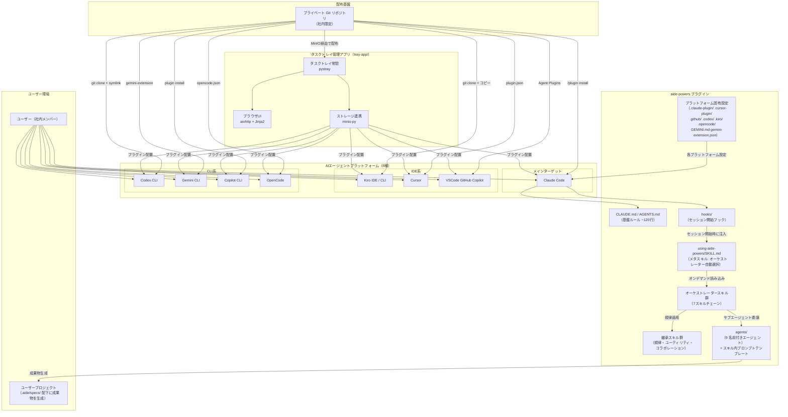

#### 構成要素の説明

| 構成要素 | 役割 | 備考 |
|---|---|---|
| CLAUDE.md / AGENTS.md | 常時読み込みの基盤ルール（~120行） | フェーズ省略禁止、敬語ルール、オーケストレーター実作業禁止等 |
| hooks/ | セッション開始時にusing-aide-powers/SKILL.mdをコンテキストに注入 | bash + cmd ラッパー |
| using-aide-powers/SKILL.md | メタスキル。ユーザーのリクエストから適切なオーケストレーターを自動選択 | `<SUBAGENT-STOP>`タグでサブエージェントからの不要な読み込みを防止 |
| ワークフロースキル群 | 7つのワークフロー（企画・設計・実装・逆引き・変更・バグ修正・リファクタリング） | 各ワークフロー = 独立したフェーズスキル群（REQUIRED SUB-SKILL形式で連鎖） |
| 継承スキル群 | superpowersから継承する規律・ユーティリティスキル | TDD, systematic-debugging, verification-before-completion等 |
| agents/ | 9つの名前付きエージェント定義（複数ワークフローから共通利用されるもののみ）。ワークフロー固有のサブエージェントはスキル内プロンプトテンプレートとして配置。git-committer と pending-issues-manager はスキル化（§2.7参照） | フォアグラウンドで実行、ユーザー対話可能 |
| プラットフォーム固有設定 | 8プラットフォーム分の設定ファイル | plugin.json, ツールマッピング, INSTALL.md等 |
| プライベートGitリポジトリ | 社内限定の配布基盤 | 既存のgit認証情報ヘルパーを使用 |
| タスクトレイ管理アプリ（tray-app/） | Windowsタスクトレイに常駐し、プラグインのインストール・初期設定・更新管理をGUIで提供。pystray + aiohttp + minio-py で構成 | REQ-M12〜M18 |


### 1.2 アクティビティ図

#### 1.2.1 メインフロー: ユーザーリクエストからオーケストレーター実行まで

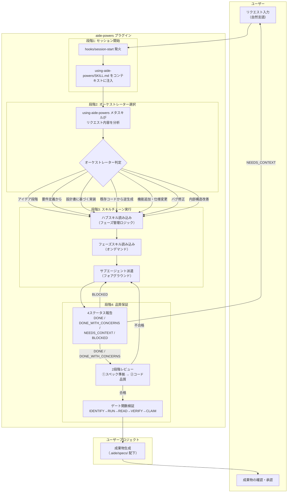

#### 1.2.1.1 後方互換: .kiro/specs/ → .aide/specs/ マイグレーション

aide-powersの成果物格納先は `.aide/specs/{feature_name}/` である。ただし、kiro版AIDEからの移行を円滑にするため、以下の後方互換処理を行う。

**マイグレーション条件:**
- `.kiro/specs/{feature_name}/` が存在する
- `.aide/specs/{feature_name}/` が存在しない

**マイグレーション処理:**
- design-gate スキルのステップ0（マイグレーションチェック）で上記条件を検知した場合、`.kiro/specs/{feature_name}/` の内容を `.aide/specs/{feature_name}/` にコピーする
- コピー後、以降の作業は `.aide/specs/{feature_name}/` に対して行う
- コピー完了後、ユーザーに元の `.kiro/specs/{feature_name}/` を削除するか確認する

※ 詳細は design-gate スキルの詳細設計書（skill-detail-design-gate.md §3.5 ステップ0）を参照

#### 1.2.2 サブエージェント委譲フロー（オーケストレーター内部）

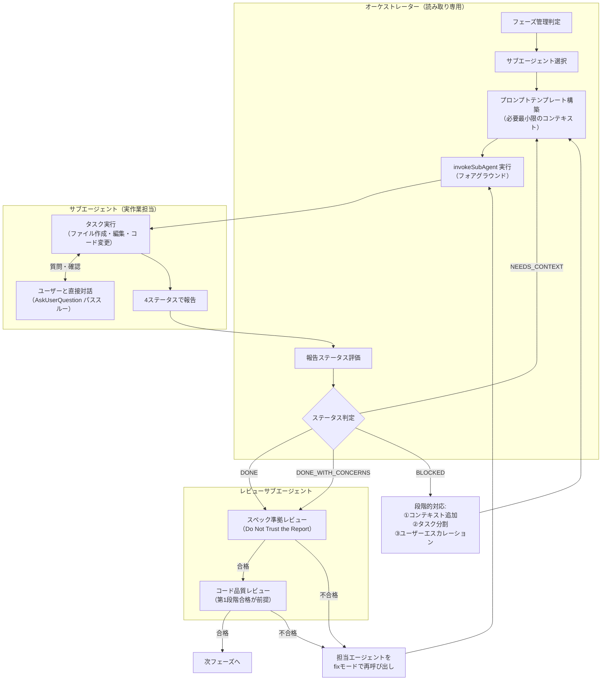

#### 1.2.3 スキルチェーン間遷移フロー

```mermaid
flowchart LR
    subgraph "企画オーケストレーター"
        P0["Phase0: 初期情報収集"]
        P1["Phase1: テンプレート初期化"]
        P2["Phase2: 探索サイクル"]
        P3["Phase3: 完了判定・最終化"]
        P0 --> P1 --> P2 --> P3
    end

    subgraph "設計オーケストレーター"
        D1["Phase1: ユーザー要件"]
        D2["Phase2: システム要件"]
        D3["Phase3: 開発計画"]
        D4["Phase4: システム構成"]
        D5["Phase5: GUI設計"]
        D6["Phase6: ユースケース"]
        D7["Phase7: レイヤード+DDD"]
        D8["Phase8: オブジェクト設計"]
        D9["Phase9: インフラIF"]
        D10["Phase10: プログラム構成"]
        DQA["QAゲート"]
        D1 --> D2 --> D3 --> D4 --> D5 --> D6 --> D7 --> D8 --> D9 --> D10 --> DQA
    end

    subgraph "実装オーケストレーター"
        I1["タスク分解"]
        I2["実装ループ<br/>（サブエージェント駆動）"]
        I3["ドキュメント生成"]
        I1 --> I2 --> I3
    end

    P3 -->|"handover-notes.md"| D1
    DQA -->|"設計書一式"| I1
```


## 2. ソフトウェア抽象構造

### 2.1 aide-powersプラグイン全体のブロック図

aide-powersプラグインの内部構造を、大きな機能概念の塊とその関係で示す。

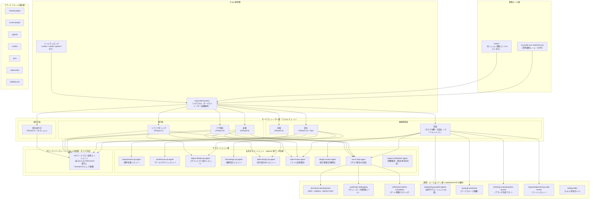

### 2.2 スキルチェーン構造設計

各ワークフローは独立したフェーズスキル群で構成される。各フェーズスキルは独立した SKILL.md として存在し、REQUIRED SUB-SKILL 形式で次のフェーズスキルに連鎖する。superpowersのワークフローチェーン（REQUIRED SUB-SKILL形式の遷移）をベースに設計する。

#### 2.2.1 スキルチェーンの基本パターン

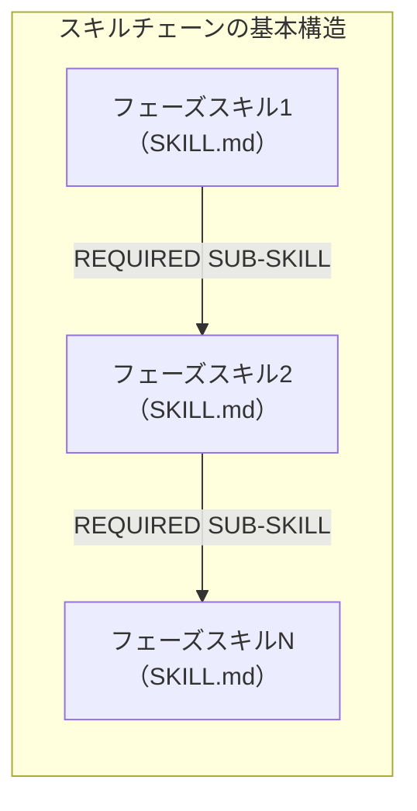

**各フェーズスキルの責務:**
- 当該フェーズの詳細手順
- Iron Law の定義（各フェーズ固有の核心ルール。ワークフロー共通のIron Lawは先頭フェーズスキルに配置）
- サブエージェント委譲の基本ルール（4ステータス管理、コンテキスト汚染防止）
- HARD-GATE（設計書ゲート等の必須チェック。該当フェーズスキルに配置）
- サブエージェントへの委譲指示（プロンプトテンプレート参照先）
- フェーズ完了条件（ゲート関数パターンで検証）
- 次フェーズスキルへの遷移指示（REQUIRED SUB-SKILL形式）

**ハブスキルの責務が各フェーズスキルに分散される:**

| 旧ハブスキルの責務 | 分散先 |
|---|---|
| フェーズ管理ロジック（現在のフェーズ判定、次フェーズへの遷移条件） | 各フェーズスキルの末尾に REQUIRED SUB-SKILL 形式で次フェーズを指定 |
| Iron Law の定義 | ワークフロー共通の Iron Law は先頭フェーズスキルに配置。フェーズ固有の Iron Law は各フェーズスキルに配置 |
| サブエージェント委譲の基本ルール | 各フェーズスキルに直接記載 |
| HARD-GATE | 該当するフェーズスキルに配置（例: 実装ワークフローの設計書ゲートは先頭フェーズスキルに配置） |

#### 2.2.2 各ワークフローのスキルチェーン構成

##### 企画ワークフロー


| フェーズスキル | 委譲先サブエージェント | 備考 |
|---|---|---|
| planning-phase0-intake | source-material-organizer | ユーザー提供資料の構造化 |
| planning-phase1-init | proposal-writer | 企画書テンプレート初期化 |
| planning-phase2-explore | tech-investigator, proposal-writer, proposal-reviewer | 探索サイクル（繰り返し） |
| planning-phase3-finalize | proposal-reviewer | 最終レビュー |

> **注記**: 上記の委譲先サブエージェントはすべてプロンプトテンプレート経由で呼び出される（agents/ 配下には配置しない）。

##### 設計ワークフロー

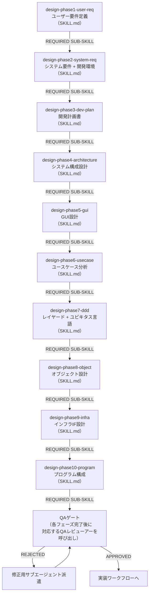

| フェーズスキル | 委譲先サブエージェント |
|---|---|
| design-phase1-user-req | user-requirements-architect |
| design-phase2-system-req | system-requirements-architect |
| design-phase3-dev-plan | development-planner |
| design-phase4-architecture | system-architecture-designer |
| design-phase5-gui | （GUI設計エージェント） |
| design-phase6-usecase | usecase-lister, usecase-process-analyzer, usecase-usability-evaluator, usecase-improver |
| design-phase7-ddd | ddd-modeler |
| design-phase8-object | object-designer |
| design-phase9-infra | （インフラIF設計エージェント） |
| design-phase10-program | （プログラム構成エージェント） |
| design-phase3-dev-plan（QAゲート1） | **requirements-qa-agent** |
| design-phase7-ddd（QAゲート2） | **architecture-qa-agent** |
| design-phase8-object（QAゲート3） | **object-design-qa-agent** |
| design-phase10-program（QAゲート4） | **final-design-qa-agent** |

> **注記**: **太字**のエージェントは agents/ 配下の名前付きエージェント。それ以外はプロンプトテンプレート経由で呼び出される。QAゲートは各フェーズ完了後に対応するQAレビューアーエージェントを直接呼び出す。

##### 実装ワークフロー

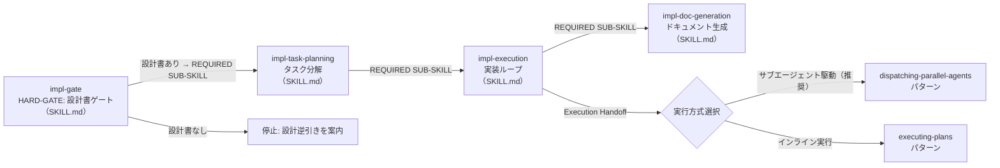

| フェーズスキル | 委譲先サブエージェント |
|---|---|
| impl-task-planning | impl-planner |
| impl-execution | **micro-impl-agent**, **design-review-agent**, **code-review-agent** |
| impl-doc-generation | readme-generator, doc-completion-delegator |

> **注記**: **太字**のエージェントは agents/ 配下の名前付きエージェント。それ以外はプロンプトテンプレート経由で呼び出される。

##### 変更ワークフロー

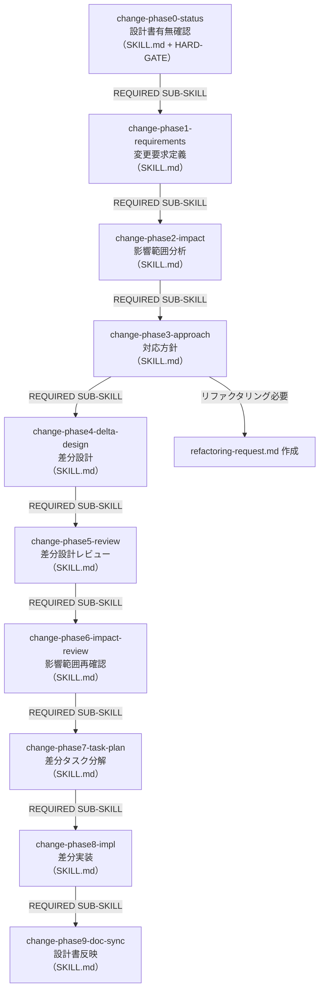

##### バグ修正ワークフロー

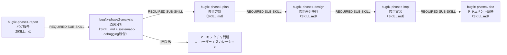

##### リファクタリングワークフロー

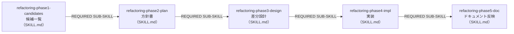

##### 設計逆引きワークフロー

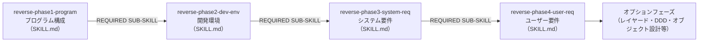


### 2.3 aide-powersプラグインのディレクトリ構成（最終形）

dev-environment.md §3.1のディレクトリ構造をベースに、スキルチェーン構造設計の結果を反映した最終的なファイル配置を以下に示す。

```
aide-powers/
│
├── CLAUDE.md                              # 基盤ルール（~120行）
├── AGENTS.md                              # マルチプラットフォーム対応エージェント設定
├── GEMINI.md                              # Gemini CLI向け設定
├── gemini-extension.json                  # Gemini CLI向け拡張定義
├── README.md                              # プロジェクト説明・インストール手順
├── .gitignore
├── .gitattributes
│
├── .claude-plugin/
│   └── plugin.json                        # Claude Codeプラグインメタデータ
│
├── .cursor-plugin/
│   └── plugin.json                        # Cursorプラグインメタデータ
│
├── .github/
│   └── plugin.json                        # VSCode Copilot Agent Pluginsメタデータ
│
├── .codex/
│   └── INSTALL.md                         # Codex CLIインストールガイド
│
├── .kiro/
│   ├── INSTALL.md                         # Kiroインストールガイド
│   └── steering/
│       └── aide-bootstrap.md              # Kiroブートストラップ用ステアリング（候補1）
│
├── .opencode/
│   ├── INSTALL.md                         # OpenCodeインストールガイド
│   └── plugins/
│       └── aide.js                        # OpenCodeプラグインスクリプト
│
├── hooks/
│   ├── hooks.json                         # Claude Code / Copilot CLI向けフック設定
│   ├── hooks-cursor.json                  # Cursor向けフック設定
│   ├── session-start                      # セッション開始スクリプト（bash）
│   └── run-hook.cmd                       # Windows向けフック実行ラッパー
│
├── skills/
│   │
│   │── using-aide-powers/                        # ★ メタスキル（ワークフロー自動選択）
│   │   ├── SKILL.md                       #   7ワークフローへの振り分けロジック
│   │   └── references/
│   │       ├── codex-tools.md             #   Codex CLIツールマッピング
│   │       ├── copilot-tools.md           #   Copilot CLIツールマッピング
│   │       ├── gemini-tools.md            #   Gemini CLIツールマッピング
│   │       ├── kiro-ide-tools.md          #   Kiro IDEツールマッピング
│   │       ├── kiro-cli-tools.md          #   Kiro CLIツールマッピング
│   │       └── vscode-copilot-tools.md    #   VSCode GitHub Copilotツールマッピング
│   │
│   │── fs-planning-intake-and-init/       # ★ 企画ワークフロー
│   │   ├── SKILL.md                       #   フェーズ0: 初期情報収集
│   │   └── source-material-organizer-prompt.md
│   │── fs-planning-init/
│   │   ├── SKILL.md                       #   フェーズ1: 企画書テンプレート初期化
│   │   └── proposal-writer-prompt.md
│   │── fs-planning-explore/
│   │   ├── SKILL.md                       #   フェーズ2: 探索サイクル
│   │   ├── tech-investigator-prompt.md
│   │   ├── proposal-writer-prompt.md
│   │   └── proposal-reviewer-prompt.md
│   │── fs-planning-finalize/
│   │   ├── SKILL.md                       #   フェーズ3: 完了判定・最終化
│   │   └── proposal-reviewer-prompt.md
│   │
│   │── fs-design-phase1-user-req/          # ★ 設計ワークフロー
│   │   ├── SKILL.md                       #   フェーズ1: ユーザー要件定義
│   │   └── user-requirements-architect-prompt.md
│   │── fs-design-phase2-system-req/
│   │   ├── SKILL.md                       #   フェーズ2: システム要件 + 開発環境
│   │   └── system-requirements-architect-prompt.md
│   │── fs-design-phase3-dev-plan/
│   │   ├── SKILL.md                       #   フェーズ3: 開発計画書
│   │   └── development-planner-prompt.md
│   │── fs-design-phase4-architecture/
│   │   ├── SKILL.md                       #   フェーズ4: システム構成設計
│   │   └── system-architecture-designer-prompt.md
│   │── fs-design-phase5-gui/
│   │   ├── SKILL.md                       #   フェーズ5: GUI設計
│   │   └── gui-designer-prompt.md
│   │── fs-design-phase6-usecase/
│   │   ├── SKILL.md                       #   フェーズ6: ユースケース分析
│   │   ├── usecase-lister-prompt.md
│   │   ├── usecase-process-analyzer-prompt.md
│   │   ├── usecase-usability-evaluator-prompt.md
│   │   └── usecase-improver-prompt.md
│   │── fs-design-phase7-ddd/
│   │   ├── SKILL.md                       #   フェーズ7: レイヤード + ユビキタス言語
│   │   └── ddd-modeler-prompt.md
│   │── fs-design-phase8-object/
│   │   ├── SKILL.md                       #   フェーズ8: オブジェクト設計
│   │   └── object-designer-prompt.md
│   │── fs-design-phase9-infra/
│   │   ├── SKILL.md                       #   フェーズ9: インフラIF設計
│   │   └── infra-interface-designer-prompt.md
│   │── fs-design-phase10-program/
│   │   ├── SKILL.md                       #   フェーズ10: プログラム構成
│   │   └── program-structure-designer-prompt.md
│   │── fs-design-qa-gate/
│   │   └── SKILL.md                       #   QAゲート: 設計品質検証
│   │
│   │── fs-impl-gate/                      # ★ 実装ワークフロー
│   │   └── SKILL.md                       #   HARD-GATE: 設計書ゲート
│   │── fs-impl-task-planning/
│   │   ├── SKILL.md                       #   タスク分解
│   │   └── impl-planner-prompt.md
│   │── fs-impl-execution/
│   │   ├── SKILL.md                       #   実装ループ（サブエージェント駆動）
│   │   ├── implementer-prompt.md          #   micro-impl-agent用プロンプトテンプレート
│   │   ├── spec-reviewer-prompt.md        #   design-review-agent用テンプレート
│   │   └── code-quality-reviewer-prompt.md  # code-review-agent用テンプレート
│   │── fs-impl-doc-generation/
│   │   ├── SKILL.md                       #   ドキュメント生成
│   │   └── doc-completion-delegator-prompt.md
│   │
│   │── fs-reverse-phase1-program/          # ★ 設計逆引きワークフロー
│   │   ├── SKILL.md                       #   フェーズ1: プログラム構成
│   │   └── reverse-program-structure-prompt.md
│   │── fs-reverse-phase2-dev-env/
│   │   ├── SKILL.md                       #   フェーズ2: 開発環境
│   │   └── reverse-dev-environment-prompt.md
│   │── fs-reverse-phase3-system-req/
│   │   ├── SKILL.md                       #   フェーズ3: システム要件
│   │   └── reverse-system-requirements-prompt.md
│   │── fs-reverse-phase4-user-req/
│   │   ├── SKILL.md                       #   フェーズ4: ユーザー要件
│   │   └── reverse-user-requirements-prompt.md
│   │── fs-reverse-optional-phases/
│   │   ├── SKILL.md                       #   オプションフェーズ
│   │   ├── reverse-architecture-prompt.md
│   │   ├── reverse-object-design-prompt.md
│   │   ├── reverse-infra-interface-prompt.md
│   │   └── reverse-gui-design-prompt.md
│   │
│   │── fs-change-phase1-status/            # ★ 変更ワークフロー
│   │   ├── SKILL.md                       #   フェーズ1: 状態確認 + HARD-GATE
│   │   └── change-status-checker-prompt.md
│   │── fs-change-phase1-requirements/
│   │   ├── SKILL.md                       #   フェーズ1: 変更要求定義
│   │   └── change-requirements-prompt.md
│   │── fs-change-phase2-impact/
│   │   ├── SKILL.md                       #   フェーズ2: 影響範囲分析
│   │   └── change-impact-analyzer-prompt.md
│   │── fs-change-phase3-approach/
│   │   ├── SKILL.md                       #   フェーズ3: 対応方針
│   │   └── change-approach-planner-prompt.md
│   │── fs-change-phase4-delta-design/
│   │   ├── SKILL.md                       #   フェーズ4: 差分設計
│   │   └── change-delta-designer-prompt.md
│   │── fs-change-phase5-review/
│   │   └── SKILL.md                       #   フェーズ5: 差分設計レビュー
│   │── fs-change-phase6-impact-review/
│   │   ├── SKILL.md                       #   フェーズ6: 影響範囲再確認
│   │   └── change-impact-reviewer-prompt.md
│   │── fs-change-phase7-task-plan/
│   │   ├── SKILL.md                       #   フェーズ7: 差分タスク分解
│   │   └── change-task-planner-prompt.md
│   │── fs-change-phase8-impl/
│   │   └── SKILL.md                       #   フェーズ8: 差分実装
│   │── fs-change-phase9-doc-sync/
│   │   ├── SKILL.md                       #   フェーズ9: 設計書反映
│   │   └── change-doc-syncer-prompt.md
│   │
│   │── fs-refactoring-phase0-status/       # ★ リファクタリングワークフロー
│   │   ├── SKILL.md                       #   フェーズ0: 現状把握
│   │   └── refactoring-status-checker-prompt.md
│   │── fs-refactoring-phase1-candidates/
│   │   ├── SKILL.md                       #   フェーズ1: 候補一覧
│   │   └── refactoring-analyzer-prompt.md
│   │── fs-refactoring-phase2-plan/
│   │   ├── SKILL.md                       #   フェーズ2: 方針書
│   │   └── refactoring-planner-prompt.md
│   │── fs-refactoring-phase3-design/
│   │   ├── SKILL.md                       #   フェーズ3: 差分設計
│   │   └── refactoring-designer-prompt.md
│   │── fs-refactoring-phase4-impl/
│   │   └── SKILL.md                       #   フェーズ4: 実装
│   │── fs-refactoring-phase5-doc/
│   │   └── SKILL.md                       #   フェーズ5: ドキュメント反映
│   │
│   │── fs-bugfix-phase1-report/            # ★ バグ修正ワークフロー
│   │   ├── SKILL.md                       #   フェーズ1: バグ報告
│   │   └── bugfix-reporter-prompt.md
│   │── fs-bugfix-phase2-analysis/
│   │   ├── SKILL.md                       #   フェーズ2: 原因分析
│   │   └── bugfix-analyzer-prompt.md
│   │── fs-bugfix-phase3-plan/
│   │   ├── SKILL.md                       #   フェーズ3: 修正方針
│   │   └── bugfix-planner-prompt.md
│   │── fs-bugfix-phase4-design/
│   │   ├── SKILL.md                       #   フェーズ4: 修正差分設計
│   │   └── bugfix-designer-prompt.md
│   │── fs-bugfix-phase5-impl/
│   │   └── SKILL.md                       #   フェーズ5: 修正実装
│   │── fs-bugfix-phase6-doc/
│   │   └── SKILL.md                       #   フェーズ6: ドキュメント反映
│   │
│   │── brainstorming/                     # superpowersから継承（ビジュアルコンパニオン）
│   │   ├── SKILL.md                       #   中身を差し替え
│   │   ├── spec-document-reviewer-prompt.md  # 中身を差し替え
│   │   ├── visual-companion.md            #   そのまま
│   │   └── scripts/                       #   そのまま（5ファイル）
│   │
│   │── writing-plans/                     # superpowersから差し替え
│   │   ├── SKILL.md
│   │   └── plan-document-reviewer-prompt.md
│   │
│   │── subagent-driven-development/       # superpowersから差し替え
│   │   ├── SKILL.md
│   │   ├── implementer-prompt.md
│   │   ├── spec-reviewer-prompt.md
│   │   └── code-quality-reviewer-prompt.md
│   │
│   │── executing-plans/                   # superpowersから差し替え（インライン実行代替）
│   │   └── SKILL.md
│   │
│   │── finishing-a-development-branch/    # superpowersから差し替え
│   │   └── SKILL.md
│   │
│   │── using-git-worktrees/              # superpowersからそのまま
│   │   └── SKILL.md
│   │
│   │── test-driven-development/           # superpowersからそのまま（規律スキル）
│   │   ├── SKILL.md
│   │   └── testing-anti-patterns.md
│   │
│   │── systematic-debugging/              # superpowersからそのまま（規律スキル）
│   │   ├── SKILL.md
│   │   ├── root-cause-tracing.md
│   │   ├── defense-in-depth.md
│   │   ├── condition-based-waiting.md
│   │   ├── condition-based-waiting-example.ts
│   │   └── find-polluter.sh
│   │
│   │── verification-before-completion/    # superpowersからそのまま（規律スキル）
│   │   └── SKILL.md
│   │
│   │── requesting-code-review/            # superpowersから差し替え
│   │   ├── SKILL.md
│   │   └── code-reviewer.md
│   │
│   │── receiving-code-review/             # superpowersからそのまま
│   │   └── SKILL.md
│   │
│   │── dispatching-parallel-agents/       # superpowersからそのまま
│   │   └── SKILL.md
│   │
│   └── writing-skills/                    # superpowersから差し替え
│       ├── SKILL.md
│       ├── anthropic-best-practices.md    #   そのまま
│       ├── graphviz-conventions.dot       #   そのまま
│       ├── persuasion-principles.md       #   そのまま
│       └── render-graphs.js              #   そのまま
│
│   │── design-gate/                       # aide-powers独自: 設計書存在確認ゲート
│   │   └── SKILL.md
│   │
│   │── design-sync/                       # aide-powers独自: 実装中の設計書同期
│   │   └── SKILL.md
│   │
│   │── multi-stage-code-review/           # aide-powers独自: 多段階レビューパイプライン
│   │   └── SKILL.md
│   │
│   │── usecase-analysis/                  # aide-powers独自: ユースケース分析サイクル
│   │   └── SKILL.md
│   │
│   │── git-commit-workflow/               # aide-powers独自: gitコミットワークフロー
│   │   └── SKILL.md
│   │
│   │── pending-issues-management/         # aide-powers独自: 課題管理
│   │   └── SKILL.md
│   │
│   │── doc-index-maintenance/             # aide-powers独自: ドキュメントインデックス管理
│   │   └── SKILL.md
│   │
│   │── user-profile-management/           # aide-powers独自: ユーザープロファイル管理
│   │   └── SKILL.md
│   │
│   │── doc-sync/                          # aide-powers独自: 設計書反映（3WF共通）
│   │   └── SKILL.md
│   │
│   │── tech-investigation/              # aide-powers独自: 技術調査
│   │   ├── SKILL.md
│   │   └── tech-investigator-prompt.md
│   │
│   │── user-requirements-definition/    # 設計系: ユーザー要件定義
│   │   ├── SKILL.md
│   │   └── user-requirements-architect-prompt.md
│   │── system-requirements-definition/  # 設計系: システム要件定義
│   │   ├── SKILL.md
│   │   └── system-requirements-architect-prompt.md
│   │── gui-design/                      # 設計系: GUI設計
│   │   ├── SKILL.md
│   │   └── gui-designer-prompt.md
│   │── object-design/                   # 設計系: オブジェクト設計
│   │   ├── SKILL.md
│   │   └── object-designer-prompt.md
│   │── ddd-modeling/                    # 設計系: DDD/レイヤードアーキテクチャ
│   │   ├── SKILL.md
│   │   └── ddd-modeler-prompt.md
│   │── infra-interface-design/          # 設計系: インフラIF設計
│   │   ├── SKILL.md
│   │   └── infra-interface-designer-prompt.md
│   │── program-structure-design/        # 設計系: プログラム構成
│   │   ├── SKILL.md
│   │   └── program-structure-designer-prompt.md
│   │── design-qa-dispatch/              # QAレビューディスパッチャー
│   │   └── SKILL.md
│   │── folder-merge-check/              # フォルダ統合判定
│   │   └── SKILL.md
│   │── impl-task-planning/              # タスク分解
│   │   ├── SKILL.md
│   │   └── impl-planner-prompt.md
│
└── agents/
    │── design-review-agent.md             # 設計書との整合性チェック
    │── code-review-agent.md               # コード内部品質チェック
    │── micro-impl-agent.md                # タスク単位の実装
    │── requirements-qa-agent.md           # 要件定義QAレビュー
    │── architecture-qa-agent.md           # アーキテクチャQAレビュー
    │── object-design-qa-agent.md          # オブジェクト設計QAレビュー
    │── final-design-qa-agent.md           # 最終設計QAレビュー
    │── delta-design-qa-agent.md           # 差分設計QAレビュー
    └── impact-verification-agent.md       # 影響確認
    │
    │   # ※ git-committer と pending-issues-manager はスキル化済み（コミット f3e8f28）。§2.7 参照。
    │
    │   # ※ ワークフロー固有のサブエージェント（~40定義）は
    │   #   各フェーズスキルの SKILL.md と同じディレクトリ直下に
    │   #   プロンプトテンプレート（*-prompt.md）として配置する。§2.4.2 参照。
│
├── tray-app/                              # タスクトレイ管理アプリ（Python）
│   ├── app/                               # ソースコードルートパッケージ（4層レイヤードアーキテクチャ）
│   │   ├── main.py                        # エントリーポイント（Composition Root）
│   │   ├── domain/                        # ドメイン層（ビジネスロジック・不変条件）
│   │   ├── application/                   # アプリケーション層（ユースケース・DTO）
│   │   ├── infrastructure/                # インフラストラクチャ層（MinIO・ファイルシステム・レジストリ）
│   │   └── presentation/                  # プレゼンテーション層
│   │       ├── tray/                      # pystrayタスクトレイ管理
│   │       ├── web/                       # aiohttpローカルサーバー・REST API・WebSocket
│   │       ├── templates/                 # Jinja2テンプレートHTML（aiohttp-jinja2経由）
│   │       └── static/                    # 静的ファイル（CSS/JS/アイコン）
│   ├── tests/                             # テストコード（app/のミラーリング構造）
│   ├── requirements.txt                   # 依存パッケージ（バージョン固定）
│   ├── requirements-dev.txt               # 開発用依存パッケージ
│   ├── pyinstaller.spec                   # PyInstallerビルド設定（単一exe生成）
│   └── .venv/                             # 仮想環境（.gitignore対象）
```

#### ディレクトリ構成の設計判断

| 判断 | 根拠 |
|---|---|
| 各フェーズスキルを独立した SKILL.md として配置 | 各フェーズスキルが独立した SKILL.md を持ち、REQUIRED SUB-SKILL 形式で連鎖する。superpowers の実際のパターン（各スキルが独立した SKILL.md を持つ）に準拠。フェーズスキルの description には「Use when...」形式のトリガー条件を記述し、CSO原則（§3.4）に従うことで誤呼び出しリスクを低減する |
| プロンプトテンプレートを各フェーズスキルの SKILL.md と同じディレクトリ直下に配置 | superpowers の subagent-driven-development/ 配下に implementer-prompt.md 等を SKILL.md と同じディレクトリ直下に配置するパターンに準拠。references/ サブディレクトリは補助資料（visual-companion.md のような参照ドキュメント）がある場合にのみ使う |
| agents/は9エージェントのフラット構造 | superpowersのagents/配下がフラット（code-reviewer.md 1ファイル）であるパターンに準拠。複数ワークフローから共通利用されるエージェントのみを配置。ワークフロー固有のサブエージェントは各フェーズスキルのディレクトリ直下にプロンプトテンプレートとして配置（技術調査11 §5.1, §5.4） |
| tray-app/をリポジトリルート直下に配置 | タスクトレイアプリはaide-powersプラグイン本体（skills/, agents/等）とは独立したPythonプロジェクト。venv, requirements.txt等のPython固有ファイルがプラグイン本体と混在しないよう、独立ディレクトリに分離。詳細構成は[program-structure.md](program-structure.md)を参照 |
| kiro版AIDEのreverse-program-structure-planner.md / reverse-program-structure-reviewer.md | reverse-program-structure.mdに統合。kiro版AIDEではplanner/reviewerに分離していたが、aide-powersではサブエージェント内部で計画→レビューを一貫して行う |


### 2.4 サブエージェント定義のファイル配置設計

#### 2.4.1 名前付きエージェント vs プロンプトテンプレートの使い分け

superpowersのサブエージェントライフサイクル設計（技術調査11 §5「aide-claude への示唆」）に基づき、以下の基準で使い分ける。

| 種類 | 配置先 | 使い分け基準 | 例 |
|---|---|---|---|
| 名前付きエージェント | agents/*.md | **複数のワークフローから共通利用される**エージェント。YAML frontmatter（name, description, model）を持ち、プラットフォームがエージェントとして自動検出する。人格・役割が固定で、どのタスクでも同じ観点・同じ判断基準で動作する | design-review-agent, code-review-agent, micro-impl-agent, requirements-qa-agent 等 |
| プロンプトテンプレート | skills/{skill}/references/*-prompt.md | **特定ワークフロー固有**のサブエージェント。タスクごとに指示内容が変わり、オーケストレーターがテンプレートに変数（プレースホルダ）を埋めて派遣する。YAML frontmatterなし | implementer-prompt.md, change-impact-analysis-prompt.md, bugfix-analysis-prompt.md |

**配置基準の根拠（技術調査11 §2.5, §5.4）:**

superpowersでは agents/ に配置されているのは code-reviewer.md の1ファイルのみであり、これは「複数スキルから共通利用されるエージェント」を配置する場所として機能している。特定スキル固有のサブエージェント指示は `{role}-prompt.md` としてスキルディレクトリ内に配置される。aide-powersでもこの原則に従い、agents/ には複数ワークフローから共通利用されるエージェントのみを配置する。

#### 2.4.2 名前付きエージェントの一覧（agents/配下）

agents/ に配置するのは、**複数のワークフローから共通利用されるエージェント**のみである（技術調査11 §5.1, §5.4 の結論に基づく）。

| # | ファイル名 | 人格・固定役割 | 呼び出し元ワークフロー（複数） | agents/ 配置の根拠 |
|---|---|---|---|---|
| 1 | design-review-agent.md | 設計書との整合性チェック | 実装、変更 | 設計レビューは複数フローで共通 |
| 2 | code-review-agent.md | コード内部品質チェック | 実装、変更、バグ修正 | コードレビューは複数フローで共通 |
| 3 | micro-impl-agent.md | タスク単位の実装 | 実装、変更、バグ修正、リファクタリング | 実装作業は複数フローで共通 |
| 4 | requirements-qa-agent.md | 要件定義レビュー（EARS構文、MoSCoW、エラーハンドリング方針等） | 設計、変更 | QAレビューは複数フローで共通 |
| 5 | architecture-qa-agent.md | アーキテクチャレビュー（DDD判断、レイヤー依存、依存性逆転等） | 設計、変更 | QAレビューは複数フローで共通 |
| 6 | object-design-qa-agent.md | オブジェクト設計レビュー（技術浸食、貧血症、SOLID、ユビキタス言語等） | 設計、変更、リファクタリング | QAレビューは複数フローで共通 |
| 7 | final-design-qa-agent.md | 最終設計レビュー（インフラIF整合性、プログラム構成、importルール等） | 設計、変更 | QAレビューは複数フローで共通 |
| 8 | delta-design-qa-agent.md | 差分設計QAレビュー | 変更、バグ修正、リファクタリング | QAレビューは複数フローで共通 |
| 9 | impact-verification-agent.md | 影響確認・暫定/本対応判定 | 変更、バグ修正、リファクタリング | 影響確認は複数フローで共通 |

**合計: 9ファイル**（旧: 4ファイル → 新: 9ファイル。design-qa-agent を5つに分割、impact-verification-agent を追加、他3つは維持）

**ワークフロー固有のサブエージェントの配置:**

特定ワークフロー固有のエージェント（change-status-checker, bugfix-reporter, reverse-program-structure 等）は、対応するフェーズスキルの SKILL.md と同じディレクトリ直下にプロンプトテンプレート（`*-prompt.md`）として配置する。以下に主要なものを示す。

| カテゴリ | プロンプトテンプレート名 | 配置先フェーズスキル | 元のエージェント名 |
|---|---|---|---|
| 企画 | source-material-organizer-prompt.md | fs-planning-intake-and-init/ | source-material-organizer |
| 企画 | tech-investigator-prompt.md | fs-planning-explore/ | tech-investigator |
| 企画 | proposal-writer-prompt.md | fs-planning-init/ ※phase2にも配置 | proposal-writer |
| 企画 | proposal-reviewer-prompt.md | fs-planning-explore/ ※phase3にも配置 | proposal-reviewer |
| 設計 | user-requirements-architect-prompt.md | fs-design-phase1-user-req/ | user-requirements-architect |
| 設計 | system-requirements-architect-prompt.md | fs-design-phase2-system-req/ | system-requirements-architect |
| 設計 | development-planner-prompt.md | fs-design-phase3-dev-plan/ | development-planner |
| 設計 | system-architecture-designer-prompt.md | fs-design-phase4-architecture/ | system-architecture-designer |
| 設計 | gui-designer-prompt.md | fs-design-phase5-gui/ | gui-designer |
| 設計 | usecase-lister-prompt.md | fs-design-phase6-usecase/ | usecase-lister |
| 設計 | usecase-process-analyzer-prompt.md | fs-design-phase6-usecase/ | usecase-process-analyzer |
| 設計 | usecase-usability-evaluator-prompt.md | fs-design-phase6-usecase/ | usecase-usability-evaluator |
| 設計 | usecase-improver-prompt.md | fs-design-phase6-usecase/ | usecase-improver |
| 設計 | ddd-modeler-prompt.md | fs-design-phase7-ddd/ | ddd-modeler |
| 設計 | object-designer-prompt.md | fs-design-phase8-object/ | object-designer |
| 逆引き | reverse-program-structure-prompt.md | fs-reverse-phase1-program/ | reverse-program-structure |
| 逆引き | reverse-dev-environment-prompt.md | fs-reverse-phase2-dev-env/ | reverse-dev-environment |
| 逆引き | reverse-system-requirements-prompt.md | fs-reverse-phase3-system-req/ | reverse-system-requirements |
| 逆引き | reverse-user-requirements-prompt.md | fs-reverse-phase4-user-req/ | reverse-user-requirements |
| 逆引き | reverse-architecture-prompt.md | fs-reverse-optional-phases/ | reverse-architecture |
| 逆引き | reverse-object-design-prompt.md | fs-reverse-optional-phases/ | reverse-object-design |
| 逆引き | reverse-infra-interface-prompt.md | fs-reverse-optional-phases/ | reverse-infra-interface |
| 逆引き | reverse-gui-design-prompt.md | fs-reverse-optional-phases/ | reverse-gui-design |
| 変更 | change-status-checker-prompt.md | fs-change-phase1-status/ | change-status-checker |
| 変更 | change-requirements-prompt.md | fs-change-phase1-requirements/ | change-requirements |
| 変更 | change-impact-analyzer-prompt.md | fs-change-phase2-impact/ | change-impact-analyzer |
| 変更 | change-approach-planner-prompt.md | fs-change-phase3-approach/ | change-approach-planner |
| 変更 | change-delta-designer-prompt.md | fs-change-phase4-delta-design/ | change-delta-designer |
| 変更 | change-impact-reviewer-prompt.md | fs-change-phase6-impact-review/ | change-impact-reviewer |
| 変更 | change-task-planner-prompt.md | fs-change-phase7-task-plan/ | change-task-planner |
| 変更 | change-doc-syncer-prompt.md | fs-change-phase9-doc-sync/ | change-doc-syncer |
| バグ修正 | bugfix-reporter-prompt.md | fs-bugfix-phase1-report/ | bugfix-reporter |
| バグ修正 | bugfix-analyzer-prompt.md | fs-bugfix-phase2-analysis/ | bugfix-analyzer |
| バグ修正 | bugfix-planner-prompt.md | fs-bugfix-phase3-plan/ | bugfix-planner |
| バグ修正 | bugfix-designer-prompt.md | fs-bugfix-phase4-design/ | bugfix-designer |
| リファクタリング | refactoring-status-checker-prompt.md | fs-refactoring-phase0-status/ | refactoring-status-checker |
| リファクタリング | refactoring-analyzer-prompt.md | fs-refactoring-phase1-candidates/ | refactoring-analyzer |
| リファクタリング | refactoring-planner-prompt.md | fs-refactoring-phase2-plan/ | refactoring-planner |
| リファクタリング | refactoring-designer-prompt.md | fs-refactoring-phase3-design/ | refactoring-designer |
| 実装 | impl-planner-prompt.md | fs-impl-task-planning/ | impl-planner |
| 実装 | doc-completion-delegator-prompt.md | fs-impl-doc-generation/ | doc-completion-delegator |

#### 2.4.3 プロンプトテンプレートの配置

superpowersから継承するプロンプトテンプレートに加え、§2.4.2 で agents/ から移動したワークフロー固有のサブエージェントのプロンプトテンプレートを以下に示す。

**superpowersから継承・差し替えのテンプレート:**

| テンプレート | 配置先 | 用途 |
|---|---|---|
| implementer-prompt.md | skills/fs-impl-execution/ | micro-impl-agentへの実装指示テンプレート |
| spec-reviewer-prompt.md | skills/fs-impl-execution/ | design-review-agentへのスペック準拠レビュー指示 |
| code-quality-reviewer-prompt.md | skills/fs-impl-execution/ | code-review-agentへのコード品質レビュー指示 |
| spec-document-reviewer-prompt.md | skills/brainstorming/ | 設計書セルフレビュー用テンプレート |
| plan-document-reviewer-prompt.md | skills/writing-plans/ | 計画書セルフレビュー用テンプレート |
| code-reviewer.md | skills/requesting-code-review/ | コードレビュー依頼用テンプレート |

**ワークフロー固有のサブエージェント用テンプレート（新規作成）:**

各フェーズスキルの SKILL.md と同じディレクトリ直下に配置する。詳細な一覧は §2.4.2「ワークフロー固有のサブエージェントの配置」を参照。

### 2.5 プラットフォーム固有設定の配置設計

#### 2.5.1 8プラットフォーム分の設定ファイル一覧

| # | プラットフォーム | 設定ファイル | 内容 | 判定（構成要素判定表） |
|---|---|---|---|---|
| 1 | Claude Code | .claude-plugin/plugin.json | プラグインメタデータ（名前・説明・バージョン） | 中身を差し替え |
| 2 | Cursor | .cursor-plugin/plugin.json | プラグインメタデータ | 中身を差し替え |
| 3 | VSCode GitHub Copilot | .github/plugin.json | Agent Pluginsメタデータ | 新規作成（superpowersには.github/plugin.jsonなし） |
| 4 | Codex CLI | .codex/INSTALL.md | インストールガイド（git clone + symlink手順） | 中身を差し替え |
| 5 | Kiro | .kiro/INSTALL.md + .kiro/steering/aide-bootstrap.md | インストールガイド + ブートストラップ用ステアリング | 新規作成 |
| 6 | OpenCode | .opencode/INSTALL.md + .opencode/plugins/aide.js | インストールガイド + プラグインスクリプト | 中身を差し替え |
| 7 | Gemini CLI | GEMINI.md + gemini-extension.json | Gemini設定 + 拡張定義 | 中身を差し替え |
| 8 | Copilot CLI | （hooks/hooks.jsonを共用） | Claude Codeと同じフック設定を使用 | 中身を差し替え |

#### 2.5.2 ツールマッピングファイル

| ファイル | 配置先 | 対象プラットフォーム | 判定 |
|---|---|---|---|
| codex-tools.md | skills/using-aide-powers/references/ | Codex CLI | 中身を差し替え |
| copilot-tools.md | skills/using-aide-powers/references/ | Copilot CLI | 中身を差し替え |
| gemini-tools.md | skills/using-aide-powers/references/ | Gemini CLI | 中身を差し替え |
| kiro-ide-tools.md | skills/using-aide-powers/references/ | Kiro IDE | 新規作成 |
| kiro-cli-tools.md | skills/using-aide-powers/references/ | Kiro CLI | 新規作成 |
| vscode-copilot-tools.md | skills/using-aide-powers/references/ | VSCode GitHub Copilot | 新規作成 |

### 2.6 CLAUDE.md / AGENTS.md の構成設計

#### 2.6.1 CLAUDE.md（コントリビューター向けガイドライン）

CLAUDE.mdはaide-powersリポジトリで開発作業を行う際に自動読み込みされるコントリビューター向けガイドラインである。superpowersと同じ設計方針に従い、CLAUDE.mdにはコントリビューター向けルールのみを記載し、エージェント向けグローバルルール（フェーズ省略禁止、実作業禁止等）はusing-aide-powers/SKILL.md（§2.6.2参照）に配置する。推奨200行以下。

**対象読者**: aide-powersリポジトリで開発作業を行うコントリビューター（AIエージェント含む）

**注意**: プラグインとしてインストールされた場合、CLAUDE.mdはユーザーのプロジェクトでは読み込まれない（プラグインは `~/.claude/plugins/cache` に配置され、Claude Codeのカレントディレクトリ走査の対象外）。CLAUDE.mdが読み込まれるのはaide-powersリポジトリで直接開発作業を行うときのみ。エンドユーザー向けのルールはusing-aide-powers/SKILL.md経由でhooks/session-startフックにより注入される。

```
CLAUDE.md 構成案（コントリビューター向け）
├── §1. aide-powersの概要（~10行）
│   ├── aide-powersとは何か（1文）
│   └── リポジトリの構成概要（skills/, agents/, hooks/, tray-app/）
│
├── §2. コントリビューション要件（~30行）
│   ├── PR要件（テンプレート記入、既存PR重複チェック、1PR1問題）
│   ├── 受け入れない変更（ゼロ依存原則、ドメイン固有スキル禁止、捏造禁止）
│   └── human partnerの明示的承認義務
│
├── §3. スキル変更ルール（~20行）
│   ├── スキルは「エージェントの振る舞いを形作るコード」である
│   ├── writing-skillsスキルで開発・テストすること
│   ├── before/afterのeval結果をPRに提示すること
│   └── 慎重にチューニングされたコンテンツ（Iron Law、Red Flags等）の変更にはevidenceが必要
│
├── §4. エージェント定義変更ルール（~15行）
│   ├── agents/配下のファイル変更時の注意事項
│   ├── 名前付きエージェントの人格・役割を変更する場合はevidenceが必要
│   └── プロンプトテンプレートの変更はスキル変更ルールに準ずる
│
├── §5. タスクトレイアプリ（tray-app/）開発ルール（~15行）
│   ├── dev-environment.mdに従うこと
│   ├── program-structure.mdのimportルールを厳守すること
│   ├── テスト必須（pytest）
│   └── 仮想環境（.venv）の使用必須
│
└── §6. 一般ルール（~10行）
    ├── 1PRに1つの問題
    ├── 少なくとも1つの環境でテストし結果を記載
    └── 変更内容ではなく解決した問題を記述
```

#### 2.6.2 using-aide-powers/SKILL.md のグローバルルール部分

エンドユーザーのプロジェクトでaide-powersを使用する際のエージェント向けグローバルルールは、using-aide-powers/SKILL.md（ハブスキル）に配置する。superpowersのusing-superpowers/SKILL.mdと同じ設計方針。hooks/session-startフック経由でセッション開始時にコンテキストに注入される。

**配置理由**: CLAUDE.mdはコントリビューター向けであり、エンドユーザーのセッションで適用すべきルール（フェーズ省略禁止、実作業禁止、敬語等）はハブスキルに配置する。これによりCLAUDE.mdのサイズを最小限に保ちつつ、エンドユーザー向けルールを確実に注入できる。

```
using-aide-powers/SKILL.md グローバルルール部分の構成案
├── SUBAGENT-STOP（サブエージェントからの不要な読み込み防止）
├── EXTREMELY-IMPORTANT（1%ルール: 該当可能性があればスキルを呼ぶ義務）
├── Instruction Priority（ユーザー指示 > スキル > デフォルトプロンプト）
├── aide-powersの概要と7つのオーケストレーター一覧
├── オーケストレーター選択ガイド（pending-issues.md事前チェック含む）
├── 最重要ルール（フェーズ省略禁止、実作業禁止、サブエージェント委譲義務）
├── コミュニケーションルール（敬語、選択肢提示、git-committer経由）
├── 品質保証の基本原則（4ステータス管理、2段階レビュー、ゲート関数パターン）
├── Red Flags（スキル呼び出し回避の思考パターン警告テーブル）
├── Skill Priority（プロセス系 → 実装系の優先順序）
├── Skill Types（Rigid vs Flexible の分類）
└── Platform Adaptation（ツールマッピングファイル参照指示）
```

#### 2.6.3 AGENTS.md

AGENTS.mdはマルチプラットフォーム対応のエージェント設定ファイルであり、CLAUDE.mdを持たないプラットフォーム（Kiro, Cursor等）向けにCLAUDE.mdの内容を参照させる役割を持つ。superpowersと同様に、内容は「CLAUDE.md」の1行のみとし、AGENTS.mdを読むエージェントにCLAUDE.mdの内容を参照させる。

```
AGENTS.md 内容
CLAUDE.md
```


### 2.7 aide-powers 独自スキル一覧

superpowers から継承するスキル（TDD, systematic-debugging, verification-before-completion 等）に加え、aide-powers 独自の一般化スキルを以下に定義する。各スキルの作成手順は [skill-creation-guide.md](tech-references/skill-creation-guide.md) に従う。

#### 2.7.1 一般化スキル一覧

| # | スキル名 | 概要 | 種別 | kiro-agents での適用例 |
|---|---|---|---|---|
| 1 | design-gate | 設計書がなければ pending-issues で逆引きWF実行を登録して終了するゲートプロセス | Rigid | 実装オーケストレーターの設計書ゲート（HARD-GATE） |
| 2 | design-sync | 実装と設計書の乖離が確認されたときの修正手順（合理的乖離ルール含む） | Rigid | agent-impl-design-sync.md, 合理的乖離ルール |
| 3 | multi-stage-code-review | 多段階レビューパイプライン（設計準拠→品質→テスト） | Rigid | 3エージェント体制（impl→design-review→code-review） |
| 4 | usecase-analysis | ユースケースの網羅的分析サイクル（4段階 + 改善ループ） | Flexible | usecase-lister → process-analyzer → usability-evaluator → improver |
| 5 | git-commit-workflow | フェーズ完了→ユーザー合意→コミットの順序管理、コミットメッセージルール、ユーザー承認取得 | Rigid | git-committer エージェント（スキル化により agents/ から移動） |
| 6 | pending-issues-management | 作業中に発見した問題を記録・管理し、作業完了後に適切なワークフローで対応するプロセス | Rigid | pending-issues-manager エージェント（スキル化により agents/ から移動） |
| 7 | doc-index-maintenance | ドキュメント作成・更新時に doc-index.md を同期更新するプロセス | Rigid | 設計オーケストレーターの doc-index.md 管理ルール |
| 8 | user-profile-management | ユーザーの技術レベル（3軸×5段階）を会話から推定・管理し、コミュニケーション粒度を動的に調整するプロセス | Flexible | 企画オーケストレーターのユーザー技術レベル管理 |
| 9 | doc-sync | ワークフロー最終フェーズで差分設計書の内容を既存設計書にマージするプロセス（変更・バグ修正・リファクタリング共通） | Rigid | change-doc-syncer エージェント（3WF共通の設計書反映） |
| 10 | tech-investigation | 技術要素の実現可能性調査。Web検索で最新情報を確認し、構造化された調査結果を返すプロセス。全ワークフローから利用可能 | Flexible | 企画オーケストレーターの tech-investigator サブエージェント |
| 11 | user-requirements-definition | ユーザー要件定義（新規作成/差分モード） | Flexible | ワークフローから明示呼び出し |
| 12 | system-requirements-definition | システム要件定義（新規作成/差分モード） | Flexible | ワークフローから明示呼び出し |
| 13 | gui-design | GUI設計（新規作成/差分モード） | Flexible | ワークフローから明示呼び出し |
| 14 | object-design | オブジェクト設計（新規作成/差分モード） | Flexible | ワークフローから明示呼び出し |
| 15 | ddd-modeling | DDD/レイヤードアーキテクチャ設計（新規作成/差分モード） | Flexible | ワークフローから明示呼び出し |
| 16 | infra-interface-design | インフラIF設計（新規作成/差分モード） | Flexible | ワークフローから明示呼び出し |
| 17 | program-structure-design | プログラム構成設計（新規作成/差分モード） | Flexible | ワークフローから明示呼び出し |
| 18 | design-qa-dispatch | 変更内容に基づいてQAレビューアーを呼び分けるディスパッチャー | Rigid | ワークフローから明示呼び出し |
| 19 | folder-merge-check | フォルダ統合判定（git blame起因元特定、ユーザー確認、フォルダ移動） | Rigid | ワークフローから明示呼び出し |
| 20 | impl-task-planning | 設計書から依存関係グラフ解析、1タスク=1ファイル単位のタスク分解 | Flexible | ワークフローから明示呼び出し |

**スキル分類基準:**

| 分類 | 配置先 | 発動方式 | 例 |
|---|---|---|---|
| 1%ルール自動発動 | skills/ | description マッチで自動 | tech-investigation, git-commit-workflow, pending-issues-management, design-gate, doc-index-maintenance, user-profile-management |
| ワークフローから明示呼び出し | skills/ | フェーズスキルに「呼べ」と書く | 設計系7スキル, design-qa-dispatch, doc-sync, design-sync, multi-stage-code-review, usecase-analysis, folder-merge-check, impl-task-planning |
| 別コンテキスト実作業者 | agents/ | スキル/フェーズスキルから委譲 | micro-impl-agent, code-review-agent, design-review-agent, 5つのQAレビューアー |

**スキル化しないもの（プロンプトテンプレートまたはフェーズスキルに直接記載）:**

| 候補名 | 判定 | 配置先 |
|---|---|---|
| layered-architecture-enforcement | プロンプトテンプレート | design-review-agent / code-review-agent 向けテンプレート |
| ddd-modeling | プロンプトテンプレート | ddd-modeler-prompt.md 等 |
| solid-principles-review | プロンプトテンプレート | code-review-agent 向けテンプレート |
| design-quality-gate | フェーズスキルに直接記載 | 設計ワークフローの QA ゲートフェーズスキル |

#### 2.7.2 エージェントからスキルへの移行（git-committer, pending-issues-manager）

git-committer と pending-issues-manager は、当初 agents/ 配下の名前付きエージェントとして設計したが、以下の理由によりスキル化する。

| 観点 | エージェント方式（旧） | スキル方式（新） |
|---|---|---|
| 処理速度 | サブエージェント起動のオーバーヘッド | 即座に実行（コンテキスト内） |
| 実行者 | 専用エージェントのみ | 誰でも（スキルを読めば誰でもルールに従える） |
| 忘れリスク | 「呼び忘れ」がある | 1% ルールで自動発動。忘れにくい |
| コンテキスト | 別コンテキスト（情報の受け渡しが必要） | 同じコンテキスト（情報がそのまま使える） |

**実作業禁止ルールの緩和:**

ワークフロー（フェーズスキル）の実作業禁止ルールを以下のように緩和する:
- **旧**: ワークフローは実作業（ファイル作成・編集・git操作等）を一切行ってはならない
- **新**: ワークフローは実作業を一切行ってはならない。**ただし、独立スキル（git-commit-workflow, pending-issues-management 等）に従って行う定型的な操作は例外とする**
- 例外の条件: (1) 独立スキルの手順に厳密に従うこと、(2) スキルに定義されていない操作は行わないこと

**移行後のファイル配置:**
- `agents/git-committer.md` → 削除済み（コミット f3e8f28）。`skills/git-commit-workflow/SKILL.md` に移行
- `agents/pending-issues-manager.md` → 削除済み（コミット f3e8f28）。`skills/pending-issues-management/SKILL.md` に移行

#### 2.7.3 名前付きエージェントの追加（impact-verification-agent）

agents/ 配下の名前付きエージェントとして以下を追加する。

| エージェント名 | 概要 | 呼び出し元ワークフロー |
|---|---|---|
| impact-verification-agent | 差分設計書完成後（Stage 1）と実装完了後（Stage 2）の2段階で影響範囲を体系的に確認し、暫定対応/本対応の5軸判定を行う | 変更・バグ修正・リファクタリング |

これにより agents/ 配下の名前付きエージェントは8 → 9に増加する:
1. design-review-agent
2. code-review-agent
3. micro-impl-agent
4. requirements-qa-agent
5. architecture-qa-agent
6. object-design-qa-agent
7. final-design-qa-agent
8. delta-design-qa-agent
9. **impact-verification-agent**（新規追加）

詳細設計: [agent-detail-impact-verification.md](tech-references/agent-detail-impact-verification.md)


## 3. 設計判断の記録

### 3.1 フェーズスキルの配置: 独立SKILL.md

| 判断 | 各フェーズスキルを独立した SKILL.md として配置する |
|---|---|
| 根拠 | superpowers の実際のパターンでは、各スキルが独立した SKILL.md を持ち、REQUIRED SUB-SKILL 形式で連鎖する。aide-powers でもこのパターンに準拠し、各フェーズスキルを独立した SKILL.md として配置する。フェーズスキルの description には「Use when...」形式のトリガー条件を記述し、CSO原則（§3.4）に従うことで誤呼び出しリスクを低減する。ハブスキルの責務（Iron Law、フェーズ管理等）は各フェーズスキルに分散配置する |
| 対応要件 | REQ-M08（オーケストレーター自動選択）— 誤選択リスクの低減、REQ-M04（superpowersの仕組みの取り込み）— superpowersの実際のパターンに準拠 |
| 代替案 | ハブスキル + references/配下にフェーズスキルを配置する → superpowersにはハブスキルという概念が存在せず、references/配下にあるのはプロンプトテンプレートと参照ドキュメントのみ。superpowersの実際のパターンと乖離するため不採用 |

### 3.2 サブエージェント定義: agents/フラット構造

| 判断 | agents/配下には複数ワークフローから共通利用される9エージェントのみをフラット構造で配置する。git-committer と pending-issues-manager はスキル化（§2.7.2参照）。ワークフロー固有のサブエージェントはスキル内プロンプトテンプレートとして配置する |
|---|---|
| 根拠 | superpowersのagents/配下がフラット構造（code-reviewer.md 1ファイル）であるパターンに準拠。superpowersでは「複数スキルから共通利用されるエージェント」のみをagents/に配置しており（技術調査11 §2.2, §5.1）、aide-powersでもこの原則に従う。agents/に配置する9エージェント（design-review-agent, code-review-agent, micro-impl-agent, 5つのQAレビューアー, impact-verification-agent）はいずれも複数のワークフローから呼び出される。特定ワークフロー固有のサブエージェント（~40定義）は対応するスキルのreferences/配下に*-prompt.mdとして配置する |
| 対応要件 | REQ-M02（マルチプラットフォーム対応）— プラットフォーム間の互換性確保、REQ-M04（superpowersの仕組みの取り込み）— agents/の配置基準をsuperpowersに準拠 |
| 代替案 | 全46エージェントをagents/に配置する → superpowersの設計原則（agents/は共通利用エージェントのみ）と矛盾。プラットフォームの自動検出で不要なエージェントが露出するリスクがある。不採用 |

### 3.3 CLAUDE.mdの役割: コントリビューター向けガイドライン

| 判断 | CLAUDE.mdはコントリビューター向けガイドラインとし、エージェント向けグローバルルールはusing-aide-powers/SKILL.mdに配置する |
|---|---|
| 根拠 | superpowersと同じ設計方針。CLAUDE.mdはaide-powersリポジトリで開発作業を行う際に読み込まれるコントリビューター向けファイル。エンドユーザー向けのエージェント行動ルール（フェーズ省略禁止、実作業禁止等）はハブスキル（using-aide-powers/SKILL.md）に配置し、hooks/session-startフック経由でセッション開始時に注入する。これによりCLAUDE.mdのサイズを最小限に保ちつつ、エンドユーザー向けルールを確実に注入できる |
| 対応要件 | REQ-S01（コンテキスト効率の向上）、REQ-M04（superpowersの仕組みの取り込み） |
| 代替案 | CLAUDE.mdにエージェント向けグローバルルールを記載する → superpowersの設計方針と異なり、コントリビューター向けルールとエージェント向けルールが混在する。不採用 |

### 3.4 スキルの description 設計: CSO（Claude Search Optimization）原則

| 判断 | スキルの description には「Use when...」形式のトリガー条件のみを記述し、ワークフローの要約を書かない |
|---|---|
| 根拠 | superpowersの設計原則（CSO: Claude Search Optimization）に準拠。description にワークフローの要約を書くと、Claude が本文を読み飛ばす問題がある。description はスキル発見のためのインデックスであり、スキルの内容説明ではない。各オーケストレータースキルの description には、そのオーケストレーターが適用される条件（「Use when the user wants to...」形式）のみを記述する |
| 対応要件 | REQ-M08（オーケストレーター自動選択）— 自動選択精度の向上、REQ-M04（superpowersの仕組みの取り込み） |
| 代替案 | description にオーケストレーターの概要・フェーズ一覧を記載する → Claude が本文を読み飛ばすリスクがある。不採用 |
| 適用対象 | 全スキル（オーケストレータースキル、継承スキル、メタスキル）の SKILL.md frontmatter の description フィールド |

### 3.5 design-qa-agent の分割: 内容別5つのQAレビューアーエージェント

| 判断 | design-qa-agent を内容別に5つのQAレビューアーエージェントに分割する。gate1〜gate4 のパラメータ方式を廃止する |
|---|---|
| 根拠 | gate1〜gate4 は設計ワークフロー固有の番号であり、変更・バグ修正・リファクタリングワークフローから呼ぶときに意味が通らない。レビュー内容ごとに独立したエージェントにすることで、各ワークフローが必要なレビューアーだけを呼べるようになる |
| 対応要件 | REQ-M04（superpowersの仕組みの取り込み）— agents/ の配置基準をsuperpowersに準拠 |

### 3.6 スキルチェーンの遷移方式: REQUIRED SUB-SKILL形式

| 判断 | superpowersのREQUIRED SUB-SKILL形式を採用する |
|---|---|
| 根拠 | superpowersのワークフローチェーンで実績のある遷移パターン。各フェーズスキルが独立した SKILL.md として存在し、末尾に「REQUIRED SUB-SKILL: Use aide-powers:{次のフェーズスキル名}」と記述することで次フェーズに遷移する。superpowers の executing-plans → finishing-a-development-branch、writing-plans → subagent-driven-development 等の実例に準拠。フェーズ管理ロジックは各フェーズスキルに分散配置され、遷移条件は各フェーズスキルの末尾で明示的に定義される |
| 対応要件 | REQ-M01（既存AIDEと同等以上の成果物生成）— kiro版AIDEのフェーズ管理を維持、REQ-M04（superpowersの仕組みの取り込み）— superpowersの実際のパターンに準拠 |
| 代替案 | ハブスキルがフェーズ管理ロジックを集約し、references/配下のフェーズスキルを順次読み込む → superpowersにはハブスキルという概念が存在しないため、superpowersの実際のパターンと乖離する。不採用 |

### 3.7 オーケストレーター間遷移: handover-notes.md / 設計書一式

| 判断 | ファイルベースの引き継ぎ方式を採用する |
|---|---|
| 根拠 | kiro版AIDEの企画→設計遷移（handover-notes.md経由）を踏襲。オーケストレーター間はコンテキストを共有しないため、ファイルベースの引き継ぎが必要。superpowersのサブプロジェクト遷移の未定義問題（superpowers-main-flow-analysis.md 注記参照）に対し、aide-powersでは明示的な遷移ファイルで対応する |
| 対応要件 | CON-05（スキルチェーン間の自動遷移が未定義） |
| 代替案 | オーケストレーター間でコンテキストを直接渡す → サブエージェントのネスト不可（CON-01）のため不可能。不採用 |

### 3.8 reverse-program-structure-planner/reviewer の統合

| 判断 | reverse-program-structure.md に統合する |
|---|---|
| 根拠 | kiro版AIDEではreverse-program-structure-planner.md（計画）とreverse-program-structure-reviewer.md（レビュー）に分離していたが、aide-powersではサブエージェント内部で計画→レビューを一貫して行う設計とする。2段階レビュー（スペック準拠→コード品質）はオーケストレーターレベルで管理するため、エージェント定義レベルでの分離は不要 |
| 対応要件 | REQ-M04（superpowersの仕組みの取り込み）— 2段階レビューの統合 |

### 3.9 VSCode GitHub Copilot用 .github/plugin.json の新規作成

| 判断 | .github/plugin.json を新規作成する |
|---|---|
| 根拠 | superpowersには.github/plugin.jsonが存在しない（.github/配下はISSUE_TEMPLATE等のGitHub固有ファイルのみ）。VSCode GitHub Copilot Agent Plugins（Preview）はリポジトリルートの.github/plugin.jsonを検出してプラグインとして認識するため、新規作成が必要 |
| 対応要件 | REQ-M02（マルチプラットフォーム対応）— VSCode GitHub Copilot対応 |

## 4. 技術参考資料一覧

`.kiro/specs/aide-powers/tech-references/` 配下に以下の技術参考資料を格納する。

| # | ファイル名 | 概要 | 後続フェーズでの用途 |
|---|---|---|---|
| 1 | user-hints.md | ユーザーが述べた具体的な手段・パラメータ（既存） | 全フェーズで参照 |
| 2 | skill-chain-patterns.md | スキルチェーンの遷移パターン詳細（REQUIRED SUB-SKILL形式、HARD-GATE、分岐チェーン） | PoC（フェーズ1）でのスキル作成 |
| 3 | subagent-lifecycle.md | サブエージェントのライフサイクル設計（名前付き vs テンプレート、4ステータス管理、BLOCKED時の段階的対応） | 全オーケストレーターのサブエージェント委譲設計 |
| 4 | iron-law-catalog.md | 各オーケストレーターのIron Law定義案（「Xなしに、Yしてはならない」形式） | 各オーケストレータースキルの作成 |
| 5 | platform-adaptation.md | 8プラットフォーム間のツール名マッピング一覧、配布方式の詳細、Kiroブートストラップ3候補の比較 | フェーズ2（基盤ファイル作成）、フェーズ8（統合テスト） |
| 6 | context-injection-strategy.md | 段階的コンテキスト投入の3段階設計詳細（セッション開始→タスク開始→サブエージェント派遣）、ルールの3カテゴリ分類 | CLAUDE.md作成、スキル作成 |
| 7 | file-mapping-summary.md | 構成要素判定表のサマリー（そのまま25件/差し替え30件/新規1件/不要28件）と作業優先順位 | 全フェーズでの作業計画 |

---

*本文書はユーザー要件定義書（user-requirements.md）、システム要件定義書（system-requirements.md）、開発環境定義書（dev-environment.md）、開発計画書（development-plan.md）、PoC計画書（poc-plan.md）、構成要素判定表（poc-framework-analysis.md）、superpowersメインフロー分析（superpowers-main-flow-analysis.md）、ユーザーヒント（tech-references/user-hints.md）に基づき作成されたシステム構成設計書です。*

