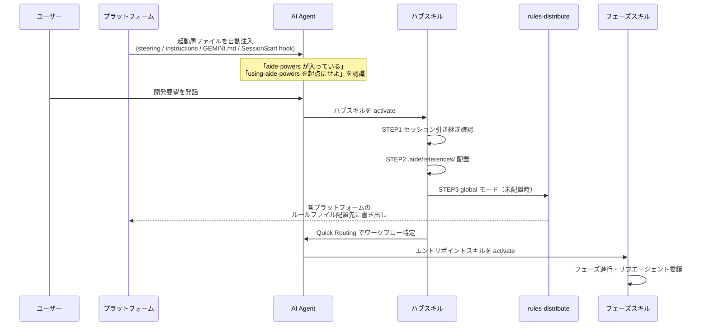

# 00. 全体アーキテクチャ

aide-powers がどう成り立っているか。

## 1. ねらい

aide-powers は、AI Agent によるドキュメント駆動開発を高度化するためのフレームワークである。
単一の AI Agent プラットフォームに閉じず、Kiro IDE / Claude Code / Cursor / OpenCode / GitHub Copilot（CLI + VSCode）/ Gemini CLI / Codex の各プラットフォームに同一のスキル群・ルール群を配布し、どの環境でも同じワークフローが回るようにすることを目的とする。

## 2. 4層構成

aide-powers の機構は次の4層に分けて理解する。

| 層 | 役割 | 主な実体 |
|---|---|---|
| ① 起動層 | プラットフォーム起動時に「aide-powers が入っている」事実をAIに伝え、ハブスキルへ誘導する | `steering/aide-powers-bootstrap.md`、`instructions/aide-powers.instructions.md`、`GEMINI.md`、`AGENTS.md`、`hooks/session-start` |
| ② ハブ層 | 全スキルの起点。ワークフロー選択・初期化・references 配置・ルール配布のトリガー | `skills/using-aide-powers/SKILL.md`、`skills/aide-powers-guide/SKILL.md` |
| ③ ルール層 | プラットフォームのルールファイル機構に常時適用ルールを配置し、AI読込ステップなしにルールを強制適用する | `skills/rules-distribute/SKILL.md`、`.aide/references/global-rules.md`、各プラットフォームの `aide-powers-global-rules.*` |
| ④ 実行層 | ワークフローを実装するスキル群、実作業を担うサブエージェント群、ツールマップ等の参照ファイル群 | `skills/`（fs-* / 共通 / メタ）、`agents/`、`.aide/references/`、`.aide/specs/{feature}/` |

各層の詳細はこの章の以降のページで扱う。

## 3. 全体図

```mermaid
flowchart TB
    subgraph BOOT["① 起動層（プラットフォーム別ブートストラップ）"]
        K[Kiro: steering/aide-powers-bootstrap.md]
        C[Claude Code: hooks/session-start]
        CO[Copilot: instructions/aide-powers.instructions.md]
        G[Gemini: GEMINI.md @import]
        AG[Codex/OpenCode: AGENTS.md]
    end

    subgraph HUB["② ハブ層（using-aide-powers / aide-powers-guide）"]
        UAP[using-aide-powers SKILL.md]
        APG[aide-powers-guide SKILL.md]
        UAP --- APG
    end

    subgraph RULE["③ ルール層（rules-distribute）"]
        RD[rules-distribute SKILL.md]
        GR[".aide/references/global-rules.md"]
        FILES[各プラットフォーム配置先<br/>.kiro/steering/ · .claude/rules/<br/>.cursor/rules/ · .github/instructions/<br/>aide-powers-global-rules.*]
        RD --> FILES
        GR --> RD
    end

    subgraph EXEC["④ 実行層"]
        SK[skills/<br/>fs-* / 共通 / メタ]
        AGN[agents/<br/>QA・実装・レビュー系]
        REF[.aide/references/<br/>tool maps · global-rules.md · progress-format]
        SPEC[.aide/specs/{feature_name}/<br/>設計書・進捗・引き継ぎ]
    end

    BOOT --> HUB
    HUB --> RULE
    HUB --> EXEC
    RULE -. 常時注入 .-> EXEC
    EXEC -. 参照 .-> REF
```

起動層からハブ層へ、ハブ層がルール層を実行し、実行層が実際の成果物（`.aide/specs/{feature_name}/`）を生み出す。
ルール層は実行層に対して「常時注入」する立場にある。AI Agent はルールファイルを能動的に読まずとも、プラットフォームがコンテキスト先頭にこれを差し込むため、ルールが強制適用される構造になっている。

## 4. 起動から実作業までの流れ

新しいセッションで aide-powers が機能するまでの基本シーケンスは以下のとおりである。




## 5. 配布単位とインストール形態

aide-powers は1つの Git リポジトリとして配布される。利用エンジニアは `git clone` した後、付属の setup スクリプトで自分の環境に展開する。インストール形態は2系統ある。

| 形態 | スクリプト | 配置先 | 用途 |
|---|---|---|---|
| グローバルインストール | `setup.bat` / `setup.sh` | `~/.kiro/`、`~/.claude/`、`~/.copilot/`、`~/.agents/` 等のホーム配下 | 個人の全プロジェクトで共通利用 |
| ローカルインストール | `setup-local.bat` / `setup-local.sh` | プロジェクト直下の `.kiro/`、`.claude-plugin/`、`.github/skills/` 等 | リポジトリにコミットしてチーム共有 |

スクリプトの実体はリポジトリの `skills/` `agents/` `hooks/` `steering/` `instructions/` `.claude-plugin/` を、選択したプラットフォームの所定の場所へコピーするだけのものである。複雑なインストーラーは持たない。

## 6. 章間の責務分担

第1章はあくまで「aide-powers がどう成り立っているか（機構面）」を扱う。
- ワークフローの中身・各フェーズスキルの詳細手順 → **第2章（02-ai-agent/）**
- 拡張手順（スキル追加・エージェント追加・リリース） → **第3章（03-how-to/）**
- aide-powers 全体の概要的な記述 → **第0章（00-overview/）**

このページは第1章のトップとして「全体俯瞰」と「以降のページへの誘導」に徹する。各論は次のとおり。

| 次に読むページ | 何が書かれているか |
|---|---|
| `01-hub-skill-activation.md` | ハブスキル方式・スキル発見メカニズム |
| `02-multiplatform.md` | マルチプラットフォーム対応の設計思想とツールマップ |
| `03-platform-bootstrap/README.md` | プラットフォーム別の起動処理（インデックス） |
| `04-skill-map.md` | フェーズスキル・共通スキル・メタスキルの全体俯瞰 |
| `05-dynamic-rules.md` | rules-distribute によるルールファイル動的生成 |
| `06-execution-units.md` | skills/ agents/ hooks/ setup などの実行部隊配置 |

## 7. 設計上の重要原則

- **ハブを1つに絞る:** ワークフロー選択・初期化のロジックを `using-aide-powers` 1スキルに集約し、AI Agent が自分でスキルを探さない構造にする（章 01-hub-skill-activation）。
- **プラットフォーム差異はツールマップで吸収する:** スキル本体は Claude Code のツール名で書き、`.aide/references/{platform}-tools.md` で各プラットフォームに対応させる（章 02-multiplatform）。
- **ルールはファイルとして配置し、AIに読ませない:** プラットフォームのルールファイル機構が常時注入する仕組みに乗せ、AIの忘却を防ぐ（章 05-dynamic-rules）。
- **実作業はサブエージェントへ委譲する:** ワークフロー本体はフェーズ管理に徹し、コード変更・設計書執筆はサブエージェントが行う（詳細は第2章）。

