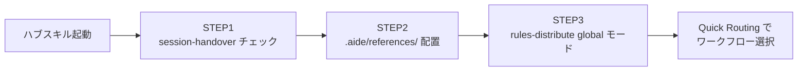
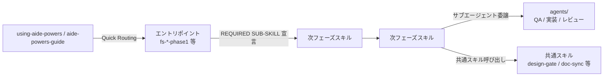

# 01. ハブスキル方式・スキル発見メカニズム

aide-powers は AI Agent に「自分で必要なスキルを探させない」設計を採る。
代わりに、会話開始時に必ず特定のスキル（ハブスキル）が読み込まれ、そこから他スキルへのルーティングが行われる。

## 1. なぜハブスキル方式なのか

AI Agent に「目的に合ったスキルを自力で見つけて使え」と指示するアプローチは、運用すると次の問題を起こす。

- スキル名やキーワードのわずかな揺れで該当スキルにたどり着けない
- 似た名前のスキルが複数ある場合、誤ったスキルを選ぶ
- 「スキルを使わずに直接やった方が速い」という自己合理化が発生する
- プラットフォーム間でスキル発見の挙動が違う（自動発見・手動指定・スラッシュコマンド等）

これらを避けるため、aide-powers は **「ハブスキルを必ず最初に通す」** 構造に固定している。
ハブスキルがワークフロー選択を司り、エントリポイントスキルを名指しで呼び出す。AI Agent は判断の余地を持たない。

## 2. ハブスキルをプラットフォームに認識させる仕組み

AI Agent は自発的にスキルを探しに行かない。「aide-powers が存在する」「最初にハブスキルを読め」という事実を、会話開始時点で AI Agent のコンテキストに差し込む必要がある。これを **起動層** と呼ぶ。

起動層は3つのパターンに分類される。

### パターン①: 常時注入型（Kiro IDE / GitHub Copilot）

プラットフォームが持つ「ルールファイル自動読み込み」機構を利用する。

```
[会話開始] → [プラットフォームがルールファイルを自動注入] → [AI Agent が「ハブスキルを呼べ」と認識]
```

- **Kiro IDE**: `~/.kiro/steering/aide-powers-bootstrap.md`（front-matter `inclusion: always`）
  - 短文「aide-powers がインストールされている。`using-aide-powers/SKILL.md` を読め」だけを注入
  - AI Agent は `discloseContext` ツールでハブスキル本体を呼び出す
- **GitHub Copilot**: `~/.copilot/instructions/aide-powers.instructions.md`（front-matter `applyTo: '**'`）
  - ワークフロー厳守・フェーズ省略禁止・直接実装禁止のルール一式を注入
  - `aide-powers-guide` スキルを通せと明示指示

**長所:** トークンコストが低い（短文のみ注入）、確実性が高い（プラットフォーム保証の自動読み込み）
**制約:** ハブスキル本体は別途スキル呼び出しが必要（1ステップ余分にかかる）

### パターン②: フック型（Claude Code / Cursor / Copilot CLI）

SessionStart hook で、ハブスキルの **全文** を AI Agent のコンテキストに注入する。

```
[セッション開始] → [SessionStart イベント発火] → [hooks.json → run-hook.cmd → session-start]
                → [SKILL.md 全文を JSON で出力] → [AI Agent が全文を認識済みで会話開始]
```

- `hooks/hooks.json` が SessionStart イベント（`startup|clear|compact`）を捕捉
- `hooks/run-hook.cmd`（ポリグロット）が `hooks/session-start`（bash）を起動
- `session-start` が `using-aide-powers/SKILL.md` を読み込み、JSON エスケープして `additionalContext` に出力
- プラットフォーム環境変数で出力フォーマットを切り替え:
  - `CURSOR_PLUGIN_ROOT` → `{"additional_context": "..."}`（Cursor）
  - `CLAUDE_PLUGIN_ROOT` → `{"hookSpecificOutput": {"additionalContext": "..."}}`（Claude Code）
  - その他 → `{"additionalContext": "..."}`（Copilot CLI / SDK標準）

**長所:** スキル呼び出し不要で即座にハブスキルの指示を実行できる（最も確実な起動経路）
**制約:** プラグインインストールが前提（手動コピーでは `${CLAUDE_PLUGIN_ROOT}` が未設定で動作しない）

### パターン③: ファイル参照型（Gemini CLI / Codex / OpenCode）

プロジェクトルートのドキュメントからインクルード・参照する。

```
[セッション開始] → [プラットフォームがルートのドキュメントを読む] → [参照先ファイルが展開される]
```

- **Gemini CLI**: `GEMINI.md` に `@./skills/using-aide-powers/SKILL.md` と記述。Gemini CLI の `@import` 機構がファイル内容を展開し、ハブスキル全文が注入される
- **Codex / OpenCode**: `AGENTS.md` に参照行「`aide-powers-global-rules.agents.md` に従え」を記述。グローバルルール内の「`using-aide-powers` を即座に activate せよ」でハブスキルへ誘導

**長所:** 設定不要（ファイルを置くだけ）、プラグイン機構に依存しない
**制約:** Gemini CLI 以外はハブスキル全文が事前注入されない（グローバルルール経由の間接誘導）

### 起動層の到達点

3パターンとも、最終的な状態は同じ:
- AI Agent がハブスキルの STEP 1〜3 と Quick Routing を認識している
- ユーザー発話に応じて適切なワークフローのエントリポイントを呼び出せる状態になっている

起動層の詳細（各プラットフォームの具体的なファイル・配置先・特殊事項）は `03-platform-bootstrap/` で扱う。

## 3. ハブスキル本体

ハブスキルは2つある。役割は同じだが、プラットフォームごとの呼ばれ方の違いを吸収するため2系統用意されている。

| スキル | 役割 |
|---|---|
| `using-aide-powers` | aide-powers の起点。STEP1〜3 の初期アクション（セッション引き継ぎ → references 配置 → rules-distribute 起動）を実行し、Quick Routing でワークフローを選択する |
| `aide-powers-guide` | 「コードを書いて」「修正して」等のプログラミング全般要求に反応するための「より広い網」。description が長文のフック文になっており、自動発見されやすい。中身は using-aide-powers と同じ初期アクション + Quick Routing |

`aide-powers-guide` は description で「AI agents alone can produce code that runs, but it often falls short ...」と強い言い回しを置いており、AI Agent がコーディング系の指示を受けたら必ずこのスキルを通すよう仕向けている。Kiro IDE の `discloseContext` のように利用可能スキル一覧から選ぶプラットフォームでは、こちらが先にヒットする場合がある。一方、ブートストラップで起点が指定されている Kiro IDE / SessionStart hook を持つ Claude Code 系では `using-aide-powers` が直接呼ばれる。どちらが先に呼ばれても、最終的な合流点は同じ Quick Routing テーブルである。

## 4. ハブスキルの初期アクション3STEP

ハブスキルが呼ばれた直後、ワークフロー選択より前に、必ず3つの初期アクションを順に実行する。



### STEP 1: セッション引き継ぎチェック
`.aide/specs/{feature_name}/session-handover.md` が存在する場合、`session-handover` スキルのプロセス2に従って前セッションの作業状態を復元する。存在しなければ STEP2 に進む。

### STEP 2: `.aide/references/` 配置
ワークスペース内の `.aide/references/` に下記11ファイルが揃っているかを確認し、欠けがあれば `skills/using-aide-powers/references/` から全ファイルをコピーする。

- `version.json`（バージョン管理用）
- `global-rules.md`
- `phase-skill-rules.md`
- `phase-skill-naming-rules.md`
- `progress-file-format.md`
- `kiro-ide-tools.md`
- `kiro-cli-tools.md`
- `copilot-tools.md`
- `vscode-copilot-tools.md`
- `codex-tools.md`
- `gemini-tools.md`

さらに `version.json` の `version`（整数）を正本（`skills/using-aide-powers/references/version.json`）と比較し、正本の方が新しければ `.aide/references/` 配下を全て上書きコピーして更新する。更新後はフラグファイル `.aide/references/.rules-updated` を作成し、STEP 3 で `rules-distribute` が配布対象を検知するシグナルとする。

プラットフォーム外（ホームディレクトリ等）のファイル参照は許可問題で失敗しうるため、ワークスペース内にコピーを置くのが規定動作である。同じワークスペースを別プラットフォームから開く可能性があるため、現在のプラットフォームに関係なく**全ツールマップ**を配置する。

### STEP 3: `rules-distribute`（global モード）
グローバルルール用ファイルが下記いずれかに存在しなければ、`rules-distribute` スキルを **global モード** で起動する。
- `.kiro/steering/aide-powers-global-rules.md`
- `.claude/rules/aide-powers-global-rules.md`
- `.cursor/rules/aide-powers-global-rules.mdc`
- `.github/instructions/aide-powers-global-rules.instructions.md`
- `aide-powers-global-rules.agents.md`

詳細は `05-dynamic-rules.md` で扱う。

## 5. Quick Routing — ハブから各ワークフローへの分岐

初期アクション完了後、ハブスキルはユーザー発話から「最初に呼ぶべきフェーズスキル」を特定する。判断テーブルは以下のとおりで、`using-aide-powers/SKILL.md` と `.aide/references/global-rules.md` の両方に同一テーブルが書かれている。

| ユーザー発話の意図 | エントリポイントスキル |
|---|---|
| アイデア段階・新規プロジェクト | `fs-planning-phase1-intake-and-init` |
| 要件が明確・設計から始める | `fs-design-phase1-user-req` |
| コードはあるが設計書がない | `fs-reverse-phase1-program` |
| コードも設計書もあり実装する | `fs-impl-phase1-gate` |
| 機能追加・仕様変更 | `fs-change-phase1-analysis` |
| バグ修正 | `fs-bugfix-phase1-analysis` |
| 内部構造改善・リファクタリング | `fs-refactoring-phase1-status` |

判定が曖昧なケースは、番号付き選択肢でユーザーに確認する。確認結果に従って該当エントリポイントを activate する。

## 6. プラットフォーム別のスキル発見・呼び出し方

ハブスキルへ到達するルートはプラットフォームごとに異なる。
最終的にハブスキルが呼ばれて Quick Routing が走る点は共通だが、その手前は5系統に分かれる。

| プラットフォーム | ハブスキル到達ルート | スキル呼び出しツール |
|---|---|---|
| Kiro IDE / Kiro CLI | `.kiro/steering/aide-powers-bootstrap.md` が常時注入 → `discloseContext` で `using-aide-powers` を activate | `discloseContext` |
| Claude Code | プラグインの `hooks/session-start` が SessionStart で `using-aide-powers/SKILL.md` の全文を `additionalContext` に注入 | `Skill` ツール |
| Cursor | SessionStart hook が同様に `additional_context` を注入（フォーマット差あり） | `Skill` ツール |
| GitHub Copilot CLI | `.copilot/skills/` のスキル自動発見 + `instructions/aide-powers.instructions.md` のグローバル指示 | `skill` ツール |
| VSCode GitHub Copilot | `.github/instructions/` で常時指示 + Skill 自動ロード（手動時は `/skill-name`） | スラッシュコマンド `/skill-name` |
| Gemini CLI | `GEMINI.md` の `@./skills/using-aide-powers/SKILL.md` で起動時インクルード | `activate_skill` |
| Codex / OpenCode | `AGENTS.md` の参照行から `aide-powers-global-rules.agents.md` 経由で誘導 + `~/.agents/skills/` のスキル | プラットフォーム標準 |

各ルートの具体ファイル・実装は `03-platform-bootstrap/` で扱う。本ページは「どこから来ても、最終的にハブスキルへ収束する」という構造的事実までを示す。

## 7. ハブスキルから先のスキル連鎖

ハブスキルは Quick Routing で**最初の**フェーズスキルを呼び出すだけで、それ以降のフェーズ進行はフェーズスキル自身が次のスキルを指定する形で連鎖する。



連鎖の指示はスキルファイル内の **`REQUIRED SUB-SKILL`** 宣言で行われる。これは「次にこのスキルを必ず activate すること」を明示する宣言であり、AI Agent はこの指示を飛ばしてはならない。スキル間の遷移を AI の判断に委ねず宣言で固定するのが、ハブスキル方式と同じ思想の延長である。

## 8. ハブスキルの初期化が二重実行されないか

ハブスキルは「ハブ層」と「ルール層」「実行層」を仲介するため、起動のたびに3つの初期 STEP を実行する。ただし STEP は冪等になっている。

| STEP | 既に処理済みかの判定 | 処理済みなら |
|---|---|---|
| STEP 1 | `session-handover.md` の有無 | 無ければそのまま STEP 2 へ |
| STEP 2 | `.aide/references/` に11ファイルが揃っており、`version.json` の version が正本と同じか | 揃っていて同バージョンならスキップ |
| STEP 3 | プラットフォームのルールファイル（`aide-powers-global-rules.*`）が存在し、`.rules-updated` フラグが無いか | 存在しフラグ無しならスキップ |

このため、複数セッションを跨いでも余分な書き込みは発生しない。
逆に、ファイルが破損・削除された場合は次回起動時に自動復旧する。

## 9. ハブスキルが読めないとき

「ワークスペースに `skills/` フォルダが無いのでスキルが使えない」と AI が判断するケースが過去に発生した。
これを禁止するため、`using-aide-powers` 内に明示的な反論ルールを置いてある。

> Activated Skill としてスキルが読み込めている時点で、aide-powers は正常に動作している。
> ワークスペースが空であっても、スキルの指示に従ってワークフローを実行すること。

ハブスキルはグローバルエリア（`~/.kiro/skills/`、`~/.claude/skills/` 等）に配置されているため、ワークスペースの状態に関係なく利用可能である。「スキルが見つからない」「フレームワークが入っていない」と判断して通常の開発支援に切り替えることは禁止されている。
