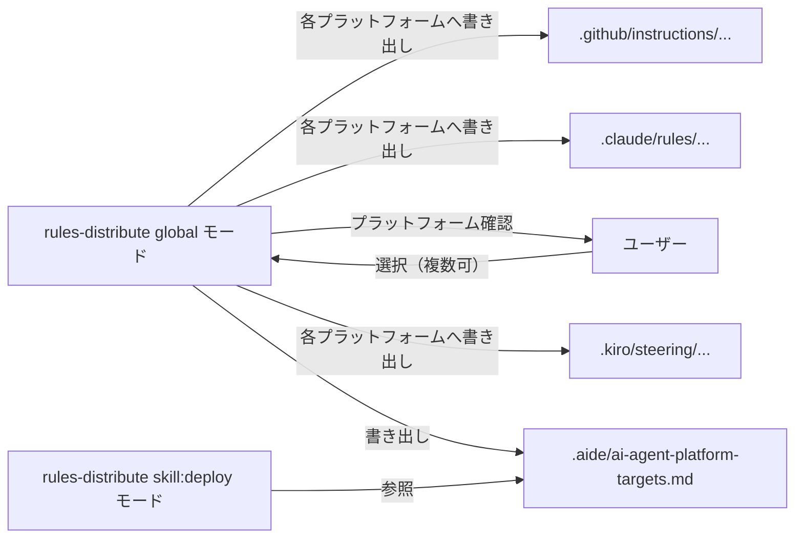

# 02. マルチプラットフォーム対応の設計思想とツールマップ

aide-powers は単一の AI Agent プラットフォームに固定されない。
スキル本体は Claude Code 系のツール名で記述しつつ、プラットフォームごとの差異は **ツールマップ** という対応表で吸収する設計を採る。

## 1. 対応プラットフォーム

aide-powers が動作対象としているのは次のとおり。

| プラットフォーム | 略号 | 主なスキル配置先 |
|---|---|---|
| Kiro IDE / Kiro CLI | Kiro | `~/.kiro/skills/` |
| Claude Code | Claude Code | `~/.claude/skills/` |
| Cursor | Cursor | プラグイン経由（`.cursor/rules/` で誘導） |
| OpenCode | OpenCode | プロジェクトルート + `AGENTS.md` |
| GitHub Copilot CLI | Copilot CLI | `~/.copilot/skills/aide-powers/` |
| VSCode GitHub Copilot | VSCode Copilot | `~/.copilot/skills/aide-powers/` + `.github/instructions/` |
| Gemini CLI | Gemini | エクステンション（`gemini extensions link .`） |
| Codex | Codex | `~/.agents/skills/aide-powers/` |

これらは setup スクリプトの選択肢としても並んでおり（`setup.bat` / `setup.sh` の 1〜7 / 1〜6 のメニュー）、配布時はどれを入れるか利用者が選ぶ。

## 2. なぜマルチプラットフォーム対応するのか

aide-powers が定義するワークフローは「ドキュメント駆動開発」という普遍的な設計手法であり、特定プラットフォームに固有のものではない。同じ手法を AI Agent 環境を変えるたびに再構築するのは無駄が大きい。
そのため aide-powers は次の方針を採る。

- **スキルの内容は1セットだけ持つ。** プラットフォームごとに別バージョンを書かない。
- **プラットフォーム差異は周辺ファイルに閉じ込める。** スキル本体は触らずに、配置先・ツール名・ルールファイル形式の差異だけを別ファイルで吸収する。
- **同じワークスペースを複数プラットフォームで開いても動くようにする。** 別プラットフォームから開かれる前提で `.aide/references/` に全ツールマップを配置する。

## 3. プラットフォーム差異が出る箇所

具体的に差異が出るのは次の4箇所である。それ以外（スキルの本文・ワークフロー手順・成果物フォーマット）は共通化されている。

| 差異の箇所 | どう吸収するか |
|---|---|
| ① ツール名（Read / Write / Bash / Skill 等） | `.aide/references/{platform}-tools.md` のツールマップで対応 |
| ② スキル呼び出し方（`Skill` / `discloseContext` / `activate_skill` / `/skill-name`） | ハブスキルとツールマップで「呼び方」を案内 |
| ③ ルールファイル配置先と形式（front-matter の有無等） | `rules-distribute` スキルがプラットフォーム別に書き分け |
| ④ 起動層の仕組み（steering / SessionStart hook / `@import` / instructions / AGENTS.md） | `03-platform-bootstrap/` で個別に記述 |

このうち①と②をまとめて受け持つのが「ツールマップ」である。

## 4. ツールマップの位置付け

スキルの本文は Claude Code のツール名（`Read`, `Write`, `Edit`, `Bash`, `Task`, `Skill` 等）で記述されている。Claude Code 以外のプラットフォームではこれらのツール名は存在しないか、別名になっている。

```
スキル本文（Claude Code 名）
   ↓ 参照
.aide/references/{platform}-tools.md
   ↓ 変換
プラットフォーム固有のツール名で実行
```

各プラットフォームで実行中の AI Agent は、スキルに記載されたツール名が自分の環境のツール名と一致しないとき、ツールマップを読み込んで変換してから実行する。
これにより、スキル本文を変更せずにプラットフォーム横断で同じ手順が実行できる。

## 5. ツールマップ一覧

`.aide/references/` 配下に配置されるツールマップは下表のとおり。

| プラットフォーム | ツールマップファイル |
|---|---|
| Kiro IDE | `.aide/references/kiro-ide-tools.md` |
| Kiro CLI | `.aide/references/kiro-cli-tools.md` |
| Copilot CLI | `.aide/references/copilot-tools.md` |
| VSCode GitHub Copilot | `.aide/references/vscode-copilot-tools.md` |
| Codex | `.aide/references/codex-tools.md` |
| Gemini CLI | `.aide/references/gemini-tools.md` |

これらのファイルは、`using-aide-powers` の STEP 2（`.aide/references/` 配置）で `skills/using-aide-powers/references/` から **全プラットフォーム分まとめて** ワークスペースにコピーされる。「自分のプラットフォーム分だけコピーする」のではなく **全部** コピーする点が重要で、これにより同じワークスペースを別プラットフォームから開いても即座に動く。

## 6. ツールマップ参照の規範化

「自分の環境にそのツールが無い」と AI Agent が早合点して機能を諦めるケースを防ぐため、グローバルルールに次の規定が置かれている。

> **必須:** スキルの指示に含まれるツール名が自分のプラットフォームのツール名と異なる場合、
> ツールマップを読み込んで正しいツール名に変換してから実行すること。
> ツールマップを読まずに「そのツールは存在しない」と判断することを禁止する。
> （`global-rules.md` 第10章）

このルールは `rules-distribute` の global モードでプラットフォームのルールファイル機構に埋め込まれるため、AI Agent は会話開始時点でこのルールを必ず読み込んだ状態になる。

## 7. ルールファイル形式の差異と吸収

ルールファイルの形式もプラットフォーム差異が大きい。`rules-distribute` スキルがこの差異をプラットフォーム別の出力テンプレートで吸収する。

差異の主な軸は次の3点である。

- 配置先パス（`.kiro/steering/` / `.claude/rules/` / `.github/instructions/` 等）
- front-matter の有無と書式（`inclusion: always` / `alwaysApply: true` / `applyTo: "**"` / 無し 等）
- 起動層との連結方式（プレーン Markdown を `AGENTS.md` / `GEMINI.md` から参照させる方式 等）

これらの実体（プラットフォームごとの配置先パスと形式特徴の対応表）は
[`05-dynamic-rules.md`](./05-dynamic-rules.md) §3.2 配置先（プラットフォーム別）を一次情報とする。
本ページは「形式差異も `rules-distribute` がワンソースから書き分けて吸収する」という事実までを示す。

## 8. 起動層の差異

起動層（プラットフォームが「aide-powers が入っている」事実をAIに伝える機構）は、プラットフォームごとに概念そのものが異なるため、本ページでは概観に留める。

| プラットフォーム | 起動層の機構 | 配布物 |
|---|---|---|
| Kiro IDE / Kiro CLI | ステアリング（常時注入される短文） | `steering/aide-powers-bootstrap.md` |
| Claude Code | SessionStart hook（プラグイン経由） | `hooks/session-start`、`hooks/hooks.json`、`.claude-plugin/plugin.json` |
| GitHub Copilot | グローバルインストラクション | `instructions/aide-powers.instructions.md` |
| Gemini CLI | `GEMINI.md` 内の `@import` | `GEMINI.md` |
| Codex / OpenCode | `AGENTS.md` の参照行 | `AGENTS.md` |

各プラットフォームの起動シーケンスと配布物の役割は `03-platform-bootstrap/README.md` 配下で個別に詳述する（プラットフォーム別ページは将来追加予定）。

## 9. プラットフォーム認識フロー

`rules-distribute` スキルは実行時に「このワークスペースで使っているプラットフォーム」をユーザーに番号付き選択肢で確認する。
複数プラットフォームを併用しているケースに対応するため、複数選択を許容する。回答結果は `.aide/ai-agent-platform-targets.md` に保存され、以後 `skill:deploy` モードがこれを読んで対象プラットフォームを特定する。



このため、aide-powers のマルチプラットフォーム対応は「実行中のプラットフォームを自動判別する」のではなく、「対応プラットフォームをユーザーが宣言し、その全てに同じ内容を書き出す」設計になっている。AI による誤判定を避けるための堅実な選択である。

## 10. 触ってはいけない領域との分離

このページで扱うのはあくまで「機構面のマルチプラットフォーム対応」までである。
- 各プラットフォームでのワークフロー進行手順 → 第2章（02-ai-agent/）
- 新プラットフォームを追加する手順 → 第3章（03-how-to/）
- ツールマップの中身（個々のツール対応表） → `.aide/references/{platform}-tools.md` の実体を直接参照

