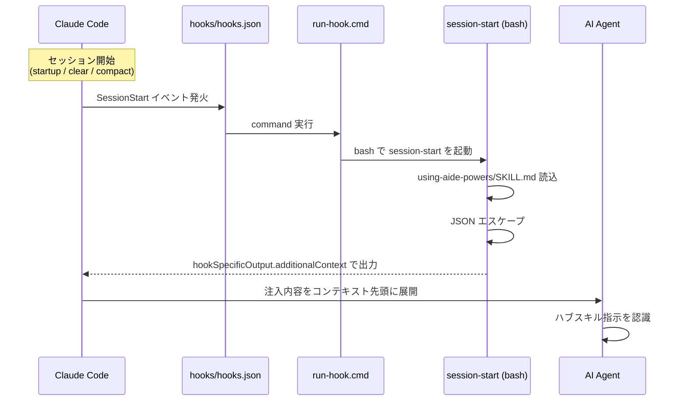

# Claude Code のブートストラップ

Claude Code は SessionStart hook 機構（プラグイン経由）を使って起動層を実装する。
ハブスキルの全文が会話開始時に AI Agent のコンテキストへ自動注入される、aide-powers のメインターゲットプラットフォームである。

## 1. インストール先パス

`setup.bat` / `setup.sh` の選択肢「2. Claude Code」を選ぶと、配布物は以下に配置される。

| 配布物 | グローバル配置先 | ローカル配置先（`setup-local.*`） |
|---|---|---|
| `skills/` | `~/.claude/skills/` | `{project}/skills/` |
| `agents/` | `~/.claude/agents/` | `{project}/agents/` |
| `hooks/` | `~/.claude/hooks/` | `{project}/hooks/` |
| `.claude-plugin/plugin.json` | （プラグインインストール時にプラグイン領域へ） | `{project}/.claude-plugin/plugin.json` |
| `.claude-plugin/marketplace.json` | （プラグインインストール時にプラグイン領域へ） | `{project}/.claude-plugin/marketplace.json` |

最も確実なのは **プラグインインストール** で、その場合は次のコマンドで配布物一式が Claude Code のプラグイン領域に展開される。

```
claude plugin install <repository-url-or-local-path>
```

`setup.bat` / `setup.sh` の手動コピー方式は skills/ と agents/ は機能するが、`hooks/` は SessionStart として登録されない（次節参照）。setup スクリプトの該当箇所はその旨を警告メッセージで案内する。

## 2. 起動メカニズム



### `hooks/hooks.json` のトリガー

```json
{
  "hooks": {
    "SessionStart": [
      {
        "matcher": "startup|clear|compact",
        "hooks": [
          {
            "type": "command",
            "command": "\"${CLAUDE_PLUGIN_ROOT}/hooks/run-hook.cmd\" session-start",
            "async": false
          }
        ]
      }
    ]
  }
}
```

`SessionStart` の3つのサブトリガー（`startup` / `clear` / `compact`）すべてに反応し、`run-hook.cmd session-start` を同期実行する。`async: false` のため、AI Agent は注入が完了するまで応答を開始しない。

`${CLAUDE_PLUGIN_ROOT}` は Claude Code がプラグインインストール時に設定する環境変数で、プラグインのインストール先パスを指す。手動コピーではこの環境変数が設定されないため、フックが発火してもパス解決に失敗する。

### `hooks/run-hook.cmd`（ポリグロット起動）

`run-hook.cmd` は cmd と bash 両方から実行できるポリグロットスクリプト。先頭に `: << 'CMDBLOCK'` を置き、bash からは「ヒアドキュメントとしてスキップする無効ブロック」、cmd からは「通常の `@echo off` 開始」として解釈させる。
Windows 環境では `Git for Windows` の `bash.exe` を順次探し、見つかれば `session-start` を bash で実行する。Unix 環境では cmd ブロックがスキップされ、末尾の `exec bash` で同じスクリプトに到達する。

### `hooks/session-start`（本体）

bash スクリプト。次の処理を行う。

1. `using-aide-powers/SKILL.md` を読み込む
2. JSON 用にエスケープ（バックスラッシュ・ダブルクォート・改行・タブ）
3. プラットフォーム判別環境変数を見て出力フォーマットを切り替える

| 環境変数 | プラットフォーム | 出力フォーマット |
|---|---|---|
| `CURSOR_PLUGIN_ROOT` | Cursor | `additional_context`（snake_case 単一フィールド） |
| `CLAUDE_PLUGIN_ROOT`（`COPILOT_CLI` 未設定） | Claude Code | `hookSpecificOutput.additionalContext`（ネスト） |
| `COPILOT_CLI`（または上記いずれもなし） | Copilot CLI / SDK 標準 | `additionalContext`（トップレベル単一フィールド） |

Claude Code 向けの出力例:

```json
{
  "hookSpecificOutput": {
    "hookEventName": "SessionStart",
    "additionalContext": "<EXTREMELY_IMPORTANT>You have aide-powers installed....</EXTREMELY_IMPORTANT>"
  }
}
```

`additionalContext` の冒頭は `<EXTREMELY_IMPORTANT>` タグで囲み、ハブスキル本文を「他スキル発見の起点」として位置付ける文言とともに注入する。

### Skill ツールの呼び方

Claude Code でのスキル呼び出しは **`Skill`** ツール。スキル本文（Claude Code 標準のツール名で記述）はそのまま動作するため、Claude Code のみツールマップを参照しなくても動く。

## 3. ルール配置先

| モード | 配置ファイル | 形式特徴 |
|---|---|---|
| global | `.claude/rules/aide-powers-global-rules.md` | front-matter なし（無条件適用） |
| skill | `.claude/rules/aide-powers-skill--{skill-name}--{YYYYMMDDHHmm}.md` | front-matter なし |

Claude Code のルールファイル機構は `.claude/rules/` 配下のファイルを会話開始時に自動で読み込むため、front-matter による条件指定は不要。`rules-distribute` は Claude Code 配置時にプレーン Markdown のまま書き出す。

## 4. 特殊事項

### 4.1 プラグイン形式の優位性

Claude Code は手動コピーでも skills/ と agents/ は使えるが、`hooks/` 経由の SessionStart 注入は「プラグインインストール」した場合のみ動作する。プラグインインストールは `${CLAUDE_PLUGIN_ROOT}` の設定とフック登録を Claude Code 自身が行うため、aide-powers の起動層が確実に発火する。手動コピー時の制約は setup スクリプトのメッセージで明示される。

### 4.2 `additionalContext` 注入の独自性

他のプラットフォームではブートストラップに「ハブスキルを読め」という**指示**だけを注入するのに対し、Claude Code 経由では `session-start` がハブスキルの**全文**を注入する。これにより、`Skill` ツール呼び出し前から AI Agent はハブスキルの STEP 1〜3 と Quick Routing を知った状態になる。スキル呼び出しのオーバーヘッドが省け、最も確実な起動経路となる。

### 4.3 bash 5.3+ のヒアドキュメントハング回避

`session-start` は printf でフォーマットを構築する。これは bash 5.3+ で発生するヒアドキュメントのハング問題を避けるため。スクリプト内のコメントで参照課題が示されている。

### 4.4 SKILL.md パス探索

`session-start` は `${PLUGIN_ROOT}/skills/using-aide-powers/SKILL.md` と `${PLUGIN_ROOT}/skills/aide-powers/using-aide-powers/SKILL.md` の2経路を順に試す。前者はプラグインインストール時のレイアウト、後者は別ツリーで配置された場合の救済経路。どちらも見つからない場合は注入内容にエラーメッセージを乗せて出力する（フック自体は失敗扱いにしない）。

### 4.5 `marketplace.json`（ローカルマーケットプレイス定義）

`.claude-plugin/marketplace.json` はローカル開発用のマーケットプレイス定義ファイル。`claude plugin install` でローカルパスからインストールする場合に Claude Code が参照する。プラグイン名・説明・バージョン・ソースパス（`"source": "./"`）が記載されており、リポジトリルートをそのままプラグインソースとして認識させる。`plugin.json` がプラグインメタデータ（名前・バージョン・ライセンス）、`marketplace.json` がマーケットプレイス登録情報（owner・plugins 配列）と役割が分かれている。

### 4.6 旧構造クリーンアップ

setup スクリプトは `~/.claude/skills/` 配下にフラット化前のワークフローフォルダ（`design-workflow/` 等）が残っていれば自動削除する。Kiro と同じ `cleanup_legacy_skills` 関数を共有しており、Claude Code 配置時にも呼ばれる。
