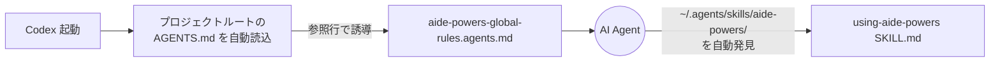

# Codex のブートストラップ

Codex は OpenAI 系の AI Agent で、`~/.agents/skills/` 配下のスキルをネイティブに発見・実行できる。
起動層としてはプロジェクトルートの `AGENTS.md` を会話開始時に読み込む仕様を持ち、aide-powers はこれを利用してハブスキルへ誘導する。

## 1. インストール先パス

`setup.bat` / `setup.sh` の選択肢「5. Codex」を選ぶと、配布物は以下に配置される。

| 配布物 | 配置先 |
|---|---|
| `skills/` | `~/.agents/skills/aide-powers/` |
| `agents/` | `~/.agents/agents/aide-powers/` |
| `AGENTS.md` | プロジェクトルート（既存ファイルがあれば参照行のみ追記） |
| `aide-powers-global-rules.agents.md` | プロジェクトルート（`rules-distribute` が動的生成） |
| `aide-powers-skill--*.agents.md` | プロジェクトルート（`rules-distribute` が動的生成、スキル実行中のみ存在） |

`hooks/`、`steering/`、`instructions/`、`.claude-plugin/`、`GEMINI.md` は Codex では使用しない。Codex は SessionStart hook 機構を持たないため、起動層は `AGENTS.md` 1ファイルに集約される。

## 2. 起動メカニズム



### `AGENTS.md` の参照行

`AGENTS.md` 末尾には、`rules-distribute` が追記した参照行が含まれる。

```markdown
<!-- [aide-powers:auto-generated] 以下は rules-distribute スキルにより自動追記。 -->

以下のファイルのルールに従うこと: aide-powers-global-rules.agents.md
```

Codex はこの行を見て `aide-powers-global-rules.agents.md` を読み込む。グローバルルール内の Quick Routing と「`using-aide-powers` を即座に activate せよ」の指示により、ハブスキルへの誘導が完了する。

### スキルのネイティブ発見

Codex は `~/.agents/skills/` 配下のスキルを自動的に発見・利用可能にする。aide-powers のスキルは `~/.agents/skills/aide-powers/` に配置されるため、Codex はこのフォルダ全体を「aide-powers エージェント」として認識し、配下の各スキルディレクトリ（`using-aide-powers/`、`fs-design-phase1-user-req/` ほか）を呼び出し可能なスキルとして登録する。

ユーザーが `AGENTS.md` 経由で `using-aide-powers` を活用するよう指示されると、Codex はネイティブ発見済みのスキルからハブスキルを呼び出して STEP 1〜3 を実行する。

### サブエージェント定義

`~/.agents/agents/aide-powers/` 配下にはQAレビューアー・ホワイトリスト3エージェント等の共通エージェント定義が並ぶ。Codex の Task / Sub-agent 機構が `agents/` 配下の `*.md` ファイルを名前付きエージェントとして登録するため、`micro-impl-agent`・`design-review-agent`・`code-review-agent`・各QAレビューアーがフェーズスキルから呼び出せるようになる。

## 3. ルール配置先

| モード | 配置ファイル | 形式特徴 |
|---|---|---|
| global | プロジェクトルート `aide-powers-global-rules.agents.md` + `AGENTS.md` の参照行 | プレーン Markdown |
| skill | プロジェクトルート `aide-powers-skill--{skill-name}--{YYYYMMDDHHmm}.agents.md` + 必要に応じ参照行 | プレーン Markdown |

OpenCode と Codex で `aide-powers-global-rules.agents.md` を共有する点に注意。`rules-distribute` は両プラットフォームを `.aide/ai-agent-platform-targets.md` で識別するが、出力ファイルの実体は1つしか作らない。プロジェクトを Codex と OpenCode の両方で開いても、同じルールファイルが両方から読まれる。

## 4. 特殊事項

### 4.1 ネイティブスキル発見の威力

Codex は SessionStart hook やステアリング常時注入のような「明示的注入機構」を持たないが、`~/.agents/skills/` 配下のスキルをネイティブに発見・実行できる仕様により、aide-powers のような大規模スキル群を効率的に扱える。`AGENTS.md` の参照行とグローバルルールの組み合わせで「最初に `using-aide-powers` を呼べ」と指示すれば、後はスキル機構が確実に動く。

### 4.2 共通の `agents/` 配置

Codex の `~/.agents/agents/aide-powers/` 配下に置かれた共通エージェント定義は、Codex のネイティブな Sub-agent 機構（カスタムエージェント呼び出し）から `name` 指定で起動可能になる。ハブスキル方式と組み合わせると、フェーズスキルがエージェントを `name` で名指し呼び出ししたときに、Codex 側でも適切な定義が読み込まれる。

### 4.3 `aide-powers-global-rules.agents.md` の独自拡張子

`.agents.md` という拡張子は、Codex / OpenCode 専用のルールファイル形式の慣習。Markdown としては通常通り読めるが、ファイル名で「AGENTS.md 系の参照対象」であることを示す目印になる。`rules-distribute` がこの拡張子で書き出すことで、`AGENTS.md` から参照する側の AI Agent も「これは aide-powers が動的生成したルールファイル」と判別しやすくなる。

### 4.4 旧構造クリーンアップ

setup スクリプトは Codex 配置時、`~/.agents/skills/aide-powers/` 配下にフラット化前のワークフローフォルダ（`design-workflow/` 等）が残っていれば自動削除する。Kiro / Claude Code と同じ `cleanup_legacy_skills` 関数で処理されるため、旧版からの移行も `setup.bat` / `setup.sh` の再実行だけで完結する。

### 4.5 OpenCode との分担

Codex と OpenCode は起動層（`AGENTS.md` 経由）とルール配布形式（`.agents.md`）を共有するが、スキル本体の置き場所が異なる。Codex は `~/.agents/skills/aide-powers/` のグローバルエリア、OpenCode はワークスペース内のローカル領域を主に使う。プラットフォーム判別は `.aide/ai-agent-platform-targets.md` で行うが、両方を同時に有効にしたワークスペースでは1つの `aide-powers-global-rules.agents.md` がそのまま両方から読まれる仕組みになっている。
