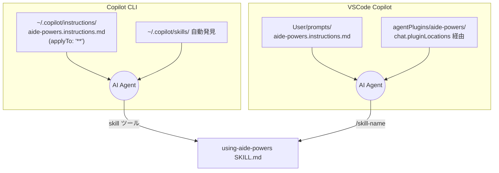

# GitHub Copilot CLI / VSCode Copilot のブートストラップ

GitHub Copilot は CLI 版とエディタ版（VSCode 拡張）の両方が aide-powers の対象である。
両者は配布先こそ別だが、共通の起動層（インストラクション機構）で aide-powers へ誘導する。

## 1. インストール先パス

`setup.bat` / `setup.sh` の選択肢「3. GitHub Copilot（CLI + VSCode）」を選ぶと、CLI 用と VSCode 用が一括でセットアップされる。

### 1.1 GitHub Copilot CLI

| 配布物 | 配置先 |
|---|---|
| `skills/` | `~/.copilot/skills/`（フラット直下に展開） |
| `agents/` | `~/.copilot/agents/` |
| `hooks/` | `~/.copilot/hooks/` |
| `instructions/aide-powers.instructions.md` | `~/.copilot/instructions/aide-powers.instructions.md` |

### 1.2 VSCode GitHub Copilot

| 配布物 | 配置先 |
|---|---|
| `instructions/aide-powers.instructions.md` | `%APPDATA%\Code\User\prompts\aide-powers.instructions.md` |
| `.claude-plugin/`、`hooks/`、`skills/`、`agents/` | `%APPDATA%\Code\agentPlugins\aide-powers\`（4配下にコピー） |
| 設定（`settings.json`） | `chat.pluginLocations` に `agentPlugins\aide-powers` を登録、`chat.plugins.enabled` を `true` に |
| 設定（`settings.json` Linux/Mac） | `chat.hookFilesLocations` に `~/.copilot/hooks` を登録 |

setup スクリプトは PowerShell（Windows）または `sed`（Linux/Mac）を使って既存 `settings.json` の JSON を破壊せずに該当キーを追記する。設定キーが既に存在する場合は値だけを更新する。

## 2. 起動メカニズム



### 2.1 インストラクション常時適用

`instructions/aide-powers.instructions.md` の冒頭には次の front-matter が置かれる。

```yaml
---
applyTo: '**'
---
```

`applyTo: '**'` は「すべてのコンテキストで常時適用」を意味し、Copilot は会話開始時にこのファイルの内容を必ずコンテキスト先頭に注入する。本文には次の規範が並ぶ。

- ワークフロー厳守（`aide-powers-guide` を必ず通せ）
- フェーズ省略禁止
- 直接実装禁止
- 成果物配置（`.aide/specs/{feature_name}/`）
- ユーザー対応ルール（番号付き選択肢、user-profile.md 参照等）
- 違反検知時の挙動
- トークン節約（会話応答のみ、ファイル書き込みは通常品質）

ハブスキル名 `aide-powers-guide` をインストラクションで指定することで、Copilot のスキル自動発見と組み合わせて、ハブスキルが確実に呼ばれる導線を作っている。

**注意:** Copilot 向けのハブスキルは `aide-powers-guide` という名前で配布される。Claude Code / Kiro 向けの `using-aide-powers` と機能は同一だが、Copilot のスキル自動発見機構（description を読んで呼び出し判断する仕組み）に最適化した詳細な description を持つ別ファイルとして存在する（`README.md` §5.1 参照）。

### 2.2 スキル発見と呼び出し

| プラットフォーム | スキル発見 | スキル呼び出し |
|---|---|---|
| Copilot CLI | `~/.copilot/skills/` 配下を自動発見 | `skill` ツール |
| VSCode Copilot | `chat.pluginLocations` で登録した `agentPlugins/aide-powers/skills/` を自動発見 | `skill` ツール（自動）またはスラッシュコマンド `/skill-name`（手動） |

Copilot は Claude Code と異なりスキルを SessionStart で全文注入はしない。代わりにスキルを「機能」として扱い、必要なときに呼び出す。インストラクションの `applyTo: '**'` で「コーディング系の要求が来たら必ず `aide-powers-guide` を通せ」と AI Agent に指示することで、スキル呼び出しの確度を担保する。

### 2.3 VSCode の `chat.pluginLocations`

VSCode の Copilot Chat は、`settings.json` の `chat.pluginLocations` に列挙されたパスを「エージェントプラグイン配置先」として認識する。setup スクリプトは `%APPDATA%\Code\agentPlugins\aide-powers\` を登録し、ここに `.claude-plugin/`・`hooks/`・`skills/`・`agents/` をまとめてコピーする。`chat.plugins.enabled: true` も併せて設定するため、VSCode 再起動後にプラグイン配下のスキル・エージェントが自動で利用可能になる。

### 2.4 VSCode の `chat.hookFilesLocations`（Linux/Mac）

Linux/Mac の `setup.sh` は `~/.config/Code/User/settings.json`（または macOS の `~/Library/Application Support/Code/User/settings.json`）の `chat.hookFilesLocations` に `~/.copilot/hooks` を追加する。これにより VSCode Copilot Chat が hooks を検索して SessionStart 注入を受け取れるようになる。Windows ではこの登録は不要（プラグイン配下の `hooks/` が自動的に発見される）。

## 3. ルール配置先

| モード | 配置ファイル | 形式特徴 |
|---|---|---|
| global | `.github/instructions/aide-powers-global-rules.instructions.md` | front-matter `applyTo: "**"` |
| skill | `.github/instructions/aide-powers-skill--{skill-name}--{YYYYMMDDHHmm}.instructions.md` | front-matter `applyTo: "**"` |

`rules-distribute` は Copilot 配置時、ファイル拡張子を `.instructions.md`、front-matter を `applyTo: "**"` に固定する。これは VSCode Copilot と Copilot CLI 両方の Instructions 機構が `.github/instructions/*.instructions.md` をワークスペース固有の指示として読み込むため。aide-powers のインストラクションファイル（起動層用）と、`rules-distribute` のグローバルルール／スキルルール（ルール層用）は同じディレクトリ・同じ形式で並列に存在する。

## 4. 特殊事項

### 4.1 起動層は2系統並走

Copilot は他プラットフォームと違い、起動層が「インストラクション（規範文書）」と「スキル自動発見」の2系統で並走する。インストラクションだけだとスキル呼び出しを忘れる懸念があり、スキル発見だけだと規範が効きにくい。両方を組み合わせることで、AI Agent が会話冒頭に規範を受け取り、ユーザー発話に応じて適切なスキルへ自動的に到達する。

### 4.2 SessionStart hook も併用

`~/.copilot/hooks/` に配布された `session-start` スクリプトは、Copilot CLI が SessionStart イベント仕様を持つバージョン（v1.0.11+）であれば発火する。スクリプト内の環境変数判定（`COPILOT_CLI` 設定時）が SDK 標準の `additionalContext` フィールドで JSON 出力するため、ハブスキル本文の注入も追加で行われる。インストラクション + スキル発見 + SessionStart hook の3段構えになる。

### 4.3 VSCode `User/prompts/` への配置

VSCode Copilot は `.github/instructions/` をワークスペース固有として、`User/prompts/` をユーザー全体として扱う。`aide-powers.instructions.md` を `User/prompts/` にも配置することで、ワークスペースに `.github/instructions/` が無くてもグローバル方針が効くようにしている。`%APPDATA%\Code\User\prompts\` は VSCode のユーザープロンプト保管領域。

### 4.4 PowerShell による settings.json 編集

Windows の `setup.bat` は PowerShell でワンライナーを実行して `settings.json` の JSON を編集する。`Get-Content | ConvertFrom-Json` で読み込み、`Add-Member` で `chat.pluginLocations` と `chat.plugins.enabled` を追加し、`ConvertTo-Json -Depth 10 | Set-Content -Encoding UTF8` で書き戻す。既存設定は破壊しない。

### 4.5 `cleanup_legacy_skills` の対象範囲

setup スクリプトは Copilot 配置時にも旧構造クリーンアップを実行し、`~/.copilot/skills/` 配下の `design-workflow/` 等を削除する（CLI と VSCode で同じ `~/.copilot/skills/` を共有するため）。

### 4.6 references ファイルのバージョン管理

`aide-powers-guide/SKILL.md` の STEP 2 では `.aide/references/` に9つの参照ファイルを配置すると記載されているが、実際には `version.json` を含む10ファイルが管理対象である。`using-aide-powers/SKILL.md`（Claude Code / Kiro 向け）側では `version.json` を含む完全なリストが記述されている。`aide-powers-guide` 側のファイルリスト記述は簡略化されているが、正本の `references/` ディレクトリ全体をコピーする動作に影響はない（全ファイルをコピーするため）。

実際の `.aide/references/` 管理対象ファイル一覧:
- `version.json`（バージョン管理用）
- `global-rules.md`
- `phase-skill-rules.md`
- `phase-skill-naming-rules.md`
- `progress-file-format.md`
- `kiro-ide-tools.md`
- `kiro-cli-tools.md`
- `copilot-tools.md`
- `vscode-copilot-tools.md`
- `codex-tools.md`
- `gemini-tools.md`
