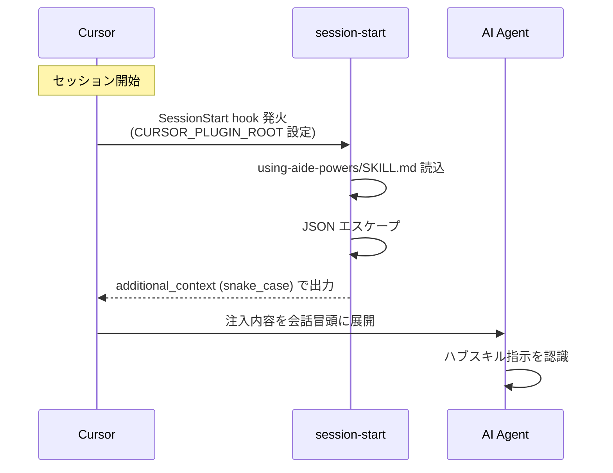

# Cursor のブートストラップ

Cursor は SessionStart hook 機構を Claude Code と互換的に持ちつつ、ルールファイルは独自の `.cursor/rules/` 配下に配置する。
本ページでは aide-powers が Cursor 上でどのように発見・起動されるかを示す。

## 1. インストール先パス

Cursor は専用 setup オプションを持たず、配布物の物理配置は Claude Code と同じ `hooks/` を共有する。プラグイン経由インストールが基本となる。

| 配布物 | 配置先 |
|---|---|
| `skills/` | プラグインインストール先の `skills/` |
| `agents/` | プラグインインストール先の `agents/` |
| `hooks/session-start` | プラグインインストール先の `hooks/`（`hooks.json` 経由で登録） |
| ルールファイル | `.cursor/rules/`（`rules-distribute` が動的生成） |

スキルとエージェントは Claude Code 共通の配布物で、Cursor も同じ配置からそれを参照する。

## 2. 起動メカニズム



### Claude Code との出力フォーマット差

Cursor は SessionStart 時に環境変数 `CURSOR_PLUGIN_ROOT` を設定する（Claude Code との両方を設定する場合もある）。`session-start` スクリプトはこれを最優先で検出し、出力 JSON のフィールド名を Cursor 仕様の **snake_case** に切り替える。

```json
{
  "additional_context": "<EXTREMELY_IMPORTANT>You have aide-powers installed....</EXTREMELY_IMPORTANT>"
}
```

Claude Code は `hookSpecificOutput.additionalContext`（camelCase + ネスト）、Cursor は `additional_context`（snake_case + フラット）。同じハブスキル本文を載せるが、外側のキー名が違う。スクリプトは1ファイルでこの両方を出し分ける（`claude-code.md` の§2 表参照）。

注入内容自体（`<EXTREMELY_IMPORTANT>` タグ + ハブスキル全文）は Claude Code と同一。

### Skill ツールの呼び方

Cursor のスキル呼び出しツールは Claude Code 互換で **`Skill`**。スキル本文を Claude Code 標準のツール名のまま実行できる。ツールマップは現時点では Cursor 専用版を持たず、Claude Code のツール表記がそのまま通る前提でハブスキルへ引き渡す。

## 3. ルール配置先

| モード | 配置ファイル | 形式特徴 |
|---|---|---|
| global | `.cursor/rules/aide-powers-global-rules.mdc` | front-matter `alwaysApply: true` + `description` |
| skill | `.cursor/rules/aide-powers-skill--{skill-name}--{YYYYMMDDHHmm}.mdc` | front-matter `alwaysApply: true` |

拡張子が **`.mdc`**（Cursor Rules 専用形式）である点が他プラットフォームと異なる。`rules-distribute` は Cursor 配置時に `.md` ではなく `.mdc` で書き出し、front-matter には `alwaysApply: true` と `description` を入れる。`alwaysApply` 指定により、Cursor の AI Agent はファイルを能動的に読まなくてもこのルールを会話冒頭で受け取る。

## 4. 特殊事項

### 4.1 SessionStart hook の互換性

Cursor は Claude Code 互換の SessionStart hook を実装しており、`hooks/hooks.json` の `SessionStart` トリガー定義（`startup|clear|compact`）と `${CLAUDE_PLUGIN_ROOT}` 変数参照をそのまま受け付ける。`run-hook.cmd` のポリグロット起動も同じく動作する。`session-start` スクリプト側で出力 JSON のキー名だけを切り替える設計のため、Cursor 専用の hook ファイルを別途用意する必要はない。

### 4.2 ハブスキルの起点は同一

注入後の到達点は Claude Code と完全に同じ。AI Agent はハブスキル本文（STEP 1〜3 + Quick Routing）を認識した状態で会話を開始する。後段の `rules-distribute` 起動・ワークフロー選択ロジックも共通。

### 4.3 ルールファイル形式の独自性

`.cursor/rules/*.mdc` は Cursor 独自の Rules 形式で、`alwaysApply` の他に「ファイル名パターンに該当した時のみ適用」「タグ指定で手動起動」などの細かい挙動制御が可能。aide-powers では常時適用（`alwaysApply: true`）に固定して使う。スキル一時ルールも同形式で、ファイル名のプレフィックス `aide-powers-skill--` で自動生成ファイルを識別する（`05-dynamic-rules.md` 参照）。

### 4.4 自動セットアップの簡便さ

Cursor は `setup.bat` / `setup.sh` の選択肢に独立項目を持たない。実運用では Claude Code 用にプラグインインストールするか、ルールファイル機構（`.cursor/rules/`）を `rules-distribute` の global モード実行で初期化することで利用開始する。プロジェクトを開いた段階で AI Agent が `aide-powers-guide` をフックして初期化を走らせれば、自動的に必要ファイルが配置される。
