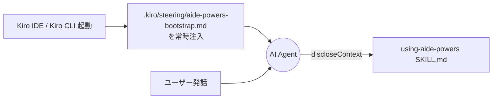

# Kiro IDE / Kiro CLI のブートストラップ

Kiro IDE とその CLI 版（Kiro CLI）は、ステアリング機構（`.kiro/steering/`）を使って起動層を実装する。
本ページでは、aide-powers が Kiro 上でどのように発見・起動されるかを示す。

## 1. インストール先パス

`setup.bat` / `setup.sh` の選択肢「1. Kiro IDE / Kiro CLI」を選ぶと、配布物は以下に配置される。

| 配布物 | グローバル配置先 | ローカル配置先（`setup-local.*`） |
|---|---|---|
| `skills/` | `~/.kiro/skills/` | `{project}/.kiro/skills/` |
| `agents/` | `~/.kiro/agents/` | `{project}/.kiro/agents/` |
| `steering/aide-powers-bootstrap.md` | `~/.kiro/steering/aide-powers-bootstrap.md` | `{project}/.kiro/steering/aide-powers-bootstrap.md` |
| `AGENTS.md`（ローカルのみ） | — | `{project}/AGENTS.md`（既存があれば確認後に上書き） |

`hooks/`、`instructions/`、`.claude-plugin/`、`GEMINI.md` は Kiro セットアップでは配置しない。Kiro はステアリング機構だけで成立するため、フック・プラグインメタデータは不要。

## 2. 起動メカニズム



### ステアリング常時注入

`steering/aide-powers-bootstrap.md` の冒頭には次の front-matter が置かれる。

```yaml
---
inclusion: always
---
```

`inclusion: always` 指定により、Kiro IDE は会話開始時にこのファイルの内容を AI Agent のコンテキストに必ず差し込む。
本文は数行で、次のことだけを伝える。

- aide-powers がインストールされていること
- ハブスキル `skills/using-aide-powers/SKILL.md` を読み込んで指示に従うこと

短文に絞っている理由は、ステアリングは会話のたびに毎回注入されるため、長文だとトークンを浪費し続けるから。実際のワークフロー知識はすべてハブスキル側に置き、ブートストラップは「ハブスキルへの誘導」だけを担う。

### Skill ツールの呼び方

Kiro IDE / Kiro CLI ではスキル呼び出しツールは **`discloseContext`** である。Claude Code 系の `Skill` とは名称が異なる。

ハブスキル本文や各フェーズスキルは Claude Code のツール名で書かれているが、Kiro 用のツールマップ `.aide/references/kiro-ide-tools.md` / `.aide/references/kiro-cli-tools.md` を読むことで `Skill` → `discloseContext` の変換が AI Agent 自身に委ねられる（`02-multiplatform.md` 参照）。

## 3. ルール配置先

`rules-distribute` スキル（`05-dynamic-rules.md` 参照）が global / skill モードでルールファイルを配置する先は次のとおり。

| モード | 配置ファイル | 形式特徴 |
|---|---|---|
| global | `.kiro/steering/aide-powers-global-rules.md` | front-matter `inclusion: always` |
| skill | `.kiro/steering/aide-powers-skill--{skill-name}--{YYYYMMDDHHmm}.md` | front-matter `inclusion: always` |

ステアリング機構をルール配布の場としても使う形になっており、ブートストラップファイルとルールファイルが同じ `.kiro/steering/` フォルダに同居する。両者は次の点で区別される。

- ブートストラップ: `aide-powers-bootstrap.md`（短文・恒久配置・setup スクリプトで配置）
- グローバルルール: `aide-powers-global-rules.md`（全文・恒久配置・`rules-distribute` の global モードで配置）
- スキルルール: `aide-powers-skill--*.md`（スキル固有ルール・スキル実行中のみ存在・`rules-distribute` の skill モードで配置）

## 4. 特殊事項

### 4.1 Kiro IDE と Kiro CLI で構成は同一

GUI を持つ Kiro IDE と、コマンドライン版の Kiro CLI は、設定ディレクトリ `~/.kiro/` を共有する。スキル・エージェント・ステアリングの配置先も同じ。配布物の挙動も共通で、`setup.bat` / `setup.sh` の「1. Kiro IDE / Kiro CLI」は両方を同時にセットアップする扱いになっている。ただしツールマップは IDE 用と CLI 用で別ファイル（`kiro-ide-tools.md` / `kiro-cli-tools.md`）に分けてあり、必要に応じて使い分けられる。

### 4.2 既存ファイル上書きの確認

`setup.bat` / `setup.sh` は `aide-powers-bootstrap.md` がすでに存在する場合、ユーザーに `[y/N]` で上書き可否を確認する。ユーザーがブートストラップを書き換えていた場合の保護策。同様に `skills/`、`agents/` ディレクトリも既存があればサブアイテム単位で上書きする挙動になっている。

### 4.3 旧構造クリーンアップ

setup スクリプトは `~/.kiro/skills/` 配下にフラット化前のワークフローフォルダ（`design-workflow/` 等）が残っている場合、自動で削除する（`cleanup_legacy_skills` 関数）。aide-powers の以前のディレクトリ構成からの移行を支援する処理で、新規環境では何もしない。

### 4.4 旧 kiro-agent からの移行

aide-powers の前身プロジェクトである kiro-agent を使っていたワークスペースには、`cleanup-kiro-agent.bat` が用意されている。古いエージェント定義ファイルや旧グローバルルールを安全に削除するスクリプトで、Kiro 環境からの移行直後に1回だけ実行する。

### 4.5 ローカルインストール時の AGENTS.md 配置

`setup-local.*` の Kiro IDE オプションは、`.kiro/` 配下の3点（`skills/`、`agents/`、`steering/`）に加えて、プロジェクトルートに `AGENTS.md` も配置する。これは `rules-distribute` の OpenCode / Codex 向け配布先と兼用する設計のため、Kiro ローカルインストールしたプロジェクトは Codex / OpenCode からも自動的に動くようになっている。
