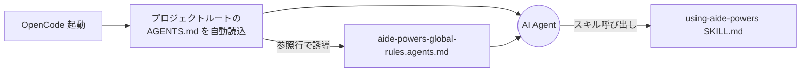

# OpenCode のブートストラップ

OpenCode は、プロジェクトルートに置かれた `AGENTS.md` を会話開始時に自動読み込みする仕様を持つ。
aide-powers はこの仕様に乗せて、`AGENTS.md` 経由でハブスキル誘導とルール適用を行う。

## 1. インストール先パス

OpenCode は `setup.bat` / `setup.sh` の独立した選択肢を持たず、ルール配布機構（`rules-distribute`）と `AGENTS.md` の参照行追記によって動作環境を整える。

| 配布物 | 配置先 |
|---|---|
| `skills/` | プロジェクトに配置されたコピー、または共有エリア |
| `agents/` | 同上 |
| `AGENTS.md` | プロジェクトルート（既存ファイルがあれば参照行のみ追記） |
| `aide-powers-global-rules.agents.md` | プロジェクトルート（`rules-distribute` が動的生成） |
| `aide-powers-skill--*.agents.md` | プロジェクトルート（`rules-distribute` が動的生成、スキル実行中のみ存在） |

`hooks/`、`steering/`、`instructions/` は OpenCode では使用しない。

`setup-local.bat` / `setup-local.sh` の Kiro IDE オプションを実行すると、副作用として `AGENTS.md` がプロジェクトルートに配置される。これは OpenCode / Codex 向け配布先と兼用する設計のため、Kiro 用ローカルセットアップが終わった時点で OpenCode からも動く状態になる。

## 2. 起動メカニズム



### `AGENTS.md` の参照行

OpenCode が `AGENTS.md` を読むと、ファイル末尾付近に `rules-distribute` が追記した参照行が見つかる。

```markdown
<!-- [aide-powers:auto-generated] 以下は rules-distribute スキルにより自動追記。 -->

以下のファイルのルールに従うこと: aide-powers-global-rules.agents.md
```

この行を見た AI Agent は `aide-powers-global-rules.agents.md` を読み込み、aide-powers のグローバルルール（ワークフロー選択ガイド、Quick Routing、Iron Law、フェーズ厳守、サブエージェント委譲原則ほか）を取得する。グローバルルールには「`using-aide-powers` を即座に activate せよ」が含まれており、ハブスキルへの誘導が完了する。

### スキル呼び出し

OpenCode は SessionStart hook を持たないため、ハブスキル本文の事前注入は行わない。代わりに、グローバルルール内の Quick Routing 表とエントリポイントスキル一覧から、AI Agent が必要なスキルを呼び出す形を取る。スキル呼び出しは OpenCode 標準のスキル機構を経由する。

### 既存内容の保持

`AGENTS.md` は、aide-powers が後から参照行を追記する形で利用する。既存内容（プロジェクト固有のエージェント呼び出しルール等）は破壊されず、自動生成マーカー（`<!-- [aide-powers:auto-generated] -->`）でコメント化された区切りの後に1行追加されるのみである。

## 3. ルール配置先

| モード | 配置ファイル | 形式特徴 |
|---|---|---|
| global | プロジェクトルート `aide-powers-global-rules.agents.md` + `AGENTS.md` の参照行 | プレーン Markdown |
| skill | プロジェクトルート `aide-powers-skill--{skill-name}--{YYYYMMDDHHmm}.agents.md` + 必要に応じ参照行 | プレーン Markdown |

OpenCode と Codex は `aide-powers-global-rules.agents.md` を共有する。同じ拡張子規約（`.agents.md`）のファイルを両プラットフォームが読み込むため、`rules-distribute` の global モード1回の実行で両方のプラットフォーム向けに配置が完了する。

## 4. 特殊事項

### 4.1 ファイル参照型のシンプルさ

OpenCode は SessionStart hook やステアリング機構のような「常時注入の特殊機構」を持たない。プロジェクトルートのドキュメント（`AGENTS.md`）を起動時に読むという、最も基本的な仕様に乗っている。aide-powers はこの仕様に1行参照を追加するだけで起動層を成立させており、新プラットフォームへの対応コストが最も低い。

### 4.2 Codex との共通配布

`aide-powers-global-rules.agents.md` の中身は OpenCode と Codex で完全に同じ。両プラットフォームのルールファイル機構が同一形式（プロジェクトルートにプレーン Markdown を置く）であるため、`rules-distribute` の出力テンプレートが共通化されている。プラットフォーム判別は `.aide/ai-agent-platform-targets.md` で行うが、出力ファイル自体は1つで両方をカバーする。

### 4.3 スキル本体の配置場所

OpenCode のスキル本体（`skills/` の中身）は、グローバルエリアに専用パスを持たない。`setup-local.*` でプロジェクト直下に配置するか、Kiro / Claude Code / Codex などの別プラットフォームと併用してそれらの配置を流用する形になる。aide-powers のスキル発見はグローバルルール内の指示（「Activated Skill としてスキルが読み込めている時点で aide-powers は正常に動作している」）に従い、ワークスペースに `skills/` フォルダが無くても利用可能と扱う。

### 4.4 既存 `AGENTS.md` の優先

ユーザーが既に `AGENTS.md` をプロジェクトルートに置いている場合、`rules-distribute` はその内容を保持したまま、末尾に自動生成マーカーと参照行を追加する。setup-local の Kiro IDE オプションが `AGENTS.md` を上書きコピーする経路もあるが、その場合は事前に `[y/N]` で確認を取る挙動になっている。
