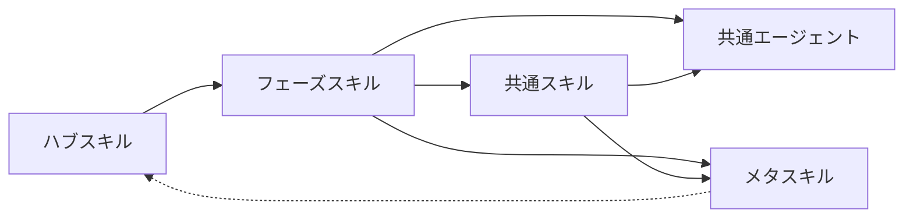

# 04. スキルマップ（機構面の分類定義 + 集計 + 各章への導線）

aide-powers が提供するスキル群を分類で示し、件数を集計する。
個別スキル・エージェントの**手順や役割の詳細は第2章**を参照。

## 1. スキル分類の定義

| 分類 | 定義 |
|---|---|
| ハブスキル | 全スキルの起点。会話開始時に必ず読み込まれ、ワークフロー選択と初期化を司る |
| フェーズスキル | ワークフローの各フェーズに対応するスキル。1ワークフロー = 複数フェーズスキル |
| 共通スキル | 複数のワークフローから呼び出される再利用可能なスキル |
| メタスキル | 運用そのものを支えるスキル（ルール配布・並列処理・セッション引き継ぎ等） |
| 共通エージェント | `agents/` 配下に名前付きで定義されるサブエージェント |

命名規則（フェーズスキルは `fs-{workflow}-phase{N}-{name}` 等）は
[02-ai-agent/02-phase-skills/00-overview.md](../02-ai-agent/02-phase-skills/00-overview.md) と
[03-how-to/add-phase-skill.md](../03-how-to/add-phase-skill.md) を参照。

## 2. ハブスキル（2件）

`using-aide-powers` と `aide-powers-guide`。発動条件と初期アクションは
[01-hub-skill-activation.md](./01-hub-skill-activation.md) を参照。

## 3. フェーズスキル（7ワークフロー / 計45件）

| ワークフロー | フェーズ数 |
|---|---|
| 企画 | 3 |
| 設計 | 10 |
| 実装（GUI モックアップ含む） | 6 |
| 設計逆引き | 5 |
| 変更 | 9 |
| バグ修正 | 6 |
| リファクタリング | 6 |

ワークフローごとのフェーズ流れは [02-ai-agent/01-workflows/00-overview.md](../02-ai-agent/01-workflows/00-overview.md) を、
個別フェーズスキルの責務・手順は [02-ai-agent/02-phase-skills/](../02-ai-agent/02-phase-skills/) を参照。

## 4. 共通スキル（24件）

| 分類 | 件数 | 詳細 |
|---|---|---|
| 設計系（ゲート・QA振り分け・同期等） | 6 | [03-common-skills/design.md](../02-ai-agent/03-common-skills/design.md) |
| 設計プロセス用（要件定義・GUI・DDD等） | 8 | 同上 |
| 実装系（タスク分解・コード規約・多段レビュー等） | 7 | [03-common-skills/impl.md](../02-ai-agent/03-common-skills/impl.md) |
| 運用系（git・進捗・プロファイル等） | 3 | [03-common-skills/infrastructure.md](../02-ai-agent/03-common-skills/infrastructure.md) |

全件名の一覧は [02-ai-agent/03-common-skills/00-overview.md](../02-ai-agent/03-common-skills/00-overview.md) を参照。

## 5. メタスキル（4件）

ワークフロー横断でフェーズ進行と独立に呼ばれる運用スキル。
`rules-distribute` / `task-orchestration` / `session-handover` / `visual-companion`
詳細は [02-ai-agent/03-common-skills/infrastructure.md](../02-ai-agent/03-common-skills/infrastructure.md) を参照。

## 6. 共通エージェント（8件）

`requirements-qa-agent` / `architecture-qa-agent` / `object-design-qa-agent` /
`final-design-qa-agent` / `delta-design-qa-agent` /
`micro-impl-agent` / `design-review-agent` / `code-review-agent`

役割と「ホワイトリスト3エージェント」の定義は [02-ai-agent/04-agents/00-overview.md](../02-ai-agent/04-agents/00-overview.md) を参照。

## 7. 集計

| 区分 | 件数 |
|---|---|
| ハブスキル | 2 |
| フェーズスキル | 45 |
| 共通スキル | 24 |
| メタスキル | 4 |
| **スキル合計** | **75** |
| 共通エージェント | 8 |

スキル数は配布リポジトリの `skills/` 配下のディレクトリ数と一致する。

## 8. 章境界

本ページは**機構面**（分類・件数・配置）に責務を限定する。スキル個別の手順・役割は本章には書かない — 第2章を参照。
追加手順は [03-how-to/](../03-how-to/) を、ルール配布は [05-dynamic-rules.md](./05-dynamic-rules.md) を、配布物の物理配置は [06-execution-units.md](./06-execution-units.md) を参照。
