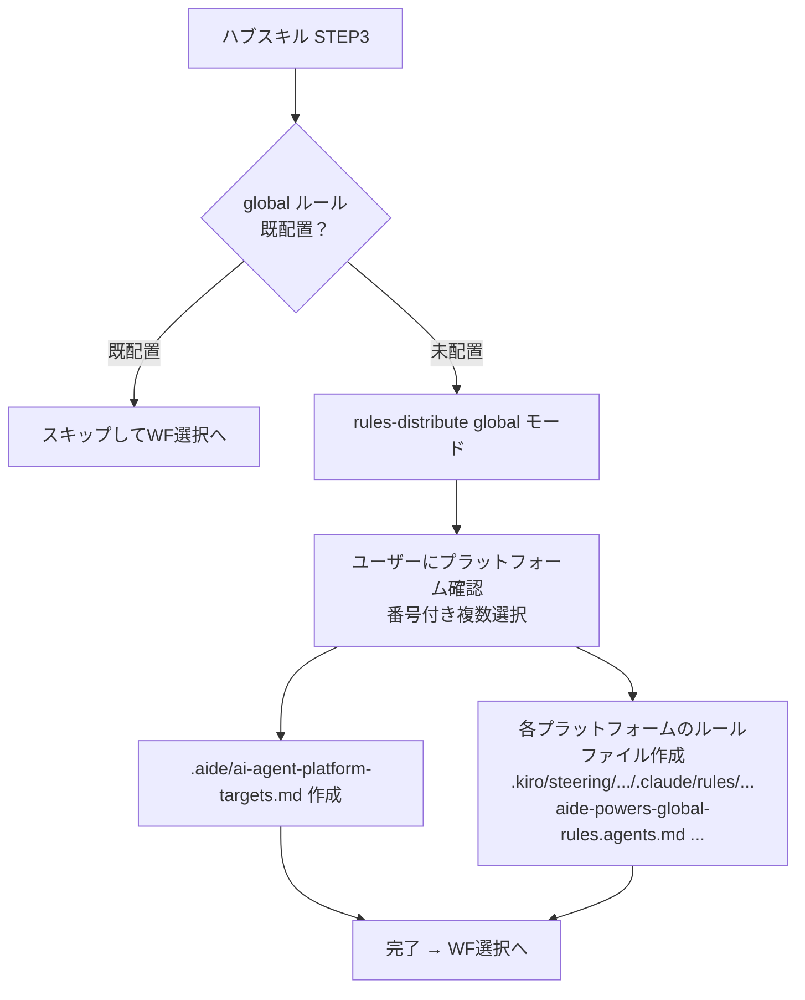
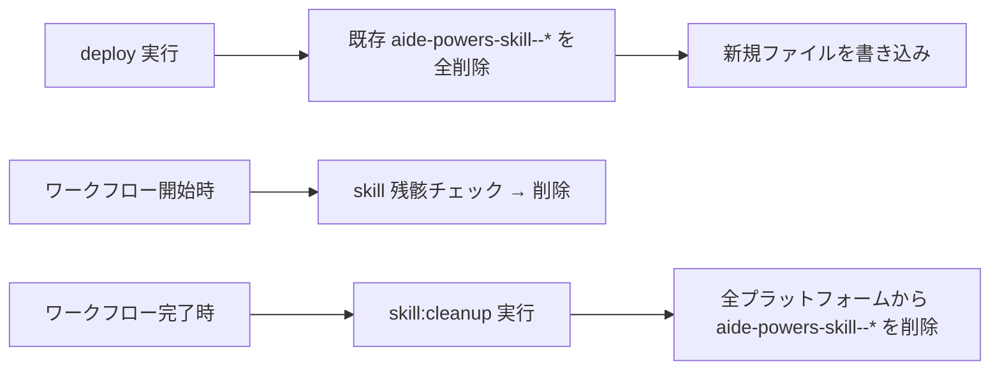
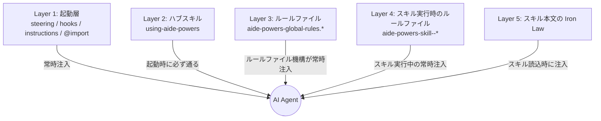

# 05. ルールファイル動的生成（rules-distribute）

aide-powers が AI Agent にルールを徹底させるための中核機構。
プラットフォームのルールファイル機構に直接書き込むことで、AI Agent が「ファイルを読む」ステップ無しでルールが強制適用される状態を作る。

## 1. なぜルールを「ファイル化」するのか

ルールをスキル本文に埋め込んだ場合、次の問題が起きる。

- スキルが activate されない限りルールが効かない
- スキル冒頭で読み飛ばされやすい
- 同じルールを複数スキルにコピペすると更新時に乖離する

これを避けるため、aide-powers はルールを **プラットフォームのルールファイル機構** に直接配置する。
プラットフォーム機構は会話開始時にルールファイルを自動でコンテキストに注入するため、AI Agent はそれを読み込まない選択肢を持たない。スキル側はルール本文を持たず、「ルールはファイル化されているからそれに従え」と前提するだけでよい。

## 2. 2つのモード

`rules-distribute` スキルには2モードある。ライフサイクルが異なる。

| モード | 用途 | ライフサイクル |
|---|---|---|
| **global** | `global-rules.md` の内容を常時適用ルールとして配置 | 常時配置（削除しない） |
| **skill** | スキル個別の Iron Law / ルール / 完了条件 / 禁止事項 を一時配置 | スキル開始時に配置、スキル完了時に削除 |

`skill` モードはさらに2サブモードに分かれる。

| サブモード | 動作 |
|---|---|
| `skill:deploy` | 対象スキルのルールをファイルとして配置 |
| `skill:cleanup` | 対象ファイル（およびワークフロー残骸）を削除 |

## 3. global モードの動作

### 3.1 入力ソース

`.aide/references/global-rules.md`（`using-aide-powers` の STEP 2 でワークスペースにコピー済み）。
このファイルには aide-powers のグローバルルール全文が入っている。

### 3.2 配置先（プラットフォーム別）

| プラットフォーム | 配置ファイル | 形式特徴 |
|---|---|---|
| Kiro IDE / Kiro CLI | `.kiro/steering/aide-powers-global-rules.md` | front-matter `inclusion: always` |
| Claude Code | `.claude/rules/aide-powers-global-rules.md` | front-matter なし |
| Cursor | `.cursor/rules/aide-powers-global-rules.mdc` | front-matter `alwaysApply: true` + `description` |
| OpenCode | プロジェクトルートに `aide-powers-global-rules.agents.md` + `AGENTS.md` の参照行 | プレーン Markdown |
| GitHub Copilot | `.github/instructions/aide-powers-global-rules.instructions.md` | front-matter `applyTo: "**"` |
| Gemini CLI | プロジェクトルートに `aide-powers-global-rules.gemini.md` + `GEMINI.md` の `@import` | プレーン Markdown |
| Codex | プロジェクトルートに `aide-powers-global-rules.agents.md` + `AGENTS.md` の参照行 | プレーン Markdown |

OpenCode と Codex は `aide-powers-global-rules.agents.md` を共有する。
Gemini と Codex / OpenCode は「プロジェクトルートのドキュメントから参照させる」方式で、AGENTS.md / GEMINI.md 自体には参照行が1行追記される（既存内容は破壊しない）。

### 3.3 必須ルール

`global-rules.md` の内容を**全文**配置する。要約・抜粋・項目だけの抽出は禁止されている。各ルールには「なぜそのルールが存在するのか」という説明文や警告文が付随しており、それも含めて配置する。配置直後に出力ファイルの最終行が元ファイルの最終行と一致しているかを確認する規定があり、不一致は再書き込み対象となる。

### 3.4 ai-agent-platform-targets.md の作成

global モード実行時、必ず `.aide/ai-agent-platform-targets.md` を作成する。これはこのワークスペースで使う AI Agent プラットフォームのリスト。`skill:deploy` モードはこのリストを読んで配置対象を決定する。

```markdown
# aide-powers 対象プラットフォーム

## プラットフォーム一覧

- Kiro IDE
- Claude Code
- Codex
```

ユーザーには番号付き選択肢で複数選択可能な形で確認する（`02-multiplatform.md` 参照）。

### 3.5 配置フロー



## 4. skill モードの動作

### 4.1 用途

フェーズスキルや共通スキルが activate されたとき、そのスキル固有の遵守事項（Iron Law / ルール / 完了条件 / 禁止事項）を一時的にプラットフォームのルールファイルとして配置する。これにより、現在実行中のスキル固有ルールが会話冒頭に必ず注入される状態を作る。スキル完了時に削除する。

### 4.2 抽出する範囲

スキルの SKILL.md から下記セクションのみを抽出する。
- `## The Iron Law`
- `## ルール` または `## Rules`
- `## 完了条件`
- `## 禁止事項`

手順・ステップ・Overview・参照ファイル等は含めない。
ルールの目的・必要性（なぜそのルールが存在するか）の説明文も含めて記載する規定がある。

### 4.3 ファイル命名規則

```
aide-powers-skill--{スキル名}--{YYYYMMDDHHmm}
```

例: `aide-powers-skill--fs-design-phase1-user-req--202605151430`

- プレフィックス `aide-powers-skill--` で `rules-distribute` 生成ファイルを識別
- スキル名で「どのスキルのルールか」を判別
- タイムスタンプで残骸検出に利用

### 4.4 配置先（プラットフォーム別）

global モードと同じ配置先で、ファイル名のプレフィックスが `aide-powers-skill--` に変わる。

| プラットフォーム | 配置先 |
|---|---|
| Kiro IDE / Kiro CLI | `.kiro/steering/aide-powers-skill--{name}--{ts}.md` |
| Claude Code | `.claude/rules/aide-powers-skill--{name}--{ts}.md` |
| Cursor | `.cursor/rules/aide-powers-skill--{name}--{ts}.mdc` |
| OpenCode / Codex | プロジェクトルート `aide-powers-skill--{name}--{ts}.agents.md` |
| GitHub Copilot | `.github/instructions/aide-powers-skill--{name}--{ts}.instructions.md` |
| Gemini CLI | プロジェクトルート `aide-powers-skill--{name}--{ts}.gemini.md` + `GEMINI.md` 追記 |

`aide-powers-skill--*` は常に1プラットフォームあたり1ファイルしか存在させない（次節）。


### 4.5 ファイル先頭の目的宣言

skill モードのルールファイル先頭には、自動生成マーカーとは別に **目的宣言** を必ず置く。

```markdown
# {スキル description から取得した目的} のためのルール

> aide-powers の緻密に計算されたプロセスの履行をわずかでも損なうことは、
> 後に大きな不具合の原因となる。ここに記述するルールを厳守しなければならない。
```

`description` は対象スキルの SKILL.md の front-matter から取得する。

## 5. 自動生成マーカー

`rules-distribute` が生成したファイルだけを後から識別・操作できるよう、ファイル内容にマーカーを置く。

| マーカー | 用途 |
|---|---|
| `<!-- [aide-powers:auto-generated] -->` | global モード生成ファイル |
| `<!-- [aide-powers:skill-rule] -->` | skill モード生成ファイル |

これらマーカーが**含まれないファイル**は `rules-distribute` の操作対象にならない。手書きされたルールファイルやユーザー独自のルールファイルを誤って削除しないための保険。

`AGENTS.md` や `GEMINI.md` への参照行追記についても、追記時は既存内容を保持し、参照行のみを末尾付近に1行加える。元コンテンツ破壊は起きない。

## 6. 残骸削除ルール（保険3層）

skill モードで配置したファイルが消し忘れられると、別のスキル実行中も古いルールが効き続けてしまう。これを防ぐため3層の保険が組まれている。



| 保険 | 発動タイミング | 動作 |
|---|---|---|
| A: deploy 時の自動クリーンアップ | `skill:deploy` 実行時 | 同名・別名問わず既存 `aide-powers-skill--*` を削除してから新規配置 |
| B: ワークフロー開始時クリーンアップ | 先頭フェーズスキル起動時 | 配置先に残った `aide-powers-skill--*` を削除 |
| C: ワークフロー完了時クリーンアップ | 最終フェーズスキル完了時 | `skill:cleanup` を実行して残骸を除去 |

これにより `aide-powers-skill--*` は常に「現在実行中のスキル分1ファイル」しか存在しない状態を維持できる。

`skill:cleanup` は次のパターンで削除する。

| プラットフォーム | 削除パターン |
|---|---|
| Kiro | `.kiro/steering/aide-powers-skill--*` |
| Claude Code | `.claude/rules/aide-powers-skill--*` |
| Cursor | `.cursor/rules/aide-powers-skill--*` |
| OpenCode | `aide-powers-skill--*.agents.md` |
| GitHub Copilot | `.github/instructions/aide-powers-skill--*` |
| Gemini CLI | `aide-powers-skill--*.gemini.md` + `GEMINI.md` の対応する `@import` 行を削除 |
| Codex | `aide-powers-skill--*.agents.md` |

Gemini CLI の場合、ファイル削除と同時に `GEMINI.md` から該当 `@import` 行も削除する点に注意。

## 7. 呼び出し側からの起動方法

呼び出しは原則自動。ユーザーが直接コマンドを叩くことはなく、ハブスキルとフェーズスキルから自動的に発動する。

| 呼ばれるタイミング | モード | 呼び出し元 |
|---|---|---|
| 新ワークスペースで初めてスキルが動いたとき | global | `using-aide-powers` STEP 3 |
| `global-rules.md` を更新したいとき | global | ハブスキルが再判定して再実行 |
| フェーズスキル開始時 | `skill:deploy` | フェーズスキル冒頭 |
| 共通スキル開始時 | `skill:deploy` | 共通スキル冒頭 |
| ワークフロー開始時の保険 | `skill:cleanup`（残骸削除） | エントリポイントスキル |
| ワークフロー完了時の保険 | `skill:cleanup` | 最終フェーズスキル |

## 8. .gitignore 推奨

`aide-powers-skill--*` はワークフロー実行中の動的ファイルでコミット不要。
リポジトリには `.gitignore` に下記を追加することが推奨されている。

```
aide-powers-skill--*
```

`aide-powers-global-rules.*` のほうは常時配置のため、コミットするかは利用エンジニアの方針による。チームで共通ルールを共有したいならコミットする、ローカル運用なら `.gitignore` に追加する、という選択になる。

## 9. 忘却対策の全体像

「ルールを毎回スキル冒頭に書いてもAIが守らない」問題を、aide-powers は次の階層で押さえている。



層が複数重なっているのは、どれか1層が突破されても次の層がルールを再注入する設計のため。
特に Layer 3 と Layer 4 は、AI Agent が「自分でファイルを読まない」状態でもルールが効く仕組みであり、aide-powers がプラットフォーム機構の力を借りて忘却を抑止する核心である。

## 10. 章境界の確認

- スキル本文に書かれた Iron Law や禁止事項の **個別内容**は本章の対象外。各スキル固有のルールは第2章（02-ai-agent/）の各フェーズスキル詳細で扱う。
- `rules-distribute` を**改造する**手順や新プラットフォームを追加する手順は第3章（03-how-to/）で扱う。
- 本ページは「rules-distribute がどう動き、aide-powers のルール忘却対策がどう設計されているか」までに留める。
