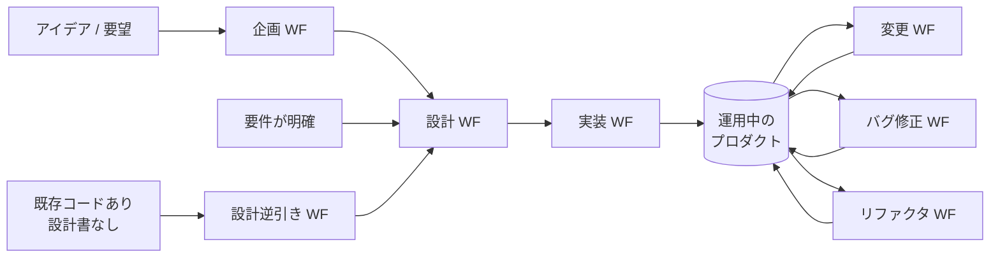

# ワークフロー全体像

aide-powers は7つのワークフローで開発プロセス全体をカバーする。各ワークフローは
複数のフェーズスキル（`fs-` プレフィックス）で構成され、ハブスキル経由で
ユーザー発話から自動選択・起動される。

## 7つのワークフローの関係

- **新規開発の主軸**: 企画 → 設計 → 実装
- **既存資産の取り込み**: 設計逆引き → 設計 →（必要なら実装）
- **運用中の保守**: 変更 / バグ修正 / リファクタリング が並列で動く

## ワークフロー一覧

| 用途 | ワークフロー | エントリポイントスキル | フェーズ数 | QA ゲート |
|---|---|---|---|---|
| アイデア → 企画書 | 企画 | `fs-planning-phase1-intake-and-init` | 4 | なし（探索サイクルでレビュー） |
| 要件 → 設計書一式 | 設計 | `fs-design-phase1-user-req` | 11 | 4ゲート（要件 / アーキテクチャ / オブジェクト / 最終） |
| 設計書 → コード | 実装 | `fs-impl-phase1-gate` | 7（GUI モックアップ任意） | 設計書ゲート + 多段階コードレビュー |
| 既存コード → 設計書 | 設計逆引き | `fs-reverse-phase1-program` | 6（+ オプションフェーズ） | なし |
| 既存コードに機能追加・仕様変更 | 変更 | `fs-change-phase1-analysis` | 3 | 設計書ゲート + 差分設計 QA |
| 既存コードのバグ修正 | バグ修正 | `fs-bugfix-phase1-analysis` | 3 | 設計書ゲート（フェーズ1内） + 差分設計 QA |
| 既存コードのリファクタ | リファクタリング | `fs-refactoring-phase1-status` | 7 | 設計書ゲート + 差分設計 QA + セーフティネット |

## ワークフロー横断で必ず動くもの

7ワークフロー全てで、フェーズスキルの先頭・末尾・節目で同じ共通スキルが呼ばれる。
これらは「メタ処理」としてフェーズの外側に立っている。

| 共通スキル | 呼ばれるタイミング | 役割 |
|---|---|---|
| `progress-resume-check` | フェーズスキル先頭（再開判定） | 進捗ファイルから「次に実行すべきフェーズ」を判定 |
| `rules-distribute`（skill:deploy / skill:cleanup） | フェーズスキル開始時・終了時 | フェーズスキル固有の Iron Law / ルールをプラットフォームのルールファイル機構へ配置・撤去 |
| `doc-index-maintenance` | 設計書・成果物の作成・更新後 | doc-index.md を更新し、設計書ゲートが正しく機能する状態を維持 |
| `git-commit-workflow` | フェーズ完了 / QA APPROVED / ワークフロー完了時 | コミット対象の選別・メッセージ生成・ユーザー承認・コミット実行 |
| `pending-issues-management` | スコープ外の問題発見時 / WF 開始・終了時 | 追加対応事項を pending-issues.md に記録 |
| `user-profile-management` | 初回対話後・対話粒度の調整時 | ユーザーの技術レベルを推定・記録し、説明粒度に反映 |
| `session-handover` | フェーズ完了時・コンテキスト肥大時 | session-handover.md を最新化し、新セッションへの引き継ぎを保証 |
| `task-orchestration` | 大量・複雑タスクの分解が必要なとき | サブエージェントへの並列委譲で分割実行 |

各ワークフロー個別ファイルでは、上記の共通スキルがどのフェーズで呼ばれるかを
省略しつつ、ワークフロー固有の流れに集中して説明する。

## QA 体制の概観

### 設計ワークフローの 4ゲート

設計ワークフローには、フェーズの節目に4つの QA ゲートが置かれている。

| ゲート | 配置 | レビューアー | 検証対象 |
|---|---|---|---|
| ゲート1 | フェーズ3（開発計画書）完了後 | `requirements-qa-agent` | ユーザー要件 / システム要件 / 開発計画書 / 開発環境定義 |
| ゲート2 | フェーズ7（DDD / レイヤード）完了後 | `architecture-qa-agent` | レイヤードアーキテクチャ / GUI 設計 |
| ゲート3 | フェーズ8（オブジェクト設計）完了後 | `object-design-qa-agent` | オブジェクト設計 4 ファイル + ユビキタス言語辞書 |
| ゲート4 | フェーズ10（プログラム構成）完了後 | `final-design-qa-agent` | インフラ IF 設計 / プログラム構成 + 全設計網羅性確認 |

ゲート呼び出しは `design-qa-dispatch` 共通スキルが集中管理する。

### 差分設計の QA（変更 / バグ修正 / リファクタリング）

3 つの差分系ワークフローでは、差分設計書を作るたびに `design-qa-dispatch` 経由で
`delta-design-qa-agent` を必ず呼ぶ。差分が触る設計領域に応じて、
要件 / アーキテクチャ / オブジェクト / 最終の各QAレビューアーエージェントも追加で呼ばれる。

### 実装系の多段階コードレビュー

実装系ワークフロー（実装 / 変更 / バグ修正 / リファクタリング）では、
1 タスクの実装ごとに `multi-stage-code-review` 共通スキル経由で 3エージェント体制が動く:

- `micro-impl-agent` … 実装・修正・テスト作成・テスト実行
- `design-review-agent` … 設計準拠レビュー（外を見る）
- `code-review-agent` … コード品質レビュー（中を見る）

詳細は各ワークフロー個別ファイルおよび `03-common-skills/` を参照。
